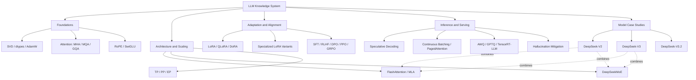

# Large Models Learning
| Model | Key Points |
|:---:|:---:|
| [CLIP](./docs/Large_Models/CLIP.md) | ***Vision-Language Model:*** Contrastive Pre-training, zero-shot transfer, image-text encoder fusion |
| [SigLIP](./docs/Large_Models/SigLIP.md) | ***Vision-Language Model:*** Sigmoid Pairwise Loss, improved training efficiency over CLIP |
| [Gemma 3](./docs/Large_Models/Gemma_3.md) | ***Vision-Language Model (on Decoder-only LLM):*** vision encoder (SigLIP) + [GQA](./docs/Attention_Machanisms/GQA.md) + 5:1 Local/Global Attention Interleaving |
| [DeepSeek-VL](./docs/Large_Models/DeepSeek_VL.md) | ***Vision-Language Model (on Decoder-only LLM):*** Hybrid vision encoder (SigLIP semantic + SAM-B high-res details) → fixed-token high-res processing, gradual modality-balanced pretraining to preserve language strength |
| [DeepSeek-VL2](./docs/Large_Models/DeepSeek_VL2.md) | ***Vision-Language Model (MoE Decoder-only LLM):*** Single SigLIP dynamic tiling (global thumbnail + local tiles) → arbitrary high-res/aspect ratios with controlled tokens, DeepSeekMoE backbone with MLA |
| [DeepSeek-V2](./docs/Large_Models/DeepSeek_V2.md) | ***Decoder-only Transformer:*** [MLA](./docs/Attention_Machanisms/MLA.md) + [DeepSeekMoE](./docs/MoE/DeepSeekMoE.md) |
| [DeepSeek-V3](./docs/Large_Models/DeepSeek_V3.md) | ***Decoder-only Transformer:*** [MLA](./docs/Attention_Machanisms/MLA.md) + [DeepSeekMoE](./docs/MoE/DeepSeekMoE.md) with **auxiliary-loss-free** + Multi-token prediction (MTP) |
| [DeepSeek-V3.2](./docs/Large_Models/DeepSeek_V32.md) | ***Decoder-only Transformer (Long-Context + Agentic RL):*** **DeepSeek Sparse Attention (DSA)** (Lightning Indexer → Top-k KV selection; O(L·k) core attention for 128K) + MLA; **MQA-mode** integration for efficient sparse KV sharing + **scaled post-training RL (GRPO)** (>10% pretrain compute) + large-scale **agent/tool-use task synthesis** (verified environments) |
| [DeepSeek-R1](./docs/Large_Models/DeepSeek_R1.md) | ***Reasoning MoE on DeepSeek-V3-Base:*** **R1-Zero** shows pure RL can induce long-CoT reasoning; **R1** adds cold-start SFT + multi-stage RL to improve readability, language consistency, and general assistant behavior |

---

# LLM Knowledge System
A topic-based map of this repo. This section is organized by knowledge domains rather than learning phases.

## Visual Map


The diagram gives a high-level overview; the sections below act as the detailed index.

| Domain | Focus | Core Topics |
|:---|:---|:---|
| Foundations | Math, optimization, and Transformer building blocks | SVD, dtypes, AdamW, MHA/MQA/GQA, RoPE, SwiGLU |
| Architecture & Scaling | Efficient training and large-scale model design | FlashAttention, MLA, DeepSeekMoE, TP/PP/EP |
| Adaptation & Alignment | Task adaptation and preference learning | LoRA family, SFT, RLHF, DPO, PPO, GRPO |
| Inference & Serving | Latency, memory, and deployment efficiency | Speculative Decoding, Continuous Batching, Quantization, TensorRT-LLM, Hallucination Mitigation |

## 1. Foundations
- Math and numerical basics: [SVD](./docs/Math/SVD.md), [dtypes](./docs/Math/dtypes.md), [AdamW](./docs/Optimizer/AdamW.md)
- Attention mechanisms: [SVD + Attention](./docs/Attention_Machanisms/SVD_Attention.md), [MHA](./docs/Attention_Machanisms/MHA.md), [MQA](./docs/Attention_Machanisms/MQA.md), [GQA](./docs/Attention_Machanisms/GQA.md)
- Position and FFN blocks: [RoPE](./docs/Position_Embeding/RoPE.md), [SwiGLU](./docs/Activation_Layers/SwiGLU.md)

## 2. Architecture & Scaling
- Efficient attention: [FlashAttention](./docs/Attention_Machanisms/FlashAttention.md), [MLA](./docs/Attention_Machanisms/MLA.md)
- Sparse architecture: [DeepSeekMoE](./docs/MoE/DeepSeekMoE.md)
- Distributed training: [TP](./docs/Parallelism/TP.md), [PP](./docs/Parallelism/PP.md), [EP](./docs/Parallelism/EP.md) (`In Progress`)

## 3. Adaptation & Alignment
- PEFT: [LoRA](./docs/PEFT/LoRA.md), [QLoRA](./docs/PEFT/QLoRA.md), [DoRA](./docs/PEFT/DoRA.md), [Specialized LoRA Variants](./docs/PEFT/Specialized_LoRA.md)
- Supervised and preference alignment: [SFT](./docs/Preference_Alignment/SFT.md), [RLHF](./docs/Preference_Alignment/RLHF.md), [DPO](./docs/Preference_Alignment/DPO.md), [PPO](./docs/Preference_Alignment/PPO.md), [GRPO](./docs/Preference_Alignment/GRPO.md)

## 4. Inference & Serving
- Decoding acceleration: [Speculative Decoding (Medusa/Lookahead)](./docs/Inference_Optimization/speculative_decoding.md)
- Serving systems: [Continuous Batching & PagedAttention](./docs/Inference_Optimization/continuous_batching.md), [TensorRT-LLM & Multi-LoRA Serving](./docs/Inference_Optimization/tensorrt_multilora.md)
- Compression and reliability: [Post-Training Quantization (AWQ/GPTQ)](./docs/Inference_Optimization/quantization_inference.md), [Hallucination Mitigation at Inference](./docs/Inference_Optimization/hallucination_mitigation.md)

---

# File Structure of /docs
```text
docs/
|-- Activation_Layers/
|   `-- SwiGLU.md
|-- Attention_Machanisms/
|   |-- FlashAttention.md
|   |-- GQA.md
|   |-- MHA.md
|   |-- MLA.md
|   |-- MQA.md
|   `-- SVD_Attention.md
|-- Inference_Optimization/
|   |-- continuous_batching.md
|   |-- hallucination_mitigation.md
|   |-- quantization_inference.md
|   |-- speculative_decoding.md
|   `-- tensorrt_multilora.md
|-- Large_Models/
|   |-- CLIP.md
|   |-- DeepSeek_R1.md
|   |-- DeepSeek_V2.md
|   |-- DeepSeek_V3.md
|   |-- DeepSeek_V32.md
|   |-- DeepSeek_VL.md
|   |-- DeepSeek_VL2.md
|   |-- Gemma_3.md
|   `-- SigLIP.md
|-- Math/
|   |-- SVD.md
|   `-- dtypes.md
|-- MoE/
|   `-- DeepSeekMoE.md
|-- Optimizer/
|   `-- AdamW.md
|-- PEFT/
|   |-- DoRA.md
|   |-- LoRA.md
|   |-- QLoRA.md
|   `-- Specialized_LoRA.md
|-- Parallelism/
|   |-- EP.md
|   |-- PP.md
|   `-- TP.md
|-- Position_Embeding/
|   `-- RoPE.md
|-- Preference_Alignment/
|   |-- DPO.md
|   |-- GRPO.md
|   |-- PPO.md
|   |-- RLHF.md
|   `-- SFT.md
`-- Resource/
    |-- Text_Color_Table.md
    `-- pics/
        `-- ...
```

---

# Learning Resource Recommendation
- [Datawhale/happy-llm](https://github.com/datawhalechina/happy-llm)
- [LLM 八股文](https://my.feishu.cn/wiki/XGkRwrugwisqaokx909caQ4anEb)
