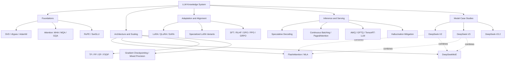

# Large Models Learning
| Model | Key Points |
|:---:|:---:|
| [CLIP](./docs/Large_Models/CLIP.md) | ***Vision-Language Model:*** Contrastive Pre-training, zero-shot transfer, image-text encoder fusion |
| [SigLIP](./docs/Large_Models/SigLIP.md) | ***Vision-Language Model:*** Sigmoid Pairwise Loss, improved training efficiency over CLIP |
| [SmolVLM](./docs/Large_Models/SmolVLM.md) | ***Small Vision-Language Model:*** SigLIP + SmolLM2, pixel-shuffle visual token compression, image splitting, video SFT, edge/WebGPU-friendly inference |
| [Gemma 3](./docs/Large_Models/Gemma_3.md) | ***Vision-Language Model (on Decoder-only LLM):*** vision encoder (SigLIP) + [GQA](./docs/Attention_Machanisms/GQA.md) + 5:1 Local/Global Attention Interleaving |
| [Gemma 4](./docs/Large_Models/Gemma_4.md) | ***Multimodal Open Model Family:*** Hybrid local/global attention + Per-Layer Embeddings (PLE) + variable-resolution vision token budgets + Dense / MoE deployment scaling |
| [DeepSeek-VL](./docs/Large_Models/DeepSeek_VL.md) | ***Vision-Language Model (on Decoder-only LLM):*** Hybrid vision encoder (SigLIP semantic + SAM-B high-res details) → fixed-token high-res processing, gradual modality-balanced pretraining to preserve language strength |
| [DeepSeek-VL2](./docs/Large_Models/DeepSeek_VL2.md) | ***Vision-Language Model (MoE Decoder-only LLM):*** Single SigLIP dynamic tiling (global thumbnail + local tiles) → arbitrary high-res/aspect ratios with controlled tokens, DeepSeekMoE backbone with MLA |
| [DeepSeek-V2](./docs/Large_Models/DeepSeek_V2.md) | ***Decoder-only Transformer:*** [MLA](./docs/Attention_Machanisms/MLA.md) + [DeepSeekMoE](./docs/MoE/DeepSeekMoE.md) |
| [DeepSeek-V3](./docs/Large_Models/DeepSeek_V3.md) | ***Decoder-only Transformer:*** [MLA](./docs/Attention_Machanisms/MLA.md) + [DeepSeekMoE](./docs/MoE/DeepSeekMoE.md) with **auxiliary-loss-free** + Multi-token prediction (MTP) |
| [DeepSeek-V3.2](./docs/Large_Models/DeepSeek_V32.md) | ***Decoder-only Transformer (Long-Context + Agentic RL):*** **DeepSeek Sparse Attention (DSA)** (Lightning Indexer → Top-k KV selection; O(L·k) core attention for 128K) + MLA; **MQA-mode** integration for efficient sparse KV sharing + **scaled post-training RL (GRPO)** (>10% pretrain compute) + large-scale **agent/tool-use task synthesis** (verified environments) |
| [DeepSeek-R1](./docs/Large_Models/DeepSeek_R1.md) | ***Reasoning MoE on DeepSeek-V3-Base:*** **R1-Zero** shows pure RL can induce long-CoT reasoning; **R1** adds cold-start SFT + multi-stage RL to improve readability, language consistency, and general assistant behavior |

---

# LLM Knowledge System
A topic-based map of this repo. This section is organized by knowledge domains rather than learning phases.

## Visual Map

```mermaid
flowchart TD
    A[LLM Knowledge System]

    A --> B[Foundations]
    A --> C[Architecture and Scaling]
    A --> D[Adaptation and Alignment]
    A --> E[Inference and Serving]
    A --> G[Model Case Studies]

    B --> B1[SVD / dtypes / AdamW]
    B --> B2[Attention: MHA / MQA / GQA]
    B --> B3[RoPE / SwiGLU]

    C --> C1[FlashAttention / MLA]
    C --> C2[DeepSeekMoE]
    C --> C3[TP / PP / EP / FSDP]
    C --> C4[Gradient Checkpointing / Mixed Precision]

    D --> D1[LoRA / QLoRA / DoRA]
    D --> D2[Specialized LoRA Variants]
    D --> D3[SFT / RLHF / DPO / PPO / GRPO]

    E --> E1[Speculative Decoding]
    E --> E2[Continuous Batching / PagedAttention]
    E --> E3[AWQ / GPTQ / TensorRT-LLM]
    E --> E4[Hallucination Mitigation]

    G --> G1[DeepSeek-V2]
    G --> G2[DeepSeek-V3]
    G --> G3[DeepSeek-V3.2]

    G1 -. combines .-> C1
    G1 -. combines .-> C2
    G2 -. combines .-> C1
    G2 -. combines .-> C2
```

The diagram gives a high-level overview; the sections below act as the detailed index.

| Domain | Focus | Core Topics |
|:---|:---|:---|
| Foundations | Math, optimization, losses, normalization, and Transformer building blocks | SVD, dtypes, AdamW, learning rate schedulers, Sigmoid, GELU, LayerNorm, RMSNorm, BatchNorm, GroupNorm, MHA/MQA/GQA, RoPE, SwiGLU |
| Architecture & Scaling | Efficient training and large-scale model design | FlashAttention, MLA, DeepSeekMoE, TP/PP/EP/FSDP, Gradient Checkpointing, Mixed Precision Training |
| Adaptation & Alignment | Task adaptation and preference learning | LoRA family, SFT, RLHF, DPO, PPO, GRPO |
| Agent Systems | Retrieval, memory, tool use, API interfaces, and task orchestration | Agent Basics, Memory Systems, RAG Systems, OpenAI API Interfaces |
| Inference & Serving | Latency, memory, and deployment efficiency | Speculative Decoding, Continuous Batching, Quantization, TensorRT-LLM, Hallucination Mitigation |
| VLA & Robotics | Vision-language-action policies, embodied datasets, and robot control | LIBERO, Open X-Embodiment, ACT, Diffusion Policy, Octo, RT-1, RT-2, OpenVLA, pi0, pi0-FAST, Real-Time Chunking, SmolVLA |

## 1. Foundations
- Math and numerical basics: [SVD](./docs/Math/SVD.md), [dtypes](./docs/Math/dtypes.md), [Memory Estimation](./docs/Math/Memory_Estimation.md), [AdamW](./docs/Optimizer/AdamW.md), [Learning Rate Schedulers](./docs/Scheduler/Scheduler_Basics.md)
- Activation basics: [Sigmoid](./docs/Activation_Layers/Sigmoid.md), [GELU](./docs/Activation_Layers/GELU.md)
- Normalization basics: [LayerNorm](./docs/Norm/LayerNorm.md), [RMSNorm](./docs/Norm/RMSNorm.md), [BatchNorm](./docs/Norm/BatchNorm.md), [GroupNorm](./docs/Norm/GroupNorm.md)
- Attention mechanisms: [SVD + Attention](./docs/Attention_Machanisms/SVD_Attention.md), [MHA](./docs/Attention_Machanisms/MHA.md), [MQA](./docs/Attention_Machanisms/MQA.md), [GQA](./docs/Attention_Machanisms/GQA.md)
- Position and FFN blocks: [Sinusoidal Position Embedding](./docs/Position_Embeding/Sinusoidal_Position_Embedding.md), [RoPE](./docs/Position_Embeding/RoPE.md), [SwiGLU](./docs/Activation_Layers/SwiGLU.md)

## 2. Architecture & Scaling
- Efficient attention: [FlashAttention](./docs/Attention_Machanisms/FlashAttention.md), [MLA](./docs/Attention_Machanisms/MLA.md)
- Sparse architecture: [DeepSeekMoE](./docs/MoE/DeepSeekMoE.md)
- Training memory and numerics: [Gradient Checkpointing](./docs/Training_Optimization/Gradient_Checkpointing.md), [Mixed Precision Training](./docs/Training_Optimization/Mixed_Precision_Training.md)
- Distributed training: [TP](./docs/Parallelism/TP.md), [PP](./docs/Parallelism/PP.md), [EP](./docs/Parallelism/EP.md), [FSDP](./docs/Parallelism/FSDP.md)

## 3. Adaptation & Alignment
- PEFT: [LoRA](./docs/PEFT/LoRA.md), [QLoRA](./docs/PEFT/QLoRA.md), [DoRA](./docs/PEFT/DoRA.md), [Specialized LoRA Variants](./docs/PEFT/Specialized_LoRA.md)
- Supervised and preference alignment: [SFT](./docs/Preference_Alignment/SFT.md), [RLHF](./docs/Preference_Alignment/RLHF.md), [DPO](./docs/Preference_Alignment/DPO.md), [PPO](./docs/Preference_Alignment/PPO.md), [GRPO](./docs/Preference_Alignment/GRPO.md)

## 4. Inference & Serving
- Decoding acceleration: [Speculative Decoding (Medusa/Lookahead)](./docs/Inference_Optimization/speculative_decoding.md)
- Serving systems: [Continuous Batching & PagedAttention](./docs/Inference_Optimization/continuous_batching.md), [TensorRT-LLM & Multi-LoRA Serving](./docs/Inference_Optimization/tensorrt_multilora.md)
- Compression and reliability: [Post-Training Quantization (AWQ/GPTQ)](./docs/Inference_Optimization/quantization_inference.md), [Hallucination Mitigation at Inference](./docs/Inference_Optimization/hallucination_mitigation.md)

## 5. Agent Systems
- Core concepts: [Agent Systems Basics](./docs/Agent_Systems/Agent_Basics.md)
- Memory design: [Memory Systems for Agents](./docs/Agent_Systems/Memory_Systems.md)
- Retrieval grounding: [RAG Systems](./docs/Agent_Systems/RAG_Systems.md)
- Reusable task methods: [Skill Systems](./docs/Agent_Systems/Skill_Systems.md)
- Tool architecture: [Tool Registry and Function Calling](./docs/Agent_Systems/Tool_Registry_and_Function_Calling.md)
- API interface format: [OpenAI API Interface Format](./docs/Agent_Systems/OpenAI_API_Interface_Format.md)
- Protocol layer: [Model Context Protocol (MCP)](./docs/Agent_Systems/MCP_Protocol.md)

## 6. VLA & Robotics
- Embodied dataset foundations and benchmarks: [LIBERO](./docs/VLAs/LIBERO.md), [Open X-Embodiment](./docs/VLAs/Open_X_Embodiment.md)
- Vision-language-action and robot policy papers: [ACT / ALOHA](./docs/VLAs/ACT.md), [Diffusion Policy](./docs/VLAs/Diffusion_Policy.md), [Octo](./docs/VLAs/Octo.md), [RT-1](./docs/VLAs/RT_1.md), [RT-2](./docs/VLAs/RT_2.md), [OpenVLA](./docs/VLAs/OpenVLA.md), [pi0](./docs/VLAs/Pi_0.md), [pi0-FAST](./docs/VLAs/Pi_0_FAST.md), [Real-Time Chunking](./docs/VLAs/RTC.md), [SmolVLA](./docs/VLAs/SmolVLA.md)

---

# File Structure
```text
.
|-- assets/
|   `-- ...
`-- docs/
    |-- Agent_Systems/
    |   |-- Agent_Basics.md
    |   |-- MCP_Protocol.md
    |   |-- Memory_Systems.md
    |   |-- OpenAI_API_Interface_Format.md
    |   |-- RAG_Systems.md
    |   |-- Skill_Systems.md
    |   `-- Tool_Registry_and_Function_Calling.md
    |-- Activation_Layers/
    |   |-- GELU.md
    |   |-- Sigmoid.md
    |   `-- SwiGLU.md
    |-- Attention_Machanisms/
    |   |-- FlashAttention.md
    |   |-- GQA.md
    |   |-- MHA.md
    |   |-- MLA.md
    |   |-- MQA.md
    |   `-- SVD_Attention.md
    |-- Inference_Optimization/
    |   |-- continuous_batching.md
    |   |-- hallucination_mitigation.md
    |   |-- quantization_inference.md
    |   |-- speculative_decoding.md
    |   `-- tensorrt_multilora.md
    |-- Large_Models/
    |   |-- CLIP.md
    |   |-- DeepSeek_R1.md
    |   |-- DeepSeek_V2.md
    |   |-- DeepSeek_V3.md
    |   |-- DeepSeek_V32.md
    |   |-- DeepSeek_VL.md
    |   |-- DeepSeek_VL2.md
    |   |-- Gemma_3.md
    |   |-- Gemma_4.md
    |   |-- SigLIP.md
    |   `-- SmolVLM.md
    |-- Math/
    |   |-- Memory_Estimation.md
    |   |-- SVD.md
    |   `-- dtypes.md
    |-- MoE/
    |   `-- DeepSeekMoE.md
    |-- Norm/
    |   |-- BatchNorm.md
    |   |-- GroupNorm.md
    |   |-- RMSNorm.md
    |   `-- LayerNorm.md
    |-- Optimizer/
    |   `-- AdamW.md
    |-- PEFT/
    |   |-- DoRA.md
    |   |-- LoRA.md
    |   |-- QLoRA.md
    |   `-- Specialized_LoRA.md
    |-- Parallelism/
    |   |-- EP.md
    |   |-- FSDP.md
    |   |-- PP.md
    |   `-- TP.md
    |-- Position_Embeding/
    |   |-- RoPE.md
    |   `-- Sinusoidal_Position_Embedding.md
    |-- Preference_Alignment/
    |   |-- DPO.md
    |   |-- GRPO.md
    |   |-- PPO.md
    |   |-- RLHF.md
    |   `-- SFT.md
    |-- Scheduler/
    |   |-- Cyclical_and_Restart.md
    |   |-- LLM_Training_Recipes.md
    |   |-- Metric_Adaptive.md
    |   |-- Scheduler_Basics.md
    |   `-- Warmup_and_Decay.md
    |-- Training_Optimization/
    |   |-- Gradient_Checkpointing.md
    |   `-- Mixed_Precision_Training.md
    `-- VLAs/
        |-- ACT.md
        |-- Diffusion_Policy.md
        |-- LIBERO.md
        |-- Octo.md
        |-- Open_X_Embodiment.md
        |-- RT_1.md
        |-- RT_2.md
        |-- OpenVLA.md
        |-- Pi_0.md
        |-- Pi_0_FAST.md
        |-- RTC.md
        `-- SmolVLA.md
```

---

# Learning Resource Recommendation
- [Datawhale/happy-llm](https://github.com/datawhalechina/happy-llm)
- [Datawhale/hello-agents](https://github.com/datawhalechina/Hello-Agents)
- [Datawhale/all-in-rag](https://github.com/datawhalechina/all-in-rag)
