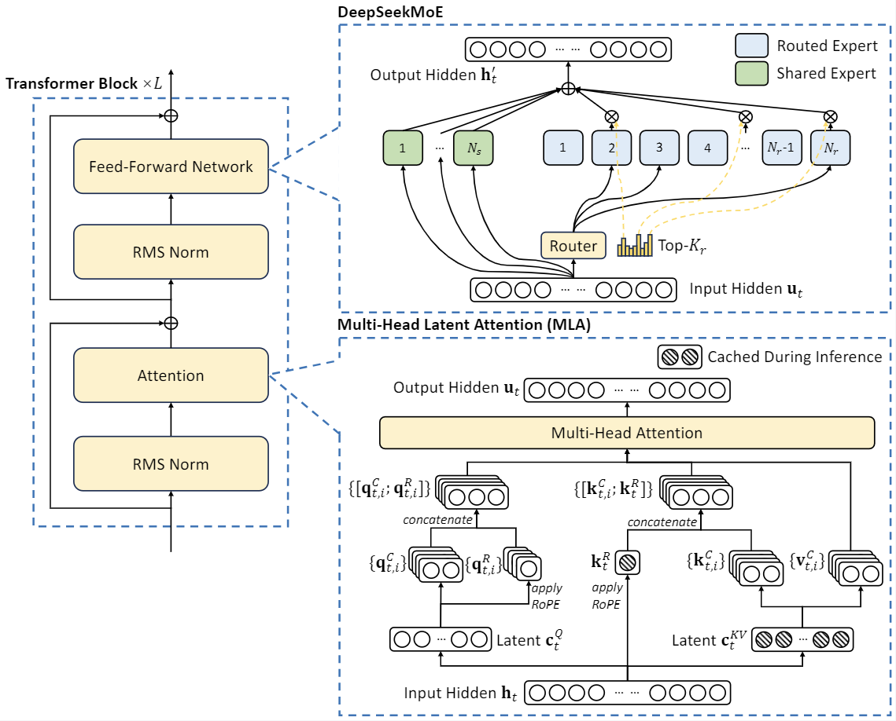

# Multi-head Latent Attention (MLA)


## Overview & Role

* **What is MLA?** An innovative attention mechanism in DeepSeek-V2 (2024 paper Section 2.1) to boost inference efficiency while maintaining or improving performance.
    * Replaces standard Multi-Head Attention (MHA)
    * Key goal: Slash KV cache memory (bottleneck for long contexts/batching) without trade-offs like GQA/MQA
* **Core Idea:** Compress Key/Value (KV) jointly into a <span style="color: aqua">low-rank latent vector</span> per token + small <span style="color: aqua">decoupled RoPE</span> part.
    * Cache only compressed (tiny!)
    * Reconstruct full KV on-the-fly during attention
* **Real-World Impact:** Enables 128K context, 5.76× higher generation throughput vs. dense DeepSeek 67B, ~93.3% KV reduction

## Historical Context

* **Problem:** Standard MHA KV cache grows O(seq_len) → limits long prompts/batches
* **Prior fixes:** MQA/GQA (share KV heads) → reduce cache but hurt performance
* **MLA innovation:** Low-rank compression (like bottleneck) + decoupled RoPE → best of both (efficiency + quality)
* **Evolution:** Builds on attention compression ideas; influences later models (e.g., V3 sparse extensions)

## Key Components & How It Works

MLA processes hidden_states → Q (full) + compressed KV latent + small rope part → attention with tiny cache.

* **Input:** hidden_states [batch, seq_len, hidden_size] (seq_len varies: full for prefill/training, 1 for decode current)
* **Output:** Attended [batch, seq_len, hidden_size] (after o_proj)

### Low-Rank KV Joint Compression (Core Savings)

* **Why?** Full K/V too big for cache → compress jointly to low-rank latent (bottleneck encodes nope K + V)

* **Simple Steps:**
    * Down-project hidden → compressed latent (kv_lora_rank dim, e.g., 512–1024)
    * Latent encodes K_nope + V together
    * Up-project latent → reconstruct nope K + V
    * Formula (simplified): `Latent = W_down @ [K || V]; Reconstruct = W_up @ Latent`

* **Specific Steps (Pseudo code from vLLM wrapper/kernel):**

```python
# Current token hidden [batch, seq_len=1 or full, hidden_size]
kv_lora = kv_a_proj_with_mqa(hidden_states)  # Down-project to [batch, seq, kv_lora_rank + qk_rope_head_dim]

kv_c, k_pe = split(kv_lora, [kv_lora_rank, qk_rope_head_dim])  
# kv_c: latent [batch, seq, kv_lora_rank]
# k_pe: small rope [batch, seq, qk_rope_head_dim]

kv_c_normed = kv_a_layernorm(kv_c)  # Normalize latent for stability

# Cache append: Only kv_c_normed (latent) + k_pe (rope) → tiny per token!
cache.append(kv_c_normed, k_pe)
```

* **Reconstruction (On-the-Fly in Kernel):**

```python
# For past tokens (from cache):
past_kv_c_normed = cache.get_past_latents()
past_K_nope, past_V = kv_b_proj(past_kv_c_normed)  # Up-project → [past_seq, heads, qk_nope_head_dim + v_head_dim]

past_k_pe = cache.get_past_rope()
past_K_rope = apply_rotary_emb(past_k_pe)  # Only small dim

full_past_K = concat(past_K_nope, past_K_rope)  # Concat/add along head_dim
full_past_V = past_V

# Current: Same up-project from input kv_c_normed + k_pe RoPE
```

* **Example Shapes (batch=1, seq=1 current, past_seq=1000):**
    * `kv_c_normed`: [1, 1, 1024] (latent)
    * `k_pe`: [1, 1, 128] (rope)
    * Cache per token: ~1152 floats vs. full MHA ~8192+
    * Reconstruct past: Transient full K/V only during attn

### Decoupled Rotary Position Embedding

* **Why decoupled?** Standard RoPE on full dim incompatible with compression (can't rotate latent). Split:
    * `nope`: Large dim (~90% head), position-invariant → from latent reconstruct
    * `pe/rope`: Small dim (~10%), position-sensitive → separate small vector + RoPE

* **Simple Steps:**
    * Split `head_dim = qk_nope_head_dim` (large, no RoPE) + `qk_rope_head_dim` (small, RoPE)
    * Apply RoPE only to small pe/rope part
    * Why decoupled? Compression compatible (nope from latent), efficient prefix caching (rope recomputable)

* **Specific Steps (Pseudo code):**

```python
# Q path (full, split after proj)
q = q_proj(hidden_states)  # [batch, seq, heads * qk_head_dim]
q_nope, q_pe = split(q, [qk_nope_head_dim, qk_rope_head_dim])  # nope large, pe small

# Apply RoPE only to pe parts
q_pe_rope, k_pe_rope = rotary_emb(positions, q_pe, k_pe)  # Small dim rotate

full_Q = concat(q_nope, q_pe_rope)  # No RoPE on nope!
full_current_K = concat(current_K_nope, k_pe_rope)
```

* **Benefit Example:** Past nope K from latent (static/cache-friendly), pe RoPE from positions (dynamic but cheap/small)

### Full Process Flow (vLLM impl overview)

```python
def mla_attention(hidden_states, positions, past_cache):
    # Projections & Compression (wrapper)
    q = q_proj(hidden_states)  # Full Q
    kv_lora = kv_down_proj(hidden_states)
    kv_c_normed, k_pe = split_and_norm(kv_lora)
    
    # Cache append current
    past_cache.append(kv_c_normed, k_pe)
    
    # Decoupled RoPE
    q_nope, q_pe = split(q)
    q_pe, k_pe = rotary_emb(positions, q_pe, k_pe)  # Only small
    full_q = concat(q_nope, q_pe)
    
    # Kernel reconstruct past
    past_K_nope, past_V = up_proj(past_cache.latents)
    past_K_pe = rotary_emb(past_positions, past_cache.rope_pe)
    full_past_K = concat(past_K_nope, past_K_pe)
    
    # Full K/V = past + current
    full_K = concat(full_past_K, current_K)
    full_V = concat(past_V, current_V)
    
    # Standard attn
    scores = full_q @ full_K.transpose() * scale
    weights = softmax(scores, causal_mask_via_metadata)
    out = weights @ full_V
    
    return o_proj(out)  # Back to hidden_size
```

### Diagram Description

```
Hidden → Q Proj (full) ──split──► nope (large, no RoPE) ──► concat ──► Full Q
              │
              └─ KV Down ──split──► kv_c_normed (latent, norm) ──► Cache + Reconstruct nope K/V
                                    ► k_pe (small) ──► RoPE ──► rope K
```

**Cache:** Tiny (latent rank + rope dim per token) vs. full head_dim in MHA.

## Benefits, Trade-offs & Comparisons

| Aspect | Standard MHA/GQA | MLA (DeepSeek-V2) |
|--------|-----------------|-------------------|
| KV Cache Size | Full (100%) | ~6.7% (~93% reduction) |
| Performance | Baseline | Better (low-rank regularization) |
| Long Context | Memory-limited | Excellent (128K efficient) |
| Compute Overhead | Baseline | Slight reconstruct (low rank → cheap) |
| Trade-off | None or quality drop (GQA) | Design complexity, minor overhead |

* **Why better performance?** Low-rank acts as regularizer (forces important info), empirical ablations show gain
* **Edge cases:** Short contexts → overhead negligible; ultra-long → reconstruct grows but still wins vs. OOM
* **Broader implications:** Enables MoE scaling (experts VRAM-heavy, KV tiny) → strong open-source (top MMLU with few active params)