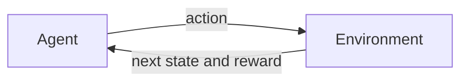
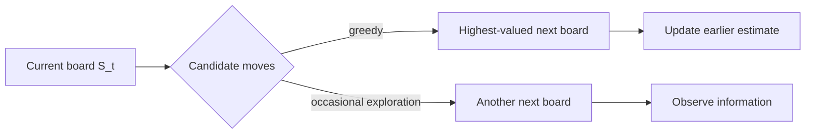

# Reinforcement Learning: An Introduction

> Chapter-by-chapter notes on reinforcement learning as goal-directed learning through interaction. The notes emphasize the problem formulation, mathematical definitions, algorithmic ideas, and distinctions that are easy to confuse.

**Reference:** Richard S. Sutton and Andrew G. Barto, *Reinforcement Learning: An Introduction*, second edition, MIT Press, 2018 (2020 printing). See the authors' [book page](http://incompleteideas.net/book/the-book-2nd.html) for supporting material.

## Book Catalog

| Part | Chapter | Topic | Note status |
|:--:|:--:|:--|:--:|
| Foundations | 1 | [Introduction](#chapter-1-introduction) | Complete |
| I | 2 | Multi-armed Bandits | Not started |
| I | 3 | Finite Markov Decision Processes | Not started |
| I | 4 | Dynamic Programming | Not started |
| I | 5 | Monte Carlo Methods | Not started |
| I | 6 | Temporal-Difference Learning | Not started |
| I | 7 | $n$-step Bootstrapping | Not started |
| I | 8 | Planning and Learning with Tabular Methods | Not started |
| II | 9 | On-policy Prediction with Approximation | Not started |
| II | 10 | On-policy Control with Approximation | Not started |
| II | 11 | Off-policy Methods with Approximation | Not started |
| II | 12 | Eligibility Traces | Not started |
| II | 13 | Policy Gradient Methods | Not started |
| III | 14 | Psychology | Not started |
| III | 15 | Neuroscience | Not started |
| III | 16 | Applications and Case Studies | Not started |
| III | 17 | Frontiers | Not started |

## Chapter 1 Catalog

| Section | Topic |
|:--|:--|
| 1.1 | [What Reinforcement Learning Is](#11-what-reinforcement-learning-is) |
| 1.2 | [The Interaction Problem](#12-the-interaction-problem) |
| 1.3 | [Elements of an RL System](#13-elements-of-an-rl-system) |
| 1.4 | [Scope and Assumptions](#14-scope-and-assumptions) |
| 1.5 | [Tic-Tac-Toe as a Minimal RL Example](#15-tic-tac-toe-as-a-minimal-rl-example) |
| 1.6 | [Three Historical Threads](#16-three-historical-threads) |
| 1.7 | [Common Confusions](#17-common-confusions) |
| 1.8 | [Formula Sheet](#18-formula-sheet) |
| 1.9 | [Understanding Checklist](#19-understanding-checklist) |

---

## Chapter 1: Introduction

Reinforcement learning (RL) studies how an agent can improve goal-directed behavior through interaction. The agent is not given the correct action for every situation and may not know how the environment works. It must learn from the consequences of its own decisions.

Two features define the central difficulty:

- **Trial-and-error search:** useful actions must be discovered through experience.
- **Delayed consequences:** an action can change later states, opportunities, and rewards, not just the next reward.

### 1.1 What Reinforcement Learning Is

The term **reinforcement learning** can refer to three related but distinct things:

| Meaning | Question |
|:--|:--|
| A problem | How should an agent act to maximize long-term reward in an uncertain environment? |
| A family of methods | How can experience be used to learn effective behavior? |
| A research field | What principles and algorithms solve such sequential decision problems? |

Keeping the **problem** separate from a particular **solution method** is essential. A Markov decision process describes an RL problem; Q-learning, policy gradients, and planning are different methods that may solve it.

#### Relationship to other learning paradigms

| Paradigm | Learning signal | Primary objective |
|:--|:--|:--|
| Supervised learning | Correct target for each example | Predict the supplied target on new data |
| Unsupervised learning | Unlabeled observations | Discover structure in data |
| Reinforcement learning | Rewards produced by interaction | Choose actions that maximize long-term cumulative reward |

A reward is **not** a label for the correct action. It evaluates consequences, possibly long after the action that contributed to them. Therefore, RL includes a temporal **credit-assignment problem**: which earlier decisions deserve credit or blame for later outcomes?

#### Exploration and exploitation

The agent must balance:

- **exploitation:** choose actions currently believed to be effective;
- **exploration:** try uncertain alternatives to improve future decisions.

Pure exploitation can lock the agent into a suboptimal behavior. Pure exploration gathers information but fails to use it. In stochastic environments, repeated samples are needed because one outcome does not reveal an action's expected consequence.

### 1.2 The Interaction Problem

RL treats decision making as a feedback loop between an **agent** and an **environment**.

At time $t$:

1. The agent receives information about the current situation, represented as $S_t$.
2. It selects an action $A_t$.
3. The environment transitions and returns a reward $R_{t+1}$ and next state $S_{t+1}$.
4. The agent uses this experience to improve future decisions.

The formal Markov decision process is introduced in Chapter 3. At this stage, the important point is that actions affect both immediate outcomes and the distribution of future situations.

#### What the examples have in common

Games, robot control, industrial control, and everyday behavior look different, but fit the same abstraction when they contain:

- an active decision maker;
- repeated interaction rather than a fixed dataset alone;
- uncertainty about action outcomes;
- consequences extending over time;
- a measurable goal expressed through reward;
- an opportunity to improve using experience.

The agent can be a complete robot or only one decision-making subsystem. The boundary is chosen so that actions cross from agent to environment and observations or rewards return across that boundary.

### 1.3 Elements of an RL System

Beyond the agent and environment, the book identifies four main elements.

| Element | Role | Typical notation |
|:--|:--|:--:|
| Policy | Specifies behavior: which action to take in each state | $\pi(a\mid s)$ |
| Reward signal | Defines immediate goal feedback | $R_{t+1}$ |
| Value function | Predicts long-term cumulative reward | $v_\pi(s)$ or $q_\pi(s,a)$ |
| Environment model | Predicts possible transitions and rewards; optional | $p(s',r\mid s,a)$ |

#### Policy

A **policy** defines the agent's behavior. A stochastic policy assigns an action distribution:

$$
\pi(a\mid s)=\Pr(A_t=a\mid S_t=s).
$$

A policy may be a table, a neural network, or a search procedure. It is the only one of the four elements required to generate behavior.

#### Reward versus value

A **reward** evaluates an immediate event. A **value** predicts the total reward obtainable afterward under a policy:

$$
v_\pi(s)
=\mathbb E_\pi\left[G_t\mid S_t=s\right],
$$

where $G_t$ denotes future cumulative reward. Chapter 3 defines the return $G_t$ precisely.

This distinction explains why an action with low immediate reward may still be desirable: it can lead to a state with high future value. Conversely, a tempting immediate reward may lead to poor future outcomes.

Reward defines **what the task asks for**. Value is an agent's learned prediction used to make farsighted decisions. Values are derived from rewards, but are usually harder to estimate because they depend on future trajectories.

#### Model

A **model** predicts how the environment responds. Given $(s,a)$, it may predict the next state and reward or their probability distribution.

- **Model-based RL** uses a model to evaluate possible futures or plan before acting.
- **Model-free RL** learns behavior or values directly from experience without using such transition predictions for decision making.

Model-free does not mean "no learning," "no internal state," or "no prior knowledge." It specifically describes whether the method uses an environment transition/reward model.

### 1.4 Scope and Assumptions

#### State is treated as given

Most of the book assumes that a state signal is already available to the policy, value function, and model. Constructing a useful state representation is a major problem, but is mostly separated from the decision-making questions studied here.

This assumption should not be mistaken for full observability. A practical state may be incomplete or learned, and different physical situations may produce the same observation.

#### Focus on learning during interaction

The book emphasizes methods that use individual transitions and improve while interacting. This differs from evolutionary policy search that may evaluate each fixed policy only through whole-episode outcomes.

Transition-level learning can be more data-efficient because it uses information about:

- which states were visited;
- which actions were selected;
- which local predictions were wrong;
- how later outcomes relate to earlier decisions.

Evolutionary methods can still solve sequential decision problems, but they are not the book's main focus.

#### Value functions are central, not mandatory

Most methods in the book estimate values because values provide structured information for searching over policies. Nevertheless, an algorithm can solve an RL problem without explicitly learning a value function; direct policy optimization is one example.

### 1.5 Tic-Tac-Toe as a Minimal RL Example

The tic-tac-toe example shows how values, exploration, online updates, and delayed outcomes work together.

#### Problem setup

Assume the learning player uses X and plays repeatedly against a fixed but imperfect opponent.

| RL concept | Tic-tac-toe instance |
|:--|:--|
| State $s$ | Current board configuration |
| Action $a$ | A legal X placement |
| Policy | Usually choose the move leading to the highest-valued board |
| Exploration | Occasionally choose another legal move |
| Value $V(s)$ | Estimated probability of eventually winning from $s$ |

One initialization is:

$$
V(s)=
\begin{cases}
1, & \text{X has already won},\\
0, & \text{X can no longer win},\\
0.5, & \text{otherwise}.
\end{cases}
$$

The intermediate value $0.5$ represents uncertainty, not a known draw probability.

#### Action selection

For each legal move, the agent examines the resulting board and its current value estimate. It usually chooses the largest value but occasionally explores another move.

In this specific example, the book updates after greedy moves but not exploratory moves. This makes $V$ estimate outcomes for the greedy target behavior. Updating exploratory moves without correction would instead move the estimate toward the exploratory behavior policy.

#### Temporal-difference update

After a greedy transition from $S_t$ to $S_{t+1}$, update the earlier estimate toward the later one:

$$
\boxed{
V(S_t)
\leftarrow
V(S_t)+\alpha\left[V(S_{t+1})-V(S_t)\right]
}
$$

where $0<\alpha\leq1$ is the step size. The quantity

$$
\delta_t=V(S_{t+1})-V(S_t)
$$

is the temporal difference in this reward-free intermediate transition. Terminal values eventually propagate backward through states that precede wins or failures.

The update is an incremental average-like operation:

$$
V_{\text{new}}(S_t)
=(1-\alpha)V_{\text{old}}(S_t)
+\alpha V(S_{t+1}).
$$

Small $\alpha$ changes estimates slowly; large $\alpha$ responds more strongly to recent experience. A decreasing step size supports convergence in a stationary setting, whereas a persistent step size can track a slowly changing opponent.

#### Why this is an RL solution

The method improves from games played against the actual opponent without first learning a complete opponent model.

- **Not minimax:** minimax protects against optimal opposition and may ignore exploitable mistakes made by this opponent.
- **Not classical dynamic programming:** the opponent's transition probabilities are not supplied in advance.
- **Not whole-policy evolutionary search:** the learner updates values using states encountered within each game.

The player does know the deterministic result of its own legal move, allowing it to compare successor boards. It is therefore model-free with respect to the opponent, but uses known game rules for one-step lookahead.

The table representation works only because tic-tac-toe is small. Large problems require function approximation so experience in one state can generalize to similar states.

### 1.6 Three Historical Threads

Modern RL emerged from three lines of work:

| Thread | Core idea | Contribution to modern RL |
|:--|:--|:--|
| Trial-and-error learning | Reinforced actions become more likely | Learning behavior directly from consequences |
| Optimal control | Optimize sequential decisions using value functions and dynamic programming | Formal objectives, Bellman recursion, and planning |
| Temporal-difference learning | Adjust predictions using differences between successive predictions | Online value learning before final outcomes are known |

These threads developed partly independently and converged in the 1980s. Modern RL combines the trial-and-error learner, the value-based view of optimal control, and TD methods for learning values from ongoing experience.

### 1.7 Common Confusions

#### "RL is an algorithm"

RL is also a problem formulation and a field. There is no single RL algorithm.

#### "Reward tells the agent the correct action"

Reward evaluates outcomes. It may be delayed and does not directly identify which action was optimal.

#### "Reward and value are interchangeable"

Reward is immediate feedback from the environment. Value is a learned prediction of future cumulative reward under a policy.

#### "RL is unsupervised learning"

RL does not require action labels, but it optimizes a reward objective rather than merely discovering structure in unlabeled data.

#### "Model-free means the agent cannot plan or look ahead at all"

The term concerns use of an environment model. A system may combine model-free learned values with known local rules or place model-free components inside a larger planning system.

#### "Exploration is always random action selection"

Random action selection is only the simplest strategy. Exploration can be directed by uncertainty, optimism, information gain, or other criteria.

### 1.8 Formula Sheet

| Concept | Formula |
|:--|:--|
| Stochastic policy | $\pi(a\mid s)=\Pr(A_t=a\mid S_t=s)$ |
| State value preview | $v_\pi(s)=\mathbb E_\pi[G_t\mid S_t=s]$ |
| Tic-tac-toe TD difference | $\delta_t=V(S_{t+1})-V(S_t)$ |
| Tic-tac-toe TD update | $V(S_t)\leftarrow V(S_t)+\alpha\delta_t$ |
| Convex-combination form | $V_{\text{new}}=(1-\alpha)V_{\text{old}}+\alpha V_{\text{target}}$ |

### 1.9 Understanding Checklist

After this chapter, you should be able to:

- explain why RL is neither supervised nor unsupervised learning;
- identify delayed reward and exploration as central RL difficulties;
- distinguish policy, reward, value, and model;
- distinguish model-free from model-based methods;
- explain the tic-tac-toe TD update and the role of $\alpha$;
- explain why transition-level value learning can use experience more efficiently than whole-policy evaluation;
- identify the trial-and-error, optimal-control, and TD roots of modern RL.

Chapter 2 isolates the exploration-exploitation problem by removing state transitions and studying multi-armed bandits.
