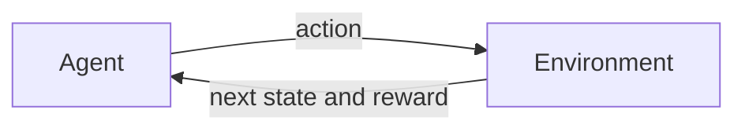
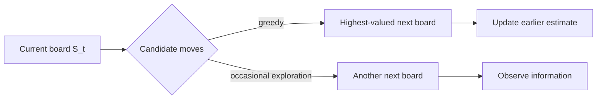
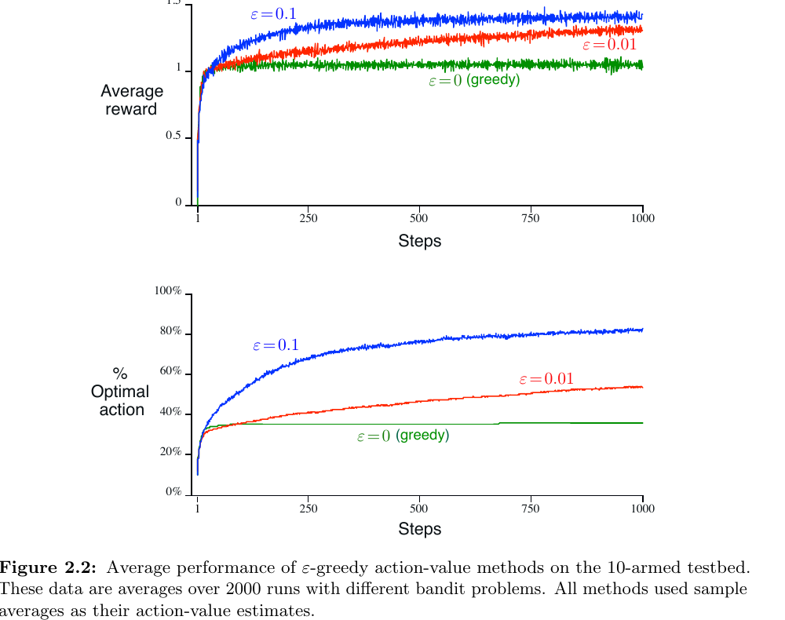
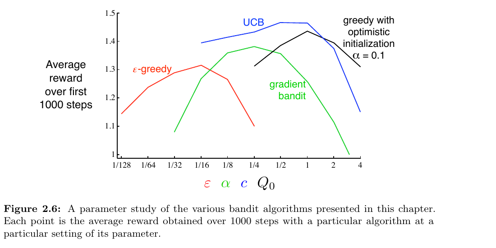

# Reinforcement Learning: An Introduction

> Chapter-by-chapter notes on reinforcement learning as goal-directed learning through interaction. The notes emphasize the problem formulation, mathematical definitions, algorithmic ideas, and distinctions that are easy to confuse.

**Reference:** Richard S. Sutton and Andrew G. Barto, *Reinforcement Learning: An Introduction*, second edition, MIT Press, 2018 (2020 printing). See the authors' [book page](http://incompleteideas.net/book/the-book-2nd.html) for supporting material.

## Book Catalog

| Part | Chapter | Topic | Note status |
|:--:|:--:|:--|:--:|
| Foundations | 1 | [Introduction](#chapter-1-introduction) | Complete |
| I | 2 | [Multi-armed Bandits](#chapter-2-multi-armed-bandits) | Complete |
| I | 3 | Finite Markov Decision Processes | Not started |
| I | 4 | Dynamic Programming | Not started |
| I | 5 | Monte Carlo Methods | Not started |
| I | 6 | Temporal-Difference Learning | Not started |
| I | 7 | $n$-step Bootstrapping | Not started |
| I | 8 | Planning and Learning with Tabular Methods | Not started |
| II | 9 | On-policy Prediction with Approximation | Not started |
| II | 10 | On-policy Control with Approximation | Not started |
| II | 11 | Off-policy Methods with Approximation | Not started |
| II | 12 | Eligibility Traces | Not started |
| II | 13 | Policy Gradient Methods | Not started |
| III | 14 | Psychology | Not started |
| III | 15 | Neuroscience | Not started |
| III | 16 | Applications and Case Studies | Not started |
| III | 17 | Frontiers | Not started |

## Chapter 1 Catalog

| Section | Topic |
|:--|:--|
| 1.1 | [What Reinforcement Learning Is](#11-what-reinforcement-learning-is) |
| 1.2 | [The Interaction Problem](#12-the-interaction-problem) |
| 1.3 | [Elements of an RL System](#13-elements-of-an-rl-system) |
| 1.4 | [Scope and Assumptions](#14-scope-and-assumptions) |
| 1.5 | [Tic-Tac-Toe as a Minimal RL Example](#15-tic-tac-toe-as-a-minimal-rl-example) |
| 1.6 | [Three Historical Threads](#16-three-historical-threads) |
| 1.7 | [Common Confusions](#17-common-confusions) |
| 1.8 | [Formula Sheet](#18-formula-sheet) |
| 1.9 | [Understanding Checklist](#19-understanding-checklist) |

## Chapter 2 Catalog

| Section | Topic |
|:--|:--|
| 2.1 | [The Bandit Problem](#21-the-bandit-problem) |
| 2.2 | [Action-Value Methods](#22-action-value-methods) |
| 2.3 | [The 10-Armed Testbed](#23-the-10-armed-testbed) |
| 2.4 | [Incremental Estimation](#24-incremental-estimation) |
| 2.5 | [Nonstationary Problems](#25-nonstationary-problems) |
| 2.6 | [Optimistic Initial Values](#26-optimistic-initial-values) |
| 2.7 | [Upper-Confidence-Bound Selection](#27-upper-confidence-bound-selection) |
| 2.8 | [Gradient Bandits](#28-gradient-bandits) |
| 2.9 | [Contextual Bandits](#29-contextual-bandits) |
| 2.10 | [Method Comparison](#210-method-comparison) |
| 2.11 | [Common Confusions](#211-common-confusions) |
| 2.12 | [Formula Sheet](#212-formula-sheet) |
| 2.13 | [Understanding Checklist](#213-understanding-checklist) |

---

## Chapter 1: Introduction

Reinforcement learning (RL) studies how an agent can improve goal-directed behavior through interaction. The agent is not given the correct action for every situation and may not know how the environment works. It must learn from the consequences of its own decisions.

Two features define the central difficulty:

- **Trial-and-error search:** useful actions must be discovered through experience.
- **Delayed consequences:** an action can change later states, opportunities, and rewards, not just the next reward.

### 1.1 What Reinforcement Learning Is

The term **reinforcement learning** can refer to three related but distinct things:

| Meaning | Question |
|:--|:--|
| A problem | How should an agent act to maximize long-term reward in an uncertain environment? |
| A family of methods | How can experience be used to learn effective behavior? |
| A research field | What principles and algorithms solve such sequential decision problems? |

Keeping the **problem** separate from a particular **solution method** is essential. A Markov decision process describes an RL problem; Q-learning, policy gradients, and planning are different methods that may solve it.

#### Relationship to other learning paradigms

| Paradigm | Learning signal | Primary objective |
|:--|:--|:--|
| Supervised learning | Correct target for each example | Predict the supplied target on new data |
| Unsupervised learning | Unlabeled observations | Discover structure in data |
| Reinforcement learning | Rewards produced by interaction | Choose actions that maximize long-term cumulative reward |

A reward is **not** a label for the correct action. It evaluates consequences, possibly long after the action that contributed to them. Therefore, RL includes a temporal **credit-assignment problem**: which earlier decisions deserve credit or blame for later outcomes?

#### Exploration and exploitation

The agent must balance:

- **exploitation:** choose actions currently believed to be effective;
- **exploration:** try uncertain alternatives to improve future decisions.

Pure exploitation can lock the agent into a suboptimal behavior. Pure exploration gathers information but fails to use it. In stochastic environments, repeated samples are needed because one outcome does not reveal an action's expected consequence.

### 1.2 The Interaction Problem

RL treats decision making as a feedback loop between an **agent** and an **environment**.

At time $t$:

1. The agent receives information about the current situation, represented as $S_t$.
2. It selects an action $A_t$.
3. The environment transitions and returns a reward $R_{t+1}$ and next state $S_{t+1}$.
4. The agent uses this experience to improve future decisions.

The formal Markov decision process is introduced in Chapter 3. At this stage, the important point is that actions affect both immediate outcomes and the distribution of future situations.

#### What the examples have in common

Games, robot control, industrial control, and everyday behavior look different, but fit the same abstraction when they contain:

- an active decision maker;
- repeated interaction rather than a fixed dataset alone;
- uncertainty about action outcomes;
- consequences extending over time;
- a measurable goal expressed through reward;
- an opportunity to improve using experience.

The agent can be a complete robot or only one decision-making subsystem. The boundary is chosen so that actions cross from agent to environment and observations or rewards return across that boundary.

### 1.3 Elements of an RL System

Beyond the agent and environment, the book identifies four main elements.

| Element | Role | Typical notation |
|:--|:--|:--:|
| Policy | Specifies behavior: which action to take in each state | $\pi(a\mid s)$ |
| Reward signal | Defines immediate goal feedback | $R_{t+1}$ |
| Value function | Predicts long-term cumulative reward | $v_\pi(s)$ or $q_\pi(s,a)$ |
| Environment model | Predicts possible transitions and rewards; optional | $p(s',r\mid s,a)$ |

#### Policy

A **policy** defines the agent's behavior. A stochastic policy assigns an action distribution:

$$
\pi(a\mid s)=\Pr(A_t=a\mid S_t=s).
$$

A policy may be a table, a neural network, or a search procedure. It is the only one of the four elements required to generate behavior.

#### Reward versus value

A **reward** evaluates an immediate event. A **value** predicts the total reward obtainable afterward under a policy:

$$
v_\pi(s)
=\mathbb E_\pi\left[G_t\mid S_t=s\right],
$$

where $G_t$ denotes future cumulative reward. Chapter 3 defines the return $G_t$ precisely.

This distinction explains why an action with low immediate reward may still be desirable: it can lead to a state with high future value. Conversely, a tempting immediate reward may lead to poor future outcomes.

Reward defines **what the task asks for**. Value is an agent's learned prediction used to make farsighted decisions. Values are derived from rewards, but are usually harder to estimate because they depend on future trajectories.

#### Model

A **model** predicts how the environment responds. Given $(s,a)$, it may predict the next state and reward or their probability distribution.

- **Model-based RL** uses a model to evaluate possible futures or plan before acting.
- **Model-free RL** learns behavior or values directly from experience without using such transition predictions for decision making.

Model-free does not mean "no learning," "no internal state," or "no prior knowledge." It specifically describes whether the method uses an environment transition/reward model.

### 1.4 Scope and Assumptions

#### State is treated as given

Most of the book assumes that a state signal is already available to the policy, value function, and model. Constructing a useful state representation is a major problem, but is mostly separated from the decision-making questions studied here.

This assumption should not be mistaken for full observability. A practical state may be incomplete or learned, and different physical situations may produce the same observation.

#### Focus on learning during interaction

The book emphasizes methods that use individual transitions and improve while interacting. This differs from evolutionary policy search that may evaluate each fixed policy only through whole-episode outcomes.

Transition-level learning can be more data-efficient because it uses information about:

- which states were visited;
- which actions were selected;
- which local predictions were wrong;
- how later outcomes relate to earlier decisions.

Evolutionary methods can still solve sequential decision problems, but they are not the book's main focus.

#### Value functions are central, not mandatory

Most methods in the book estimate values because values provide structured information for searching over policies. Nevertheless, an algorithm can solve an RL problem without explicitly learning a value function; direct policy optimization is one example.

### 1.5 Tic-Tac-Toe as a Minimal RL Example

The tic-tac-toe example shows how values, exploration, online updates, and delayed outcomes work together.

#### Problem setup

Assume the learning player uses X and plays repeatedly against a fixed but imperfect opponent.

| RL concept | Tic-tac-toe instance |
|:--|:--|
| State $s$ | Current board configuration |
| Action $a$ | A legal X placement |
| Policy | Usually choose the move leading to the highest-valued board |
| Exploration | Occasionally choose another legal move |
| Value $V(s)$ | Estimated probability of eventually winning from $s$ |

One initialization is:

$$
V(s)=
\begin{cases}
1, & \text{X has already won},\\
0, & \text{X can no longer win},\\
0.5, & \text{otherwise}.
\end{cases}
$$

The intermediate value $0.5$ represents uncertainty, not a known draw probability.

#### Action selection

For each legal move, the agent examines the resulting board and its current value estimate. It usually chooses the largest value but occasionally explores another move.

In this specific example, the book updates after greedy moves but not exploratory moves. This makes $V$ estimate outcomes for the greedy target behavior. Updating exploratory moves without correction would instead move the estimate toward the exploratory behavior policy.

#### Temporal-difference update

After a greedy transition from $S_t$ to $S_{t+1}$, update the earlier estimate toward the later one:

$$
\boxed{
V(S_t)
\leftarrow
V(S_t)+\alpha\left[V(S_{t+1})-V(S_t)\right]
}
$$

where $0<\alpha\leq1$ is the step size. The quantity

$$
\delta_t=V(S_{t+1})-V(S_t)
$$

is the temporal difference in this reward-free intermediate transition. Terminal values eventually propagate backward through states that precede wins or failures.

The update is an incremental average-like operation:

$$
V_{\text{new}}(S_t)
=(1-\alpha)V_{\text{old}}(S_t)
+\alpha V(S_{t+1}).
$$

Small $\alpha$ changes estimates slowly; large $\alpha$ responds more strongly to recent experience. A decreasing step size supports convergence in a stationary setting, whereas a persistent step size can track a slowly changing opponent.

#### Why this is an RL solution

The method improves from games played against the actual opponent without first learning a complete opponent model.

- **Not minimax:** minimax protects against optimal opposition and may ignore exploitable mistakes made by this opponent.
- **Not classical dynamic programming:** the opponent's transition probabilities are not supplied in advance.
- **Not whole-policy evolutionary search:** the learner updates values using states encountered within each game.

The player does know the deterministic result of its own legal move, allowing it to compare successor boards. It is therefore model-free with respect to the opponent, but uses known game rules for one-step lookahead.

The table representation works only because tic-tac-toe is small. Large problems require function approximation so experience in one state can generalize to similar states.

### 1.6 Three Historical Threads

Modern RL emerged from three lines of work:

| Thread | Core idea | Contribution to modern RL |
|:--|:--|:--|
| Trial-and-error learning | Reinforced actions become more likely | Learning behavior directly from consequences |
| Optimal control | Optimize sequential decisions using value functions and dynamic programming | Formal objectives, Bellman recursion, and planning |
| Temporal-difference learning | Adjust predictions using differences between successive predictions | Online value learning before final outcomes are known |

These threads developed partly independently and converged in the 1980s. Modern RL combines the trial-and-error learner, the value-based view of optimal control, and TD methods for learning values from ongoing experience.

### 1.7 Common Confusions

#### "RL is an algorithm"

RL is also a problem formulation and a field. There is no single RL algorithm.

#### "Reward tells the agent the correct action"

Reward evaluates outcomes. It may be delayed and does not directly identify which action was optimal.

#### "Reward and value are interchangeable"

Reward is immediate feedback from the environment. Value is a learned prediction of future cumulative reward under a policy.

#### "RL is unsupervised learning"

RL does not require action labels, but it optimizes a reward objective rather than merely discovering structure in unlabeled data.

#### "Model-free means the agent cannot plan or look ahead at all"

The term concerns use of an environment model. A system may combine model-free learned values with known local rules or place model-free components inside a larger planning system.

#### "Exploration is always random action selection"

Random action selection is only the simplest strategy. Exploration can be directed by uncertainty, optimism, information gain, or other criteria.

### 1.8 Formula Sheet

| Concept | Formula |
|:--|:--|
| Stochastic policy | $\pi(a\mid s)=\Pr(A_t=a\mid S_t=s)$ |
| State value preview | $v_\pi(s)=\mathbb E_\pi[G_t\mid S_t=s]$ |
| Tic-tac-toe TD difference | $\delta_t=V(S_{t+1})-V(S_t)$ |
| Tic-tac-toe TD update | $V(S_t)\leftarrow V(S_t)+\alpha\delta_t$ |
| Convex-combination form | $V_{\text{new}}=(1-\alpha)V_{\text{old}}+\alpha V_{\text{target}}$ |

### 1.9 Understanding Checklist

After this chapter, you should be able to:

- explain why RL is neither supervised nor unsupervised learning;
- identify delayed reward and exploration as central RL difficulties;
- distinguish policy, reward, value, and model;
- distinguish model-free from model-based methods;
- explain the tic-tac-toe TD update and the role of $\alpha$;
- explain why transition-level value learning can use experience more efficiently than whole-policy evaluation;
- identify the trial-and-error, optimal-control, and TD roots of modern RL.

Chapter 2 isolates the exploration-exploitation problem by removing state transitions and studying multi-armed bandits.

---

## Chapter 2: Multi-armed Bandits

A multi-armed bandit isolates one central RL problem: **how should an agent balance exploiting what currently looks best against exploring actions whose values remain uncertain?**

Unlike full RL, a basic bandit has only one recurring situation. An action affects the immediate reward, but it does not change a state or influence later reward dynamics. This removes delayed credit assignment and lets us study exploration directly.

### 2.1 The Bandit Problem

At each time step $t$:

1. The agent chooses one of $k$ actions, $A_t\in\{1,\ldots,k\}$.
2. The environment samples a reward $R_t$ from the selected action's reward distribution.
3. The agent updates its knowledge and chooses again.

The true value of action $a$ is its expected immediate reward:

$$
\boxed{
q_*(a)=\mathbb E[R_t\mid A_t=a].
}
$$

The learner does not know $q_*(a)$ and maintains an estimate $Q_t(a)$. If all true values were known, the optimal action would simply be

$$
a_*\in\arg\max_a q_*(a).
$$

The difficulty comes from learning these values while simultaneously trying to obtain reward.

#### Evaluative rather than instructive feedback

After choosing an action, the reward evaluates that action's outcome. It does **not** reveal:

- the rewards that unselected actions would have produced;
- whether the selected action was optimal;
- which action should be selected next.

This partial feedback creates the need for active exploration.

#### Exploration versus exploitation

- **Exploitation:** choose an action with the highest current estimate $Q_t(a)$.
- **Exploration:** choose another action to improve knowledge that may increase future reward.

Exploitation maximizes reward according to current information. Exploration may sacrifice immediate reward to improve later decisions. The useful balance depends on uncertainty, reward noise, nonstationarity, and the remaining decision horizon.

### 2.2 Action-Value Methods

An action-value method has two components:

1. estimate each action's value;
2. use those estimates to select actions.

#### Sample-average estimate

Let

$$
N_t(a)=\sum_{i=1}^{t-1}\mathbf 1\{A_i=a\}
$$

be the number of times action $a$ was selected before time $t$. Its sample-average estimate is

$$
Q_t(a)
=
\frac{
\sum_{i=1}^{t-1}R_i\mathbf 1\{A_i=a\}
}{N_t(a)}.
$$

This expression applies after the action has been selected at least once. When $N_t(a)=0$, the implementation uses an initial estimate $Q_1(a)$ or ensures that every action is tried before applying the sample average.

For a stationary reward distribution, $Q_t(a)$ converges to $q_*(a)$ as $N_t(a)\to\infty$.

#### Greedy selection

A greedy agent chooses

$$
A_t\in\arg\max_a Q_t(a).
$$

This can fail permanently: an unlucky early reward may make the optimal action look bad, after which a purely greedy agent may never sample it again.

#### Epsilon-greedy selection

An $\varepsilon$-greedy policy chooses:

$$
A_t=
\begin{cases}
\text{a greedy action}, & \text{with probability }1-\varepsilon,\\
\text{a uniformly random action}, & \text{with probability }\varepsilon.
\end{cases}
$$

The random branch includes greedy actions. Therefore, if the greedy action is unique, its total selection probability is

$$
1-\varepsilon+\frac{\varepsilon}{k},
$$

while each other action is selected with probability $\varepsilon/k$.

A larger $\varepsilon$ discovers good actions faster but continues selecting inferior actions more often. A smaller $\varepsilon$ learns more slowly but wastes less reward after the estimates become accurate.

### 2.3 The 10-Armed Testbed

The book compares methods on 2,000 independently generated 10-action bandits. For each run,

$$
q_*(a)\sim\mathcal N(0,1),
\qquad
R_t\mid A_t=a\sim\mathcal N(q_*(a),1).
$$

Each method acts for 1,000 steps. Performance is averaged across runs using:

- **average reward** at each step;
- **percentage of optimal-action selections** at each step.

*Greedy and $\varepsilon$-greedy methods on the 10-armed testbed. Cropped from book Figure 2.2.*

The experiment shows:

- Greedy selection improves quickly at first but often commits to a suboptimal action because of noisy initial samples.
- $\varepsilon=0.1$ explores enough to identify the optimal action relatively quickly, but its long-run optimal-action rate is capped below 100% by continued random exploration.
- $\varepsilon=0.01$ improves more slowly but eventually loses less reward to exploration.

These conclusions depend on the task. More reward noise or changing action values makes continued exploration more valuable. In a deterministic stationary task, much less exploration may be sufficient.

### 2.4 Incremental Estimation

Storing every reward is unnecessary. Suppose $Q_n$ is the estimate after $n-1$ observations of one action. After receiving $R_n$,

$$
\boxed{
Q_{n+1}=Q_n+\frac{1}{n}(R_n-Q_n).
}
$$

This requires constant memory and constant computation per update.

The equation is an instance of the general learning rule

$$
\boxed{
\text{New estimate}
=\text{Old estimate}
+\text{Step size}
\left(\text{Target}-\text{Old estimate}\right).
}
$$

Here:

- target: $R_n$;
- prediction error: $R_n-Q_n$;
- step size: $1/n$.

For an action-indexed implementation, only the selected action is updated:

$$
N(A_t)\leftarrow N(A_t)+1,
$$

$$
Q(A_t)
\leftarrow
Q(A_t)+\frac{1}{N(A_t)}\left(R_t-Q(A_t)\right).
$$

The other action estimates remain unchanged.

### 2.5 Nonstationary Problems

Sample averages weight every observation equally. This is appropriate when $q_*(a)$ is fixed, but it adapts slowly when action values change.

A constant step size gives recent rewards more influence:

$$
\boxed{
Q_{n+1}=Q_n+\alpha(R_n-Q_n),
\qquad 0<\alpha\leq1.
}
$$

Expanding the recursion gives

$$
Q_{n+1}
=(1-\alpha)^nQ_1
+\sum_{i=1}^{n}\alpha(1-\alpha)^{n-i}R_i.
$$

Thus the weight on an old reward decays exponentially with its age. The effective memory scale is roughly $1/\alpha$ observations: larger $\alpha$ adapts faster but produces noisier estimates.

#### Convergence versus tracking

For stochastic approximation with varying step sizes $\alpha_n(a)$, convergence under standard assumptions requires

$$
\sum_{n=1}^{\infty}\alpha_n(a)=\infty,
\qquad
\sum_{n=1}^{\infty}\alpha_n^2(a)<\infty.
$$

The sample-average choice $\alpha_n=1/n$ satisfies both conditions. A constant $\alpha$ violates the second, so its estimate keeps fluctuating rather than converging to a fixed number.

That is a feature in a nonstationary task: the target itself moves, so continued adaptation is preferable to convergence to an old average.

| Setting | Suitable update | Reason |
|:--|:--|:--|
| Stationary action values | Sample average, $\alpha_n=1/n$ | Uses all samples and removes initial bias |
| Nonstationary action values | Constant $\alpha$ | Forgets stale rewards and tracks changes |

### 2.6 Optimistic Initial Values

Instead of initializing $Q_1(a)$ near the expected reward, set all estimates deliberately high. A greedy agent then tries an action, receives a disappointing reward, lowers its estimate, and moves to another still-optimistic action.

This creates exploration without random action selection.

**Strengths:**

- simple;
- useful when prior reward scale is known;
- exploration naturally decreases as estimates become realistic.

**Limitations:**

- exploration is driven only by initial conditions;
- it does not restart when a nonstationary task changes;
- the optimistic value is another parameter requiring a meaningful reward scale;
- with constant step size, the initial bias decays but never disappears exactly at finite time.

Optimistic initialization is therefore effective mainly as a simple stationary-problem technique, not a general uncertainty model.

### 2.7 Upper-Confidence-Bound Selection

$\varepsilon$-greedy exploration selects nongreedy actions indiscriminately. Upper-confidence-bound (UCB) selection instead favors actions that either look valuable or have not been sampled enough:

$$
\boxed{
A_t
=\arg\max_a
\left[
Q_t(a)+c\sqrt{\frac{\ln t}{N_t(a)}}
\right].
}
$$

The two terms have different roles:

| Term | Meaning |
|:--|:--|
| $Q_t(a)$ | Exploitation: current estimated reward |
| $c\sqrt{\ln t/N_t(a)}$ | Exploration bonus: uncertainty proxy |

Selecting action $a$ increases $N_t(a)$ and shrinks its bonus. Ignoring it while $t$ grows increases its relative bonus, so every action is eventually reconsidered. An untried action, $N_t(a)=0$, is assigned priority rather than evaluated by the undefined formula.

The parameter $c>0$ controls exploration. UCB uses samples more selectively than $\varepsilon$-greedy and performs well on the stationary testbed. Its simple count-based uncertainty is harder to extend to nonstationary problems, large state spaces, and function approximation.

### 2.8 Gradient Bandits

Gradient bandits do not estimate rewards with $Q_t(a)$. They learn an unconstrained **preference** $H_t(a)$ for each action and convert preferences into probabilities with softmax:

$$
\boxed{
\pi_t(a)
=\Pr(A_t=a)
=\frac{e^{H_t(a)}}{\sum_{b=1}^{k}e^{H_t(b)}}.
}
$$

Only preference differences matter. Adding the same constant to every $H_t(a)$ leaves all action probabilities unchanged.

After selecting $A_t$ and observing $R_t$, the unified update for every action is

$$
\boxed{
H_{t+1}(a)
=H_t(a)
+\alpha(R_t-\bar R_t)
\left(\mathbf 1\{a=A_t\}-\pi_t(a)\right).
}
$$

For the selected action this becomes

$$
H_{t+1}(A_t)
=H_t(A_t)
+\alpha(R_t-\bar R_t)(1-\pi_t(A_t)),
$$

and for $a\neq A_t$,

$$
H_{t+1}(a)
=H_t(a)
-\alpha(R_t-\bar R_t)\pi_t(a).
$$

#### Role of the reward baseline

$\bar R_t$ is commonly an incremental average reward. The advantage-like term

$$
R_t-\bar R_t
$$

asks whether the selected action performed better or worse than the current reference level.

- Above-baseline reward increases its relative preference.
- Below-baseline reward decreases its relative preference.
- The baseline does not change the expected gradient if it does not depend on the selected action, but it can substantially reduce update variance and improve learning speed.

This update is a stochastic gradient-ascent method for expected immediate reward. It also previews later policy-gradient algorithms: parameterize a stochastic policy and reinforce sampled actions according to an advantage signal.

### 2.9 Contextual Bandits

A basic bandit learns one best action for one recurring situation. A **contextual bandit** observes a context $X_t$ and learns a context-dependent policy:

$$
\pi(a\mid x).
$$

For example, different display colors may identify different bandit tasks, each with a different best action.

| Problem | Context/state | Does action affect the next context? | Learning target |
|:--|:--:|:--:|:--|
| Basic bandit | No | No | One best action |
| Contextual bandit | Yes | No | Best action for each context |
| Full RL | Yes | Yes | Policy accounting for future consequences |

Contextual bandits introduce association between situations and actions, but still lack the delayed effects and state-transition control that define full RL.

### 2.10 Method Comparison

*Parameter study on the stationary 10-armed testbed. Cropped from book Figure 2.6.*

The parameter study averages reward over the first 1,000 steps and varies each method's main parameter on a logarithmic scale. Its key lessons are:

- every method performs poorly with too little or too much exploration;
- useful parameter ranges are broad rather than single magic values;
- UCB performs best on this particular stationary testbed;
- the result is not a universal ranking because assumptions and failure modes differ.

| Method | Exploration mechanism | Main parameter | Main limitation |
|:--|:--|:--|:--|
| $\varepsilon$-greedy | Uniform random actions | $\varepsilon$ | Ignores uncertainty and action quality during exploration |
| Optimistic initialization | Initially inflated estimates | $Q_1$ | Exploration is temporary |
| UCB | Value plus count-based uncertainty bonus | $c$ | Relies on stationary, count-based uncertainty |
| Gradient bandit | Learned stochastic preferences | $\alpha$ | Sensitive to step size; does not estimate action values |

For nonstationarity, action selection and value adaptation are separate concerns: continued exploration can rediscover changed actions, while a constant step size lets estimates forget obsolete rewards. Usually both are needed.

### 2.11 Common Confusions

#### "A reward reveals the best action"

It reveals only one noisy outcome from the selected action. Other actions remain counterfactual and unobserved.

#### "Greedy means optimal"

Greedy means optimal according to the current estimates $Q_t$, which may be inaccurate. The optimal action is defined by the unknown true values $q_*$.

#### "$\varepsilon$ is the probability of selecting a nongreedy action"

Not exactly. With probability $\varepsilon$, selection is uniform over **all** actions, including greedy ones. With one greedy action, its probability is $1-\varepsilon+\varepsilon/k$.

#### "Sample averages and constant step sizes estimate the same history"

They use the same update shape but different weighting. Sample averages weight all observations equally; constant step sizes exponentially discount old observations.

#### "Constant-step-size estimates should converge"

They are designed to keep adapting. Their persistent variation is useful when the true action values change.

#### "Optimistic initialization solves exploration"

It causes early exploration but provides no renewed exploration after later changes.

#### "The UCB bonus is an exact confidence interval"

In this chapter it is best understood as a useful uncertainty-inspired bonus. Its theoretical confidence interpretation depends on assumptions about the reward process.

#### "Gradient bandit preferences are predicted rewards"

$H_t(a)$ has no reward-unit interpretation. Only relative preferences matter, and softmax turns them into action probabilities.

### 2.12 Formula Sheet

| Concept | Formula |
|:--|:--|
| True action value | $q_*(a)=\mathbb E[R_t\mid A_t=a]$ |
| Greedy action | $A_t\in\arg\max_a Q_t(a)$ |
| Unique greedy action under $\varepsilon$-greedy | $\Pr(A_t=a_g)=1-\varepsilon+\varepsilon/k$ |
| Sample-average update | $Q_{n+1}=Q_n+\frac{1}{n}(R_n-Q_n)$ |
| Constant-step update | $Q_{n+1}=Q_n+\alpha(R_n-Q_n)$ |
| Recency weight on $R_i$ | $\alpha(1-\alpha)^{n-i}$ |
| Convergence conditions | $\sum_n\alpha_n=\infty$, $\sum_n\alpha_n^2<\infty$ |
| UCB selection | $A_t=\arg\max_a[Q_t(a)+c\sqrt{\ln t/N_t(a)}]$ |
| Softmax policy | $\pi_t(a)=e^{H_t(a)}/\sum_b e^{H_t(b)}$ |
| Gradient preference update | $H_{t+1}(a)=H_t(a)+\alpha(R_t-\bar R_t)(\mathbf 1\{a=A_t\}-\pi_t(a))$ |

### 2.13 Understanding Checklist

After this chapter, you should be able to:

- define $q_*(a)$ and distinguish it from $Q_t(a)$;
- explain why bandit feedback requires exploration;
- calculate exact action probabilities under $\varepsilon$-greedy selection;
- derive the incremental sample-average update;
- explain why constant step sizes track nonstationary values;
- compare $\varepsilon$-greedy, optimistic initialization, UCB, and gradient bandits;
- explain the role of the baseline in the gradient-bandit update;
- distinguish basic bandits, contextual bandits, and full RL.

Chapter 3 adds states, transitions, delayed return, and policies, turning the one-step bandit abstraction into a finite Markov decision process.
