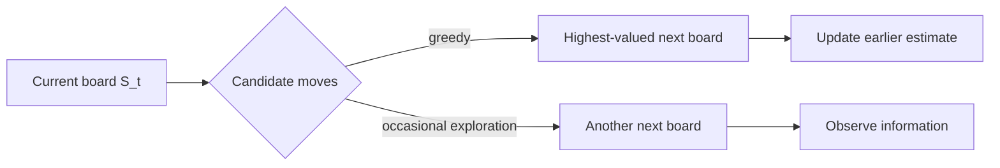
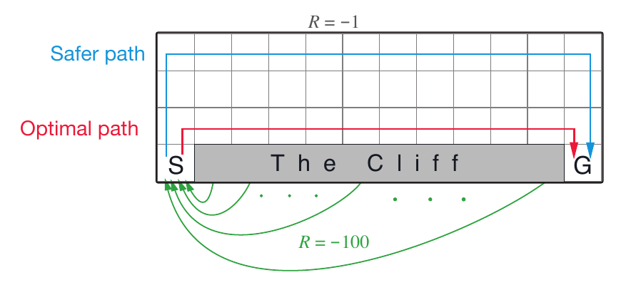
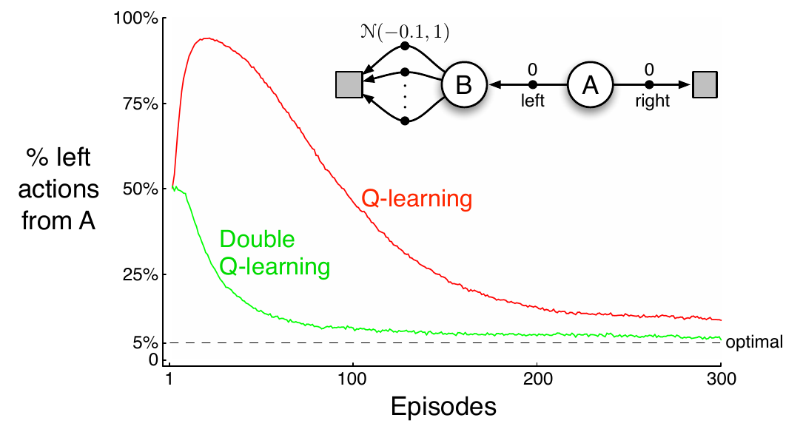
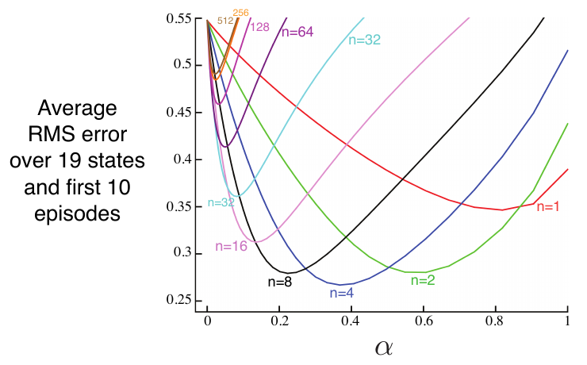
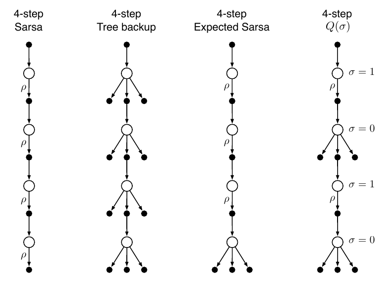
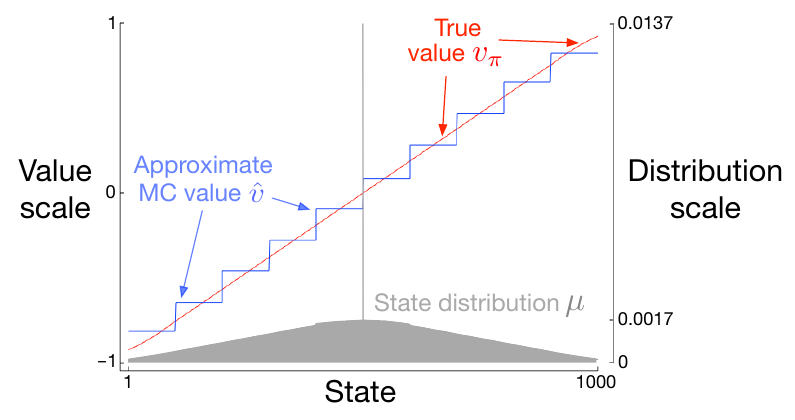
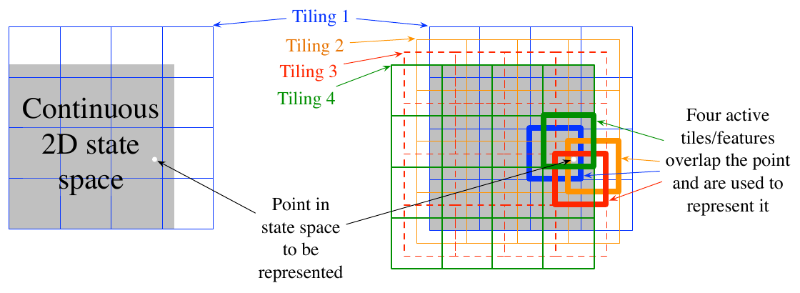

# Reinforcement Learning: An Introduction

> Chapter-by-chapter notes on reinforcement learning as goal-directed learning through interaction. The notes emphasize the problem formulation, mathematical definitions, algorithmic ideas, and distinctions that are easy to confuse.

**Reference:** Richard S. Sutton and Andrew G. Barto, *Reinforcement Learning: An Introduction*, second edition, MIT Press, 2018 (2020 printing). See the authors' [book page](http://incompleteideas.net/book/the-book-2nd.html) for supporting material.

## Book Catalog

| Part | Chapter | Topic | Note status |
|:--:|:--:|:--|:--:|
| Foundations | 1 | [Introduction](#chapter-1-introduction) | Complete |
| I | 2 | [Multi-armed Bandits](#chapter-2-multi-armed-bandits) | Complete |
| I | 3 | [Finite Markov Decision Processes](#chapter-3-finite-markov-decision-processes) | Complete |
| I | 4 | [Dynamic Programming](#chapter-4-dynamic-programming) | Complete |
| I | 5 | [Monte Carlo Methods](#chapter-5-monte-carlo-methods) | Complete |
| I | 6 | [Temporal-Difference Learning](#chapter-6-temporal-difference-learning) | Complete |
| I | 7 | [n-step Bootstrapping](#chapter-7-n-step-bootstrapping) | 7.1-7.3 and 7.6 complete; 7.4-7.5 skimmed |
| I | 8 | Planning and Learning with Tabular Methods | Skipped |
| II | 9 | [On-policy Prediction with Approximation](#chapter-9-on-policy-prediction-with-approximation) | Complete |
| II | 10 | On-policy Control with Approximation | Not started |
| II | 11 | Off-policy Methods with Approximation | Not started |
| II | 12 | Eligibility Traces | Not started |
| II | 13 | Policy Gradient Methods | Not started |
| III | 14 | Psychology | Not started |
| III | 15 | Neuroscience | Not started |
| III | 16 | Applications and Case Studies | Not started |
| III | 17 | Frontiers | Not started |

## Chapter 1 Catalog

| Section | Topic |
|:--|:--|
| 1.1 | [What Reinforcement Learning Is](#11-what-reinforcement-learning-is) |
| 1.2 | [The Interaction Problem](#12-the-interaction-problem) |
| 1.3 | [Elements of an RL System](#13-elements-of-an-rl-system) |
| 1.4 | [Scope and Assumptions](#14-scope-and-assumptions) |
| 1.5 | [Tic-Tac-Toe as a Minimal RL Example](#15-tic-tac-toe-as-a-minimal-rl-example) |
| 1.6 | [Three Historical Threads](#16-three-historical-threads) |
| 1.7 | [Common Confusions](#17-common-confusions) |
| 1.8 | [Formula Sheet](#18-formula-sheet) |
| 1.9 | [Understanding Checklist](#19-understanding-checklist) |

## Chapter 2 Catalog

| Section | Topic |
|:--|:--|
| 2.1 | [The Bandit Problem](#21-the-bandit-problem) |
| 2.2 | [Action-Value Methods](#22-action-value-methods) |
| 2.3 | [The 10-Armed Testbed](#23-the-10-armed-testbed) |
| 2.4 | [Incremental Estimation](#24-incremental-estimation) |
| 2.5 | [Nonstationary Problems](#25-nonstationary-problems) |
| 2.6 | [Optimistic Initial Values](#26-optimistic-initial-values) |
| 2.7 | [Upper-Confidence-Bound Selection](#27-upper-confidence-bound-selection) |
| 2.8 | [Gradient Bandits](#28-gradient-bandits) |
| 2.9 | [Contextual Bandits](#29-contextual-bandits) |
| 2.10 | [Method Comparison](#210-method-comparison) |
| 2.11 | [Common Confusions](#211-common-confusions) |
| 2.12 | [Formula Sheet](#212-formula-sheet) |
| 2.13 | [Understanding Checklist](#213-understanding-checklist) |

## Chapter 3 Catalog

| Section | Topic |
|:--|:--|
| 3.1 | [Agent-Environment Interface](#31-agent-environment-interface) |
| 3.2 | [MDP Dynamics and the Markov Property](#32-mdp-dynamics-and-the-markov-property) |
| 3.3 | [Goals and Rewards](#33-goals-and-rewards) |
| 3.4 | [Returns, Episodes, and Discounting](#34-returns-episodes-and-discounting) |
| 3.5 | [Policies and Value Functions](#35-policies-and-value-functions) |
| 3.6 | [Bellman Equations for a Policy](#36-bellman-equations-for-a-policy) |
| 3.7 | [Optimal Policies and Optimal Values](#37-optimal-policies-and-optimal-values) |
| 3.8 | [Bellman Optimality Equations](#38-bellman-optimality-equations) |
| 3.9 | [Optimality and Approximation](#39-optimality-and-approximation) |
| 3.10 | [Common Confusions](#310-common-confusions) |
| 3.11 | [Formula Sheet](#311-formula-sheet) |
| 3.12 | [Understanding Checklist](#312-understanding-checklist) |

## Chapter 4 Catalog

| Section | Topic |
|:--|:--|
| 4.1 | [From Bellman Equations to Planning](#41-from-bellman-equations-to-planning) |
| 4.2 | [Iterative Policy Evaluation](#42-iterative-policy-evaluation) |
| 4.3 | [Gridworld: Evaluation and Greedy Actions](#43-gridworld-evaluation-and-greedy-actions) |
| 4.4 | [Policy Improvement](#44-policy-improvement) |
| 4.5 | [Policy Iteration](#45-policy-iteration) |
| 4.6 | [Value Iteration](#46-value-iteration) |
| 4.7 | [Jack's Car Rental and the Gambler's Problem](#47-jacks-car-rental-and-the-gamblers-problem) |
| 4.8 | [Asynchronous Dynamic Programming](#48-asynchronous-dynamic-programming) |
| 4.9 | [Generalized Policy Iteration](#49-generalized-policy-iteration) |
| 4.10 | [Python Example: Gridworld Updates](#410-python-example-gridworld-updates) |
| 4.11 | [Efficiency and Method Comparison](#411-efficiency-and-method-comparison) |
| 4.12 | [Common Confusions](#412-common-confusions) |
| 4.13 | [Formula Sheet](#413-formula-sheet) |
| 4.14 | [Understanding Checklist](#414-understanding-checklist) |

## Chapter 5 Catalog

| Section | Topic |
|:--|:--|
| 5.1 | [Monte Carlo Prediction](#51-monte-carlo-prediction) |
| 5.2 | [Monte Carlo Estimation of Action Values](#52-monte-carlo-estimation-of-action-values) |
| 5.3 | [Monte Carlo Control with Exploring Starts](#53-monte-carlo-control-with-exploring-starts) |
| 5.4 | [On-Policy Control without Exploring Starts](#54-on-policy-control-without-exploring-starts) |
| 5.5 | [Off-Policy Prediction via Importance Sampling](#55-off-policy-prediction-via-importance-sampling) |
| 5.6 | [Incremental Implementation](#56-incremental-implementation) |
| 5.7 | [Off-Policy Monte Carlo Control](#57-off-policy-monte-carlo-control) |
| 5.8 | [Discounting-Aware Importance Sampling](#58-discounting-aware-importance-sampling) |
| 5.9 | [Per-Decision Importance Sampling](#59-per-decision-importance-sampling) |
| 5.10 | [Python Example: Visits and Importance Weights](#510-python-example-visits-and-importance-weights) |
| 5.11 | [Method Comparison](#511-method-comparison) |
| 5.12 | [Common Confusions](#512-common-confusions) |
| 5.13 | [Formula Sheet](#513-formula-sheet) |
| 5.14 | [Understanding Checklist](#514-understanding-checklist) |

## Chapter 6 Catalog

Sections 6.1-6.9 follow the book; Sections 6.10-6.13 are implementation and review aids.

| Section | Topic |
|:--|:--|
| 6.1 | [TD Prediction](#61-td-prediction) |
| 6.2 | [Advantages and Limits of TD Prediction](#62-advantages-and-limits-of-td-prediction) |
| 6.3 | [Optimality of TD(0) under Batch Updating](#63-optimality-of-td0-under-batch-updating) |
| 6.4 | [Sarsa: On-Policy TD Control](#64-sarsa-on-policy-td-control) |
| 6.5 | [Q-Learning: Off-Policy TD Control](#65-q-learning-off-policy-td-control) |
| 6.6 | [Expected Sarsa](#66-expected-sarsa) |
| 6.7 | [Maximization Bias and Double Learning](#67-maximization-bias-and-double-learning) |
| 6.8 | [Games and Afterstates](#68-games-and-afterstates) |
| 6.9 | [Summary and Method Comparison](#69-summary-and-method-comparison) |
| 6.10 | [Python Examples: Prediction and Control Targets](#610-python-examples-prediction-and-control-targets) |
| 6.11 | [Common Confusions](#611-common-confusions) |
| 6.12 | [Formula Sheet](#612-formula-sheet) |
| 6.13 | [Understanding Checklist](#613-understanding-checklist) |

## Chapter 7 Catalog

Sections 7.1-7.3 and 7.6 are covered in detail. Sections 7.4-7.5 are **skimmed**, with only the conceptual bridge needed for 7.6 retained. Section 7.7 is outside this installment; the review aids below are additional notes.

| Book section | Topic | Status |
|:--|:--|:--|
| 7.1 | [n-step TD Prediction](#71-n-step-td-prediction) | Complete |
| 7.2 | [n-step Sarsa](#72-n-step-sarsa) | Complete |
| 7.3 | [n-step Off-policy Learning](#73-n-step-off-policy-learning) | Complete |
| 7.4 | [Per-decision Methods with Control Variates](#74-per-decision-methods-with-control-variates-skimmed) | Skimmed |
| 7.5 | [Off-policy Learning Without Importance Sampling: Tree Backup](#75-off-policy-learning-without-importance-sampling-tree-backup-skimmed) | Skimmed |
| 7.6 | [A Unifying Algorithm: n-step Q(sigma)](#76-a-unifying-algorithm-n-step-qsigma) | Complete |
| Review | [Python Examples](#chapter-7-python-examples) | Added |
| Review | [Common Confusions](#chapter-7-common-confusions) | Added |
| Review | [Formula Sheet](#chapter-7-formula-sheet) | Added |
| Review | [Understanding Checklist](#chapter-7-understanding-checklist) | Added |

## Chapter 9 Catalog

Sections 9.1-9.12 follow the book. Chapter 8 is skipped; the implementation and review aids below are additional notes.

| Book section | Topic |
|:--|:--|
| 9.1 | [Value-function Approximation](#91-value-function-approximation) |
| 9.2 | [The Prediction Objective](#92-the-prediction-objective) |
| 9.3 | [Stochastic-gradient and Semi-gradient Methods](#93-stochastic-gradient-and-semi-gradient-methods) |
| 9.4 | [Linear Methods](#94-linear-methods) |
| 9.5 | [Feature Construction for Linear Methods](#95-feature-construction-for-linear-methods) |
| 9.5.1 | [Polynomials](#951-polynomials) |
| 9.5.2 | [Fourier Basis](#952-fourier-basis) |
| 9.5.3 | [Coarse Coding](#953-coarse-coding) |
| 9.5.4 | [Tile Coding](#954-tile-coding) |
| 9.5.5 | [Radial Basis Functions](#955-radial-basis-functions) |
| 9.6 | [Selecting Step-Size Parameters Manually](#96-selecting-step-size-parameters-manually) |
| 9.7 | [Nonlinear Function Approximation: Artificial Neural Networks](#97-nonlinear-function-approximation-artificial-neural-networks) |
| 9.8 | [Least-Squares TD](#98-least-squares-td) |
| 9.9 | [Memory-based Function Approximation](#99-memory-based-function-approximation) |
| 9.10 | [Kernel-based Function Approximation](#910-kernel-based-function-approximation) |
| 9.11 | [Looking Deeper at On-policy Learning: Interest and Emphasis](#911-looking-deeper-at-on-policy-learning-interest-and-emphasis) |
| 9.12 | [Summary](#912-summary) |
| Review | [Python Examples](#chapter-9-python-examples) |
| Review | [Common Confusions](#chapter-9-common-confusions) |
| Review | [Formula Sheet](#chapter-9-formula-sheet) |
| Review | [Understanding Checklist](#chapter-9-understanding-checklist) |

---

## Chapter 1: Introduction

Reinforcement learning (RL) studies how an agent can improve goal-directed behavior through interaction. The agent is not given the correct action for every situation and may not know how the environment works. It must learn from the consequences of its own decisions.

Two features define the central difficulty:

- **Trial-and-error search:** useful actions must be discovered through experience.
- **Delayed consequences:** an action can change later states, opportunities, and rewards, not just the next reward.

### 1.1 What Reinforcement Learning Is

The term **reinforcement learning** can refer to three related but distinct things:

| Meaning | Question |
|:--|:--|
| A problem | How should an agent act to maximize long-term reward in an uncertain environment? |
| A family of methods | How can experience be used to learn effective behavior? |
| A research field | What principles and algorithms solve such sequential decision problems? |

Keeping the **problem** separate from a particular **solution method** is essential. A Markov decision process describes an RL problem; Q-learning, policy gradients, and planning are different methods that may solve it.

#### Relationship to other learning paradigms

| Paradigm | Learning signal | Primary objective |
|:--|:--|:--|
| Supervised learning | Correct target for each example | Predict the supplied target on new data |
| Unsupervised learning | Unlabeled observations | Discover structure in data |
| Reinforcement learning | Rewards produced by interaction | Choose actions that maximize long-term cumulative reward |

A reward is **not** a label for the correct action. It evaluates consequences, possibly long after the action that contributed to them. Therefore, RL includes a temporal **credit-assignment problem**: which earlier decisions deserve credit or blame for later outcomes?

#### Exploration and exploitation

The agent must balance:

- **exploitation:** choose actions currently believed to be effective;
- **exploration:** try uncertain alternatives to improve future decisions.

Pure exploitation can lock the agent into a suboptimal behavior. Pure exploration gathers information but fails to use it. In stochastic environments, repeated samples are needed because one outcome does not reveal an action's expected consequence.

### 1.2 The Interaction Problem

RL treats decision making as a feedback loop between an **agent** and an **environment**.


```mermaid
flowchart LR
    A[Agent] -->|action| E[Environment]
    E -->|next state and reward| A
```

At time $t$:

1. The agent receives information about the current situation, represented as $S_t$.
2. It selects an action $A_t$.
3. The environment transitions and returns a reward $R_{t+1}$ and next state $S_{t+1}$.
4. The agent uses this experience to improve future decisions.

The formal Markov decision process is introduced in Chapter 3. At this stage, the important point is that actions affect both immediate outcomes and the distribution of future situations.

#### What the examples have in common

Games, robot control, industrial control, and everyday behavior look different, but fit the same abstraction when they contain:

- an active decision maker;
- repeated interaction rather than a fixed dataset alone;
- uncertainty about action outcomes;
- consequences extending over time;
- a measurable goal expressed through reward;
- an opportunity to improve using experience.

The agent can be a complete robot or only one decision-making subsystem. The boundary is chosen so that actions cross from agent to environment and observations or rewards return across that boundary.

### 1.3 Elements of an RL System

Beyond the agent and environment, the book identifies four main elements.

| Element | Role | Typical notation |
|:--|:--|:--:|
| Policy | Specifies behavior: which action to take in each state | $\pi(a\mid s)$ |
| Reward signal | Defines immediate goal feedback | $R_{t+1}$ |
| Value function | Predicts long-term cumulative reward | $v_\pi(s)$ or $q_\pi(s,a)$ |
| Environment model | Predicts possible transitions and rewards; optional | $p(s',r\mid s,a)$ |

#### Policy

A **policy** defines the agent's behavior. A stochastic policy assigns an action distribution:

$$
\pi(a\mid s)=\Pr(A_t=a\mid S_t=s).
$$

A policy may be a table, a neural network, or a search procedure. It is the only one of the four elements required to generate behavior.

#### Reward versus value

A **reward** evaluates an immediate event. A **value** predicts the total reward obtainable afterward under a policy:

$$
v_\pi(s)
=\mathbb E_\pi\left[G_t\mid S_t=s\right],
$$

where $G_t$ denotes future cumulative reward. Chapter 3 defines the return $G_t$ precisely.

This distinction explains why an action with low immediate reward may still be desirable: it can lead to a state with high future value. Conversely, a tempting immediate reward may lead to poor future outcomes.

Reward defines **what the task asks for**. Value is an agent's learned prediction used to make farsighted decisions. Values are derived from rewards, but are usually harder to estimate because they depend on future trajectories.

#### Model

A **model** predicts how the environment responds. Given $(s,a)$, it may predict the next state and reward or their probability distribution.

- **Model-based RL** uses a model to evaluate possible futures or plan before acting.
- **Model-free RL** learns behavior or values directly from experience without using such transition predictions for decision making.

Model-free does not mean "no learning," "no internal state," or "no prior knowledge." It specifically describes whether the method uses an environment transition/reward model.

### 1.4 Scope and Assumptions

#### State is treated as given

Most of the book assumes that a state signal is already available to the policy, value function, and model. Constructing a useful state representation is a major problem, but is mostly separated from the decision-making questions studied here.

This assumption should not be mistaken for full observability. A practical state may be incomplete or learned, and different physical situations may produce the same observation.

#### Focus on learning during interaction

The book emphasizes methods that use individual transitions and improve while interacting. This differs from evolutionary policy search that may evaluate each fixed policy only through whole-episode outcomes.

Transition-level learning can be more data-efficient because it uses information about:

- which states were visited;
- which actions were selected;
- which local predictions were wrong;
- how later outcomes relate to earlier decisions.

Evolutionary methods can still solve sequential decision problems, but they are not the book's main focus.

#### Value functions are central, not mandatory

Most methods in the book estimate values because values provide structured information for searching over policies. Nevertheless, an algorithm can solve an RL problem without explicitly learning a value function; direct policy optimization is one example.

### 1.5 Tic-Tac-Toe as a Minimal RL Example

The tic-tac-toe example shows how values, exploration, online updates, and delayed outcomes work together.

#### Problem setup

Assume the learning player uses X and plays repeatedly against a fixed but imperfect opponent.

| RL concept | Tic-tac-toe instance |
|:--|:--|
| State $s$ | Current board configuration |
| Action $a$ | A legal X placement |
| Policy | Usually choose the move leading to the highest-valued board |
| Exploration | Occasionally choose another legal move |
| Value $V(s)$ | Estimated probability of eventually winning from $s$ |

One initialization is:

$$
V(s)=
\begin{cases}
1, & \text{X has already won},\\
0, & \text{X can no longer win},\\
0.5, & \text{otherwise}.
\end{cases}
$$

The intermediate value $0.5$ represents uncertainty, not a known draw probability.

#### Action selection

For each legal move, the agent examines the resulting board and its current value estimate. It usually chooses the largest value but occasionally explores another move.


```mermaid
flowchart LR
    S[Current board S_t] --> C{Candidate moves}
    C -->|greedy| G[Highest-valued next board]
    C -->|occasional exploration| X[Another next board]
    G --> U[Update earlier estimate]
    X --> O[Observe information]
```

In this specific example, the book updates after greedy moves but not exploratory moves. This makes $V$ estimate outcomes for the greedy target behavior. Updating exploratory moves without correction would instead move the estimate toward the exploratory behavior policy.

#### Temporal-difference update

After a greedy transition from $S_t$ to $S_{t+1}$, update the earlier estimate toward the later one:

$$
\boxed{
V(S_t)
\leftarrow
V(S_t)+\alpha\left[V(S_{t+1})-V(S_t)\right]
}
$$

where $0<\alpha\leq1$ is the step size. The quantity

$$
\delta_t=V(S_{t+1})-V(S_t)
$$

is the temporal difference in this reward-free intermediate transition. Terminal values eventually propagate backward through states that precede wins or failures.

The update is an incremental average-like operation:

$$
V_{\text{new}}(S_t)
=(1-\alpha)V_{\text{old}}(S_t)
+\alpha V(S_{t+1}).
$$

Small $\alpha$ changes estimates slowly; large $\alpha$ responds more strongly to recent experience. A decreasing step size supports convergence in a stationary setting, whereas a persistent step size can track a slowly changing opponent.

#### Why this is an RL solution

The method improves from games played against the actual opponent without first learning a complete opponent model.

- **Not minimax:** minimax protects against optimal opposition and may ignore exploitable mistakes made by this opponent.
- **Not classical dynamic programming:** the opponent's transition probabilities are not supplied in advance.
- **Not whole-policy evolutionary search:** the learner updates values using states encountered within each game.

The player does know the deterministic result of its own legal move, allowing it to compare successor boards. It is therefore model-free with respect to the opponent, but uses known game rules for one-step lookahead.

The table representation works only because tic-tac-toe is small. Large problems require function approximation so experience in one state can generalize to similar states.

### 1.6 Three Historical Threads

Modern RL emerged from three lines of work:

| Thread | Core idea | Contribution to modern RL |
|:--|:--|:--|
| Trial-and-error learning | Reinforced actions become more likely | Learning behavior directly from consequences |
| Optimal control | Optimize sequential decisions using value functions and dynamic programming | Formal objectives, Bellman recursion, and planning |
| Temporal-difference learning | Adjust predictions using differences between successive predictions | Online value learning before final outcomes are known |

These threads developed partly independently and converged in the 1980s. Modern RL combines the trial-and-error learner, the value-based view of optimal control, and TD methods for learning values from ongoing experience.

### 1.7 Common Confusions

#### "RL is an algorithm"

RL is also a problem formulation and a field. There is no single RL algorithm.

#### "Reward tells the agent the correct action"

Reward evaluates outcomes. It may be delayed and does not directly identify which action was optimal.

#### "Reward and value are interchangeable"

Reward is immediate feedback from the environment. Value is a learned prediction of future cumulative reward under a policy.

#### "RL is unsupervised learning"

RL does not require action labels, but it optimizes a reward objective rather than merely discovering structure in unlabeled data.

#### "Model-free means the agent cannot plan or look ahead at all"

The term concerns use of an environment model. A system may combine model-free learned values with known local rules or place model-free components inside a larger planning system.

#### "Exploration is always random action selection"

Random action selection is only the simplest strategy. Exploration can be directed by uncertainty, optimism, information gain, or other criteria.

### 1.8 Formula Sheet

| Concept | Formula |
|:--|:--|
| Stochastic policy | $\pi(a\mid s)=\Pr(A_t=a\mid S_t=s)$ |
| State value preview | $v_\pi(s)=\mathbb E_\pi[G_t\mid S_t=s]$ |
| Tic-tac-toe TD difference | $\delta_t=V(S_{t+1})-V(S_t)$ |
| Tic-tac-toe TD update | $V(S_t)\leftarrow V(S_t)+\alpha\delta_t$ |
| Convex-combination form | $V_{\text{new}}=(1-\alpha)V_{\text{old}}+\alpha V_{\text{target}}$ |

### 1.9 Understanding Checklist

After this chapter, you should be able to:

- explain why RL is neither supervised nor unsupervised learning;
- identify delayed reward and exploration as central RL difficulties;
- distinguish policy, reward, value, and model;
- distinguish model-free from model-based methods;
- explain the tic-tac-toe TD update and the role of $\alpha$;
- explain why transition-level value learning can use experience more efficiently than whole-policy evaluation;
- identify the trial-and-error, optimal-control, and TD roots of modern RL.

Chapter 2 isolates the exploration-exploitation problem by removing state transitions and studying multi-armed bandits.

---

## Chapter 2: Multi-armed Bandits

A multi-armed bandit isolates one central RL problem: **how should an agent balance exploiting what currently looks best against exploring actions whose values remain uncertain?**

Unlike full RL, a basic bandit has only one recurring situation. An action affects the immediate reward, but it does not change a state or influence later reward dynamics. This removes delayed credit assignment and lets us study exploration directly.

### 2.1 The Bandit Problem

At each time step $t$:

1. The agent chooses one of $k$ actions, $A_t\in\{1,\ldots,k\}$.
2. The environment samples a reward $R_t$ from the selected action's reward distribution.
3. The agent updates its knowledge and chooses again.

The true value of action $a$ is its expected immediate reward:

$$
\boxed{
q_*(a)=\mathbb E[R_t\mid A_t=a].
}
$$

The learner does not know $q_*(a)$ and maintains an estimate $Q_t(a)$. If all true values were known, the optimal action would simply be

$$
a_*\in\arg\max_a q_*(a).
$$

The difficulty comes from learning these values while simultaneously trying to obtain reward.

#### Evaluative rather than instructive feedback

After choosing an action, the reward evaluates that action's outcome. It does **not** reveal:

- the rewards that unselected actions would have produced;
- whether the selected action was optimal;
- which action should be selected next.

This partial feedback creates the need for active exploration.

#### Exploration versus exploitation

- **Exploitation:** choose an action with the highest current estimate $Q_t(a)$.
- **Exploration:** choose another action to improve knowledge that may increase future reward.

Exploitation maximizes reward according to current information. Exploration may sacrifice immediate reward to improve later decisions. The useful balance depends on uncertainty, reward noise, nonstationarity, and the remaining decision horizon.

### 2.2 Action-Value Methods

An action-value method has two components:

1. estimate each action's value;
2. use those estimates to select actions.

#### Sample-average estimate

Let

$$
N_t(a)=\sum_{i=1}^{t-1}\mathbf 1\{A_i=a\}
$$

be the number of times action $a$ was selected before time $t$. Its sample-average estimate is

$$
Q_t(a)
=
\frac{
\sum_{i=1}^{t-1}R_i\mathbf 1\{A_i=a\}
}{N_t(a)}.
$$

This expression applies after the action has been selected at least once. When $N_t(a)=0$, the implementation uses an initial estimate $Q_1(a)$ or ensures that every action is tried before applying the sample average.

For a stationary reward distribution, $Q_t(a)$ converges to $q_*(a)$ as $N_t(a)\to\infty$.

#### Greedy selection

A greedy agent chooses

$$
A_t\in\arg\max_a Q_t(a).
$$

This can fail permanently: an unlucky early reward may make the optimal action look bad, after which a purely greedy agent may never sample it again.

#### Epsilon-greedy selection

An $\varepsilon$-greedy policy chooses:

$$
A_t=
\begin{cases}
\text{a greedy action}, & \text{with probability }1-\varepsilon,\\
\text{a uniformly random action}, & \text{with probability }\varepsilon.
\end{cases}
$$

The random branch includes greedy actions. Therefore, if the greedy action is unique, its total selection probability is

$$
1-\varepsilon+\frac{\varepsilon}{k},
$$

while each other action is selected with probability $\varepsilon/k$.

A larger $\varepsilon$ discovers good actions faster but continues selecting inferior actions more often. A smaller $\varepsilon$ learns more slowly but wastes less reward after the estimates become accurate.

### 2.3 The 10-Armed Testbed

The book compares methods on 2,000 independently generated 10-action bandits. For each run,

$$
q_*(a)\sim\mathcal N(0,1),
\qquad
R_t\mid A_t=a\sim\mathcal N(q_*(a),1).
$$

Each method acts for 1,000 steps. Performance is averaged across runs using:

- **average reward** at each step;
- **percentage of optimal-action selections** at each step.


*Greedy and $\varepsilon$-greedy methods on the 10-armed testbed. Cropped from book Figure 2.2.*

The experiment shows:

- Greedy selection improves quickly at first but often commits to a suboptimal action because of noisy initial samples.
- $\varepsilon=0.1$ explores enough to identify the optimal action relatively quickly, but its long-run optimal-action rate is capped below 100% by continued random exploration.
- $\varepsilon=0.01$ improves more slowly but eventually loses less reward to exploration.

These conclusions depend on the task. More reward noise or changing action values makes continued exploration more valuable. In a deterministic stationary task, much less exploration may be sufficient.

### 2.4 Incremental Estimation

Storing every reward is unnecessary. Suppose $Q_n$ is the estimate after $n-1$ observations of one action. After receiving $R_n$,

$$
\boxed{
Q_{n+1}=Q_n+\frac{1}{n}(R_n-Q_n).
}
$$

This requires constant memory and constant computation per update.

The equation is an instance of the general learning rule

$$
\boxed{
\text{New estimate}
=\text{Old estimate}
+\text{Step size}
\left(\text{Target}-\text{Old estimate}\right).
}
$$

Here:

- target: $R_n$;
- prediction error: $R_n-Q_n$;
- step size: $1/n$.

For an action-indexed implementation, only the selected action is updated:

$$
N(A_t)\leftarrow N(A_t)+1,
$$

$$
Q(A_t)
\leftarrow
Q(A_t)+\frac{1}{N(A_t)}\left(R_t-Q(A_t)\right).
$$

The other action estimates remain unchanged.

### 2.5 Nonstationary Problems

Sample averages weight every observation equally. This is appropriate when $q_*(a)$ is fixed, but it adapts slowly when action values change.

A constant step size gives recent rewards more influence:

$$
\boxed{
Q_{n+1}=Q_n+\alpha(R_n-Q_n),
\qquad 0<\alpha\leq1.
}
$$

Expanding the recursion gives

$$
Q_{n+1}
=(1-\alpha)^nQ_1
+\sum_{i=1}^{n}\alpha(1-\alpha)^{n-i}R_i.
$$

Thus the weight on an old reward decays exponentially with its age. The effective memory scale is roughly $1/\alpha$ observations: larger $\alpha$ adapts faster but produces noisier estimates.

#### Convergence versus tracking

For stochastic approximation with varying step sizes $\alpha_n(a)$, convergence under standard assumptions requires

$$
\sum_{n=1}^{\infty}\alpha_n(a)=\infty,
\qquad
\sum_{n=1}^{\infty}\alpha_n^2(a)<\infty.
$$

The sample-average choice $\alpha_n=1/n$ satisfies both conditions. A constant $\alpha$ violates the second, so its estimate keeps fluctuating rather than converging to a fixed number.

That is a feature in a nonstationary task: the target itself moves, so continued adaptation is preferable to convergence to an old average.

| Setting | Suitable update | Reason |
|:--|:--|:--|
| Stationary action values | Sample average, $\alpha_n=1/n$ | Uses all samples and removes initial bias |
| Nonstationary action values | Constant $\alpha$ | Forgets stale rewards and tracks changes |

### 2.6 Optimistic Initial Values

Instead of initializing $Q_1(a)$ near the expected reward, set all estimates deliberately high. A greedy agent then tries an action, receives a disappointing reward, lowers its estimate, and moves to another still-optimistic action.

This creates exploration without random action selection.

**Strengths:**

- simple;
- useful when prior reward scale is known;
- exploration naturally decreases as estimates become realistic.

**Limitations:**

- exploration is driven only by initial conditions;
- it does not restart when a nonstationary task changes;
- the optimistic value is another parameter requiring a meaningful reward scale;
- with constant step size, the initial bias decays but never disappears exactly at finite time.

Optimistic initialization is therefore effective mainly as a simple stationary-problem technique, not a general uncertainty model.

### 2.7 Upper-Confidence-Bound Selection

$\varepsilon$-greedy exploration selects nongreedy actions indiscriminately. Upper-confidence-bound (UCB) selection instead favors actions that either look valuable or have not been sampled enough:

$$
\boxed{
A_t
=\arg\max_a
\left[
Q_t(a)+c\sqrt{\frac{\ln t}{N_t(a)}}
\right].
}
$$

The two terms have different roles:

| Term | Meaning |
|:--|:--|
| $Q_t(a)$ | Exploitation: current estimated reward |
| $c\sqrt{\ln t/N_t(a)}$ | Exploration bonus: uncertainty proxy |

Selecting action $a$ increases $N_t(a)$ and shrinks its bonus. Ignoring it while $t$ grows increases its relative bonus, so every action is eventually reconsidered. An untried action, $N_t(a)=0$, is assigned priority rather than evaluated by the undefined formula.

The parameter $c>0$ controls exploration. UCB uses samples more selectively than $\varepsilon$-greedy and performs well on the stationary testbed. Its simple count-based uncertainty is harder to extend to nonstationary problems, large state spaces, and function approximation.

### 2.8 Gradient Bandits

Gradient bandits do not estimate rewards with $Q_t(a)$. They learn an unconstrained **preference** $H_t(a)$ for each action and convert preferences into probabilities with softmax:

$$
\boxed{
\pi_t(a)
=\Pr(A_t=a)
=\frac{e^{H_t(a)}}{\sum_{b=1}^{k}e^{H_t(b)}}.
}
$$

Only preference differences matter. Adding the same constant to every $H_t(a)$ leaves all action probabilities unchanged.

After selecting $A_t$ and observing $R_t$, the unified update for every action is

$$
\boxed{
H_{t+1}(a)
=H_t(a)
+\alpha(R_t-\bar R_t)
\left(\mathbf 1\{a=A_t\}-\pi_t(a)\right).
}
$$

For the selected action this becomes

$$
H_{t+1}(A_t)
=H_t(A_t)
+\alpha(R_t-\bar R_t)(1-\pi_t(A_t)),
$$

and for $a\neq A_t$,

$$
H_{t+1}(a)
=H_t(a)
-\alpha(R_t-\bar R_t)\pi_t(a).
$$

#### Role of the reward baseline

$\bar R_t$ is commonly an incremental average reward. The advantage-like term

$$
R_t-\bar R_t
$$

asks whether the selected action performed better or worse than the current reference level.

- Above-baseline reward increases its relative preference.
- Below-baseline reward decreases its relative preference.
- The baseline does not change the expected gradient if it does not depend on the selected action, but it can substantially reduce update variance and improve learning speed.

This update is a stochastic gradient-ascent method for expected immediate reward. It also previews later policy-gradient algorithms: parameterize a stochastic policy and reinforce sampled actions according to an advantage signal.

### 2.9 Contextual Bandits

A basic bandit learns one best action for one recurring situation. A **contextual bandit** observes a context $X_t$ and learns a context-dependent policy:

$$
\pi(a\mid x).
$$

For example, different display colors may identify different bandit tasks, each with a different best action.

| Problem | Context/state | Does action affect the next context? | Learning target |
|:--|:--:|:--:|:--|
| Basic bandit | No | No | One best action |
| Contextual bandit | Yes | No | Best action for each context |
| Full RL | Yes | Yes | Policy accounting for future consequences |

Contextual bandits introduce association between situations and actions, but still lack the delayed effects and state-transition control that define full RL.

### 2.10 Method Comparison


*Parameter study on the stationary 10-armed testbed. Cropped from book Figure 2.6.*

The parameter study averages reward over the first 1,000 steps and varies each method's main parameter on a logarithmic scale. Its key lessons are:

- every method performs poorly with too little or too much exploration;
- useful parameter ranges are broad rather than single magic values;
- UCB performs best on this particular stationary testbed;
- the result is not a universal ranking because assumptions and failure modes differ.

| Method | Exploration mechanism | Main parameter | Main limitation |
|:--|:--|:--|:--|
| $\varepsilon$-greedy | Uniform random actions | $\varepsilon$ | Ignores uncertainty and action quality during exploration |
| Optimistic initialization | Initially inflated estimates | $Q_1$ | Exploration is temporary |
| UCB | Value plus count-based uncertainty bonus | $c$ | Relies on stationary, count-based uncertainty |
| Gradient bandit | Learned stochastic preferences | $\alpha$ | Sensitive to step size; does not estimate action values |

For nonstationarity, action selection and value adaptation are separate concerns: continued exploration can rediscover changed actions, while a constant step size lets estimates forget obsolete rewards. Usually both are needed.

### 2.11 Common Confusions

#### "A reward reveals the best action"

It reveals only one noisy outcome from the selected action. Other actions remain counterfactual and unobserved.

#### "Greedy means optimal"

Greedy means optimal according to the current estimates $Q_t$, which may be inaccurate. The optimal action is defined by the unknown true values $q_*$.

#### "$\varepsilon$ is the probability of selecting a nongreedy action"

Not exactly. With probability $\varepsilon$, selection is uniform over **all** actions, including greedy ones. With one greedy action, its probability is $1-\varepsilon+\varepsilon/k$.

#### "Sample averages and constant step sizes estimate the same history"

They use the same update shape but different weighting. Sample averages weight all observations equally; constant step sizes exponentially discount old observations.

#### "Constant-step-size estimates should converge"

They are designed to keep adapting. Their persistent variation is useful when the true action values change.

#### "Optimistic initialization solves exploration"

It causes early exploration but provides no renewed exploration after later changes.

#### "The UCB bonus is an exact confidence interval"

In this chapter it is best understood as a useful uncertainty-inspired bonus. Its theoretical confidence interpretation depends on assumptions about the reward process.

#### "Gradient bandit preferences are predicted rewards"

$H_t(a)$ has no reward-unit interpretation. Only relative preferences matter, and softmax turns them into action probabilities.

### 2.12 Formula Sheet

| Concept | Formula |
|:--|:--|
| True action value | $q_*(a)=\mathbb E[R_t\mid A_t=a]$ |
| Greedy action | $A_t\in\arg\max_a Q_t(a)$ |
| Unique greedy action under $\varepsilon$-greedy | $\Pr(A_t=a_g)=1-\varepsilon+\varepsilon/k$ |
| Sample-average update | $Q_{n+1}=Q_n+\frac{1}{n}(R_n-Q_n)$ |
| Constant-step update | $Q_{n+1}=Q_n+\alpha(R_n-Q_n)$ |
| Recency weight on $R_i$ | $\alpha(1-\alpha)^{n-i}$ |
| Convergence conditions | $\sum_n\alpha_n=\infty$, $\sum_n\alpha_n^2<\infty$ |
| UCB selection | $A_t=\arg\max_a[Q_t(a)+c\sqrt{\ln t/N_t(a)}]$ |
| Softmax policy | $\pi_t(a)=e^{H_t(a)}/\sum_b e^{H_t(b)}$ |
| Gradient preference update | $H_{t+1}(a)=H_t(a)+\alpha(R_t-\bar R_t)(\mathbf 1\{a=A_t\}-\pi_t(a))$ |

### 2.13 Understanding Checklist

After this chapter, you should be able to:

- define $q_*(a)$ and distinguish it from $Q_t(a)$;
- explain why bandit feedback requires exploration;
- calculate exact action probabilities under $\varepsilon$-greedy selection;
- derive the incremental sample-average update;
- explain why constant step sizes track nonstationary values;
- compare $\varepsilon$-greedy, optimistic initialization, UCB, and gradient bandits;
- explain the role of the baseline in the gradient-bandit update;
- distinguish basic bandits, contextual bandits, and full RL.

Chapter 3 adds states, transitions, delayed return, and policies, turning the one-step bandit abstraction into a finite Markov decision process.

---

## Chapter 3: Finite Markov Decision Processes

A finite Markov decision process (MDP) formalizes sequential decision making when actions affect not only immediate rewards but also the states, choices, and rewards available later.

The essential difference from a bandit is

$$
q_*(a)
\quad\longrightarrow\quad
q_*(s,a).
$$

An action must now be evaluated in context and by its long-term consequences.

### 3.1 Agent-Environment Interface

The **agent** selects actions. Everything it cannot arbitrarily control is treated as the **environment**, which produces the next state and reward.


*At time $t$, the agent receives $S_t$ and $R_t$, chooses $A_t$, and then receives $R_{t+1}$ and $S_{t+1}$. Cropped from book Figure 3.1.*

The interaction generates a trajectory

$$
S_0,A_0,R_1,S_1,A_1,R_2,S_2,\ldots
$$

At each discrete time $t$:

1. The agent observes $S_t\in\mathcal S$.
2. It selects $A_t\in\mathcal A(S_t)$.
3. The environment produces $R_{t+1}\in\mathcal R$ and $S_{t+1}$.

The indexing matters: $R_{t+1}$ is the reward resulting from action $A_t$, not from $A_{t+1}$.

#### Choosing the boundary

The agent-environment boundary is a modeling decision, not necessarily a physical boundary.

For a robot-control agent, motors, transmission dynamics, sensors, and low-level controllers may all be modeled as part of the environment. A higher-level agent might instead choose semantic skills while a lower-level controller belongs to its environment.

A useful rule is:

> Put inside the agent only what the learning algorithm can choose or change directly. Put the task dynamics and reward computation outside it.

The boundary marks the limit of direct control, not the limit of the agent's knowledge. An agent can know the complete environment model and still face a difficult planning problem.

### 3.2 MDP Dynamics and the Markov Property

For finite state, action, and reward sets, the complete one-step dynamics are

$$
\boxed{
p(s',r\mid s,a)
=\Pr\{S_{t+1}=s',R_{t+1}=r\mid S_t=s,A_t=a\}
}.
$$

For every valid state-action pair,

$$
\sum_{s'\in\mathcal S^+}\sum_{r\in\mathcal R}
p(s',r\mid s,a)=1,
$$

where $\mathcal S^+$ includes the terminal state in an episodic task.

The four-argument function contains both transition and reward uncertainty. Useful quantities derived from it are

$$
p(s'\mid s,a)
=\sum_r p(s',r\mid s,a),
$$

$$
r(s,a)
=\mathbb E[R_{t+1}\mid S_t=s,A_t=a]
=\sum_{s',r}r\,p(s',r\mid s,a),
$$

and, when $p(s'\mid s,a)>0$,

$$
r(s,a,s')
=\sum_r r\,
\frac{p(s',r\mid s,a)}{p(s'\mid s,a)}.
$$

#### Markov property

A state representation is **Markov** if the current state contains all information from the history that is relevant for predicting the next state and reward:

$$
\begin{aligned}
&\Pr(S_{t+1}=s',R_{t+1}=r
\mid S_0,A_0,\ldots,S_t=s,A_t=a)\\
&\qquad=p(s',r\mid s,a).
\end{aligned}
$$

This does not mean the environment is deterministic. It means that, once $(S_t,A_t)$ is known, earlier history adds no predictive information about $(S_{t+1},R_{t+1})$.

The Markov assumption is primarily a requirement on **state design**. A raw camera image may be non-Markov if velocity, hidden objects, or earlier events affect the future. Stacking observations or maintaining a learned memory can make the agent's internal state closer to Markov.

#### Compact MDP specification

A finite discounted MDP can be summarized by

$$
(\mathcal S,\mathcal A,\mathcal R,p,\gamma),
$$

plus an initial-state distribution and terminal-state convention when needed.

### 3.3 Goals and Rewards

The reward $R_t$ is a scalar signal defining the task objective. The agent seeks to maximize expected cumulative reward, not each reward separately.

The book's **reward hypothesis** is that goals can be represented as maximizing the expected cumulative sum of a scalar reward signal.

#### Reward says what, not how

Rewards should evaluate desired outcomes rather than prescribe a preferred strategy.

| Objective | Better reward design | Risky shortcut reward |
|:--|:--|:--|
| Win a game | Reward win/loss | Reward capturing individual pieces |
| Escape a maze quickly | Negative reward per step or discounted terminal reward | Same positive terminal reward regardless of time |
| Smooth robot motion | Task success plus a justified motion penalty | Reward a hand-designed sequence of intermediate poses |

If an imperfect proxy can be maximized without accomplishing the intended goal, the agent may exploit that proxy. Reward design is therefore part of problem specification, not merely an implementation detail.

Reward is also not prior knowledge about how to solve the task. Such knowledge can instead enter through state representation, initialization, demonstrations, a model, or the policy architecture.

### 3.4 Returns, Episodes, and Discounting

The **return** $G_t$ summarizes rewards received after time $t$.

#### Episodic tasks

An episodic task ends at a random terminal time $T$. With no discounting,

$$
G_t=R_{t+1}+R_{t+2}+\cdots+R_T.
$$

Examples include one game, one maze traversal, or one manipulation attempt. Each new episode starts independently according to a specified initial-state distribution.

The terminal state has value zero because no future reward remains:

$$
v_\pi(s_{\mathrm{terminal}})=0.
$$

#### Continuing tasks

A continuing task has no natural terminal time. An undiscounted sum may diverge, so the discounted return is used:

$$
\boxed{
G_t
=\sum_{k=0}^{\infty}\gamma^kR_{t+k+1},
\qquad 0\leq\gamma<1.
}
$$

The discount factor controls how strongly delayed rewards contribute:

| $\gamma$ | Interpretation |
|:--:|:--|
| $0$ | Only $R_{t+1}$ matters |
| Near $1$ | Long-delayed rewards retain substantial weight |
| Exactly $1$ | Appropriate here only when termination keeps the return finite |

For a continuing stream with constant reward $c$,

$$
G_t=c+\gamma c+\gamma^2c+\cdots
=\frac{c}{1-\gamma}.
$$

#### Recursive return

Both episodic and discounted returns satisfy

$$
\boxed{G_t=R_{t+1}+\gamma G_{t+1}},
$$

with $G_T=0$ at termination. This one-step recursion is the source of the Bellman equations and most value-learning updates later in the book.

#### Unified notation

Episodic and continuing cases can be written together as

$$
\boxed{
G_t
=\sum_{k=t+1}^{T}\gamma^{k-t-1}R_k
}
$$

with either:

* finite $T$ and possibly $\gamma=1$; or
* $T=\infty$ and $\gamma<1$.

An episodic terminal state can equivalently be modeled as an absorbing state that transitions to itself forever with reward zero.

### 3.5 Policies and Value Functions

A stochastic policy maps each state to a distribution over available actions:

$$
\pi(a\mid s)
=\Pr(A_t=a\mid S_t=s),
\qquad
\sum_{a\in\mathcal A(s)}\pi(a\mid s)=1.
$$

Values are always defined relative to future behavior.

#### State value

The state-value function under policy $\pi$ is

$$
\boxed{
v_\pi(s)
=\mathbb E_\pi[G_t\mid S_t=s]
}.
$$

It answers: *How much return should be expected from state $s$ if policy $\pi$ is followed?*

#### Action value

The action-value function is

$$
\boxed{
q_\pi(s,a)
=\mathbb E_\pi[G_t\mid S_t=s,A_t=a]
}.
$$

It commits to action $a$ now and follows $\pi$ afterward.

The two values are related by

$$
\boxed{
v_\pi(s)
=\sum_a\pi(a\mid s)q_\pi(s,a)
}
$$

and

$$
\boxed{
q_\pi(s,a)
=\sum_{s',r}p(s',r\mid s,a)
\left[r+\gamma v_\pi(s')\right].
}
$$

$q_\pi$ is useful when the environment model is unavailable: once action values are known, actions can be compared directly without predicting successor states online.

### 3.6 Bellman Equations for a Policy

Substituting the recursive return into $v_\pi$ gives

$$
\begin{aligned}
v_\pi(s)
&=\mathbb E_\pi[R_{t+1}+\gamma G_{t+1}\mid S_t=s]\\
&=\sum_a\pi(a\mid s)
  \sum_{s',r}p(s',r\mid s,a)
  \left[r+\gamma v_\pi(s')\right].
\end{aligned}
$$

Thus the **Bellman expectation equation** is

$$
\boxed{
v_\pi(s)
=\sum_a\pi(a\mid s)
 \sum_{s',r}p(s',r\mid s,a)
 \left[r+\gamma v_\pi(s')\right]
}.
$$

The action-value form is

$$
\boxed{
q_\pi(s,a)
=\sum_{s',r}p(s',r\mid s,a)
\left[
r+\gamma\sum_{a'}\pi(a'\mid s')q_\pi(s',a')
\right].
}
$$

#### What the equation means

The value of the current state equals an expectation over:

1. an action sampled from $\pi$;
2. a next state and reward sampled from $p$;
3. immediate reward plus discounted successor value.

The equation is a **self-consistency condition**, not yet an algorithm. Dynamic programming, Monte Carlo, and temporal-difference methods use different procedures to find or approximate a function satisfying it.

#### Simple fixed-point check

For one state, one action, deterministic reward $c$, and a self-transition,

$$
v_\pi(s)=c+\gamma v_\pi(s),
$$

so

$$
v_\pi(s)=\frac{c}{1-\gamma}.
$$

This is the same geometric sum obtained directly from the return, confirming the Bellman recursion.

### 3.7 Optimal Policies and Optimal Values

A policy $\pi$ is at least as good as $\pi'$ if

$$
v_\pi(s)\geq v_{\pi'}(s)
\qquad\text{for every }s.
$$

An optimal policy $\pi_*$ is at least as good as every other policy. Multiple optimal policies may exist, but they share unique optimal value functions:

$$
\boxed{
v_*(s)=\max_\pi v_\pi(s)
}
$$

and

$$
\boxed{
q_*(s,a)=\max_\pi q_\pi(s,a).
}
$$

Their direct relationship is

$$
v_*(s)=\max_a q_*(s,a),
$$

$$
q_*(s,a)
=\sum_{s',r}p(s',r\mid s,a)
\left[r+\gamma v_*(s')\right].
$$

Once $q_*$ is known, an optimal policy needs no model-based lookahead:

$$
\pi_*(a\mid s)>0
\quad\Longrightarrow\quad
a\in\arg\max_{a'}q_*(s,a').
$$

If several actions tie for the maximum, any distribution supported only on those actions is optimal.

### 3.8 Bellman Optimality Equations

Replacing the policy-weighted action average with the best action gives

$$
\boxed{
v_*(s)
=\max_a
 \sum_{s',r}p(s',r\mid s,a)
 \left[r+\gamma v_*(s')\right].
}
$$

For action values,

$$
\boxed{
q_*(s,a)
=\sum_{s',r}p(s',r\mid s,a)
\left[r+\gamma\max_{a'}q_*(s',a')\right].
}
$$


*White nodes are states and black nodes are state-action pairs. The arc marked `max` replaces averaging under a fixed policy. Cropped from book Figure 3.4.*

#### Expectation versus maximization

| Equation | Action choice at a state | Question answered |
|:--|:--|:--|
| Bellman expectation for $v_\pi$ | Average using $\pi(a\mid s)$ | What is this policy worth? |
| Bellman optimality for $v_*$ | Maximize over $a$ | What is the best achievable value? |
| Bellman expectation for $q_\pi$ | Average next action using $\pi(a'\mid s')$ | What is $(s,a)$ worth under this policy afterward? |
| Bellman optimality for $q_*$ | Maximize over $a'$ | What is $(s,a)$ worth with optimal behavior afterward? |

The Bellman optimality equations form a coupled nonlinear system: one equation per state for $v_*$, or one per state-action pair for $q_*$. In a finite MDP they have a unique optimal-value solution under the chapter's discounted or terminating setting.

#### Why one-step greedy becomes globally optimal

Given $v_*$, select

$$
a_*(s)
\in\arg\max_a
\sum_{s',r}p(s',r\mid s,a)
\left[r+\gamma v_*(s')\right].
$$

This is only a one-step search, but $v_*(s')$ already summarizes all later optimal rewards. The resulting greedy action is therefore optimal over the full future, not merely immediately greedy.


*The special transitions at $A$ and $B$, optimal values $v_*$, and optimal action arrows for $\gamma=0.9$. Cropped from book Figure 3.5.*

Multiple arrows in one grid cell indicate tied optimal actions. The values are unique even though the optimal policy is not.

### 3.9 Optimality and Approximation

Solving the Bellman optimality equations exactly would require:

1. accurate knowledge of $p(s',r\mid s,a)$;
2. enough computation to process the relevant states and transitions;
3. a state representation with the Markov property;
4. enough memory to store the model or value functions.

These conditions rarely all hold in realistic tasks.

| Setting | Representation |
|:--|:--|
| Small finite MDP | A table with one entry per state or state-action pair |
| Large or continuous problem | A parameterized approximation shared across states |

Optimality remains a useful mathematical reference even when it cannot be achieved exactly. Online RL also offers an important practical advantage: it can concentrate updates on states encountered frequently under the agent's behavior rather than spending equal effort on every theoretically possible state.

Later methods can be viewed as approximate ways to enforce Bellman consistency:

* dynamic programming uses expected transitions from a known model;
* Monte Carlo methods average complete sampled returns;
* temporal-difference methods use sampled one-step transitions and bootstrap from estimated successor values.

### 3.10 Common Confusions

#### "Markov means deterministic"

No. An MDP may be highly stochastic. Markov means the conditional distribution of the next state and reward depends on the history only through the current state and action.

#### "The observation is automatically a Markov state"

Not necessarily. An observation can omit velocity, hidden objects, or earlier events. The agent may need history or memory to construct a state sufficient for prediction and control.

#### "$R_t$ is caused by $A_t$"

Under the book's convention, $R_{t+1}$ is caused by $A_t$. $R_t$ resulted from the preceding action $A_{t-1}$.

#### "Reward, return, and value are interchangeable"

They refer to different quantities:

* $R_{t+1}$ is one immediate scalar outcome;
* $G_t$ is the realized cumulative future reward;
* $v_\pi$ and $q_\pi$ are expectations of $G_t$.

#### "A larger discount factor always produces a better policy"

$\gamma$ defines how the objective values delay; it is not merely an optimization-quality setting. Changing $\gamma$ can change which policy is optimal.

#### "$v(s)$ is an intrinsic property of a state"

Value depends on a policy. The same state can have very different $v_\pi(s)$ under different future behaviors. Only $v_*$ suppresses the policy subscript because it refers to the best achievable behavior.

#### "The Bellman equation is a learning algorithm"

It is a consistency equation. Algorithms differ in how they estimate its expectations, propagate information, and approximate its solution.

#### "Optimal values imply one unique optimal policy"

$v_*$ and $q_*$ are unique, but several actions can tie. Therefore multiple deterministic or stochastic optimal policies may share the same optimal values.

#### "Knowing the environment model means the problem is solved"

A known model removes uncertainty about dynamics, but planning may still be computationally infeasible because the state space is too large.

### 3.11 Formula Sheet

| Concept | Formula |
|:--|:--|
| MDP dynamics | $p(s',r\mid s,a)=\Pr(S_{t+1}=s',R_{t+1}=r\mid S_t=s,A_t=a)$ |
| Transition probability | $p(s'\mid s,a)=\sum_r p(s',r\mid s,a)$ |
| Expected immediate reward | $r(s,a)=\sum_{s',r}r\,p(s',r\mid s,a)$ |
| Discounted return | $G_t=\sum_{k=0}^{\infty}\gamma^kR_{t+k+1}$ |
| Return recursion | $G_t=R_{t+1}+\gamma G_{t+1}$ |
| Policy | $\pi(a\mid s)=\Pr(A_t=a\mid S_t=s)$ |
| State value | $v_\pi(s)=\mathbb E_\pi[G_t\mid S_t=s]$ |
| Action value | $q_\pi(s,a)=\mathbb E_\pi[G_t\mid S_t=s,A_t=a]$ |
| Value relation | $v_\pi(s)=\sum_a\pi(a\mid s)q_\pi(s,a)$ |
| Bellman expectation | $v_\pi(s)=\sum_a\pi(a\mid s)\sum_{s',r}p(s',r\mid s,a)[r+\gamma v_\pi(s')]$ |
| Optimal state value | $v_*(s)=\max_a\sum_{s',r}p(s',r\mid s,a)[r+\gamma v_*(s')]$ |
| Optimal action value | $q_*(s,a)=\sum_{s',r}p(s',r\mid s,a)[r+\gamma\max_{a'}q_*(s',a')]$ |
| Greedy optimal action | $a_*(s)\in\arg\max_a q_*(s,a)$ |

### 3.12 Understanding Checklist

After this chapter, you should be able to:

* identify states, actions, rewards, terminal conditions, and the agent-environment boundary for a task;
* write and normalize the four-argument MDP dynamics $p(s',r\mid s,a)$;
* explain the Markov property as a requirement on state sufficiency;
* distinguish immediate reward, realized return, and expected value;
* compute episodic and discounted returns using the recursive formula;
* define $\pi$, $v_\pi$, and $q_\pi$ and explain their relationships;
* distinguish Bellman expectation equations from Bellman optimality equations;
* recover an optimal policy from $v_*$ with one-step lookahead or directly from $q_*$;
* explain why optimal values can be unique while optimal policies are not;
* state why realistic MDPs require approximation even when the formal optimum is well defined.

Chapter 4 turns these Bellman equations into exact tabular planning algorithms when the finite MDP dynamics are known.

---

## Chapter 4: Dynamic Programming

**Dynamic programming (DP)** computes values and good policies by repeatedly applying Bellman updates to a known MDP. Its two central operations are **policy evaluation**, which estimates the return of the current policy, and **policy improvement**, which chooses better actions using those estimates.

*Source: Chapter 4 of the supplied second-edition book PDF, printed pp. 73-90. The sections below group the material for this note rather than reproduce the book's section numbering.*

### 4.1 From Bellman Equations to Planning

The chapter assumes a finite MDP with known dynamics

$$
p(s',r\mid s,a).
$$

States lie in $\mathcal S$, actions in $\mathcal A(s)$, and successor states in $\mathcal S^+$, which also includes termination for episodic tasks. The model supplies the probabilities of **all possible** next-state and reward outcomes.

Classical DP is therefore a **planning** method: it computes with a model rather than estimating transitions from experience. Later RL methods relax this model requirement while retaining many of the same value-update ideas.

#### Equations become assignments

Chapter 3 defines $v_\pi$ by a Bellman equation. DP turns its right-hand side into a target for the current estimate $V$:

$$
V(s)\leftarrow
\sum_a\pi(a\mid s)\sum_{s',r}p(s',r\mid s,a)
\left[r+\gamma V(s')\right].
$$

This is an **expected update** because it averages over model outcomes. It is also **bootstrapping** because its target uses estimates $V(s')$ of successor values. A known model makes the expectation computable, but does not make an update exact when those successor values are still inaccurate.

Use $v_\pi$ and $v_*$ for the true value functions, $V$ for a stored approximation, and $v_k$ when explicitly indexing successive approximations. The index $k$ counts computational iterations, not environment timesteps.

#### Convergence assumptions

For finite MDPs with bounded rewards and $0\leq\gamma<1$, the standard evaluation and optimality updates have well-defined convergence guarantees. The chapter also treats undiscounted episodic tasks, but $\gamma=1$ requires appropriate termination conditions. For policy evaluation, eventual termination must hold from every state under the evaluated policy; control algorithms require corresponding assumptions on the policies and task.

Throughout, terminal states have value zero unless an explicitly stated boundary-value reformulation is used.

### 4.2 Iterative Policy Evaluation

**Prediction** asks: given a fixed policy $\pi$, what is $v_\pi(s)$? The policy does not change during evaluation.

Starting with arbitrary $v_0$ and $v_0(\text{terminal})=0$, apply

$$
\boxed{
v_{k+1}(s)=
\sum_a\pi(a\mid s)\sum_{s',r}p(s',r\mid s,a)
\left[r+\gamma v_k(s')\right].
}
$$

Each full pass through the nonterminal states is a **sweep**. Repeated sweeps propagate future reward information backward through the transition structure.

#### Why this computes the policy value

The true value is a fixed point: substituting $v_k=v_\pi$ returns $v_{k+1}=v_\pi$. To see why the fixed point attracts the estimates in the discounted case, define the policy Bellman operator

$$
(T_\pi V)(s)=\sum_a\pi(a\mid s)\sum_{s',r}p(s',r\mid s,a)
[r+\gamma V(s')].
$$

Probability-weighted averaging cannot increase the largest difference between two value tables, so

$$
\lVert T_\pi V-T_\pi U\rVert_\infty
\leq\gamma\lVert V-U\rVert_\infty.
$$

For $\gamma<1$, every synchronous update reduces the maximum error relative to $v_\pi$ by at least this factor. This gives a short explanation of the chapter's convergence result; it is not a proof for $\gamma=1$.

With a known model, evaluation can alternatively solve a linear system. Defining the policy-induced expected reward vector $r_\pi$ and transition matrix $P_\pi$ over nonterminal states,

$$
v_\pi=r_\pi+\gamma P_\pi v_\pi,
\qquad
(I-\gamma P_\pi)v_\pi=r_\pi.
$$

Iterative evaluation avoids solving that system all at once and exposes the local update used by later methods.

#### Two arrays versus in-place updates

| Implementation | Values read during a sweep | Consequence |
|:--|:--|:--|
| Synchronous, two arrays | Only the previous table $v_k$ | Matches the displayed recurrence exactly |
| In-place, one array | The latest available values, including earlier updates in the same sweep | Often propagates information faster; update order matters |

Both converge under the appropriate assumptions. The book's pseudocode generally uses in-place updates:

```text
Initialize V; keep V(terminal) = 0
Repeat:
    delta = 0
    For each nonterminal state s:
        old = V(s)
        V(s) = sum_a pi(a|s) sum_(s',r) p(s',r|s,a) [r + gamma V(s')]
        delta = max(delta, abs(V(s) - old))
Until delta < theta
```

$\theta>0$ is a numerical stopping threshold. A small sweep change indicates approximate convergence; it is not generally the same as an error of at most $\theta$ relative to the true value function. Values may converge only asymptotically, so practical implementations also use a sweep limit.

### 4.3 Gridworld: Evaluation and Greedy Actions

Book Example 4.1 is a $4\times4$ grid with 14 nonterminal cells. The upper-left and lower-right cells depict the same terminal state in two places.

* Actions are up, right, down, and left, each selected with probability $1/4$ under the random policy.
* Moving off the grid leaves the state unchanged.
* Every transition from a nonterminal state earns $-1$, including the transition into termination.
* $\gamma=1$, so the objective is to terminate in as few expected steps as possible.

Under the random policy,

$$
v_\pi(s)=-\mathbb E_\pi[\text{steps until termination}\mid S_0=s].
$$

#### Compute the first updates

With $v_0=0$, every nonterminal state has $v_1(s)=-1$. Consider state 1, immediately right of the upper-left terminal cell. Its successors are the terminal cell, states 1, 2, and 5. Thus

$$
v_2(1)=\frac14\left[(-1+0)+(-1-1)+(-1-1)+(-1-1)\right]=-1.75.
$$

The self-transition caused by hitting the top boundary still incurs the step cost. Repeating these updates yields

$$
v_\pi=
\begin{bmatrix}
0&-14&-20&-22\\
-14&-18&-20&-20\\
-20&-20&-18&-14\\
-22&-20&-14&0
\end{bmatrix}.
$$


*The left column evaluates the fixed random policy; the right column shows policies greedy with respect to those intermediate estimates. In this example, the greedy policy is already optimal after three sweeps, long before the values converge. Cropped from book Figure 4.1, printed p. 77.*

The right-column policies are **not** used to generate the next left-column value estimate. Evaluation continues to use the original random policy. This distinction explains why the final left-column values are still large negative numbers even though the displayed greedy policy takes shortest paths to termination.

### 4.4 Policy Improvement

Suppose $v_\pi$ is known. Taking action $a$ once, then following $\pi$, has value

$$
q_\pi(s,a)=\sum_{s',r}p(s',r\mid s,a)
\left[r+\gamma v_\pi(s')\right].
$$

This one-step lookahead assesses an action using its immediate reward **and** its expected long-term consequences under the old policy.

#### Policy improvement theorem

For deterministic policies, if a new policy $\pi'$ satisfies

$$
q_\pi(s,\pi'(s))\geq v_\pi(s)
\qquad\text{for all }s,
$$

then, under the chapter's assumptions,

$$
\boxed{v_{\pi'}(s)\geq v_\pi(s)\qquad\text{for all }s.}
$$

The intuition is to apply the one-step inequality repeatedly: replacing the old action by the new action at the first step is no worse, replacing it at the next step is no worse, and continuing gives the return of $\pi'$. More explicitly,

$$
v_\pi(s)\leq
\mathbb E_{\pi'}\!\left[
\sum_{t=0}^{n-1}\gamma^tR_{t+1}+\gamma^n v_\pi(S_n)
\mid S_0=s\right]
\longrightarrow v_{\pi'}(s).
$$

For a stochastic new policy, the sufficient condition becomes

$$
\sum_a\pi'(a\mid s)q_\pi(s,a)\geq v_\pi(s).
$$

#### Greedification provides the improvement

Choose

$$
\boxed{
\pi'(s)\in\arg\max_a
\sum_{s',r}p(s',r\mid s,a)[r+\gamma v_\pi(s')].
}
$$

The maximum is at least the old policy's action-weighted average, so the theorem applies. If several actions maximize the expression, the new policy can choose one or distribute probability among them, assigning zero probability to all other actions.

An improvement need not be optimal. However, if full greedification produces no improvement anywhere, the policy value also satisfies the Bellman optimality equation, so the old and new policies are optimal.

The exact theorem uses $v_\pi$. Greedifying an inaccurate estimate $V$ need not improve the true return; the approximation quality matters.

### 4.5 Policy Iteration

**Policy iteration** repeatedly evaluates the current policy and makes it greedy:

$$
\pi_0\xrightarrow{\text{evaluate}}v_{\pi_0}
\xrightarrow{\text{improve}}\pi_1
\xrightarrow{\text{evaluate}}v_{\pi_1}
\xrightarrow{\text{improve}}\cdots.
$$

An outline for a deterministic policy is:

```text
Initialize pi(s) to a legal action and initialize V
Repeat:
    Evaluate pi, starting from the current V
    stable = true
    For each nonterminal state s:
        Compute the one-step action values using V
        If pi(s) is not a maximizing action:
            pi(s) = a maximizing action, using a fixed tie-breaking order
            stable = false
Until stable
Return pi and V
```

Reusing $V$ from the preceding evaluation often saves work because successive policies can have similar values.

#### Why tie handling matters

The book's Exercise 4.4 points out a termination issue: arbitrary tie breaking can continually switch between equally good policies. Retaining the current action when it is already maximizing prevents these unnecessary switches. A fixed deterministic ordering also makes selection reproducible.

With exact policy evaluation, finite state and action sets, and the standard discounted or suitable episodic assumptions, each genuine improvement increases the value at some state. There are finitely many deterministic policies, so policy iteration reaches an optimal policy after finitely many improvement rounds.

This does not mean finitely many numerical evaluation updates yield exact values. Iterative evaluation uses a tolerance, and policy stability with approximate values alone is not a certificate of exact optimality.

### 4.6 Value Iteration

Policy iteration can spend many sweeps evaluating a policy that will soon change. **Value iteration** combines greedy improvement with a single evaluation-style update:

$$
\boxed{
v_{k+1}(s)=\max_a\sum_{s',r}p(s',r\mid s,a)
\left[r+\gamma v_k(s')\right].
}
$$

This is the Bellman **optimality** equation turned into an assignment. Relative to policy evaluation, the action average under $\pi$ is replaced by a maximum.

```text
Initialize V; keep V(terminal) = 0
Repeat:
    delta = 0
    For each nonterminal state s:
        old = V(s)
        V(s) = max_a sum_(s',r) p(s',r|s,a) [r + gamma V(s')]
        delta = max(delta, abs(V(s) - old))
Until delta < theta
Extract a policy greedy with respect to the final V
```

The update may be synchronous or in-place. In the discounted case, the optimality operator $T_*$ is also a contraction, and the value table converges to $v_*$. A greedy policy can become optimal before the values have fully converged.

#### How much evaluation is necessary?

| Method | Evaluation work before the next improvement |
|:--|:--|
| Policy iteration | Evaluate the current policy to convergence, or a practical tolerance |
| Truncated / modified policy iteration | Perform a limited number of evaluation sweeps |
| Value iteration | Combine one evaluation-style sweep with greedy maximization |

Value iteration repeatedly updates the table; it is not one sweep total. The essential feature is the greedy maximum in the backup, not repeatedly evaluating one fixed policy for one sweep.

#### Action-value versions

The same construction applies to $q$ tables. Policy evaluation uses

$$
q_{k+1}(s,a)=\sum_{s',r}p(s',r\mid s,a)
\left[r+\gamma\sum_{a'}\pi(a'\mid s')q_k(s',a')\right],
$$

whereas optimality updates use

$$
q_{k+1}(s,a)=\sum_{s',r}p(s',r\mid s,a)
\left[r+\gamma\max_{a'}q_k(s',a')\right].
$$

The continuation contribution is zero at termination. Once $q_*$ is available, action selection needs only an argmax over the table. These DP updates still require the transition model to compute $q_*$; storing action values does not by itself make the method model-free.

### 4.7 Jack's Car Rental and the Gambler's Problem

#### Jack's car rental: policy iteration with stochastic transitions

Book Example 4.2 formulates overnight car transfers as a continuing MDP:

| Component | Specification |
|:--|:--|
| State | End-of-day car counts $(n_1,n_2)$ at the two locations, each from 0 to 20 |
| Action | Net cars transferred overnight, at most five in either direction, subject to availability |
| Rental income | $10 per fulfilled request |
| Transfer cost | $2 per car moved |
| Request distributions | Poisson means 3 and 4 at locations 1 and 2 |
| Return distributions | Poisson means 3 and 2 at locations 1 and 2 |
| Discount | $\gamma=0.9$ |

Cars returned during a day become available for the next day. Counts above the 20-car capacity disappear from the modeled system. With $a>0$ denoting a transfer from location 1 to 2, the reward is rental income minus $2|a|$.

Policy evaluation must average over possible rental requests and returns, accounting for limited inventory and capacity. Improvement then compares transfers using both immediate revenue and the future value of the resulting inventory. The book starts from no transfers and shows that a small number of policy-improvement rounds finds the optimal policy.

The lesson is that a known stochastic model still requires planning: expected demand alone does not capture the consequences of stockouts, capacity limits, and future inventory.

#### Gambler's problem: value is a success probability

Book Example 4.3 uses capital $s\in\{1,\ldots,99\}$. A stake $a$ wins $a$ with probability $p_h$ and loses $a$ otherwise. Capital 0 and 100 terminate the episode, $\gamma=1$, and reward is $+1$ only on reaching 100.

Because the return is 1 for success and 0 for failure,

$$
v_\pi(s)=\Pr_\pi(\text{reach 100 before ruin}\mid S_0=s).
$$

For positive stakes $1\leq a\leq\min(s,100-s)$, one Bellman optimality update is

$$
V(s)\leftarrow\max_a\left\{
p_h\left[\mathbf1_{\{s+a=100\}}+V(s+a)\right]
+(1-p_h)V(s-a)
\right\},
$$

with **both terminal values set to zero**. The indicator supplies the reward for reaching the goal.

Exercise 4.9 offers an equivalent computational convention: set boundary values $V(0)=0$, $V(100)=1$ and omit the explicit success-reward term:

$$
V(s)\leftarrow\max_a\left[p_hV(s+a)+(1-p_h)V(s-a)\right].
$$

Use one convention consistently. Adding a $+1$ reward and also using $V(100)=1$ would count success twice. The boundary value 1 is a computational substitute for the terminal reward, not the usual value of an already terminated episode.

The book lists zero stake as an action. It creates a zero-reward self-loop: a policy that always chooses it never finishes. For the nondegenerate coin probabilities used in the examples, restricting computation and policy extraction to positive stakes preserves the optimal success probability and avoids this nonterminating choice. This is especially relevant when extracting a greedy policy under $\gamma=1$.

For $p_h=0.4$, Figure 4.3 shows that optimal stakes can change sharply with capital, and multiple optimal policies share the same values. Maximizing the probability of reaching a goal is different from maximizing the expected immediate dollar gain.

### 4.8 Asynchronous Dynamic Programming

A complete sweep can be too expensive when the state set is large. **Asynchronous DP** updates selected states in place, in an arbitrary order, using the latest available successor estimates.

For example, at computational step $k$, choose one state $s_k$ and update

$$
V(s_k)\leftarrow\max_a\sum_{s',r}p(s',r\mid s_k,a)
[r+\gamma V(s')],
$$

leaving other entries unchanged. Some states may be updated many times before others are updated once.

For this discounted tabular algorithm, convergence to $v_*$ is guaranteed when **every nonterminal state is updated infinitely often**. State selection can be random; it cannot permanently neglect states while claiming the same global guarantee. Undiscounted tasks need additional care.

Useful scheduling ideas include updating states that help propagate new value information or states currently encountered by an acting agent. An experience-driven choice of which state to update does not turn the backup into a sample update: it can still compute the full model expectation at that state.

Here, "asynchronous" describes the update schedule. It does not require parallel workers or multiple threads, and it does not remove the need for a model.

### 4.9 Generalized Policy Iteration

**Generalized policy iteration (GPI)** is the interaction of two processes:

* Evaluation moves $V$ toward $v_\pi$ for the current policy.
* Improvement moves $\pi$ toward a policy greedy with respect to the current $V$.


*Evaluation changes values and improvement changes behavior. Their common solution is an optimal policy and its value function. Cropped from the unnumbered GPI diagram on printed p. 86.*

A policy change generally makes the current values inaccurate for the new policy. Updating those values can then reveal another policy improvement. Each operation changes the input to the other.

At an exact joint fixed point,

$$
V=v_\pi,
\qquad
\pi\text{ is greedy with respect to }V.
$$

Together these imply

$$
V=T_\pi V=T_*V,
$$

so $V=v_*$ and $\pi$ is optimal under the relevant MDP assumptions. Evaluation consistency alone does not establish optimality, and greediness relative to an arbitrary table does not either.

Policy iteration, value iteration, and asynchronous variants differ in how finely they interleave these two processes. GPI also helps describe later RL methods, but is a framework rather than a blanket convergence theorem for every approximate or sampled algorithm.

### 4.10 Python Example: Gridworld Updates

This standard-library example reproduces the random-policy evaluation and optimal values for Example 4.1. It uses **synchronous** sweeps so that iteration counts match the recurrence in Section 4.2. The two corner indices represent terminal locations and are held at zero.

```python
ACTIONS = ((-1, 0), (0, 1), (1, 0), (0, -1))  # up, right, down, left
TERMINALS = {0, 15}


def next_state(s, action):
    row, col = divmod(s, 4)
    dr, dc = action
    nr, nc = row + dr, col + dc
    return 4 * nr + nc if 0 <= nr < 4 and 0 <= nc < 4 else s


def action_values(s, values):
    return [-1.0 + values[next_state(s, a)] for a in ACTIONS]


def solve_gridworld(optimal=False, theta=1e-10, max_sweeps=10000):
    values = [0.0] * 16
    for sweep in range(1, max_sweeps + 1):
        updated = values.copy()
        for s in range(16):
            if s in TERMINALS:
                continue
            q = action_values(s, values)
            updated[s] = max(q) if optimal else sum(q) / len(q)
        delta = max(abs(new - old) for new, old in zip(updated, values))
        values = updated
        if delta < theta:
            return values, sweep
    raise RuntimeError("Value updates did not converge within the sweep limit")


def greedy_actions(values, tie_tol=1e-9):
    policy = {}
    for s in range(16):
        if s in TERMINALS:
            continue
        q = action_values(s, values)
        best = max(q)
        policy[s] = tuple(a for a, score in enumerate(q) if best - score <= tie_tol)
    return policy


for optimal in (False, True):
    values, sweeps = solve_gridworld(optimal=optimal)
    print("Optimal values" if optimal else "Random-policy values")
    for row in range(4):
        print(" ".join(f"{v:6.1f}" for v in values[4 * row:4 * row + 4]))
    print("Greedy action indices at state 1:", greedy_actions(values)[1])
```

Run the block as a Python 3 script with `python3 /path/to/gridworld_example.py`; it has no third-party dependencies. The random-policy output matches Section 4.3. Value iteration produces

$$
v_*=
\begin{bmatrix}
0&-1&-2&-3\\
-1&-2&-3&-2\\
-2&-3&-2&-1\\
-3&-2&-1&0
\end{bmatrix}.
$$

Each optimal value is the negative shortest-path distance to a terminal cell. The code returns all actions tied within a small numerical tolerance; at state 1 the greedy choice is left, action index 3. The tolerance only handles numerical comparisons and is not part of the mathematical argmax definition.

The function `greedy_actions` does not alter the evaluation policy. When `optimal=False`, every sweep still uses the uniform average over the four actions.

### 4.11 Efficiency and Method Comparison

DP shares work through a value table instead of independently evaluating every policy. With $n$ states and $m$ actions available per state, there are $m^n$ deterministic policies, but a Bellman sweep processes state-action transitions rather than enumerating those policies.

If rewards have been reduced to expected one-step rewards and transitions are dense, an optimality sweep costs roughly $O(n^2m)$: each of $n$ states examines $m$ actions and up to $n$ successors. Sparse transition models reduce this cost to the number of reachable successor entries. A state-value table requires $O(n)$ storage, while the model itself may be much larger.

This does not eliminate the **curse of dimensionality**: if a state contains $d$ variables with $b$ possible values each, the tabular state count can be $b^d$. Computational cost also depends on the discount, desired accuracy, and number of updates needed. The chapter's favorable comparison with exhaustive policy search does not make every large MDP practical.

| Method | Quantity updated | Main operation | Policy handling |
|:--|:--|:--|:--|
| Policy evaluation | $V\approx v_\pi$ | Average under a fixed policy | Policy unchanged |
| Policy improvement | $\pi$ | Greedy one-step lookahead | Changes policy using current values |
| Policy iteration | $V$ and $\pi$ | Repeated evaluation and improvement | Explicit policy between evaluation phases |
| Value iteration | $V\approx v_*$ | Maximize in every value backup | Greedy choices implicit; extract a final policy |
| Asynchronous DP | Selected entries | Evaluation or optimality backups | Flexible state scheduling |

There is no universal winner between policy iteration and value iteration. Evaluation accuracy, transition structure, initialization, and update order all affect the work required.

#### Separate model use from bootstrapping

| Method family | Needs a transition model for its update? | Bootstraps from value estimates? |
|:--|:--:|:--:|
| Classical DP | Yes | Yes |
| Monte Carlo methods, Chapter 5 | No | No |
| Temporal-difference methods, Chapter 6 | No | Yes |

These properties are independent: bootstrapping means using another value estimate in a target, not using an environment model or resampling a dataset.

### 4.12 Common Confusions

| Confusion | Clarification |
|:--|:--|
| "Policy evaluation improves the policy." | It estimates the current policy's return; a separate improvement operation changes behavior. |
| "Greedy means maximizing the immediate reward." | The DP greedy choice maximizes expected reward plus discounted successor value. |
| "An expected update gives the true value immediately." | The model expectation is exact, but successor value estimates may still be wrong. |
| "Policy iteration and value iteration differ only in what they return." | They differ in how evaluation and improvement are interleaved; both can produce values and a policy. |
| "An optimal-looking policy means the values have converged." | Action rankings can stabilize before the numerical values, as in Figure 4.1. |
| "A sweep is an episode." | A sweep is a computational pass through states, without requiring an environment trajectory. |
| "Asynchronous DP is model-free or necessarily parallel." | It is a flexible update schedule that can run sequentially and still use full model expectations. |
| "Every undiscounted MDP behaves like a discounted one." | Nontermination can invalidate the convergence and greedy-policy arguments used for well-posed episodic tasks. |
| "GPI guarantees convergence of every RL algorithm." | It describes the interaction of evaluation and improvement; guarantees depend on the actual updates and assumptions. |

### 4.13 Formula Sheet

| Concept | Formula |
|:--|:--|
| Policy evaluation backup | $V(s)\leftarrow\sum_a\pi(a\mid s)\sum_{s',r}p(s',r\mid s,a)[r+\gamma V(s')]$ |
| One-step action value from $V$ | $Q_V(s,a)=\sum_{s',r}p(s',r\mid s,a)[r+\gamma V(s')]$ |
| Greedy improvement | $\pi'(s)\in\arg\max_a Q_V(s,a)$ |
| Improvement condition | $\sum_a\pi'(a\mid s)q_\pi(s,a)\geq v_\pi(s)$ for every $s$ |
| Improvement guarantee | $v_{\pi'}(s)\geq v_\pi(s)$ for every $s$ |
| Value iteration backup | $V(s)\leftarrow\max_a Q_V(s,a)$ |
| Policy evaluation as a linear system | $(I-\gamma P_\pi)v_\pi=r_\pi$ |
| Discounted contraction | $\lVert T_\pi V-T_\pi U\rVert_\infty\leq\gamma\lVert V-U\rVert_\infty$ |
| Exact GPI fixed point | $V=v_\pi$ and $\pi$ greedy with respect to $V$, hence $V=v_*$ |

Here $Q_V$ is a temporary one-step lookahead quantity. It equals $q_\pi$ when $V=v_\pi$, but need not be the action-value function of any policy for an arbitrary approximate $V$.

### 4.14 Understanding Checklist

After this chapter, you should be able to:

* explain why classical DP is planning with a known finite-MDP model;
* turn a Bellman expectation equation into an iterative policy-evaluation update;
* distinguish synchronous sweeps, in-place sweeps, and asynchronous state selection;
* compute the first gridworld updates and interpret values as negative expected episode lengths;
* state the policy improvement condition and explain why repeated one-step improvement helps;
* implement policy iteration with stable tie handling and distinguish exact from approximate evaluation;
* derive value iteration by replacing the policy average with a maximum;
* write the corresponding evaluation and optimality updates for action values;
* formulate the car-rental and gambler examples, including rewards and terminal conventions;
* explain the state-coverage requirement for discounted asynchronous value iteration;
* describe GPI as interacting evaluation and improvement processes;
* separate the known-model assumption, bootstrapping, and the cost of a tabular state space.

Chapter 5 replaces the model-based expectations with sampled complete returns, introducing Monte Carlo methods that learn without a transition model and without bootstrapping.

---

## Chapter 5: Monte Carlo Methods

**Source scope:** Chapter 5 of the supplied second-edition PDF, printed pp. 91-116, including the starred Sections 5.8 and 5.9. The chapter replaces DP's model-based expected updates with **averages of complete sampled returns**.

Monte Carlo (MC) methods need episodes of experience, not an explicit transition-probability table. Episodes can come from real interaction or a simulator. A simulator is still a model, but it need only sample transitions; the learning update does not need to enumerate their probabilities.

The chapter assumes episodic tasks in which episodes terminate. Updates occur after an episode finishes. Review [returns and discounting](#34-returns-episodes-and-discounting), [state and action values](#35-policies-and-value-functions), and [generalized policy iteration](#49-generalized-policy-iteration) as needed.

| Symbol | Meaning |
|:--|:--|
| $S_t,A_t,R_{t+1}$ | State, selected action, and subsequent reward at step $t$ |
| $T$ | Episode termination time; $S_T$ is terminal and there is no $A_T$ |
| $G_t$ | Complete discounted return from time $t$ |
| $\pi$ | Policy being evaluated or improved; later called the target policy |
| $b$ | Behavior policy that generates off-policy data |
| $V,Q$ | Estimates of $v_\pi,q_\pi$, or changing estimates during control |
| $\rho_{t:h}$ | Product of target/behavior action-probability ratios from $t$ through $h$ |

### 5.1 Monte Carlo Prediction

#### Estimate an expectation by averaging observed returns

For a completed episode,

$$
G_t=\sum_{k=t+1}^{T}\gamma^{k-t-1}R_k,
\qquad G_T=0,
\qquad G_t=R_{t+1}+\gamma G_{t+1}.
$$

The definition $v_\pi(s)=\mathbb E_\pi[G_t\mid S_t=s]$ suggests the estimator

$$
V(s)=\frac{1}{N(s)}\sum_{i=1}^{N(s)}G^{(i)}(s),
$$

where $G^{(i)}(s)$ are returns observed after selected visits to $s$ while following a fixed policy $\pi$.

Unlike a DP target, a sampled $G_t$ contains **no estimated successor value**. Computing it backward via $G_t=R_{t+1}+\gamma G_{t+1}$ is not bootstrapping: $G_{t+1}$ is another observed return, not $V(S_{t+1})$. Estimates for different states need not be used to update each other, although samples from one episode can be statistically correlated.

#### First-visit versus every-visit MC

| Method | Returns used for a state in one episode |
|:--|:--|
| First-visit MC | Only the return after the first occurrence of that state |
| Every-visit MC | The returns after every occurrence of that state |

For an undiscounted episode

```text
S0 = A --reward 1--> S1 = B --reward 2--> S2 = A --reward 3--> terminal
```

the returns are $G_0=6$, $G_1=5$, and $G_2=3$. First-visit MC uses **6** for $A$, while every-visit MC uses **6 and 3**, averaging to 4.5 after this episode. Both use 5 for $B$.

An episode-by-episode first-visit procedure is:

1. Generate a complete episode using the fixed policy.
2. Compute all $G_t$ in a backward pass.
3. For each state, select its earliest occurrence in forward time.
4. Increment its count and update $V(s)\leftarrow V(s)+[G_t-V(s)]/N(s)$.

**Backward traversal does not redefine "first visit."** A set of states first encountered while walking backward selects the last visit in forward time. Instead, precompute first-occurrence indices or test whether $S_t$ occurs in the prefix $S_0,\ldots,S_{t-1}$.

With a fixed policy, sufficient visits, and suitable return moments, both methods are consistent. Independent first-visit returns across episodes support the ordinary sample-mean argument; with finite variance, standard error decreases as $1/\sqrt{N}$. Every-visit returns within an episode are dependent, so they cannot simply be counted as independent samples. These prediction arguments do not directly apply to a policy that changes after every episode.

#### Blackjack: sampling is easier than constructing the transition table

The book's simplified blackjack task has:

* **State:** player sum 12-21, dealer's visible card ace-10, and whether the player has a usable ace, for $10\times10\times2=200$ decision states.
* **Usable ace:** an ace that can count as 11 without going bust; otherwise it counts as 1.
* **Actions:** hit or stick. Sums below 12 are handled by hitting rather than adding decision states.
* **Dynamics:** cards are sampled with replacement, so previously drawn cards need not be tracked. The dealer hits below 17 and sticks at 17 or above.
* **Rewards:** +1 for a win, -1 for a loss, 0 for a draw; intermediate rewards are zero and $\gamma=1$. A natural 21 wins immediately unless the dealer also has a natural, producing a draw.

For prediction, fix the player policy to stick on 20 or 21 and hit otherwise. Every nonterminal visit in a game then has the eventual game outcome as its return.


*Values become smoother with more episodes, but usable-ace states receive fewer samples and initially have noisier estimates. These are values of the fixed stick-on-20-or-21 policy, not optimal values. Cropped from book Figure 5.1, printed p. 94.*

This example illustrates why a sample-generating model can be convenient even when calculating the full probability of every win/loss transition is cumbersome. It is not a claim about casino rules or a finite deck.

#### The soap-bubble example: evaluate only the region of interest

On the book's grid approximation, boundary heights are fixed and each interior height equals the average of its neighboring heights. DP repeatedly enforces this local consistency at all grid points. An MC alternative starts random walks from a selected interior point, stops at the boundary, and averages the boundary heights reached. This gives the same discrete harmonic solution at that point without estimating every other interior height.

The advantage is targeted evaluation. It still costs time to generate enough walks and reach the boundary; "not evaluating every state" does not mean long episodes are free.

### 5.2 Monte Carlo Estimation of Action Values

For model-free control, estimate

$$
q_\pi(s,a)=\mathbb E_\pi[G_t\mid S_t=s,A_t=a],
$$

which fixes the initial action $a$ and follows $\pi$ afterward. State values alone cannot score an untried action without knowing what rewards and successor states that action produces. Action values allow direct comparison using $\arg\max_a Q(s,a)$.

First-visit and every-visit MC work as before, but the key is now **the pair $(s,a)$**, not just $s$. Two different actions at the same state are different pairs and each can have a first visit in the same episode.

The main problem is **coverage through exploration**. A deterministic policy observes only its chosen action at each visited state, leaving alternative action values unlearned.

One solution is **exploring starts (ES)**: begin episodes from state-action pairs using a sampling scheme that repeatedly covers every relevant pair, for example a fixed distribution assigning positive probability to each pair. After the initial pair, follow $\pi$. This can be arranged in some simulators but generally cannot be assumed for real-world interaction. A random start state without exploration of its initial action is not enough.

### 5.3 Monte Carlo Control with Exploring Starts

MC control uses generalized policy iteration:

$$
\text{evaluate }\pi\text{ through sampled returns}
\quad\longleftrightarrow\quad
\text{make }\pi\text{ greedy with respect to }Q.
$$

If $q_\pi$ were known exactly and $\pi'(s)\in\arg\max_a q_\pi(s,a)$, then

$$
q_\pi(s,\pi'(s))=\max_aq_\pi(s,a)
\geq\sum_a\pi(a\mid s)q_\pi(s,a)=v_\pi(s).
$$

The policy improvement theorem therefore gives $v_{\pi'}\geq v_\pi$ under the chapter's episodic assumptions. The inequality is about **exact policy values**, not a guarantee that every noisy sample update improves performance.

Practical **MC ES** alternates the two processes after each episode:

```text
Initialize Q(s,a), counts N(s,a)=0, and a deterministic policy pi
Repeat:
    Sample an exploring start (S0,A0)
    Generate the rest of the episode following pi
    Compute all complete returns
    For each pair's first visit at time t:
        N(St,At) += 1
        Q(St,At) += (Gt - Q(St,At)) / N(St,At)
        pi(St) = a greedy action under Q(St, .)
```

Use a consistent tie rule to avoid unnecessary policy changes. The behavior during an episode is the policy used to generate it; the post-episode updates do not change the already observed trajectory.

The book distinguishes this incremental algorithm from ideal policy iteration with complete evaluation. MC ES averages returns generated under successive policies, so early samples come from older policies. The book argues that a stable suboptimal policy cannot be the limiting fixed point under adequate coverage, but it does **not** provide a general convergence proof for the displayed episode-by-episode MC ES algorithm. This is a statement about the book's analysis, not a survey of subsequent theoretical results.

In the blackjack control example, exploring starts vary the player sum, dealer setup, usable-ace status, and initial action. The learned policy is no longer constrained to the initial stick-only-on-20-or-21 rule.

### 5.4 On-Policy Control without Exploring Starts

#### Keep exploration inside the policy

An **on-policy** method evaluates or improves the same policy used to collect experience. Without exploring starts, permanently greedy behavior can stop sampling alternatives. A **soft** policy has $\pi(a\mid s)>0$ for every available action. An **$\varepsilon$-soft** policy obeys the stronger bound

$$
\pi(a\mid s)\geq\frac{\varepsilon}{|\mathcal A(s)|},\qquad \varepsilon>0.
$$

For a selected greedy action $a_*$, the corresponding $\varepsilon$-greedy policy is

$$
\pi(a\mid s)=
\begin{cases}
1-\varepsilon+\varepsilon/|\mathcal A(s)|,&a=a_*,\\
\varepsilon/|\mathcal A(s)|,&a\ne a_*.
\end{cases}
$$

For two actions and $\varepsilon=0.1$, these probabilities are 0.95 and 0.05, not 0.9 and 0.1. The random-action part can also choose the greedy action. Ties can be broken consistently or the exploitation probability can be shared among maximizing actions.

The first-visit on-policy control algorithm generates episodes from its current $\varepsilon$-soft policy, updates first-visit action-value averages, and makes the policy $\varepsilon$-greedy at visited states. This replaces both the ES reset and the fully greedy policy update of MC ES.

#### Why an epsilon-greedy improvement works

Write any $\varepsilon$-soft policy, for $0<\varepsilon<1$, as

$$
\pi(a\mid s)=\frac{\varepsilon}{m}+(1-\varepsilon)\mu(a\mid s),
\qquad m=|\mathcal A(s)|,
$$

where $\mu$ is another probability distribution. Moving all of its probability to an action maximizing $q_\pi$ gives

$$
\begin{aligned}
\sum_a\pi'(a\mid s)q_\pi(s,a)
&=\frac{\varepsilon}{m}\sum_aq_\pi(s,a)+(1-\varepsilon)\max_aq_\pi(s,a)\\
&\geq\frac{\varepsilon}{m}\sum_aq_\pi(s,a)
+(1-\varepsilon)\sum_a\mu(a\mid s)q_\pi(s,a)\\
&=v_\pi(s).
\end{aligned}
$$

Thus exact evaluation followed by this improvement step is monotonic. Equivalently, imagine an environment that overrides the intended action with a uniformly random action with probability $\varepsilon$. Optimal control of that modified environment corresponds to the best $\varepsilon$-soft policy in the original one.

**Fixed $\varepsilon>0$ optimizes within the $\varepsilon$-soft class, not generally over all policies.** Reducing $\varepsilon$ can reduce the exploration cost, but a decay schedule must still ensure sufficient exploration; merely tending toward zero is not a convergence argument. Soft actions at a state also do not ensure that otherwise unreachable states will be visited.

### 5.5 Off-Policy Prediction via Importance Sampling

#### Separate the target policy from behavior

An **off-policy** method learns about a target policy $\pi$ from episodes produced by a behavior policy $b$. For fixed-policy prediction, require

$$
\boxed{\pi(a\mid s)>0\ \Longrightarrow\ b(a\mid s)>0.}
$$

This **coverage** condition prevents the target from requiring actions absent from behavior support. Estimation also needs visits to the state or pair of interest. For a conditional value at $s$, the ratio starts from that visit; it need not correct the probability of having reached $s$ earlier in the episode.

The target may be deterministic while behavior remains exploratory. Importance sampling is possible only when the relevant behavior action probabilities are known or otherwise available; an arbitrary demonstration without these probabilities is not automatically usable by the chapter's exact estimator.

#### Derive the trajectory ratio

Conditioned on $S_t$, the probability of a suffix trajectory, including rewards, contains factors

$$
P_\pi(\text{suffix}\mid S_t)
=\prod_{k=t}^{T-1}\pi(A_k\mid S_k)\,
p(S_{k+1},R_{k+1}\mid S_k,A_k).
$$

Assuming the same environment under both policies, the environment factors cancel in the likelihood ratio:

$$
\boxed{\rho_{t:T-1}
=\prod_{k=t}^{T-1}\frac{\pi(A_k\mid S_k)}{b(A_k\mid S_k)}.}
$$

The value-changing identity is

$$
\mathbb E_b[\rho_{t:T-1}G_t\mid S_t=s]=v_\pi(s).
$$

It follows by summing over suffixes: $P_b\,(P_\pi/P_b)$ becomes $P_\pi$. This is why the correction does not need the transition model, even though both trajectory probabilities do.

For **action values**, the initial action is already conditioned on:

$$
\boxed{\mathbb E_b[\rho_{t+1:T-1}G_t\mid S_t=s,A_t=a]=q_\pi(s,a).}
$$

The ratio starts at **$t+1$**, not $t$. Use the empty-product convention $\rho_{T:T-1}=1$. A terminal action-value sample therefore has weight 1 even if that action is never chosen by the target policy; $q_\pi(s,a)$ asks what happens if that initial action is taken anyway, followed by $\pi$.

#### Ordinary versus weighted importance sampling

For $N$ selected visits to the same state, let $G_i$ be a complete return and $W_i$ its suffix ratio. Then

$$
\widehat V_{\mathrm{ordinary}}=
\frac{1}{N}\sum_{i=1}^N W_iG_i,
\qquad
\widehat V_{\mathrm{weighted}}=
\frac{\sum_{i=1}^N W_iG_i}{\sum_{i=1}^N W_i}.
$$

The action-value versions use visits to $(s,a)$ and the ratio beginning at the next action. If the weighted denominator is zero, no target-consistent return has contributed; the book uses zero as a convention, while an incremental implementation can leave its initial estimate unchanged.

| Property | Ordinary IS | Weighted IS |
|:--|:--|:--|
| Denominator | Number of sampled visits, including zero-weight ones | Sum of importance weights |
| First-visit finite-sample bias, fixed target | Unbiased under the stated sampling assumptions | Generally biased, with vanishing bias under consistency conditions |
| Variance | Can be very large or infinite | Usually much lower; bounded returns give a bounded normalized estimate |
| Numerical range | Can exceed the range of observed returns | Convex combination of contributing returns when total weight is positive |
| Every-visit qualification | Finite-sample bias can arise from visit-count/dependence effects | Also generally biased; both have consistency results under appropriate assumptions |

For example, with $(W_1,G_1)=(4,3)$ and $(W_2,G_2)=(0,100)$, ordinary IS gives $12/2=6$, whereas weighted IS gives $12/4=3$. After just the first sample, ordinary IS was 12 and weighted IS was 3. A zero-weight second sample changes the ordinary sample average but leaves the weighted estimate unchanged.

Weighted IS is not an unbiased estimate of the target value at every sample size, nor does it eliminate the cost of rare target-consistent trajectories. The book's blackjack comparison finds lower early mean-squared error for weighted IS despite its bias.

#### Why bounded rewards do not prevent infinite variance

The book's one-state example has $\gamma=1$ and two actions:

* `right`: terminate with reward 0;
* `left`: return to the state with probability 0.9 and reward 0, or terminate with probability 0.1 and reward +1.

The target always selects `left`, so $v_\pi(s)=1$. Behavior selects each action with probability $1/2$. A successful trajectory with $k$ loops and then a rewarding `left` termination has

$$
P_b=0.05(0.45)^k,\qquad G_0=1,\qquad W=2^{k+1}.
$$

Trajectories ending with `right` have weight zero. Therefore, for $X=WG_0$,

$$
\mathbb E_b[X]=0.1\sum_{k=0}^\infty0.9^k=1,
\qquad
\mathbb E_b[X^2]=0.2\sum_{k=0}^\infty1.8^k=\infty.
$$

The expected estimate is correct, but rare long trajectories cause enormous jumps.


*Ten runs show unstable ordinary-IS estimates over very large sample budgets. The inset defines the MDP, and the true value is 1. Cropped from book Figure 5.4, printed p. 107.*

In this special example, weighted IS becomes exactly 1 after its first positive-weight episode: all contributing returns equal 1. This unusually strong property is specific to the example.

**Convergence nuance:** infinite variance invalidates the usual finite-variance error-rate argument, but does not by itself imply failure of almost-sure convergence. Here $X\geq0$ and $\mathbb E[X]=1$, so independent episode samples still satisfy the strong law of large numbers. Read the figure as a warning about severe finite-data instability, not as a proof that the sample mean lacks an asymptotic limit.

### 5.6 Incremental Implementation

#### Maintain sufficient statistics, not lists of returns

For on-policy averaging, increment $N$ and use $Q\leftarrow Q+(G-Q)/N$. Ordinary IS uses the same update with sample $WG$:

$$
N\leftarrow N+1,\qquad Q\leftarrow Q+\frac{WG-Q}{N}.
$$

For weighted IS, maintain a cumulative weight $C$. If $Q=S/C$ before adding $(W,G)$, the new ratio is $(S+WG)/(C+W)$. Subtracting the old estimate gives

$$
\boxed{C\leftarrow C+W,\qquad
Q\leftarrow Q+\frac{W}{C}(G-Q),}
$$

using the **updated** $C$. If $W=0$, skip the weighted update; if this is the first positive weight, $W/C=1$ and the estimate becomes that sample's return. $C$ is a sum of weights, not a count of visits.

#### Every-visit off-policy action-value prediction

For a fixed target policy and a completed behavior episode:

```text
G = 0; W = 1
For t = T-1, ..., 0:
    G = R[t+1] + gamma * G
    C[St,At] += W
    Q[St,At] += (W / C[St,At]) * (G - Q[St,At])
    W *= pi(At|St) / b(At|St)
    If W == 0: stop this backward pass
```

At the moment $Q(S_t,A_t)$ is updated, $W=\rho_{t+1:T-1}$. **Multiply by the current action ratio only afterward**, preparing the weight for the preceding pair. This implements the conditioning difference between $v_\pi$ and $q_\pi$.

For example, suppose a two-step episode takes `left` and then `right`, while the target always takes `left`. The final pair $Q(S_1,\text{right})$ is still updated with weight 1. Only then does the zero target probability of `right` make the weight zero, preventing an update to the preceding pair.

When $b=\pi$, all ratios are 1 and this becomes every-visit on-policy MC averaging. If behavior changes, use the action probability **at the time the action was sampled**, not a later policy's probability.

### 5.7 Off-Policy Monte Carlo Control

Keep a deterministic greedy target $\pi(s)\in\arg\max_aQ(s,a)$ and generate episodes from a soft behavior policy. After each episode:

```text
G = 0; W = 1
For t = T-1, ..., 0:
    G = R[t+1] + gamma * G
    C[St,At] += W
    Q[St,At] += (W / C[St,At]) * (G - Q[St,At])
    pi(St) = a greedy action under Q(St, .), with consistent tie-breaking
    If At != pi(St): stop this backward pass
    W /= b(At|St)
```

Why divide by $b$ rather than multiply by an explicit $\pi/b$? If the recorded action disagrees with the updated deterministic target, its target probability is zero and the loop stops. Otherwise its target probability is one, leaving $1/b(A_t\mid S_t)$.

The current pair is updated **before** the disagreement check because its value conditions on taking that action. Earlier pairs need the subsequent behavior actions to agree with the target. Consequently, long exploratory episodes may contribute only short useful suffixes; increasing exploration can improve coverage while reducing the frequency of long target-consistent suffixes.

This is control, not fixed-target prediction: $Q$ updates also change the target policy. Learning useful values throughout the relevant state-action space still requires repeated visits and sufficient target-consistent continuation data. Positive action probabilities alone cannot rescue states that are never reached.

#### Racetrack as a control example

The chapter's exercise uses a grid-track state consisting of position and two velocity components. Each action changes each velocity component by -1, 0, or +1, giving nine possible increments before constraints. Velocities are nonnegative integers below 5 and cannot both be zero except at the starting line.

An episode starts at a random start cell with zero velocity and ends when the car's path crosses the finish line. Each step costs -1. Hitting another boundary resets the car to a random start cell with zero velocity, but **does not end the episode**. With probability 0.1 the intended velocity increments are replaced by zero increments; this is acceleration noise, not an instantaneous stop. Boundary checks must examine the traversed segment, not just its endpoint.

MC control therefore learns to balance speed against costly resets without being given a transition table. Final demonstration trajectories in the exercise disable the acceleration noise. The exact track geometry is not needed to understand the algorithm; no particular racing solution is asserted here.

### 5.8 Discounting-Aware Importance Sampling

**Advanced, corresponding to the book's starred Section 5.8.** Full-trajectory IS weights an entire return as one unit, even when late actions have little relevance because of discounting. At $\gamma=0$, $G_t=R_{t+1}$, so a state-value sample needs only the ratio for $A_t$, not every later action.

Define the **flat partial return**, with no discount inside the sum,

$$
\bar G_{t:h}=\sum_{k=t+1}^{h}R_k,\qquad t<h\leq T.
$$

The full discounted return has the exact decomposition

$$
G_t=(1-\gamma)\sum_{h=t+1}^{T-1}\gamma^{h-t-1}\bar G_{t:h}
+\gamma^{T-t-1}\bar G_{t:T}.
$$

For three remaining rewards, for example,

$$
R_{t+1}+\gamma R_{t+2}+\gamma^2R_{t+3}
=(1-\gamma)R_{t+1}
+(1-\gamma)\gamma(R_{t+1}+R_{t+2})
+\gamma^2(R_{t+1}+R_{t+2}+R_{t+3}).
$$

Each reward's coefficients sum to its original discount. The horizon weights are

$$
\alpha_{t,h}=
\begin{cases}
(1-\gamma)\gamma^{h-t-1},&h<T,\\
\gamma^{T-t-1},&h=T,
\end{cases}
\qquad \sum_{h=t+1}^{T}\alpha_{t,h}=1.
$$

Interpret these as partial termination probabilities: stop at a preterminal horizon with probability $1-\gamma$, and put the remaining mass at actual termination. Since $\bar G_{t:h}$ involves rewards only through $h$, use the truncated ratio $\rho_{t:h-1}$:

$$
U_t=\sum_{h=t+1}^{T}\alpha_{t,h}\rho_{t:h-1}\bar G_{t:h},
\qquad
Z_t=\sum_{h=t+1}^{T}\alpha_{t,h}\rho_{t:h-1}.
$$

For $N$ selected state visits, indexed by $i$, the book's two estimators become

$$
\widehat V_{\mathrm{DA,ordinary}}=\frac{\sum_iU_i}{N},
\qquad
\widehat V_{\mathrm{DA,weighted}}=\frac{\sum_iU_i}{\sum_iZ_i}.
$$

Each visit uses its own remaining horizon. The weighted denominator is the sum of **truncated, horizon-weighted ratios**, not $N$ or the sum of full-episode ratios. At $\gamma=1$, only the final horizon remains and both estimators reduce to their Section 5.5 counterparts. At $\gamma=0$, only the first reward and its needed ratio remain, with the usual convention $\gamma^0=1$.

### 5.9 Per-Decision Importance Sampling

**Advanced, corresponding to the book's starred Section 5.9.** Instead of decomposing the return into flat partial returns, correct each individual reward only for the actions that precede it.

Let $\rho_k=\pi(A_k\mid S_k)/b(A_k\mid S_k)$. Given the history up to $S_k$, coverage implies

$$
\mathbb E_b[\rho_k\mid\text{history through }S_k]
=\sum_a b(a\mid S_k)\frac{\pi(a\mid S_k)}{b(a\mid S_k)}=1.
$$

Actions after a reward cannot change that already observed reward. Repeated conditional expectation therefore removes later ratio factors:

$$
\mathbb E_b[\rho_{t:T-1}R_k\mid S_t=s]
=\mathbb E_b[\rho_{t:k-1}R_k\mid S_t=s],\qquad k>t.
$$

This reasoning does **not** require later actions or states to be independent of earlier rewards. It uses their conditional likelihood-ratio expectation, not unconditional independence.

Define the per-decision corrected return

$$
\boxed{\widetilde G_t
=\sum_{k=t+1}^{T}\gamma^{k-t-1}\rho_{t:k-1}R_k.}
$$

Then $\mathbb E_b[\widetilde G_t\mid S_t=s]=v_\pi(s)$, so averaging it gives an ordinary first-visit IS estimator with the same unbiased expectation. It can reduce unnecessary variance even when $\gamma=1$, though lower variance is not guaranteed for every problem.

For a two-step suffix, compare

$$
\rho_t\rho_{t+1}(R_{t+1}+\gamma R_{t+2})
\quad\text{with}\quad
\rho_tR_{t+1}+\gamma\rho_t\rho_{t+1}R_{t+2}.
$$

Only the second reward needs the second action's ratio. Numerically, if $\rho_t=2$, $\rho_{t+1}=0$, $R_{t+1}=3$, and $R_{t+2}=4$, full-trajectory IS returns zero, while per-decision IS retains 6 from the first reward. The estimators agree **in expectation**, not on each episode.

For action values, replace each reward's ratio by $\rho_{t+1:k-1}$; the first reward has an empty product of 1. The chapter does not provide a consistent weighted per-decision counterpart, so do not obtain one by simply dividing $\widetilde G$ by a full-trajectory weight sum. Its discussion of this limitation reflects the book's treatment, not a claim about all later research.

### 5.10 Python Example: Visits and Importance Weights

This standard-library example implements sample-mean state prediction and the every-visit weighted off-policy action-value update. It consumes **completed episodes**, not an environment model. The fixed-target prediction routine does not perform policy improvement.

Each row is $(S_t,A_t,R_{t+1})$ or, for off-policy data, $(S_t,A_t,R_{t+1},b(A_t\mid S_t))$. Terminal states have no action row. The stored behavior probability is the one used when sampling the action.

```python
from collections import defaultdict
from math import isclose


def mc_state_values(episodes, gamma=1.0, first_visit=True):
    values, counts = defaultdict(float), defaultdict(int)
    for episode in episodes:
        first = {}
        for t, (state, action, reward) in enumerate(episode):
            first.setdefault(state, t)
        G = 0.0
        for t in range(len(episode) - 1, -1, -1):
            state, action, reward = episode[t]
            G = reward + gamma * G
            if first_visit and first[state] != t:
                continue
            counts[state] += 1
            values[state] += (G - values[state]) / counts[state]
    return dict(values), dict(counts)


def weighted_mc_q(episodes, target_prob, gamma=1.0):
    Q, C = defaultdict(float), defaultdict(float)
    for episode in episodes:
        G, W = 0.0, 1.0
        for state, action, reward, behavior_prob in reversed(episode):
            if not 0.0 < behavior_prob <= 1.0:
                raise ValueError("Observed action must have positive behavior probability")
            pi_prob = target_prob(state, action)
            if not 0.0 <= pi_prob <= 1.0:
                raise ValueError("Invalid target action probability")
            G = reward + gamma * G
            key = (state, action)
            # W corrects subsequent actions, not the action already conditioned on.
            C[key] += W
            Q[key] += (W / C[key]) * (G - Q[key])
            W *= pi_prob / behavior_prob
            if W == 0.0:
                break
    return dict(Q), dict(C)


episode = [("A", "go", 1.0), ("B", "go", 2.0), ("A", "go", 3.0)]
first, first_counts = mc_state_values([episode])
every, every_counts = mc_state_values([episode], first_visit=False)
assert isclose(first["A"], 6.0) and first_counts["A"] == 1
assert isclose(every["A"], 4.5) and every_counts["A"] == 2


def target_prob(state, action):
    return float(action == "left")


agree = [("s0", "left", 0.0, 0.5), ("s1", "left", 2.0, 0.25)]
Q, C = weighted_mc_q([agree], target_prob)
assert isclose(C[("s1", "left")], 1.0)
assert isclose(C[("s0", "left")], 4.0)  # not 8: exclude the initial action ratio
assert isclose(Q[("s0", "left")], 2.0)

disagree = [("s0", "left", 0.0, 0.5), ("s1", "right", -1.0, 0.5)]
Q_stop, _ = weighted_mc_q([disagree], target_prob)
assert isclose(Q_stop[("s1", "right")], -1.0)
assert ("s0", "left") not in Q_stop
print(first["A"], every["A"], C[("s0", "left")], Q_stop[("s1", "right")])
# 6.0 4.5 4.0 -1.0
```

Run as a Python 3 script with `python3 /path/to/mc_example.py`; no third-party dependencies are required. In actual use, ensure coverage over the whole target support, not merely a positive probability for the actions present in this tiny batch. Large ratio products can overflow or underflow; this minimal example does not implement numerical stabilization or weight clipping. Clipping changes the estimator and can introduce bias.

### 5.11 Method Comparison

| Method | Data and target | Exploration or weighting | Main limitation |
|:--|:--|:--|:--|
| MC prediction | Episodes under a fixed policy; estimate its $V$ or $Q$ | First-visit or every-visit return averaging | Must wait for termination and revisit relevant states/pairs |
| MC ES control | Initial pair is explored; subsequent actions follow the current policy | Greedy improvement with exploring starts | Arbitrary resets may be unavailable |
| On-policy soft control | Evaluate and improve the behavior policy | $\varepsilon$-greedy improvement | Fixed exploration yields a constrained policy objective |
| Off-policy prediction | Data from $b$, fixed target $\pi$ | Ordinary or weighted IS | Coverage and potentially high-variance ratios |
| Off-policy control | Exploratory $b$, changing greedy target | Weighted IS plus greedy improvement | Long useful suffixes can be rare |
| Discounting-aware IS | Correct flat partial returns | Horizon-truncated ratios with discount-dependent weights | More elaborate estimator; no change at $\gamma=1$ |
| Per-decision IS | Correct individual rewards | Ratios stop before each reward | Not automatically lower variance; normalization requires care |

Compared with DP, MC needs only sampled experience and does not bootstrap. It can focus on a subset of states without estimating all successor values. Its disadvantages include delayed updates, potentially high return variance, and expensive long episodes. Not bootstrapping can reduce dependence on inaccurate successor estimates, but it does not repair an inadequate state representation or make a non-Markov problem Markov.

### 5.12 Common Confusions

| Confusion | Clarification |
|:--|:--|
| "MC means any randomized learning method." | In this chapter it means learning from complete sampled returns. |
| "First visit means first time ever." | It means first occurrence within each episode. |
| "Backward return calculation bootstraps." | It uses observed rewards through termination, not estimated successor values. |
| "First state visit and first state-action visit are equivalent." | Different actions at the same state define different pairs. |
| "Soft policies guarantee every state will be visited." | They explore actions at reached states; reachability and repeated state visits still matter. |
| "Fixed epsilon-greedy control learns the unrestricted optimal policy." | Its policy-improvement objective is the best policy within the epsilon-soft class. |
| "Importance weights include transition probabilities." | Those factors cancel when target and behavior use the same environment. |
| "State and action values use the same ratio interval." | State values begin at $t$; action values begin at $t+1$. |
| "A zero target probability means the current action value cannot be updated." | The current action is conditioned on; the zero ratio blocks preceding action-value updates. |
| "Weighted IS is unbiased because weights are normalized." | It is generally biased at finite sample sizes, but often has much lower variance. |
| "Unbiasedness implies reliable estimates with little data." | The ratio-scaled return can have extremely large or infinite variance. |
| "Every-visit samples are independent." | Returns from repeated visits within an episode overlap and are dependent. |
| "Off-policy learning requires a stochastic target." | The behavior needs coverage; the target can be deterministic. |

### 5.13 Formula Sheet

| Concept | Formula |
|:--|:--|
| Complete return | $G_t=\sum_{k=t+1}^{T}\gamma^{k-t-1}R_k=R_{t+1}+\gamma G_{t+1}$ |
| Sample-mean update | $N\leftarrow N+1,\quad Q\leftarrow Q+(G-Q)/N$ |
| Greedy target | $\pi(s)\in\arg\max_aQ(s,a)$ |
| Epsilon-soft condition | $\pi(a\mid s)\geq\varepsilon/\lvert\mathcal A(s)\rvert$ |
| Off-policy coverage | $\pi(a\mid s)>0\Rightarrow b(a\mid s)>0$ |
| Trajectory ratio | $\rho_{t:h}=\prod_{k=t}^{h}\pi(A_k\mid S_k)/b(A_k\mid S_k)$ |
| State-value correction | $\mathbb E_b[\rho_{t:T-1}G_t\mid S_t=s]=v_\pi(s)$ |
| Action-value correction | $\mathbb E_b[\rho_{t+1:T-1}G_t\mid S_t=s,A_t=a]=q_\pi(s,a)$ |
| Ordinary IS | $\widehat V=N^{-1}\sum_iW_iG_i$ |
| Weighted IS | $\widehat V=\sum_iW_iG_i/\sum_iW_i$ |
| Incremental weighted IS | $C\leftarrow C+W,\quad Q\leftarrow Q+(W/C)(G-Q)$ |
| Per-decision corrected return | $\widetilde G_t=\sum_{k=t+1}^{T}\gamma^{k-t-1}\rho_{t:k-1}R_k$ |

The importance-sampling expectations above describe fixed-target prediction. Control adds policy improvement and needs its own coverage and convergence reasoning.

### 5.14 Understanding Checklist

After this chapter, you should be able to:

* distinguish model-free return averaging from DP's model-based bootstrapping;
* compute first-visit and every-visit estimates for an episode with repeated states;
* explain why model-free control usually estimates action values;
* distinguish exploring starts, soft policies, and off-policy coverage;
* describe MC ES and identify the difference between exact policy improvement and noisy incremental control;
* derive the epsilon-soft improvement inequality and state its constrained objective;
* derive the importance ratio by canceling environment probabilities;
* explain why action-value ratios start one action later than state-value ratios;
* compare ordinary and weighted IS, including finite-sample bias and variance;
* reproduce the one-state infinite-variance calculation without confusing instability with impossibility of asymptotic convergence;
* implement cumulative-weight updates in the correct order and explain the off-policy control stopping rule;
* distinguish discounting-aware and per-decision importance sampling;
* explain why end-of-episode updates remain a limitation even with incremental averages.

Chapter 6 combines learning from sampled experience with bootstrapping, allowing temporal-difference updates before the episode ends.

---

## Chapter 6: Temporal-Difference Learning

**Source:** Chapter 6, Sections 6.1-6.9, printed pages 119-138 of the supplied Sutton and Barto PDF.

[Dynamic programming](#chapter-4-dynamic-programming) uses a model to update a value from successor estimates. [Monte Carlo methods](#chapter-5-monte-carlo-methods) need no model, but wait for a complete return. **Temporal-difference (TD) learning combines sampled experience with bootstrapping:** after one transition, update the previous estimate using the observed reward and an estimate of what remains.

The chapter first asks why this works for **prediction under a fixed policy**, including what finite-data answer TD learns. It then applies [generalized policy iteration](#49-generalized-policy-iteration) to **control**. Sarsa, Q-learning, and Expected Sarsa mainly differ in how they value the next action; Double Q-learning addresses a bias introduced by selecting the largest noisy estimate. Afterstates exploit known action effects to share learning across equivalent decisions.

### 6.1 TD Prediction

#### Replace the rest of the return with a value estimate

For a fixed policy $\pi$, recall

$$
G_t=R_{t+1}+\gamma G_{t+1},\qquad
v_\pi(s)=\mathbb E_\pi[R_{t+1}+\gamma v_\pi(S_{t+1})\mid S_t=s].
$$

$S_t,A_t,R_{t+1}$ denote the state, action, and resulting reward; $\gamma$ is the discount factor and $\alpha$ the learning step size. $V$ is the learned table approximating $v_\pi$. Every-visit constant-step-size MC updates toward the observed return:

$$
V(S_t)\leftarrow V(S_t)+\alpha[G_t-V(S_t)].
$$

The problem is that $G_t$ is unavailable before the episode finishes. **TD(0)** replaces the unknown continuation $G_{t+1}$ with $V(S_{t+1})$:

$$
\boxed{V(S_t)\leftarrow V(S_t)+\alpha\delta_t,\qquad
\delta_t=R_{t+1}+\gamma V(S_{t+1})-V(S_t).}
$$

The **TD target** is $R_{t+1}+\gamma V(S_{t+1})$; the **TD error** $\delta_t$ is target minus current estimate. It refers to the prediction at time $t$ but becomes available at time $t+1$. TD(0) is a one-step bootstrap, not a method with zero lookahead.

| Method | Prediction target | What is approximated? |
|:--|:--|:--|
| DP | $\sum_a\pi(a\mid s)\sum_{s',r}p(s',r\mid s,a)[r+\gamma V(s')]$ | Successor values, but not the model expectation |
| MC | $G_t$ | The return expectation, using a complete sampled return |
| TD(0) | $R_{t+1}+\gamma V(S_{t+1})$ | Both the transition expectation and successor value |

The Bellman equation explains the connection: TD samples the same one-step expectation that DP calculates explicitly. No transition table is needed, but predictions now depend on other predictions.

#### One-step algorithm and terminal handling

Initialize nonterminal values arbitrarily and set $V(\text{terminal})=0$. Repeatedly choose $A_t\sim\pi(\cdot\mid S_t)$, observe $(R_{t+1},S_{t+1})$, perform the update, and continue from $S_{t+1}$. Update the final transition too: its target is **the terminal transition reward alone**, not zero unless that reward is zero.

For example, if $V(S_t)=2$, $R_{t+1}=1$, $V(S_{t+1})=4$, $\gamma=0.9$, and $\alpha=0.1$, the target is $4.6$, the error is $2.6$, and the new estimate is $2.26$. If the transition instead terminates, the target is $1$ and the estimate becomes $1.9$.

**Driving-home intuition, book Example 6.1:** at the office, predict 30 minutes remaining. Five minutes later at the car, predict 35 minutes remaining. TD immediately moves the office estimate toward $5+35=40$ minutes. MC must wait until arrival; if the trip actually takes 43 minutes, its target is 43. TD learns from a revised prediction before knowing the final outcome. The positive rewards here represent elapsed minutes for a prediction task; minimizing travel time as a control objective would instead use negative time costs.

#### A complete return error is a sum of TD errors

If the **same value table is held fixed throughout an episode** ending at $T$, with $V(S_T)=0$, then

$$
\begin{aligned}
G_t-V(S_t)
&=\delta_t+\gamma[G_{t+1}-V(S_{t+1})]\\
&=\boxed{\sum_{k=t}^{T-1}\gamma^{k-t}\delta_k}.
\end{aligned}
$$

The successor-value terms telescope. This shows how a final-outcome error can be decomposed into local prediction corrections, anticipating Chapter 7's multi-step methods. With ordinary online TD, $V$ changes between transitions, so the identity using those changing tables is **not exact**.

### 6.2 Advantages and Limits of TD Prediction

The shorter target has practical consequences: TD is model-free like MC, but updates after every transition and can learn during long episodes or continuing tasks with well-defined discounted returns. It need not retain a whole episode merely to compute its targets.

The cost is bootstrap error. Holding $V$ fixed for this comparison,

$$
\mathbb E_\pi[R_{t+1}+\gamma V(S_{t+1})\mid S_t=s]-v_\pi(s)
=\gamma\,\mathbb E_\pi[V(S_{t+1})-v_\pi(S_{t+1})\mid S_t=s].
$$

Incorrect successor estimates bias the expected target. MC avoids this particular bias, but its return includes randomness over the entire remaining episode. TD often has a useful bias-variance tradeoff, not a universal guarantee of lower error or faster learning on every task.

#### Random walk: how reward information propagates

Book Example 6.2 has five nonterminal states in a line:

```text
left terminal -- A -- B -- C -- D -- E -- right terminal
                         start
```

Each step moves left or right with probability $1/2$. Entering the right terminal gives reward $+1$; every other transition gives zero. With $\gamma=1$, the value is the probability of eventual right termination. If states A-E have indices $i=1,\ldots,5$, the hitting probabilities obey $p_i=(p_{i-1}+p_{i+1})/2$, $p_0=0$, $p_6=1$, giving

$$
(v_\pi(A),v_\pi(B),v_\pi(C),v_\pi(D),v_\pi(E))
=\left(\frac16,\frac26,\frac36,\frac46,\frac56\right).
$$

The boundary $p_6=1$ describes a **hitting probability**, not a terminal value to bootstrap from. Both terminal value-table entries are zero; the right-terminal reward supplies the $+1$ in the Bellman equation for E.

Initialize all five estimates to $0.5$. On the episode $C\rightarrow B\rightarrow C\rightarrow D\rightarrow E\rightarrow\text{right terminal}$, every nonterminal TD target initially equals $0.5$. With $\alpha=0.1$, only the final update changes a value: $V(E)=0.55$. Later transitions into E propagate that evidence toward D and earlier states. MC instead waits for termination and updates preceding visited states toward the complete return 1.

The book's comparisons find lower RMS value error for TD on this task. This is empirical evidence for this problem and tested step sizes, not a general ordering of the two algorithms.

#### Convergence needs coverage and appropriate step sizes

For tabular on-policy prediction with a fixed policy, repeated visits, bounded rewards, and standard discounted or suitable episodic assumptions, diminishing step sizes can yield convergence to $v_\pi$. At each state's successive visits $n$, the usual conditions are

$$
\sum_n\alpha_n(s)=\infty,\qquad
\sum_n\alpha_n(s)^2<\infty.
$$

A constant $\alpha$ generally leaves persistent sample-path fluctuations; small constant steps have mean-convergence results under appropriate assumptions, not almost-sure convergence of every run to one fixed table. The random-walk example illustrates those continuing fluctuations.

Even with $V=v_\pi$, individual TD errors can be nonzero because rewards and transitions are random. The fixed-policy condition is **zero expected TD error at each state**, not zero error on every transition. These tabular on-policy results should not be extended automatically to off-policy learning with arbitrary function approximation.

### 6.3 Optimality of TD(0) under Batch Updating

What happens when only a fixed finite batch of episodes is available? The book repeatedly reuses that batch: compute all increments using the current table, sum them, update once after the batch, and repeat with a sufficiently small step size until convergence. This is different from a single online pass or a stochastic mini-batch update.

#### Why batch MC and batch TD produce different answers

For every-visit batch MC, the fixed-point condition at state $s$ is

$$
\sum_{t:S_t=s}[G_t-V(s)]=0
\quad\Longrightarrow\quad
V(s)=\text{mean of observed returns following visits to }s.
$$

It minimizes squared error against **the returns in that dataset**. Batch TD instead solves

$$
\sum_{t:S_t=s}[R_{t+1}+\gamma V(S_{t+1})-V(s)]=0,
$$

or, dividing by the number of observed transitions from $s$,

$$
\boxed{V(s)=\hat r(s)+\gamma\sum_{s'}\hat P(s'\mid s)V(s').}
$$

$\hat r(s)$ is the observed mean reward and $\hat P$ the observed transition-frequency model under the fixed policy. Thus batch TD finds the value function of the **maximum-likelihood empirical Markov reward process**: the *certainty-equivalence estimate*. It need not construct that model explicitly. These statements concern observed states and an empirical process whose value equations have a well-defined solution.

This is a Bellman fixed-point result, **not** a claim that ordinary TD performs gradient descent on the sum of squared sampled TD errors. The word "optimality" here also does not mean that policy control has been solved. We are still doing prediction under a fixed policy. Here “optimality” refers to the special statistical solution TD obtains from the finite batch: the value function of the maximum-likelihood empirical Markov process.

#### The eight-episode example

Book Example 6.4 supplies the following data, with $\gamma=1$:

| Count | Episode |
|:--:|:--|
| 1 | $A\xrightarrow{0}B\xrightarrow{0}\text{terminal}$ |
| 6 | $B\xrightarrow{1}\text{terminal}$ |
| 1 | $B\xrightarrow{0}\text{terminal}$ |

There is one visit to A and eight to B. Both methods give $V(B)=6/8=0.75$, but disagree about A:

* **MC:** the only observed return from A is zero, so $V(A)=0$.
* **TD:** every observed transition from A goes to B with reward zero, so $V(A)=V(B)=0.75$.

MC fits A's recorded outcome exactly. TD shares all the evidence about B with A through the Markov assumption: once B is reached, its future does not depend on whether the episode began at A. This can improve prediction of **future data** even while fitting the observed returns less closely. A finite empirical model can still be inaccurate, so batch TD is not guaranteed to be closer to the unknown true values for every dataset.

Prediction now supplies a way to evaluate policies from individual transitions. To choose actions without a model, the next step is to learn action values and interleave these evaluations with policy improvement.

### 6.4 Sarsa: On-Policy TD Control

#### Move the prediction problem from states to state-action pairs

Under policy $\pi$, the action-value Bellman equation uses a successor action drawn from that same policy. Sampling it gives

$$
\boxed{Q(S_t,A_t)\leftarrow Q(S_t,A_t)+\alpha
\left[R_{t+1}+\gamma Q(S_{t+1},A_{t+1})-Q(S_t,A_t)\right].}
$$

The required events are **State, Action, Reward, State, Action**, hence *Sarsa*. The successor action $A_{t+1}$ is the action actually selected by the current behavior policy, including exploration. For a fixed policy this evaluates $q_\pi$; for control, make the policy increasingly greedy with respect to the evolving Q-table.

The interaction order matters:

1. At the initial state, select an action from the current policy, usually $\varepsilon$-greedy.
2. Execute it and observe the reward and next state.
3. If the next state is terminal, update toward the reward alone and finish. Otherwise select the next action from the policy and form the Sarsa target.
4. Update the previous state-action pair, then **carry the selected next action forward and execute it**. Do not discard it and resample a different action after the update.

For $m$ actions, let $\mathcal G(s)=\arg\max_aQ(s,a)$. With uniform tie-breaking, the $\varepsilon$-greedy probabilities are

$$
\pi(a\mid s)=\frac{\varepsilon}{m}
+\frac{1-\varepsilon}{|\mathcal G(s)|}\mathbf1\{a\in\mathcal G(s)\}.
$$

The random branch includes greedy actions too. This explicit distribution will also be needed for Expected Sarsa.

#### Windy gridworld: learning need not wait for a successful episode

Book Example 6.5 uses a $7\times10$ grid with four cardinal actions. With zero-based rows counted downward and columns rightward, start is $(3,0)$ and goal is $(3,7)$. Columns have upward wind strengths $(0,0,0,1,1,1,2,2,1,0)$. A move combines the chosen displacement with the wind from its starting column, clipped at the grid edges. Reward is $-1$ per transition until the goal, and $\gamma=1$.

Sarsa improves from initially poor behavior with $\varepsilon=0.1$, $\alpha=0.5$, and zero initial values. The book reports an eventual greedy route of 15 steps, while continued exploration leaves average episodes around 17 steps. The mechanism is the important point: a poor loop receives negative TD updates **during** the episode, allowing behavior to change before termination. Ordinary complete-return MC cannot make that update until the episode ends.

#### What policy does Sarsa learn?

With persistent exploration, Sarsa evaluates the consequences of the **exploratory policy**, not an imaginary policy that never takes exploratory actions. Convergence to unrestricted $q_*$ requires appropriate per-pair step sizes, infinitely many visits to each relevant state-action pair, and a policy that becomes greedy in the limit. These last two requirements are often called **GLIE**: greedy in the limit with infinite exploration. Merely decreasing $\varepsilon$ does not by itself prove sufficient state-action coverage.

This dependence on the behavior policy is sometimes desirable. But we may instead want to learn the best greedy policy while continuing to explore. That leads to a different successor-action target.

### 6.5 Q-Learning: Off-Policy TD Control

Replace Sarsa's sampled next action by the action with the largest estimated value:

$$
\boxed{Q(S_t,A_t)\leftarrow Q(S_t,A_t)+\alpha
\left[R_{t+1}+\gamma\max_aQ(S_{t+1},a)-Q(S_t,A_t)\right].}
$$

This samples the [Bellman optimality backup](#38-bellman-optimality-equations). The **behavior policy** determines the current action and data coverage, while the **target policy** is greedy in Q. They may differ, making Q-learning off-policy even if both are derived from the same table.

#### Why no importance ratio appears here

Given the current pair $(S_t,A_t)$, the reward and successor state are sampled from the environment's correct conditional distribution. The target evaluates the next action with an explicit maximum rather than sampling it from the behavior policy. There is therefore no sampled future action in this one-step target whose distribution needs correction.

This differs from [off-policy MC](#55-off-policy-prediction-via-importance-sampling), whose complete return depends on many subsequent behavior actions. It does **not** mean every off-policy TD method is automatically ratio-free. For state-value prediction, even the current action is averaged under the target policy, so behavior-target mismatch must be handled.

Tabular Q-learning can converge to $q_*$ with adequate repeated state-action coverage, bounded rewards, suitable discounted/episodic assumptions, and diminishing step sizes. The behavior need not itself become greedy for its **Q estimates** to converge. Continued exploratory execution, however, need not achieve the optimal policy's return.

#### Cliff walking: optimal target values versus online performance

Book Example 6.6 is an undiscounted $4\times12$ grid. Start and goal are the bottom-left and bottom-right cells; the ten bottom cells between them are the cliff. Cardinal moves give reward $-1$, except entering the cliff gives $-100$ and returns the agent to start **without ending the episode**. Reaching the goal terminates it.



*Book Example 6.6: Q-learning's greedy target favors the short route beside the cliff. Sarsa accounts for future exploratory mistakes and learns a more distant route when exploration remains active.*

With $\varepsilon=0.1$, an occasional exploratory downward move near the cliff is costly. Q-learning learns values for greedy continuation but **executes exploratory continuation**, so its online episode returns are worse in the book's comparison. Sarsa's targets include such exploratory actions and therefore propagate their expected cost into nearby states.

Sarsa is not optimizing a separate risk-sensitive objective here: it is predicting expected return under a different continuation policy. With exploration reduced appropriately and the convergence conditions met, both can approach the optimal greedy route. Distinguish training-time returns from evaluation with exploration disabled.

### 6.6 Expected Sarsa

Sarsa's next-action sample introduces randomness even after the next state is known. If the action set is manageable and policy probabilities are available, average over that choice directly:

$$
\boxed{Q(S_t,A_t)\leftarrow Q(S_t,A_t)+\alpha
\left[R_{t+1}+\gamma\sum_a\pi(a\mid S_{t+1})Q(S_{t+1},a)
-Q(S_t,A_t)\right].}
$$

For a fixed Q-table and policy, conditional on the observed reward and next state, this is the expected Sarsa target. It removes variance from **sampling the next action**, but not from stochastic rewards or state transitions. It remains model-free because it sums over known action probabilities, not an unknown transition distribution.

#### One transition, three different targets

Suppose $R_{t+1}=2$, $\gamma=0.9$, successor values are $(4,1)$, and an $\varepsilon=0.2$ policy assigns probabilities $(0.9,0.1)$. If Sarsa selects the lower-valued action, then:

| Method | Target |
|:--|:--|
| Sarsa, sampled action has value 1 | $2+0.9(1)=2.9$ |
| Q-learning | $2+0.9(4)=5.6$ |
| Expected Sarsa | $2+0.9[0.9(4)+0.1(1)]=5.33$ |

Over repeated next-action samples with the same table, Sarsa's target averages to 5.33. Q-learning's target is larger because it assumes greedy continuation, not because it has observed a larger immediate reward.

Expected Sarsa is **on-policy when the expectation uses the behavior policy** and **off-policy when it uses a different target policy**. If the target is greedy, its expectation equals the maximum, so Q-learning is a special case.

In deterministic cliff walking, reward and transition randomness are absent, so averaging over the next action removes the remaining sampled-target randomness for a fixed table. This explains the book's strong results even with $\alpha=1$ there. It does not justify $\alpha=1$ in arbitrary stochastic environments; the table and state visitation still evolve during learning.

Expected Sarsa addresses action-sampling variance, but its policy can still prefer actions selected by noisy maxima. The next section isolates that different source of error.

### 6.7 Maximization Bias and Double Learning

#### Selecting a noisy maximum makes its value optimistic

Suppose each action-value estimate is unbiased individually. Maximization is nonlinear:

$$
\mathbb E\!\left[\max_a Q(s,a)\right]
\geq\max_a\mathbb E[Q(s,a)]
=\max_aq(s,a).
$$

Choosing the largest estimate preferentially selects positive estimation errors. The problem is using the **same noisy estimates to select an action and evaluate its value**. It can also affect Sarsa/Expected Sarsa through greedy or $\varepsilon$-greedy policy construction; it is not exclusive to an explicit maximum in the update equation.

Book Example 6.7 makes this concrete, with $\gamma=1$. At A, right terminates for reward 0; left gives reward 0 and reaches B. Every action at B then terminates with a reward drawn from $\mathcal N(-0.1,1)$, where 1 is the variance. Thus the true values of left and right at A are $-0.1$ and 0. A maximum over many noisy B estimates can nevertheless make left look profitable.



*Book Figure 6.5: ordinary Q-learning chooses the inferior left action too frequently. With two actions at A and $\varepsilon=0.1$, the ideal exploratory policy still takes left 5% of the time. Results use constant $\alpha=0.1$, so residual estimation fluctuations do not contradict diminishing-step-size convergence results.*

#### Separate action selection from action evaluation

Maintain two tables, $Q_1$ and $Q_2$. When updating $Q_1$, select the successor action using $Q_1$ but evaluate it using $Q_2$:

$$
a^*=\arg\max_aQ_1(S_{t+1},a),
$$

$$
\boxed{Q_1(S_t,A_t)\leftarrow Q_1(S_t,A_t)+\alpha
\left[R_{t+1}+\gamma Q_2(S_{t+1},a^*)-Q_1(S_t,A_t)\right].}
$$

With probability $1/2$, perform this update; otherwise exchange the table roles and update $Q_2$. Only one table is updated per transition. The behavior policy is commonly $\varepsilon$-greedy with respect to $Q_1+Q_2$, equivalent for action selection to their average. A terminal successor again has zero continuation value.

For a concrete distinction, let successor values be $Q_1=(4,1)$ and $Q_2=(2,5)$. Updating $Q_1$ selects action 0 using its value 4, then evaluates **that action** as 2 under $Q_2$. With reward 2 and $\gamma=0.9$, the target is $3.8$, not $5.6$ and not $6.5$. Taking a new maximum in the evaluating table would undo the selection/evaluation separation.

In the ideal independent-estimator argument, $\mathbb E[Q_2(a^*)\mid a^*]=q(a^*)$. This removes optimism from evaluating the selected action, but that action may still be suboptimal: $\mathbb E[q(a^*)]$ need not equal $\max_aq(a)$. Actual learning tables also need not be statistically independent. Double Q-learning therefore reduces the maximization-bias mechanism; it is **not a universal finite-sample unbiasedness guarantee** and can underestimate optimal values. It doubles table storage while retaining the same per-step computational order.

### 6.8 Games and Afterstates

So far, model-free control has learned $Q(s,a)$ because it cannot directly predict an action's consequences. Sometimes the **immediate deterministic effect** is known even though subsequent randomness is not. Let

$$
x=f(s,a)
$$

be the state immediately after that known effect, before an opponent moves or another random event occurs. This is an **afterstate**, not necessarily the next decision state $S_{t+1}$.

In tic-tac-toe, the board after placing a mark is known; the opponent's reply is not. Different board-action pairs can produce the same afterstate. If it contains all information needed for the remaining dynamics, one value estimate $W(x)$ shares learning across those pairs instead of estimating each Q-entry separately.

Reward accounting matters. If an action has a known immediate reward $r_{\mathrm{known}}(s,a)$, followed within the same decision step by a random reward and the next decision state, a consistent decomposition is

$$
Q(s,a)=r_{\mathrm{known}}(s,a)+W(f(s,a)),\qquad
W(x)=\mathbb E[R_{\mathrm{random}}+\gamma V(S_{t+1})\mid x].
$$

This equation specifies the timing convention; do not insert an extra discount just because an afterstate has been named. Pairs reaching the same afterstate share the continuation value, but can have different Q-values if their immediate rewards differ.

For [Jack's car rental](#47-jacks-car-rental-and-the-gamblers-problem), the numbers of cars **after the overnight transfer but before rental requests** form an afterstate. Starting from $(3,3)$ and moving one car to the second location gives the same afterstate $(2,4)$ as starting from $(2,4)$ and moving none. Their future rental/return distributions match, while the move costs differ. This is exactly the part of the prediction worth sharing.

Afterstates exploit partial model knowledge, not a complete transition model. Policy improvement and value learning still form GPI, and the on-policy/off-policy exploration distinction remains relevant.

### 6.9 Summary and Method Comparison

Every one-step control method uses the same outer update, $Q\leftarrow Q+\alpha(\text{target}-Q)$; the continuation term determines what is learned.

| Method | Continuation after the sampled reward | Main interpretation |
|:--|:--|:--|
| TD(0) prediction | $V(S_{t+1})$ | Evaluate a fixed policy from sampled transitions |
| Sarsa | $Q(S_{t+1},A_{t+1})$ | Sample the continuation action from the behavior policy |
| Q-learning | $\max_aQ(S_{t+1},a)$ | Learn greedy continuation while behavior can explore |
| Expected Sarsa | $\sum_a\pi(a\mid S_{t+1})Q(S_{t+1},a)$ | Average over a specified target policy's actions |
| Double Q-learning, updating $Q_1$ | $Q_2(S_{t+1},\arg\max_aQ_1(S_{t+1},a))$ | Separate selection and evaluation |

Each continuation is multiplied by $\gamma$, and it is zero on a true terminal transition. None of these methods requires the complete episode return. Expected Sarsa still samples the environment; Double Q-learning still bootstraps. They address different problems and should not be described as interchangeable improvements.

### 6.10 Python Examples: Prediction and Control Targets

This deterministic, standard-library-only example checks the random-walk update, the batch TD/MC distinction, terminal handling, tie-aware policy probabilities, and the numerical control targets above. Run the block in a Python 3 REPL/notebook or as `python3 <script_path>`. It illustrates update mechanics, not a complete environment-training loop or a reproduction of the book's learning curves.

```python
from math import isclose


def td0_step(values, state, reward, next_state, alpha, gamma=1.0):
    # None denotes a true terminal state, not an arbitrary rollout cutoff.
    continuation = 0.0 if next_state is None else values[next_state]
    delta = reward + gamma * continuation - values[state]
    values[state] += alpha * delta
    return delta


def epsilon_greedy_probs(q_values, epsilon):
    if not q_values or not 0 <= epsilon <= 1:
        raise ValueError("Need action values and 0 <= epsilon <= 1")
    best = max(q_values)
    greedy = [i for i, value in enumerate(q_values) if value == best]
    probs = [epsilon / len(q_values)] * len(q_values)
    for i in greedy:
        probs[i] += (1 - epsilon) / len(greedy)
    return probs


def control_target(reward, gamma, next_values=None, *,
                   mode="q_learning", next_action=None, policy=None):
    if next_values is None:
        return reward
    if mode == "sarsa":
        continuation = next_values[next_action]
    elif mode == "q_learning":
        continuation = max(next_values)
    elif mode == "expected_sarsa":
        if (policy is None or len(policy) != len(next_values)
                or any(p < 0 for p in policy)
                or not isclose(sum(policy), 1.0)):
            raise ValueError("Need one valid probability per action")
        continuation = sum(p * q for p, q in zip(policy, next_values))
    else:
        raise ValueError("Unknown update mode")
    return reward + gamma * continuation


def double_q_step(q1, q2, state, action, reward, next_state,
                  alpha, gamma, update_first=True):
    # The caller chooses the updated table, normally with a fair coin flip.
    chosen, other = (q1, q2) if update_first else (q2, q1)
    target = reward
    if next_state is not None:
        # Deterministic tie-breaking is sufficient for this arithmetic check.
        a_star = max(range(len(chosen[next_state])),
                     key=chosen[next_state].__getitem__)
        target += gamma * other[next_state][a_star]
    old = chosen[state][action]
    chosen[state][action] = old + alpha * (target - old)
    return target


# TD can update immediately; in this first walk only E changes.
values = dict.fromkeys("ABCDE", 0.5)
walk = [("C", 0, "B"), ("B", 0, "C"), ("C", 0, "D"),
        ("D", 0, "E"), ("E", 1, None)]
for state, reward, next_state in walk:
    td0_step(values, state, reward, next_state, alpha=0.1)
assert all(isclose(values[s], 0.5) for s in "ABCD")
assert isclose(values["E"], 0.55)

# Book Example 6.4: one A episode, eight visits to B in total.
episodes = [[("A", 0, "B"), ("B", 0, None)]]
episodes += [[("B", 1, None)] for _ in range(6)]
episodes += [[("B", 0, None)]]
returns = {"A": [], "B": []}
for episode in episodes:
    G = 0.0
    for state, reward, _ in reversed(episode):
        G = reward + G
        returns[state].append(G)
mc = {state: sum(samples) / len(samples)
      for state, samples in returns.items()}

batch_td = {"A": 0.0, "B": 0.0}
for _ in range(10000):
    increments = dict.fromkeys(batch_td, 0.0)
    for episode in episodes:
        for state, reward, next_state in episode:
            continuation = 0.0 if next_state is None else batch_td[next_state]
            increments[state] += reward + continuation - batch_td[state]
    if max(abs(x) for x in increments.values()) < 1e-12:
        break
    for state in batch_td:
        batch_td[state] += 0.05 * increments[state]
else:
    raise RuntimeError("Batch TD did not converge")
assert isclose(mc["A"], 0.0) and isclose(mc["B"], 0.75)
assert all(isclose(x, 0.75, abs_tol=1e-10) for x in batch_td.values())

next_q = [4.0, 1.0]
policy = epsilon_greedy_probs(next_q, epsilon=0.2)
targets = [control_target(2, 0.9, next_q, mode="sarsa", next_action=1),
           control_target(2, 0.9, next_q),
           control_target(2, 0.9, next_q, mode="expected_sarsa", policy=policy)]
assert all(isclose(x, y) for x, y in zip(targets, [2.9, 5.6, 5.33]))
assert control_target(-1, 0.9, None) == -1
assert epsilon_greedy_probs([4, 4], 0.2) == [0.5, 0.5]

q1 = {"s": [0.0], "next": [4.0, 1.0]}
q2 = {"s": [0.0], "next": [2.0, 5.0]}
target = double_q_step(q1, q2, "s", 0, 2, "next", alpha=0.5, gamma=0.9)
assert isclose(target, 3.8) and isclose(q1["s"][0], 1.9)
assert q2["s"][0] == 0.0  # Only the selected table changes.
print("Batch MC:", mc)
print("Batch TD:", {s: round(v, 6) for s, v in batch_td.items()})
print("Control targets:", [round(x, 2) for x in targets])
# Batch MC: {'A': 0.0, 'B': 0.75}
# Batch TD: {'A': 0.75, 'B': 0.75}
# Control targets: [2.9, 5.6, 5.33]
```

For actual Sarsa interaction, pass the selected next action into the target calculation and execute that same action next. The helper functions alone do not enforce that interaction order. Also distinguish a true terminal state from an artificial data-collection cutoff: a cutoff does not imply the environment's remaining value is zero.

### 6.11 Common Confusions

| Confusion | Clarification |
|:--|:--|
| "TD error is just a difference between adjacent state values." | It also includes the observed reward and discount factor. |
| "Bootstrapping requires a model." | TD bootstraps from sampled transitions; DP bootstraps through a model expectation. |
| "Learning immediately means the target is ground truth." | The successor value is an estimate and can be wrong. |
| "The final TD update should have target zero." | Only the terminal continuation is zero; retain the observed reward. |
| "Correct values make every TD error zero." | They make the fixed-policy expected TD error zero; samples can fluctuate. |
| "Batch TD optimality means minimum return error on the recorded episodes." | MC fits those returns; batch TD evaluates the empirical Markov process. |
| "Fixed positive epsilon gives Sarsa unrestricted optimal values." | It includes the cost of exploratory continuation; greedy-limit claims need additional conditions. |
| "Q-learning learns the value of its exploratory behavior." | Its target assumes greedy continuation, although behavior controls data coverage. |
| "Expected Sarsa needs a transition model." | It averages action choices at the sampled successor state, not environment transitions. |
| "Greedy Sarsa and Q-learning always execute identical trajectories." | Their targets agree for a greedy next action under the same table; action-selection timing and tie handling can still differ. |
| "Double Q-learning takes the larger of two maxima." | One table selects the action and the other evaluates that same action. |
| "An afterstate is any observed next state." | It follows the known action effect, before the unresolved part of the transition. |

### 6.12 Formula Sheet

| Concept | Formula / condition |
|:--|:--|
| TD target | $R_{t+1}+\gamma V(S_{t+1})$ |
| TD error and update | $\delta_t=R_{t+1}+\gamma V(S_{t+1})-V(S_t)$; $V(S_t)\leftarrow V(S_t)+\alpha\delta_t$ |
| Return-error decomposition, fixed $V$ | $G_t-V(S_t)=\sum_{k=t}^{T-1}\gamma^{k-t}\delta_k$ |
| Step-size conditions per state/pair | $\sum_n\alpha_n=\infty$, $\sum_n\alpha_n^2<\infty$ |
| Batch TD fixed point | $V=\hat r+\gamma\hat P V$ on nonterminal states |
| Sarsa target | $R_{t+1}+\gamma Q(S_{t+1},A_{t+1})$ |
| Q-learning target | $R_{t+1}+\gamma\max_aQ(S_{t+1},a)$ |
| Expected Sarsa target | $R_{t+1}+\gamma\sum_a\pi(a\mid S_{t+1})Q(S_{t+1},a)$ |
| Double Q target for updating $Q_1$ | $R_{t+1}+\gamma Q_2(S_{t+1},\arg\max_aQ_1(S_{t+1},a))$ |
| Afterstate | $x=f(s,a)$; share continuation values after the known action effect |

### 6.13 Understanding Checklist

After this chapter, you should be able to:

* derive TD(0) from the Bellman equation and distinguish its target from its error;
* explain how TD combines MC sampling with DP bootstrapping;
* handle terminal rewards without assigning a nonzero terminal continuation;
* derive the telescoping TD-error identity and state its fixed-value-table assumption;
* solve the five-state random walk and explain how one-step learning propagates terminal evidence;
* distinguish constant-step-size fluctuations from diminishing-step-size convergence;
* reproduce the eight-episode batch example and explain the empirical-model interpretation;
* execute Sarsa in the correct order, carrying the sampled next action forward;
* explain why Q-learning is off-policy and why its one-step action-value target needs no trajectory importance ratio;
* use cliff walking to distinguish greedy-policy value from exploratory online return;
* compute Sarsa, Q-learning, and Expected Sarsa targets for the same transition;
* identify exactly which source of randomness Expected Sarsa averages out;
* explain maximization bias and perform both branches of the Double Q-learning update;
* distinguish independent evaluation of a selected action from an unbiased estimate of the optimal value;
* define an afterstate, recognize opportunities to share learning, and keep immediate rewards separate.

Chapter 7 extends the one-step target by observing several rewards before bootstrapping, making the connection between TD and complete-return MC explicit.

---

## Chapter 7: n-step Bootstrapping

**Scope:** Sections 7.1-7.3 and 7.6 of the supplied Sutton and Barto PDF, printed pp. 142-150 and 154-156. Sections 7.4-7.5 are **skimmed** rather than fully studied; their short summaries supply the prerequisites for 7.6.

[Chapter 6](#chapter-6-temporal-difference-learning) bootstraps after one transition; [Chapter 5](#chapter-5-monte-carlo-methods) waits for termination. **n-step methods choose an intermediate horizon:** observe several rewards, then estimate the remaining return. The environment can still choose an action every timestep; $n$ changes how far a backup looks, not how long an action is held.

Two decisions organize the chapter. First, **how many transitions should supply evidence before bootstrapping?** This gives n-step TD and Sarsa. Second, **how should sampled actions be handled when evaluating a target policy?** This leads to importance sampling, action expectations, and the interpolation in $Q(\sigma)$.

| Symbol | Meaning |
|:--|:--|
| $S_t,A_t,R_{t+1}$ | State, chosen action, and reward from the resulting transition |
| $T$ | Terminal-state time; $S_T$ is terminal and $R_T$ is the last reward |
| $n\geq1$ | Backup length in transitions |
| $h=\min(t+n,T)$ | End of a backup beginning at $t$ |
| $G_{t:h}$ | A truncated/bootstrapped target, not necessarily the complete return $G_t$ |
| $V,Q$ | Current value estimates when a delayed update is formed |
| $\pi,b$ | Target and behavior policies; they coincide for on-policy learning |
| $\bar V(s)=\sum_a\pi(a\mid s)Q(s,a)$ | Expected action value under the target policy; zero at terminal states |
| $\rho_k=\pi(A_k\mid S_k)/b(A_k\mid S_k)$ | Importance ratio for the sampled action at time $k$ |

Unless time subscripts are displayed, hold the table fixed **while computing one target**, then update it. This does not mean freezing the table across the whole episode. Rewards are discounted by $\gamma\in[0,1]$; $\alpha$ is the learning step size.

### 7.1 n-step TD Prediction

#### Build a target between TD(0) and Monte Carlo

For a nonterminal backup endpoint $t+n<T$, repeatedly expand $G_t=R_{t+1}+\gamma G_{t+1}$ for $n$ transitions, then replace the remaining return by an estimate:

$$
\boxed{G_{t:t+n}=\sum_{i=1}^{n}\gamma^{i-1}R_{t+i}
+\gamma^nV_{t+n-1}(S_{t+n}).}
$$

The book's subscript $V_{t+n-1}$ denotes the table available immediately before the delayed update. This is **not** the old estimate from when $S_t$ was first visited.

If termination occurs within the window, include rewards only through $R_T$ and **do not bootstrap**:

$$
G_{t:h}=\sum_{k=t}^{h-1}\gamma^{k-t}R_{k+1}
+\begin{cases}\gamma^nV(S_h),&h<T,\\0,&h=T.\end{cases}
$$

The update is

$$
\boxed{V(S_t)\leftarrow V(S_t)+\alpha\left[G_{t:h}-V(S_t)\right].}
$$

For $n=1$, this is TD(0). Whenever $n\geq T-t$, its target is the complete Monte Carlo return. The latter statement is about that backup's target; online update order and changing estimates can still distinguish implementations.

**Example:** with $\gamma=0.9$, rewards $(1,2,3)$, and a nonterminal bootstrap value $V(S_{t+3})=4$, the three-step target is $1+0.9(2)+0.9^2(3)+0.9^3(4)=8.146$. If the third transition terminates, the target is only $5.23$. The terminal reward remains; only the continuation disappears.

#### Delayed updates and the episode tail

At environment step $k$, execute the action, observe $R_{k+1},S_{k+1}$, and update the state visited at $\tau=k-n+1$ if $\tau\geq0$. Its required endpoint $\tau+n=k+1$ has now been observed. The first $n-1$ transitions therefore produce no normal n-step update.

For $n=3$ and an episode with four transitions ($T=4$):

| Loop index $k$ | New experience | Update |
|:--:|:--|:--|
| 0 | $R_1,S_1$ | None |
| 1 | $R_2,S_2$ | None |
| 2 | $R_3,S_3$ | $S_0$, using $R_1,R_2,R_3$ and $\gamma^3V(S_3)$ |
| 3 | $R_4,S_4=\text{terminal}$ | $S_1$, using $R_2,R_3,R_4$ with no bootstrap |
| 4 | No environment step | $S_2$, using $R_3,R_4$ |
| 5 | No environment step | $S_3$, using $R_4$ |

Continue the update loop until $\tau=T-1$. These final **flush updates** consume stored data, not new actions or imaginary rewards after termination. If the episode is shorter than $n$, all its updates may occur during flushing. A buffer of $n+1$ slots suffices for indexed states/rewards; a straightforward target computation costs $O(n)$ per update. The memory/delay cost grows with $n$, but action selection still happens every environment step.

#### Why looking farther can improve learning

Return to [Chapter 6's random walk](#62-advantages-and-limits-of-td-prediction). Start all nonterminal values at $0.5$, use $\gamma=1$, $\alpha=0.1$, and observe $C\to D\to E\to\text{right terminal}$ with rewards $(0,0,1)$:

| Horizon | Values after this episode, including flushing |
|:--|:--|
| $n=1$ | Only E changes to $0.55$ |
| $n=2$ | D and E change to $0.55$ |
| $n\geq3$ | C, D, and E all change to $0.55$ |

The terminal reward reaches more preceding states in the **same episode**, rather than waiting for later visits to propagate one step at a time.

There is also an expectation-level justification. For fixed $V$ and policy $\pi$, repeated Bellman expansion gives

$$
\mathbb E_\pi[G_{t:t+n}\mid S_t=s]-v_\pi(s)
=\gamma^n\mathbb E_\pi[V(S_{t+n})-v_\pi(S_{t+n})\mid S_t=s],
$$

where terminal states are treated as absorbing with zero continuation. Hence

$$
\boxed{\left\|\mathbb E_\pi[G_{t:t+n}\mid S_t=\cdot]-v_\pi\right\|_\infty
\leq\gamma^n\|V-v_\pi\|_\infty.}
$$

This is the **error-reduction property**: the worst-state error of the expected target contracts when $\gamma<1$. It is not a guarantee that each sampled target improves the estimate. For $\gamma=1$, the displayed factor is one; episodic convergence needs appropriate termination assumptions rather than strict contraction from this bound alone. Tabular convergence additionally needs coverage, suitable step sizes, and the usual fixed-policy assumptions.

Longer horizons reduce reliance on an inaccurate bootstrap, but use more random rewards/transitions and delay learning. Their sample variance need not be monotonically ordered in every problem. The practical choice balances these effects, rather than assuming larger $n$ is always better.



*Book Figure 7.2, printed p. 145: intermediate horizons outperform the tested extremes at suitable step sizes. This experiment uses 19 nonterminal states, terminal rewards -1 on the left and +1 on the right, zero initial estimates, and averages over the first 10 episodes and 100 runs. It differs from the five-state example above; the best horizon depends on the task and step size.*

Finally, with a **fixed table** and $\delta_k=R_{k+1}+\gamma V(S_{k+1})-V(S_k)$, telescoping gives

$$
G_{t:h}-V(S_t)=\sum_{k=t}^{h-1}\gamma^{k-t}\delta_k.
$$

This extends [Chapter 6's return-error identity](#61-td-prediction). Summing TD errors recorded under changing tables is not generally identical to computing the n-step target from the current table.

### 7.2 n-step Sarsa

#### Replace state values by action values

For control without a model, learn $Q(S_t,A_t)$ rather than $V(S_t)$. The nonterminal n-step Sarsa target is

$$
\boxed{G^{\mathrm{Sarsa}}_{t:t+n}=\sum_{i=1}^{n}\gamma^{i-1}R_{t+i}
+\gamma^nQ(S_{t+n},A_{t+n}).}
$$

At termination it reduces to the observed return, with no terminal action. Update only the origin pair:

$$
Q(S_t,A_t)\leftarrow Q(S_t,A_t)+\alpha[G^{\mathrm{Sarsa}}_{t:h}-Q(S_t,A_t)].
$$

The interaction loop is the same delayed schedule as 7.1, but also stores actions. Choose and store the next action **before** forming the target that uses it, then execute that stored action next. During control, make the policy $\varepsilon$-greedy with respect to the evolving Q-table; for prediction, keep the supplied policy fixed. Continued exploration means evaluating exploratory continuation, not automatically the unrestricted optimal greedy policy.

With zero initial Q-values and reward only at a goal, a one-step backup changes only the immediately preceding pair on the first successful episode. An n-step backup can credit the last $n$ decisions. This is the action-value version of the random-walk propagation above, not an additional policy-planning search.

#### n-step Expected Sarsa averages only the endpoint action

Replace the final sampled action value by its expectation:

$$
\boxed{G^{\mathrm{Exp}}_{t:t+n}=\sum_{i=1}^{n}\gamma^{i-1}R_{t+i}
+\gamma^n\bar V(S_{t+n}),\qquad
\bar V(s)=\sum_a\pi(a\mid s)Q(s,a).}
$$

Intermediate actions and state transitions remain sampled. This is why **n-step Expected Sarsa is not n-step tree backup**: tree backup introduces action expectations at every depth, not just the final state. The expectation requires action probabilities and Q-values, not a transition model.

Use one two-step example throughout the remaining sections. Let $\gamma=0.9$, $R_{t+1}=1$, $R_{t+2}=2$, and let the nonterminal endpoint have action values $(4,0)$ with target probabilities $(0.75,0.25)$. If the sampled endpoint action has value 4, then

$$
\bar V(S_{t+2})=3,\qquad
G^{\mathrm{Sarsa}}=1+0.9(2)+0.9^2(4)=6.04,
$$

$$
G^{\mathrm{Exp}}=1+0.9(2)+0.9^2(3)=5.23.
$$

The difference comes solely from the final action choice. If the second transition terminates instead, **both** targets are $1+0.9(2)=2.8$.

So far the sampled path follows the policy being evaluated. If a different policy generated the intermediate actions, averaging just the endpoint does not correct the rest of the path. That is the next problem.

### 7.3 n-step Off-policy Learning

#### Correct exactly the actions that affect the target

Recall [Chapter 5's importance sampling](#55-off-policy-prediction-via-importance-sampling). We follow $b$ but evaluate $\pi$, requiring coverage: $b(a\mid s)>0$ wherever $\pi(a\mid s)>0$, plus adequate visits to the pairs being learned. For a segment,

$$
\rho_{i:j}=\prod_{k=i}^{\min(j,T-1)}\frac{\pi(A_k\mid S_k)}{b(A_k\mid S_k)},
$$

with an empty product equal to 1. There is no $A_T$ or ratio at the terminal state.

| Updated quantity / target | Ratio multiplying the update error | Why these endpoints? |
|:--|:--|:--|
| State value, n-step TD | $\rho_{t:t+n-1}$ | $A_t$ affects the first reward; the last transition uses $A_{t+n-1}$; $V(S_{t+n})$ needs no sampled endpoint action. |
| Action value, n-step Sarsa | $\rho_{t+1:t+n}$ | Condition on $A_t$, but correct subsequent actions including the sampled bootstrap action $A_{t+n}$. |
| Action value, n-step Expected Sarsa | $\rho_{t+1:t+n-1}$ | Condition on $A_t$ and average over endpoint actions; only intermediate sampled actions need correction. |

Every upper endpoint is implicitly clipped at $T-1$. Thus the book's simple off-policy updates are

$$
V(S_t)\leftarrow V(S_t)+\alpha\rho_{t:t+n-1}[G^{\mathrm{TD}}_{t:h}-V(S_t)],
$$

$$
Q(S_t,A_t)\leftarrow Q(S_t,A_t)+\alpha\rho_{t+1:t+n}
[G^{\mathrm{Sarsa}}_{t:h}-Q(S_t,A_t)],
$$

and the Expected Sarsa version uses $G^{\mathrm{Exp}}$ and the shorter ratio product from the table. **Multiply the entire target-minus-estimate error**, not just the reward or bootstrap term.

The absent $A_t$ ratio for action-value updates is deliberate: we want the value of taking that action even if the target policy would not choose it. Given $(S_t,A_t)$, the first reward/transition already has the correct conditional distribution. By contrast, state-value prediction must average even that first action under $\pi$.

#### A numerical ratio check

Extend the two-step example with the following probabilities for the actions actually sampled:

| Time | $\pi(A_k\mid S_k)$ | $b(A_k\mid S_k)$ | $\rho_k$ |
|:--:|:--:|:--:|:--:|
| $t$ | 0.2 | 0.4 | 0.5 |
| $t+1$ | 0.5 | 0.25 | 2 |
| $t+2$ | 0.75 | 0.5 | 1.5 |

The state-value weight is $0.5(2)=1$; Sarsa's is $2(1.5)=3$; Expected Sarsa's is $2$. With $Q(S_t,A_t)=1$ and $\alpha=0.1$, the Sarsa update gives $1+0.1(3)(6.04-1)=2.512$, while Expected Sarsa gives $1+0.1(2)(5.23-1)=1.846$. These are different estimators, not interchangeable rescalings of one target.

At $n=1$, Expected Sarsa's ratio product is empty. A greedy target then recovers Q-learning, explaining [Chapter 6's ratio-free one-step update](#65-q-learning-off-policy-td-control). For $n>1$, simply taking a maximum at the endpoint does **not** make intervening behavior actions on-policy; their mismatch still needs handling.

#### Limits of whole-window weighting

If any included sampled action has target probability zero, the whole weighted update is zero. Large products can amplify rare paths and create high variance; even $\alpha\leq1$ does not ensure $\alpha\rho\leq1$. A longer backup can therefore improve reward propagation while worsening off-policy variance. In the on-policy case all ratios equal 1.

For delayed updates, store the behavior probabilities used **when actions were selected**; do not recompute those denominators using a later changed behavior policy. Fixed-policy reasoning assumes a consistent target policy over the backup. During control, specify how target probabilities are stored or updated; the book's $Q(\sigma)$ pseudocode stores ratios when collecting each action.

These limitations motivate the two skimmed ideas below. Their purpose here is to make the ingredients of 7.6 understandable without requiring a separate full treatment.

### 7.4 Per-decision Methods with Control Variates (Skimmed)

**Status: skimmed.** Instead of multiplying an entire update by a long ratio product, build the correction into a recursive return. A **control variate** adds a baseline correction with zero expectation, aiming to reduce variance without changing the mean for fixed estimates/policies.

For action values, the relevant recursion from book Equation (7.14) is

$$
G^{\mathrm{cv}}_{k:h}=R_{k+1}+\gamma\left[
\bar V(S_{k+1})+\rho_{k+1}
\bigl(G^{\mathrm{cv}}_{k+1:h}-Q(S_{k+1},A_{k+1})\bigr)\right].
$$

It starts from $G^{\mathrm{cv}}_{h:h}=Q(S_h,A_h)$ at a nonterminal horizon, or $G^{\mathrm{cv}}_{T-1:T}=R_T$ at termination. Relative to $R_{k+1}+\gamma\rho_{k+1}G^{\mathrm{cv}}_{k+1:h}$, it adds $\gamma[\bar V(S_{k+1})-\rho_{k+1}Q(S_{k+1},A_{k+1})]$. This extra term has zero expectation over $A_{k+1}\sim b$ because $\mathbb E_b[\rho Q]=\sum_a\pi(a\mid s)Q(s,a)=\bar V(s)$.

The key idea carried forward is **expected baseline plus a weighted sampled continuation correction**. Full per-decision derivations and algorithms are left for a later reading.

### 7.5 Off-policy Learning Without Importance Sampling: Tree Backup (Skimmed)

**Status: skimmed.** At each successor state, bootstrap the actions not taken and extend the observed branch only with its target-policy probability:

$$
G^{\mathrm{tree}}_{k:h}=R_{k+1}+\gamma\left[
\sum_{a\ne A_{k+1}}\pi(a\mid S_{k+1})Q(S_{k+1},a)
+\pi(A_{k+1}\mid S_{k+1})G^{\mathrm{tree}}_{k+1:h}\right].
$$

Equivalently, this is the 7.4 baseline-plus-correction form with $\rho_{k+1}$ replaced by $\pi(A_{k+1}\mid S_{k+1})$. Use an expected Q-value at the final nonterminal state and retain $R_T$ with no bootstrap at termination.

No transition model or simulated alternative path is required: the unsampled branches use stored Q-estimates. No importance ratios are needed either, although data coverage still matters. When the sampled action has zero target probability, **only the deeper sampled branch is cut off**, rather than discarding the entire earlier update. With a deterministic greedy target, this truncates the backup at a nongreedy action. Products of small target probabilities can also make the effective backup much shorter than $n$.

### 7.6 A Unifying Algorithm: n-step Q(sigma)

#### Two independent choices: horizon and sampling degree

$n$ chooses how far to look; $\sigma_k\in[0,1]$ controls how the sampled continuation at step $k$ is combined with action expectations. The book's conceptual backup diagrams contrast sampling every action, averaging only the endpoint, branching at every state, and mixing these choices along a backup.



*Book Figure 7.5, printed p. 155: open circles are states and filled circles are actions; branches denote target-policy action expectations. Labels $\rho$ identify sampled action choices needing off-policy correction. These diagrams motivate the interpolation; the precise control-variate recursion in this supplied PDF is given below.*

#### Interpolate the correction coefficient

The skim summaries have exposed the same structure with two coefficients: $\rho_k$ for the importance-corrected continuation, and $\pi(A_k\mid S_k)$ for tree backup. Book Equation (7.17) interpolates between them:

$$
c_k=\sigma_k\rho_k+(1-\sigma_k)\pi(A_k\mid S_k),
$$

$$
\boxed{G^\sigma_{k:h}=R_{k+1}+\gamma\left[
\bar V(S_{k+1})+c_{k+1}
\bigl(G^\sigma_{k+1:h}-Q(S_{k+1},A_{k+1})\bigr)\right].}
$$

Compute it backward with the same boundaries as 7.4:

$$
G^\sigma_{h:h}=Q(S_h,A_h)\quad(h<T),
\qquad G^\sigma_{T-1:T}=R_T\quad(h=T).
$$

Then update the origin pair **without another outer importance product**:

$$
\boxed{Q(S_t,A_t)\leftarrow Q(S_t,A_t)+\alpha
[G^\sigma_{t:h}-Q(S_t,A_t)].}
$$

The ratios are already inside the recursive target. Multiplying by 7.3's product again would double-correct the sampled actions. Store states, actions, rewards, $\sigma_k$, and ratios, and use the same delayed-update and terminal-flush schedule as before. Direct computation is $O(n|\mathcal A|)$ for a finite action set because each visited state needs an action expectation.

#### Read the endpoints from the actual equation

| Choice | Result for Equation (7.17) in the supplied PDF |
|:--|:--|
| $\sigma_k=0$ everywhere | $c_k=\pi(A_k\mid S_k)$: n-step tree backup |
| $\sigma_k=1$ everywhere | $c_k=\rho_k$: the **control-variate action-value recursion of 7.4** |
| $0<\sigma_k<1$ | Interpolate the sampled continuation correction and tree-backup weighting at that depth |
| $n=1$ | Expected Sarsa for every $\sigma$; with a greedy target, Q-learning |

**Important source distinction:** the opening discussion motivates $Q(\sigma)$ as interpolating ordinary Sarsa and tree backup. But the supplied PDF's Equation (7.17) and p. 156 pseudocode explicitly use the control-variate form. At the final nonterminal state, $G^\sigma_{h:h}-Q(S_h,A_h)=0$, so the final backup is $R_h+\gamma\bar V(S_h)$ regardless of $\sigma_h$. Consequently, its $\sigma=1$ endpoint is not generally the same sample-by-sample target as the ordinary n-step Sarsa equation in 7.2. The note and code follow the printed recursion rather than treating those different formulas as identical.

The distinction persists on-policy. When $\rho=1$, the recursive continuation is $G_{k+1:h}+\bar V(S_{k+1})-Q(S_{k+1},A_{k+1})$, not just $G_{k+1:h}$. A deterministic on-policy action makes the last two terms cancel, but a stochastic policy need not. Thus "on-policy means every correction disappears" is not true for this action-value control-variate formulation.

#### Continue the two-step example

At the intermediate state $S_{t+1}$, suppose the sampled action has Q-value 2, the other action 0, and $\pi=(0.5,0.5)$. Thus $\bar V(S_{t+1})=1$. Retain $b(A_{t+1}\mid S_{t+1})=0.25$, giving $\rho_{t+1}=2$. At the endpoint, the earlier values give $\bar V(S_{t+2})=3$.

First compute the deepest backup:

$$
G^\sigma_{t+1:t+2}=2+0.9(3)=4.7.
$$

Then propagate its correction to the root:

$$
c_{t+1}=0.5+1.5\sigma_{t+1},\qquad
G^\sigma_{t:t+2}=1+0.9[1+c_{t+1}(4.7-2)].
$$

| $\sigma_{t+1}$ | $c_{t+1}$ | Target |
|:--:|:--:|:--:|
| 0 | 0.5 | 3.115 |
| 0.5 | 1.25 | 4.9375 |
| 1 | 2 | 6.76 |

These targets already contain their off-policy treatment and therefore need not match the unweighted targets 6.04 and 5.23 from 7.2. The coefficient can exceed 1 because an importance ratio can. Reducing $\sigma$ reduces its ratio contribution, but deeper sampled evidence is then attenuated by target-policy branch probabilities; this is a design tradeoff, not a guarantee that one fixed $\sigma$ is best.

As a source-consistency check, change to on-policy behavior so $\rho_{t+1}=1$ and set $\sigma=1$. Equation (7.17) gives $1+0.9[1+(4.7-2)]=4.33$, different from both ordinary two-step Sarsa (6.04) and endpoint-only Expected Sarsa (5.23). The difference is the intermediate control-variate term, not an indexing error.

### Chapter 7 Python Examples

The standard-library-only code below checks delayed TD updates, terminal flushing, the importance-ratio endpoints, and the **supplied PDF's** $Q(\sigma)$ recursion. Run it in a Python 3 REPL/notebook or as `python3 <script_path>`. Episodes/windows are provided as data; this checks update mechanics rather than implementing a complete environment/control loop.

```python
from math import isclose, prod


def n_step_return(rewards, gamma, bootstrap=None):
    # Python rewards[0] is the first observed reward, not the book's R_0.
    total = sum(gamma**i * r for i, r in enumerate(rewards))
    if bootstrap is not None:
        total += gamma**len(rewards) * bootstrap
    return total


def td_episode(values, states, rewards, n, alpha, gamma=1.0):
    if not isinstance(n, int) or n < 1:
        raise ValueError("n must be a positive integer")
    T = len(rewards)
    if T < 1 or len(states) != T + 1 or states[-1] is not None:
        raise ValueError("Need an episode ending in a true terminal state")
    updates = []
    # Replay the online update order, including no-interaction tail iterations.
    for k in range(T + n - 1):
        tau = k - n + 1
        if tau < 0:
            continue
        h = min(tau + n, T)
        bootstrap = values[states[h]] if h < T else None
        target = n_step_return(rewards[tau:h], gamma, bootstrap)
        state = states[tau]
        values[state] += alpha * (target - values[state])
        updates.append((k, tau, target))
    return updates


def importance_weight(ratios, t, n, T, mode):
    # ratios[k] belongs to sampled action A_k; never access terminal A_T.
    if mode == "td":
        first, last = t, min(t + n - 1, T - 1)
    elif mode == "sarsa":
        first, last = t + 1, min(t + n, T - 1)
    elif mode == "expected_sarsa":
        first, last = t + 1, min(t + n - 1, T - 1)
    else:
        raise ValueError("Unknown method")
    return prod(ratios[k] for k in range(first, last + 1))


def q_sigma_target(rewards, successors, gamma, terminal):
    # One record per nonterminal successor: (Q_sampled, V_bar, pi, b, sigma).
    # Values/probabilities are fixed snapshots for this target calculation.
    if not rewards or len(successors) != len(rewards) - int(terminal):
        raise ValueError("Successor records must match the backup window")
    for _, _, pi, behavior, sigma in successors:
        if not (0 <= pi <= 1 and 0 < behavior <= 1 and 0 <= sigma <= 1):
            raise ValueError("Invalid probability or sampling degree")
    if terminal:
        G = rewards[-1]
        last = len(rewards) - 2
    else:
        G = successors[-1][0]  # G_h:h = Q(S_h, A_h), as in the PDF.
        last = len(rewards) - 1
    for j in range(last, -1, -1):
        q_sampled, v_bar, pi, behavior, sigma = successors[j]
        coefficient = sigma * pi / behavior + (1 - sigma) * pi
        G = rewards[j] + gamma * (v_bar + coefficient * (G - q_sampled))
    return G


assert isclose(n_step_return([1, 2, 3], 0.9, 4), 8.146)
assert isclose(n_step_return([1, 2, 3], 0.9), 5.23)

for n, expected in [(1, [0.5, 0.5, 0.55]),
                    (2, [0.5, 0.55, 0.55]),
                    (3, [0.55, 0.55, 0.55]),
                    (10, [0.55, 0.55, 0.55])]:
    values = dict.fromkeys("CDE", 0.5)
    updates = td_episode(values, ["C", "D", "E", None], [0, 0, 1], n, 0.1)
    assert len(updates) == 3
    assert all(isclose(values[s], v) for s, v in zip("CDE", expected))

ratios = [0.5, 2.0, 1.5]
weights = [importance_weight(ratios, 0, 2, 3, mode)
           for mode in ("td", "sarsa", "expected_sarsa")]
assert weights == [1.0, 3.0, 2.0]
assert importance_weight([], 0, 1, 1, "sarsa") == 1
assert importance_weight([], 0, 1, 5, "expected_sarsa") == 1

sampled = n_step_return([1, 2], 0.9, 4)
expected = n_step_return([1, 2], 0.9, 3)
assert isclose(1 + 0.1 * 3 * (sampled - 1), 2.512)
assert isclose(1 + 0.1 * 2 * (expected - 1), 1.846)

results = []
for sigma in (0, 0.5, 1):
    records = [(2, 1, 0.5, 0.25, sigma), (4, 3, 0.75, 0.5, sigma)]
    results.append(q_sigma_target([1, 2], records, 0.9, terminal=False))
    # Final bootstrap correction is zero, for any endpoint sigma.
    assert isclose(q_sigma_target([2], records[-1:], 0.9, False), 4.7)
assert all(isclose(a, b) for a, b in zip(results, [3.115, 4.9375, 6.76]))
on_policy = [(2, 1, 0.5, 0.5, 1), (4, 3, 0.75, 0.75, 1)]
assert isclose(q_sigma_target([1, 2], on_policy, 0.9, False), 4.33)
assert q_sigma_target([-3], [], 0.9, terminal=True) == -3
print("IS weights (TD, Sarsa, Expected Sarsa):", weights)
print("PDF Q(sigma) targets:", [round(x, 4) for x in results])
# IS weights (TD, Sarsa, Expected Sarsa): [1.0, 3.0, 2.0]
# PDF Q(sigma) targets: [3.115, 4.9375, 6.76]
```

The prediction replay uses the current table at each delayed update and flushes every remaining visit. For a real control loop, also store and execute the sampled actions in order, and keep behavior probabilities with the data. A rollout cutoff is not automatically a terminal state; the no-bootstrap branches above apply only to true episode termination.

### Chapter 7 Common Confusions

| Confusion | Clarification |
|:--|:--|
| "n-step means repeating one action for n timesteps." | Actions may change every step; $n$ controls the backup horizon. |
| "The n-step target is available when its origin state is visited." | It needs future experience; normal updates are delayed until the endpoint is observed. |
| "Stop all learning immediately when the episode ends." | Flush the pending updates using the stored terminal tail. |
| "Use the value estimate saved when the origin was visited." | The direct n-step target uses the current table when the update is formed. |
| "Larger n is guaranteed to reduce sample error." | The bound concerns expected targets; variance, delay, and step size still matter. |
| "Expected Sarsa averages all action decisions in a multi-step window." | Its ordinary n-step form averages only the endpoint action. |
| "Use the same importance-ratio range for V and Q." | State prediction includes the first action; action-value prediction conditions on it. |
| "A greedy endpoint makes any multi-step off-policy return ratio-free." | Intermediate behavior actions still affect rewards and successor states. |
| "Tree backup needs outcomes for every alternative action." | It uses estimates for unsampled action branches, not a dynamics model. |
| "The PDF's sigma=1 target must equal plain Sarsa on each sample." | Its printed recursion includes control variates; check the equation and boundary condition. |
| "Q(sigma) also needs the outer Sarsa importance product." | Its ratios are already inside the return. |
| "Zero target probability always cancels the entire update." | That holds for the whole-window product; tree backup cuts off only the deeper sampled correction. |

### Chapter 7 Formula Sheet

| Purpose | Formula / boundary |
|:--|:--|
| Nonterminal TD target | $G=\sum_{i=1}^n\gamma^{i-1}R_{t+i}+\gamma^nV(S_{t+n})$ |
| Terminal target | $G=\sum_{k=t}^{T-1}\gamma^{k-t}R_{k+1}$; no terminal bootstrap |
| Update index after transition $k$ | $\tau=k-n+1$; flush through $\tau=T-1$ |
| Sarsa endpoint | Replace $V(S_{t+n})$ by $Q(S_{t+n},A_{t+n})$ |
| Expected Sarsa endpoint | Replace it by $\bar V(S_{t+n})=\sum_a\pi(a\mid S_{t+n})Q(S_{t+n},a)$ |
| Whole-window ratios | TD: $\rho_{t:t+n-1}$; Sarsa: $\rho_{t+1:t+n}$; Expected Sarsa: $\rho_{t+1:t+n-1}$; clip at $T-1$ |
| Tree-backup coefficient | $c_k=\pi(A_k\mid S_k)$ |
| PDF Q(sigma) coefficient | $c_k=\sigma_k\rho_k+(1-\sigma_k)\pi(A_k\mid S_k)$ |
| PDF Q(sigma) recursion | $G_{k:h}=R_{k+1}+\gamma[\bar V(S_{k+1})+c_{k+1}(G_{k+1:h}-Q(S_{k+1},A_{k+1}))]$ |
| Recursive boundary | Nonterminal: $G_{h:h}=Q(S_h,A_h)$; terminal: $G_{T-1:T}=R_T$ |

### Chapter 7 Understanding Checklist

After the selected sections, you should be able to:

* derive an n-step return and identify its one-step and complete-return limits;
* distinguish backup horizon from action frequency and from the update's execution time;
* run the delayed-update schedule and flush all remaining states after termination;
* explain the random-walk reward propagation and the limits of the expected-target error bound;
* distinguish the sampled Sarsa endpoint from the Expected Sarsa endpoint;
* derive each method's importance-ratio start/end indices rather than memorizing them;
* explain why a greedy multi-step endpoint alone does not correct intermediate off-policy actions;
* recognize the baseline/correction and tree-backup ideas from the skimmed sections;
* compute the supplied PDF's Q(sigma) recursion backward, including terminal boundaries;
* distinguish its control-variate endpoint from ordinary Sarsa and avoid double importance weighting;
* identify the effects of horizon, sampling degree, coverage, variance, and changing policy estimates.

**Reading status:** 7.1-7.3 and 7.6 complete; 7.4-7.5 skimmed. Their full derivations and exercises remain outside this installment.

---

## Chapter 9: On-policy Prediction with Approximation

**Source:** Chapter 9, Sections 9.1-9.12, printed pp. 197-236 of the supplied Sutton and Barto PDF. Chapter 8 is skipped. This chapter evaluates a **fixed policy** from experience generated by that policy; it does not yet optimize the policy.

The [Monte Carlo](#chapter-5-monte-carlo-methods), [TD](#chapter-6-temporal-difference-learning), and [n-step](#chapter-7-n-step-bootstrapping) methods already tell us what target a value estimate should approach. Their limitation is the table: large or continuous state spaces cannot afford one independently learned entry per state. Function approximation replaces the table with shared parameters, allowing experience at one state to improve predictions elsewhere, but also allowing updates to interfere.

The chapter therefore follows a dependency chain: **shared representation -> weighted prediction objective -> gradient/semi-gradient updates -> their linear fixed points -> feature design and learning rate**. Neural networks learn features rather than fixing them; LSTD solves the linear TD equations more directly; memory/kernel methods organize generalization around stored examples. Interest and emphasis finally revisit which states deserve the limited approximation capacity.

### 9.1 Value-function Approximation

Represent the fixed policy's state value by

$$
\hat v(s,\mathbf w)\approx v_\pi(s),\qquad \mathbf w\in\mathbb R^d.
$$

$\mathbf w$ is a parameter vector, typically much smaller than the state set. A prediction update supplies a training example $S_t\mapsto U_t$: the state is the input and an RL return/backup is the numeric target. The function approximator learns from that pair.

| RL method | Target supplied to the approximator |
|:--|:--|
| Monte Carlo | Complete return $G_t$ |
| TD(0) | $R_{t+1}+\gamma\hat v(S_{t+1},\mathbf w)$ |
| n-step TD | Several observed rewards plus a discounted endpoint estimate |
| DP prediction | A model-based expectation of the one-step target |

This does not turn RL into a static supervised-learning dataset. Samples along a trajectory are correlated, new data arrives incrementally, and bootstrapped targets change as the predictor changes **even when $\pi$ is fixed**. The true $v_\pi$ is stationary in that case; its training targets need not be.

**Running example, adapted from book Example 9.4:** take the deterministic episodic chain

```text
state:      A --(+1)--> B --(+1)--> C --(+1)--> D --(+1)--> terminal
true value: 4           3           2           1           0
prediction: w1          w1          w2          w2          0
```

Every episode starts at A and $\gamma=1$. Two parameters represent four states: A/B share $w_1$, C/D share $w_2$. No parameter choice can reproduce all four true values. An update at A also changes B, even if B was not the update's origin. This simple **state aggregation** makes the representation constraint explicit; we will reuse it to distinguish MC, TD, and emphasis.

Representation can also alias states whose hidden details are unavailable, resembling partial observability. Function approximation alone does not reconstruct those details or create memory of past observations. A feedforward value predictor should not be mistaken for a solution to the full partially observable control problem.

### 9.2 The Prediction Objective

When all states cannot be fitted exactly, we must specify which errors matter. Let $\mu(s)\geq0$ with $\sum_s\mu(s)=1$ be their weighting distribution. The **mean square value error** is

$$
\boxed{\overline{\mathrm{VE}}(\mathbf w)
=\sum_s\mu(s)[v_\pi(s)-\hat v(s,\mathbf w)]^2.}
$$

Its square root is root mean square value error. This compares predictions with the **true value**, not a single sampled return or a TD target. The objective is conceptually useful even though $v_\pi$ is ordinarily unknown during learning.

The usual on-policy weighting reflects visits under $\pi$:

* In a continuing task with an appropriate stationary distribution, $\mu$ is that distribution.
* In an episodic task, $\mu$ also depends on the start-state distribution and termination. Longer episodes contribute more visited states to ordinary every-visit training.

More precisely, let $h(s)$ be the probability of starting an episode at $s$, $P_\pi(s'\mid s)=\sum_a\pi(a\mid s)p(s'\mid s,a)$, and $\eta(s)$ the expected number of nonterminal visits to $s$ per episode. Assuming finite expected visit counts,

$$
\eta(s)=h(s)+\sum_{\bar s}\eta(\bar s)P_\pi(s\mid\bar s),\qquad
\mu(s)=\frac{\eta(s)}{\sum_{s'}\eta(s')}.
$$

The book also describes discounting as termination: discounted occupancy uses $\gamma P_\pi$ in this recursion. **Discounted occupancy and raw visit frequency are different weightings** unless the sampling/termination convention makes them coincide. State the weighting used by an experiment instead of silently interchanging them.

In the four-state chain, ordinary visitation gives $\mu(A)=\cdots=\mu(D)=1/4$. Thus

$$
\overline{\mathrm{VE}}(\mathbf w)=\tfrac14[(4-w_1)^2+(3-w_1)^2+(2-w_2)^2+(1-w_2)^2].
$$

The best shared values are $(w_1,w_2)=(3.5,1.5)$ and the minimum error is $0.25$. More generally, a group's best constant is its **$\mu$-weighted mean** true value, not necessarily its unweighted mean. Changing the distribution changes the best approximation without changing the true $v_\pi$.

Linear approximation gives a convex quadratic objective, with a global optimum (possibly nonunique parameters). Nonlinear approximation can have multiple stationary points/local minima. A good value-error score also need not imply the best downstream policy: small errors in action comparisons can matter more than a large error at an irrelevant state. Here the objective remains prediction under a fixed policy.

### 9.3 Stochastic-gradient and Semi-gradient Methods

#### From squared error to gradient Monte Carlo

For a differentiable $\hat v$ and a target independent of the current weights, differentiate the sample loss $\tfrac12[U_t-\hat v(S_t,\mathbf w)]^2$:

$$
\boxed{\mathbf w_{t+1}=\mathbf w_t+
\alpha_t[U_t-\hat v(S_t,\mathbf w_t)]\nabla_{\mathbf w}\hat v(S_t,\mathbf w_t).}
$$

$\nabla_{\mathbf w}\hat v$ tells us which parameters affect the prediction; the scalar error tells us how far and in which direction to move. Sampling states according to $\mu$ and using unbiased targets gives the corresponding stochastic descent direction for $\overline{\mathrm{VE}}$.

For **gradient Monte Carlo**, set $U_t=G_t$. Under a fixed policy, $\mathbb E_\pi[G_t\mid S_t=s]=v_\pi(s)$, so the return supplies an unbiased value target. Generate an episode, compute each visited state's return, and update its prediction. The variance decomposition

$$
\mathbb E[(G_t-\hat v(s,\mathbf w))^2\mid S_t=s]
=[v_\pi(s)-\hat v(s,\mathbf w)]^2+\operatorname{Var}(G_t\mid S_t=s)
$$

explains why noisy returns still target the value-error optimum: the variance term does not depend on $\mathbf w$. This statement assumes the policy/data-generating distribution is fixed, not optimized through $\mathbf w$ here.

Convergence claims require more than writing down SGD: suitable smoothness/boundedness, sampling and coverage, and step sizes such as $\sum_t\alpha_t=\infty$, $\sum_t\alpha_t^2<\infty$. In the linear case these lead to the global value-error optimum under standard assumptions. For nonlinear networks, do not interpret the book's local-optimum discussion as a general promise of finding a global optimum or avoiding every saddle point.

#### Why bootstrapping gives only a semi-gradient

For TD(0), the target itself depends on the predictor:

$$
\delta_t=R_{t+1}+\gamma\hat v(S_{t+1},\mathbf w_t)-\hat v(S_t,\mathbf w_t),
$$

$$
\boxed{\mathbf w_{t+1}=\mathbf w_t+\alpha_t\delta_t
\nabla_{\mathbf w}\hat v(S_t,\mathbf w_t).}
$$

This differentiates the **current-state prediction only**, treating the target as constant for the update. It ignores the effect of the weights on the successor prediction, hence **semi-gradient TD**. In automatic differentiation, this corresponds to stopping gradients through the whole target.

To see the omitted term, the negative gradient of the squared **sample TD error** would instead be

$$
-\nabla_{\mathbf w}\tfrac12\delta_t^2
=\delta_t\left[\nabla_{\mathbf w}\hat v(S_t,\mathbf w)
-\gamma\nabla_{\mathbf w}\hat v(S_{t+1},\mathbf w)\right].
$$

That is a different update, and minimizing sampled TD-error squares is not the same as minimizing $\overline{\mathrm{VE}}$. Simply backpropagating through both predictions does not turn TD into gradient descent on true value error.

At a true terminal successor, set its value to zero while keeping the last reward. Semi-gradient TD can update after each transition and can operate in continuing tasks, but it cannot inherit MC's SGD guarantee: its convergence needs a separate argument. That argument is available for **on-policy linear** approximation in 9.4, not for arbitrary nonlinear bootstrapping.

#### State aggregation makes the effect visible

For a group parameter $w_j$, $\hat v(s,\mathbf w)=w_j$ and the gradient is a vector with 1 at component $j$ and zeros elsewhere. One update changes every state's prediction in that group. This is both the computational saving and the source of unavoidable compromise.



*Book Figure 9.1, printed p. 204: ten learned constants approximate 1000 state values. The gray distribution uses the right axis; the value curves use the left. Nonuniform visitation pulls each group estimate toward its more frequently visited states.*

In this example, episodes start at state 500; each step jumps uniformly to one of the 100 positions on either side. Jumps outside states 1-1000 terminate, with reward -1 on the left and +1 on the right; other rewards are zero and $\gamma=1$. Ten contiguous groups of 100 states produce the staircase. Gradient MC approaches the best weighted staircase, not the exact true curve, regardless of how much data is collected.

### 9.4 Linear Methods

#### Linear in weights does not mean linear in raw state

Choose a fixed feature vector $\mathbf x(s)\in\mathbb R^d$ and define

$$
\boxed{\hat v(s,\mathbf w)=\mathbf w^T\mathbf x(s),\qquad
\nabla_{\mathbf w}\hat v(s,\mathbf w)=\mathbf x(s).}
$$

Features may be nonlinear functions of the state, such as $s^2$ or $\cos(\pi s)$. The model is linear because the learned weights enter linearly. A separate one-hot feature per state recovers tabular methods; a one-hot feature per group recovers state aggregation.

The update becomes $\Delta\mathbf w=\alpha\delta\mathbf x(s)$. Therefore its exact effect on any other state is

$$
\boxed{\Delta\hat v(s')=\alpha\delta\,\mathbf x(s')^T\mathbf x(s).}
$$

The feature inner product determines generalization. Identical features give the same prediction change, orthogonal features give none, and negatively correlated features can move in opposite directions. This equation connects the algorithm to both feature design in 9.5 and kernels in 9.10.

#### What does linear TD actually converge to?

Writing $\mathbf x_t=\mathbf x(S_t)$, expand semi-gradient TD:

$$
\Delta\mathbf w=\alpha\left[R_{t+1}\mathbf x_t
-\mathbf x_t(\mathbf x_t-\gamma\mathbf x_{t+1})^T\mathbf w\right].
$$

For a frozen candidate $\mathbf w$ and on-policy stationary transition sampling, its mean drift is $\alpha(\mathbf b-\mathbf A\mathbf w)$, where

$$
\boxed{\mathbf A=\mathbb E[\mathbf x_t(\mathbf x_t-\gamma\mathbf x_{t+1})^T],\qquad
\mathbf b=\mathbb E[R_{t+1}\mathbf x_t].}
$$

Here $\mathbf b$ is a reward-feature vector, not the behavior policy from Chapter 7. If $\mathbf A$ is invertible, the zero-drift solution is

$$
\boxed{\mathbf A\mathbf w_{\mathrm{TD}}=\mathbf b.}
$$

This **TD fixed point** is generally different from the minimum of value error. Let $X$ have feature rows $\mathbf x(s)^T$, $D=\operatorname{diag}(\mu)$, $P=P_\pi$, and $\mathbf r$ be the expected one-step reward vector. Then

$$
\begin{aligned}
\text{MC optimum:}&\quad X^TDX\mathbf w_{\mathrm{MC}}=X^TD\mathbf v_\pi,\\
\text{TD fixed point:}&\quad X^TD(I-\gamma P)X\mathbf w_{\mathrm{TD}}=X^TD\mathbf r.
\end{aligned}
$$

MC fits true values; TD balances **feature-weighted Bellman errors**. Equivalently, TD makes the approximate value equal to the weighted projection of its own Bellman backup, rather than the projection of $\mathbf v_\pi$ itself. Both can agree when the representation is sufficient, but approximation makes their distinction important.

In the running four-state chain, linear TD(0)'s zero-drift equations for the two shared parameters are

$$
\begin{aligned}
0&=\delta_A+\delta_B=1+(1+w_2-w_1),\\
0&=\delta_C+\delta_D=1+(1-w_2).
\end{aligned}
$$

Thus $\mathbf w_{\mathrm{TD}}=(4,2)^T$, whereas $\mathbf w_{\mathrm{MC}}=(3.5,1.5)^T$. Their uniform value errors are $0.5$ and $0.25$, respectively. A finite-step online run can fluctuate; these are the mean-update fixed point and squared-error optimum, not claims that every finite episode lands there.

#### Why on-policy sampling supports stability

In the continuing discounted case, $\mu$ is stationary, $\gamma<1$, and the features have full column rank under $\mu$. For any nonzero parameter direction $\mathbf y$, let $u_t=\mathbf y^T\mathbf x_t$. Stationarity gives $\mathbb E[u_{t+1}^2]=\mathbb E[u_t^2]$, and Cauchy-Schwarz yields

$$
\mathbf y^T\mathbf A\mathbf y
=\mathbb E[u_t^2-\gamma u_tu_{t+1}]
\geq(1-\gamma)\mathbb E[u_t^2]>0.
$$

This positive quadratic form explains the stabilizing mean drift. $\mathbf A$ need not be symmetric; positivity refers to its symmetric part. Together with the usual boundedness, ergodicity, and diminishing-step-size conditions, this supports convergence to the TD fixed point. Constant step sizes generally leave noise. Episodic tasks need their corresponding assumptions, rather than substituting $\gamma=1$ into this proof. Arbitrary resampling weights or off-policy transitions can invalidate the argument.

The book gives the continuing-task error bound

$$
\overline{\mathrm{VE}}(\mathbf w_{\mathrm{TD}})
\leq\frac{1}{1-\gamma}\min_{\mathbf w}\overline{\mathrm{VE}}(\mathbf w).
$$

It bounds asymptotic approximation error, not finite-sample speed. Near $\gamma=1$ it can be loose; TD may still learn faster because its targets often have lower variance than full returns. This is the same practical tradeoff as in Chapters 6-7, now with a different approximation fixed point.

#### Carry n-step bootstrapping into the shared representation

For a backup originating at $t$, let $h=\min(t+n,T)$. At the delayed update, compute

$$
G_{t:h}=\sum_{k=t}^{h-1}\gamma^{k-t}R_{k+1}
+\begin{cases}\gamma^n\hat v(S_h,\mathbf w),&h<T,\\0,&h=T,\end{cases}
$$

$$
\mathbf w\leftarrow\mathbf w+\alpha[G_{t:h}-\hat v(S_t,\mathbf w)]
\nabla_{\mathbf w}\hat v(S_t,\mathbf w).
$$

Use the current weights for both predictions and the gradient, freeze the target for differentiation, and retain [Chapter 7's delayed schedule and terminal flushing](#71-n-step-td-prediction). $n=1$ gives semi-gradient TD(0); a window through termination gives a gradient MC update. Intermediate horizons trade bootstrap dependence against sampled-return variance and delay.

In the chain, two-step targets are $(2+w_2,2+w_2,2,1)$, so ordinary two-step TD happens to have fixed point $(3.5,1.5)$, matching MC here. That coincidence is not universal. In the book's 1000-state experiment, intermediate horizons also learn well early; its horizon comparison uses **20 groups of 50 states and unweighted RMS over states**, unlike the ten-group, visitation-weighted approximation discussion.

### 9.5 Feature Construction for Linear Methods

The algorithm now has a simple form, but its usefulness depends on $\mathbf x(s)$. Features decide which functions are representable and which states influence each other. Raw coordinates alone often miss interactions: the value of angular velocity in pole balancing depends on whether it moves the pole toward upright or toward falling. An additive model needs interaction features to distinguish those cases.

Use $k$ for raw state dimension and $p$ for basis order below, reserving $n$ for the TD backup horizon.

#### 9.5.1 Polynomials

For $s=(s_1,\ldots,s_k)$, the book's tensor-product polynomial features are

$$
x_{\mathbf c}(s)=\prod_{j=1}^k s_j^{c_j},\qquad c_j\in\{0,\ldots,p\}.
$$

There are $(p+1)^k$ features. For $k=2,p=1$, they are $1,s_1,s_2,s_1s_2$; the constant supports an intercept and the product supports interaction. Here "order $p$" means degree up to $p$ **in each coordinate**, not total degree at most $p$. For $p=2$, $s_1^2s_2^2$ is included even though its total degree is four.

Polynomials are global features and can be poorly scaled/correlated, especially at high order. More terms increase expressive power but also feature count and conditioning problems. The book's random-walk comparison favors Fourier features over these plain polynomial features; it is not a theorem that every polynomial family is inferior.

#### 9.5.2 Fourier Basis

Normalize bounded state coordinates to $[0,1]$. In one dimension use $x_i(s)=\cos(i\pi s)$ for $i=0,\ldots,p$. The cosine expansion uses the half-period interval, so the target itself need not be periodic on $[0,1]$.

The book's multivariate construction is

$$
\boxed{x_{\mathbf c}(s)=\cos(\pi\mathbf c^Ts),\qquad
\mathbf c\in\{0,\ldots,p\}^k.}
$$

It again has $(p+1)^k$ features. A zero coefficient ignores that state dimension; multiple nonzero coefficients encode interactions. Higher frequencies capture finer variation but can ring around discontinuities. These are mostly global rather than localized features.

The book describes scaling each feature's step size by $\alpha_{\mathbf c}=\alpha/\|\mathbf c\|_2$ for nonzero $\mathbf c$, using $\alpha$ for the constant feature. This is a feature-dependent heuristic, not a universal optimum. In high dimensions, select useful subsets rather than automatically enumerating the exponentially large basis.

#### 9.5.3 Coarse Coding

Choose overlapping receptive fields $\mathcal R_i$ and binary features $x_i(s)=\mathbf1\{s\in\mathcal R_i\}$. Learning at $s$ updates the weights of all fields containing it. Another state shares the update in proportion to the number of common active fields, directly from $\Delta\hat v(s')=\alpha\delta\mathbf x(s')^T\mathbf x(s)$.

Field **size and shape** determine initial generalization distance and direction. The number and arrangement of overlapping fields determine which states can ultimately be distinguished. Wide fields therefore need not imply that the final approximation can express only coarse distinctions; overlapping boundaries can encode much finer ones. States with identical feature vectors, however, always remain indistinguishable.

#### 9.5.4 Tile Coding

A tiling partitions the space into nonoverlapping tiles. One tiling alone is state aggregation. Use $m$ offset tilings to obtain overlapping features across partitions: each state activates exactly one tile per tiling, hence $m$ distinct binary features before any hash collisions.

$$
\hat v(s,\mathbf w)=\sum_{i\in\mathcal I(s)}w_i,\qquad
w_i\leftarrow w_i+\alpha\delta\quad\text{for }i\in\mathcal I(s).
$$

$\mathcal I(s)$ is the active tile-index set. Predictions and updates cost $O(m)$ with sparse indices, not $O(d)$ for all potential tiles.



*Book Figure 9.9, printed p. 217: one state activates one tile in each of four tilings. Nearby states can share some, but not necessarily all, active tiles, allowing graded generalization with binary features.*

At the trained state, the prediction changes by $m\alpha\delta$. Therefore $\alpha=\beta/m$ moves it a fraction $\beta$ toward a **fixed target**. With four tilings and $\beta=0.1$, each active weight gets $0.025\delta$; a neighbor sharing two tiles moves by $0.05\delta$. Choosing $\beta=1$ fits that target in one update, but may be too aggressive for noisy targets or neighboring states.

Practical design choices from the book:

* Offset tilings to avoid identical boundaries. Asymmetric offsets such as $(1,3)$ tile-width units divided by $m$ in 2D reduce diagonal artifacts from uniform $(1,1)$ offsets.
* Tile widths control generalization; additional tilings add distinguishable boundary patterns. Normalize coordinate scales so widths have meaningful relative sizes.
* Stripe tilings ignore selected coordinates and generalize along them. Add conjunctive tiles to represent interactions that separate stripes cannot express.
* Hash tile identifiers into a finite table to save memory. Collisions introduce unintended parameter sharing, so hashing limits storage, not the statistical difficulty of high-dimensional learning. Exact distinct-feature step-size arguments need adjustment if active indices collide.

#### 9.5.5 Radial Basis Functions

Replace hard binary membership by smooth localized activation, commonly

$$
x_i(s)=\exp\left(-\frac{\|s-c_i\|^2}{2\sigma_i^2}\right).
$$

$c_i$ is a center and $\sigma_i>0$ a width; the distance metric must respect state-coordinate scaling. Nearby states have similar graded features. Fixed centers/widths with learned output weights still give a **linear** approximator. Learning the centers or widths makes the full parameterization nonlinear.

Smooth predictions can be useful, but require more computation than summing active binary weights; many local centers can be needed in high dimension. RBF smoothness alone does not guarantee better value prediction.

### 9.6 Selecting Step-Size Parameters Manually

Feature construction also changes the meaning of $\alpha$. For one linear update with frozen target $U$, the prediction at the trained state changes by

$$
\hat v(s,\mathbf w+\alpha[U-\hat v(s,\mathbf w)]\mathbf x)
=\hat v(s,\mathbf w)+\alpha[U-\hat v(s,\mathbf w)]\|\mathbf x\|^2.
$$

The effective fraction toward that target is therefore $\alpha\|\mathbf x\|^2$, not $\alpha$ alone. The book suggests

$$
\boxed{\alpha\approx\frac{1}{\tau\,\mathbb E[\mathbf x^T\mathbf x]}}
$$

for a desired averaging time scale of roughly $\tau$ similar presentations, especially when feature norms vary little. For binary tile features, $\|\mathbf x\|^2=m$, recovering $\alpha\approx1/(\tau m)$. The book's 98-tiling example with $\tau=10$ gives $\alpha\approx1/980$.

This is a scale heuristic, not a finite-time convergence guarantee. Under repeated identical features and a fixed target, the residual multiplies by $1-1/\tau$ each update; after about $\tau$ updates it is roughly $e^{-1}$ of its initial size, not zero. For $\tau=1$ it becomes zero in one step. With TD, the shared successor prediction can change too, so fitting the old target does not force the newly recomputed TD error to zero.

Diminishing steps serve asymptotic theory; constant steps can track changing targets but retain fluctuations. A global $1/t$ schedule is not automatically appropriate for differently visited features or changing policies. Tune feature scaling, active-feature count, and step size together.

### 9.7 Nonlinear Function Approximation: Artificial Neural Networks

Fixed features may omit the interactions needed for an accurate value function. A neural network instead learns a representation, for example

$$
h(s)=f(W_1z(s)+b_1),\qquad
\hat v(s,\mathbf w)=w_2^Th(s)+b_2,
$$

where $z(s)$ is the input encoding and $\mathbf w$ contains all trainable parameters. Nonlinear hidden activations are essential: stacking only linear layers gives another linear map. The output can be linear for unrestricted scalar returns; bounded outputs make sense only when consistent with the value range.

Backpropagation computes $\nabla_{\mathbf w}\hat v$, then the same MC or semi-gradient update from 9.3 applies. For TD, the training loss can be expressed as

$$
L_t=\tfrac12\left(\operatorname{stopgrad}
[R_{t+1}+\gamma\hat v(S_{t+1},\mathbf w)]-\hat v(S_t,\mathbf w)\right)^2.
$$

`stopgrad` means the target contributes a value but no derivative. It does not require a separate target network; that would be another algorithmic choice. Neural representation learning does not remove the distinction between gradient MC and semi-gradient TD.

A useful scalar example is $\hat v=\operatorname{sigmoid}(\mathbf w^T\mathbf x)$, appropriate for a win-probability target with suitable terminal rewards. Then $\nabla\hat v=\hat v(1-\hat v)\mathbf x$, and the squared-error update is $\Delta\mathbf w=\alpha(U-\hat v)\hat v(1-\hat v)\mathbf x$. The extra derivative factor can make updates small in saturated regions.

The chapter surveys the following architectural/training ideas; these are context for approximation, not additional convergence guarantees:

| Idea | Role |
|:--|:--|
| Hidden layers and depth | Learn nonlinear and hierarchical features; representational capacity does not guarantee easy optimization. |
| Backpropagation | Apply the chain rule efficiently; gradients can vanish or explode through many layers. |
| Validation, regularization, dropout | Limit overfitting; dropout trains with randomly removed units and compensates for retention probabilities at evaluation. |
| Layerwise pretraining | The book describes historical unsupervised initialization before supervised fine-tuning. |
| Batch normalization and residual connections | Control intermediate signal scale or provide shortcut paths; residual blocks learn a correction to their input. |
| Convolution and pooling | Local receptive fields and shared filters exploit spatial structure; pooling reduces spatial resolution. |

Universal approximation results concern what a sufficiently large network **can represent**, not what finite-data training will find. On-policy data alone does not extend the linear TD convergence proof to arbitrary neural networks. A predictor trained only on the visited part of state space also need not generalize to unseen regions.

### 9.8 Least-Squares TD

Linear TD's fixed-point equation suggests a different computational strategy: estimate $\mathbf A,\mathbf b$ from transitions and solve the system directly instead of approaching it through small scalar steps. **LSTD** accumulates

$$
\widehat A_N=\varepsilon I+\sum_{t=0}^{N-1}
\mathbf x_t(\mathbf x_t-\gamma\mathbf x_{t+1})^T,\qquad
\widehat{\mathbf b}_N=\sum_{t=0}^{N-1}R_{t+1}\mathbf x_t,
$$

$$
\boxed{\widehat A_N\mathbf w_N=\widehat{\mathbf b}_N.}
$$

Terminal features are zero. Dividing both empirical sums by $N$ cancels in the unregularized solution; the displayed $\varepsilon I$ corresponds to $\varepsilon I/N$ after that normalization. It initializes/stabilizes estimation, but conditioning and invertibility of a finite, generally nonsymmetric system still need checking.

Crucially, this solves **TD's moment equations**, not least squares against observed returns and not the minimum of $\sum_t\delta_t^2$. The regressors are $\mathbf x_t$ on the left factor and $\mathbf x_t-\gamma\mathbf x_{t+1}$ on the right; replacing the outer product by the latter vector times itself changes the algorithm.

For one complete four-state chain episode, with no regularization,

$$
\widehat A=\begin{bmatrix}1&-1\\0&1\end{bmatrix},\qquad
\widehat{\mathbf b}=\begin{bmatrix}2\\2\end{bmatrix},\qquad
\mathbf w_{\mathrm{LSTD}}=\begin{bmatrix}4\\2\end{bmatrix}.
$$

It recovers the TD fixed point, not MC's $(3.5,1.5)$. This deterministic example isolates the objective difference; stochastic data still introduces estimation error.

Dense accumulation costs $O(d^2)$ memory/work per transition; a fresh general solve costs $O(d^3)$. The book gives an $O(d^2)$ recursive inverse update. For $B=\widehat A^{-1}$, $u=\mathbf x_t$, and $v=\mathbf x_t-\gamma\mathbf x_{t+1}$, Sherman-Morrison yields

$$
B_{\mathrm{new}}=B-\frac{Bu\,v^TB}{1+v^TBu},\qquad B_0=\varepsilon^{-1}I.
$$

It requires a nonzero, numerically safe denominator. A practical implementation should check conditioning rather than assume the algebra prevents numerical failure; direct linear solves are preferable to explicitly forming an inverse when using a batch solver.

LSTD trades more computation/storage for efficient reuse of linear TD statistics. It has no SGD step size, but still has initialization/regularization choices and finite-data issues. Ordinary accumulation does not forget old data, which becomes a limitation when the policy or environment changes. It is not universally the fastest or most accurate predictor under every budget.

### 9.9 Memory-based Function Approximation

The preceding methods compress experience into a fixed-size parameter vector. **Memory-based (lazy) methods** instead retain examples $(s_i,u_i)$ and compute an estimate when queried:

* Nearest neighbor returns the target of the closest stored state.
* Neighbor averaging combines several nearby targets, usually with distance-dependent weights.
* Locally weighted regression fits a small local model around the query, evaluates it there, and can discard that fitted model afterward.

These are nonparametric in the sense that model capacity can grow with the stored data, not that there are no design choices. Distance metric, coordinate scaling, neighborhood size, and retention policy determine generalization. A stored target may be an MC return or a bootstrap target; old bootstrap targets can become stale as the predictor changes.

Storing $N$ examples of $k$-dimensional states costs roughly $O(Nk)$, without allocating a full state grid. It concentrates resources on visited regions. But queries require retrieval and possibly local fitting; nearest-neighbor search can be expensive and difficult in high dimensions. Data structures such as k-d trees can help in suitable settings, not remove the need for adequate coverage or a useful similarity metric.

This shifts the design question from "which global features?" to "which stored states should influence this query?" Kernels make that influence explicit.

### 9.10 Kernel-based Function Approximation

A kernel assigns similarity weights between states. For local averaging with a nonnegative similarity $K(s,s_i)$, write the normalized weights explicitly:

$$
k_D(s,s_i)=\frac{K(s,s_i)}{\sum_jK(s,s_j)},\qquad
\hat v(s,D)=\sum_i k_D(s,s_i)u_i.
$$

The denominator must be positive; a method with compact support needs a fallback when no neighbor has nonzero weight. A Gaussian similarity $K(s,s_i)=\exp(-\|s-s_i\|^2/(2\sigma^2))$ is common. In this weighted-average form the weights sum to one; an unnormalized sum of similarities times targets is not automatically an average.

**Distinguish two uses of RBFs.** Fixed-center RBF approximation in 9.5.5 learns a coefficient for each predefined feature. Memory-based Gaussian regression centers its similarities on stored examples and averages their targets at query time. They can use the same bell shape while being different estimators.

Linear features also imply a kernel,

$$
\boxed{K(s,s')=\mathbf x(s)^T\mathbf x(s').}
$$

For linear SGD from zero initial weights, repeated updates can be expanded as

$$
\mathbf w_N=\sum_{j<N}\beta_j\mathbf x(S_j),\qquad
\hat v(s,\mathbf w_N)=\sum_{j<N}\beta_jK(s,S_j),
$$

where $\beta_j=\alpha_j[U_j-\hat v(S_j,\mathbf w_j)]$ for that sequence of updates. Thus the learned predictor can be expressed through state similarities without explicitly storing the feature vector in each prediction. **The coefficients depend on the learning rule; simply weighting raw targets by feature inner products does not reproduce every trained linear predictor.** Kernel regression, kernel least squares, and this SGD expansion should not be conflated.

The **kernel trick** is useful when a positive-semidefinite kernel can be evaluated cheaply despite corresponding to a large or implicit feature space. An arbitrary similarity need not be such an inner-product kernel. Avoiding explicit high-dimensional features also does not make a large stored-example/kernel-matrix computation free.

### 9.11 Looking Deeper at On-policy Learning: Interest and Emphasis

The chapter began by using visitation to choose where approximation error matters. Suppose we care especially about episode starts. We now need to distinguish **the desired importance of a prediction** from **the learning needed to support that prediction's bootstraps**.

Let $I_t\geq0$ be **interest**, expressing how much we care about the value at time $t$. Interest can depend causally on the trajectory. The desired value-error weighting is visitation weighted by interest and normalized, assuming positive total interest. Let $M_t\geq0$ be **emphasis**, the actual multiplier on the update.

For fixed $n$, the book's on-policy emphatic n-step rule is

$$
\boxed{M_t=I_t+\gamma^nM_{t-n},\qquad M_t=0\text{ for }t<0,}
$$

$$
\mathbf w\leftarrow\mathbf w+\alpha M_t
[G_{t:t+n}-\hat v(S_t,\mathbf w)]\nabla_{\mathbf w}\hat v(S_t,\mathbf w).
$$

Store $M_t$ with the backup's **origin**; the update occurs later. Reset the recurrence at the start of each episode. The propagated term emphasizes a state that earlier interesting states will bootstrap from. This preserves a relationship between update weighting and transition flow; simply multiplying TD updates by arbitrary interest does not automatically retain ordinary on-policy stability results.

For MC there is no bootstrap dependency, so $M_t=I_t$. For n-step TD, $M_t$ can be positive even when the current state's own interest is zero. Emphasis is not an action importance ratio and is not the eligibility-trace mechanism developed later.

#### Finish the running four-state example

Set interest to $(I_0,I_1,I_2,I_3)=(1,0,0,0)$: only A's prediction matters. The representation still shares A/B and C/D.

| Method | Direct update weights at A, B, C, D | Limiting solution / consequence |
|:--|:--|:--|
| Ordinary gradient MC | $(1,1,1,1)$ | $w_1=3.5$, $w_2=1.5$; A is underestimated. |
| Interest-weighted MC | $(1,0,0,0)$ | A's complete return trains $w_1$ to 4; $w_2$ is not trained. |
| Ordinary two-step TD | $(1,1,1,1)$ | $w_1=3.5$, $w_2=1.5$, as derived in 9.4. |
| Emphatic two-step TD | $(1,0,1,0)$ | C is trained toward 2; A toward $2+w_2=4$, so $(w_1,w_2)=(4,2)$. |

For the last row, $n=2$, $\gamma=1$ gives $M_0=1$, $M_1=0$, $M_2=I_2+M_0=1$, $M_3=0$. A bootstraps from C, so C must be learned even though its own interest is zero. Weighting only A's two-step update by interest could leave $w_2$ untrained and make A's target incorrect.

States B and D receive no **direct** emphatic updates, but their predictions still change through shared parameters. The emphatic solution's uniform value error is $0.5$, worse than MC's $0.25$, yet its error at the only interested state A is zero. This is precisely why the weighting objective matters. Emphasis does not generally make bootstrapped TD minimize every chosen value-error objective exactly; this example shows its purpose, not an unrestricted optimality theorem.

### 9.12 Summary

Function approximation changes not just storage but the meaning of an update. Shared parameters force a compromise, and the state weighting determines how to evaluate it. MC uses complete returns to optimize weighted value error; semi-gradient TD gains online bootstrapping but generally solves a different fixed-point equation. Linear representations make that distinction analyzable, while their features determine generalization and the appropriate step-size scale.

| Method / representation | Main benefit | Main limitation |
|:--|:--|:--|
| Gradient MC | Unbiased return targets; linear case reaches the value-error optimum under standard assumptions | Must wait for returns; potentially high variance |
| Semi-gradient TD / n-step TD | Online or delayed bootstrapping; often efficient early learning | Different approximation fixed point; guarantees depend on representation and sampling |
| Linear features / tile coding | Transparent generalization, sparse computation, useful convergence theory | Feature design constrains what can be represented |
| Neural value functions | Learn nonlinear features and interactions | Optimization and bootstrapping stability are not covered by linear TD theory |
| LSTD | Solve empirical linear TD equations using accumulated statistics | Quadratic storage/work, numerical issues, no ordinary forgetting |
| Memory/kernel methods | Adapt predictions to stored experience and similarity | Retrieval/storage cost and metric/coverage dependence |
| Interest and emphasis | Allocate learning to important predictions and their bootstrap dependencies | Must distinguish desired weighting from actual update weighting |

The next chapter applies approximation to **control**. Here the policy remains fixed; none of these prediction updates by itself specifies how to improve it.

### Chapter 9 Python Examples

The standard-library-only example checks semi-gradient updates, the four-state MC/TD distinction, a small LSTD solve, tile generalization, Fourier features, and emphasis. Run it in a Python 3 notebook/REPL or as `python3 <script_path>`. It checks the equations, not a neural training system or a reproduction of the book's random-walk plots.

```python
from itertools import product
from math import cos, floor, isclose, pi


def dot(a, b):
    return sum(x * y for x, y in zip(a, b))


def linear_update(w, x, target, alpha, emphasis=1.0):
    error = target - dot(w, x)
    for j in range(len(w)):
        w[j] += alpha * emphasis * error * x[j]
    return error


def td_step(w, x, reward, next_x, gamma, alpha):
    # Freeze the target before changing shared weights; None means terminal.
    continuation = 0.0 if next_x is None else dot(w, next_x)
    return linear_update(w, x, reward + gamma * continuation, alpha)


def solve_2x2(a, b):
    # Closed-form arithmetic for this two-parameter example only.
    det = a[0][0] * a[1][1] - a[0][1] * a[1][0]
    if abs(det) < 1e-12:
        raise ValueError("Singular two-parameter system")
    return [(b[0] * a[1][1] - a[0][1] * b[1]) / det,
            (a[0][0] * b[1] - b[0] * a[1][0]) / det]


def td_statistics(transitions, gamma, epsilon=0.0):
    a = [[epsilon, 0.0], [0.0, epsilon]]
    b = [0.0, 0.0]
    for x, reward, next_x in transitions:
        nx = (0.0, 0.0) if next_x is None else next_x
        difference = [x[j] - gamma * nx[j] for j in range(2)]
        for i in range(2):
            b[i] += reward * x[i]
            for j in range(2):
                a[i][j] += x[i] * difference[j]
    return a, b


def emphases(interests, n, gamma):
    if not isinstance(n, int) or n < 1:
        raise ValueError("n must be a positive integer")
    result = []
    for t, interest in enumerate(interests):
        if interest < 0:
            raise ValueError("Interest must be nonnegative")
        result.append(interest + (gamma**n * result[t - n] if t >= n else 0))
    return result


def four_state_two_step_system(emphasis):
    # Freeze the table for the mean drift: target = constant + tail dot w.
    features = [(1, 0), (1, 0), (0, 1), (0, 1)]
    constants = [2, 2, 2, 1]
    tails = [(0, 1), (0, 1), (0, 0), (0, 0)]
    a, b = [[0.0, 0.0], [0.0, 0.0]], [0.0, 0.0]
    for x, reward, tail, m in zip(features, constants, tails, emphasis):
        for i in range(2):
            b[i] += m * reward * x[i]
            for j in range(2):
                a[i][j] += m * x[i] * (x[j] - tail[j])
    return solve_2x2(a, b)


def active_tiles(s, width=0.5, tilings=4):
    if width <= 0 or tilings < 1:
        raise ValueError("Need positive width and tiling count")
    # Include the tiling ID so different partitions cannot alias accidentally.
    return [(i, floor((s + i * width / tilings) / width)) for i in range(tilings)]


def fourier_features(state, order):
    return [cos(pi * dot(c, state))
            for c in product(range(order + 1), repeat=len(state))]


x1, x2 = (1.0, 0.0), (0.0, 1.0)
transitions = [(x1, 1, x1), (x1, 1, x2), (x2, 1, x2), (x2, 1, None)]
a, b = td_statistics(transitions, gamma=1)
td_weights = solve_2x2(a, b)
mc_weights = [(4 + 3) / 2, (2 + 1) / 2]
assert a == [[1, -1], [0, 1]] and b == [2, 2]
assert td_weights == [4, 2] and mc_weights == [3.5, 1.5]


def value_error(w):
    return sum((target - dot(w, x))**2
               for target, x in zip([4, 3, 2, 1], [x1, x1, x2, x2])) / 4


assert isclose(value_error(mc_weights), 0.25)
assert isclose(value_error(td_weights), 0.5)
w = [0.0, 0.0]
td_step(w, x1, 1, x1, gamma=1, alpha=0.1)
assert w == [0.1, 0.0]  # Both A and B now have value 0.1.

ordinary = four_state_two_step_system([1, 1, 1, 1])
emphasis = emphases([1, 0, 0, 0], n=2, gamma=1)
focused = four_state_two_step_system(emphasis)
assert ordinary == [3.5, 1.5]
assert emphasis == [1, 0, 1, 0] and focused == [4, 2]

tiles = active_tiles(0.30)
neighbor_tiles = active_tiles(0.55)
weights = {}
target, alpha = 1.0, 0.1 / len(tiles)
error = target - sum(weights.get(i, 0.0) for i in tiles)
for i in tiles:
    weights[i] = weights.get(i, 0.0) + alpha * error
assert isclose(sum(weights[i] for i in tiles), 0.1)
assert isclose(sum(weights.get(i, 0.0) for i in neighbor_tiles), 0.05)
assert len(fourier_features([0.2, 0.7], order=2)) == 9
assert all(isclose(a, b, abs_tol=1e-12)
           for a, b in zip(fourier_features([0.5], 2), [1, 0, -1]))

print("MC:", mc_weights, "VE:", value_error(mc_weights))
print("TD/LSTD:", td_weights, "VE:", value_error(td_weights))
print("Two-step emphasis:", emphasis, "weights:", focused)
# MC: [3.5, 1.5] VE: 0.25
# TD/LSTD: [4.0, 2.0] VE: 0.5
# Two-step emphasis: [1, 0, 1, 0] weights: [4.0, 2.0]
```

The tiny unregularized LSTD system is invertible after the complete episode. That does not justify using zero regularization or this two-variable solver for general data. The emphasis example solves mean-update equations to expose the limit; finite-step incremental learning has its own transient and sampling noise.

### Chapter 9 Common Confusions

| Confusion | Clarification |
|:--|:--|
| "Function approximation just stores the same table more compactly." | Shared parameters constrain predictions and couple updates across states. |
| "On-policy prediction means finding the best policy." | This chapter evaluates a fixed policy; control comes next. |
| "Value error and sample TD-error squares are the same objective." | Value error uses unknown true values; TD targets use current successor estimates. |
| "A fixed policy makes TD targets stationary." | Their bootstrap component still changes with the learned weights. |
| "Semi-gradient means using only some network layers." | It means ignoring the target's parameter dependence, not omitting gradients within the current-state network. |
| "Linear approximation can only fit linear functions of raw state." | Fixed nonlinear features can represent nonlinear state dependence. |
| "Linear TD converges to MC's least-squares approximation." | TD solves a Bellman fixed-point equation, generally not the value-error optimum. |
| "On-policy data guarantees stable neural TD." | The chapter's strongest convergence statements are for linear approximation under additional assumptions. |
| "A wider tile always limits final resolution to its width." | Offset overlaps can distinguish smaller regions; identical feature patterns remain indistinguishable. |
| "The same alpha means the same learning speed for every representation." | Effective prediction change scales with the feature norm or active-feature count. |
| "LSTD minimizes squared sample TD errors." | It solves empirical feature-weighted TD moment equations. |
| "Any similarity-weighted target sum equals linear regression." | Normalization and learned coefficients depend on the estimator. |
| "Zero interest means no learning is needed there." | Interesting predecessors may need that state's value as a bootstrap target. |
| "Zero direct update means a state's prediction is unchanged." | Other states can change it through shared parameters. |

### Chapter 9 Formula Sheet

| Concept | Equation / condition |
|:--|:--|
| Weighted prediction objective | $\overline{\mathrm{VE}}=\sum_s\mu(s)[v_\pi(s)-\hat v(s,\mathbf w)]^2$ |
| Gradient / semi-gradient update | $\Delta\mathbf w=\alpha[U-\hat v(S,\mathbf w)]\nabla\hat v(S,\mathbf w)$; freeze bootstrap targets |
| Linear approximation | $\hat v=\mathbf w^T\mathbf x$, $\nabla\hat v=\mathbf x$ |
| TD error | $\delta=R+\gamma\mathbf w^T\mathbf x'-\mathbf w^T\mathbf x$; $\mathbf x'=0$ at terminal |
| Generalization from one linear update | $\Delta\hat v(s')=\alpha\delta\,\mathbf x(s')^T\mathbf x(s)$ |
| TD moments | $\mathbf A=\mathbb E[\mathbf x(\mathbf x-\gamma\mathbf x')^T]$, $\mathbf b=\mathbb E[R\mathbf x]$ |
| TD fixed point | $\mathbf A\mathbf w_{\mathrm{TD}}=\mathbf b$ |
| Polynomial / Fourier feature count | $(p+1)^k$ for tensor-product order $p$, raw dimension $k$ |
| Tile step size | $\alpha=\beta/m$ for $m$ distinct active binary features |
| General step-size scale | $\alpha\approx1/(\tau\mathbb E[\|\mathbf x\|^2])$ |
| LSTD | $\widehat A=\varepsilon I+\sum_t\mathbf x_t(\mathbf x_t-\gamma\mathbf x_{t+1})^T$; solve $\widehat A\mathbf w=\sum_tR_{t+1}\mathbf x_t$ |
| Feature kernel | $K(s,s')=\mathbf x(s)^T\mathbf x(s')$ |
| On-policy n-step emphasis | $M_t=I_t+\gamma^nM_{t-n}$; negative indices zero, MC uses $M_t=I_t$ |

### Chapter 9 Understanding Checklist

After this chapter, you should be able to:

* explain why parameter sharing creates both generalization and interference;
* define the weighted value-error objective and distinguish stationary, episodic, and discounted visitation conventions;
* derive the gradient MC update and explain why complete returns are unbiased value targets;
* identify the missing target derivative in semi-gradient TD and avoid confusing its update with true value-error descent;
* recover tabular and state-aggregation methods from one-hot linear features;
* derive the TD moment equation and explain why its fixed point can differ from the MC optimum;
* state the sampling/rank/step-size assumptions behind linear on-policy convergence;
* extend delayed n-step updates and terminal flushing to shared parameters;
* compare polynomial, Fourier, coarse-coded, tile, and RBF features in terms of interaction, locality, capacity, and cost;
* derive step-size scaling from the feature norm and check active-tile counts;
* explain how neural networks learn features without removing bootstrap-target or stability issues;
* form and solve a small LSTD system, including the terminal feature convention;
* distinguish parametric RBFs, local memory-based regression, normalized kernel averaging, and a kernel expansion with learned coefficients;
* reproduce the four-state interest/emphasis example and explain why a zero-interest bootstrap successor may need a positive update weight.
