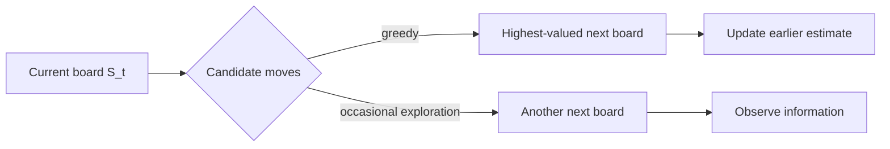
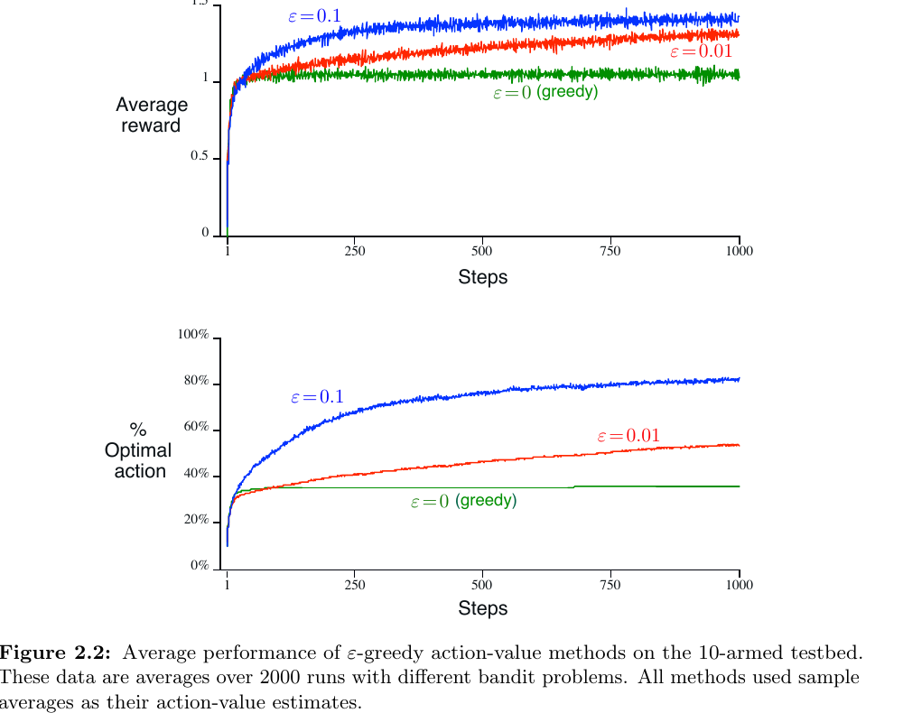
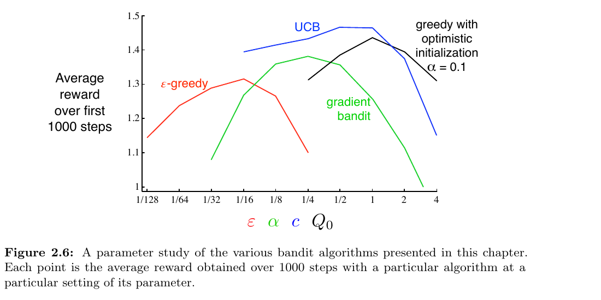
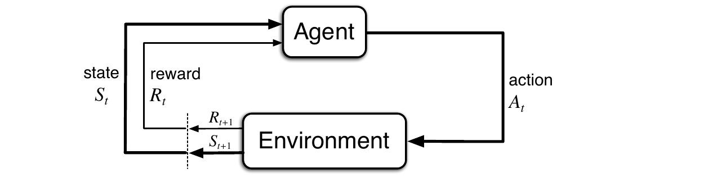
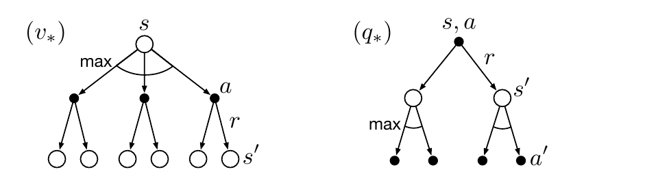
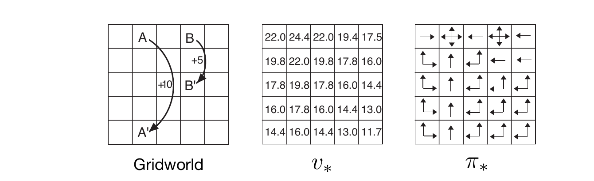
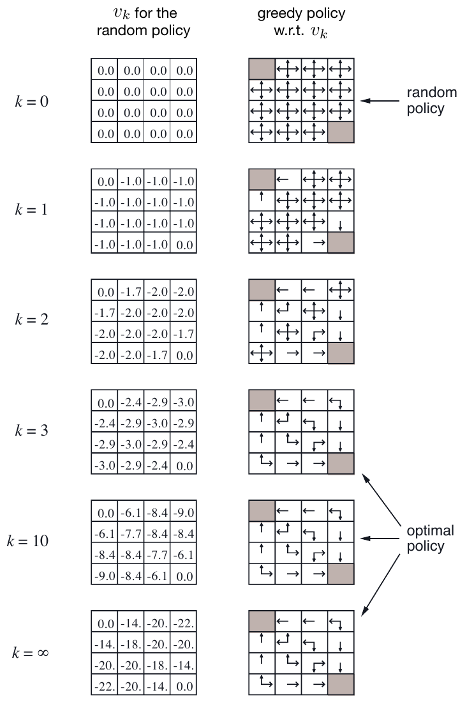
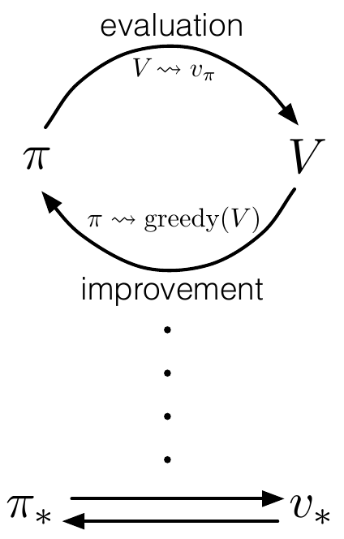
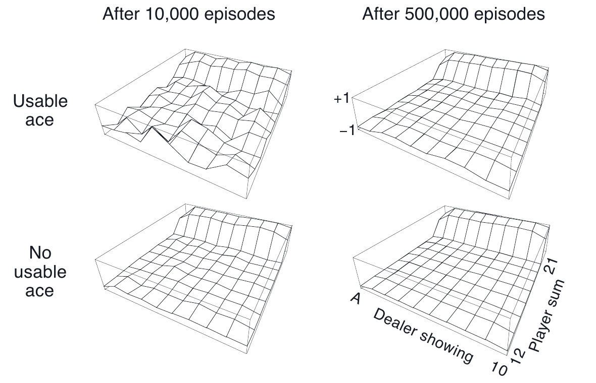
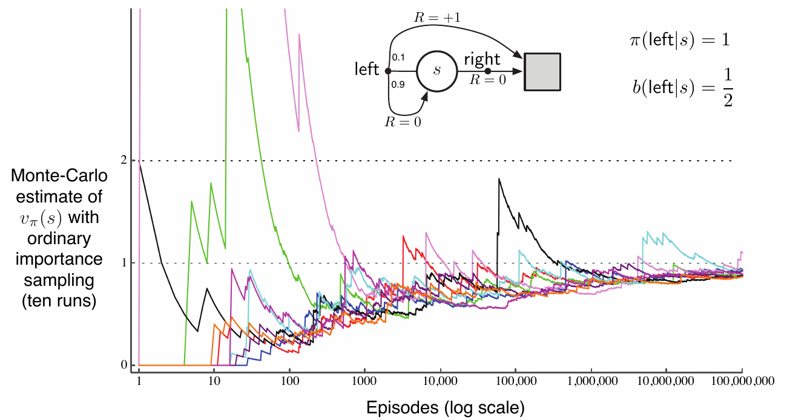

# Reinforcement Learning: An Introduction

> Chapter-by-chapter notes on reinforcement learning as goal-directed learning through interaction. The notes emphasize the problem formulation, mathematical definitions, algorithmic ideas, and distinctions that are easy to confuse.

**Reference:** Richard S. Sutton and Andrew G. Barto, *Reinforcement Learning: An Introduction*, second edition, MIT Press, 2018 (2020 printing). See the authors' [book page](http://incompleteideas.net/book/the-book-2nd.html) for supporting material.

## Book Catalog

| Part | Chapter | Topic | Note status |
|:--:|:--:|:--|:--:|
| Foundations | 1 | [Introduction](#chapter-1-introduction) | Complete |
| I | 2 | [Multi-armed Bandits](#chapter-2-multi-armed-bandits) | Complete |
| I | 3 | [Finite Markov Decision Processes](#chapter-3-finite-markov-decision-processes) | Complete |
| I | 4 | [Dynamic Programming](#chapter-4-dynamic-programming) | Complete |
| I | 5 | [Monte Carlo Methods](#chapter-5-monte-carlo-methods) | Complete |
| I | 6 | Temporal-Difference Learning | Not started |
| I | 7 | $n$-step Bootstrapping | Not started |
| I | 8 | Planning and Learning with Tabular Methods | Not started |
| II | 9 | On-policy Prediction with Approximation | Not started |
| II | 10 | On-policy Control with Approximation | Not started |
| II | 11 | Off-policy Methods with Approximation | Not started |
| II | 12 | Eligibility Traces | Not started |
| II | 13 | Policy Gradient Methods | Not started |
| III | 14 | Psychology | Not started |
| III | 15 | Neuroscience | Not started |
| III | 16 | Applications and Case Studies | Not started |
| III | 17 | Frontiers | Not started |

## Chapter 1 Catalog

| Section | Topic |
|:--|:--|
| 1.1 | [What Reinforcement Learning Is](#11-what-reinforcement-learning-is) |
| 1.2 | [The Interaction Problem](#12-the-interaction-problem) |
| 1.3 | [Elements of an RL System](#13-elements-of-an-rl-system) |
| 1.4 | [Scope and Assumptions](#14-scope-and-assumptions) |
| 1.5 | [Tic-Tac-Toe as a Minimal RL Example](#15-tic-tac-toe-as-a-minimal-rl-example) |
| 1.6 | [Three Historical Threads](#16-three-historical-threads) |
| 1.7 | [Common Confusions](#17-common-confusions) |
| 1.8 | [Formula Sheet](#18-formula-sheet) |
| 1.9 | [Understanding Checklist](#19-understanding-checklist) |

## Chapter 2 Catalog

| Section | Topic |
|:--|:--|
| 2.1 | [The Bandit Problem](#21-the-bandit-problem) |
| 2.2 | [Action-Value Methods](#22-action-value-methods) |
| 2.3 | [The 10-Armed Testbed](#23-the-10-armed-testbed) |
| 2.4 | [Incremental Estimation](#24-incremental-estimation) |
| 2.5 | [Nonstationary Problems](#25-nonstationary-problems) |
| 2.6 | [Optimistic Initial Values](#26-optimistic-initial-values) |
| 2.7 | [Upper-Confidence-Bound Selection](#27-upper-confidence-bound-selection) |
| 2.8 | [Gradient Bandits](#28-gradient-bandits) |
| 2.9 | [Contextual Bandits](#29-contextual-bandits) |
| 2.10 | [Method Comparison](#210-method-comparison) |
| 2.11 | [Common Confusions](#211-common-confusions) |
| 2.12 | [Formula Sheet](#212-formula-sheet) |
| 2.13 | [Understanding Checklist](#213-understanding-checklist) |

## Chapter 3 Catalog

| Section | Topic |
|:--|:--|
| 3.1 | [Agent-Environment Interface](#31-agent-environment-interface) |
| 3.2 | [MDP Dynamics and the Markov Property](#32-mdp-dynamics-and-the-markov-property) |
| 3.3 | [Goals and Rewards](#33-goals-and-rewards) |
| 3.4 | [Returns, Episodes, and Discounting](#34-returns-episodes-and-discounting) |
| 3.5 | [Policies and Value Functions](#35-policies-and-value-functions) |
| 3.6 | [Bellman Equations for a Policy](#36-bellman-equations-for-a-policy) |
| 3.7 | [Optimal Policies and Optimal Values](#37-optimal-policies-and-optimal-values) |
| 3.8 | [Bellman Optimality Equations](#38-bellman-optimality-equations) |
| 3.9 | [Optimality and Approximation](#39-optimality-and-approximation) |
| 3.10 | [Common Confusions](#310-common-confusions) |
| 3.11 | [Formula Sheet](#311-formula-sheet) |
| 3.12 | [Understanding Checklist](#312-understanding-checklist) |

## Chapter 4 Catalog

| Section | Topic |
|:--|:--|
| 4.1 | [From Bellman Equations to Planning](#41-from-bellman-equations-to-planning) |
| 4.2 | [Iterative Policy Evaluation](#42-iterative-policy-evaluation) |
| 4.3 | [Gridworld: Evaluation and Greedy Actions](#43-gridworld-evaluation-and-greedy-actions) |
| 4.4 | [Policy Improvement](#44-policy-improvement) |
| 4.5 | [Policy Iteration](#45-policy-iteration) |
| 4.6 | [Value Iteration](#46-value-iteration) |
| 4.7 | [Jack's Car Rental and the Gambler's Problem](#47-jacks-car-rental-and-the-gamblers-problem) |
| 4.8 | [Asynchronous Dynamic Programming](#48-asynchronous-dynamic-programming) |
| 4.9 | [Generalized Policy Iteration](#49-generalized-policy-iteration) |
| 4.10 | [Python Example: Gridworld Updates](#410-python-example-gridworld-updates) |
| 4.11 | [Efficiency and Method Comparison](#411-efficiency-and-method-comparison) |
| 4.12 | [Common Confusions](#412-common-confusions) |
| 4.13 | [Formula Sheet](#413-formula-sheet) |
| 4.14 | [Understanding Checklist](#414-understanding-checklist) |

## Chapter 5 Catalog

| Section | Topic |
|:--|:--|
| 5.1 | [Monte Carlo Prediction](#51-monte-carlo-prediction) |
| 5.2 | [Monte Carlo Estimation of Action Values](#52-monte-carlo-estimation-of-action-values) |
| 5.3 | [Monte Carlo Control with Exploring Starts](#53-monte-carlo-control-with-exploring-starts) |
| 5.4 | [On-Policy Control without Exploring Starts](#54-on-policy-control-without-exploring-starts) |
| 5.5 | [Off-Policy Prediction via Importance Sampling](#55-off-policy-prediction-via-importance-sampling) |
| 5.6 | [Incremental Implementation](#56-incremental-implementation) |
| 5.7 | [Off-Policy Monte Carlo Control](#57-off-policy-monte-carlo-control) |
| 5.8 | [Discounting-Aware Importance Sampling](#58-discounting-aware-importance-sampling) |
| 5.9 | [Per-Decision Importance Sampling](#59-per-decision-importance-sampling) |
| 5.10 | [Python Example: Visits and Importance Weights](#510-python-example-visits-and-importance-weights) |
| 5.11 | [Method Comparison](#511-method-comparison) |
| 5.12 | [Common Confusions](#512-common-confusions) |
| 5.13 | [Formula Sheet](#513-formula-sheet) |
| 5.14 | [Understanding Checklist](#514-understanding-checklist) |

---

## Chapter 1: Introduction

Reinforcement learning (RL) studies how an agent can improve goal-directed behavior through interaction. The agent is not given the correct action for every situation and may not know how the environment works. It must learn from the consequences of its own decisions.

Two features define the central difficulty:

- **Trial-and-error search:** useful actions must be discovered through experience.
- **Delayed consequences:** an action can change later states, opportunities, and rewards, not just the next reward.

### 1.1 What Reinforcement Learning Is

The term **reinforcement learning** can refer to three related but distinct things:

| Meaning | Question |
|:--|:--|
| A problem | How should an agent act to maximize long-term reward in an uncertain environment? |
| A family of methods | How can experience be used to learn effective behavior? |
| A research field | What principles and algorithms solve such sequential decision problems? |

Keeping the **problem** separate from a particular **solution method** is essential. A Markov decision process describes an RL problem; Q-learning, policy gradients, and planning are different methods that may solve it.

#### Relationship to other learning paradigms

| Paradigm | Learning signal | Primary objective |
|:--|:--|:--|
| Supervised learning | Correct target for each example | Predict the supplied target on new data |
| Unsupervised learning | Unlabeled observations | Discover structure in data |
| Reinforcement learning | Rewards produced by interaction | Choose actions that maximize long-term cumulative reward |

A reward is **not** a label for the correct action. It evaluates consequences, possibly long after the action that contributed to them. Therefore, RL includes a temporal **credit-assignment problem**: which earlier decisions deserve credit or blame for later outcomes?

#### Exploration and exploitation

The agent must balance:

- **exploitation:** choose actions currently believed to be effective;
- **exploration:** try uncertain alternatives to improve future decisions.

Pure exploitation can lock the agent into a suboptimal behavior. Pure exploration gathers information but fails to use it. In stochastic environments, repeated samples are needed because one outcome does not reveal an action's expected consequence.

### 1.2 The Interaction Problem

RL treats decision making as a feedback loop between an **agent** and an **environment**.


```mermaid
flowchart LR
    A[Agent] -->|action| E[Environment]
    E -->|next state and reward| A
```

At time $t$:

1. The agent receives information about the current situation, represented as $S_t$.
2. It selects an action $A_t$.
3. The environment transitions and returns a reward $R_{t+1}$ and next state $S_{t+1}$.
4. The agent uses this experience to improve future decisions.

The formal Markov decision process is introduced in Chapter 3. At this stage, the important point is that actions affect both immediate outcomes and the distribution of future situations.

#### What the examples have in common

Games, robot control, industrial control, and everyday behavior look different, but fit the same abstraction when they contain:

- an active decision maker;
- repeated interaction rather than a fixed dataset alone;
- uncertainty about action outcomes;
- consequences extending over time;
- a measurable goal expressed through reward;
- an opportunity to improve using experience.

The agent can be a complete robot or only one decision-making subsystem. The boundary is chosen so that actions cross from agent to environment and observations or rewards return across that boundary.

### 1.3 Elements of an RL System

Beyond the agent and environment, the book identifies four main elements.

| Element | Role | Typical notation |
|:--|:--|:--:|
| Policy | Specifies behavior: which action to take in each state | $\pi(a\mid s)$ |
| Reward signal | Defines immediate goal feedback | $R_{t+1}$ |
| Value function | Predicts long-term cumulative reward | $v_\pi(s)$ or $q_\pi(s,a)$ |
| Environment model | Predicts possible transitions and rewards; optional | $p(s',r\mid s,a)$ |

#### Policy

A **policy** defines the agent's behavior. A stochastic policy assigns an action distribution:

$$
\pi(a\mid s)=\Pr(A_t=a\mid S_t=s).
$$

A policy may be a table, a neural network, or a search procedure. It is the only one of the four elements required to generate behavior.

#### Reward versus value

A **reward** evaluates an immediate event. A **value** predicts the total reward obtainable afterward under a policy:

$$
v_\pi(s)
=\mathbb E_\pi\left[G_t\mid S_t=s\right],
$$

where $G_t$ denotes future cumulative reward. Chapter 3 defines the return $G_t$ precisely.

This distinction explains why an action with low immediate reward may still be desirable: it can lead to a state with high future value. Conversely, a tempting immediate reward may lead to poor future outcomes.

Reward defines **what the task asks for**. Value is an agent's learned prediction used to make farsighted decisions. Values are derived from rewards, but are usually harder to estimate because they depend on future trajectories.

#### Model

A **model** predicts how the environment responds. Given $(s,a)$, it may predict the next state and reward or their probability distribution.

- **Model-based RL** uses a model to evaluate possible futures or plan before acting.
- **Model-free RL** learns behavior or values directly from experience without using such transition predictions for decision making.

Model-free does not mean "no learning," "no internal state," or "no prior knowledge." It specifically describes whether the method uses an environment transition/reward model.

### 1.4 Scope and Assumptions

#### State is treated as given

Most of the book assumes that a state signal is already available to the policy, value function, and model. Constructing a useful state representation is a major problem, but is mostly separated from the decision-making questions studied here.

This assumption should not be mistaken for full observability. A practical state may be incomplete or learned, and different physical situations may produce the same observation.

#### Focus on learning during interaction

The book emphasizes methods that use individual transitions and improve while interacting. This differs from evolutionary policy search that may evaluate each fixed policy only through whole-episode outcomes.

Transition-level learning can be more data-efficient because it uses information about:

- which states were visited;
- which actions were selected;
- which local predictions were wrong;
- how later outcomes relate to earlier decisions.

Evolutionary methods can still solve sequential decision problems, but they are not the book's main focus.

#### Value functions are central, not mandatory

Most methods in the book estimate values because values provide structured information for searching over policies. Nevertheless, an algorithm can solve an RL problem without explicitly learning a value function; direct policy optimization is one example.

### 1.5 Tic-Tac-Toe as a Minimal RL Example

The tic-tac-toe example shows how values, exploration, online updates, and delayed outcomes work together.

#### Problem setup

Assume the learning player uses X and plays repeatedly against a fixed but imperfect opponent.

| RL concept | Tic-tac-toe instance |
|:--|:--|
| State $s$ | Current board configuration |
| Action $a$ | A legal X placement |
| Policy | Usually choose the move leading to the highest-valued board |
| Exploration | Occasionally choose another legal move |
| Value $V(s)$ | Estimated probability of eventually winning from $s$ |

One initialization is:

$$
V(s)=
\begin{cases}
1, & \text{X has already won},\\
0, & \text{X can no longer win},\\
0.5, & \text{otherwise}.
\end{cases}
$$

The intermediate value $0.5$ represents uncertainty, not a known draw probability.

#### Action selection

For each legal move, the agent examines the resulting board and its current value estimate. It usually chooses the largest value but occasionally explores another move.


```mermaid
flowchart LR
    S[Current board S_t] --> C{Candidate moves}
    C -->|greedy| G[Highest-valued next board]
    C -->|occasional exploration| X[Another next board]
    G --> U[Update earlier estimate]
    X --> O[Observe information]
```

In this specific example, the book updates after greedy moves but not exploratory moves. This makes $V$ estimate outcomes for the greedy target behavior. Updating exploratory moves without correction would instead move the estimate toward the exploratory behavior policy.

#### Temporal-difference update

After a greedy transition from $S_t$ to $S_{t+1}$, update the earlier estimate toward the later one:

$$
\boxed{
V(S_t)
\leftarrow
V(S_t)+\alpha\left[V(S_{t+1})-V(S_t)\right]
}
$$

where $0<\alpha\leq1$ is the step size. The quantity

$$
\delta_t=V(S_{t+1})-V(S_t)
$$

is the temporal difference in this reward-free intermediate transition. Terminal values eventually propagate backward through states that precede wins or failures.

The update is an incremental average-like operation:

$$
V_{\text{new}}(S_t)
=(1-\alpha)V_{\text{old}}(S_t)
+\alpha V(S_{t+1}).
$$

Small $\alpha$ changes estimates slowly; large $\alpha$ responds more strongly to recent experience. A decreasing step size supports convergence in a stationary setting, whereas a persistent step size can track a slowly changing opponent.

#### Why this is an RL solution

The method improves from games played against the actual opponent without first learning a complete opponent model.

- **Not minimax:** minimax protects against optimal opposition and may ignore exploitable mistakes made by this opponent.
- **Not classical dynamic programming:** the opponent's transition probabilities are not supplied in advance.
- **Not whole-policy evolutionary search:** the learner updates values using states encountered within each game.

The player does know the deterministic result of its own legal move, allowing it to compare successor boards. It is therefore model-free with respect to the opponent, but uses known game rules for one-step lookahead.

The table representation works only because tic-tac-toe is small. Large problems require function approximation so experience in one state can generalize to similar states.

### 1.6 Three Historical Threads

Modern RL emerged from three lines of work:

| Thread | Core idea | Contribution to modern RL |
|:--|:--|:--|
| Trial-and-error learning | Reinforced actions become more likely | Learning behavior directly from consequences |
| Optimal control | Optimize sequential decisions using value functions and dynamic programming | Formal objectives, Bellman recursion, and planning |
| Temporal-difference learning | Adjust predictions using differences between successive predictions | Online value learning before final outcomes are known |

These threads developed partly independently and converged in the 1980s. Modern RL combines the trial-and-error learner, the value-based view of optimal control, and TD methods for learning values from ongoing experience.

### 1.7 Common Confusions

#### "RL is an algorithm"

RL is also a problem formulation and a field. There is no single RL algorithm.

#### "Reward tells the agent the correct action"

Reward evaluates outcomes. It may be delayed and does not directly identify which action was optimal.

#### "Reward and value are interchangeable"

Reward is immediate feedback from the environment. Value is a learned prediction of future cumulative reward under a policy.

#### "RL is unsupervised learning"

RL does not require action labels, but it optimizes a reward objective rather than merely discovering structure in unlabeled data.

#### "Model-free means the agent cannot plan or look ahead at all"

The term concerns use of an environment model. A system may combine model-free learned values with known local rules or place model-free components inside a larger planning system.

#### "Exploration is always random action selection"

Random action selection is only the simplest strategy. Exploration can be directed by uncertainty, optimism, information gain, or other criteria.

### 1.8 Formula Sheet

| Concept | Formula |
|:--|:--|
| Stochastic policy | $\pi(a\mid s)=\Pr(A_t=a\mid S_t=s)$ |
| State value preview | $v_\pi(s)=\mathbb E_\pi[G_t\mid S_t=s]$ |
| Tic-tac-toe TD difference | $\delta_t=V(S_{t+1})-V(S_t)$ |
| Tic-tac-toe TD update | $V(S_t)\leftarrow V(S_t)+\alpha\delta_t$ |
| Convex-combination form | $V_{\text{new}}=(1-\alpha)V_{\text{old}}+\alpha V_{\text{target}}$ |

### 1.9 Understanding Checklist

After this chapter, you should be able to:

- explain why RL is neither supervised nor unsupervised learning;
- identify delayed reward and exploration as central RL difficulties;
- distinguish policy, reward, value, and model;
- distinguish model-free from model-based methods;
- explain the tic-tac-toe TD update and the role of $\alpha$;
- explain why transition-level value learning can use experience more efficiently than whole-policy evaluation;
- identify the trial-and-error, optimal-control, and TD roots of modern RL.

Chapter 2 isolates the exploration-exploitation problem by removing state transitions and studying multi-armed bandits.

---

## Chapter 2: Multi-armed Bandits

A multi-armed bandit isolates one central RL problem: **how should an agent balance exploiting what currently looks best against exploring actions whose values remain uncertain?**

Unlike full RL, a basic bandit has only one recurring situation. An action affects the immediate reward, but it does not change a state or influence later reward dynamics. This removes delayed credit assignment and lets us study exploration directly.

### 2.1 The Bandit Problem

At each time step $t$:

1. The agent chooses one of $k$ actions, $A_t\in\{1,\ldots,k\}$.
2. The environment samples a reward $R_t$ from the selected action's reward distribution.
3. The agent updates its knowledge and chooses again.

The true value of action $a$ is its expected immediate reward:

$$
\boxed{
q_*(a)=\mathbb E[R_t\mid A_t=a].
}
$$

The learner does not know $q_*(a)$ and maintains an estimate $Q_t(a)$. If all true values were known, the optimal action would simply be

$$
a_*\in\arg\max_a q_*(a).
$$

The difficulty comes from learning these values while simultaneously trying to obtain reward.

#### Evaluative rather than instructive feedback

After choosing an action, the reward evaluates that action's outcome. It does **not** reveal:

- the rewards that unselected actions would have produced;
- whether the selected action was optimal;
- which action should be selected next.

This partial feedback creates the need for active exploration.

#### Exploration versus exploitation

- **Exploitation:** choose an action with the highest current estimate $Q_t(a)$.
- **Exploration:** choose another action to improve knowledge that may increase future reward.

Exploitation maximizes reward according to current information. Exploration may sacrifice immediate reward to improve later decisions. The useful balance depends on uncertainty, reward noise, nonstationarity, and the remaining decision horizon.

### 2.2 Action-Value Methods

An action-value method has two components:

1. estimate each action's value;
2. use those estimates to select actions.

#### Sample-average estimate

Let

$$
N_t(a)=\sum_{i=1}^{t-1}\mathbf 1\{A_i=a\}
$$

be the number of times action $a$ was selected before time $t$. Its sample-average estimate is

$$
Q_t(a)
=
\frac{
\sum_{i=1}^{t-1}R_i\mathbf 1\{A_i=a\}
}{N_t(a)}.
$$

This expression applies after the action has been selected at least once. When $N_t(a)=0$, the implementation uses an initial estimate $Q_1(a)$ or ensures that every action is tried before applying the sample average.

For a stationary reward distribution, $Q_t(a)$ converges to $q_*(a)$ as $N_t(a)\to\infty$.

#### Greedy selection

A greedy agent chooses

$$
A_t\in\arg\max_a Q_t(a).
$$

This can fail permanently: an unlucky early reward may make the optimal action look bad, after which a purely greedy agent may never sample it again.

#### Epsilon-greedy selection

An $\varepsilon$-greedy policy chooses:

$$
A_t=
\begin{cases}
\text{a greedy action}, & \text{with probability }1-\varepsilon,\\
\text{a uniformly random action}, & \text{with probability }\varepsilon.
\end{cases}
$$

The random branch includes greedy actions. Therefore, if the greedy action is unique, its total selection probability is

$$
1-\varepsilon+\frac{\varepsilon}{k},
$$

while each other action is selected with probability $\varepsilon/k$.

A larger $\varepsilon$ discovers good actions faster but continues selecting inferior actions more often. A smaller $\varepsilon$ learns more slowly but wastes less reward after the estimates become accurate.

### 2.3 The 10-Armed Testbed

The book compares methods on 2,000 independently generated 10-action bandits. For each run,

$$
q_*(a)\sim\mathcal N(0,1),
\qquad
R_t\mid A_t=a\sim\mathcal N(q_*(a),1).
$$

Each method acts for 1,000 steps. Performance is averaged across runs using:

- **average reward** at each step;
- **percentage of optimal-action selections** at each step.



*Greedy and $\varepsilon$-greedy methods on the 10-armed testbed. Cropped from book Figure 2.2.*

The experiment shows:

- Greedy selection improves quickly at first but often commits to a suboptimal action because of noisy initial samples.
- $\varepsilon=0.1$ explores enough to identify the optimal action relatively quickly, but its long-run optimal-action rate is capped below 100% by continued random exploration.
- $\varepsilon=0.01$ improves more slowly but eventually loses less reward to exploration.

These conclusions depend on the task. More reward noise or changing action values makes continued exploration more valuable. In a deterministic stationary task, much less exploration may be sufficient.

### 2.4 Incremental Estimation

Storing every reward is unnecessary. Suppose $Q_n$ is the estimate after $n-1$ observations of one action. After receiving $R_n$,

$$
\boxed{
Q_{n+1}=Q_n+\frac{1}{n}(R_n-Q_n).
}
$$

This requires constant memory and constant computation per update.

The equation is an instance of the general learning rule

$$
\boxed{
\text{New estimate}
=\text{Old estimate}
+\text{Step size}
\left(\text{Target}-\text{Old estimate}\right).
}
$$

Here:

- target: $R_n$;
- prediction error: $R_n-Q_n$;
- step size: $1/n$.

For an action-indexed implementation, only the selected action is updated:

$$
N(A_t)\leftarrow N(A_t)+1,
$$

$$
Q(A_t)
\leftarrow
Q(A_t)+\frac{1}{N(A_t)}\left(R_t-Q(A_t)\right).
$$

The other action estimates remain unchanged.

### 2.5 Nonstationary Problems

Sample averages weight every observation equally. This is appropriate when $q_*(a)$ is fixed, but it adapts slowly when action values change.

A constant step size gives recent rewards more influence:

$$
\boxed{
Q_{n+1}=Q_n+\alpha(R_n-Q_n),
\qquad 0<\alpha\leq1.
}
$$

Expanding the recursion gives

$$
Q_{n+1}
=(1-\alpha)^nQ_1
+\sum_{i=1}^{n}\alpha(1-\alpha)^{n-i}R_i.
$$

Thus the weight on an old reward decays exponentially with its age. The effective memory scale is roughly $1/\alpha$ observations: larger $\alpha$ adapts faster but produces noisier estimates.

#### Convergence versus tracking

For stochastic approximation with varying step sizes $\alpha_n(a)$, convergence under standard assumptions requires

$$
\sum_{n=1}^{\infty}\alpha_n(a)=\infty,
\qquad
\sum_{n=1}^{\infty}\alpha_n^2(a)<\infty.
$$

The sample-average choice $\alpha_n=1/n$ satisfies both conditions. A constant $\alpha$ violates the second, so its estimate keeps fluctuating rather than converging to a fixed number.

That is a feature in a nonstationary task: the target itself moves, so continued adaptation is preferable to convergence to an old average.

| Setting | Suitable update | Reason |
|:--|:--|:--|
| Stationary action values | Sample average, $\alpha_n=1/n$ | Uses all samples and removes initial bias |
| Nonstationary action values | Constant $\alpha$ | Forgets stale rewards and tracks changes |

### 2.6 Optimistic Initial Values

Instead of initializing $Q_1(a)$ near the expected reward, set all estimates deliberately high. A greedy agent then tries an action, receives a disappointing reward, lowers its estimate, and moves to another still-optimistic action.

This creates exploration without random action selection.

**Strengths:**

- simple;
- useful when prior reward scale is known;
- exploration naturally decreases as estimates become realistic.

**Limitations:**

- exploration is driven only by initial conditions;
- it does not restart when a nonstationary task changes;
- the optimistic value is another parameter requiring a meaningful reward scale;
- with constant step size, the initial bias decays but never disappears exactly at finite time.

Optimistic initialization is therefore effective mainly as a simple stationary-problem technique, not a general uncertainty model.

### 2.7 Upper-Confidence-Bound Selection

$\varepsilon$-greedy exploration selects nongreedy actions indiscriminately. Upper-confidence-bound (UCB) selection instead favors actions that either look valuable or have not been sampled enough:

$$
\boxed{
A_t
=\arg\max_a
\left[
Q_t(a)+c\sqrt{\frac{\ln t}{N_t(a)}}
\right].
}
$$

The two terms have different roles:

| Term | Meaning |
|:--|:--|
| $Q_t(a)$ | Exploitation: current estimated reward |
| $c\sqrt{\ln t/N_t(a)}$ | Exploration bonus: uncertainty proxy |

Selecting action $a$ increases $N_t(a)$ and shrinks its bonus. Ignoring it while $t$ grows increases its relative bonus, so every action is eventually reconsidered. An untried action, $N_t(a)=0$, is assigned priority rather than evaluated by the undefined formula.

The parameter $c>0$ controls exploration. UCB uses samples more selectively than $\varepsilon$-greedy and performs well on the stationary testbed. Its simple count-based uncertainty is harder to extend to nonstationary problems, large state spaces, and function approximation.

### 2.8 Gradient Bandits

Gradient bandits do not estimate rewards with $Q_t(a)$. They learn an unconstrained **preference** $H_t(a)$ for each action and convert preferences into probabilities with softmax:

$$
\boxed{
\pi_t(a)
=\Pr(A_t=a)
=\frac{e^{H_t(a)}}{\sum_{b=1}^{k}e^{H_t(b)}}.
}
$$

Only preference differences matter. Adding the same constant to every $H_t(a)$ leaves all action probabilities unchanged.

After selecting $A_t$ and observing $R_t$, the unified update for every action is

$$
\boxed{
H_{t+1}(a)
=H_t(a)
+\alpha(R_t-\bar R_t)
\left(\mathbf 1\{a=A_t\}-\pi_t(a)\right).
}
$$

For the selected action this becomes

$$
H_{t+1}(A_t)
=H_t(A_t)
+\alpha(R_t-\bar R_t)(1-\pi_t(A_t)),
$$

and for $a\neq A_t$,

$$
H_{t+1}(a)
=H_t(a)
-\alpha(R_t-\bar R_t)\pi_t(a).
$$

#### Role of the reward baseline

$\bar R_t$ is commonly an incremental average reward. The advantage-like term

$$
R_t-\bar R_t
$$

asks whether the selected action performed better or worse than the current reference level.

- Above-baseline reward increases its relative preference.
- Below-baseline reward decreases its relative preference.
- The baseline does not change the expected gradient if it does not depend on the selected action, but it can substantially reduce update variance and improve learning speed.

This update is a stochastic gradient-ascent method for expected immediate reward. It also previews later policy-gradient algorithms: parameterize a stochastic policy and reinforce sampled actions according to an advantage signal.

### 2.9 Contextual Bandits

A basic bandit learns one best action for one recurring situation. A **contextual bandit** observes a context $X_t$ and learns a context-dependent policy:

$$
\pi(a\mid x).
$$

For example, different display colors may identify different bandit tasks, each with a different best action.

| Problem | Context/state | Does action affect the next context? | Learning target |
|:--|:--:|:--:|:--|
| Basic bandit | No | No | One best action |
| Contextual bandit | Yes | No | Best action for each context |
| Full RL | Yes | Yes | Policy accounting for future consequences |

Contextual bandits introduce association between situations and actions, but still lack the delayed effects and state-transition control that define full RL.

### 2.10 Method Comparison



*Parameter study on the stationary 10-armed testbed. Cropped from book Figure 2.6.*

The parameter study averages reward over the first 1,000 steps and varies each method's main parameter on a logarithmic scale. Its key lessons are:

- every method performs poorly with too little or too much exploration;
- useful parameter ranges are broad rather than single magic values;
- UCB performs best on this particular stationary testbed;
- the result is not a universal ranking because assumptions and failure modes differ.

| Method | Exploration mechanism | Main parameter | Main limitation |
|:--|:--|:--|:--|
| $\varepsilon$-greedy | Uniform random actions | $\varepsilon$ | Ignores uncertainty and action quality during exploration |
| Optimistic initialization | Initially inflated estimates | $Q_1$ | Exploration is temporary |
| UCB | Value plus count-based uncertainty bonus | $c$ | Relies on stationary, count-based uncertainty |
| Gradient bandit | Learned stochastic preferences | $\alpha$ | Sensitive to step size; does not estimate action values |

For nonstationarity, action selection and value adaptation are separate concerns: continued exploration can rediscover changed actions, while a constant step size lets estimates forget obsolete rewards. Usually both are needed.

### 2.11 Common Confusions

#### "A reward reveals the best action"

It reveals only one noisy outcome from the selected action. Other actions remain counterfactual and unobserved.

#### "Greedy means optimal"

Greedy means optimal according to the current estimates $Q_t$, which may be inaccurate. The optimal action is defined by the unknown true values $q_*$.

#### "$\varepsilon$ is the probability of selecting a nongreedy action"

Not exactly. With probability $\varepsilon$, selection is uniform over **all** actions, including greedy ones. With one greedy action, its probability is $1-\varepsilon+\varepsilon/k$.

#### "Sample averages and constant step sizes estimate the same history"

They use the same update shape but different weighting. Sample averages weight all observations equally; constant step sizes exponentially discount old observations.

#### "Constant-step-size estimates should converge"

They are designed to keep adapting. Their persistent variation is useful when the true action values change.

#### "Optimistic initialization solves exploration"

It causes early exploration but provides no renewed exploration after later changes.

#### "The UCB bonus is an exact confidence interval"

In this chapter it is best understood as a useful uncertainty-inspired bonus. Its theoretical confidence interpretation depends on assumptions about the reward process.

#### "Gradient bandit preferences are predicted rewards"

$H_t(a)$ has no reward-unit interpretation. Only relative preferences matter, and softmax turns them into action probabilities.

### 2.12 Formula Sheet

| Concept | Formula |
|:--|:--|
| True action value | $q_*(a)=\mathbb E[R_t\mid A_t=a]$ |
| Greedy action | $A_t\in\arg\max_a Q_t(a)$ |
| Unique greedy action under $\varepsilon$-greedy | $\Pr(A_t=a_g)=1-\varepsilon+\varepsilon/k$ |
| Sample-average update | $Q_{n+1}=Q_n+\frac{1}{n}(R_n-Q_n)$ |
| Constant-step update | $Q_{n+1}=Q_n+\alpha(R_n-Q_n)$ |
| Recency weight on $R_i$ | $\alpha(1-\alpha)^{n-i}$ |
| Convergence conditions | $\sum_n\alpha_n=\infty$, $\sum_n\alpha_n^2<\infty$ |
| UCB selection | $A_t=\arg\max_a[Q_t(a)+c\sqrt{\ln t/N_t(a)}]$ |
| Softmax policy | $\pi_t(a)=e^{H_t(a)}/\sum_b e^{H_t(b)}$ |
| Gradient preference update | $H_{t+1}(a)=H_t(a)+\alpha(R_t-\bar R_t)(\mathbf 1\{a=A_t\}-\pi_t(a))$ |

### 2.13 Understanding Checklist

After this chapter, you should be able to:

- define $q_*(a)$ and distinguish it from $Q_t(a)$;
- explain why bandit feedback requires exploration;
- calculate exact action probabilities under $\varepsilon$-greedy selection;
- derive the incremental sample-average update;
- explain why constant step sizes track nonstationary values;
- compare $\varepsilon$-greedy, optimistic initialization, UCB, and gradient bandits;
- explain the role of the baseline in the gradient-bandit update;
- distinguish basic bandits, contextual bandits, and full RL.

Chapter 3 adds states, transitions, delayed return, and policies, turning the one-step bandit abstraction into a finite Markov decision process.

---

## Chapter 3: Finite Markov Decision Processes

A finite Markov decision process (MDP) formalizes sequential decision making when actions affect not only immediate rewards but also the states, choices, and rewards available later.

The essential difference from a bandit is

$$
q_*(a)
\quad\longrightarrow\quad
q_*(s,a).
$$

An action must now be evaluated in context and by its long-term consequences.

### 3.1 Agent-Environment Interface

The **agent** selects actions. Everything it cannot arbitrarily control is treated as the **environment**, which produces the next state and reward.



*At time $t$, the agent receives $S_t$ and $R_t$, chooses $A_t$, and then receives $R_{t+1}$ and $S_{t+1}$. Cropped from book Figure 3.1.*

The interaction generates a trajectory

$$
S_0,A_0,R_1,S_1,A_1,R_2,S_2,\ldots
$$

At each discrete time $t$:

1. The agent observes $S_t\in\mathcal S$.
2. It selects $A_t\in\mathcal A(S_t)$.
3. The environment produces $R_{t+1}\in\mathcal R$ and $S_{t+1}$.

The indexing matters: $R_{t+1}$ is the reward resulting from action $A_t$, not from $A_{t+1}$.

#### Choosing the boundary

The agent-environment boundary is a modeling decision, not necessarily a physical boundary.

For a robot-control agent, motors, transmission dynamics, sensors, and low-level controllers may all be modeled as part of the environment. A higher-level agent might instead choose semantic skills while a lower-level controller belongs to its environment.

A useful rule is:

> Put inside the agent only what the learning algorithm can choose or change directly. Put the task dynamics and reward computation outside it.

The boundary marks the limit of direct control, not the limit of the agent's knowledge. An agent can know the complete environment model and still face a difficult planning problem.

### 3.2 MDP Dynamics and the Markov Property

For finite state, action, and reward sets, the complete one-step dynamics are

$$
\boxed{
p(s',r\mid s,a)
=\Pr\{S_{t+1}=s',R_{t+1}=r\mid S_t=s,A_t=a\}
}.
$$

For every valid state-action pair,

$$
\sum_{s'\in\mathcal S^+}\sum_{r\in\mathcal R}
p(s',r\mid s,a)=1,
$$

where $\mathcal S^+$ includes the terminal state in an episodic task.

The four-argument function contains both transition and reward uncertainty. Useful quantities derived from it are

$$
p(s'\mid s,a)
=\sum_r p(s',r\mid s,a),
$$

$$
r(s,a)
=\mathbb E[R_{t+1}\mid S_t=s,A_t=a]
=\sum_{s',r}r\,p(s',r\mid s,a),
$$

and, when $p(s'\mid s,a)>0$,

$$
r(s,a,s')
=\sum_r r\,
\frac{p(s',r\mid s,a)}{p(s'\mid s,a)}.
$$

#### Markov property

A state representation is **Markov** if the current state contains all information from the history that is relevant for predicting the next state and reward:

$$
\begin{aligned}
&\Pr(S_{t+1}=s',R_{t+1}=r
\mid S_0,A_0,\ldots,S_t=s,A_t=a)\\
&\qquad=p(s',r\mid s,a).
\end{aligned}
$$

This does not mean the environment is deterministic. It means that, once $(S_t,A_t)$ is known, earlier history adds no predictive information about $(S_{t+1},R_{t+1})$.

The Markov assumption is primarily a requirement on **state design**. A raw camera image may be non-Markov if velocity, hidden objects, or earlier events affect the future. Stacking observations or maintaining a learned memory can make the agent's internal state closer to Markov.

#### Compact MDP specification

A finite discounted MDP can be summarized by

$$
(\mathcal S,\mathcal A,\mathcal R,p,\gamma),
$$

plus an initial-state distribution and terminal-state convention when needed.

### 3.3 Goals and Rewards

The reward $R_t$ is a scalar signal defining the task objective. The agent seeks to maximize expected cumulative reward, not each reward separately.

The book's **reward hypothesis** is that goals can be represented as maximizing the expected cumulative sum of a scalar reward signal.

#### Reward says what, not how

Rewards should evaluate desired outcomes rather than prescribe a preferred strategy.

| Objective | Better reward design | Risky shortcut reward |
|:--|:--|:--|
| Win a game | Reward win/loss | Reward capturing individual pieces |
| Escape a maze quickly | Negative reward per step or discounted terminal reward | Same positive terminal reward regardless of time |
| Smooth robot motion | Task success plus a justified motion penalty | Reward a hand-designed sequence of intermediate poses |

If an imperfect proxy can be maximized without accomplishing the intended goal, the agent may exploit that proxy. Reward design is therefore part of problem specification, not merely an implementation detail.

Reward is also not prior knowledge about how to solve the task. Such knowledge can instead enter through state representation, initialization, demonstrations, a model, or the policy architecture.

### 3.4 Returns, Episodes, and Discounting

The **return** $G_t$ summarizes rewards received after time $t$.

#### Episodic tasks

An episodic task ends at a random terminal time $T$. With no discounting,

$$
G_t=R_{t+1}+R_{t+2}+\cdots+R_T.
$$

Examples include one game, one maze traversal, or one manipulation attempt. Each new episode starts independently according to a specified initial-state distribution.

The terminal state has value zero because no future reward remains:

$$
v_\pi(s_{\mathrm{terminal}})=0.
$$

#### Continuing tasks

A continuing task has no natural terminal time. An undiscounted sum may diverge, so the discounted return is used:

$$
\boxed{
G_t
=\sum_{k=0}^{\infty}\gamma^kR_{t+k+1},
\qquad 0\leq\gamma<1.
}
$$

The discount factor controls how strongly delayed rewards contribute:

| $\gamma$ | Interpretation |
|:--:|:--|
| $0$ | Only $R_{t+1}$ matters |
| Near $1$ | Long-delayed rewards retain substantial weight |
| Exactly $1$ | Appropriate here only when termination keeps the return finite |

For a continuing stream with constant reward $c$,

$$
G_t=c+\gamma c+\gamma^2c+\cdots
=\frac{c}{1-\gamma}.
$$

#### Recursive return

Both episodic and discounted returns satisfy

$$
\boxed{G_t=R_{t+1}+\gamma G_{t+1}},
$$

with $G_T=0$ at termination. This one-step recursion is the source of the Bellman equations and most value-learning updates later in the book.

#### Unified notation

Episodic and continuing cases can be written together as

$$
\boxed{
G_t
=\sum_{k=t+1}^{T}\gamma^{k-t-1}R_k
}
$$

with either:

* finite $T$ and possibly $\gamma=1$; or
* $T=\infty$ and $\gamma<1$.

An episodic terminal state can equivalently be modeled as an absorbing state that transitions to itself forever with reward zero.

### 3.5 Policies and Value Functions

A stochastic policy maps each state to a distribution over available actions:

$$
\pi(a\mid s)
=\Pr(A_t=a\mid S_t=s),
\qquad
\sum_{a\in\mathcal A(s)}\pi(a\mid s)=1.
$$

Values are always defined relative to future behavior.

#### State value

The state-value function under policy $\pi$ is

$$
\boxed{
v_\pi(s)
=\mathbb E_\pi[G_t\mid S_t=s]
}.
$$

It answers: *How much return should be expected from state $s$ if policy $\pi$ is followed?*

#### Action value

The action-value function is

$$
\boxed{
q_\pi(s,a)
=\mathbb E_\pi[G_t\mid S_t=s,A_t=a]
}.
$$

It commits to action $a$ now and follows $\pi$ afterward.

The two values are related by

$$
\boxed{
v_\pi(s)
=\sum_a\pi(a\mid s)q_\pi(s,a)
}
$$

and

$$
\boxed{
q_\pi(s,a)
=\sum_{s',r}p(s',r\mid s,a)
\left[r+\gamma v_\pi(s')\right].
}
$$

$q_\pi$ is useful when the environment model is unavailable: once action values are known, actions can be compared directly without predicting successor states online.

### 3.6 Bellman Equations for a Policy

Substituting the recursive return into $v_\pi$ gives

$$
\begin{aligned}
v_\pi(s)
&=\mathbb E_\pi[R_{t+1}+\gamma G_{t+1}\mid S_t=s]\\
&=\sum_a\pi(a\mid s)
  \sum_{s',r}p(s',r\mid s,a)
  \left[r+\gamma v_\pi(s')\right].
\end{aligned}
$$

Thus the **Bellman expectation equation** is

$$
\boxed{
v_\pi(s)
=\sum_a\pi(a\mid s)
 \sum_{s',r}p(s',r\mid s,a)
 \left[r+\gamma v_\pi(s')\right]
}.
$$

The action-value form is

$$
\boxed{
q_\pi(s,a)
=\sum_{s',r}p(s',r\mid s,a)
\left[
r+\gamma\sum_{a'}\pi(a'\mid s')q_\pi(s',a')
\right].
}
$$

#### What the equation means

The value of the current state equals an expectation over:

1. an action sampled from $\pi$;
2. a next state and reward sampled from $p$;
3. immediate reward plus discounted successor value.

The equation is a **self-consistency condition**, not yet an algorithm. Dynamic programming, Monte Carlo, and temporal-difference methods use different procedures to find or approximate a function satisfying it.

#### Simple fixed-point check

For one state, one action, deterministic reward $c$, and a self-transition,

$$
v_\pi(s)=c+\gamma v_\pi(s),
$$

so

$$
v_\pi(s)=\frac{c}{1-\gamma}.
$$

This is the same geometric sum obtained directly from the return, confirming the Bellman recursion.

### 3.7 Optimal Policies and Optimal Values

A policy $\pi$ is at least as good as $\pi'$ if

$$
v_\pi(s)\geq v_{\pi'}(s)
\qquad\text{for every }s.
$$

An optimal policy $\pi_*$ is at least as good as every other policy. Multiple optimal policies may exist, but they share unique optimal value functions:

$$
\boxed{
v_*(s)=\max_\pi v_\pi(s)
}
$$

and

$$
\boxed{
q_*(s,a)=\max_\pi q_\pi(s,a).
}
$$

Their direct relationship is

$$
v_*(s)=\max_a q_*(s,a),
$$

$$
q_*(s,a)
=\sum_{s',r}p(s',r\mid s,a)
\left[r+\gamma v_*(s')\right].
$$

Once $q_*$ is known, an optimal policy needs no model-based lookahead:

$$
\pi_*(a\mid s)>0
\quad\Longrightarrow\quad
a\in\arg\max_{a'}q_*(s,a').
$$

If several actions tie for the maximum, any distribution supported only on those actions is optimal.

### 3.8 Bellman Optimality Equations

Replacing the policy-weighted action average with the best action gives

$$
\boxed{
v_*(s)
=\max_a
 \sum_{s',r}p(s',r\mid s,a)
 \left[r+\gamma v_*(s')\right].
}
$$

For action values,

$$
\boxed{
q_*(s,a)
=\sum_{s',r}p(s',r\mid s,a)
\left[r+\gamma\max_{a'}q_*(s',a')\right].
}
$$



*White nodes are states and black nodes are state-action pairs. The arc marked `max` replaces averaging under a fixed policy. Cropped from book Figure 3.4.*

#### Expectation versus maximization

| Equation | Action choice at a state | Question answered |
|:--|:--|:--|
| Bellman expectation for $v_\pi$ | Average using $\pi(a\mid s)$ | What is this policy worth? |
| Bellman optimality for $v_*$ | Maximize over $a$ | What is the best achievable value? |
| Bellman expectation for $q_\pi$ | Average next action using $\pi(a'\mid s')$ | What is $(s,a)$ worth under this policy afterward? |
| Bellman optimality for $q_*$ | Maximize over $a'$ | What is $(s,a)$ worth with optimal behavior afterward? |

The Bellman optimality equations form a coupled nonlinear system: one equation per state for $v_*$, or one per state-action pair for $q_*$. In a finite MDP they have a unique optimal-value solution under the chapter's discounted or terminating setting.

#### Why one-step greedy becomes globally optimal

Given $v_*$, select

$$
a_*(s)
\in\arg\max_a
\sum_{s',r}p(s',r\mid s,a)
\left[r+\gamma v_*(s')\right].
$$

This is only a one-step search, but $v_*(s')$ already summarizes all later optimal rewards. The resulting greedy action is therefore optimal over the full future, not merely immediately greedy.



*The special transitions at $A$ and $B$, optimal values $v_*$, and optimal action arrows for $\gamma=0.9$. Cropped from book Figure 3.5.*

Multiple arrows in one grid cell indicate tied optimal actions. The values are unique even though the optimal policy is not.

### 3.9 Optimality and Approximation

Solving the Bellman optimality equations exactly would require:

1. accurate knowledge of $p(s',r\mid s,a)$;
2. enough computation to process the relevant states and transitions;
3. a state representation with the Markov property;
4. enough memory to store the model or value functions.

These conditions rarely all hold in realistic tasks.

| Setting | Representation |
|:--|:--|
| Small finite MDP | A table with one entry per state or state-action pair |
| Large or continuous problem | A parameterized approximation shared across states |

Optimality remains a useful mathematical reference even when it cannot be achieved exactly. Online RL also offers an important practical advantage: it can concentrate updates on states encountered frequently under the agent's behavior rather than spending equal effort on every theoretically possible state.

Later methods can be viewed as approximate ways to enforce Bellman consistency:

* dynamic programming uses expected transitions from a known model;
* Monte Carlo methods average complete sampled returns;
* temporal-difference methods use sampled one-step transitions and bootstrap from estimated successor values.

### 3.10 Common Confusions

#### "Markov means deterministic"

No. An MDP may be highly stochastic. Markov means the conditional distribution of the next state and reward depends on the history only through the current state and action.

#### "The observation is automatically a Markov state"

Not necessarily. An observation can omit velocity, hidden objects, or earlier events. The agent may need history or memory to construct a state sufficient for prediction and control.

#### "$R_t$ is caused by $A_t$"

Under the book's convention, $R_{t+1}$ is caused by $A_t$. $R_t$ resulted from the preceding action $A_{t-1}$.

#### "Reward, return, and value are interchangeable"

They refer to different quantities:

* $R_{t+1}$ is one immediate scalar outcome;
* $G_t$ is the realized cumulative future reward;
* $v_\pi$ and $q_\pi$ are expectations of $G_t$.

#### "A larger discount factor always produces a better policy"

$\gamma$ defines how the objective values delay; it is not merely an optimization-quality setting. Changing $\gamma$ can change which policy is optimal.

#### "$v(s)$ is an intrinsic property of a state"

Value depends on a policy. The same state can have very different $v_\pi(s)$ under different future behaviors. Only $v_*$ suppresses the policy subscript because it refers to the best achievable behavior.

#### "The Bellman equation is a learning algorithm"

It is a consistency equation. Algorithms differ in how they estimate its expectations, propagate information, and approximate its solution.

#### "Optimal values imply one unique optimal policy"

$v_*$ and $q_*$ are unique, but several actions can tie. Therefore multiple deterministic or stochastic optimal policies may share the same optimal values.

#### "Knowing the environment model means the problem is solved"

A known model removes uncertainty about dynamics, but planning may still be computationally infeasible because the state space is too large.

### 3.11 Formula Sheet

| Concept | Formula |
|:--|:--|
| MDP dynamics | $p(s',r\mid s,a)=\Pr(S_{t+1}=s',R_{t+1}=r\mid S_t=s,A_t=a)$ |
| Transition probability | $p(s'\mid s,a)=\sum_r p(s',r\mid s,a)$ |
| Expected immediate reward | $r(s,a)=\sum_{s',r}r\,p(s',r\mid s,a)$ |
| Discounted return | $G_t=\sum_{k=0}^{\infty}\gamma^kR_{t+k+1}$ |
| Return recursion | $G_t=R_{t+1}+\gamma G_{t+1}$ |
| Policy | $\pi(a\mid s)=\Pr(A_t=a\mid S_t=s)$ |
| State value | $v_\pi(s)=\mathbb E_\pi[G_t\mid S_t=s]$ |
| Action value | $q_\pi(s,a)=\mathbb E_\pi[G_t\mid S_t=s,A_t=a]$ |
| Value relation | $v_\pi(s)=\sum_a\pi(a\mid s)q_\pi(s,a)$ |
| Bellman expectation | $v_\pi(s)=\sum_a\pi(a\mid s)\sum_{s',r}p(s',r\mid s,a)[r+\gamma v_\pi(s')]$ |
| Optimal state value | $v_*(s)=\max_a\sum_{s',r}p(s',r\mid s,a)[r+\gamma v_*(s')]$ |
| Optimal action value | $q_*(s,a)=\sum_{s',r}p(s',r\mid s,a)[r+\gamma\max_{a'}q_*(s',a')]$ |
| Greedy optimal action | $a_*(s)\in\arg\max_a q_*(s,a)$ |

### 3.12 Understanding Checklist

After this chapter, you should be able to:

* identify states, actions, rewards, terminal conditions, and the agent-environment boundary for a task;
* write and normalize the four-argument MDP dynamics $p(s',r\mid s,a)$;
* explain the Markov property as a requirement on state sufficiency;
* distinguish immediate reward, realized return, and expected value;
* compute episodic and discounted returns using the recursive formula;
* define $\pi$, $v_\pi$, and $q_\pi$ and explain their relationships;
* distinguish Bellman expectation equations from Bellman optimality equations;
* recover an optimal policy from $v_*$ with one-step lookahead or directly from $q_*$;
* explain why optimal values can be unique while optimal policies are not;
* state why realistic MDPs require approximation even when the formal optimum is well defined.

Chapter 4 turns these Bellman equations into exact tabular planning algorithms when the finite MDP dynamics are known.

---

## Chapter 4: Dynamic Programming

**Dynamic programming (DP)** computes values and good policies by repeatedly applying Bellman updates to a known MDP. Its two central operations are **policy evaluation**, which estimates the return of the current policy, and **policy improvement**, which chooses better actions using those estimates.

*Source: Chapter 4 of the supplied second-edition book PDF, printed pp. 73-90. The sections below group the material for this note rather than reproduce the book's section numbering.*

### 4.1 From Bellman Equations to Planning

The chapter assumes a finite MDP with known dynamics

$$
p(s',r\mid s,a).
$$

States lie in $\mathcal S$, actions in $\mathcal A(s)$, and successor states in $\mathcal S^+$, which also includes termination for episodic tasks. The model supplies the probabilities of **all possible** next-state and reward outcomes.

Classical DP is therefore a **planning** method: it computes with a model rather than estimating transitions from experience. Later RL methods relax this model requirement while retaining many of the same value-update ideas.

#### Equations become assignments

Chapter 3 defines $v_\pi$ by a Bellman equation. DP turns its right-hand side into a target for the current estimate $V$:

$$
V(s)\leftarrow
\sum_a\pi(a\mid s)\sum_{s',r}p(s',r\mid s,a)
\left[r+\gamma V(s')\right].
$$

This is an **expected update** because it averages over model outcomes. It is also **bootstrapping** because its target uses estimates $V(s')$ of successor values. A known model makes the expectation computable, but does not make an update exact when those successor values are still inaccurate.

Use $v_\pi$ and $v_*$ for the true value functions, $V$ for a stored approximation, and $v_k$ when explicitly indexing successive approximations. The index $k$ counts computational iterations, not environment timesteps.

#### Convergence assumptions

For finite MDPs with bounded rewards and $0\leq\gamma<1$, the standard evaluation and optimality updates have well-defined convergence guarantees. The chapter also treats undiscounted episodic tasks, but $\gamma=1$ requires appropriate termination conditions. For policy evaluation, eventual termination must hold from every state under the evaluated policy; control algorithms require corresponding assumptions on the policies and task.

Throughout, terminal states have value zero unless an explicitly stated boundary-value reformulation is used.

### 4.2 Iterative Policy Evaluation

**Prediction** asks: given a fixed policy $\pi$, what is $v_\pi(s)$? The policy does not change during evaluation.

Starting with arbitrary $v_0$ and $v_0(\text{terminal})=0$, apply

$$
\boxed{
v_{k+1}(s)=
\sum_a\pi(a\mid s)\sum_{s',r}p(s',r\mid s,a)
\left[r+\gamma v_k(s')\right].
}
$$

Each full pass through the nonterminal states is a **sweep**. Repeated sweeps propagate future reward information backward through the transition structure.

#### Why this computes the policy value

The true value is a fixed point: substituting $v_k=v_\pi$ returns $v_{k+1}=v_\pi$. To see why the fixed point attracts the estimates in the discounted case, define the policy Bellman operator

$$
(T_\pi V)(s)=\sum_a\pi(a\mid s)\sum_{s',r}p(s',r\mid s,a)
[r+\gamma V(s')].
$$

Probability-weighted averaging cannot increase the largest difference between two value tables, so

$$
\lVert T_\pi V-T_\pi U\rVert_\infty
\leq\gamma\lVert V-U\rVert_\infty.
$$

For $\gamma<1$, every synchronous update reduces the maximum error relative to $v_\pi$ by at least this factor. This gives a short explanation of the chapter's convergence result; it is not a proof for $\gamma=1$.

With a known model, evaluation can alternatively solve a linear system. Defining the policy-induced expected reward vector $r_\pi$ and transition matrix $P_\pi$ over nonterminal states,

$$
v_\pi=r_\pi+\gamma P_\pi v_\pi,
\qquad
(I-\gamma P_\pi)v_\pi=r_\pi.
$$

Iterative evaluation avoids solving that system all at once and exposes the local update used by later methods.

#### Two arrays versus in-place updates

| Implementation | Values read during a sweep | Consequence |
|:--|:--|:--|
| Synchronous, two arrays | Only the previous table $v_k$ | Matches the displayed recurrence exactly |
| In-place, one array | The latest available values, including earlier updates in the same sweep | Often propagates information faster; update order matters |

Both converge under the appropriate assumptions. The book's pseudocode generally uses in-place updates:

```text
Initialize V; keep V(terminal) = 0
Repeat:
    delta = 0
    For each nonterminal state s:
        old = V(s)
        V(s) = sum_a pi(a|s) sum_(s',r) p(s',r|s,a) [r + gamma V(s')]
        delta = max(delta, abs(V(s) - old))
Until delta < theta
```

$\theta>0$ is a numerical stopping threshold. A small sweep change indicates approximate convergence; it is not generally the same as an error of at most $\theta$ relative to the true value function. Values may converge only asymptotically, so practical implementations also use a sweep limit.

### 4.3 Gridworld: Evaluation and Greedy Actions

Book Example 4.1 is a $4\times4$ grid with 14 nonterminal cells. The upper-left and lower-right cells depict the same terminal state in two places.

* Actions are up, right, down, and left, each selected with probability $1/4$ under the random policy.
* Moving off the grid leaves the state unchanged.
* Every transition from a nonterminal state earns $-1$, including the transition into termination.
* $\gamma=1$, so the objective is to terminate in as few expected steps as possible.

Under the random policy,

$$
v_\pi(s)=-\mathbb E_\pi[\text{steps until termination}\mid S_0=s].
$$

#### Compute the first updates

With $v_0=0$, every nonterminal state has $v_1(s)=-1$. Consider state 1, immediately right of the upper-left terminal cell. Its successors are the terminal cell, states 1, 2, and 5. Thus

$$
v_2(1)=\frac14\left[(-1+0)+(-1-1)+(-1-1)+(-1-1)\right]=-1.75.
$$

The self-transition caused by hitting the top boundary still incurs the step cost. Repeating these updates yields

$$
v_\pi=
\begin{bmatrix}
0&-14&-20&-22\\
-14&-18&-20&-20\\
-20&-20&-18&-14\\
-22&-20&-14&0
\end{bmatrix}.
$$



*The left column evaluates the fixed random policy; the right column shows policies greedy with respect to those intermediate estimates. In this example, the greedy policy is already optimal after three sweeps, long before the values converge. Cropped from book Figure 4.1, printed p. 77.*

The right-column policies are **not** used to generate the next left-column value estimate. Evaluation continues to use the original random policy. This distinction explains why the final left-column values are still large negative numbers even though the displayed greedy policy takes shortest paths to termination.

### 4.4 Policy Improvement

Suppose $v_\pi$ is known. Taking action $a$ once, then following $\pi$, has value

$$
q_\pi(s,a)=\sum_{s',r}p(s',r\mid s,a)
\left[r+\gamma v_\pi(s')\right].
$$

This one-step lookahead assesses an action using its immediate reward **and** its expected long-term consequences under the old policy.

#### Policy improvement theorem

For deterministic policies, if a new policy $\pi'$ satisfies

$$
q_\pi(s,\pi'(s))\geq v_\pi(s)
\qquad\text{for all }s,
$$

then, under the chapter's assumptions,

$$
\boxed{v_{\pi'}(s)\geq v_\pi(s)\qquad\text{for all }s.}
$$

The intuition is to apply the one-step inequality repeatedly: replacing the old action by the new action at the first step is no worse, replacing it at the next step is no worse, and continuing gives the return of $\pi'$. More explicitly,

$$
v_\pi(s)\leq
\mathbb E_{\pi'}\!\left[
\sum_{t=0}^{n-1}\gamma^tR_{t+1}+\gamma^n v_\pi(S_n)
\mid S_0=s\right]
\longrightarrow v_{\pi'}(s).
$$

For a stochastic new policy, the sufficient condition becomes

$$
\sum_a\pi'(a\mid s)q_\pi(s,a)\geq v_\pi(s).
$$

#### Greedification provides the improvement

Choose

$$
\boxed{
\pi'(s)\in\arg\max_a
\sum_{s',r}p(s',r\mid s,a)[r+\gamma v_\pi(s')].
}
$$

The maximum is at least the old policy's action-weighted average, so the theorem applies. If several actions maximize the expression, the new policy can choose one or distribute probability among them, assigning zero probability to all other actions.

An improvement need not be optimal. However, if full greedification produces no improvement anywhere, the policy value also satisfies the Bellman optimality equation, so the old and new policies are optimal.

The exact theorem uses $v_\pi$. Greedifying an inaccurate estimate $V$ need not improve the true return; the approximation quality matters.

### 4.5 Policy Iteration

**Policy iteration** repeatedly evaluates the current policy and makes it greedy:

$$
\pi_0\xrightarrow{\text{evaluate}}v_{\pi_0}
\xrightarrow{\text{improve}}\pi_1
\xrightarrow{\text{evaluate}}v_{\pi_1}
\xrightarrow{\text{improve}}\cdots.
$$

An outline for a deterministic policy is:

```text
Initialize pi(s) to a legal action and initialize V
Repeat:
    Evaluate pi, starting from the current V
    stable = true
    For each nonterminal state s:
        Compute the one-step action values using V
        If pi(s) is not a maximizing action:
            pi(s) = a maximizing action, using a fixed tie-breaking order
            stable = false
Until stable
Return pi and V
```

Reusing $V$ from the preceding evaluation often saves work because successive policies can have similar values.

#### Why tie handling matters

The book's Exercise 4.4 points out a termination issue: arbitrary tie breaking can continually switch between equally good policies. Retaining the current action when it is already maximizing prevents these unnecessary switches. A fixed deterministic ordering also makes selection reproducible.

With exact policy evaluation, finite state and action sets, and the standard discounted or suitable episodic assumptions, each genuine improvement increases the value at some state. There are finitely many deterministic policies, so policy iteration reaches an optimal policy after finitely many improvement rounds.

This does not mean finitely many numerical evaluation updates yield exact values. Iterative evaluation uses a tolerance, and policy stability with approximate values alone is not a certificate of exact optimality.

### 4.6 Value Iteration

Policy iteration can spend many sweeps evaluating a policy that will soon change. **Value iteration** combines greedy improvement with a single evaluation-style update:

$$
\boxed{
v_{k+1}(s)=\max_a\sum_{s',r}p(s',r\mid s,a)
\left[r+\gamma v_k(s')\right].
}
$$

This is the Bellman **optimality** equation turned into an assignment. Relative to policy evaluation, the action average under $\pi$ is replaced by a maximum.

```text
Initialize V; keep V(terminal) = 0
Repeat:
    delta = 0
    For each nonterminal state s:
        old = V(s)
        V(s) = max_a sum_(s',r) p(s',r|s,a) [r + gamma V(s')]
        delta = max(delta, abs(V(s) - old))
Until delta < theta
Extract a policy greedy with respect to the final V
```

The update may be synchronous or in-place. In the discounted case, the optimality operator $T_*$ is also a contraction, and the value table converges to $v_*$. A greedy policy can become optimal before the values have fully converged.

#### How much evaluation is necessary?

| Method | Evaluation work before the next improvement |
|:--|:--|
| Policy iteration | Evaluate the current policy to convergence, or a practical tolerance |
| Truncated / modified policy iteration | Perform a limited number of evaluation sweeps |
| Value iteration | Combine one evaluation-style sweep with greedy maximization |

Value iteration repeatedly updates the table; it is not one sweep total. The essential feature is the greedy maximum in the backup, not repeatedly evaluating one fixed policy for one sweep.

#### Action-value versions

The same construction applies to $q$ tables. Policy evaluation uses

$$
q_{k+1}(s,a)=\sum_{s',r}p(s',r\mid s,a)
\left[r+\gamma\sum_{a'}\pi(a'\mid s')q_k(s',a')\right],
$$

whereas optimality updates use

$$
q_{k+1}(s,a)=\sum_{s',r}p(s',r\mid s,a)
\left[r+\gamma\max_{a'}q_k(s',a')\right].
$$

The continuation contribution is zero at termination. Once $q_*$ is available, action selection needs only an argmax over the table. These DP updates still require the transition model to compute $q_*$; storing action values does not by itself make the method model-free.

### 4.7 Jack's Car Rental and the Gambler's Problem

#### Jack's car rental: policy iteration with stochastic transitions

Book Example 4.2 formulates overnight car transfers as a continuing MDP:

| Component | Specification |
|:--|:--|
| State | End-of-day car counts $(n_1,n_2)$ at the two locations, each from 0 to 20 |
| Action | Net cars transferred overnight, at most five in either direction, subject to availability |
| Rental income | $10 per fulfilled request |
| Transfer cost | $2 per car moved |
| Request distributions | Poisson means 3 and 4 at locations 1 and 2 |
| Return distributions | Poisson means 3 and 2 at locations 1 and 2 |
| Discount | $\gamma=0.9$ |

Cars returned during a day become available for the next day. Counts above the 20-car capacity disappear from the modeled system. With $a>0$ denoting a transfer from location 1 to 2, the reward is rental income minus $2|a|$.

Policy evaluation must average over possible rental requests and returns, accounting for limited inventory and capacity. Improvement then compares transfers using both immediate revenue and the future value of the resulting inventory. The book starts from no transfers and shows that a small number of policy-improvement rounds finds the optimal policy.

The lesson is that a known stochastic model still requires planning: expected demand alone does not capture the consequences of stockouts, capacity limits, and future inventory.

#### Gambler's problem: value is a success probability

Book Example 4.3 uses capital $s\in\{1,\ldots,99\}$. A stake $a$ wins $a$ with probability $p_h$ and loses $a$ otherwise. Capital 0 and 100 terminate the episode, $\gamma=1$, and reward is $+1$ only on reaching 100.

Because the return is 1 for success and 0 for failure,

$$
v_\pi(s)=\Pr_\pi(\text{reach 100 before ruin}\mid S_0=s).
$$

For positive stakes $1\leq a\leq\min(s,100-s)$, one Bellman optimality update is

$$
V(s)\leftarrow\max_a\left\{
p_h\left[\mathbf1_{\{s+a=100\}}+V(s+a)\right]
+(1-p_h)V(s-a)
\right\},
$$

with **both terminal values set to zero**. The indicator supplies the reward for reaching the goal.

Exercise 4.9 offers an equivalent computational convention: set boundary values $V(0)=0$, $V(100)=1$ and omit the explicit success-reward term:

$$
V(s)\leftarrow\max_a\left[p_hV(s+a)+(1-p_h)V(s-a)\right].
$$

Use one convention consistently. Adding a $+1$ reward and also using $V(100)=1$ would count success twice. The boundary value 1 is a computational substitute for the terminal reward, not the usual value of an already terminated episode.

The book lists zero stake as an action. It creates a zero-reward self-loop: a policy that always chooses it never finishes. For the nondegenerate coin probabilities used in the examples, restricting computation and policy extraction to positive stakes preserves the optimal success probability and avoids this nonterminating choice. This is especially relevant when extracting a greedy policy under $\gamma=1$.

For $p_h=0.4$, Figure 4.3 shows that optimal stakes can change sharply with capital, and multiple optimal policies share the same values. Maximizing the probability of reaching a goal is different from maximizing the expected immediate dollar gain.

### 4.8 Asynchronous Dynamic Programming

A complete sweep can be too expensive when the state set is large. **Asynchronous DP** updates selected states in place, in an arbitrary order, using the latest available successor estimates.

For example, at computational step $k$, choose one state $s_k$ and update

$$
V(s_k)\leftarrow\max_a\sum_{s',r}p(s',r\mid s_k,a)
[r+\gamma V(s')],
$$

leaving other entries unchanged. Some states may be updated many times before others are updated once.

For this discounted tabular algorithm, convergence to $v_*$ is guaranteed when **every nonterminal state is updated infinitely often**. State selection can be random; it cannot permanently neglect states while claiming the same global guarantee. Undiscounted tasks need additional care.

Useful scheduling ideas include updating states that help propagate new value information or states currently encountered by an acting agent. An experience-driven choice of which state to update does not turn the backup into a sample update: it can still compute the full model expectation at that state.

Here, "asynchronous" describes the update schedule. It does not require parallel workers or multiple threads, and it does not remove the need for a model.

### 4.9 Generalized Policy Iteration

**Generalized policy iteration (GPI)** is the interaction of two processes:

* Evaluation moves $V$ toward $v_\pi$ for the current policy.
* Improvement moves $\pi$ toward a policy greedy with respect to the current $V$.



*Evaluation changes values and improvement changes behavior. Their common solution is an optimal policy and its value function. Cropped from the unnumbered GPI diagram on printed p. 86.*

A policy change generally makes the current values inaccurate for the new policy. Updating those values can then reveal another policy improvement. Each operation changes the input to the other.

At an exact joint fixed point,

$$
V=v_\pi,
\qquad
\pi\text{ is greedy with respect to }V.
$$

Together these imply

$$
V=T_\pi V=T_*V,
$$

so $V=v_*$ and $\pi$ is optimal under the relevant MDP assumptions. Evaluation consistency alone does not establish optimality, and greediness relative to an arbitrary table does not either.

Policy iteration, value iteration, and asynchronous variants differ in how finely they interleave these two processes. GPI also helps describe later RL methods, but is a framework rather than a blanket convergence theorem for every approximate or sampled algorithm.

### 4.10 Python Example: Gridworld Updates

This standard-library example reproduces the random-policy evaluation and optimal values for Example 4.1. It uses **synchronous** sweeps so that iteration counts match the recurrence in Section 4.2. The two corner indices represent terminal locations and are held at zero.

```python
ACTIONS = ((-1, 0), (0, 1), (1, 0), (0, -1))  # up, right, down, left
TERMINALS = {0, 15}


def next_state(s, action):
    row, col = divmod(s, 4)
    dr, dc = action
    nr, nc = row + dr, col + dc
    return 4 * nr + nc if 0 <= nr < 4 and 0 <= nc < 4 else s


def action_values(s, values):
    return [-1.0 + values[next_state(s, a)] for a in ACTIONS]


def solve_gridworld(optimal=False, theta=1e-10, max_sweeps=10000):
    values = [0.0] * 16
    for sweep in range(1, max_sweeps + 1):
        updated = values.copy()
        for s in range(16):
            if s in TERMINALS:
                continue
            q = action_values(s, values)
            updated[s] = max(q) if optimal else sum(q) / len(q)
        delta = max(abs(new - old) for new, old in zip(updated, values))
        values = updated
        if delta < theta:
            return values, sweep
    raise RuntimeError("Value updates did not converge within the sweep limit")


def greedy_actions(values, tie_tol=1e-9):
    policy = {}
    for s in range(16):
        if s in TERMINALS:
            continue
        q = action_values(s, values)
        best = max(q)
        policy[s] = tuple(a for a, score in enumerate(q) if best - score <= tie_tol)
    return policy


for optimal in (False, True):
    values, sweeps = solve_gridworld(optimal=optimal)
    print("Optimal values" if optimal else "Random-policy values")
    for row in range(4):
        print(" ".join(f"{v:6.1f}" for v in values[4 * row:4 * row + 4]))
    print("Greedy action indices at state 1:", greedy_actions(values)[1])
```

Run the block as a Python 3 script with `python3 /path/to/gridworld_example.py`; it has no third-party dependencies. The random-policy output matches Section 4.3. Value iteration produces

$$
v_*=
\begin{bmatrix}
0&-1&-2&-3\\
-1&-2&-3&-2\\
-2&-3&-2&-1\\
-3&-2&-1&0
\end{bmatrix}.
$$

Each optimal value is the negative shortest-path distance to a terminal cell. The code returns all actions tied within a small numerical tolerance; at state 1 the greedy choice is left, action index 3. The tolerance only handles numerical comparisons and is not part of the mathematical argmax definition.

The function `greedy_actions` does not alter the evaluation policy. When `optimal=False`, every sweep still uses the uniform average over the four actions.

### 4.11 Efficiency and Method Comparison

DP shares work through a value table instead of independently evaluating every policy. With $n$ states and $m$ actions available per state, there are $m^n$ deterministic policies, but a Bellman sweep processes state-action transitions rather than enumerating those policies.

If rewards have been reduced to expected one-step rewards and transitions are dense, an optimality sweep costs roughly $O(n^2m)$: each of $n$ states examines $m$ actions and up to $n$ successors. Sparse transition models reduce this cost to the number of reachable successor entries. A state-value table requires $O(n)$ storage, while the model itself may be much larger.

This does not eliminate the **curse of dimensionality**: if a state contains $d$ variables with $b$ possible values each, the tabular state count can be $b^d$. Computational cost also depends on the discount, desired accuracy, and number of updates needed. The chapter's favorable comparison with exhaustive policy search does not make every large MDP practical.

| Method | Quantity updated | Main operation | Policy handling |
|:--|:--|:--|:--|
| Policy evaluation | $V\approx v_\pi$ | Average under a fixed policy | Policy unchanged |
| Policy improvement | $\pi$ | Greedy one-step lookahead | Changes policy using current values |
| Policy iteration | $V$ and $\pi$ | Repeated evaluation and improvement | Explicit policy between evaluation phases |
| Value iteration | $V\approx v_*$ | Maximize in every value backup | Greedy choices implicit; extract a final policy |
| Asynchronous DP | Selected entries | Evaluation or optimality backups | Flexible state scheduling |

There is no universal winner between policy iteration and value iteration. Evaluation accuracy, transition structure, initialization, and update order all affect the work required.

#### Separate model use from bootstrapping

| Method family | Needs a transition model for its update? | Bootstraps from value estimates? |
|:--|:--:|:--:|
| Classical DP | Yes | Yes |
| Monte Carlo methods, Chapter 5 | No | No |
| Temporal-difference methods, Chapter 6 | No | Yes |

These properties are independent: bootstrapping means using another value estimate in a target, not using an environment model or resampling a dataset.

### 4.12 Common Confusions

| Confusion | Clarification |
|:--|:--|
| "Policy evaluation improves the policy." | It estimates the current policy's return; a separate improvement operation changes behavior. |
| "Greedy means maximizing the immediate reward." | The DP greedy choice maximizes expected reward plus discounted successor value. |
| "An expected update gives the true value immediately." | The model expectation is exact, but successor value estimates may still be wrong. |
| "Policy iteration and value iteration differ only in what they return." | They differ in how evaluation and improvement are interleaved; both can produce values and a policy. |
| "An optimal-looking policy means the values have converged." | Action rankings can stabilize before the numerical values, as in Figure 4.1. |
| "A sweep is an episode." | A sweep is a computational pass through states, without requiring an environment trajectory. |
| "Asynchronous DP is model-free or necessarily parallel." | It is a flexible update schedule that can run sequentially and still use full model expectations. |
| "Every undiscounted MDP behaves like a discounted one." | Nontermination can invalidate the convergence and greedy-policy arguments used for well-posed episodic tasks. |
| "GPI guarantees convergence of every RL algorithm." | It describes the interaction of evaluation and improvement; guarantees depend on the actual updates and assumptions. |

### 4.13 Formula Sheet

| Concept | Formula |
|:--|:--|
| Policy evaluation backup | $V(s)\leftarrow\sum_a\pi(a\mid s)\sum_{s',r}p(s',r\mid s,a)[r+\gamma V(s')]$ |
| One-step action value from $V$ | $Q_V(s,a)=\sum_{s',r}p(s',r\mid s,a)[r+\gamma V(s')]$ |
| Greedy improvement | $\pi'(s)\in\arg\max_a Q_V(s,a)$ |
| Improvement condition | $\sum_a\pi'(a\mid s)q_\pi(s,a)\geq v_\pi(s)$ for every $s$ |
| Improvement guarantee | $v_{\pi'}(s)\geq v_\pi(s)$ for every $s$ |
| Value iteration backup | $V(s)\leftarrow\max_a Q_V(s,a)$ |
| Policy evaluation as a linear system | $(I-\gamma P_\pi)v_\pi=r_\pi$ |
| Discounted contraction | $\lVert T_\pi V-T_\pi U\rVert_\infty\leq\gamma\lVert V-U\rVert_\infty$ |
| Exact GPI fixed point | $V=v_\pi$ and $\pi$ greedy with respect to $V$, hence $V=v_*$ |

Here $Q_V$ is a temporary one-step lookahead quantity. It equals $q_\pi$ when $V=v_\pi$, but need not be the action-value function of any policy for an arbitrary approximate $V$.

### 4.14 Understanding Checklist

After this chapter, you should be able to:

* explain why classical DP is planning with a known finite-MDP model;
* turn a Bellman expectation equation into an iterative policy-evaluation update;
* distinguish synchronous sweeps, in-place sweeps, and asynchronous state selection;
* compute the first gridworld updates and interpret values as negative expected episode lengths;
* state the policy improvement condition and explain why repeated one-step improvement helps;
* implement policy iteration with stable tie handling and distinguish exact from approximate evaluation;
* derive value iteration by replacing the policy average with a maximum;
* write the corresponding evaluation and optimality updates for action values;
* formulate the car-rental and gambler examples, including rewards and terminal conventions;
* explain the state-coverage requirement for discounted asynchronous value iteration;
* describe GPI as interacting evaluation and improvement processes;
* separate the known-model assumption, bootstrapping, and the cost of a tabular state space.

Chapter 5 replaces the model-based expectations with sampled complete returns, introducing Monte Carlo methods that learn without a transition model and without bootstrapping.

---

## Chapter 5: Monte Carlo Methods

**Source scope:** Chapter 5 of the supplied second-edition PDF, printed pp. 91-116, including the starred Sections 5.8 and 5.9. The chapter replaces DP's model-based expected updates with **averages of complete sampled returns**.

Monte Carlo (MC) methods need episodes of experience, not an explicit transition-probability table. Episodes can come from real interaction or a simulator. A simulator is still a model, but it need only sample transitions; the learning update does not need to enumerate their probabilities.

The chapter assumes episodic tasks in which episodes terminate. Updates occur after an episode finishes. Review [returns and discounting](#34-returns-episodes-and-discounting), [state and action values](#35-policies-and-value-functions), and [generalized policy iteration](#49-generalized-policy-iteration) as needed.

| Symbol | Meaning |
|:--|:--|
| $S_t,A_t,R_{t+1}$ | State, selected action, and subsequent reward at step $t$ |
| $T$ | Episode termination time; $S_T$ is terminal and there is no $A_T$ |
| $G_t$ | Complete discounted return from time $t$ |
| $\pi$ | Policy being evaluated or improved; later called the target policy |
| $b$ | Behavior policy that generates off-policy data |
| $V,Q$ | Estimates of $v_\pi,q_\pi$, or changing estimates during control |
| $\rho_{t:h}$ | Product of target/behavior action-probability ratios from $t$ through $h$ |

### 5.1 Monte Carlo Prediction

#### Estimate an expectation by averaging observed returns

For a completed episode,

$$
G_t=\sum_{k=t+1}^{T}\gamma^{k-t-1}R_k,
\qquad G_T=0,
\qquad G_t=R_{t+1}+\gamma G_{t+1}.
$$

The definition $v_\pi(s)=\mathbb E_\pi[G_t\mid S_t=s]$ suggests the estimator

$$
V(s)=\frac{1}{N(s)}\sum_{i=1}^{N(s)}G^{(i)}(s),
$$

where $G^{(i)}(s)$ are returns observed after selected visits to $s$ while following a fixed policy $\pi$.

Unlike a DP target, a sampled $G_t$ contains **no estimated successor value**. Computing it backward via $G_t=R_{t+1}+\gamma G_{t+1}$ is not bootstrapping: $G_{t+1}$ is another observed return, not $V(S_{t+1})$. Estimates for different states need not be used to update each other, although samples from one episode can be statistically correlated.

#### First-visit versus every-visit MC

| Method | Returns used for a state in one episode |
|:--|:--|
| First-visit MC | Only the return after the first occurrence of that state |
| Every-visit MC | The returns after every occurrence of that state |

For an undiscounted episode

```text
S0 = A --reward 1--> S1 = B --reward 2--> S2 = A --reward 3--> terminal
```

the returns are $G_0=6$, $G_1=5$, and $G_2=3$. First-visit MC uses **6** for $A$, while every-visit MC uses **6 and 3**, averaging to 4.5 after this episode. Both use 5 for $B$.

An episode-by-episode first-visit procedure is:

1. Generate a complete episode using the fixed policy.
2. Compute all $G_t$ in a backward pass.
3. For each state, select its earliest occurrence in forward time.
4. Increment its count and update $V(s)\leftarrow V(s)+[G_t-V(s)]/N(s)$.

**Backward traversal does not redefine "first visit."** A set of states first encountered while walking backward selects the last visit in forward time. Instead, precompute first-occurrence indices or test whether $S_t$ occurs in the prefix $S_0,\ldots,S_{t-1}$.

With a fixed policy, sufficient visits, and suitable return moments, both methods are consistent. Independent first-visit returns across episodes support the ordinary sample-mean argument; with finite variance, standard error decreases as $1/\sqrt{N}$. Every-visit returns within an episode are dependent, so they cannot simply be counted as independent samples. These prediction arguments do not directly apply to a policy that changes after every episode.

#### Blackjack: sampling is easier than constructing the transition table

The book's simplified blackjack task has:

* **State:** player sum 12-21, dealer's visible card ace-10, and whether the player has a usable ace, for $10\times10\times2=200$ decision states.
* **Usable ace:** an ace that can count as 11 without going bust; otherwise it counts as 1.
* **Actions:** hit or stick. Sums below 12 are handled by hitting rather than adding decision states.
* **Dynamics:** cards are sampled with replacement, so previously drawn cards need not be tracked. The dealer hits below 17 and sticks at 17 or above.
* **Rewards:** +1 for a win, -1 for a loss, 0 for a draw; intermediate rewards are zero and $\gamma=1$. A natural 21 wins immediately unless the dealer also has a natural, producing a draw.

For prediction, fix the player policy to stick on 20 or 21 and hit otherwise. Every nonterminal visit in a game then has the eventual game outcome as its return.



*Values become smoother with more episodes, but usable-ace states receive fewer samples and initially have noisier estimates. These are values of the fixed stick-on-20-or-21 policy, not optimal values. Cropped from book Figure 5.1, printed p. 94.*

This example illustrates why a sample-generating model can be convenient even when calculating the full probability of every win/loss transition is cumbersome. It is not a claim about casino rules or a finite deck.

#### The soap-bubble example: evaluate only the region of interest

On the book's grid approximation, boundary heights are fixed and each interior height equals the average of its neighboring heights. DP repeatedly enforces this local consistency at all grid points. An MC alternative starts random walks from a selected interior point, stops at the boundary, and averages the boundary heights reached. This gives the same discrete harmonic solution at that point without estimating every other interior height.

The advantage is targeted evaluation. It still costs time to generate enough walks and reach the boundary; "not evaluating every state" does not mean long episodes are free.

### 5.2 Monte Carlo Estimation of Action Values

For model-free control, estimate

$$
q_\pi(s,a)=\mathbb E_\pi[G_t\mid S_t=s,A_t=a],
$$

which fixes the initial action $a$ and follows $\pi$ afterward. State values alone cannot score an untried action without knowing what rewards and successor states that action produces. Action values allow direct comparison using $\arg\max_a Q(s,a)$.

First-visit and every-visit MC work as before, but the key is now **the pair $(s,a)$**, not just $s$. Two different actions at the same state are different pairs and each can have a first visit in the same episode.

The main problem is **coverage through exploration**. A deterministic policy observes only its chosen action at each visited state, leaving alternative action values unlearned.

One solution is **exploring starts (ES)**: begin episodes from state-action pairs using a sampling scheme that repeatedly covers every relevant pair, for example a fixed distribution assigning positive probability to each pair. After the initial pair, follow $\pi$. This can be arranged in some simulators but generally cannot be assumed for real-world interaction. A random start state without exploration of its initial action is not enough.

### 5.3 Monte Carlo Control with Exploring Starts

MC control uses generalized policy iteration:

$$
\text{evaluate }\pi\text{ through sampled returns}
\quad\longleftrightarrow\quad
\text{make }\pi\text{ greedy with respect to }Q.
$$

If $q_\pi$ were known exactly and $\pi'(s)\in\arg\max_a q_\pi(s,a)$, then

$$
q_\pi(s,\pi'(s))=\max_aq_\pi(s,a)
\geq\sum_a\pi(a\mid s)q_\pi(s,a)=v_\pi(s).
$$

The policy improvement theorem therefore gives $v_{\pi'}\geq v_\pi$ under the chapter's episodic assumptions. The inequality is about **exact policy values**, not a guarantee that every noisy sample update improves performance.

Practical **MC ES** alternates the two processes after each episode:

```text
Initialize Q(s,a), counts N(s,a)=0, and a deterministic policy pi
Repeat:
    Sample an exploring start (S0,A0)
    Generate the rest of the episode following pi
    Compute all complete returns
    For each pair's first visit at time t:
        N(St,At) += 1
        Q(St,At) += (Gt - Q(St,At)) / N(St,At)
        pi(St) = a greedy action under Q(St, .)
```

Use a consistent tie rule to avoid unnecessary policy changes. The behavior during an episode is the policy used to generate it; the post-episode updates do not change the already observed trajectory.

The book distinguishes this incremental algorithm from ideal policy iteration with complete evaluation. MC ES averages returns generated under successive policies, so early samples come from older policies. The book argues that a stable suboptimal policy cannot be the limiting fixed point under adequate coverage, but it does **not** provide a general convergence proof for the displayed episode-by-episode MC ES algorithm. This is a statement about the book's analysis, not a survey of subsequent theoretical results.

In the blackjack control example, exploring starts vary the player sum, dealer setup, usable-ace status, and initial action. The learned policy is no longer constrained to the initial stick-only-on-20-or-21 rule.

### 5.4 On-Policy Control without Exploring Starts

#### Keep exploration inside the policy

An **on-policy** method evaluates or improves the same policy used to collect experience. Without exploring starts, permanently greedy behavior can stop sampling alternatives. A **soft** policy has $\pi(a\mid s)>0$ for every available action. An **$\varepsilon$-soft** policy obeys the stronger bound

$$
\pi(a\mid s)\geq\frac{\varepsilon}{|\mathcal A(s)|},\qquad \varepsilon>0.
$$

For a selected greedy action $a_*$, the corresponding $\varepsilon$-greedy policy is

$$
\pi(a\mid s)=
\begin{cases}
1-\varepsilon+\varepsilon/|\mathcal A(s)|,&a=a_*,\\
\varepsilon/|\mathcal A(s)|,&a\ne a_*.
\end{cases}
$$

For two actions and $\varepsilon=0.1$, these probabilities are 0.95 and 0.05, not 0.9 and 0.1. The random-action part can also choose the greedy action. Ties can be broken consistently or the exploitation probability can be shared among maximizing actions.

The first-visit on-policy control algorithm generates episodes from its current $\varepsilon$-soft policy, updates first-visit action-value averages, and makes the policy $\varepsilon$-greedy at visited states. This replaces both the ES reset and the fully greedy policy update of MC ES.

#### Why an epsilon-greedy improvement works

Write any $\varepsilon$-soft policy, for $0<\varepsilon<1$, as

$$
\pi(a\mid s)=\frac{\varepsilon}{m}+(1-\varepsilon)\mu(a\mid s),
\qquad m=|\mathcal A(s)|,
$$

where $\mu$ is another probability distribution. Moving all of its probability to an action maximizing $q_\pi$ gives

$$
\begin{aligned}
\sum_a\pi'(a\mid s)q_\pi(s,a)
&=\frac{\varepsilon}{m}\sum_aq_\pi(s,a)+(1-\varepsilon)\max_aq_\pi(s,a)\\
&\geq\frac{\varepsilon}{m}\sum_aq_\pi(s,a)
+(1-\varepsilon)\sum_a\mu(a\mid s)q_\pi(s,a)\\
&=v_\pi(s).
\end{aligned}
$$

Thus exact evaluation followed by this improvement step is monotonic. Equivalently, imagine an environment that overrides the intended action with a uniformly random action with probability $\varepsilon$. Optimal control of that modified environment corresponds to the best $\varepsilon$-soft policy in the original one.

**Fixed $\varepsilon>0$ optimizes within the $\varepsilon$-soft class, not generally over all policies.** Reducing $\varepsilon$ can reduce the exploration cost, but a decay schedule must still ensure sufficient exploration; merely tending toward zero is not a convergence argument. Soft actions at a state also do not ensure that otherwise unreachable states will be visited.

### 5.5 Off-Policy Prediction via Importance Sampling

#### Separate the target policy from behavior

An **off-policy** method learns about a target policy $\pi$ from episodes produced by a behavior policy $b$. For fixed-policy prediction, require

$$
\boxed{\pi(a\mid s)>0\ \Longrightarrow\ b(a\mid s)>0.}
$$

This **coverage** condition prevents the target from requiring actions absent from behavior support. Estimation also needs visits to the state or pair of interest. For a conditional value at $s$, the ratio starts from that visit; it need not correct the probability of having reached $s$ earlier in the episode.

The target may be deterministic while behavior remains exploratory. Importance sampling is possible only when the relevant behavior action probabilities are known or otherwise available; an arbitrary demonstration without these probabilities is not automatically usable by the chapter's exact estimator.

#### Derive the trajectory ratio

Conditioned on $S_t$, the probability of a suffix trajectory, including rewards, contains factors

$$
P_\pi(\text{suffix}\mid S_t)
=\prod_{k=t}^{T-1}\pi(A_k\mid S_k)\,
p(S_{k+1},R_{k+1}\mid S_k,A_k).
$$

Assuming the same environment under both policies, the environment factors cancel in the likelihood ratio:

$$
\boxed{\rho_{t:T-1}
=\prod_{k=t}^{T-1}\frac{\pi(A_k\mid S_k)}{b(A_k\mid S_k)}.}
$$

The value-changing identity is

$$
\mathbb E_b[\rho_{t:T-1}G_t\mid S_t=s]=v_\pi(s).
$$

It follows by summing over suffixes: $P_b\,(P_\pi/P_b)$ becomes $P_\pi$. This is why the correction does not need the transition model, even though both trajectory probabilities do.

For **action values**, the initial action is already conditioned on:

$$
\boxed{\mathbb E_b[\rho_{t+1:T-1}G_t\mid S_t=s,A_t=a]=q_\pi(s,a).}
$$

The ratio starts at **$t+1$**, not $t$. Use the empty-product convention $\rho_{T:T-1}=1$. A terminal action-value sample therefore has weight 1 even if that action is never chosen by the target policy; $q_\pi(s,a)$ asks what happens if that initial action is taken anyway, followed by $\pi$.

#### Ordinary versus weighted importance sampling

For $N$ selected visits to the same state, let $G_i$ be a complete return and $W_i$ its suffix ratio. Then

$$
\widehat V_{\mathrm{ordinary}}=
\frac{1}{N}\sum_{i=1}^N W_iG_i,
\qquad
\widehat V_{\mathrm{weighted}}=
\frac{\sum_{i=1}^N W_iG_i}{\sum_{i=1}^N W_i}.
$$

The action-value versions use visits to $(s,a)$ and the ratio beginning at the next action. If the weighted denominator is zero, no target-consistent return has contributed; the book uses zero as a convention, while an incremental implementation can leave its initial estimate unchanged.

| Property | Ordinary IS | Weighted IS |
|:--|:--|:--|
| Denominator | Number of sampled visits, including zero-weight ones | Sum of importance weights |
| First-visit finite-sample bias, fixed target | Unbiased under the stated sampling assumptions | Generally biased, with vanishing bias under consistency conditions |
| Variance | Can be very large or infinite | Usually much lower; bounded returns give a bounded normalized estimate |
| Numerical range | Can exceed the range of observed returns | Convex combination of contributing returns when total weight is positive |
| Every-visit qualification | Finite-sample bias can arise from visit-count/dependence effects | Also generally biased; both have consistency results under appropriate assumptions |

For example, with $(W_1,G_1)=(4,3)$ and $(W_2,G_2)=(0,100)$, ordinary IS gives $12/2=6$, whereas weighted IS gives $12/4=3$. After just the first sample, ordinary IS was 12 and weighted IS was 3. A zero-weight second sample changes the ordinary sample average but leaves the weighted estimate unchanged.

Weighted IS is not an unbiased estimate of the target value at every sample size, nor does it eliminate the cost of rare target-consistent trajectories. The book's blackjack comparison finds lower early mean-squared error for weighted IS despite its bias.

#### Why bounded rewards do not prevent infinite variance

The book's one-state example has $\gamma=1$ and two actions:

* `right`: terminate with reward 0;
* `left`: return to the state with probability 0.9 and reward 0, or terminate with probability 0.1 and reward +1.

The target always selects `left`, so $v_\pi(s)=1$. Behavior selects each action with probability $1/2$. A successful trajectory with $k$ loops and then a rewarding `left` termination has

$$
P_b=0.05(0.45)^k,\qquad G_0=1,\qquad W=2^{k+1}.
$$

Trajectories ending with `right` have weight zero. Therefore, for $X=WG_0$,

$$
\mathbb E_b[X]=0.1\sum_{k=0}^\infty0.9^k=1,
\qquad
\mathbb E_b[X^2]=0.2\sum_{k=0}^\infty1.8^k=\infty.
$$

The expected estimate is correct, but rare long trajectories cause enormous jumps.



*Ten runs show unstable ordinary-IS estimates over very large sample budgets. The inset defines the MDP, and the true value is 1. Cropped from book Figure 5.4, printed p. 107.*

In this special example, weighted IS becomes exactly 1 after its first positive-weight episode: all contributing returns equal 1. This unusually strong property is specific to the example.

**Convergence nuance:** infinite variance invalidates the usual finite-variance error-rate argument, but does not by itself imply failure of almost-sure convergence. Here $X\geq0$ and $\mathbb E[X]=1$, so independent episode samples still satisfy the strong law of large numbers. Read the figure as a warning about severe finite-data instability, not as a proof that the sample mean lacks an asymptotic limit.

### 5.6 Incremental Implementation

#### Maintain sufficient statistics, not lists of returns

For on-policy averaging, increment $N$ and use $Q\leftarrow Q+(G-Q)/N$. Ordinary IS uses the same update with sample $WG$:

$$
N\leftarrow N+1,\qquad Q\leftarrow Q+\frac{WG-Q}{N}.
$$

For weighted IS, maintain a cumulative weight $C$. If $Q=S/C$ before adding $(W,G)$, the new ratio is $(S+WG)/(C+W)$. Subtracting the old estimate gives

$$
\boxed{C\leftarrow C+W,\qquad
Q\leftarrow Q+\frac{W}{C}(G-Q),}
$$

using the **updated** $C$. If $W=0$, skip the weighted update; if this is the first positive weight, $W/C=1$ and the estimate becomes that sample's return. $C$ is a sum of weights, not a count of visits.

#### Every-visit off-policy action-value prediction

For a fixed target policy and a completed behavior episode:

```text
G = 0; W = 1
For t = T-1, ..., 0:
    G = R[t+1] + gamma * G
    C[St,At] += W
    Q[St,At] += (W / C[St,At]) * (G - Q[St,At])
    W *= pi(At|St) / b(At|St)
    If W == 0: stop this backward pass
```

At the moment $Q(S_t,A_t)$ is updated, $W=\rho_{t+1:T-1}$. **Multiply by the current action ratio only afterward**, preparing the weight for the preceding pair. This implements the conditioning difference between $v_\pi$ and $q_\pi$.

For example, suppose a two-step episode takes `left` and then `right`, while the target always takes `left`. The final pair $Q(S_1,\text{right})$ is still updated with weight 1. Only then does the zero target probability of `right` make the weight zero, preventing an update to the preceding pair.

When $b=\pi$, all ratios are 1 and this becomes every-visit on-policy MC averaging. If behavior changes, use the action probability **at the time the action was sampled**, not a later policy's probability.

### 5.7 Off-Policy Monte Carlo Control

Keep a deterministic greedy target $\pi(s)\in\arg\max_aQ(s,a)$ and generate episodes from a soft behavior policy. After each episode:

```text
G = 0; W = 1
For t = T-1, ..., 0:
    G = R[t+1] + gamma * G
    C[St,At] += W
    Q[St,At] += (W / C[St,At]) * (G - Q[St,At])
    pi(St) = a greedy action under Q(St, .), with consistent tie-breaking
    If At != pi(St): stop this backward pass
    W /= b(At|St)
```

Why divide by $b$ rather than multiply by an explicit $\pi/b$? If the recorded action disagrees with the updated deterministic target, its target probability is zero and the loop stops. Otherwise its target probability is one, leaving $1/b(A_t\mid S_t)$.

The current pair is updated **before** the disagreement check because its value conditions on taking that action. Earlier pairs need the subsequent behavior actions to agree with the target. Consequently, long exploratory episodes may contribute only short useful suffixes; increasing exploration can improve coverage while reducing the frequency of long target-consistent suffixes.

This is control, not fixed-target prediction: $Q$ updates also change the target policy. Learning useful values throughout the relevant state-action space still requires repeated visits and sufficient target-consistent continuation data. Positive action probabilities alone cannot rescue states that are never reached.

#### Racetrack as a control example

The chapter's exercise uses a grid-track state consisting of position and two velocity components. Each action changes each velocity component by -1, 0, or +1, giving nine possible increments before constraints. Velocities are nonnegative integers below 5 and cannot both be zero except at the starting line.

An episode starts at a random start cell with zero velocity and ends when the car's path crosses the finish line. Each step costs -1. Hitting another boundary resets the car to a random start cell with zero velocity, but **does not end the episode**. With probability 0.1 the intended velocity increments are replaced by zero increments; this is acceleration noise, not an instantaneous stop. Boundary checks must examine the traversed segment, not just its endpoint.

MC control therefore learns to balance speed against costly resets without being given a transition table. Final demonstration trajectories in the exercise disable the acceleration noise. The exact track geometry is not needed to understand the algorithm; no particular racing solution is asserted here.

### 5.8 Discounting-Aware Importance Sampling

**Advanced, corresponding to the book's starred Section 5.8.** Full-trajectory IS weights an entire return as one unit, even when late actions have little relevance because of discounting. At $\gamma=0$, $G_t=R_{t+1}$, so a state-value sample needs only the ratio for $A_t$, not every later action.

Define the **flat partial return**, with no discount inside the sum,

$$
\bar G_{t:h}=\sum_{k=t+1}^{h}R_k,\qquad t<h\leq T.
$$

The full discounted return has the exact decomposition

$$
G_t=(1-\gamma)\sum_{h=t+1}^{T-1}\gamma^{h-t-1}\bar G_{t:h}
+\gamma^{T-t-1}\bar G_{t:T}.
$$

For three remaining rewards, for example,

$$
R_{t+1}+\gamma R_{t+2}+\gamma^2R_{t+3}
=(1-\gamma)R_{t+1}
+(1-\gamma)\gamma(R_{t+1}+R_{t+2})
+\gamma^2(R_{t+1}+R_{t+2}+R_{t+3}).
$$

Each reward's coefficients sum to its original discount. The horizon weights are

$$
\alpha_{t,h}=
\begin{cases}
(1-\gamma)\gamma^{h-t-1},&h<T,\\
\gamma^{T-t-1},&h=T,
\end{cases}
\qquad \sum_{h=t+1}^{T}\alpha_{t,h}=1.
$$

Interpret these as partial termination probabilities: stop at a preterminal horizon with probability $1-\gamma$, and put the remaining mass at actual termination. Since $\bar G_{t:h}$ involves rewards only through $h$, use the truncated ratio $\rho_{t:h-1}$:

$$
U_t=\sum_{h=t+1}^{T}\alpha_{t,h}\rho_{t:h-1}\bar G_{t:h},
\qquad
Z_t=\sum_{h=t+1}^{T}\alpha_{t,h}\rho_{t:h-1}.
$$

For $N$ selected state visits, indexed by $i$, the book's two estimators become

$$
\widehat V_{\mathrm{DA,ordinary}}=\frac{\sum_iU_i}{N},
\qquad
\widehat V_{\mathrm{DA,weighted}}=\frac{\sum_iU_i}{\sum_iZ_i}.
$$

Each visit uses its own remaining horizon. The weighted denominator is the sum of **truncated, horizon-weighted ratios**, not $N$ or the sum of full-episode ratios. At $\gamma=1$, only the final horizon remains and both estimators reduce to their Section 5.5 counterparts. At $\gamma=0$, only the first reward and its needed ratio remain, with the usual convention $\gamma^0=1$.

### 5.9 Per-Decision Importance Sampling

**Advanced, corresponding to the book's starred Section 5.9.** Instead of decomposing the return into flat partial returns, correct each individual reward only for the actions that precede it.

Let $\rho_k=\pi(A_k\mid S_k)/b(A_k\mid S_k)$. Given the history up to $S_k$, coverage implies

$$
\mathbb E_b[\rho_k\mid\text{history through }S_k]
=\sum_a b(a\mid S_k)\frac{\pi(a\mid S_k)}{b(a\mid S_k)}=1.
$$

Actions after a reward cannot change that already observed reward. Repeated conditional expectation therefore removes later ratio factors:

$$
\mathbb E_b[\rho_{t:T-1}R_k\mid S_t=s]
=\mathbb E_b[\rho_{t:k-1}R_k\mid S_t=s],\qquad k>t.
$$

This reasoning does **not** require later actions or states to be independent of earlier rewards. It uses their conditional likelihood-ratio expectation, not unconditional independence.

Define the per-decision corrected return

$$
\boxed{\widetilde G_t
=\sum_{k=t+1}^{T}\gamma^{k-t-1}\rho_{t:k-1}R_k.}
$$

Then $\mathbb E_b[\widetilde G_t\mid S_t=s]=v_\pi(s)$, so averaging it gives an ordinary first-visit IS estimator with the same unbiased expectation. It can reduce unnecessary variance even when $\gamma=1$, though lower variance is not guaranteed for every problem.

For a two-step suffix, compare

$$
\rho_t\rho_{t+1}(R_{t+1}+\gamma R_{t+2})
\quad\text{with}\quad
\rho_tR_{t+1}+\gamma\rho_t\rho_{t+1}R_{t+2}.
$$

Only the second reward needs the second action's ratio. Numerically, if $\rho_t=2$, $\rho_{t+1}=0$, $R_{t+1}=3$, and $R_{t+2}=4$, full-trajectory IS returns zero, while per-decision IS retains 6 from the first reward. The estimators agree **in expectation**, not on each episode.

For action values, replace each reward's ratio by $\rho_{t+1:k-1}$; the first reward has an empty product of 1. The chapter does not provide a consistent weighted per-decision counterpart, so do not obtain one by simply dividing $\widetilde G$ by a full-trajectory weight sum. Its discussion of this limitation reflects the book's treatment, not a claim about all later research.

### 5.10 Python Example: Visits and Importance Weights

This standard-library example implements sample-mean state prediction and the every-visit weighted off-policy action-value update. It consumes **completed episodes**, not an environment model. The fixed-target prediction routine does not perform policy improvement.

Each row is $(S_t,A_t,R_{t+1})$ or, for off-policy data, $(S_t,A_t,R_{t+1},b(A_t\mid S_t))$. Terminal states have no action row. The stored behavior probability is the one used when sampling the action.

```python
from collections import defaultdict
from math import isclose


def mc_state_values(episodes, gamma=1.0, first_visit=True):
    values, counts = defaultdict(float), defaultdict(int)
    for episode in episodes:
        first = {}
        for t, (state, action, reward) in enumerate(episode):
            first.setdefault(state, t)
        G = 0.0
        for t in range(len(episode) - 1, -1, -1):
            state, action, reward = episode[t]
            G = reward + gamma * G
            if first_visit and first[state] != t:
                continue
            counts[state] += 1
            values[state] += (G - values[state]) / counts[state]
    return dict(values), dict(counts)


def weighted_mc_q(episodes, target_prob, gamma=1.0):
    Q, C = defaultdict(float), defaultdict(float)
    for episode in episodes:
        G, W = 0.0, 1.0
        for state, action, reward, behavior_prob in reversed(episode):
            if not 0.0 < behavior_prob <= 1.0:
                raise ValueError("Observed action must have positive behavior probability")
            pi_prob = target_prob(state, action)
            if not 0.0 <= pi_prob <= 1.0:
                raise ValueError("Invalid target action probability")
            G = reward + gamma * G
            key = (state, action)
            # W corrects subsequent actions, not the action already conditioned on.
            C[key] += W
            Q[key] += (W / C[key]) * (G - Q[key])
            W *= pi_prob / behavior_prob
            if W == 0.0:
                break
    return dict(Q), dict(C)


episode = [("A", "go", 1.0), ("B", "go", 2.0), ("A", "go", 3.0)]
first, first_counts = mc_state_values([episode])
every, every_counts = mc_state_values([episode], first_visit=False)
assert isclose(first["A"], 6.0) and first_counts["A"] == 1
assert isclose(every["A"], 4.5) and every_counts["A"] == 2


def target_prob(state, action):
    return float(action == "left")


agree = [("s0", "left", 0.0, 0.5), ("s1", "left", 2.0, 0.25)]
Q, C = weighted_mc_q([agree], target_prob)
assert isclose(C[("s1", "left")], 1.0)
assert isclose(C[("s0", "left")], 4.0)  # not 8: exclude the initial action ratio
assert isclose(Q[("s0", "left")], 2.0)

disagree = [("s0", "left", 0.0, 0.5), ("s1", "right", -1.0, 0.5)]
Q_stop, _ = weighted_mc_q([disagree], target_prob)
assert isclose(Q_stop[("s1", "right")], -1.0)
assert ("s0", "left") not in Q_stop
print(first["A"], every["A"], C[("s0", "left")], Q_stop[("s1", "right")])
# 6.0 4.5 4.0 -1.0
```

Run as a Python 3 script with `python3 /path/to/mc_example.py`; no third-party dependencies are required. In actual use, ensure coverage over the whole target support, not merely a positive probability for the actions present in this tiny batch. Large ratio products can overflow or underflow; this minimal example does not implement numerical stabilization or weight clipping. Clipping changes the estimator and can introduce bias.

### 5.11 Method Comparison

| Method | Data and target | Exploration or weighting | Main limitation |
|:--|:--|:--|:--|
| MC prediction | Episodes under a fixed policy; estimate its $V$ or $Q$ | First-visit or every-visit return averaging | Must wait for termination and revisit relevant states/pairs |
| MC ES control | Initial pair is explored; subsequent actions follow the current policy | Greedy improvement with exploring starts | Arbitrary resets may be unavailable |
| On-policy soft control | Evaluate and improve the behavior policy | $\varepsilon$-greedy improvement | Fixed exploration yields a constrained policy objective |
| Off-policy prediction | Data from $b$, fixed target $\pi$ | Ordinary or weighted IS | Coverage and potentially high-variance ratios |
| Off-policy control | Exploratory $b$, changing greedy target | Weighted IS plus greedy improvement | Long useful suffixes can be rare |
| Discounting-aware IS | Correct flat partial returns | Horizon-truncated ratios with discount-dependent weights | More elaborate estimator; no change at $\gamma=1$ |
| Per-decision IS | Correct individual rewards | Ratios stop before each reward | Not automatically lower variance; normalization requires care |

Compared with DP, MC needs only sampled experience and does not bootstrap. It can focus on a subset of states without estimating all successor values. Its disadvantages include delayed updates, potentially high return variance, and expensive long episodes. Not bootstrapping can reduce dependence on inaccurate successor estimates, but it does not repair an inadequate state representation or make a non-Markov problem Markov.

### 5.12 Common Confusions

| Confusion | Clarification |
|:--|:--|
| "MC means any randomized learning method." | In this chapter it means learning from complete sampled returns. |
| "First visit means first time ever." | It means first occurrence within each episode. |
| "Backward return calculation bootstraps." | It uses observed rewards through termination, not estimated successor values. |
| "First state visit and first state-action visit are equivalent." | Different actions at the same state define different pairs. |
| "Soft policies guarantee every state will be visited." | They explore actions at reached states; reachability and repeated state visits still matter. |
| "Fixed epsilon-greedy control learns the unrestricted optimal policy." | Its policy-improvement objective is the best policy within the epsilon-soft class. |
| "Importance weights include transition probabilities." | Those factors cancel when target and behavior use the same environment. |
| "State and action values use the same ratio interval." | State values begin at $t$; action values begin at $t+1$. |
| "A zero target probability means the current action value cannot be updated." | The current action is conditioned on; the zero ratio blocks preceding action-value updates. |
| "Weighted IS is unbiased because weights are normalized." | It is generally biased at finite sample sizes, but often has much lower variance. |
| "Unbiasedness implies reliable estimates with little data." | The ratio-scaled return can have extremely large or infinite variance. |
| "Every-visit samples are independent." | Returns from repeated visits within an episode overlap and are dependent. |
| "Off-policy learning requires a stochastic target." | The behavior needs coverage; the target can be deterministic. |

### 5.13 Formula Sheet

| Concept | Formula |
|:--|:--|
| Complete return | $G_t=\sum_{k=t+1}^{T}\gamma^{k-t-1}R_k=R_{t+1}+\gamma G_{t+1}$ |
| Sample-mean update | $N\leftarrow N+1,\quad Q\leftarrow Q+(G-Q)/N$ |
| Greedy target | $\pi(s)\in\arg\max_aQ(s,a)$ |
| Epsilon-soft condition | $\pi(a\mid s)\geq\varepsilon/\lvert\mathcal A(s)\rvert$ |
| Off-policy coverage | $\pi(a\mid s)>0\Rightarrow b(a\mid s)>0$ |
| Trajectory ratio | $\rho_{t:h}=\prod_{k=t}^{h}\pi(A_k\mid S_k)/b(A_k\mid S_k)$ |
| State-value correction | $\mathbb E_b[\rho_{t:T-1}G_t\mid S_t=s]=v_\pi(s)$ |
| Action-value correction | $\mathbb E_b[\rho_{t+1:T-1}G_t\mid S_t=s,A_t=a]=q_\pi(s,a)$ |
| Ordinary IS | $\widehat V=N^{-1}\sum_iW_iG_i$ |
| Weighted IS | $\widehat V=\sum_iW_iG_i/\sum_iW_i$ |
| Incremental weighted IS | $C\leftarrow C+W,\quad Q\leftarrow Q+(W/C)(G-Q)$ |
| Per-decision corrected return | $\widetilde G_t=\sum_{k=t+1}^{T}\gamma^{k-t-1}\rho_{t:k-1}R_k$ |

The importance-sampling expectations above describe fixed-target prediction. Control adds policy improvement and needs its own coverage and convergence reasoning.

### 5.14 Understanding Checklist

After this chapter, you should be able to:

* distinguish model-free return averaging from DP's model-based bootstrapping;
* compute first-visit and every-visit estimates for an episode with repeated states;
* explain why model-free control usually estimates action values;
* distinguish exploring starts, soft policies, and off-policy coverage;
* describe MC ES and identify the difference between exact policy improvement and noisy incremental control;
* derive the epsilon-soft improvement inequality and state its constrained objective;
* derive the importance ratio by canceling environment probabilities;
* explain why action-value ratios start one action later than state-value ratios;
* compare ordinary and weighted IS, including finite-sample bias and variance;
* reproduce the one-state infinite-variance calculation without confusing instability with impossibility of asymptotic convergence;
* implement cumulative-weight updates in the correct order and explain the off-policy control stopping rule;
* distinguish discounting-aware and per-decision importance sampling;
* explain why end-of-episode updates remain a limitation even with incremental averages.

Chapter 6 combines learning from sampled experience with bootstrapping, allowing temporal-difference updates before the episode ends.
