# Modern Robotics: Mechanics, Planning, and Control

> Chapter-by-chapter notes on the mathematical foundations of robot motion, planning, and control. These notes summarize the core ideas in my own words and retain only the definitions, equations, and examples needed for understanding.

**Reference:** Kevin M. Lynch and Frank C. Park, *Modern Robotics: Mechanics, Planning, and Control*, Cambridge University Press, 2017. The book and supporting materials are available from [Modern Robotics](http://modernrobotics.org/).

## Book Catalog

| Chapter | Topic | Note status |
|:--:|:--|:--:|
| 1 | Preview | Not started |
| 2 | [Configuration Space](#chapter-2-configuration-space) | Complete |
| 3 | [Rigid-Body Motions](#chapter-3-rigid-body-motions) | Complete |
| 4 | [Forward Kinematics](#chapter-4-forward-kinematics) | Complete |
| 5 | [Velocity Kinematics and Statics](#chapter-5-velocity-kinematics-and-statics) | Complete |
| 6 | [Inverse Kinematics](#chapter-6-inverse-kinematics) | Complete |
| 7 | Kinematics of Closed Chains | Not started |
| 8 | Dynamics of Open Chains | Not started |
| 9 | Trajectory Generation | Not started |
| 10 | Motion Planning | Not started |
| 11 | Robot Control | Not started |
| 12 | Grasping and Manipulation | Not started |
| 13 | Wheeled Mobile Robots | Not started |

## Chapter 2 Catalog

| Section | Topic |
|:--|:--|
| 2.1 | [Configuration, C-Space, and Degrees of Freedom](#21-configuration-c-space-and-degrees-of-freedom) |
| 2.2 | [Degrees of Freedom of a Robot](#22-degrees-of-freedom-of-a-robot) |
| 2.3 | [C-Space Topology and Representation](#23-c-space-topology-and-representation) |
| 2.4 | [Configuration and Velocity Constraints](#24-configuration-and-velocity-constraints) |
| 2.5 | [Task Space and Workspace](#25-task-space-and-workspace) |
| 2.6 | [Common Confusions](#26-common-confusions) |
| 2.7 | [Formula Sheet](#27-formula-sheet) |
| 2.8 | [Understanding Checklist](#28-understanding-checklist) |

## Chapter 3 Catalog

| Section | Topic |
|:--|:--|
| 3.1 | [Frames and the Planar Preview](#31-frames-and-the-planar-preview) |
| 3.2 | [Rotations and Angular Velocities](#32-rotations-and-angular-velocities) |
| 3.3 | [Rigid-Body Motions and Twists](#33-rigid-body-motions-and-twists) |
| 3.4 | [Wrenches](#34-wrenches) |
| 3.5 | [$SO(3)$ and $SE(3)$ in Parallel](#35-so3-and-se3-in-parallel) |
| 3.6 | [Common Confusions](#36-common-confusions) |
| 3.7 | [Formula Sheet](#37-formula-sheet) |
| 3.8 | [Software Map](#38-software-map) |
| 3.9 | [Understanding Checklist](#39-understanding-checklist) |

## Chapter 4 Catalog

| Section | Topic |
|:--|:--|
| 4.1 | [Forward Kinematics as a Map](#41-forward-kinematics-as-a-map) |
| 4.2 | [Home Configuration and Joint Screw Axes](#42-home-configuration-and-joint-screw-axes) |
| 4.3 | [Space-Form Product of Exponentials](#43-space-form-product-of-exponentials) |
| 4.4 | [Worked Example: Planar 3R Chain](#44-worked-example-planar-3r-chain) |
| 4.5 | [Body-Form Product of Exponentials](#45-body-form-product-of-exponentials) |
| 4.6 | [Space and Body Forms Compared](#46-space-and-body-forms-compared) |
| 4.7 | [Universal Robot Description Format](#47-universal-robot-description-format) |
| 4.8 | [Common Confusions](#48-common-confusions) |
| 4.9 | [Formula Sheet](#49-formula-sheet) |
| 4.10 | [Software Map](#410-software-map) |
| 4.11 | [Understanding Checklist](#411-understanding-checklist) |

## Chapter 5 Catalog

| Section | Topic |
|:--|:--|
| 5.1 | [Velocity Kinematics as a Differential Map](#51-velocity-kinematics-as-a-differential-map) |
| 5.2 | [Manipulator Jacobian](#52-manipulator-jacobian) |
| 5.3 | [Space Jacobian](#53-space-jacobian) |
| 5.4 | [Body Jacobian](#54-body-jacobian) |
| 5.5 | [Space and Body Jacobians Compared](#55-space-and-body-jacobians-compared) |
| 5.6 | [Analytic Jacobians and Inverse Velocity Kinematics](#56-analytic-jacobians-and-inverse-velocity-kinematics) |
| 5.7 | [Statics of Open Chains](#57-statics-of-open-chains) |
| 5.8 | [Singularity Analysis](#58-singularity-analysis) |
| 5.9 | [Manipulability](#59-manipulability) |
| 5.10 | [Common Confusions](#510-common-confusions) |
| 5.11 | [Formula Sheet](#511-formula-sheet) |
| 5.12 | [Software Map](#512-software-map) |
| 5.13 | [Understanding Checklist](#513-understanding-checklist) |

## Chapter 6 Catalog

| Section | Topic |
|:--|:--|
| 6.1 | [The Inverse Kinematics Problem](#61-the-inverse-kinematics-problem) |
| 6.2 | [Analytic Example: Planar 2R Arm](#62-analytic-example-planar-2r-arm) |
| 6.3 | [Analytic IK for PUMA and Stanford Arms](#63-analytic-ik-for-puma-and-stanford-arms) |
| 6.4 | [Newton-Raphson and Local Linearization](#64-newton-raphson-and-local-linearization) |
| 6.5 | [The Jacobian Pseudoinverse](#65-the-jacobian-pseudoinverse) |
| 6.6 | [Numerical IK on SE(3)](#66-numerical-ik-on-se3) |
| 6.7 | [Worked Example and Python Implementation](#67-worked-example-and-python-implementation) |
| 6.8 | [Inverse Velocity Kinematics and Redundancy](#68-inverse-velocity-kinematics-and-redundancy) |
| 6.9 | [Convergence and Closed Task-Space Loops](#69-convergence-and-closed-task-space-loops) |
| 6.10 | [Common Confusions](#610-common-confusions) |
| 6.11 | [Formula Sheet](#611-formula-sheet) |
| 6.12 | [Software Map](#612-software-map) |
| 6.13 | [Understanding Checklist](#613-understanding-checklist) |

---

## Chapter 2: Configuration Space

The central modeling step in robotics is to replace the geometry of an entire mechanism with a point in a mathematical space. Robot motion then becomes a curve in that space.

### 2.1 Configuration, C-Space, and Degrees of Freedom

#### Configuration

A robot's **configuration** is a complete specification of the position of every point on the robot. Once the configuration is known, the pose of every link is determined.

This definition is stricter than specifying only the end-effector position. Two arm postures can place the end effector at the same point while being different robot configurations.

#### Configuration space

The **configuration space**, or **C-space**, is the set of all possible robot configurations:

$$
q \in \mathcal C.
$$

Here, $q$ is one configuration and a continuous robot motion is a curve $q(t)$ in $\mathcal C$.

#### Degrees of freedom

The number of **degrees of freedom** (DOF) is the dimension of the C-space. Informally, it is the minimum number of independent real-valued parameters needed *locally* to describe a configuration.

The word **locally** means "within a small neighborhood of one configuration." For example, the sphere $S^2$ has two DOF because any sufficiently small surface patch can be described by two coordinates. However, one pair of coordinates cannot describe the whole sphere without a singularity: latitude and longitude work over most of it, but longitude becomes undefined at the poles. The space is still two-dimensional; it simply needs multiple coordinate charts or a redundant global representation.

A finite mode choice also does not add a **continuous** DOF. Consider a planar object that must remain flat on a table and cannot be flipped continuously through the table. Its configurations have two disconnected components, face-up and face-down:

$$
\mathcal C
=\left(\mathbb R^2\times S^1\right)
\times\{\text{face-up},\text{face-down}\}.
$$

Within either component, $(x,y,\theta)$ can vary continuously, so each component has three DOF. The binary face label selects a component but provides no additional continuous direction of motion; therefore the C-space still has three DOF, not four.

#### Rigid-body DOF

| Rigid body | Translation | Orientation | Total DOF |
|:--|:--:|:--:|:--:|
| In a plane | 2 | 1 | 3 |
| In 3D space | 3 | 3 | 6 |

A planar rigid body may be represented by $(x,y,\theta)$. A spatial rigid body needs three position variables and three orientation DOF, although a globally valid orientation representation may use more than three numbers.

The basic counting principle is

$$
\text{DOF}
= \text{number of variables}
- \text{number of independent constraints}.
$$

Only **independent** constraints reduce dimension. Redundant equations must not be counted twice.

### 2.2 Degrees of Freedom of a Robot

A mechanism consists of rigid **links** connected by **joints**. One link is fixed and called the ground link. Each joint permits some relative link motions and constrains the others.


*Typical robot joints. Cropped from book Figure 2.3.*

For a spatial mechanism, two unconstrained rigid bodies have six relative DOF. If joint $i$ permits $f_i$ motions and imposes $c_i$ independent constraints, then

$$
f_i+c_i=6.
$$

For planar mechanisms, replace $6$ with $3$.

| Joint | Symbol | Allowed DOF $f_i$ | Spatial constraints $c_i$ |
|:--|:--:|:--:|:--:|
| Revolute | R | 1 | 5 |
| Prismatic | P | 1 | 5 |
| Helical | H | 1 | 5 |
| Cylindrical | C | 2 | 4 |
| Universal | U | 2 | 4 |
| Spherical | S | 3 | 3 |

#### Grubler's formula

Let

- $N$ be the number of links, including the ground link;
- $J$ be the number of joints;
- $m=3$ for planar mechanisms and $m=6$ for spatial mechanisms;
- $f_i$ be the number of freedoms permitted by joint $i$.

The mechanism mobility is

$$
\boxed{
\operatorname{dof}
=m(N-1-J)+\sum_{i=1}^{J}f_i
}
$$

or, equivalently,

$$
\operatorname{dof}
=m(N-1)-\sum_{i=1}^{J}c_i.
$$

Reasoning behind the formula:

1. The $N-1$ moving links would have $m(N-1)$ DOF if disconnected.
2. Joint $i$ removes $c_i=m-f_i$ relative motions.
3. Subtract all independent joint constraints.

#### Examples

**Open $k$R serial chain**

An open chain with $k$ revolute joints has $N=k+1$, $J=k$, and $f_i=1$:

$$
\operatorname{dof}
=m((k+1)-1-k)+k=k.
$$

**Planar four-bar linkage**

With $N=4$, $J=4$, $m=3$, and four one-DOF revolute joints,

$$
\operatorname{dof}=3(4-1-4)+4=1.
$$

**Important limitation:** Grubler's formula assumes that all counted joint constraints are independent. Special link geometries can make some constraints redundant. In such cases, the formula underestimates the actual mobility and should be treated as a generic lower bound, not a substitute for geometric analysis.

An **open chain** has no kinematic loop. A **closed chain** contains at least one loop, so its joint variables must also satisfy loop-closure constraints.

### 2.3 C-Space Topology and Representation

The dimension of $\mathcal C$ tells us how many DOF the robot has, but not how configurations connect or whether a coordinate wraps around. This global structure is described by **topology**.

#### Common spaces

| Symbol | Meaning | Robotics example |
|:--:|:--|:--|
| $\mathbb R^n$ | Euclidean space | $n$ independent translations |
| $S^1$ | Circle | One unlimited revolute joint |
| $S^2$ | Sphere surface | A direction in 3D |
| $T^n=(S^1)^n$ | $n$-torus | $n$ unlimited revolute joints |


*Topology and sample coordinate representations. Cropped from book Table 2.2.*

Examples:

| System | C-space topology, ignoring joint limits |
|:--|:--|
| Point translating in a plane | $\mathbb R^2$ |
| Planar rigid body | $\mathbb R^2\times S^1$ |
| PR arm | $\mathbb R\times S^1$ |
| 2R arm | $S^1\times S^1=T^2$ |
| Planar mobile base with a 2R arm | $\mathbb R^2\times T^3$ |

Joint limits replace a line or circle factor with an interval. A closed interval is not topologically equivalent to a line because it has boundary points.

The key lesson is that **equal dimension does not imply equal C-space**. A plane, a sphere, a cylinder, and a torus are all two-dimensional, but their connectivity and wrap-around behavior differ.

#### Topology versus coordinates

Topology describes the intrinsic space. A **representation** assigns numbers to points in that space.

An **explicit parametrization** uses the minimum number of local coordinates. This is compact, but a single global parametrization of a non-Euclidean space often contains singularities. Latitude and longitude, for example, become ambiguous at the poles even though the sphere itself is smooth.

Two standard remedies are:

1. Use several nonsingular local coordinate charts. Their collection is an **atlas**.
2. Embed the C-space in a higher-dimensional Euclidean space and impose equations.

For example, the sphere can be represented implicitly as

$$
S^2=\left\{(x,y,z)\in\mathbb R^3
\mid x^2+y^2+z^2=1\right\}.
$$

This uses three numbers for a two-dimensional space, but it is globally smooth and has no pole singularity. The same tradeoff appears later in rotation representations: redundant coordinates can be easier and safer to use globally than a minimal parametrization.

### 2.4 Configuration and Velocity Constraints

Closed-chain mechanisms and rolling systems show two fundamentally different kinds of constraints.


*A closed-chain configuration constraint and a nonholonomic rolling constraint. Cropped from book Figures 2.10 and 2.11.*

#### Holonomic configuration constraints

A **holonomic constraint** is an equation involving configuration variables:

$$
g(q)=0,
\qquad
g:\mathbb R^n\rightarrow\mathbb R^k.
$$

If the $k$ scalar equations are independent near $q$, the constrained C-space has local dimension

$$
\dim\mathcal C=n-k.
$$

For a planar four-bar linkage, let $\theta_i$ be the relative joint angles and $L_i$ the link lengths. One loop-closure representation is

$$
\sum_{i=1}^{4}L_i
\cos\left(\sum_{j=1}^{i}\theta_j\right)=0,
$$

$$
\sum_{i=1}^{4}L_i
\sin\left(\sum_{j=1}^{i}\theta_j\right)=0,
$$

$$
\sum_{i=1}^{4}\theta_i-2\pi=0.
$$

These are three independent equations in four joint variables, so valid configurations form a one-dimensional curve in the four-dimensional joint-coordinate space.

Differentiating $g(q(t))=0$ gives the corresponding velocity constraint:

$$
\underbrace{\frac{\partial g}{\partial q}}_{J_g(q)}\dot q=0.
$$

Thus, admissible velocities lie in the null space of the constraint Jacobian $J_g(q)$.

#### Pfaffian velocity constraints

A general linear velocity constraint has the form

$$
A(q)\dot q=0.
$$

This is called a **Pfaffian constraint**.

- It is **integrable** or holonomic if it is locally equivalent to the derivative of some configuration constraint $g(q)=0$.
- It is **nonintegrable** or nonholonomic if no equivalent configuration-only constraint exists.

#### Rolling coin example

Use

$$
q=(x,y,\phi,\theta),
$$

where $(x,y)$ is the contact position, $\phi$ is the heading, $\theta$ is the wheel rotation, and $r$ is the radius. Rolling without slipping requires

$$
\dot x=r\dot\theta\cos\phi,
\qquad
\dot y=r\dot\theta\sin\phi.
$$

Equivalently,

$$
\begin{bmatrix}
1&0&0&-r\cos\phi\\
0&1&0&-r\sin\phi
\end{bmatrix}
\begin{bmatrix}
\dot x\\\dot y\\\dot\phi\\\dot\theta
\end{bmatrix}
=0.
$$

At any instant, only a two-dimensional subspace of velocities is allowed. However, these constraints do **not** reduce the C-space from four dimensions: by combining allowed motions over time, the coin can reach configurations that are not reachable by one instantaneous velocity.

This gives an important distinction:

$$
\boxed{
\text{C-space dimension}
\neq
\text{dimension of instantaneous feasible velocities}
}
$$

for a nonholonomic system.

### 2.5 Task Space and Workspace

These three spaces answer different questions:

| Space | Question | Determined by |
|:--|:--|:--|
| Configuration space $\mathcal C$ | What is the complete robot posture? | Robot mechanism |
| Task space $\mathcal X$ | Which output variables matter for the task? | Task definition |
| Workspace $\mathcal W$ | Which selected end-effector values can the robot reach? | Robot and chosen output representation |

Let the forward map be

$$
h:\mathcal C\rightarrow\mathcal X.
$$

Then the reachable workspace is the image of the C-space:

$$
\mathcal W=h(\mathcal C)\subseteq\mathcal X.
$$


*Examples of workspaces for different mechanisms. Cropped from book Figure 2.12.*

Examples:

- For drawing on paper, only pen-tip position may matter, so $\mathcal X=\mathbb R^2$.
- For manipulating a free rigid object, the task usually needs a full six-DOF pose.
- A spray nozzle may need position and pointing direction but not rotation about its own axis, giving $\mathbb R^3\times S^2$.
- A 2R and a 3R planar arm can have the same position workspace while having different C-spaces.

The map $h$ is generally many-to-one: several robot configurations can produce the same task-space point. This is the geometric source of kinematic redundancy.

### 2.6 Common Confusions

#### "DOF is the number of joints"

Only for common open chains in which every joint variable is independent. Closed-chain constraints, multi-DOF joints, and redundant constraints break this shortcut.

#### "A two-dimensional space is a plane"

Dimension is local. A sphere and torus are also two-dimensional, but their global topology is different.

#### "A coordinate singularity is a physical singularity"

Not necessarily. Latitude-longitude coordinates fail at a pole even though the sphere is smooth there. The problem may be the representation rather than the robot.

#### "Every velocity constraint removes a DOF"

Only integrable velocity constraints correspond to lower-dimensional configuration constraints. Nonholonomic constraints restrict instantaneous motion without necessarily reducing the reachable C-space dimension.

#### "Task space and workspace are synonyms"

Task space is the space of desired task variables. Workspace is the subset of selected output values that the robot can actually reach.

### 2.7 Formula Sheet

| Concept | Formula |
|:--|:--|
| Configuration | $q\in\mathcal C$ |
| DOF | $\operatorname{dof}=\dim\mathcal C$ |
| Variable-constraint count | $\operatorname{dof}=n-k$ for $k$ independent constraints |
| Joint freedom/constraint relation | $f_i+c_i=m$ |
| Grubler mobility | $\operatorname{dof}=m(N-1-J)+\sum_i f_i$ |
| Holonomic constraint | $g(q)=0$ |
| Differentiated holonomic constraint | $J_g(q)\dot q=0$ |
| Pfaffian velocity constraint | $A(q)\dot q=0$ |
| Forward task map | $h:\mathcal C\to\mathcal X$ |
| Workspace | $\mathcal W=h(\mathcal C)$ |

### 2.8 Understanding Checklist

After this chapter, you should be able to:

- identify a robot configuration and distinguish it from an end-effector output;
- calculate generic mechanism mobility using Grubler's formula and state its independence assumption;
- infer basic C-space topologies from prismatic and revolute joints;
- explain why minimal global coordinates may have singularities;
- distinguish holonomic constraints from nonholonomic velocity constraints;
- distinguish C-space, task space, and workspace.

The next chapter builds on this foundation by representing rigid-body position and orientation and by describing motions on those spaces.

---

## Chapter 3: Rigid-Body Motions

Chapter 2 established that a spatial rigid body has six DOF but that its configuration space is not Euclidean. This chapter develops representations that respect that geometry:

- $R\in SO(3)$ represents orientation;
- $T\in SE(3)$ represents position and orientation;
- angular velocities and twists represent tangent velocities;
- matrix exponentials integrate constant velocities into finite motions;
- matrix logarithms recover exponential coordinates from finite motions;
- wrenches combine moments and forces.

### 3.1 Frames and the Planar Preview

#### A geometric object is not its coordinate vector

A physical point or free vector exists independently of any coordinate system. Its numerical representation changes when the reference frame changes.

For example, $p_a$ and $p_b$ can be different coordinate vectors for the same physical point $p$:

$$
p_a=R_{ab}p_b+p_{ab}.
$$

The subscripts encode the direction of the coordinate transformation:

- $R_{ab}$ is the orientation of frame $\{b\}$ expressed in frame $\{a\}$;
- $p_{ab}$ is the origin of $\{b\}$ expressed in $\{a\}$;
- therefore $(R_{ab},p_{ab})$ converts coordinates from $\{b\}$ to $\{a\}$.

#### Planar rigid motion

For a planar body, the body-frame orientation and origin can be written

$$
P=
\begin{bmatrix}
\cos\theta&-\sin\theta\\
\sin\theta&\cos\theta
\end{bmatrix},
\qquad
p=
\begin{bmatrix}
p_x\\p_y
\end{bmatrix}.
$$

If frame $\{c\}$ is described by $(Q,q)$ relative to $\{b\}$ and $\{b\}$ is described by $(P,p)$ relative to $\{s\}$, then

$$
R_{sc}=PQ,
\qquad
p_{sc}=Pq+p.
$$

This planar calculation previews homogeneous transformations: rotate the relative displacement into the parent frame, then add the parent-frame translation.

### 3.2 Rotations and Angular Velocities

#### Rotation matrices and $SO(3)$

The columns of a rotation matrix are the unit axes of the rotated frame expressed in the reference frame:

$$
R_{sb}=
\begin{bmatrix}
\hat x_b&\hat y_b&\hat z_b
\end{bmatrix}_{s}.
$$

Because these axes form a right-handed orthonormal frame,

$$
\boxed{
SO(3)=\left\{R\in\mathbb R^{3\times3}
\mid R^TR=I,\ \det R=1\right\}.
}
$$

The orthogonality constraint gives

$$
R^{-1}=R^T.
$$

The determinant condition excludes reflections. A matrix satisfying $R^TR=I$ but $\det R=-1$ is orthogonal, but it is not a proper rotation.

Rotation matrices form a group under multiplication: they are closed, multiplication is associative, the identity exists, and every rotation has an inverse. In 3D, multiplication is generally not commutative:

$$
R_1R_2\neq R_2R_1.
$$

#### Three meanings of a rotation matrix

The same matrix can be interpreted in three ways, depending on context:

| Use | Interpretation |
|:--|:--|
| Orientation | $R_{ab}$ describes frame $\{b\}$ relative to $\{a\}$ |
| Change of coordinates | $p_a=R_{ab}p_b$ represents the same vector in $\{a\}$ |
| Rotation operator | $p'=Rp$ physically rotates a vector while keeping its coordinate frame fixed |

The algebra can look identical, so the frame labels and the physical question must determine the interpretation.

#### Composition and subscript cancellation

For three frames,

$$
R_{ac}=R_{ab}R_{bc},
\qquad
R_{ba}=R_{ab}^{-1}=R_{ab}^T.
$$

The adjacent $b$ subscripts cancel. This is a reliable dimensional-analysis rule for frame calculations.

#### Fixed-frame versus body-frame rotation

Let $R_{sb}$ describe the current body orientation and let $R=\operatorname{Rot}(\hat\omega,\theta)$ be an additional rotation.

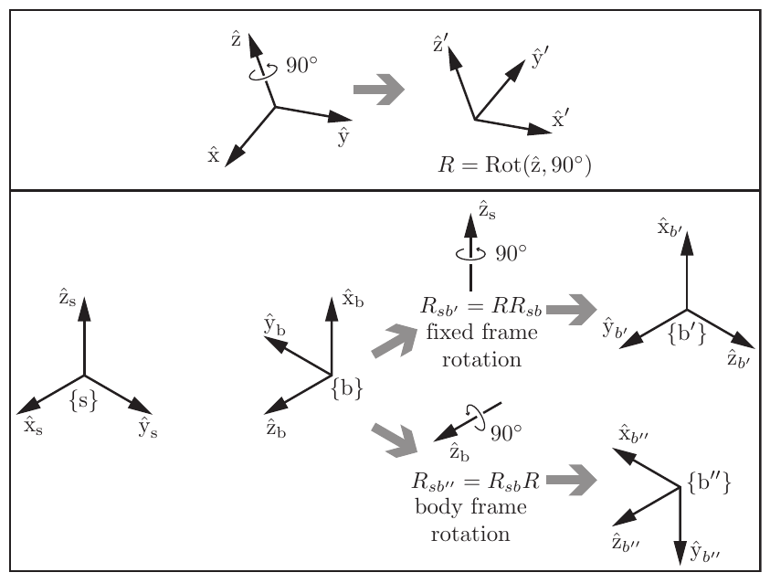

*Fixed-frame and body-frame rotations. Cropped from book Figure 3.9.*

Then

$$
\boxed{
R_{sb'}=RR_{sb}
\quad\text{means that }\hat\omega\text{ is expressed in }\{s\},
}
$$

whereas

$$
\boxed{
R_{sb''}=R_{sb}R
\quad\text{means that }\hat\omega\text{ is expressed in }\{b\}.
}
$$

Memory rule: **premultiply for a space-frame operation; postmultiply for a body-frame operation.**

#### Skew-symmetric matrix representation

For $x=(x_1,x_2,x_3)^T$, define

$$
[x]=
\begin{bmatrix}
0&-x_3&x_2\\
x_3&0&-x_1\\
-x_2&x_1&0
\end{bmatrix}
\in so(3).
$$

It converts a cross product into matrix multiplication:

$$
[x]y=x\times y.
$$

Useful identities are

$$
[x]^T=-[x],
\qquad
[x]y=-[y]x,
\qquad
R[x]R^T=[Rx].
$$

Here $SO(3)$ is the nonlinear group of finite rotations, while $so(3)$ is the vector space of skew-symmetric matrices representing infinitesimal rotations.

#### Angular velocity in space and body coordinates

Let $R(t)=R_{sb}(t)$. The same physical angular velocity can be represented in the space frame or body frame:

$$
\omega_s=R_{sb}\omega_b.
$$

Its matrix forms are obtained from $R$ and $\dot R$:

$$
\boxed{
[\omega_s]=\dot R R^{-1}=\dot R R^T,
\qquad
[\omega_b]=R^{-1}\dot R=R^T\dot R.
}
$$

The multiplication order determines the frame. Equivalently,

$$
\dot R=[\omega_s]R=R[\omega_b].
$$

#### Exponential coordinates for rotation

An axis-angle pair consists of a unit axis $\hat\omega$ and angle $\theta$. Its three exponential coordinates are $\hat\omega\theta$.

Integrating the constant angular velocity $\hat\omega$ for time $\theta$ gives

$$
R=e^{[\hat\omega]\theta}.
$$

Rodrigues' formula evaluates this exponential without an infinite series:

$$
\boxed{
e^{[\hat\omega]\theta}
=I+\sin\theta[\hat\omega]
+(1-\cos\theta)[\hat\omega]^2.
}
$$

The exponential map connects the tangent-space representation to a finite rotation:

$$
\exp:so(3)\rightarrow SO(3).
$$

#### Rotation matrix logarithm

The inverse problem is to find $[\hat\omega]\theta=\log R$. For the generic case $0<\theta<\pi$,

$$
\theta=\cos^{-1}\left(\frac{\operatorname{tr}R-1}{2}\right),
$$

$$
[\hat\omega]
=\frac{R-R^T}{2\sin\theta}.
$$

Two singular cases need separate handling:

- $R=I$: $\theta=0$, and the axis is arbitrary because no rotation occurred.
- $\operatorname{tr}R=-1$: $\theta=\pi$, and the axis must be recovered from $R+I$ or equivalent component formulas.

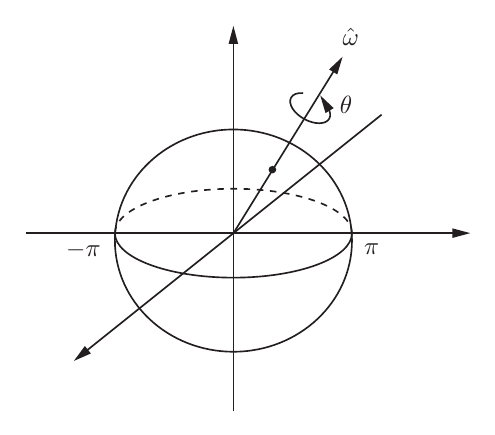

*Exponential-coordinate view of $SO(3)$. Cropped from book Figure 3.13.*

Restricting $\theta\in[0,\pi]$ represents $SO(3)$ as a solid ball of radius $\pi$. Antipodal points on the boundary describe the same $180^\circ$ rotation, which is why the logarithm is not unique there.

### 3.3 Rigid-Body Motions and Twists

#### Homogeneous transformations and $SE(3)$

A spatial rigid-body configuration combines orientation and position:

$$
\boxed{
T=
\begin{bmatrix}
R&p\\
0&1
\end{bmatrix}
\in SE(3),
\qquad
R\in SO(3),\ p\in\mathbb R^3.
}
$$

The inverse is

$$
T^{-1}=
\begin{bmatrix}
R^T&-R^Tp\\
0&1
\end{bmatrix}.
$$

The term $-R^Tp$ is important: reversing a pose requires both reversing the rotation and re-expressing the reversed translation.

#### Homogeneous point coordinates

Appending a $1$ to a point lets rotation and translation be written as one multiplication:

$$
\begin{bmatrix}
x'\\1
\end{bmatrix}
=
\begin{bmatrix}
R&p\\0&1
\end{bmatrix}
\begin{bmatrix}
x\\1
\end{bmatrix}
=
\begin{bmatrix}
Rx+p\\1
\end{bmatrix}.
$$

A free direction vector uses a final coordinate of $0$, so translation does not affect it:

$$
T
\begin{bmatrix}
v\\0
\end{bmatrix}
=
\begin{bmatrix}
Rv\\0
\end{bmatrix}.
$$

#### Frame composition

Transformation matrices obey the same subscript rule as rotations:

$$
T_{ac}=T_{ab}T_{bc},
\qquad
T_{ba}=T_{ab}^{-1},
$$

and for a point,

$$
p_a=T_{ab}p_b.
$$

If $T=(R,p)$ is applied to a current pose $T_{sb}$, then

$$
T_{sb'}=TT_{sb}
$$

interprets $(R,p)$ in the space frame, whereas

$$
T_{sb''}=T_{sb}T
$$

interprets it in the body frame. As with rotations, the order changes the physical motion.

#### Twists

A **twist** combines angular and linear velocity:

$$
V=
\begin{bmatrix}
\omega\\v
\end{bmatrix}
\in\mathbb R^6,
\qquad
[V]=
\begin{bmatrix}
[\omega]&v\\
0&0
\end{bmatrix}
\in se(3).
$$

For $T(t)=T_{sb}(t)$, the body and space twists are

$$
\boxed{
[V_b]=T^{-1}\dot T,
\qquad
[V_s]=\dot T T^{-1}.
}
$$

Their linear components have different geometric meanings:

- $v_b=R^T\dot p$ is the velocity of the body-frame origin, expressed in $\{b\}$;
- $v_s=\dot p-\omega_s\times p$ is the velocity of the point on the extended rigid body currently located at the space-frame origin, expressed in $\{s\}$.

Therefore, in general,

$$
v_s\neq\dot p.
$$

This is one of the most important notation traps in the chapter.

#### Adjoint transformation

For $T=(R,p)$, define

$$
\boxed{
[\operatorname{Ad}_T]
=
\begin{bmatrix}
R&0\\
{}[p]R&R
\end{bmatrix}.
}
$$

It changes the coordinate frame of a twist or screw axis:

$$
V_s=[\operatorname{Ad}_{T_{sb}}]V_b,
\qquad
V_b=[\operatorname{Ad}_{T_{bs}}]V_s.
$$

More generally,

$$
V_a=[\operatorname{Ad}_{T_{ab}}]V_b.
$$

The adjoint respects transformation composition:

$$
[\operatorname{Ad}_{T_1}]
[\operatorname{Ad}_{T_2}]
=[\operatorname{Ad}_{T_1T_2}],
\qquad
[\operatorname{Ad}_T]^{-1}
=[\operatorname{Ad}_{T^{-1}}].
$$

#### Screw interpretation of a twist

A screw axis is described geometrically by:

- a point $q$ on the axis;
- a unit direction $\hat s$;
- a pitch $h$, equal to linear speed along the axis divided by angular speed.

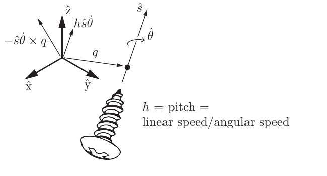

*Geometry of a screw axis. Cropped from book Figure 3.19.*

For finite pitch, the normalized screw axis is

$$
\boxed{
S=
\begin{bmatrix}
\omega\\v
\end{bmatrix}
=
\begin{bmatrix}
\hat s\\
-\hat s\times q+h\hat s
\end{bmatrix},
\qquad \|\omega\|=1.
}
$$

The corresponding twist is

$$
V=S\dot\theta.
$$

Important special cases are:

| Motion | Screw-axis parameters |
|:--|:--|
| Pure rotation about the axis | $h=0$, $v=-\omega\times q$ |
| Rotation plus translation along the axis | finite $h$ |
| Pure translation | $\omega=0$, $\|v\|=1$, conventionally $h=\infty$ |

For a pure translation, $\dot\theta$ is a linear speed rather than an angular speed.

#### Exponential coordinates of rigid motion

The Chasles-Mozzi theorem states that every rigid-body displacement can be produced by motion along one fixed screw axis. Thus any $T\in SE(3)$ can be written

$$
T=e^{[S]\theta}.
$$

The six-vector $S\theta$ is the exponential-coordinate representation of the displacement.

For $S=(\omega,v)$ with $\|\omega\|=1$,

$$
e^{[S]\theta}
=
\begin{bmatrix}
e^{[\omega]\theta}&G(\theta)v\\
0&1
\end{bmatrix},
$$

where

$$
G(\theta)
=I\theta
+(1-\cos\theta)[\omega]
+(\theta-\sin\theta)[\omega]^2.
$$

For pure translation,

$$
e^{[S]\theta}
=
\begin{bmatrix}
I&v\theta\\
0&1
\end{bmatrix}.
$$

#### Matrix logarithm of a rigid motion

Given $T=(R,p)$:

1. If $R=I$ and $p\neq0$, the motion is a pure translation. Set $\omega=0$, $\theta=\|p\|$, and $v=p/\|p\|$. If $R=I$ and $p=0$, then $T=I$, $\theta=0$, and the screw axis is undefined.
2. Otherwise, compute $[\omega]\theta=\log R$, then solve

$$
v=G^{-1}(\theta)p,
$$

with

$$
G^{-1}(\theta)
=\frac{1}{\theta}I
-\frac{1}{2}[\omega]
+\left(
\frac{1}{\theta}
-\frac{1}{2}\cot\frac{\theta}{2}
\right)[\omega]^2.
$$

The result $[S]\theta=\log T$ is the constant twist matrix whose unit-time integration reaches $T$ from the identity.

### 3.4 Wrenches

A force $f$ applied at point $r$ creates the moment

$$
m=r\times f.
$$

A **wrench** combines moment and force:

$$
F=
\begin{bmatrix}
m\\f
\end{bmatrix}
\in\mathbb R^6.
$$

The instantaneous mechanical power associated with a twist-wrench pair is

$$
P=V^TF=\begin{bmatrix}
\omega \\v
\end{bmatrix}^T\begin{bmatrix}
m\\f
\end{bmatrix}=\omega^Tm+v^Tf.
$$

Power is independent of the coordinate frame. Since

$$
V_a=[\operatorname{Ad}_{T_{ab}}]V_b,
$$

power invariance requires the dual transformation

$$
\boxed{
F_b=[\operatorname{Ad}_{T_{ab}}]^TF_a,
\qquad
F_a=[\operatorname{Ad}_{T_{ba}}]^TF_b.
}
$$

Twists transform with the adjoint; wrenches transform with the transpose associated with the inverse direction. This pairing guarantees $V_a^TF_a=V_b^TF_b$.

### 3.5 $SO(3)$ and $SE(3)$ in Parallel

| Rotation concept | Rigid-motion counterpart |
|:--|:--|
| $R\in SO(3)$ | $T\in SE(3)$ |
| $[\omega]\in so(3)$ | $[V]\in se(3)$ |
| Rotation axis $\hat\omega$ | Screw axis $S$ |
| Angular velocity $\omega=\hat\omega\dot\theta$ | Twist $V=S\dot\theta$ |
| $[\omega_s]=\dot RR^{-1}$ | $[V_s]=\dot TT^{-1}$ |
| $[\omega_b]=R^{-1}\dot R$ | $[V_b]=T^{-1}\dot T$ |
| $R=e^{[\hat\omega]\theta}$ | $T=e^{[S]\theta}$ |
| $[\hat\omega]\theta=\log R$ | $[S]\theta=\log T$ |
| Coordinate change $\omega_a=R_{ab}\omega_b$ | Coordinate change $V_a=[\operatorname{Ad}_{T_{ab}}]V_b$ |

This parallel is the chapter's main organizing idea. Learn one column and the other becomes easier to derive.

### 3.6 Common Confusions

#### "$R_{ab}$ rotates frame $\{a\}$ into frame $\{b\}$"

This wording is ambiguous. A safer definition is: $R_{ab}$ contains the axes of $\{b\}$ expressed in $\{a\}$ and converts $b$-coordinates to $a$-coordinates.

#### "Changing coordinates physically moves the vector"

No. $p_a=R_{ab}p_b$ gives two numerical descriptions of the same geometric vector. By contrast, $p'=Rp$ can describe a physical rotation when both vectors use the same coordinate frame.

#### "Pre- and postmultiplication are interchangeable"

They are not, because 3D rotations and rigid transformations generally do not commute. Premultiplication applies an operation expressed in the space frame; postmultiplication applies one expressed in the body frame.

#### "$SO(3)$ and $so(3)$ are the same space"

$SO(3)$ contains finite rotation matrices and is not a vector space. $so(3)$ contains skew-symmetric tangent matrices and is a vector space. The exponential and logarithm connect them locally.

#### "The space-twist linear component is the body-origin velocity"

The body-origin velocity in space coordinates is $\dot p$. The space-twist component is $v_s=\dot p-\omega_s\times p$. The body-twist component $v_b=R^T\dot p$ is the body-origin velocity expressed in body coordinates.

#### "A twist and a screw axis are identical"

They use the same six-vector structure, but a screw axis is normalized. A general twist includes the motion rate: $V=S\dot\theta$.

#### "Twists and wrenches transform in the same way"

They are dual quantities. Twists use the adjoint; wrenches use the corresponding transpose in the opposite frame direction so that power remains invariant.

### 3.7 Formula Sheet

| Concept | Formula |
|:--|:--|
| Rotation group | $SO(3)=\{R\mid R^TR=I,\det R=1\}$ |
| Rotation inverse | $R^{-1}=R^T$ |
| Frame composition | $R_{ac}=R_{ab}R_{bc}$, $T_{ac}=T_{ab}T_{bc}$ |
| Cross-product matrix | $[x]y=x\times y$ |
| Space angular velocity | $[\omega_s]=\dot RR^{-1}$ |
| Body angular velocity | $[\omega_b]=R^{-1}\dot R$ |
| Rodrigues formula | $e^{[\hat\omega]\theta}=I+\sin\theta[\hat\omega]+(1-\cos\theta)[\hat\omega]^2$ |
| Homogeneous transform | $T=\begin{bmatrix}R&p\\0&1\end{bmatrix}$ |
| Transform inverse | $T^{-1}=\begin{bmatrix}R^T&-R^Tp\\0&1\end{bmatrix}$ |
| Twist matrix | $[V]=\begin{bmatrix}[\omega]&v\\0&0\end{bmatrix}$ |
| Space/body twists | $[V_s]=\dot TT^{-1}$, $[V_b]=T^{-1}\dot T$ |
| Adjoint | $[\operatorname{Ad}_T]=\begin{bmatrix}R&0\\{}[p]R&R\end{bmatrix}$ |
| Twist frame change | $V_a=[\operatorname{Ad}_{T_{ab}}]V_b$ |
| Screw axis | $S=(\hat s,-\hat s\times q+h\hat s)$ |
| Rigid-motion exponential | $T=e^{[S]\theta}$ |
| Wrench | $F=(m,f)$, with $m=r\times f$ |
| Power | $P=V^TF$ |
| Wrench frame change | $F_b=[\operatorname{Ad}_{T_{ab}}]^TF_a$ |

### 3.8 Software Map

The book's software mirrors the mathematical conversions:

| Operation | Modern Robotics function |
|:--|:--|
| $\omega\leftrightarrow[\omega]$ | `VecToso3`, `so3ToVec` |
| $[\omega]\theta\leftrightarrow R$ | `MatrixExp3`, `MatrixLog3` |
| $(R,p)\leftrightarrow T$ | `RpToTrans`, `TransToRp` |
| $T^{-1}$ | `TransInv` |
| $V\leftrightarrow[V]$ | `VecTose3`, `se3ToVec` |
| $[\operatorname{Ad}_T]$ | `Adjoint` |
| $(q,\hat s,h)\rightarrow S$ | `ScrewToAxis` |
| $[S]\theta\leftrightarrow T$ | `MatrixExp6`, `MatrixLog6` |

The suffix `3` refers to rotations in $SO(3)$; the suffix `6` refers to rigid motions represented by six-dimensional twists.

### 3.9 Understanding Checklist

After this chapter, you should be able to:

- read $R_{ab}$ and $T_{ab}$ unambiguously and compose frame chains by subscript cancellation;
- verify whether a matrix belongs to $SO(3)$ or $SE(3)$;
- distinguish representation, coordinate change, and physical displacement;
- explain why premultiplication uses a space-frame operation and postmultiplication uses a body-frame operation;
- convert between vectors and their $so(3)$ or $se(3)$ matrix forms;
- derive space and body angular velocities or twists from $R(t)$ or $T(t)$;
- use exponential coordinates to move between axis-angle or screw motion and finite transformations;
- transform twists with the adjoint and wrenches with its dual transpose;
- explain the power pairing $V^TF$.

Chapter 4 uses these representations to express robot forward kinematics as products of matrix exponentials.

---

## Chapter 4: Forward Kinematics

Forward kinematics computes the end-effector pose from known joint positions. The chapter's central result is that an open chain can be modeled by a home pose and one constant screw axis per joint.

### 4.1 Forward Kinematics as a Map

For an $n$-joint open chain, collect the joint variables into

$$
\theta=(\theta_1,\ldots,\theta_n).
$$

Forward kinematics is the map

$$
F:\mathcal C\rightarrow SE(3),
\qquad
\theta\mapsto T_{sb}(\theta),
$$

where $T_{sb}$ is the configuration of the end-effector frame $\{b\}$ expressed in the fixed space frame $\{s\}$.

For an open chain, each valid $\theta$ determines one end-effector pose. The reverse need not be unique: several joint configurations may produce the same $T_{sb}$.

#### Position-only and pose tasks

The output space depends on what the task needs:

| Required output | Typical task space |
|:--|:--|
| Planar end-point position | $\mathbb R^2$ |
| Planar position and orientation | $SE(2)$ |
| Spatial end-point position | $\mathbb R^3$ |
| Spatial position and orientation | $SE(3)$ |

The robot configuration still contains all joint variables even when the task uses only end-effector position.

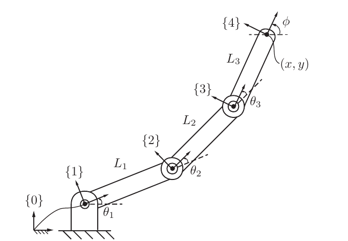

*A planar 3R chain with link lengths $L_1,L_2,L_3$. Cropped from book Figure 4.1.*

For the planar 3R chain,

$$
\begin{aligned}
x &= L_1\cos\theta_1
   +L_2\cos(\theta_1+\theta_2)
   +L_3\cos(\theta_1+\theta_2+\theta_3),\\
y &= L_1\sin\theta_1
   +L_2\sin(\theta_1+\theta_2)
   +L_3\sin(\theta_1+\theta_2+\theta_3),\\
\phi&=\theta_1+\theta_2+\theta_3.
\end{aligned}
$$

These trigonometric equations are manageable for a planar arm but become cumbersome for general spatial mechanisms. The product of exponentials gives a uniform construction instead.

### 4.2 Home Configuration and Joint Screw Axes

The PoE representation separates fixed robot geometry from changing joint values.

#### Home configuration

Choose a zero value for every joint and define

$$
\boxed{M=T_{sb}(0)}.
$$

$M\in SE(3)$ is the end-effector pose when $\theta=0$. The zero configuration is a modeling choice; it need not be the robot's physical power-on pose.

#### Joint screw axis

For each one-DOF joint, determine its positive motion at the home configuration and express it as

$$
S_i=
\begin{bmatrix}
\omega_i\\v_i
\end{bmatrix}
\in\mathbb R^6
$$

in the space frame $\{s\}$.

For a **revolute joint**, choose:

* a unit vector $\omega_i$ along the positive rotation axis;
* any point $q_i$ on that axis, expressed in $\{s\}$.

Then

$$
\boxed{
S_i=
\begin{bmatrix}
\omega_i\\-\omega_i\times q_i
\end{bmatrix}
}.
$$

For a **prismatic joint**, if $v_i$ is a unit vector in the positive translation direction,

$$
\boxed{
S_i=
\begin{bmatrix}
0\\v_i
\end{bmatrix}
}.
$$

Its matrix representation is

$$
[S_i]=
\begin{bmatrix}
[\omega_i]&v_i\\
0&0
\end{bmatrix}
\in se(3).
$$

The rigid displacement produced by joint $i$ is $e^{[S_i]\theta_i}$. For a revolute joint, $\theta_i$ is an angle in radians; for a prismatic joint, it is a distance.

### 4.3 Space-Form Product of Exponentials

Suppose initially that only the most distal joint moves. Its motion left-multiplies the home pose:

$$
T_{sb}=e^{[S_n]\theta_n}M.
$$

Allowing the next joint toward the base to move gives

$$
T_{sb}=e^{[S_{n-1}]\theta_{n-1}}e^{[S_n]\theta_n}M.
$$

Continuing to the base yields the **space-form PoE formula**:

$$
\boxed{
T_{sb}(\theta)
=e^{[S_1]\theta_1}
 e^{[S_2]\theta_2}
 \cdots
 e^{[S_n]\theta_n}M
}.
$$

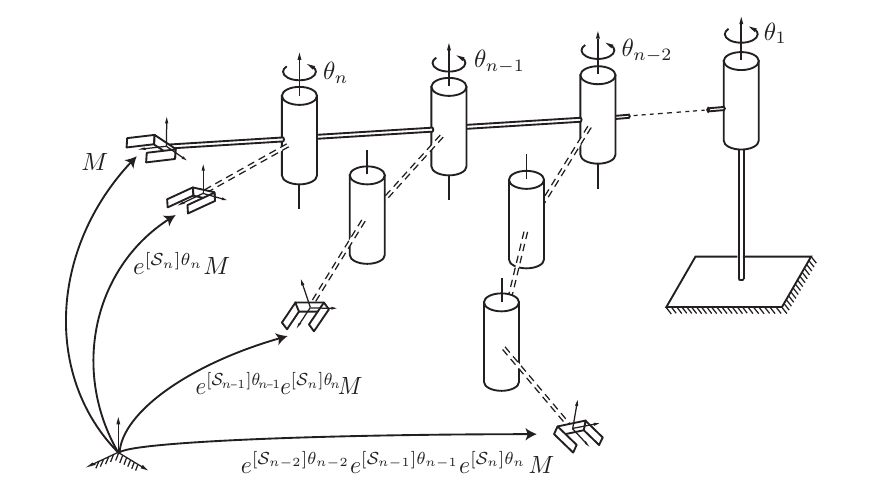

*Each joint exponential moves all links outward from that joint. Cropped from book Figure 4.2.*

#### Required model data

The space-form model needs only:

1. the home pose $M$;
2. the home-configuration screw axes $S_1,\ldots,S_n$ expressed in $\{s\}$;
3. the joint values $\theta_1,\ldots,\theta_n$.

No intermediate link frames are required.

#### Evaluation order

Because rigid transformations do not generally commute, the factors must stay in joint order. One implementation is

```text
T = identity
for i = 1, ..., n:
    T = T * exp([S_i] * theta_i)
T = T * M
```

Although every $S_i$ is measured only once at the home configuration, the product correctly accounts for upstream joints moving downstream axes. The matrix composition performs that coordinate update implicitly.

### 4.4 Worked Example: Planar 3R Chain

At $\theta=0$, the arm in Figure 4.1 lies along the positive $x$-axis, so

$$
M=
\begin{bmatrix}
1&0&0&L_1+L_2+L_3\\
0&1&0&0\\
0&0&1&0\\
0&0&0&1
\end{bmatrix}.
$$

All three revolute axes point along $+z$. Points on the axes are

$$
q_1=(0,0,0),\qquad
q_2=(L_1,0,0),\qquad
q_3=(L_1+L_2,0,0).
$$

Using $v_i=-\omega_i\times q_i$ gives

$$
S_1=
\begin{bmatrix}
0\\0\\1\\0\\0\\0
\end{bmatrix},\qquad
S_2=
\begin{bmatrix}
0\\0\\1\\0\\-L_1\\0
\end{bmatrix},\qquad
S_3=
\begin{bmatrix}
0\\0\\1\\0\\-(L_1+L_2)\\0
\end{bmatrix}.
$$

Therefore,

$$
\boxed{
T_{s4}(\theta)
=e^{[S_1]\theta_1}
 e^{[S_2]\theta_2}
 e^{[S_3]\theta_3}M
}.
$$

Two quick checks catch many modeling errors:

* Setting $\theta=0$ must return $T_{s4}=M$.
* The final orientation must be a rotation by $\theta_1+\theta_2+\theta_3$.

Expanding the translation part produces the $x$ and $y$ equations in Section 4.1. The PoE and trigonometric models describe the same geometry.

### 4.5 Body-Form Product of Exponentials

The same home joint axes can instead be expressed in the home end-effector frame $\{b\}$. Define

$$
\boxed{
B_i=\operatorname{Ad}_{M^{-1}}S_i
}
$$

or equivalently

$$
[B_i]=M^{-1}[S_i]M.
$$

Using the conjugation identity

$$
M e^{[B_i]\theta_i}
=e^{[S_i]\theta_i}M,
$$

the space formula becomes the **body-form PoE formula**:

$$
\boxed{
T_{sb}(\theta)
=M e^{[B_1]\theta_1}
 e^{[B_2]\theta_2}
 \cdots
 e^{[B_n]\theta_n}
}.
$$

For the planar 3R arm, let $L=L_1+L_2+L_3$. The body screw axes are

$$
\begin{aligned}
B_1&=(0,0,1,\;0,L,0)^T,\\
B_2&=(0,0,1,\;0,L_2+L_3,0)^T,\\
B_3&=(0,0,1,\;0,L_3,0)^T.
\end{aligned}
$$

These are not new physical joints. They are the same home axes represented in different coordinates.

### 4.6 Space and Body Forms Compared

| Property | Space form | Body form |
|:--|:--|:--|
| Formula | $e^{[S_1]\theta_1}\cdots e^{[S_n]\theta_n}M$ | $M e^{[B_1]\theta_1}\cdots e^{[B_n]\theta_n}$ |
| Axis coordinates | Fixed space frame at home | End-effector frame at home |
| Conversion | $S_i=\operatorname{Ad}_M B_i$ | $B_i=\operatorname{Ad}_{M^{-1}}S_i$ |
| Natural multiplication | Exponentials before $M$ | Exponentials after $M$ |
| Output | Same $T_{sb}(\theta)$ | Same $T_{sb}(\theta)$ |

The labels **space** and **body** describe how the constant home screw axes are represented. They do not mean that one formula gives a space twist and the other gives a body twist; both return the same finite end-effector pose.

#### PoE versus Denavit-Hartenberg

| Representation | Main idea | Tradeoff |
|:--|:--|:--|
| PoE | Home pose plus joint screws | Geometric and uniform for revolute/prismatic joints; not parameter-minimal |
| D-H | Special frame on each link and four parameters per adjacent-frame transform | Uses a minimal structural parameterization but frame assignment is restrictive |

For an $n$-joint spatial chain, the book counts $6n$ screw-axis numbers for PoE versus $3n$ structural D-H parameters, excluding the $n$ changing joint values. The six components of each screw are constrained, so this count does not imply six independent parameters per one-DOF joint.

### 4.7 Universal Robot Description Format

URDF is an XML format used by ROS and other robotics software to describe a robot as a tree of links connected by joints.

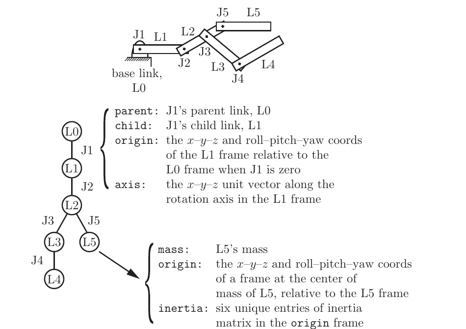

*Links are tree nodes and joints are edges. Cropped from book Figure 4.10.*

#### Joint information

A joint specifies:

| Field | Meaning |
|:--|:--|
| `parent` / `child` | Links connected by the joint |
| `type` | Revolute, continuous, prismatic, fixed, and so on |
| `origin xyz` | Child joint-frame position relative to the parent at zero |
| `origin rpy` | Child joint-frame orientation relative to the parent at zero |
| `axis xyz` | Positive rotation or translation axis in the joint/child frame |

The chapter uses fixed-axis roll-pitch-yaw: roll about the fixed $x$-axis, then pitch about fixed $y$, then yaw about fixed $z$.

#### Link information

A link may specify:

* mass;
* center-of-mass frame;
* the six independent entries of its symmetric inertia matrix;
* visual and collision geometry.

Joint data determines kinematics. Link inertial data becomes necessary for dynamics.

#### Relationship to forward kinematics

URDF explicitly stores each parent-child zero transform and joint axis. Forward kinematics traverses the path from the base to a selected link and composes those transforms. The same description can be converted to PoE by computing:

1. the selected end-effector home pose $M$;
2. every joint axis expressed in one common space frame at home.

URDF supports tree mechanisms with branches, but a tree cannot directly represent a closed kinematic loop.

### 4.8 Common Confusions

#### "The screw axes must be recomputed after each joint moves"

Not in the PoE model. $S_i$ and $B_i$ are constant axes measured at the home configuration. The ordered matrix product accounts for the movement of downstream geometry.

#### "$S_i$ is the current axis in the world frame"

$S_i$ is the joint axis expressed in the space frame **at home**. After upstream joints move, the physical axis may have a different current space representation.

#### "$B_i$ is measured in the current end-effector frame"

$B_i$ is expressed in the end-effector frame **at home**. It is constant model data, not a value recomputed from the current pose.

#### "$M$ should be the identity"

Only if the chosen end-effector frame coincides with the space frame at home. Usually $M$ contains both a fixed translation and a fixed orientation.

#### "The exponential factors can be reordered"

Generally no:

$$
e^{[S_i]\theta_i}e^{[S_j]\theta_j}
\neq
e^{[S_j]\theta_j}e^{[S_i]\theta_i}.
$$

Joint order is part of the robot's kinematic structure.

#### "Forward kinematics has a unique inverse"

Forward kinematics is single-valued for an open chain, but it is not generally one-to-one. Different joint configurations can reach the same end-effector pose, and some desired poses are unreachable.

#### "URDF `origin` is the current joint pose"

The `origin` describes the fixed parent-child relationship at the joint's zero value. The joint motion is applied in addition to that zero transform.

### 4.9 Formula Sheet

| Concept | Formula |
|:--|:--|
| Forward-kinematics map | $F(\theta)=T_{sb}(\theta)\in SE(3)$ |
| Home pose | $M=T_{sb}(0)$ |
| Revolute space screw | $S=(\omega,-\omega\times q)$, $\|\omega\|=1$ |
| Prismatic space screw | $S=(0,v)$, $\|v\|=1$ |
| Screw matrix | $[S]=\begin{bmatrix}[\omega]&v\\0&0\end{bmatrix}$ |
| Joint displacement | $e^{[S_i]\theta_i}\in SE(3)$ |
| Space PoE | $T_{sb}=e^{[S_1]\theta_1}\cdots e^{[S_n]\theta_n}M$ |
| Body screw from space screw | $B_i=\operatorname{Ad}_{M^{-1}}S_i$ |
| Space screw from body screw | $S_i=\operatorname{Ad}_M B_i$ |
| Body PoE | $T_{sb}=M e^{[B_1]\theta_1}\cdots e^{[B_n]\theta_n}$ |

### 4.10 Software Map

| Operation | Modern Robotics function |
|:--|:--|
| Space-form forward kinematics | `FKinSpace(M, Slist, thetalist)` |
| Body-form forward kinematics | `FKinBody(M, Blist, thetalist)` |
| Screw vector to $se(3)$ matrix | `VecTose3` |
| Joint exponential | `MatrixExp6(VecTose3(S * theta))` |
| Adjoint coordinate conversion | `Adjoint` |

In the book's software convention, `Slist` and `Blist` are $6\times n$ matrices whose $i$th columns are the corresponding joint screw axes. The entries of `thetalist` must follow the same joint order.

### 4.11 Understanding Checklist

After this chapter, you should be able to:

* define forward kinematics as a map from joint space to an end-effector task space;
* identify the home pose $M$ from a robot's zero configuration;
* construct revolute and prismatic screw axes with the correct positive direction;
* write and evaluate the space-form PoE formula in the correct order;
* convert space screw axes to body screw axes with $\operatorname{Ad}_{M^{-1}}$;
* explain why the space and body formulas produce the same pose;
* derive the planar 3R model and check it against elementary trigonometry;
* distinguish PoE, D-H, and URDF representations;
* identify the kinematic and inertial information stored in a URDF tree.

Chapter 5 differentiates the PoE forward-kinematics map to obtain the manipulator Jacobian and relate joint velocities to end-effector twists.

---

## Chapter 5: Velocity Kinematics and Statics

Chapter 4 gave the forward-kinematics map $T_{sb}(\theta)$. Chapter 5 studies its derivative. The result is the **manipulator Jacobian**, which maps joint rates to an end-effector twist and, by duality, maps an end-effector wrench to joint torques.

The chapter has three main messages:

* velocity kinematics is local and configuration dependent;
* singularities are rank drops of the Jacobian, not failures of the pose representation;
* the transpose Jacobian is the static force-torque map.

### 5.1 Velocity Kinematics as a Differential Map

For an ordinary vector-valued forward map

$$
x=f(\theta),
\qquad
x\in\mathbb R^m,\quad \theta\in\mathbb R^n,
$$

the velocity relation is obtained by differentiating:

$$
\boxed{
\dot x
=J(\theta)\dot\theta,
\qquad
J(\theta)=\frac{\partial f}{\partial \theta}.
}
$$

Here, $J(\theta)\in\mathbb R^{m\times n}$ is configuration dependent. Its $i$ th column is the output velocity created by setting $\dot\theta_i=1$ and all other joint rates to zero.

For a planar 2R arm,

$$
\begin{aligned}
x_1&=L_1\cos\theta_1+L_2\cos(\theta_1+\theta_2),\\
x_2&=L_1\sin\theta_1+L_2\sin(\theta_1+\theta_2).
\end{aligned}
$$

Differentiating gives

$$
\begin{bmatrix}
\dot x_1\\
\dot x_2
\end{bmatrix}
=
\underbrace{
\begin{bmatrix}
-L_1\sin\theta_1-L_2\sin(\theta_1+\theta_2)
&
-L_2\sin(\theta_1+\theta_2)
\\
L_1\cos\theta_1+L_2\cos(\theta_1+\theta_2)
&
L_2\cos(\theta_1+\theta_2)
\end{bmatrix}
}_{J(\theta)}
\begin{bmatrix}
\dot\theta_1\\
\dot\theta_2
\end{bmatrix}.
$$

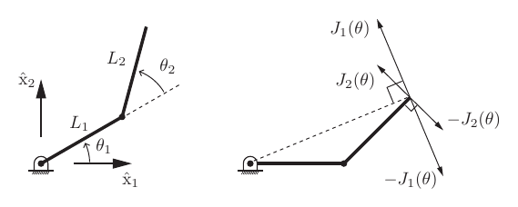

*The Jacobian columns are the tip velocities generated by unit joint rates. Cropped from book Figure 5.1.*

For the 2R arm,

$$
\det J(\theta)=L_1L_2\sin\theta_2.
$$

Thus the arm is singular when $\theta_2=0$ or $\theta_2=\pi$, because the two Jacobian columns become collinear and the tip cannot move instantaneously in every planar direction.

### 5.2 Manipulator Jacobian

For a spatial open chain, the end-effector output is a pose $T_{sb}(\theta)\in SE(3)$ rather than a vector in Euclidean space. Its velocity is therefore represented as a twist:

$$
[V_s]=\dot T_{sb}T_{sb}^{-1},
\qquad
[V_b]=T_{sb}^{-1}\dot T_{sb}.
$$

The **space Jacobian** and **body Jacobian** map the same joint-rate vector to the same physical end-effector motion, expressed in different frames:

$$
\boxed{
V_s=J_s(\theta)\dot\theta,
\qquad
V_b=J_b(\theta)\dot\theta.
}
$$

Both $J_s(\theta)$ and $J_b(\theta)$ are $6\times n$ matrices. The top three rows describe angular velocity and the bottom three rows describe the linear component of the twist:

$$
J(\theta)
=
\begin{bmatrix}
J_\omega(\theta)\\
J_v(\theta)
\end{bmatrix}.
$$

The geometric meaning of a Jacobian column is still simple: column $i$ is the screw axis of joint $i$ in the current configuration, expressed in the chosen frame.

### 5.3 Space Jacobian

Start from the space-form product of exponentials:

$$
T_{sb}(\theta)
=
e^{[S_1]\theta_1}
e^{[S_2]\theta_2}
\cdots
e^{[S_n]\theta_n}M.
$$

The space Jacobian is

$$
J_s(\theta)
=
\begin{bmatrix}
J_{s1}(\theta)&J_{s2}(\theta)&\cdots&J_{sn}(\theta)
\end{bmatrix},
$$

where

$$
\boxed{
J_{s1}(\theta)=S_1,
\qquad
J_{si}(\theta)
=
\operatorname{Ad}_{
e^{[S_1]\theta_1}
\cdots
e^{[S_{i-1}]\theta_{i-1}}
}
S_i
\quad (i=2,\ldots,n).
}
$$

Only the joints before $i$ appear in column $i$. Those upstream joints move the frame in which joint $i$'s current screw axis is expressed. Downstream joints do not affect the instantaneous twist created by joint $i$.

A direct computational pattern is:

```text
J_s[:, 1] = S_1
T = identity
for i = 2, ..., n:
    T = T * exp([S_{i-1}] * theta_{i-1})
    J_s[:, i] = Ad_T * S_i
```

### 5.4 Body Jacobian

Using the body-form product of exponentials,

$$
T_{sb}(\theta)
=
M
e^{[B_1]\theta_1}
e^{[B_2]\theta_2}
\cdots
e^{[B_n]\theta_n},
$$

the body Jacobian is

$$
J_b(\theta)
=
\begin{bmatrix}
J_{b1}(\theta)&J_{b2}(\theta)&\cdots&J_{bn}(\theta)
\end{bmatrix},
$$

where

$$
\boxed{
J_{bn}(\theta)=B_n,
\qquad
J_{bi}(\theta)
=
\operatorname{Ad}_{
e^{-[B_n]\theta_n}
\cdots
e^{-[B_{i+1}]\theta_{i+1}}
}
B_i
\quad (i=n-1,\ldots,1).
}
$$

Only the joints after $i$ appear in column $i$. This is the body-frame mirror of the space-Jacobian rule: downstream joints change how joint $i$'s screw is expressed in the current end-effector frame.

```text
J_b[:, n] = B_n
T = identity
for i = n-1, ..., 1:
    T = T * exp(-[B_{i+1}] * theta_{i+1})
    J_b[:, i] = Ad_T * B_i
```

### 5.5 Space and Body Jacobians Compared

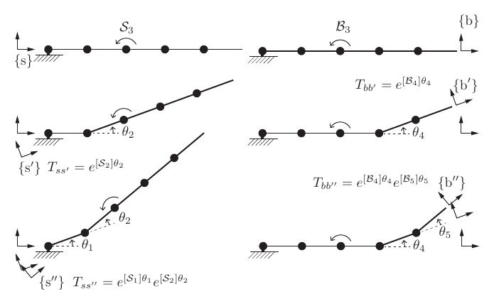

*For a space Jacobian column, move the home screw axis by upstream joints; for a body Jacobian column, express the screw through downstream joints. Cropped from book Figure 5.9.*

The two Jacobians are coordinate representations of the same end-effector twist. If $T_{sb}(\theta)$ is the current end-effector pose, then

$$
V_s=\operatorname{Ad}_{T_{sb}}V_b,
\qquad
V_b=\operatorname{Ad}_{T_{bs}}V_s.
$$

Therefore,

$$
\boxed{
J_s(\theta)=\operatorname{Ad}_{T_{sb}(\theta)}J_b(\theta),
\qquad
J_b(\theta)=\operatorname{Ad}_{T_{bs}(\theta)}J_s(\theta).
}
$$

Because an adjoint transformation is invertible, $J_s$ and $J_b$ always have the same rank. They identify the same singular configurations.

| Question | Space Jacobian | Body Jacobian |
|:--|:--|:--|
| Twist output | $V_s$ | $V_b$ |
| Output frame | Fixed space frame $\{s\}$ | Current end-effector frame $\{b\}$ |
| Column update uses | Upstream joints $1,\ldots,i-1$ | Downstream joints $i+1,\ldots,n$ |
| Constant model axes | $S_i$ at home | $B_i$ at home |
| Singularities | Same as $J_b$ | Same as $J_s$ |

### 5.6 Analytic Jacobians and Inverse Velocity Kinematics

The Jacobians above are **geometric Jacobians**: they map joint rates to twists. An **analytic Jacobian** instead maps joint rates to the derivative of a chosen coordinate representation:

$$
\dot q=J_a(\theta)\dot\theta.
$$

For example, suppose the pose is represented by

$$
q=(r,x),
$$

where $r$ is a three-parameter exponential-coordinate representation of orientation and $x$ is the end-effector origin position. If the body Jacobian is split as

$$
J_b=
\begin{bmatrix}
J_\omega\\
J_v
\end{bmatrix},
$$

then one coordinate-dependent analytic Jacobian has the form

$$
\boxed{
J_a(\theta)
=
\begin{bmatrix}
A^{-1}(r)&0\\
0&R_{sb}
\end{bmatrix}
J_b(\theta),
}
$$

where $A(r)$ is the map satisfying $\omega_b=A(r)\dot r$. The important point is not the particular formula, but the dependency: analytic Jacobians inherit singularities from both the robot and the chosen minimal orientation coordinates.

Inverse velocity kinematics asks for joint rates that produce a desired twist:

$$
V=J(\theta)\dot\theta.
$$

If $J$ is square and nonsingular,

$$
\dot\theta=J(\theta)^{-1}V.
$$

If the robot has fewer available joint directions than the task requires, not every desired twist can be produced. If the robot is redundant, there may be infinitely many joint-rate solutions, differing by motions in the null space of $J$.

### 5.7 Statics of Open Chains

The same Jacobian that maps velocities also maps forces by power balance. Let $F$ be the wrench applied at the end effector and $\tau$ be the joint torque vector. Static power consistency gives

$$
F^TV=\tau^T\dot\theta.
$$

Using $V=J(\theta)\dot\theta$,

$$
F^TJ(\theta)\dot\theta=\tau^T\dot\theta.
$$

Since this must hold for arbitrary admissible $\dot\theta$,

$$
\boxed{
\tau=J(\theta)^T F.
}
$$

With explicit frames,

$$
\boxed{
\tau=J_s(\theta)^TF_s
=J_b(\theta)^TF_b.
}
$$

The wrench and Jacobian must be expressed in the same frame. If a square Jacobian is nonsingular, the corresponding endpoint wrench generated by joint torques is

$$
F=J(\theta)^{-T}\tau.
$$

At singularities and in redundant systems, this inverse relationship needs more care because some endpoint wrench directions may require no joint torques, while some joint torques may create internal motion instead of a balanced endpoint wrench.

### 5.8 Singularity Analysis

A configuration is a **kinematic singularity** when the Jacobian rank is lower than its maximum possible rank:

$$
\boxed{
\operatorname{rank}J(\theta)
<
\max_{\theta'}\operatorname{rank}J(\theta').
}
$$

At such a configuration, the robot loses at least one instantaneous motion direction in the task space. The definition is local: the robot may still reach nearby poses by moving through a different path, but at that instant its velocity map has lost rank.

Singularity is invariant to frame choices. Changing from $J_b$ to $J_s$ only multiplies by an invertible adjoint matrix, and changing the fixed or end-effector frame also multiplies the Jacobian by an invertible transformation. None of these operations changes rank.

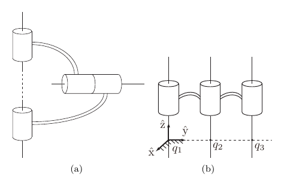

*Two common causes of rank loss: collinear revolute axes and three parallel coplanar revolute axes. Cropped from book Figure 5.11.*

The chapter lists several common singularity patterns for six-DOF spatial open chains:

* two revolute joint axes are collinear;
* three revolute joint axes are parallel and coplanar;
* four revolute joint axes intersect at a common point;
* four revolute joint axes are coplanar;
* six revolute joint axes intersect one common line.

The shared idea is linear dependence among Jacobian columns. Once one column can be written as a combination of others, the robot has fewer independent instantaneous twist directions.

### 5.9 Manipulability

Manipulability studies how easily joint motion produces task-space motion at a configuration. For

$$
\dot q=J(\theta)\dot\theta,
$$

consider all unit joint velocities:

$$
\dot\theta^T\dot\theta=1.
$$

If $J$ has full row rank, their task-space image is an ellipsoid:

$$
\boxed{
\dot q^T
\left(JJ^T\right)^{-1}
\dot q
=1.
}
$$

Let

$$
A=JJ^T.
$$

The eigenvectors of $A$ give the principal directions of the ellipsoid, and the semi-axis lengths are

$$
\sqrt{\lambda_1},\sqrt{\lambda_2},\ldots,\sqrt{\lambda_m},
$$

where $\lambda_i$ are the eigenvalues of $A$. Long axes are directions in which small joint velocities create large task velocities. Short axes are directions that are hard to move in.

For a six-dimensional geometric Jacobian, angular and linear velocity have different units, so it is common to analyze two separate ellipsoids:

$$
A_\omega=J_\omega J_\omega^T,
\qquad
A_v=J_vJ_v^T.
$$

When analyzing the linear velocity of the end-effector origin, the body Jacobian is often more natural, because its linear part corresponds directly to the origin of the end-effector frame.

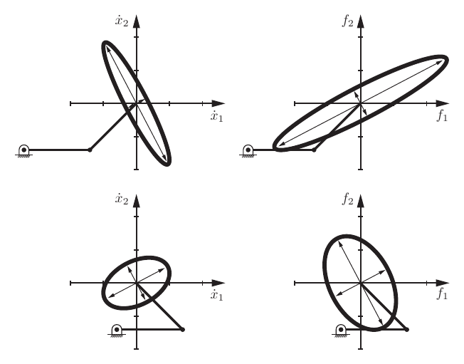

*Velocity manipulability and force ellipsoids for two configurations of a planar arm. Cropped from book Figure 5.6.*

The same geometry has a force dual. With

$$
\tau=J^TF
\quad\text{and}\quad
\tau^T\tau=1,
$$

the endpoint wrench ellipsoid satisfies

$$
\boxed{
F^TJJ^TF=1.
}
$$

Thus the force ellipsoid has the same principal directions as the manipulability ellipsoid, but reciprocal semi-axis lengths. A direction that is easy for velocity is hard for force, and a direction that is hard for velocity is easy for force.

Common scalar summaries are:

| Measure | Formula | Meaning |
|:--|:--|:--|
| Axis ratio | $\mu_1=\sqrt{\lambda_{\max}(A)/\lambda_{\min}(A)}$ | Near $1$ means isotropic; grows near singularity |
| Condition number | $\mu_2=\lambda_{\max}(A)/\lambda_{\min}(A)$ | Larger means more directionally uneven |
| Volume proxy | $\mu_3=\sqrt{\det A}$ | Zero at singularity; larger means larger velocity ellipsoid |

### 5.10 Common Confusions

#### "The Jacobian is just a constant derivative matrix"

Only for a linear map. Robot Jacobians usually change with $\theta$ because joint axes move relative to the chosen output frame.

#### "$S_i$ is the same thing as $J_{si}(\theta)$"

$S_i$ is the home screw axis. $J_{si}(\theta)$ is the current screw axis of joint $i$ expressed in the space frame after upstream joints have moved.

#### "$B_i$ is the same thing as $J_{bi}(\theta)$"

$B_i$ is the home body screw axis. $J_{bi}(\theta)$ is the current screw axis of joint $i$ expressed in the current body frame after downstream joints have moved.

#### "Space and body Jacobians have different singularities"

They do not. They are related by an invertible adjoint transformation, so their ranks are identical.

#### "The linear part of every twist is the end-effector origin velocity"

Not in every frame. From Chapter 3, the space-twist linear component is not generally $\dot p$. Be explicit about whether the twist is $V_s$ or $V_b$ and what point's velocity you need.

#### "A singularity is only a coordinate problem"

A kinematic singularity is a rank loss in the robot's velocity map. Minimal pose coordinates can introduce additional analytic-Jacobian singularities, but those are representation singularities, not necessarily robot singularities.

### 5.11 Formula Sheet

| Concept | Formula |
|:--|:--|
| Ordinary velocity map | $\dot x=J(\theta)\dot\theta$ |
| Space twist from pose | $[V_s]=\dot T T^{-1}$ |
| Body twist from pose | $[V_b]=T^{-1}\dot T$ |
| Space Jacobian | $V_s=J_s(\theta)\dot\theta$ |
| Body Jacobian | $V_b=J_b(\theta)\dot\theta$ |
| Space column | $J_{s1}=S_1,\quad J_{si}=\operatorname{Ad}_{e^{[S_1]\theta_1}\cdots e^{[S_{i-1}]\theta_{i-1}}}S_i$ |
| Body column | $J_{bn}=B_n,\quad J_{bi}=\operatorname{Ad}_{e^{-[B_n]\theta_n}\cdots e^{-[B_{i+1}]\theta_{i+1}}}B_i$ |
| Space/body relation | $J_s=\operatorname{Ad}_{T_{sb}}J_b,\quad J_b=\operatorname{Ad}_{T_{bs}}J_s$ |
| Static force-torque relation | $\tau=J^TF$ |
| Frame-specific statics | $\tau=J_s^TF_s=J_b^TF_b$ |
| Singularity condition | $\operatorname{rank}J(\theta)<\max_{\theta'}\operatorname{rank}J(\theta')$ |
| Manipulability ellipsoid | $\dot q^T(JJ^T)^{-1}\dot q=1$ |
| Force ellipsoid | $F^TJJ^TF=1$ |

### 5.12 Software Map

| Operation | Modern Robotics function |
|:--|:--|
| Space Jacobian | `JacobianSpace(Slist, thetalist)` |
| Body Jacobian | `JacobianBody(Blist, thetalist)` |
| Space-form forward kinematics | `FKinSpace(M, Slist, thetalist)` |
| Body-form forward kinematics | `FKinBody(M, Blist, thetalist)` |
| Adjoint transformation | `Adjoint(T)` |
| Screw vector to $se(3)$ matrix | `VecTose3` |
| Joint exponential | `MatrixExp6(VecTose3(S * theta))` |

As in Chapter 4, `Slist` and `Blist` are $6\times n$ matrices whose columns are the home screw axes. `thetalist` must use the same joint order.

### 5.13 Understanding Checklist

After this chapter, you should be able to:

* differentiate a forward-kinematics map to obtain a velocity map;
* interpret each Jacobian column as the end-effector twist from one unit joint rate;
* compute the space Jacobian from the space-form PoE expression;
* compute the body Jacobian from the body-form PoE expression;
* convert between $J_s$ and $J_b$ using the adjoint of the current pose;
* distinguish geometric Jacobians from coordinate-dependent analytic Jacobians;
* use $\tau=J^TF$ to relate endpoint wrenches and joint torques;
* identify a kinematic singularity as a rank loss;
* explain why singularities are unchanged by space/body frame choices;
* read manipulability and force ellipsoids from the eigenvalues and eigenvectors of $JJ^T$.

Chapter 6 uses these Jacobian tools to solve inverse kinematics: finding joint configurations that realize a desired end-effector pose.

---

## Chapter 6: Inverse Kinematics

Forward kinematics evaluates a pose from joint coordinates. **Inverse kinematics (IK)** works in the other direction: it finds joint coordinates that realize a requested pose. This chapter develops geometric solutions for special arm structures and a general iterative method combining forward kinematics, a pose error, and a Jacobian.

*Source: Chapter 6 of the supplied May 2017 book PDF, printed pp. 219-236. The sections below group the chapter's main ideas; their numbering follows this note's catalog.*

### 6.1 The Inverse Kinematics Problem

Given the forward-kinematics map $T(\theta)$ and a desired pose $T_{sd}\in SE(3)$, find

$$
\boxed{\theta_d\in\mathbb R^n\quad\text{such that}\quad T(\theta_d)=T_{sd}.}
$$

Here, $\theta$ contains all joint coordinates, including translations for prismatic joints. A task may also constrain only selected end-effector coordinates, such as position $x=f(\theta)\in\mathbb R^3$.

| Situation | Possible IK outcome |
|:--|:--|
| Target outside the task workspace | No solution |
| Reachable target with different arm postures | Multiple isolated solutions |
| Redundant robot at a regular configuration | A continuous family of solutions |
| Singular configuration | Solution branches can meet, or special continuous families can appear |

Redundancy is relative to the **task**. A planar 3R arm is redundant for a two-coordinate position task, but generally not for a three-coordinate planar pose task. At a solution where an $m$-coordinate task Jacobian has full row rank, the local solution family has dimension $n-m$.

A six-joint spatial arm typically has finitely many IK solutions for a reachable full pose, but six joints do not guarantee either reachability or uniqueness. Joint limits further restrict the admissible configurations.

### 6.2 Analytic Example: Planar 2R Arm

For link lengths $L_1,L_2>0$, the position equations are

$$
x=L_1\cos\theta_1+L_2\cos(\theta_1+\theta_2),
\qquad
y=L_1\sin\theta_1+L_2\sin(\theta_1+\theta_2).
$$

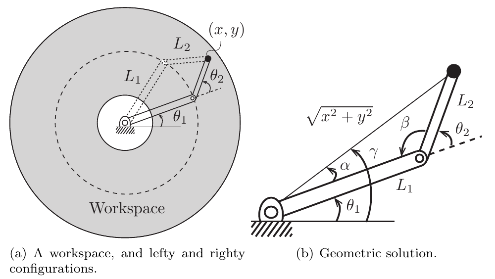

*The same interior workspace point admits two elbow postures. The triangle on the right provides the geometric IK solution. Cropped from book Figure 6.1, printed p. 220.*

#### Reachability and elbow branches

Squaring and adding the position equations gives

$$
r^2=x^2+y^2=L_1^2+L_2^2+2L_1L_2\cos\theta_2.
$$

Define

$$
D=\frac{x^2+y^2-L_1^2-L_2^2}{2L_1L_2}.
$$

A solution requires $|D|\leq 1$, equivalently

$$
\boxed{|L_1-L_2|\leq r\leq L_1+L_2.}
$$

The two elbow branches can be written as

$$
\boxed{\theta_2=\operatorname{atan2}\!\left(\pm\sqrt{1-D^2},D\right).}
$$

For each choice of $\theta_2$, recover the shoulder angle using

$$
\boxed{
\theta_1=\operatorname{atan2}(y,x)
-\operatorname{atan2}(L_2\sin\theta_2,L_1+L_2\cos\theta_2).
}
$$

This is an equivalent form of the book's law-of-cosines construction. The first angle points toward the target; the second is the angle between that direction and link 1. `atan2(y, x)` preserves the quadrant and handles $x=0$ when $y\ne 0$.

Ignoring joint limits and identifying angles modulo $2\pi$, there are two solutions in the annulus interior and one where the branches merge at a boundary, assuming $L_1\ne L_2$. The special case $L_1=L_2$, $(x,y)=(0,0)$ has infinitely many solutions: $\theta_2=\pi$ and any $\theta_1$.

#### Short example

With $L_1=L_2=1$ and target $(x,y)=(1,1)$, $D=0$, so

$$
(\theta_1,\theta_2)=(0,\pi/2)
\quad\text{or}\quad
(\pi/2,-\pi/2).
$$

Both reach the same point, but their endpoint orientations $\theta_1+\theta_2$ differ. Specifying position alone and specifying a full pose are different IK problems.

### 6.3 Analytic IK for PUMA and Stanford Arms

#### Decouple wrist position from orientation

The book's PUMA-type 6R and Stanford-type RRPRRR arms have three wrist axes intersecting at a common **wrist center**. Wrist rotation changes orientation without moving this center, so IK separates into:

1. Find the first three joint coordinates that place the wrist center correctly.
2. Find the last three joint angles that produce the remaining orientation.

If the tool origin is offset from the wrist center by a fixed vector $r$ expressed in the tool frame, a desired tool pose $(R_d,p_d)$ requires wrist-center position

$$
p_w=p_d-R_d r.
$$

The position formulas below use $p=(p_x,p_y,p_z)=p_w$, not necessarily the tool-tip position.

#### PUMA-type arm: shoulder and elbow geometry

For the zero-shoulder-offset model in book Figure 6.2, let $a_2,a_3$ be the two arm-link lengths. Choose a signed radial coordinate

$$
\rho=\pm\sqrt{p_x^2+p_y^2}.
$$

For $\rho>0$, choose $\theta_1=\operatorname{atan2}(p_y,p_x)$; for $\rho<0$, add $\pi$. The remaining position equations reduce to a planar 2R problem with target $(\rho,p_z)$:

$$
D=\frac{\rho^2+p_z^2-a_2^2-a_3^2}{2a_2a_3},
\qquad
\theta_3=\operatorname{atan2}\!\left(\pm\sqrt{1-D^2},D\right),
$$

$$
\theta_2=\operatorname{atan2}(p_z,\rho)
-\operatorname{atan2}(a_3\sin\theta_3,a_2+a_3\cos\theta_3).
$$

Two shoulder choices and two elbow choices give up to four position branches. At $p_x=p_y=0$, the wrist center lies on the first joint axis and its position no longer determines $\theta_1$.

For the book's shoulder offset $d_1$, the projected geometry instead gives $\rho^2=p_x^2+p_y^2-d_1^2$, and

$$
D=\frac{p_x^2+p_y^2+p_z^2-d_1^2-a_2^2-a_3^2}{2a_2a_3}.
$$

Both $p_x^2+p_y^2\geq d_1^2$ and $|D|\leq1$ are necessary. The offset changes the shoulder-angle construction, yielding the lefty/righty and elbow-up/elbow-down branches shown in book Figure 6.5.

#### Solve the remaining wrist orientation

Using the space-form PoE model, once $\theta_1,\theta_2,\theta_3$ are known,

$$
e^{[S_4]\theta_4}e^{[S_5]\theta_5}e^{[S_6]\theta_6}
=e^{-[S_3]\theta_3}e^{-[S_2]\theta_2}e^{-[S_1]\theta_1}T_{sd}M^{-1}.
$$

The right-hand side is known. For the book's home wrist-axis directions $z,y,x$, its rotation block $R$ satisfies

$$
R=R_z(\theta_4)R_y(\theta_5)R_x(\theta_6).
$$

Thus the orientation subproblem is ZYX Euler-angle extraction. For the branch with $\cos\theta_5>0$,

$$
\theta_4=\operatorname{atan2}(R_{21},R_{11}),\quad
\theta_5=\operatorname{atan2}\!\left(-R_{31},\sqrt{R_{11}^2+R_{21}^2}\right),\quad
\theta_6=\operatorname{atan2}(R_{32},R_{33}).
$$

A second nonsingular branch is $(\theta_4+\pi,\pi-\theta_5,\theta_6+\pi)$ modulo $2\pi$. When $\cos\theta_5=0$, the first and last wrist rotations cannot be independently recovered. These formulas depend on the stated wrist-axis convention.

#### Stanford-type arm: replace the elbow by a prismatic joint

For the geometry in book Figure 6.6, define

$$
r=\sqrt{p_x^2+p_y^2},\qquad s=p_z-d_1.
$$

One position branch is

$$
\theta_1=\operatorname{atan2}(p_y,p_x),\qquad
\theta_2=\operatorname{atan2}(s,r),\qquad
\boxed{\theta_3=\sqrt{r^2+s^2}-a_2.}
$$

Here $d_1$ is the base-height offset, $a_2$ is the fixed radial length, and $\theta_3$ is a translation. The last expression follows from $(\theta_3+a_2)^2=r^2+s^2$, taking the positive total radial extension. Another branch uses $\theta_1+\pi$ and $\pi-\theta_2$ with the same extension. Actual prismatic travel limits must still be checked. The wrist-orientation calculation is the same as above.

### 6.4 Newton-Raphson and Local Linearization

An analytic solution exploits a particular mechanism's geometry. Numerical IK instead repeatedly corrects an initial guess using the local differential map. An analytic solution for an idealized arm can also initialize numerical IK for a calibrated model whose axes differ slightly from the ideal geometry.

For a scalar equation $g(\theta)=0$, linearize about the current iterate $\theta^k$:

$$
0\approx g(\theta^k)+g'(\theta^k)\Delta\theta.
$$

Solving for the correction gives the Newton-Raphson update

$$
\theta^{k+1}=\theta^k-\frac{g(\theta^k)}{g'(\theta^k)}.
$$

For an IK task $x=f(\theta)$, let $e^k=x_d-f(\theta^k)$. The corresponding linearization is

$$
f(\theta^k+\Delta\theta)\approx f(\theta^k)+J(\theta^k)\Delta\theta,
\qquad
\boxed{J(\theta^k)\Delta\theta\approx e^k.}
$$

If $J$ is square and invertible,

$$
\theta^{k+1}=\theta^k+J(\theta^k)^{-1}e^k.
$$

The plus sign follows because $J=\partial f/\partial\theta$, whereas $\partial g/\partial\theta=-J$. In code, solve the linear system rather than explicitly forming an inverse.

Each iteration must recompute both the error and the Jacobian. The correction solves a **local approximation**; it generally does not solve the original nonlinear problem in one step.

### 6.5 The Jacobian Pseudoinverse

When $J\in\mathbb R^{m\times n}$ is rectangular or singular, replace the inverse by the Moore-Penrose pseudoinverse:

$$
\boxed{\Delta\theta=J^\dagger e.}
$$

| Linearized problem | Meaning of $J^\dagger e$ |
|:--|:--|
| $J\Delta\theta=e$ has an exact solution | The exact solution with the smallest Euclidean joint-step norm |
| No exact solution exists | The minimum-norm solution among those minimizing $\lVert J\Delta\theta-e\rVert_2$ |

The second case occurs when $e$ has a component outside the column space of $J$. Even a tall or rank-deficient Jacobian can solve a particular error exactly if that error lies in its column space.

Under the stated rank conditions,

$$
J^\dagger=
\begin{cases}
J^T(JJ^T)^{-1},&\text{full row rank},\\
(J^TJ)^{-1}J^T,&\text{full column rank}.
\end{cases}
$$

These formulas explain the geometry; an SVD-based pseudoinverse is preferable for numerical computation. With $J=U\Sigma V^T$, use $J^\dagger=V\Sigma^\dagger U^T$, reciprocating nonzero singular values and leaving zero singular values at zero. A numerical implementation uses a threshold for effectively zero values.

Small retained singular values produce large corrections. A pseudoinverse makes the linearized problem well defined, but does not ensure convergence of nonlinear IK or reachability of the target.

### 6.6 Numerical IK on SE(3)

#### Turn the pose discrepancy into a body twist

For a full pose, $T_{sd}-T_{sb}(\theta^k)$ is a $4\times4$ matrix difference, not the six-component twist required by the geometric Jacobian. Instead, express the target in the current body frame:

$$
T_{bd}=T_{sb}(\theta^k)^{-1}T_{sd}.
$$

Take its matrix logarithm and convert from an $se(3)$ matrix to a six-vector:

$$
\boxed{
[V_b]=\log T_{bd},\qquad
V_b=\begin{bmatrix}\omega_b\\v_b\end{bmatrix}=(\log T_{bd})^\vee.
}
$$

The vee symbol $\vee$ reverses the bracket map: it extracts the three angular and three linear components. This construction satisfies

$$
T_{sb}(\theta^k)e^{[V_b]}=T_{sd}.
$$

Thus $V_b$ describes a constant body twist that would carry the current frame to the target if followed for **unit time**. Here it is a pose-error coordinate used by the solver; it is not a measured velocity or a command to move the robot for one second.

For a small joint correction,

$$
T(\theta^k+\Delta\theta)
\approx T(\theta^k)e^{[J_b(\theta^k)\Delta\theta]},
$$

which motivates $J_b\Delta\theta\approx V_b$ and the update

$$
\boxed{\theta^{k+1}=\theta^k+J_b(\theta^k)^\dagger V_b.}
$$

The logarithm gives an exact finite displacement for the end-effector frame. Realizing it through this joint correction is approximate because the robot Jacobian changes as the joints move.

#### Stop using separate angular and linear tolerances

At every iteration, recompute $V_b$ and require **both**

$$
\lVert\omega_b\rVert\leq\epsilon_\omega,
\qquad
\lVert v_b\rVert\leq\epsilon_v.
$$

The angular and linear components have different units: radians and the model's length unit under the unit-time interpretation. Separate tolerances avoid adding these directly into a single unscaled error threshold.

In general, $v_b$ is not simply $R_{sb}^T(p_d-p_{sb})$: the matrix logarithm couples translation with rotation. They coincide for pure translation and agree to first order near zero pose error.

#### Space-frame formulation

Express the same displacement twist in the space frame using the current pose:

$$
V_s=\operatorname{Ad}_{T_{sb}}V_b,
\qquad
\boxed{\theta^{k+1}=\theta^k+J_s(\theta^k)^\dagger V_s.}
$$

Always pair $V_b$ with $J_b$, or $V_s$ with $J_s$. These describe the same exact linear constraint after a frame change. However, when only an approximate least-squares step is possible, their unweighted pseudoinverse steps can differ: the adjoint is generally not orthogonal, so it changes the residual metric. Linear-error tolerance values are also frame dependent.

### 6.7 Worked Example and Python Implementation

Book Example 6.1 uses a planar 2R arm with both links of length $1\,\mathrm m$. At home the arm points along $+x$, with

$$
M=\begin{bmatrix}
1&0&0&2\\0&1&0&0\\0&0&1&0\\0&0&0&1
\end{bmatrix},\qquad
B_1=\begin{bmatrix}0\\0\\1\\0\\2\\0\end{bmatrix},\quad
B_2=\begin{bmatrix}0\\0\\1\\0\\1\\0\end{bmatrix}.
$$

The target pose is generated by $(\theta_1,\theta_2)=(30^\circ,90^\circ)$: its position is approximately $(0.366,1.366)\,\mathrm m$ and its orientation is $120^\circ$ about $z$. Start from $(0^\circ,30^\circ)$ and use $\epsilon_\omega=10^{-3}\,\mathrm{rad}$, $\epsilon_v=10^{-4}\,\mathrm m$.

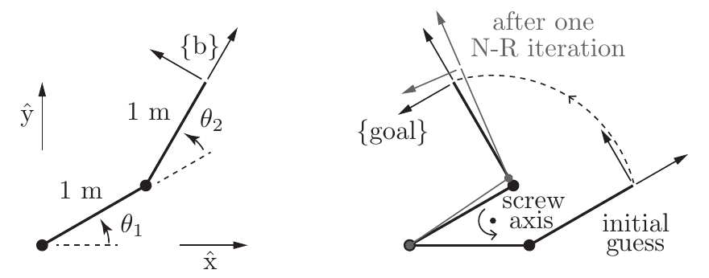

*The first joint update approaches the target pose. The curved dashed path represents the constant-twist frame motion used to define the error; it is not the arm's executed trajectory. Cropped from book Figure 6.8, printed p. 231.*

| Iteration $k$ | Joint angles in degrees | $\lVert\omega_b\rVert$ | $\lVert v_b\rVert$ |
|:--:|:--|:--:|:--:|
| 0 | $(0.00,30.00)$ | 1.571 | 1.924 |
| 1 | $(34.23,79.18)$ | 0.115 | 0.131 |
| 2 | $(29.98,90.22)$ | 0.004 | 0.004 |
| 3 | $(30.00,90.00)$ | Below $10^{-3}$ | Below $10^{-4}$ |

The table rounds the book's intermediate values. Although a 2R arm cannot realize an arbitrary planar pose, this particular target is reachable because it was generated by the same arm's forward kinematics.

The following implementation exposes the iteration while using the [official Modern Robotics Python library](https://github.com/NxRLab/ModernRobotics/tree/master/packages/Python) for rigid-transform operations and Jacobians. It returns the final estimate, a convergence flag, and the number of updates.

```python
import numpy as np
import modern_robotics as mr


def ik_body(Blist, M, T_sd, theta0, eomg=1e-3, ev=1e-4, max_iter=20):
    theta = np.array(theta0, dtype=float, copy=True)
    for k in range(max_iter + 1):
        T_sb = mr.FKinBody(M, Blist, theta)
        V_b = mr.se3ToVec(mr.MatrixLog6(mr.TransInv(T_sb) @ T_sd))
        if np.linalg.norm(V_b[:3]) <= eomg and np.linalg.norm(V_b[3:]) <= ev:
            return theta, True, k
        if k == max_iter:
            return theta, False, k
        theta += np.linalg.pinv(mr.JacobianBody(Blist, theta)) @ V_b


M = np.eye(4)
M[0, 3] = 2.0
Blist = np.array([
    [0, 0],
    [0, 0],
    [1, 1],
    [0, 0],
    [2, 1],
    [0, 0],
], dtype=float)

# Generate a valid target pose without rounding its rotation matrix.
T_sd = mr.FKinBody(M, Blist, np.deg2rad([30.0, 90.0]))
theta, success, updates = ik_body(
    Blist, M, T_sd, np.deg2rad([0.0, 30.0])
)
print(success, updates, np.round(np.rad2deg(theta), 2))
# True 3 [30. 90.]
```

For a standalone run, place this block in a scratch script such as `/tmp/ik_example.py`, install its dependencies with `python3 -m pip install numpy modern_robotics` in your Python environment, and run `python3 /tmp/ik_example.py`. All input angles are in radians. This implements the chapter's unconstrained iteration; the success flag reports pose-error convergence only.

### 6.8 Inverse Velocity Kinematics and Redundancy

Configuration IK finds a pose solution. **Inverse velocity kinematics** finds joint rates for a requested instantaneous twist:

$$
J(\theta)\dot\theta=V_d,\qquad
\boxed{\dot\theta=J(\theta)^\dagger V_d.}
$$

$J$ and $V_d$ must refer to the same frame. For example, the desired trajectory's space twist satisfies $[V_{s,d}]=\dot T_{sd}T_{sd}^{-1}$. A desired body twist defined in the desired frame must be transformed into the current body frame before pairing it with the current $J_b$.

This allows velocity tracking without solving full configuration IK at every timestep. Integrating velocity commands can accumulate pose error, so trajectory tracking also needs pose feedback, developed in Chapter 11.

#### Minimum-norm motion and null-space freedom

When the task is feasible, all exact velocity solutions can be written as

$$
\dot\theta=J^\dagger V_d+(I-J^\dagger J)z,
$$

where $z$ is arbitrary. Since $J(I-J^\dagger J)=0$, the second term does not change the instantaneous task velocity. The pseudoinverse alone chooses the minimum Euclidean norm, corresponding to zero added null-space motion. This is a local joint-rate criterion, not a guarantee of the globally nearest IK configuration.

#### Weighted motion

The chapter also considers different costs for joint velocities. For a symmetric positive-definite weight $W$ and a full-row-rank $J$,

$$
\min_{\dot\theta}\frac12\dot\theta^TW\dot\theta
\quad\text{subject to}\quad J\dot\theta=V_d
$$

has solution

$$
\boxed{
\dot\theta=G V_d,\qquad
G=W^{-1}J^T(JW^{-1}J^T)^{-1}.
}
$$

For $W=I$, this becomes the ordinary pseudoinverse solution. Taking $W$ to be the robot's mass matrix minimizes instantaneous kinetic energy. The book denotes that matrix by $M(\theta)$; $W$ here distinguishes it from the home transform $M$ used in forward kinematics.

#### Add a secondary configuration objective

Let $h(\theta)$ be a potential or posture cost, so its rate of change is $\dot h=\nabla h^T\dot\theta$. Following the book's optimization formulation, minimize

$$
\frac12\dot\theta^TW\dot\theta+\nabla h^T\dot\theta
\quad\text{subject to}\quad J\dot\theta=V_d.
$$

Stationarity gives $W\dot\theta+\nabla h=J^T\lambda$. Substituting $\dot\theta=W^{-1}J^T\lambda-W^{-1}\nabla h$ into the constraint yields

$$
\boxed{\dot\theta=G V_d-(I-GJ)W^{-1}\nabla h.}
$$

The second term uses the remaining joint freedom to reduce the secondary cost without altering $J\dot\theta$. The task motion itself can still increase $h$.

*Source correction: printed p. 234 of the supplied PDF shows a plus sign before this projected gradient term. The minus sign above follows directly from the stated minimization and its stationarity equation. With $W=I$ and $V_d=0$, it gives $\dot h=-\lVert(I-J^\dagger J)\nabla h\rVert^2\leq0$, which checks the descent direction.*

### 6.9 Convergence and Closed Task-Space Loops

#### The initial guess determines the local search

Newton-Raphson can converge quickly near a regular solution. A poor initial guess, a near-singular Jacobian, or an unreachable target can produce large steps, oscillation, stagnation, or failure to converge. A failed run does not prove that no IK solution exists.

For a slowly changing sequence of target poses, use the previous solution as the next initial guess. This often keeps the solver near a useful solution branch, but it does not guarantee continuity across singularities or enforce joint limits and collision avoidance.

Always bound the number of iterations and inspect the final pose error. A small joint update alone does not establish success: at a singularity, a nonzero error can be orthogonal to every achievable instantaneous motion direction.

#### A closed endpoint path need not close in joint space

For a redundant robot, a trajectory satisfying

$$
T_{sd}(0)=T_{sd}(t_f)
$$

may still produce

$$
\theta(0)\ne\theta(t_f).
$$

Returning the end effector to its starting pose does not fix the remaining posture freedom. Local pseudoinverse updates need not return the robot to the original joint configuration; joint-space repeatability requires additional conditions.

The book's "closed loops" in Section 6.4 refers to closed **trajectories**, not the mechanically closed kinematic chains studied in Chapter 7.

### 6.10 Common Confusions

| Confusion | Clarification |
|:--|:--|
| "IK is just inverting the transform $T$." | $T^{-1}$ reverses a frame transformation; IK inverts the nonlinear map from joints to poses. |
| "Six joints mean one solution." | Multiple discrete branches are common, and singular targets need separate analysis. |
| "The pseudoinverse removes singularity problems." | It defines a least-squares step; tiny singular values can still produce large steps, and nonlinear convergence is not guaranteed. |
| "The twist error is position subtraction plus Euler-angle subtraction." | It comes from $\log(T_{sb}^{-1}T_{sd})$ and includes rotation-translation coupling. |
| "One IK iteration is one physical controller timestep." | It is a numerical correction to a candidate configuration; it has no prescribed execution duration. |
| "The closest solution is guaranteed." | The initial guess influences convergence, but minimum-norm local steps do not solve a global nearest-configuration problem. |
| "Reaching the pose makes the motion valid." | Pose convergence alone says nothing about joint limits, collisions, or the path between configurations. |

### 6.11 Formula Sheet

| Concept | Formula |
|:--|:--|
| Full-pose IK | $T(\theta_d)=T_{sd}$ |
| Planar 2R reachability | $\lvert L_1-L_2\rvert\leq\sqrt{x^2+y^2}\leq L_1+L_2$ |
| Local coordinate correction | $J(\theta^k)\Delta\theta\approx x_d-f(\theta^k)$ |
| Pseudoinverse correction | $\Delta\theta=J^\dagger e$ |
| Body pose error | $V_b=(\log(T_{sb}^{-1}T_{sd}))^\vee$ |
| Body IK update | $\theta^{k+1}=\theta^k+J_b^\dagger V_b$ |
| Space pose error | $V_s=\operatorname{Ad}_{T_{sb}}V_b$ |
| Space IK update | $\theta^{k+1}=\theta^k+J_s^\dagger V_s$ |
| Convergence test | $\lVert\omega\rVert\leq\epsilon_\omega$ and $\lVert v\rVert\leq\epsilon_v$ |
| Inverse velocity kinematics | $\dot\theta=J^\dagger V_d$ |
| Null-space freedom | $\dot\theta=J^\dagger V_d+(I-J^\dagger J)z$ |
| Weighted inverse, full row rank | $G=W^{-1}J^T(JW^{-1}J^T)^{-1}$ |
| Weighted secondary-objective motion | $\dot\theta=GV_d-(I-GJ)W^{-1}\nabla h$ |

### 6.12 Software Map

| Operation | Modern Robotics / NumPy function |
|:--|:--|
| Body-frame numerical IK | `IKinBody(Blist, M, T, thetalist0, eomg, ev)` |
| Space-frame numerical IK | `IKinSpace(Slist, M, T, thetalist0, eomg, ev)` |
| Current pose | `FKinBody(M, Blist, thetalist)` / `FKinSpace(M, Slist, thetalist)` |
| Current Jacobian | `JacobianBody(Blist, thetalist)` / `JacobianSpace(Slist, thetalist)` |
| Inverse rigid transform | `TransInv(T)` |
| Rigid-transform logarithm | `MatrixLog6(T)` |
| Extract twist coordinates | `se3ToVec(se3mat)` |
| Change twist frame | `Adjoint(T) @ V` |
| Moore-Penrose pseudoinverse | `np.linalg.pinv(J)` |

`IKinBody` and `IKinSpace` return `(thetalist, success)`. Their screw-axis lists have shape $6\times n$, with home screw axes as columns. The target `T` has shape $4\times4$, and the initial guess has $n$ joint coordinates. `eomg` and `ev` are interpreted in the selected body or space frame. See the [official Python implementation](https://github.com/NxRLab/ModernRobotics/blob/master/packages/Python/modern_robotics/core.py) for the library routines.

### 6.13 Understanding Checklist

After this chapter, you should be able to:

* distinguish position-only IK from full-pose IK and count task-relative redundancy;
* derive the planar 2R reachability condition and both elbow solutions;
* explain how a common wrist center separates position and orientation IK;
* describe the PUMA and Stanford position subproblems;
* derive a Newton-Raphson joint correction from local linearization;
* distinguish minimum-norm exact solutions from least-squares approximations;
* compute a body pose error using the matrix logarithm and pair it with the correct Jacobian;
* implement the iterative solver with separate angular and linear stopping tolerances;
* explain how the initial guess and small Jacobian singular values affect convergence;
* use null-space freedom and a weighted inverse to resolve redundancy;
* explain why a closed end-effector path may not return the joints to their initial configuration.

Chapter 7 extends kinematic analysis to mechanisms with closed chains, whose joint motions must also satisfy loop-closure constraints.
