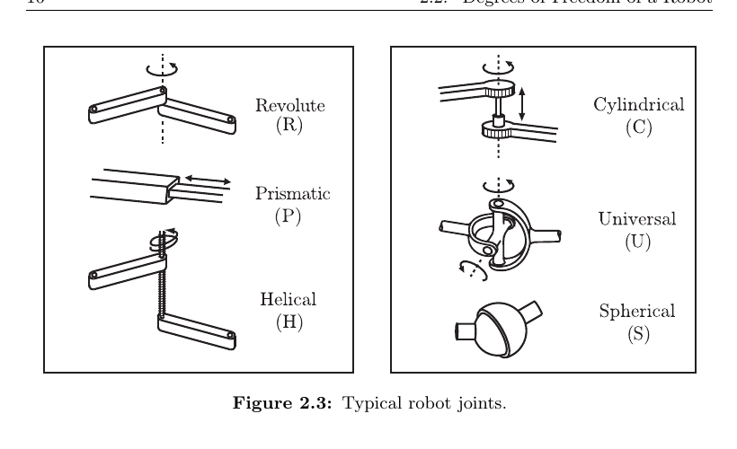
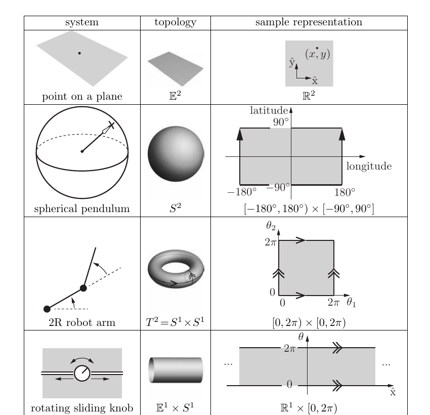
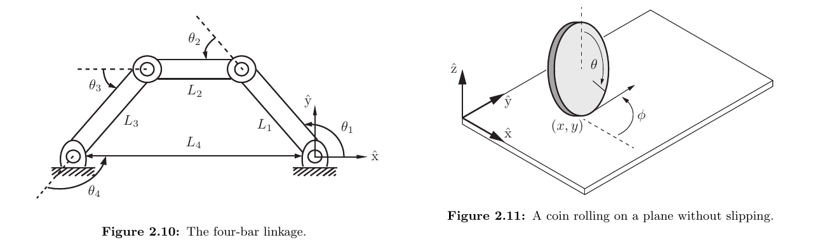
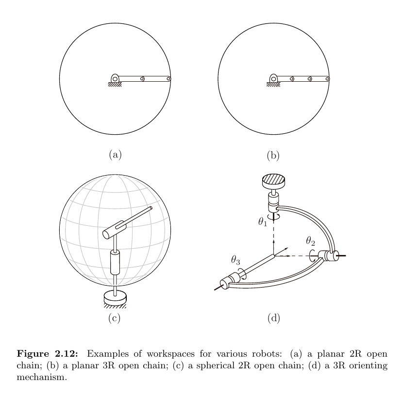

# Modern Robotics: Mechanics, Planning, and Control

> Chapter-by-chapter notes on the mathematical foundations of robot motion, planning, and control. These notes summarize the core ideas in my own words and retain only the definitions, equations, and examples needed for understanding.

**Reference:** Kevin M. Lynch and Frank C. Park, *Modern Robotics: Mechanics, Planning, and Control*, Cambridge University Press, 2017. The book and supporting materials are available from [Modern Robotics](http://modernrobotics.org/).

## Book Catalog

| Chapter | Topic | Note status |
|:--:|:--|:--:|
| 1 | Preview | Not started |
| 2 | [Configuration Space](#chapter-2-configuration-space) | Complete |
| 3 | Rigid-Body Motions | Not started |
| 4 | Forward Kinematics | Not started |
| 5 | Velocity Kinematics and Statics | Not started |
| 6 | Inverse Kinematics | Not started |
| 7 | Kinematics of Closed Chains | Not started |
| 8 | Dynamics of Open Chains | Not started |
| 9 | Trajectory Generation | Not started |
| 10 | Motion Planning | Not started |
| 11 | Robot Control | Not started |
| 12 | Grasping and Manipulation | Not started |
| 13 | Wheeled Mobile Robots | Not started |

## Chapter 2 Catalog

| Section | Topic |
|:--|:--|
| 2.1 | [Configuration, C-Space, and Degrees of Freedom](#21-configuration-c-space-and-degrees-of-freedom) |
| 2.2 | [Degrees of Freedom of a Robot](#22-degrees-of-freedom-of-a-robot) |
| 2.3 | [C-Space Topology and Representation](#23-c-space-topology-and-representation) |
| 2.4 | [Configuration and Velocity Constraints](#24-configuration-and-velocity-constraints) |
| 2.5 | [Task Space and Workspace](#25-task-space-and-workspace) |
| 2.6 | [Common Confusions](#26-common-confusions) |
| 2.7 | [Formula Sheet](#27-formula-sheet) |
| 2.8 | [Understanding Checklist](#28-understanding-checklist) |

---

## Chapter 2: Configuration Space

The central modeling step in robotics is to replace the geometry of an entire mechanism with a point in a mathematical space. Robot motion then becomes a curve in that space.

### 2.1 Configuration, C-Space, and Degrees of Freedom

#### Configuration

A robot's **configuration** is a complete specification of the position of every point on the robot. Once the configuration is known, the pose of every link is determined.

This definition is stricter than specifying only the end-effector position. Two arm postures can place the end effector at the same point while being different robot configurations.

#### Configuration space

The **configuration space**, or **C-space**, is the set of all possible robot configurations:

$$
q \in \mathcal C.
$$

Here, $q$ is one configuration and a continuous robot motion is a curve $q(t)$ in $\mathcal C$.

#### Degrees of freedom

The number of **degrees of freedom** (DOF) is the dimension of the C-space. Informally, it is the minimum number of independent real-valued parameters needed *locally* to describe a configuration.

The word **locally** means "within a small neighborhood of one configuration." For example, the sphere $S^2$ has two DOF because any sufficiently small surface patch can be described by two coordinates. However, one pair of coordinates cannot describe the whole sphere without a singularity: latitude and longitude work over most of it, but longitude becomes undefined at the poles. The space is still two-dimensional; it simply needs multiple coordinate charts or a redundant global representation.

A finite mode choice also does not add a **continuous** DOF. Consider a planar object that must remain flat on a table and cannot be flipped continuously through the table. Its configurations have two disconnected components, face-up and face-down:

$$
\mathcal C
=\left(\mathbb R^2\times S^1\right)
\times\{\text{face-up},\text{face-down}\}.
$$

Within either component, $(x,y,\theta)$ can vary continuously, so each component has three DOF. The binary face label selects a component but provides no additional continuous direction of motion; therefore the C-space still has three DOF, not four.

#### Rigid-body DOF

| Rigid body | Translation | Orientation | Total DOF |
|:--|:--:|:--:|:--:|
| In a plane | 2 | 1 | 3 |
| In 3D space | 3 | 3 | 6 |

A planar rigid body may be represented by $(x,y,\theta)$. A spatial rigid body needs three position variables and three orientation DOF, although a globally valid orientation representation may use more than three numbers.

The basic counting principle is

$$
\text{DOF}
= \text{number of variables}
- \text{number of independent constraints}.
$$

Only **independent** constraints reduce dimension. Redundant equations must not be counted twice.

### 2.2 Degrees of Freedom of a Robot

A mechanism consists of rigid **links** connected by **joints**. One link is fixed and called the ground link. Each joint permits some relative link motions and constrains the others.

*Typical robot joints. Cropped from book Figure 2.3.*

For a spatial mechanism, two unconstrained rigid bodies have six relative DOF. If joint $i$ permits $f_i$ motions and imposes $c_i$ independent constraints, then

$$
f_i+c_i=6.
$$

For planar mechanisms, replace $6$ with $3$.

| Joint | Symbol | Allowed DOF $f_i$ | Spatial constraints $c_i$ |
|:--|:--:|:--:|:--:|
| Revolute | R | 1 | 5 |
| Prismatic | P | 1 | 5 |
| Helical | H | 1 | 5 |
| Cylindrical | C | 2 | 4 |
| Universal | U | 2 | 4 |
| Spherical | S | 3 | 3 |

#### Grubler's formula

Let

- $N$ be the number of links, including the ground link;
- $J$ be the number of joints;
- $m=3$ for planar mechanisms and $m=6$ for spatial mechanisms;
- $f_i$ be the number of freedoms permitted by joint $i$.

The mechanism mobility is

$$
\boxed{
\operatorname{dof}
=m(N-1-J)+\sum_{i=1}^{J}f_i
}
$$

or, equivalently,

$$
\operatorname{dof}
=m(N-1)-\sum_{i=1}^{J}c_i.
$$

Reasoning behind the formula:

1. The $N-1$ moving links would have $m(N-1)$ DOF if disconnected.
2. Joint $i$ removes $c_i=m-f_i$ relative motions.
3. Subtract all independent joint constraints.

#### Examples

**Open $k$R serial chain**

An open chain with $k$ revolute joints has $N=k+1$, $J=k$, and $f_i=1$:

$$
\operatorname{dof}
=m((k+1)-1-k)+k=k.
$$

**Planar four-bar linkage**

With $N=4$, $J=4$, $m=3$, and four one-DOF revolute joints,

$$
\operatorname{dof}=3(4-1-4)+4=1.
$$

**Important limitation:** Grubler's formula assumes that all counted joint constraints are independent. Special link geometries can make some constraints redundant. In such cases, the formula underestimates the actual mobility and should be treated as a generic lower bound, not a substitute for geometric analysis.

An **open chain** has no kinematic loop. A **closed chain** contains at least one loop, so its joint variables must also satisfy loop-closure constraints.

### 2.3 C-Space Topology and Representation

The dimension of $\mathcal C$ tells us how many DOF the robot has, but not how configurations connect or whether a coordinate wraps around. This global structure is described by **topology**.

#### Common spaces

| Symbol | Meaning | Robotics example |
|:--:|:--|:--|
| $\mathbb R^n$ | Euclidean space | $n$ independent translations |
| $S^1$ | Circle | One unlimited revolute joint |
| $S^2$ | Sphere surface | A direction in 3D |
| $T^n=(S^1)^n$ | $n$-torus | $n$ unlimited revolute joints |

*Topology and sample coordinate representations. Cropped from book Table 2.2.*

Examples:

| System | C-space topology, ignoring joint limits |
|:--|:--|
| Point translating in a plane | $\mathbb R^2$ |
| Planar rigid body | $\mathbb R^2\times S^1$ |
| PR arm | $\mathbb R\times S^1$ |
| 2R arm | $S^1\times S^1=T^2$ |
| Planar mobile base with a 2R arm | $\mathbb R^2\times T^3$ |

Joint limits replace a line or circle factor with an interval. A closed interval is not topologically equivalent to a line because it has boundary points.

The key lesson is that **equal dimension does not imply equal C-space**. A plane, a sphere, a cylinder, and a torus are all two-dimensional, but their connectivity and wrap-around behavior differ.

#### Topology versus coordinates

Topology describes the intrinsic space. A **representation** assigns numbers to points in that space.

An **explicit parametrization** uses the minimum number of local coordinates. This is compact, but a single global parametrization of a non-Euclidean space often contains singularities. Latitude and longitude, for example, become ambiguous at the poles even though the sphere itself is smooth.

Two standard remedies are:

1. Use several nonsingular local coordinate charts. Their collection is an **atlas**.
2. Embed the C-space in a higher-dimensional Euclidean space and impose equations.

For example, the sphere can be represented implicitly as

$$
S^2=\left\{(x,y,z)\in\mathbb R^3
\mid x^2+y^2+z^2=1\right\}.
$$

This uses three numbers for a two-dimensional space, but it is globally smooth and has no pole singularity. The same tradeoff appears later in rotation representations: redundant coordinates can be easier and safer to use globally than a minimal parametrization.

### 2.4 Configuration and Velocity Constraints

Closed-chain mechanisms and rolling systems show two fundamentally different kinds of constraints.

*A closed-chain configuration constraint and a nonholonomic rolling constraint. Cropped from book Figures 2.10 and 2.11.*

#### Holonomic configuration constraints

A **holonomic constraint** is an equation involving configuration variables:

$$
g(q)=0,
\qquad
g:\mathbb R^n\rightarrow\mathbb R^k.
$$

If the $k$ scalar equations are independent near $q$, the constrained C-space has local dimension

$$
\dim\mathcal C=n-k.
$$

For a planar four-bar linkage, let $\theta_i$ be the relative joint angles and $L_i$ the link lengths. One loop-closure representation is

$$
\sum_{i=1}^{4}L_i
\cos\left(\sum_{j=1}^{i}\theta_j\right)=0,
$$

$$
\sum_{i=1}^{4}L_i
\sin\left(\sum_{j=1}^{i}\theta_j\right)=0,
$$

$$
\sum_{i=1}^{4}\theta_i-2\pi=0.
$$

These are three independent equations in four joint variables, so valid configurations form a one-dimensional curve in the four-dimensional joint-coordinate space.

Differentiating $g(q(t))=0$ gives the corresponding velocity constraint:

$$
\underbrace{\frac{\partial g}{\partial q}}_{J_g(q)}\dot q=0.
$$

Thus, admissible velocities lie in the null space of the constraint Jacobian $J_g(q)$.

#### Pfaffian velocity constraints

A general linear velocity constraint has the form

$$
A(q)\dot q=0.
$$

This is called a **Pfaffian constraint**.

- It is **integrable** or holonomic if it is locally equivalent to the derivative of some configuration constraint $g(q)=0$.
- It is **nonintegrable** or nonholonomic if no equivalent configuration-only constraint exists.

#### Rolling coin example

Use

$$
q=(x,y,\phi,\theta),
$$

where $(x,y)$ is the contact position, $\phi$ is the heading, $\theta$ is the wheel rotation, and $r$ is the radius. Rolling without slipping requires

$$
\dot x=r\dot\theta\cos\phi,
\qquad
\dot y=r\dot\theta\sin\phi.
$$

Equivalently,

$$
\begin{bmatrix}
1&0&0&-r\cos\phi\\
0&1&0&-r\sin\phi
\end{bmatrix}
\begin{bmatrix}
\dot x\\\dot y\\\dot\phi\\\dot\theta
\end{bmatrix}
=0.
$$

At any instant, only a two-dimensional subspace of velocities is allowed. However, these constraints do **not** reduce the C-space from four dimensions: by combining allowed motions over time, the coin can reach configurations that are not reachable by one instantaneous velocity.

This gives an important distinction:

$$
\boxed{
\text{C-space dimension}
\neq
\text{dimension of instantaneous feasible velocities}
}
$$

for a nonholonomic system.

### 2.5 Task Space and Workspace

These three spaces answer different questions:

| Space | Question | Determined by |
|:--|:--|:--|
| Configuration space $\mathcal C$ | What is the complete robot posture? | Robot mechanism |
| Task space $\mathcal X$ | Which output variables matter for the task? | Task definition |
| Workspace $\mathcal W$ | Which selected end-effector values can the robot reach? | Robot and chosen output representation |

Let the forward map be

$$
h:\mathcal C\rightarrow\mathcal X.
$$

Then the reachable workspace is the image of the C-space:

$$
\mathcal W=h(\mathcal C)\subseteq\mathcal X.
$$

*Examples of workspaces for different mechanisms. Cropped from book Figure 2.12.*

Examples:

- For drawing on paper, only pen-tip position may matter, so $\mathcal X=\mathbb R^2$.
- For manipulating a free rigid object, the task usually needs a full six-DOF pose.
- A spray nozzle may need position and pointing direction but not rotation about its own axis, giving $\mathbb R^3\times S^2$.
- A 2R and a 3R planar arm can have the same position workspace while having different C-spaces.

The map $h$ is generally many-to-one: several robot configurations can produce the same task-space point. This is the geometric source of kinematic redundancy.

### 2.6 Common Confusions

#### "DOF is the number of joints"

Only for common open chains in which every joint variable is independent. Closed-chain constraints, multi-DOF joints, and redundant constraints break this shortcut.

#### "A two-dimensional space is a plane"

Dimension is local. A sphere and torus are also two-dimensional, but their global topology is different.

#### "A coordinate singularity is a physical singularity"

Not necessarily. Latitude-longitude coordinates fail at a pole even though the sphere is smooth there. The problem may be the representation rather than the robot.

#### "Every velocity constraint removes a DOF"

Only integrable velocity constraints correspond to lower-dimensional configuration constraints. Nonholonomic constraints restrict instantaneous motion without necessarily reducing the reachable C-space dimension.

#### "Task space and workspace are synonyms"

Task space is the space of desired task variables. Workspace is the subset of selected output values that the robot can actually reach.

### 2.7 Formula Sheet

| Concept | Formula |
|:--|:--|
| Configuration | $q\in\mathcal C$ |
| DOF | $\operatorname{dof}=\dim\mathcal C$ |
| Variable-constraint count | $\operatorname{dof}=n-k$ for $k$ independent constraints |
| Joint freedom/constraint relation | $f_i+c_i=m$ |
| Grubler mobility | $\operatorname{dof}=m(N-1-J)+\sum_i f_i$ |
| Holonomic constraint | $g(q)=0$ |
| Differentiated holonomic constraint | $J_g(q)\dot q=0$ |
| Pfaffian velocity constraint | $A(q)\dot q=0$ |
| Forward task map | $h:\mathcal C\to\mathcal X$ |
| Workspace | $\mathcal W=h(\mathcal C)$ |

### 2.8 Understanding Checklist

After this chapter, you should be able to:

- identify a robot configuration and distinguish it from an end-effector output;
- calculate generic mechanism mobility using Grubler's formula and state its independence assumption;
- infer basic C-space topologies from prismatic and revolute joints;
- explain why minimal global coordinates may have singularities;
- distinguish holonomic constraints from nonholonomic velocity constraints;
- distinguish C-space, task space, and workspace.

The next chapter builds on this foundation by representing rigid-body position and orientation and by describing motions on those spaces.
