# Modern Robotics: Mechanics, Planning, and Control

> Chapter-by-chapter notes on the mathematical foundations of robot motion, planning, and control. These notes summarize the core ideas in my own words and retain only the definitions, equations, and examples needed for understanding.

**Reference:** Kevin M. Lynch and Frank C. Park, *Modern Robotics: Mechanics, Planning, and Control*, Cambridge University Press, 2017. The book and supporting materials are available from [Modern Robotics](http://modernrobotics.org/).

## Book Catalog

| Chapter | Topic | Note status |
|:--:|:--|:--:|
| 1 | Preview | Not started |
| 2 | [Configuration Space](#chapter-2-configuration-space) | Complete |
| 3 | [Rigid-Body Motions](#chapter-3-rigid-body-motions) | Complete |
| 4 | [Forward Kinematics](#chapter-4-forward-kinematics) | Complete |
| 5 | [Velocity Kinematics and Statics](#chapter-5-velocity-kinematics-and-statics) | Complete |
| 6 | [Inverse Kinematics](#chapter-6-inverse-kinematics) | Complete |
| 7 | Kinematics of Closed Chains | Skipped |
| 8 | [Dynamics of Open Chains](#chapter-8-dynamics-of-open-chains) | Sections 8.1-8.5 complete |
| 9 | [Trajectory Generation](#chapter-9-trajectory-generation) | Complete |
| 10 | Motion Planning | Not started |
| 11 | Robot Control | Not started |
| 12 | Grasping and Manipulation | Not started |
| 13 | Wheeled Mobile Robots | Not started |

## Chapter 2 Catalog

| Section | Topic |
|:--|:--|
| 2.1 | [Configuration, C-Space, and Degrees of Freedom](#21-configuration-c-space-and-degrees-of-freedom) |
| 2.2 | [Degrees of Freedom of a Robot](#22-degrees-of-freedom-of-a-robot) |
| 2.3 | [C-Space Topology and Representation](#23-c-space-topology-and-representation) |
| 2.4 | [Configuration and Velocity Constraints](#24-configuration-and-velocity-constraints) |
| 2.5 | [Task Space and Workspace](#25-task-space-and-workspace) |
| 2.6 | [Common Confusions](#26-common-confusions) |
| 2.7 | [Formula Sheet](#27-formula-sheet) |
| 2.8 | [Understanding Checklist](#28-understanding-checklist) |

## Chapter 3 Catalog

| Section | Topic |
|:--|:--|
| 3.1 | [Frames and the Planar Preview](#31-frames-and-the-planar-preview) |
| 3.2 | [Rotations and Angular Velocities](#32-rotations-and-angular-velocities) |
| 3.3 | [Rigid-Body Motions and Twists](#33-rigid-body-motions-and-twists) |
| 3.4 | [Wrenches](#34-wrenches) |
| 3.5 | [$SO(3)$ and $SE(3)$ in Parallel](#35-so3-and-se3-in-parallel) |
| 3.6 | [Common Confusions](#36-common-confusions) |
| 3.7 | [Formula Sheet](#37-formula-sheet) |
| 3.8 | [Software Map](#38-software-map) |
| 3.9 | [Understanding Checklist](#39-understanding-checklist) |

## Chapter 4 Catalog

| Section | Topic |
|:--|:--|
| 4.1 | [Forward Kinematics as a Map](#41-forward-kinematics-as-a-map) |
| 4.2 | [Home Configuration and Joint Screw Axes](#42-home-configuration-and-joint-screw-axes) |
| 4.3 | [Space-Form Product of Exponentials](#43-space-form-product-of-exponentials) |
| 4.4 | [Worked Example: Planar 3R Chain](#44-worked-example-planar-3r-chain) |
| 4.5 | [Body-Form Product of Exponentials](#45-body-form-product-of-exponentials) |
| 4.6 | [Space and Body Forms Compared](#46-space-and-body-forms-compared) |
| 4.7 | [Universal Robot Description Format](#47-universal-robot-description-format) |
| 4.8 | [Common Confusions](#48-common-confusions) |
| 4.9 | [Formula Sheet](#49-formula-sheet) |
| 4.10 | [Software Map](#410-software-map) |
| 4.11 | [Understanding Checklist](#411-understanding-checklist) |

## Chapter 5 Catalog

| Section | Topic |
|:--|:--|
| 5.1 | [Velocity Kinematics as a Differential Map](#51-velocity-kinematics-as-a-differential-map) |
| 5.2 | [Manipulator Jacobian](#52-manipulator-jacobian) |
| 5.3 | [Space Jacobian](#53-space-jacobian) |
| 5.4 | [Body Jacobian](#54-body-jacobian) |
| 5.5 | [Space and Body Jacobians Compared](#55-space-and-body-jacobians-compared) |
| 5.6 | [Analytic Jacobians and Inverse Velocity Kinematics](#56-analytic-jacobians-and-inverse-velocity-kinematics) |
| 5.7 | [Statics of Open Chains](#57-statics-of-open-chains) |
| 5.8 | [Singularity Analysis](#58-singularity-analysis) |
| 5.9 | [Manipulability](#59-manipulability) |
| 5.10 | [Common Confusions](#510-common-confusions) |
| 5.11 | [Formula Sheet](#511-formula-sheet) |
| 5.12 | [Software Map](#512-software-map) |
| 5.13 | [Understanding Checklist](#513-understanding-checklist) |

## Chapter 6 Catalog

| Section | Topic |
|:--|:--|
| 6.1 | [The Inverse Kinematics Problem](#61-the-inverse-kinematics-problem) |
| 6.2 | [Analytic Example: Planar 2R Arm](#62-analytic-example-planar-2r-arm) |
| 6.3 | [Analytic IK for PUMA and Stanford Arms](#63-analytic-ik-for-puma-and-stanford-arms) |
| 6.4 | [Newton-Raphson and Local Linearization](#64-newton-raphson-and-local-linearization) |
| 6.5 | [The Jacobian Pseudoinverse](#65-the-jacobian-pseudoinverse) |
| 6.6 | [Numerical IK on SE(3)](#66-numerical-ik-on-se3) |
| 6.7 | [Worked Example and Python Implementation](#67-worked-example-and-python-implementation) |
| 6.8 | [Inverse Velocity Kinematics and Redundancy](#68-inverse-velocity-kinematics-and-redundancy) |
| 6.9 | [Convergence and Closed Task-Space Loops](#69-convergence-and-closed-task-space-loops) |
| 6.10 | [Common Confusions](#610-common-confusions) |
| 6.11 | [Formula Sheet](#611-formula-sheet) |
| 6.12 | [Software Map](#612-software-map) |
| 6.13 | [Understanding Checklist](#613-understanding-checklist) |

## Chapter 8 Catalog

Only book Sections 8.1-8.5 are covered. The review aids below do not represent additional book sections.

| Book section | Topic |
|:--|:--|
| Roadmap | [How the Chapter Fits Together](#how-the-chapter-fits-together) |
| 8.1 | [Lagrangian Formulation](#81-lagrangian-formulation) |
| 8.2 | [Dynamics of a Single Rigid Body](#82-dynamics-of-a-single-rigid-body) |
| 8.3 | [Newton-Euler Inverse Dynamics](#83-newton-euler-inverse-dynamics) |
| 8.4 | [Dynamic Equations in Closed Form](#84-dynamic-equations-in-closed-form) |
| 8.5 | [Forward Dynamics of Open Chains](#85-forward-dynamics-of-open-chains) |
| Review | [Common Confusions](#chapter-8-common-confusions) |
| Review | [Formula Sheet](#chapter-8-formula-sheet) |
| Review | [Software Map](#chapter-8-software-map) |
| Review | [Understanding Checklist](#chapter-8-understanding-checklist) |

## Chapter 9 Catalog

Sections 9.1-9.6 follow the book's organization; the final review aids are additional notes.

| Book section | Topic |
|:--|:--|
| 9.1 | [Definitions: Path, Time Scaling, and Trajectory](#91-definitions-path-time-scaling-and-trajectory) |
| 9.2 | [Point-to-Point Trajectories](#92-point-to-point-trajectories) |
| 9.2.1 | [Straight-Line Paths](#921-straight-line-paths) |
| 9.2.2 | [Time Scaling a Straight-Line Path](#922-time-scaling-a-straight-line-path) |
| 9.3 | [Polynomial Via Point Trajectories](#93-polynomial-via-point-trajectories) |
| 9.4 | [Time-Optimal Time Scaling](#94-time-optimal-time-scaling) |
| 9.4.1 | [The Phase Plane](#941-the-phase-plane) |
| 9.4.2 | [The Time-Scaling Algorithm](#942-the-time-scaling-algorithm) |
| 9.4.3 | [Searching the Velocity Limit Curve](#943-searching-the-velocity-limit-curve) |
| 9.4.4 | [Assumptions and Caveats](#944-assumptions-and-caveats) |
| 9.5 | [Summary and Formula Sheet](#95-summary-and-formula-sheet) |
| 9.6 | [Software and Worked Implementation](#96-software-and-worked-implementation) |
| Review | [Common Confusions](#chapter-9-common-confusions) |
| Review | [Understanding Checklist](#chapter-9-understanding-checklist) |

---

## Chapter 2: Configuration Space

The central modeling step in robotics is to replace the geometry of an entire mechanism with a point in a mathematical space. Robot motion then becomes a curve in that space.

### 2.1 Configuration, C-Space, and Degrees of Freedom

#### Configuration

A robot's **configuration** is a complete specification of the position of every point on the robot. Once the configuration is known, the pose of every link is determined.

This definition is stricter than specifying only the end-effector position. Two arm postures can place the end effector at the same point while being different robot configurations.

#### Configuration space

The **configuration space**, or **C-space**, is the set of all possible robot configurations:

$$
q \in \mathcal C.
$$

Here, $q$ is one configuration and a continuous robot motion is a curve $q(t)$ in $\mathcal C$.

#### Degrees of freedom

The number of **degrees of freedom** (DOF) is the dimension of the C-space. Informally, it is the minimum number of independent real-valued parameters needed *locally* to describe a configuration.

The word **locally** means "within a small neighborhood of one configuration." For example, the sphere $S^2$ has two DOF because any sufficiently small surface patch can be described by two coordinates. However, one pair of coordinates cannot describe the whole sphere without a singularity: latitude and longitude work over most of it, but longitude becomes undefined at the poles. The space is still two-dimensional; it simply needs multiple coordinate charts or a redundant global representation.

A finite mode choice also does not add a **continuous** DOF. Consider a planar object that must remain flat on a table and cannot be flipped continuously through the table. Its configurations have two disconnected components, face-up and face-down:

$$
\mathcal C
=\left(\mathbb R^2\times S^1\right)
\times\{\text{face-up},\text{face-down}\}.
$$

Within either component, $(x,y,\theta)$ can vary continuously, so each component has three DOF. The binary face label selects a component but provides no additional continuous direction of motion; therefore the C-space still has three DOF, not four.

#### Rigid-body DOF

| Rigid body | Translation | Orientation | Total DOF |
|:--|:--:|:--:|:--:|
| In a plane | 2 | 1 | 3 |
| In 3D space | 3 | 3 | 6 |

A planar rigid body may be represented by $(x,y,\theta)$. A spatial rigid body needs three position variables and three orientation DOF, although a globally valid orientation representation may use more than three numbers.

The basic counting principle is

$$
\text{DOF}
= \text{number of variables}
- \text{number of independent constraints}.
$$

Only **independent** constraints reduce dimension. Redundant equations must not be counted twice.

### 2.2 Degrees of Freedom of a Robot

A mechanism consists of rigid **links** connected by **joints**. One link is fixed and called the ground link. Each joint permits some relative link motions and constrains the others.

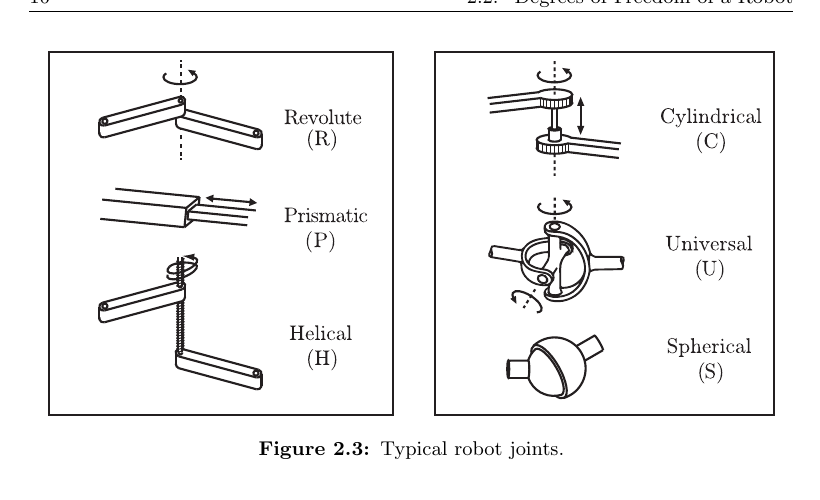

*Typical robot joints. Cropped from book Figure 2.3.*

For a spatial mechanism, two unconstrained rigid bodies have six relative DOF. If joint $i$ permits $f_i$ motions and imposes $c_i$ independent constraints, then

$$
f_i+c_i=6.
$$

For planar mechanisms, replace $6$ with $3$.

| Joint | Symbol | Allowed DOF $f_i$ | Spatial constraints $c_i$ |
|:--|:--:|:--:|:--:|
| Revolute | R | 1 | 5 |
| Prismatic | P | 1 | 5 |
| Helical | H | 1 | 5 |
| Cylindrical | C | 2 | 4 |
| Universal | U | 2 | 4 |
| Spherical | S | 3 | 3 |

#### Grubler's formula

Let

- $N$ be the number of links, including the ground link;
- $J$ be the number of joints;
- $m=3$ for planar mechanisms and $m=6$ for spatial mechanisms;
- $f_i$ be the number of freedoms permitted by joint $i$.

The mechanism mobility is

$$
\boxed{
\operatorname{dof}
=m(N-1-J)+\sum_{i=1}^{J}f_i
}
$$

or, equivalently,

$$
\operatorname{dof}
=m(N-1)-\sum_{i=1}^{J}c_i.
$$

Reasoning behind the formula:

1. The $N-1$ moving links would have $m(N-1)$ DOF if disconnected.
2. Joint $i$ removes $c_i=m-f_i$ relative motions.
3. Subtract all independent joint constraints.

#### Examples

**Open $k$R serial chain**

An open chain with $k$ revolute joints has $N=k+1$, $J=k$, and $f_i=1$:

$$
\operatorname{dof}
=m((k+1)-1-k)+k=k.
$$

**Planar four-bar linkage**

With $N=4$, $J=4$, $m=3$, and four one-DOF revolute joints,

$$
\operatorname{dof}=3(4-1-4)+4=1.
$$

**Important limitation:** Grubler's formula assumes that all counted joint constraints are independent. Special link geometries can make some constraints redundant. In such cases, the formula underestimates the actual mobility and should be treated as a generic lower bound, not a substitute for geometric analysis.

An **open chain** has no kinematic loop. A **closed chain** contains at least one loop, so its joint variables must also satisfy loop-closure constraints.

### 2.3 C-Space Topology and Representation

The dimension of $\mathcal C$ tells us how many DOF the robot has, but not how configurations connect or whether a coordinate wraps around. This global structure is described by **topology**.

#### Common spaces

| Symbol | Meaning | Robotics example |
|:--:|:--|:--|
| $\mathbb R^n$ | Euclidean space | $n$ independent translations |
| $S^1$ | Circle | One unlimited revolute joint |
| $S^2$ | Sphere surface | A direction in 3D |
| $T^n=(S^1)^n$ | $n$-torus | $n$ unlimited revolute joints |

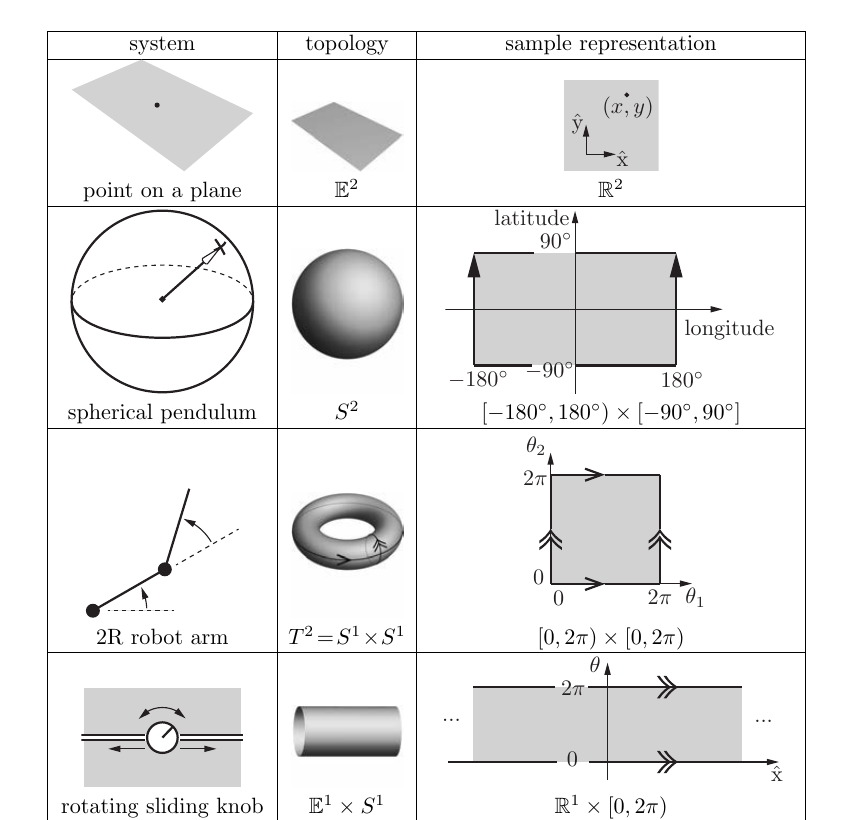

*Topology and sample coordinate representations. Cropped from book Table 2.2.*

Examples:

| System | C-space topology, ignoring joint limits |
|:--|:--|
| Point translating in a plane | $\mathbb R^2$ |
| Planar rigid body | $\mathbb R^2\times S^1$ |
| PR arm | $\mathbb R\times S^1$ |
| 2R arm | $S^1\times S^1=T^2$ |
| Planar mobile base with a 2R arm | $\mathbb R^2\times T^3$ |

Joint limits replace a line or circle factor with an interval. A closed interval is not topologically equivalent to a line because it has boundary points.

The key lesson is that **equal dimension does not imply equal C-space**. A plane, a sphere, a cylinder, and a torus are all two-dimensional, but their connectivity and wrap-around behavior differ.

#### Topology versus coordinates

Topology describes the intrinsic space. A **representation** assigns numbers to points in that space.

An **explicit parametrization** uses the minimum number of local coordinates. This is compact, but a single global parametrization of a non-Euclidean space often contains singularities. Latitude and longitude, for example, become ambiguous at the poles even though the sphere itself is smooth.

Two standard remedies are:

1. Use several nonsingular local coordinate charts. Their collection is an **atlas**.
2. Embed the C-space in a higher-dimensional Euclidean space and impose equations.

For example, the sphere can be represented implicitly as

$$
S^2=\left\{(x,y,z)\in\mathbb R^3
\mid x^2+y^2+z^2=1\right\}.
$$

This uses three numbers for a two-dimensional space, but it is globally smooth and has no pole singularity. The same tradeoff appears later in rotation representations: redundant coordinates can be easier and safer to use globally than a minimal parametrization.

### 2.4 Configuration and Velocity Constraints

Closed-chain mechanisms and rolling systems show two fundamentally different kinds of constraints.

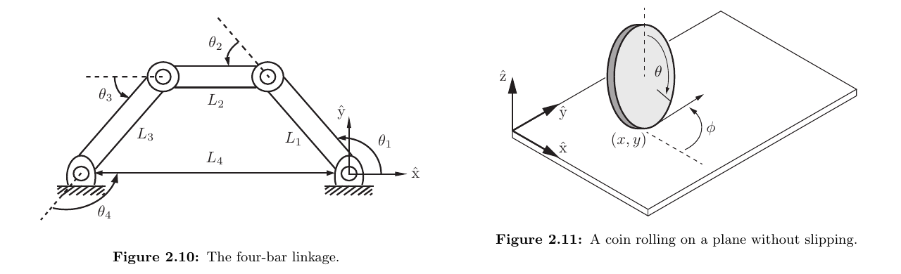

*A closed-chain configuration constraint and a nonholonomic rolling constraint. Cropped from book Figures 2.10 and 2.11.*

#### Holonomic configuration constraints

A **holonomic constraint** is an equation involving configuration variables:

$$
g(q)=0,
\qquad
g:\mathbb R^n\rightarrow\mathbb R^k.
$$

If the $k$ scalar equations are independent near $q$, the constrained C-space has local dimension

$$
\dim\mathcal C=n-k.
$$

For a planar four-bar linkage, let $\theta_i$ be the relative joint angles and $L_i$ the link lengths. One loop-closure representation is

$$
\sum_{i=1}^{4}L_i
\cos\left(\sum_{j=1}^{i}\theta_j\right)=0,
$$

$$
\sum_{i=1}^{4}L_i
\sin\left(\sum_{j=1}^{i}\theta_j\right)=0,
$$

$$
\sum_{i=1}^{4}\theta_i-2\pi=0.
$$

These are three independent equations in four joint variables, so valid configurations form a one-dimensional curve in the four-dimensional joint-coordinate space.

Differentiating $g(q(t))=0$ gives the corresponding velocity constraint:

$$
\underbrace{\frac{\partial g}{\partial q}}_{J_g(q)}\dot q=0.
$$

Thus, admissible velocities lie in the null space of the constraint Jacobian $J_g(q)$.

#### Pfaffian velocity constraints

A general linear velocity constraint has the form

$$
A(q)\dot q=0.
$$

This is called a **Pfaffian constraint**.

- It is **integrable** or holonomic if it is locally equivalent to the derivative of some configuration constraint $g(q)=0$.
- It is **nonintegrable** or nonholonomic if no equivalent configuration-only constraint exists.

#### Rolling coin example

Use

$$
q=(x,y,\phi,\theta),
$$

where $(x,y)$ is the contact position, $\phi$ is the heading, $\theta$ is the wheel rotation, and $r$ is the radius. Rolling without slipping requires

$$
\dot x=r\dot\theta\cos\phi,
\qquad
\dot y=r\dot\theta\sin\phi.
$$

Equivalently,

$$
\begin{bmatrix}
1&0&0&-r\cos\phi\\
0&1&0&-r\sin\phi
\end{bmatrix}
\begin{bmatrix}
\dot x\\\dot y\\\dot\phi\\\dot\theta
\end{bmatrix}
=0.
$$

At any instant, only a two-dimensional subspace of velocities is allowed. However, these constraints do **not** reduce the C-space from four dimensions: by combining allowed motions over time, the coin can reach configurations that are not reachable by one instantaneous velocity.

This gives an important distinction:

$$
\boxed{
\text{C-space dimension}
\neq
\text{dimension of instantaneous feasible velocities}
}
$$

for a nonholonomic system.

### 2.5 Task Space and Workspace

These three spaces answer different questions:

| Space | Question | Determined by |
|:--|:--|:--|
| Configuration space $\mathcal C$ | What is the complete robot posture? | Robot mechanism |
| Task space $\mathcal X$ | Which output variables matter for the task? | Task definition |
| Workspace $\mathcal W$ | Which selected end-effector values can the robot reach? | Robot and chosen output representation |

Let the forward map be

$$
h:\mathcal C\rightarrow\mathcal X.
$$

Then the reachable workspace is the image of the C-space:

$$
\mathcal W=h(\mathcal C)\subseteq\mathcal X.
$$

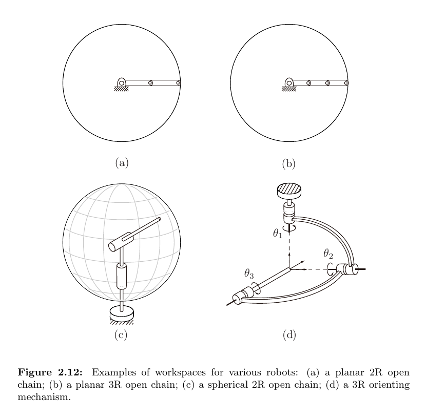

*Examples of workspaces for different mechanisms. Cropped from book Figure 2.12.*

Examples:

- For drawing on paper, only pen-tip position may matter, so $\mathcal X=\mathbb R^2$.
- For manipulating a free rigid object, the task usually needs a full six-DOF pose.
- A spray nozzle may need position and pointing direction but not rotation about its own axis, giving $\mathbb R^3\times S^2$.
- A 2R and a 3R planar arm can have the same position workspace while having different C-spaces.

The map $h$ is generally many-to-one: several robot configurations can produce the same task-space point. This is the geometric source of kinematic redundancy.

### 2.6 Common Confusions

#### "DOF is the number of joints"

Only for common open chains in which every joint variable is independent. Closed-chain constraints, multi-DOF joints, and redundant constraints break this shortcut.

#### "A two-dimensional space is a plane"

Dimension is local. A sphere and torus are also two-dimensional, but their global topology is different.

#### "A coordinate singularity is a physical singularity"

Not necessarily. Latitude-longitude coordinates fail at a pole even though the sphere is smooth there. The problem may be the representation rather than the robot.

#### "Every velocity constraint removes a DOF"

Only integrable velocity constraints correspond to lower-dimensional configuration constraints. Nonholonomic constraints restrict instantaneous motion without necessarily reducing the reachable C-space dimension.

#### "Task space and workspace are synonyms"

Task space is the space of desired task variables. Workspace is the subset of selected output values that the robot can actually reach.

### 2.7 Formula Sheet

| Concept | Formula |
|:--|:--|
| Configuration | $q\in\mathcal C$ |
| DOF | $\operatorname{dof}=\dim\mathcal C$ |
| Variable-constraint count | $\operatorname{dof}=n-k$ for $k$ independent constraints |
| Joint freedom/constraint relation | $f_i+c_i=m$ |
| Grubler mobility | $\operatorname{dof}=m(N-1-J)+\sum_i f_i$ |
| Holonomic constraint | $g(q)=0$ |
| Differentiated holonomic constraint | $J_g(q)\dot q=0$ |
| Pfaffian velocity constraint | $A(q)\dot q=0$ |
| Forward task map | $h:\mathcal C\to\mathcal X$ |
| Workspace | $\mathcal W=h(\mathcal C)$ |

### 2.8 Understanding Checklist

After this chapter, you should be able to:

- identify a robot configuration and distinguish it from an end-effector output;
- calculate generic mechanism mobility using Grubler's formula and state its independence assumption;
- infer basic C-space topologies from prismatic and revolute joints;
- explain why minimal global coordinates may have singularities;
- distinguish holonomic constraints from nonholonomic velocity constraints;
- distinguish C-space, task space, and workspace.

The next chapter builds on this foundation by representing rigid-body position and orientation and by describing motions on those spaces.

---

## Chapter 3: Rigid-Body Motions

Chapter 2 established that a spatial rigid body has six DOF but that its configuration space is not Euclidean. This chapter develops representations that respect that geometry:

- $R\in SO(3)$ represents orientation;
- $T\in SE(3)$ represents position and orientation;
- angular velocities and twists represent tangent velocities;
- matrix exponentials integrate constant velocities into finite motions;
- matrix logarithms recover exponential coordinates from finite motions;
- wrenches combine moments and forces.

### 3.1 Frames and the Planar Preview

#### A geometric object is not its coordinate vector

A physical point or free vector exists independently of any coordinate system. Its numerical representation changes when the reference frame changes.

For example, $p_a$ and $p_b$ can be different coordinate vectors for the same physical point $p$:

$$
p_a=R_{ab}p_b+p_{ab}.
$$

The subscripts encode the direction of the coordinate transformation:

- $R_{ab}$ is the orientation of frame $\{b\}$ expressed in frame $\{a\}$;
- $p_{ab}$ is the origin of $\{b\}$ expressed in $\{a\}$;
- therefore $(R_{ab},p_{ab})$ converts coordinates from $\{b\}$ to $\{a\}$.

#### Planar rigid motion

For a planar body, the body-frame orientation and origin can be written

$$
P=
\begin{bmatrix}
\cos\theta&-\sin\theta\\
\sin\theta&\cos\theta
\end{bmatrix},
\qquad
p=
\begin{bmatrix}
p_x\\p_y
\end{bmatrix}.
$$

If frame $\{c\}$ is described by $(Q,q)$ relative to $\{b\}$ and $\{b\}$ is described by $(P,p)$ relative to $\{s\}$, then

$$
R_{sc}=PQ,
\qquad
p_{sc}=Pq+p.
$$

This planar calculation previews homogeneous transformations: rotate the relative displacement into the parent frame, then add the parent-frame translation.

### 3.2 Rotations and Angular Velocities

#### Rotation matrices and $SO(3)$

The columns of a rotation matrix are the unit axes of the rotated frame expressed in the reference frame:

$$
R_{sb}=
\begin{bmatrix}
\hat x_b&\hat y_b&\hat z_b
\end{bmatrix}_{s}.
$$

Because these axes form a right-handed orthonormal frame,

$$
\boxed{
SO(3)=\left\{R\in\mathbb R^{3\times3}
\mid R^TR=I,\ \det R=1\right\}.
}
$$

The orthogonality constraint gives

$$
R^{-1}=R^T.
$$

The determinant condition excludes reflections. A matrix satisfying $R^TR=I$ but $\det R=-1$ is orthogonal, but it is not a proper rotation.

Rotation matrices form a group under multiplication: they are closed, multiplication is associative, the identity exists, and every rotation has an inverse. In 3D, multiplication is generally not commutative:

$$
R_1R_2\neq R_2R_1.
$$

#### Three meanings of a rotation matrix

The same matrix can be interpreted in three ways, depending on context:

| Use | Interpretation |
|:--|:--|
| Orientation | $R_{ab}$ describes frame $\{b\}$ relative to $\{a\}$ |
| Change of coordinates | $p_a=R_{ab}p_b$ represents the same vector in $\{a\}$ |
| Rotation operator | $p'=Rp$ physically rotates a vector while keeping its coordinate frame fixed |

The algebra can look identical, so the frame labels and the physical question must determine the interpretation.

#### Composition and subscript cancellation

For three frames,

$$
R_{ac}=R_{ab}R_{bc},
\qquad
R_{ba}=R_{ab}^{-1}=R_{ab}^T.
$$

The adjacent $b$ subscripts cancel. This is a reliable dimensional-analysis rule for frame calculations.

#### Fixed-frame versus body-frame rotation

Let $R_{sb}$ describe the current body orientation and let $R=\operatorname{Rot}(\hat\omega,\theta)$ be an additional rotation.

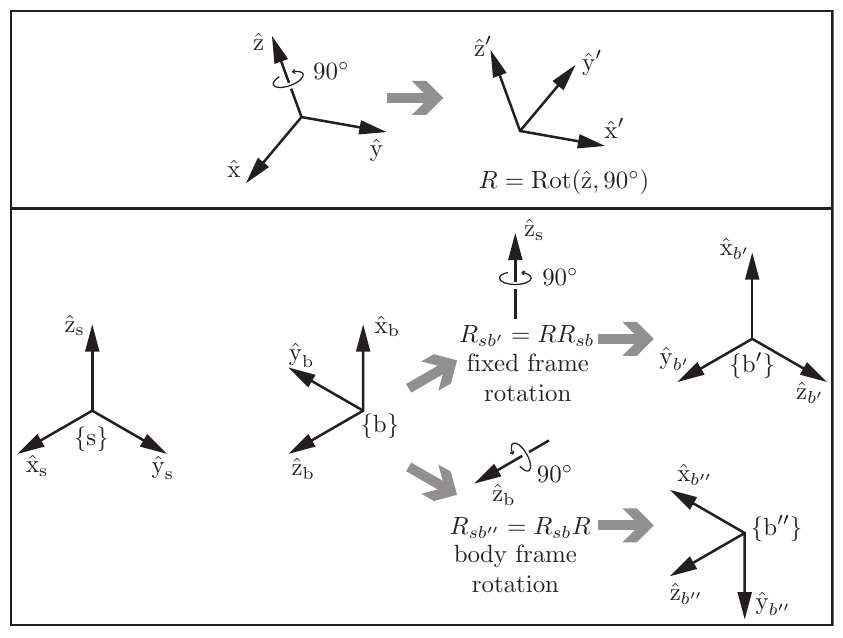

*Fixed-frame and body-frame rotations. Cropped from book Figure 3.9.*

Then

$$
\boxed{
R_{sb'}=RR_{sb}
\quad\text{means that }\hat\omega\text{ is expressed in }\{s\},
}
$$

whereas

$$
\boxed{
R_{sb''}=R_{sb}R
\quad\text{means that }\hat\omega\text{ is expressed in }\{b\}.
}
$$

Memory rule: **premultiply for a space-frame operation; postmultiply for a body-frame operation.**

#### Skew-symmetric matrix representation

For $x=(x_1,x_2,x_3)^T$, define

$$
[x]=
\begin{bmatrix}
0&-x_3&x_2\\
x_3&0&-x_1\\
-x_2&x_1&0
\end{bmatrix}
\in so(3).
$$

It converts a cross product into matrix multiplication:

$$
[x]y=x\times y.
$$

Useful identities are

$$
[x]^T=-[x],
\qquad
[x]y=-[y]x,
\qquad
R[x]R^T=[Rx].
$$

Here $SO(3)$ is the nonlinear group of finite rotations, while $so(3)$ is the vector space of skew-symmetric matrices representing infinitesimal rotations.

#### Angular velocity in space and body coordinates

Let $R(t)=R_{sb}(t)$. The same physical angular velocity can be represented in the space frame or body frame:

$$
\omega_s=R_{sb}\omega_b.
$$

Its matrix forms are obtained from $R$ and $\dot R$:

$$
\boxed{
[\omega_s]=\dot R R^{-1}=\dot R R^T,
\qquad
[\omega_b]=R^{-1}\dot R=R^T\dot R.
}
$$

The multiplication order determines the frame. Equivalently,

$$
\dot R=[\omega_s]R=R[\omega_b].
$$

#### Exponential coordinates for rotation

An axis-angle pair consists of a unit axis $\hat\omega$ and angle $\theta$. Its three exponential coordinates are $\hat\omega\theta$.

Integrating the constant angular velocity $\hat\omega$ for time $\theta$ gives

$$
R=e^{[\hat\omega]\theta}.
$$

Rodrigues' formula evaluates this exponential without an infinite series:

$$
\boxed{
e^{[\hat\omega]\theta}
=I+\sin\theta[\hat\omega]
+(1-\cos\theta)[\hat\omega]^2.
}
$$

The exponential map connects the tangent-space representation to a finite rotation:

$$
\exp:so(3)\rightarrow SO(3).
$$

#### Rotation matrix logarithm

The inverse problem is to find $[\hat\omega]\theta=\log R$. For the generic case $0<\theta<\pi$,

$$
\theta=\cos^{-1}\left(\frac{\operatorname{tr}R-1}{2}\right),
$$

$$
[\hat\omega]
=\frac{R-R^T}{2\sin\theta}.
$$

Two singular cases need separate handling:

- $R=I$: $\theta=0$, and the axis is arbitrary because no rotation occurred.
- $\operatorname{tr}R=-1$: $\theta=\pi$, and the axis must be recovered from $R+I$ or equivalent component formulas.

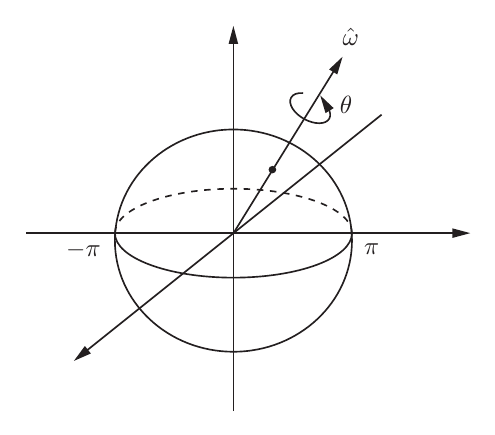

*Exponential-coordinate view of $SO(3)$. Cropped from book Figure 3.13.*

Restricting $\theta\in[0,\pi]$ represents $SO(3)$ as a solid ball of radius $\pi$. Antipodal points on the boundary describe the same $180^\circ$ rotation, which is why the logarithm is not unique there.

### 3.3 Rigid-Body Motions and Twists

#### Homogeneous transformations and $SE(3)$

A spatial rigid-body configuration combines orientation and position:

$$
\boxed{
T=
\begin{bmatrix}
R&p\\
0&1
\end{bmatrix}
\in SE(3),
\qquad
R\in SO(3),\ p\in\mathbb R^3.
}
$$

The inverse is

$$
T^{-1}=
\begin{bmatrix}
R^T&-R^Tp\\
0&1
\end{bmatrix}.
$$

The term $-R^Tp$ is important: reversing a pose requires both reversing the rotation and re-expressing the reversed translation.

#### Homogeneous point coordinates

Appending a $1$ to a point lets rotation and translation be written as one multiplication:

$$
\begin{bmatrix}
x'\\1
\end{bmatrix}
=
\begin{bmatrix}
R&p\\0&1
\end{bmatrix}
\begin{bmatrix}
x\\1
\end{bmatrix}
=
\begin{bmatrix}
Rx+p\\1
\end{bmatrix}.
$$

A free direction vector uses a final coordinate of $0$, so translation does not affect it:

$$
T
\begin{bmatrix}
v\\0
\end{bmatrix}
=
\begin{bmatrix}
Rv\\0
\end{bmatrix}.
$$

#### Frame composition

Transformation matrices obey the same subscript rule as rotations:

$$
T_{ac}=T_{ab}T_{bc},
\qquad
T_{ba}=T_{ab}^{-1},
$$

and for a point,

$$
p_a=T_{ab}p_b.
$$

If $T=(R,p)$ is applied to a current pose $T_{sb}$, then

$$
T_{sb'}=TT_{sb}
$$

interprets $(R,p)$ in the space frame, whereas

$$
T_{sb''}=T_{sb}T
$$

interprets it in the body frame. As with rotations, the order changes the physical motion.

#### Twists

A **twist** combines angular and linear velocity:

$$
V=
\begin{bmatrix}
\omega\\v
\end{bmatrix}
\in\mathbb R^6,
\qquad
[V]=
\begin{bmatrix}
[\omega]&v\\
0&0
\end{bmatrix}
\in se(3).
$$

For $T(t)=T_{sb}(t)$, the body and space twists are

$$
\boxed{
[V_b]=T^{-1}\dot T,
\qquad
[V_s]=\dot T T^{-1}.
}
$$

Their linear components have different geometric meanings:

- $v_b=R^T\dot p$ is the velocity of the body-frame origin, expressed in $\{b\}$;
- $v_s=\dot p-\omega_s\times p$ is the velocity of the point on the extended rigid body currently located at the space-frame origin, expressed in $\{s\}$.

Therefore, in general,

$$
v_s\neq\dot p.
$$

This is one of the most important notation traps in the chapter.

#### Adjoint transformation

For $T=(R,p)$, define

$$
\boxed{
[\operatorname{Ad}_T]
=
\begin{bmatrix}
R&0\\
{}[p]R&R
\end{bmatrix}.
}
$$

It changes the coordinate frame of a twist or screw axis:

$$
V_s=[\operatorname{Ad}_{T_{sb}}]V_b,
\qquad
V_b=[\operatorname{Ad}_{T_{bs}}]V_s.
$$

More generally,

$$
V_a=[\operatorname{Ad}_{T_{ab}}]V_b.
$$

The adjoint respects transformation composition:

$$
[\operatorname{Ad}_{T_1}]
[\operatorname{Ad}_{T_2}]
=[\operatorname{Ad}_{T_1T_2}],
\qquad
[\operatorname{Ad}_T]^{-1}
=[\operatorname{Ad}_{T^{-1}}].
$$

#### Screw interpretation of a twist

A screw axis is described geometrically by:

- a point $q$ on the axis;
- a unit direction $\hat s$;
- a pitch $h$, equal to linear speed along the axis divided by angular speed.

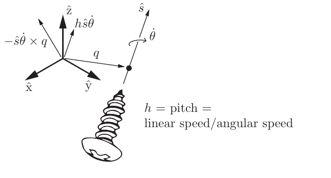

*Geometry of a screw axis. Cropped from book Figure 3.19.*

For finite pitch, the normalized screw axis is

$$
\boxed{
S=
\begin{bmatrix}
\omega\\v
\end{bmatrix}
=
\begin{bmatrix}
\hat s\\
-\hat s\times q+h\hat s
\end{bmatrix},
\qquad \|\omega\|=1.
}
$$

The corresponding twist is

$$
V=S\dot\theta.
$$

Important special cases are:

| Motion | Screw-axis parameters |
|:--|:--|
| Pure rotation about the axis | $h=0$, $v=-\omega\times q$ |
| Rotation plus translation along the axis | finite $h$ |
| Pure translation | $\omega=0$, $\|v\|=1$, conventionally $h=\infty$ |

For a pure translation, $\dot\theta$ is a linear speed rather than an angular speed.

#### Exponential coordinates of rigid motion

The Chasles-Mozzi theorem states that every rigid-body displacement can be produced by motion along one fixed screw axis. Thus any $T\in SE(3)$ can be written

$$
T=e^{[S]\theta}.
$$

The six-vector $S\theta$ is the exponential-coordinate representation of the displacement.

For $S=(\omega,v)$ with $\|\omega\|=1$,

$$
e^{[S]\theta}
=
\begin{bmatrix}
e^{[\omega]\theta}&G(\theta)v\\
0&1
\end{bmatrix},
$$

where

$$
G(\theta)
=I\theta
+(1-\cos\theta)[\omega]
+(\theta-\sin\theta)[\omega]^2.
$$

For pure translation,

$$
e^{[S]\theta}
=
\begin{bmatrix}
I&v\theta\\
0&1
\end{bmatrix}.
$$

#### Matrix logarithm of a rigid motion

Given $T=(R,p)$:

1. If $R=I$ and $p\neq0$, the motion is a pure translation. Set $\omega=0$, $\theta=\|p\|$, and $v=p/\|p\|$. If $R=I$ and $p=0$, then $T=I$, $\theta=0$, and the screw axis is undefined.
2. Otherwise, compute $[\omega]\theta=\log R$, then solve

$$
v=G^{-1}(\theta)p,
$$

with

$$
G^{-1}(\theta)
=\frac{1}{\theta}I
-\frac{1}{2}[\omega]
+\left(
\frac{1}{\theta}
-\frac{1}{2}\cot\frac{\theta}{2}
\right)[\omega]^2.
$$

The result $[S]\theta=\log T$ is the constant twist matrix whose unit-time integration reaches $T$ from the identity.

### 3.4 Wrenches

A force $f$ applied at point $r$ creates the moment

$$
m=r\times f.
$$

A **wrench** combines moment and force:

$$
F=
\begin{bmatrix}
m\\f
\end{bmatrix}
\in\mathbb R^6.
$$

The instantaneous mechanical power associated with a twist-wrench pair is

$$
P=V^TF=\begin{bmatrix}
\omega \\v
\end{bmatrix}^T\begin{bmatrix}
m\\f
\end{bmatrix}=\omega^Tm+v^Tf.
$$

Power is independent of the coordinate frame. Since

$$
V_a=[\operatorname{Ad}_{T_{ab}}]V_b,
$$

power invariance requires the dual transformation

$$
\boxed{
F_b=[\operatorname{Ad}_{T_{ab}}]^TF_a,
\qquad
F_a=[\operatorname{Ad}_{T_{ba}}]^TF_b.
}
$$

Twists transform with the adjoint; wrenches transform with the transpose associated with the inverse direction. This pairing guarantees $V_a^TF_a=V_b^TF_b$.

### 3.5 $SO(3)$ and $SE(3)$ in Parallel

| Rotation concept | Rigid-motion counterpart |
|:--|:--|
| $R\in SO(3)$ | $T\in SE(3)$ |
| $[\omega]\in so(3)$ | $[V]\in se(3)$ |
| Rotation axis $\hat\omega$ | Screw axis $S$ |
| Angular velocity $\omega=\hat\omega\dot\theta$ | Twist $V=S\dot\theta$ |
| $[\omega_s]=\dot RR^{-1}$ | $[V_s]=\dot TT^{-1}$ |
| $[\omega_b]=R^{-1}\dot R$ | $[V_b]=T^{-1}\dot T$ |
| $R=e^{[\hat\omega]\theta}$ | $T=e^{[S]\theta}$ |
| $[\hat\omega]\theta=\log R$ | $[S]\theta=\log T$ |
| Coordinate change $\omega_a=R_{ab}\omega_b$ | Coordinate change $V_a=[\operatorname{Ad}_{T_{ab}}]V_b$ |

This parallel is the chapter's main organizing idea. Learn one column and the other becomes easier to derive.

### 3.6 Common Confusions

#### "$R_{ab}$ rotates frame $\{a\}$ into frame $\{b\}$"

This wording is ambiguous. A safer definition is: $R_{ab}$ contains the axes of $\{b\}$ expressed in $\{a\}$ and converts $b$-coordinates to $a$-coordinates.

#### "Changing coordinates physically moves the vector"

No. $p_a=R_{ab}p_b$ gives two numerical descriptions of the same geometric vector. By contrast, $p'=Rp$ can describe a physical rotation when both vectors use the same coordinate frame.

#### "Pre- and postmultiplication are interchangeable"

They are not, because 3D rotations and rigid transformations generally do not commute. Premultiplication applies an operation expressed in the space frame; postmultiplication applies one expressed in the body frame.

#### "$SO(3)$ and $so(3)$ are the same space"

$SO(3)$ contains finite rotation matrices and is not a vector space. $so(3)$ contains skew-symmetric tangent matrices and is a vector space. The exponential and logarithm connect them locally.

#### "The space-twist linear component is the body-origin velocity"

The body-origin velocity in space coordinates is $\dot p$. The space-twist component is $v_s=\dot p-\omega_s\times p$. The body-twist component $v_b=R^T\dot p$ is the body-origin velocity expressed in body coordinates.

#### "A twist and a screw axis are identical"

They use the same six-vector structure, but a screw axis is normalized. A general twist includes the motion rate: $V=S\dot\theta$.

#### "Twists and wrenches transform in the same way"

They are dual quantities. Twists use the adjoint; wrenches use the corresponding transpose in the opposite frame direction so that power remains invariant.

### 3.7 Formula Sheet

| Concept | Formula |
|:--|:--|
| Rotation group | $SO(3)=\{R\mid R^TR=I,\det R=1\}$ |
| Rotation inverse | $R^{-1}=R^T$ |
| Frame composition | $R_{ac}=R_{ab}R_{bc}$, $T_{ac}=T_{ab}T_{bc}$ |
| Cross-product matrix | $[x]y=x\times y$ |
| Space angular velocity | $[\omega_s]=\dot RR^{-1}$ |
| Body angular velocity | $[\omega_b]=R^{-1}\dot R$ |
| Rodrigues formula | $e^{[\hat\omega]\theta}=I+\sin\theta[\hat\omega]+(1-\cos\theta)[\hat\omega]^2$ |
| Homogeneous transform | $T=\begin{bmatrix}R&p\\0&1\end{bmatrix}$ |
| Transform inverse | $T^{-1}=\begin{bmatrix}R^T&-R^Tp\\0&1\end{bmatrix}$ |
| Twist matrix | $[V]=\begin{bmatrix}[\omega]&v\\0&0\end{bmatrix}$ |
| Space/body twists | $[V_s]=\dot TT^{-1}$, $[V_b]=T^{-1}\dot T$ |
| Adjoint | $[\operatorname{Ad}_T]=\begin{bmatrix}R&0\\{}[p]R&R\end{bmatrix}$ |
| Twist frame change | $V_a=[\operatorname{Ad}_{T_{ab}}]V_b$ |
| Screw axis | $S=(\hat s,-\hat s\times q+h\hat s)$ |
| Rigid-motion exponential | $T=e^{[S]\theta}$ |
| Wrench | $F=(m,f)$, with $m=r\times f$ |
| Power | $P=V^TF$ |
| Wrench frame change | $F_b=[\operatorname{Ad}_{T_{ab}}]^TF_a$ |

### 3.8 Software Map

The book's software mirrors the mathematical conversions:

| Operation | Modern Robotics function |
|:--|:--|
| $\omega\leftrightarrow[\omega]$ | `VecToso3`, `so3ToVec` |
| $[\omega]\theta\leftrightarrow R$ | `MatrixExp3`, `MatrixLog3` |
| $(R,p)\leftrightarrow T$ | `RpToTrans`, `TransToRp` |
| $T^{-1}$ | `TransInv` |
| $V\leftrightarrow[V]$ | `VecTose3`, `se3ToVec` |
| $[\operatorname{Ad}_T]$ | `Adjoint` |
| $(q,\hat s,h)\rightarrow S$ | `ScrewToAxis` |
| $[S]\theta\leftrightarrow T$ | `MatrixExp6`, `MatrixLog6` |

The suffix `3` refers to rotations in $SO(3)$; the suffix `6` refers to rigid motions represented by six-dimensional twists.

### 3.9 Understanding Checklist

After this chapter, you should be able to:

- read $R_{ab}$ and $T_{ab}$ unambiguously and compose frame chains by subscript cancellation;
- verify whether a matrix belongs to $SO(3)$ or $SE(3)$;
- distinguish representation, coordinate change, and physical displacement;
- explain why premultiplication uses a space-frame operation and postmultiplication uses a body-frame operation;
- convert between vectors and their $so(3)$ or $se(3)$ matrix forms;
- derive space and body angular velocities or twists from $R(t)$ or $T(t)$;
- use exponential coordinates to move between axis-angle or screw motion and finite transformations;
- transform twists with the adjoint and wrenches with its dual transpose;
- explain the power pairing $V^TF$.

Chapter 4 uses these representations to express robot forward kinematics as products of matrix exponentials.

---

## Chapter 4: Forward Kinematics

Forward kinematics computes the end-effector pose from known joint positions. The chapter's central result is that an open chain can be modeled by a home pose and one constant screw axis per joint.

### 4.1 Forward Kinematics as a Map

For an $n$-joint open chain, collect the joint variables into

$$
\theta=(\theta_1,\ldots,\theta_n).
$$

Forward kinematics is the map

$$
F:\mathcal C\rightarrow SE(3),
\qquad
\theta\mapsto T_{sb}(\theta),
$$

where $T_{sb}$ is the configuration of the end-effector frame $\{b\}$ expressed in the fixed space frame $\{s\}$.

For an open chain, each valid $\theta$ determines one end-effector pose. The reverse need not be unique: several joint configurations may produce the same $T_{sb}$.

#### Position-only and pose tasks

The output space depends on what the task needs:

| Required output | Typical task space |
|:--|:--|
| Planar end-point position | $\mathbb R^2$ |
| Planar position and orientation | $SE(2)$ |
| Spatial end-point position | $\mathbb R^3$ |
| Spatial position and orientation | $SE(3)$ |

The robot configuration still contains all joint variables even when the task uses only end-effector position.

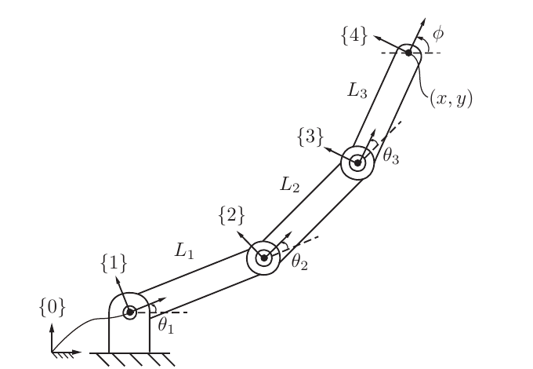

*A planar 3R chain with link lengths $L_1,L_2,L_3$. Cropped from book Figure 4.1.*

For the planar 3R chain,

$$
\begin{aligned}
x &= L_1\cos\theta_1
   +L_2\cos(\theta_1+\theta_2)
   +L_3\cos(\theta_1+\theta_2+\theta_3),\\
y &= L_1\sin\theta_1
   +L_2\sin(\theta_1+\theta_2)
   +L_3\sin(\theta_1+\theta_2+\theta_3),\\
\phi&=\theta_1+\theta_2+\theta_3.
\end{aligned}
$$

These trigonometric equations are manageable for a planar arm but become cumbersome for general spatial mechanisms. The product of exponentials gives a uniform construction instead.

### 4.2 Home Configuration and Joint Screw Axes

The PoE representation separates fixed robot geometry from changing joint values.

#### Home configuration

Choose a zero value for every joint and define

$$
\boxed{M=T_{sb}(0)}.
$$

$M\in SE(3)$ is the end-effector pose when $\theta=0$. The zero configuration is a modeling choice; it need not be the robot's physical power-on pose.

#### Joint screw axis

For each one-DOF joint, determine its positive motion at the home configuration and express it as

$$
S_i=
\begin{bmatrix}
\omega_i\\v_i
\end{bmatrix}
\in\mathbb R^6
$$

in the space frame $\{s\}$.

For a **revolute joint**, choose:

* a unit vector $\omega_i$ along the positive rotation axis;
* any point $q_i$ on that axis, expressed in $\{s\}$.

Then

$$
\boxed{
S_i=
\begin{bmatrix}
\omega_i\\-\omega_i\times q_i
\end{bmatrix}
}.
$$

For a **prismatic joint**, if $v_i$ is a unit vector in the positive translation direction,

$$
\boxed{
S_i=
\begin{bmatrix}
0\\v_i
\end{bmatrix}
}.
$$

Its matrix representation is

$$
[S_i]=
\begin{bmatrix}
[\omega_i]&v_i\\
0&0
\end{bmatrix}
\in se(3).
$$

The rigid displacement produced by joint $i$ is $e^{[S_i]\theta_i}$. For a revolute joint, $\theta_i$ is an angle in radians; for a prismatic joint, it is a distance.

### 4.3 Space-Form Product of Exponentials

Suppose initially that only the most distal joint moves. Its motion left-multiplies the home pose:

$$
T_{sb}=e^{[S_n]\theta_n}M.
$$

Allowing the next joint toward the base to move gives

$$
T_{sb}=e^{[S_{n-1}]\theta_{n-1}}e^{[S_n]\theta_n}M.
$$

Continuing to the base yields the **space-form PoE formula**:

$$
\boxed{
T_{sb}(\theta)
=e^{[S_1]\theta_1}
 e^{[S_2]\theta_2}
 \cdots
 e^{[S_n]\theta_n}M
}.
$$

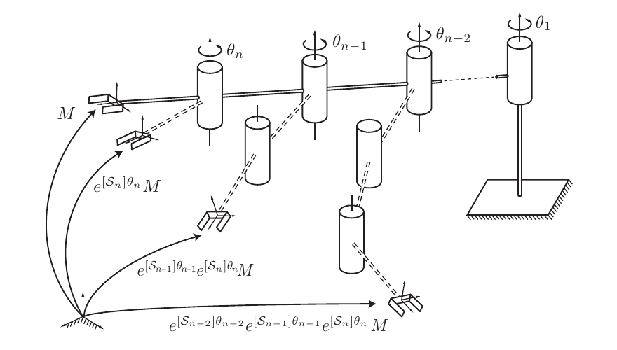

*Each joint exponential moves all links outward from that joint. Cropped from book Figure 4.2.*

#### Required model data

The space-form model needs only:

1. the home pose $M$;
2. the home-configuration screw axes $S_1,\ldots,S_n$ expressed in $\{s\}$;
3. the joint values $\theta_1,\ldots,\theta_n$.

No intermediate link frames are required.

#### Evaluation order

Because rigid transformations do not generally commute, the factors must stay in joint order. One implementation is

```text
T = identity
for i = 1, ..., n:
    T = T * exp([S_i] * theta_i)
T = T * M
```

Although every $S_i$ is measured only once at the home configuration, the product correctly accounts for upstream joints moving downstream axes. The matrix composition performs that coordinate update implicitly.

### 4.4 Worked Example: Planar 3R Chain

At $\theta=0$, the arm in Figure 4.1 lies along the positive $x$-axis, so

$$
M=
\begin{bmatrix}
1&0&0&L_1+L_2+L_3\\
0&1&0&0\\
0&0&1&0\\
0&0&0&1
\end{bmatrix}.
$$

All three revolute axes point along $+z$. Points on the axes are

$$
q_1=(0,0,0),\qquad
q_2=(L_1,0,0),\qquad
q_3=(L_1+L_2,0,0).
$$

Using $v_i=-\omega_i\times q_i$ gives

$$
S_1=
\begin{bmatrix}
0\\0\\1\\0\\0\\0
\end{bmatrix},\qquad
S_2=
\begin{bmatrix}
0\\0\\1\\0\\-L_1\\0
\end{bmatrix},\qquad
S_3=
\begin{bmatrix}
0\\0\\1\\0\\-(L_1+L_2)\\0
\end{bmatrix}.
$$

Therefore,

$$
\boxed{
T_{s4}(\theta)
=e^{[S_1]\theta_1}
 e^{[S_2]\theta_2}
 e^{[S_3]\theta_3}M
}.
$$

Two quick checks catch many modeling errors:

* Setting $\theta=0$ must return $T_{s4}=M$.
* The final orientation must be a rotation by $\theta_1+\theta_2+\theta_3$.

Expanding the translation part produces the $x$ and $y$ equations in Section 4.1. The PoE and trigonometric models describe the same geometry.

### 4.5 Body-Form Product of Exponentials

The same home joint axes can instead be expressed in the home end-effector frame $\{b\}$. Define

$$
\boxed{
B_i=\operatorname{Ad}_{M^{-1}}S_i
}
$$

or equivalently

$$
[B_i]=M^{-1}[S_i]M.
$$

Using the conjugation identity

$$
M e^{[B_i]\theta_i}
=e^{[S_i]\theta_i}M,
$$

the space formula becomes the **body-form PoE formula**:

$$
\boxed{
T_{sb}(\theta)
=M e^{[B_1]\theta_1}
 e^{[B_2]\theta_2}
 \cdots
 e^{[B_n]\theta_n}
}.
$$

For the planar 3R arm, let $L=L_1+L_2+L_3$. The body screw axes are

$$
\begin{aligned}
B_1&=(0,0,1,\;0,L,0)^T,\\
B_2&=(0,0,1,\;0,L_2+L_3,0)^T,\\
B_3&=(0,0,1,\;0,L_3,0)^T.
\end{aligned}
$$

These are not new physical joints. They are the same home axes represented in different coordinates.

### 4.6 Space and Body Forms Compared

| Property | Space form | Body form |
|:--|:--|:--|
| Formula | $e^{[S_1]\theta_1}\cdots e^{[S_n]\theta_n}M$ | $M e^{[B_1]\theta_1}\cdots e^{[B_n]\theta_n}$ |
| Axis coordinates | Fixed space frame at home | End-effector frame at home |
| Conversion | $S_i=\operatorname{Ad}_M B_i$ | $B_i=\operatorname{Ad}_{M^{-1}}S_i$ |
| Natural multiplication | Exponentials before $M$ | Exponentials after $M$ |
| Output | Same $T_{sb}(\theta)$ | Same $T_{sb}(\theta)$ |

The labels **space** and **body** describe how the constant home screw axes are represented. They do not mean that one formula gives a space twist and the other gives a body twist; both return the same finite end-effector pose.

#### PoE versus Denavit-Hartenberg

| Representation | Main idea | Tradeoff |
|:--|:--|:--|
| PoE | Home pose plus joint screws | Geometric and uniform for revolute/prismatic joints; not parameter-minimal |
| D-H | Special frame on each link and four parameters per adjacent-frame transform | Uses a minimal structural parameterization but frame assignment is restrictive |

For an $n$-joint spatial chain, the book counts $6n$ screw-axis numbers for PoE versus $3n$ structural D-H parameters, excluding the $n$ changing joint values. The six components of each screw are constrained, so this count does not imply six independent parameters per one-DOF joint.

### 4.7 Universal Robot Description Format

URDF is an XML format used by ROS and other robotics software to describe a robot as a tree of links connected by joints.

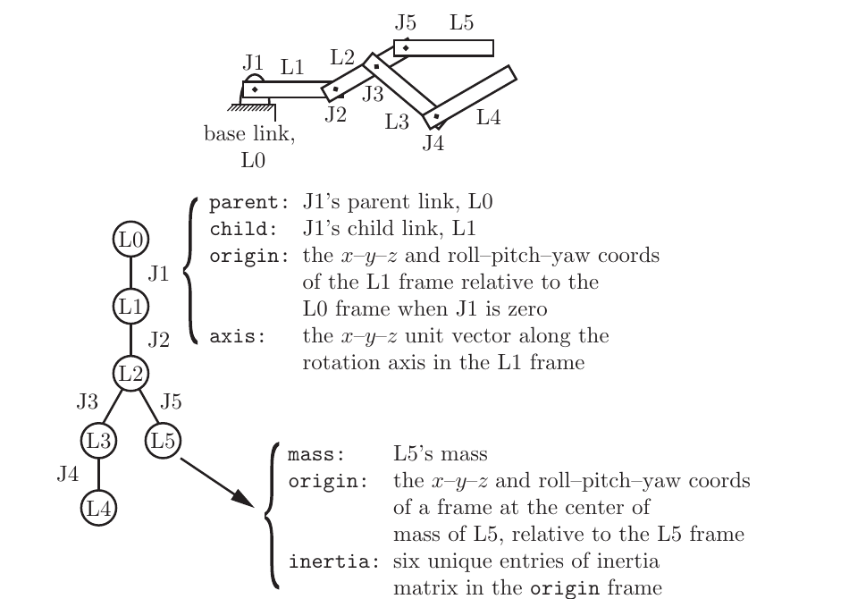

*Links are tree nodes and joints are edges. Cropped from book Figure 4.10.*

#### Joint information

A joint specifies:

| Field | Meaning |
|:--|:--|
| `parent` / `child` | Links connected by the joint |
| `type` | Revolute, continuous, prismatic, fixed, and so on |
| `origin xyz` | Child joint-frame position relative to the parent at zero |
| `origin rpy` | Child joint-frame orientation relative to the parent at zero |
| `axis xyz` | Positive rotation or translation axis in the joint/child frame |

The chapter uses fixed-axis roll-pitch-yaw: roll about the fixed $x$-axis, then pitch about fixed $y$, then yaw about fixed $z$.

#### Link information

A link may specify:

* mass;
* center-of-mass frame;
* the six independent entries of its symmetric inertia matrix;
* visual and collision geometry.

Joint data determines kinematics. Link inertial data becomes necessary for dynamics.

#### Relationship to forward kinematics

URDF explicitly stores each parent-child zero transform and joint axis. Forward kinematics traverses the path from the base to a selected link and composes those transforms. The same description can be converted to PoE by computing:

1. the selected end-effector home pose $M$;
2. every joint axis expressed in one common space frame at home.

URDF supports tree mechanisms with branches, but a tree cannot directly represent a closed kinematic loop.

### 4.8 Common Confusions

#### "The screw axes must be recomputed after each joint moves"

Not in the PoE model. $S_i$ and $B_i$ are constant axes measured at the home configuration. The ordered matrix product accounts for the movement of downstream geometry.

#### "$S_i$ is the current axis in the world frame"

$S_i$ is the joint axis expressed in the space frame **at home**. After upstream joints move, the physical axis may have a different current space representation.

#### "$B_i$ is measured in the current end-effector frame"

$B_i$ is expressed in the end-effector frame **at home**. It is constant model data, not a value recomputed from the current pose.

#### "$M$ should be the identity"

Only if the chosen end-effector frame coincides with the space frame at home. Usually $M$ contains both a fixed translation and a fixed orientation.

#### "The exponential factors can be reordered"

Generally no:

$$
e^{[S_i]\theta_i}e^{[S_j]\theta_j}
\neq
e^{[S_j]\theta_j}e^{[S_i]\theta_i}.
$$

Joint order is part of the robot's kinematic structure.

#### "Forward kinematics has a unique inverse"

Forward kinematics is single-valued for an open chain, but it is not generally one-to-one. Different joint configurations can reach the same end-effector pose, and some desired poses are unreachable.

#### "URDF `origin` is the current joint pose"

The `origin` describes the fixed parent-child relationship at the joint's zero value. The joint motion is applied in addition to that zero transform.

### 4.9 Formula Sheet

| Concept | Formula |
|:--|:--|
| Forward-kinematics map | $F(\theta)=T_{sb}(\theta)\in SE(3)$ |
| Home pose | $M=T_{sb}(0)$ |
| Revolute space screw | $S=(\omega,-\omega\times q)$, $\|\omega\|=1$ |
| Prismatic space screw | $S=(0,v)$, $\|v\|=1$ |
| Screw matrix | $[S]=\begin{bmatrix}[\omega]&v\\0&0\end{bmatrix}$ |
| Joint displacement | $e^{[S_i]\theta_i}\in SE(3)$ |
| Space PoE | $T_{sb}=e^{[S_1]\theta_1}\cdots e^{[S_n]\theta_n}M$ |
| Body screw from space screw | $B_i=\operatorname{Ad}_{M^{-1}}S_i$ |
| Space screw from body screw | $S_i=\operatorname{Ad}_M B_i$ |
| Body PoE | $T_{sb}=M e^{[B_1]\theta_1}\cdots e^{[B_n]\theta_n}$ |

### 4.10 Software Map

| Operation | Modern Robotics function |
|:--|:--|
| Space-form forward kinematics | `FKinSpace(M, Slist, thetalist)` |
| Body-form forward kinematics | `FKinBody(M, Blist, thetalist)` |
| Screw vector to $se(3)$ matrix | `VecTose3` |
| Joint exponential | `MatrixExp6(VecTose3(S * theta))` |
| Adjoint coordinate conversion | `Adjoint` |

In the book's software convention, `Slist` and `Blist` are $6\times n$ matrices whose $i$th columns are the corresponding joint screw axes. The entries of `thetalist` must follow the same joint order.

### 4.11 Understanding Checklist

After this chapter, you should be able to:

* define forward kinematics as a map from joint space to an end-effector task space;
* identify the home pose $M$ from a robot's zero configuration;
* construct revolute and prismatic screw axes with the correct positive direction;
* write and evaluate the space-form PoE formula in the correct order;
* convert space screw axes to body screw axes with $\operatorname{Ad}_{M^{-1}}$;
* explain why the space and body formulas produce the same pose;
* derive the planar 3R model and check it against elementary trigonometry;
* distinguish PoE, D-H, and URDF representations;
* identify the kinematic and inertial information stored in a URDF tree.

Chapter 5 differentiates the PoE forward-kinematics map to obtain the manipulator Jacobian and relate joint velocities to end-effector twists.

---

## Chapter 5: Velocity Kinematics and Statics

Chapter 4 gave the forward-kinematics map $T_{sb}(\theta)$. Chapter 5 studies its derivative. The result is the **manipulator Jacobian**, which maps joint rates to an end-effector twist and, by duality, maps an end-effector wrench to joint torques.

The chapter has three main messages:

* velocity kinematics is local and configuration dependent;
* singularities are rank drops of the Jacobian, not failures of the pose representation;
* the transpose Jacobian is the static force-torque map.

### 5.1 Velocity Kinematics as a Differential Map

For an ordinary vector-valued forward map

$$
x=f(\theta),
\qquad
x\in\mathbb R^m,\quad \theta\in\mathbb R^n,
$$

the velocity relation is obtained by differentiating:

$$
\boxed{
\dot x
=J(\theta)\dot\theta,
\qquad
J(\theta)=\frac{\partial f}{\partial \theta}.
}
$$

Here, $J(\theta)\in\mathbb R^{m\times n}$ is configuration dependent. Its $i$ th column is the output velocity created by setting $\dot\theta_i=1$ and all other joint rates to zero.

For a planar 2R arm,

$$
\begin{aligned}
x_1&=L_1\cos\theta_1+L_2\cos(\theta_1+\theta_2),\\
x_2&=L_1\sin\theta_1+L_2\sin(\theta_1+\theta_2).
\end{aligned}
$$

Differentiating gives

$$
\begin{bmatrix}
\dot x_1\\
\dot x_2
\end{bmatrix}
=
\underbrace{
\begin{bmatrix}
-L_1\sin\theta_1-L_2\sin(\theta_1+\theta_2)
&
-L_2\sin(\theta_1+\theta_2)
\\
L_1\cos\theta_1+L_2\cos(\theta_1+\theta_2)
&
L_2\cos(\theta_1+\theta_2)
\end{bmatrix}
}_{J(\theta)}
\begin{bmatrix}
\dot\theta_1\\
\dot\theta_2
\end{bmatrix}.
$$

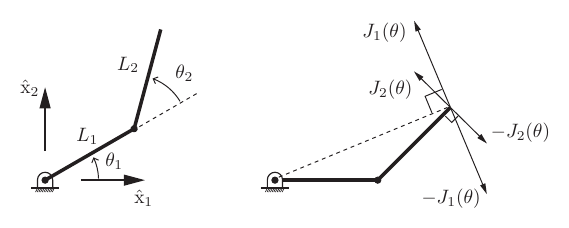

*The Jacobian columns are the tip velocities generated by unit joint rates. Cropped from book Figure 5.1.*

For the 2R arm,

$$
\det J(\theta)=L_1L_2\sin\theta_2.
$$

Thus the arm is singular when $\theta_2=0$ or $\theta_2=\pi$, because the two Jacobian columns become collinear and the tip cannot move instantaneously in every planar direction.

### 5.2 Manipulator Jacobian

For a spatial open chain, the end-effector output is a pose $T_{sb}(\theta)\in SE(3)$ rather than a vector in Euclidean space. Its velocity is therefore represented as a twist:

$$
[V_s]=\dot T_{sb}T_{sb}^{-1},
\qquad
[V_b]=T_{sb}^{-1}\dot T_{sb}.
$$

The **space Jacobian** and **body Jacobian** map the same joint-rate vector to the same physical end-effector motion, expressed in different frames:

$$
\boxed{
V_s=J_s(\theta)\dot\theta,
\qquad
V_b=J_b(\theta)\dot\theta.
}
$$

Both $J_s(\theta)$ and $J_b(\theta)$ are $6\times n$ matrices. The top three rows describe angular velocity and the bottom three rows describe the linear component of the twist:

$$
J(\theta)
=
\begin{bmatrix}
J_\omega(\theta)\\
J_v(\theta)
\end{bmatrix}.
$$

The geometric meaning of a Jacobian column is still simple: column $i$ is the screw axis of joint $i$ in the current configuration, expressed in the chosen frame.

### 5.3 Space Jacobian

Start from the space-form product of exponentials:

$$
T_{sb}(\theta)
=
e^{[S_1]\theta_1}
e^{[S_2]\theta_2}
\cdots
e^{[S_n]\theta_n}M.
$$

The space Jacobian is

$$
J_s(\theta)
=
\begin{bmatrix}
J_{s1}(\theta)&J_{s2}(\theta)&\cdots&J_{sn}(\theta)
\end{bmatrix},
$$

where

$$
\boxed{
J_{s1}(\theta)=S_1,
\qquad
J_{si}(\theta)
=
\operatorname{Ad}_{
e^{[S_1]\theta_1}
\cdots
e^{[S_{i-1}]\theta_{i-1}}
}
S_i
\quad (i=2,\ldots,n).
}
$$

Only the joints before $i$ appear in column $i$. Those upstream joints move the frame in which joint $i$'s current screw axis is expressed. Downstream joints do not affect the instantaneous twist created by joint $i$.

A direct computational pattern is:

```text
J_s[:, 1] = S_1
T = identity
for i = 2, ..., n:
    T = T * exp([S_{i-1}] * theta_{i-1})
    J_s[:, i] = Ad_T * S_i
```

### 5.4 Body Jacobian

Using the body-form product of exponentials,

$$
T_{sb}(\theta)
=
M
e^{[B_1]\theta_1}
e^{[B_2]\theta_2}
\cdots
e^{[B_n]\theta_n},
$$

the body Jacobian is

$$
J_b(\theta)
=
\begin{bmatrix}
J_{b1}(\theta)&J_{b2}(\theta)&\cdots&J_{bn}(\theta)
\end{bmatrix},
$$

where

$$
\boxed{
J_{bn}(\theta)=B_n,
\qquad
J_{bi}(\theta)
=
\operatorname{Ad}_{
e^{-[B_n]\theta_n}
\cdots
e^{-[B_{i+1}]\theta_{i+1}}
}
B_i
\quad (i=n-1,\ldots,1).
}
$$

Only the joints after $i$ appear in column $i$. This is the body-frame mirror of the space-Jacobian rule: downstream joints change how joint $i$'s screw is expressed in the current end-effector frame.

```text
J_b[:, n] = B_n
T = identity
for i = n-1, ..., 1:
    T = T * exp(-[B_{i+1}] * theta_{i+1})
    J_b[:, i] = Ad_T * B_i
```

### 5.5 Space and Body Jacobians Compared

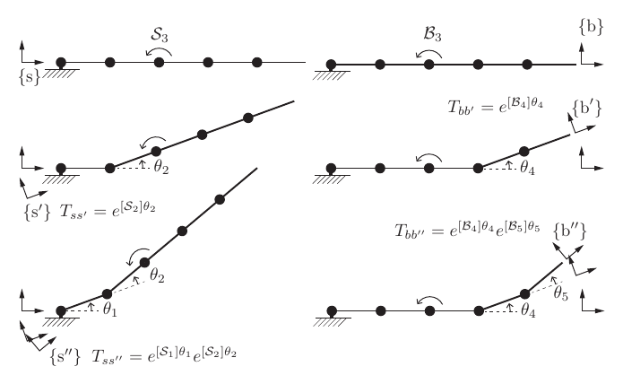

*For a space Jacobian column, move the home screw axis by upstream joints; for a body Jacobian column, express the screw through downstream joints. Cropped from book Figure 5.9.*

The two Jacobians are coordinate representations of the same end-effector twist. If $T_{sb}(\theta)$ is the current end-effector pose, then

$$
V_s=\operatorname{Ad}_{T_{sb}}V_b,
\qquad
V_b=\operatorname{Ad}_{T_{bs}}V_s.
$$

Therefore,

$$
\boxed{
J_s(\theta)=\operatorname{Ad}_{T_{sb}(\theta)}J_b(\theta),
\qquad
J_b(\theta)=\operatorname{Ad}_{T_{bs}(\theta)}J_s(\theta).
}
$$

Because an adjoint transformation is invertible, $J_s$ and $J_b$ always have the same rank. They identify the same singular configurations.

| Question | Space Jacobian | Body Jacobian |
|:--|:--|:--|
| Twist output | $V_s$ | $V_b$ |
| Output frame | Fixed space frame $\{s\}$ | Current end-effector frame $\{b\}$ |
| Column update uses | Upstream joints $1,\ldots,i-1$ | Downstream joints $i+1,\ldots,n$ |
| Constant model axes | $S_i$ at home | $B_i$ at home |
| Singularities | Same as $J_b$ | Same as $J_s$ |

### 5.6 Analytic Jacobians and Inverse Velocity Kinematics

The Jacobians above are **geometric Jacobians**: they map joint rates to twists. An **analytic Jacobian** instead maps joint rates to the derivative of a chosen coordinate representation:

$$
\dot q=J_a(\theta)\dot\theta.
$$

For example, suppose the pose is represented by

$$
q=(r,x),
$$

where $r$ is a three-parameter exponential-coordinate representation of orientation and $x$ is the end-effector origin position. If the body Jacobian is split as

$$
J_b=
\begin{bmatrix}
J_\omega\\
J_v
\end{bmatrix},
$$

then one coordinate-dependent analytic Jacobian has the form

$$
\boxed{
J_a(\theta)
=
\begin{bmatrix}
A^{-1}(r)&0\\
0&R_{sb}
\end{bmatrix}
J_b(\theta),
}
$$

where $A(r)$ is the map satisfying $\omega_b=A(r)\dot r$. The important point is not the particular formula, but the dependency: analytic Jacobians inherit singularities from both the robot and the chosen minimal orientation coordinates.

Inverse velocity kinematics asks for joint rates that produce a desired twist:

$$
V=J(\theta)\dot\theta.
$$

If $J$ is square and nonsingular,

$$
\dot\theta=J(\theta)^{-1}V.
$$

If the robot has fewer available joint directions than the task requires, not every desired twist can be produced. If the robot is redundant, there may be infinitely many joint-rate solutions, differing by motions in the null space of $J$.

### 5.7 Statics of Open Chains

The same Jacobian that maps velocities also maps forces by power balance. Let $F$ be the wrench applied at the end effector and $\tau$ be the joint torque vector. Static power consistency gives

$$
F^TV=\tau^T\dot\theta.
$$

Using $V=J(\theta)\dot\theta$,

$$
F^TJ(\theta)\dot\theta=\tau^T\dot\theta.
$$

Since this must hold for arbitrary admissible $\dot\theta$,

$$
\boxed{
\tau=J(\theta)^T F.
}
$$

With explicit frames,

$$
\boxed{
\tau=J_s(\theta)^TF_s
=J_b(\theta)^TF_b.
}
$$

The wrench and Jacobian must be expressed in the same frame. If a square Jacobian is nonsingular, the corresponding endpoint wrench generated by joint torques is

$$
F=J(\theta)^{-T}\tau.
$$

At singularities and in redundant systems, this inverse relationship needs more care because some endpoint wrench directions may require no joint torques, while some joint torques may create internal motion instead of a balanced endpoint wrench.

### 5.8 Singularity Analysis

A configuration is a **kinematic singularity** when the Jacobian rank is lower than its maximum possible rank:

$$
\boxed{
\operatorname{rank}J(\theta)
<
\max_{\theta'}\operatorname{rank}J(\theta').
}
$$

At such a configuration, the robot loses at least one instantaneous motion direction in the task space. The definition is local: the robot may still reach nearby poses by moving through a different path, but at that instant its velocity map has lost rank.

Singularity is invariant to frame choices. Changing from $J_b$ to $J_s$ only multiplies by an invertible adjoint matrix, and changing the fixed or end-effector frame also multiplies the Jacobian by an invertible transformation. None of these operations changes rank.

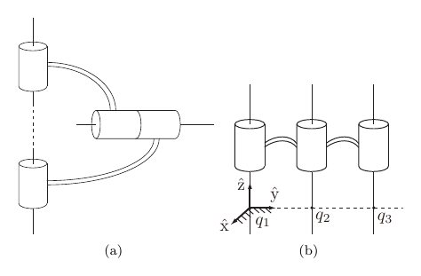

*Two common causes of rank loss: collinear revolute axes and three parallel coplanar revolute axes. Cropped from book Figure 5.11.*

The chapter lists several common singularity patterns for six-DOF spatial open chains:

* two revolute joint axes are collinear;
* three revolute joint axes are parallel and coplanar;
* four revolute joint axes intersect at a common point;
* four revolute joint axes are coplanar;
* six revolute joint axes intersect one common line.

The shared idea is linear dependence among Jacobian columns. Once one column can be written as a combination of others, the robot has fewer independent instantaneous twist directions.

### 5.9 Manipulability

Manipulability studies how easily joint motion produces task-space motion at a configuration. For

$$
\dot q=J(\theta)\dot\theta,
$$

consider all unit joint velocities:

$$
\dot\theta^T\dot\theta=1.
$$

If $J$ has full row rank, their task-space image is an ellipsoid:

$$
\boxed{
\dot q^T
\left(JJ^T\right)^{-1}
\dot q
=1.
}
$$

Let

$$
A=JJ^T.
$$

The eigenvectors of $A$ give the principal directions of the ellipsoid, and the semi-axis lengths are

$$
\sqrt{\lambda_1},\sqrt{\lambda_2},\ldots,\sqrt{\lambda_m},
$$

where $\lambda_i$ are the eigenvalues of $A$. Long axes are directions in which small joint velocities create large task velocities. Short axes are directions that are hard to move in.

For a six-dimensional geometric Jacobian, angular and linear velocity have different units, so it is common to analyze two separate ellipsoids:

$$
A_\omega=J_\omega J_\omega^T,
\qquad
A_v=J_vJ_v^T.
$$

When analyzing the linear velocity of the end-effector origin, the body Jacobian is often more natural, because its linear part corresponds directly to the origin of the end-effector frame.

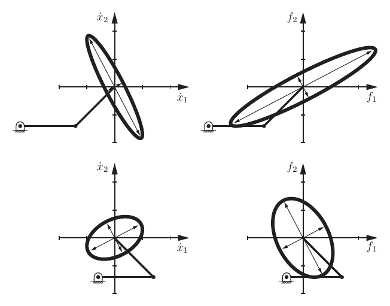

*Velocity manipulability and force ellipsoids for two configurations of a planar arm. Cropped from book Figure 5.6.*

The same geometry has a force dual. With

$$
\tau=J^TF
\quad\text{and}\quad
\tau^T\tau=1,
$$

the endpoint wrench ellipsoid satisfies

$$
\boxed{
F^TJJ^TF=1.
}
$$

Thus the force ellipsoid has the same principal directions as the manipulability ellipsoid, but reciprocal semi-axis lengths. A direction that is easy for velocity is hard for force, and a direction that is hard for velocity is easy for force.

Common scalar summaries are:

| Measure | Formula | Meaning |
|:--|:--|:--|
| Axis ratio | $\mu_1=\sqrt{\lambda_{\max}(A)/\lambda_{\min}(A)}$ | Near $1$ means isotropic; grows near singularity |
| Condition number | $\mu_2=\lambda_{\max}(A)/\lambda_{\min}(A)$ | Larger means more directionally uneven |
| Volume proxy | $\mu_3=\sqrt{\det A}$ | Zero at singularity; larger means larger velocity ellipsoid |

### 5.10 Common Confusions

#### "The Jacobian is just a constant derivative matrix"

Only for a linear map. Robot Jacobians usually change with $\theta$ because joint axes move relative to the chosen output frame.

#### "$S_i$ is the same thing as $J_{si}(\theta)$"

$S_i$ is the home screw axis. $J_{si}(\theta)$ is the current screw axis of joint $i$ expressed in the space frame after upstream joints have moved.

#### "$B_i$ is the same thing as $J_{bi}(\theta)$"

$B_i$ is the home body screw axis. $J_{bi}(\theta)$ is the current screw axis of joint $i$ expressed in the current body frame after downstream joints have moved.

#### "Space and body Jacobians have different singularities"

They do not. They are related by an invertible adjoint transformation, so their ranks are identical.

#### "The linear part of every twist is the end-effector origin velocity"

Not in every frame. From Chapter 3, the space-twist linear component is not generally $\dot p$. Be explicit about whether the twist is $V_s$ or $V_b$ and what point's velocity you need.

#### "A singularity is only a coordinate problem"

A kinematic singularity is a rank loss in the robot's velocity map. Minimal pose coordinates can introduce additional analytic-Jacobian singularities, but those are representation singularities, not necessarily robot singularities.

### 5.11 Formula Sheet

| Concept | Formula |
|:--|:--|
| Ordinary velocity map | $\dot x=J(\theta)\dot\theta$ |
| Space twist from pose | $[V_s]=\dot T T^{-1}$ |
| Body twist from pose | $[V_b]=T^{-1}\dot T$ |
| Space Jacobian | $V_s=J_s(\theta)\dot\theta$ |
| Body Jacobian | $V_b=J_b(\theta)\dot\theta$ |
| Space column | $J_{s1}=S_1,\quad J_{si}=\operatorname{Ad}_{e^{[S_1]\theta_1}\cdots e^{[S_{i-1}]\theta_{i-1}}}S_i$ |
| Body column | $J_{bn}=B_n,\quad J_{bi}=\operatorname{Ad}_{e^{-[B_n]\theta_n}\cdots e^{-[B_{i+1}]\theta_{i+1}}}B_i$ |
| Space/body relation | $J_s=\operatorname{Ad}_{T_{sb}}J_b,\quad J_b=\operatorname{Ad}_{T_{bs}}J_s$ |
| Static force-torque relation | $\tau=J^TF$ |
| Frame-specific statics | $\tau=J_s^TF_s=J_b^TF_b$ |
| Singularity condition | $\operatorname{rank}J(\theta)<\max_{\theta'}\operatorname{rank}J(\theta')$ |
| Manipulability ellipsoid | $\dot q^T(JJ^T)^{-1}\dot q=1$ |
| Force ellipsoid | $F^TJJ^TF=1$ |

### 5.12 Software Map

| Operation | Modern Robotics function |
|:--|:--|
| Space Jacobian | `JacobianSpace(Slist, thetalist)` |
| Body Jacobian | `JacobianBody(Blist, thetalist)` |
| Space-form forward kinematics | `FKinSpace(M, Slist, thetalist)` |
| Body-form forward kinematics | `FKinBody(M, Blist, thetalist)` |
| Adjoint transformation | `Adjoint(T)` |
| Screw vector to $se(3)$ matrix | `VecTose3` |
| Joint exponential | `MatrixExp6(VecTose3(S * theta))` |

As in Chapter 4, `Slist` and `Blist` are $6\times n$ matrices whose columns are the home screw axes. `thetalist` must use the same joint order.

### 5.13 Understanding Checklist

After this chapter, you should be able to:

* differentiate a forward-kinematics map to obtain a velocity map;
* interpret each Jacobian column as the end-effector twist from one unit joint rate;
* compute the space Jacobian from the space-form PoE expression;
* compute the body Jacobian from the body-form PoE expression;
* convert between $J_s$ and $J_b$ using the adjoint of the current pose;
* distinguish geometric Jacobians from coordinate-dependent analytic Jacobians;
* use $\tau=J^TF$ to relate endpoint wrenches and joint torques;
* identify a kinematic singularity as a rank loss;
* explain why singularities are unchanged by space/body frame choices;
* read manipulability and force ellipsoids from the eigenvalues and eigenvectors of $JJ^T$.

Chapter 6 uses these Jacobian tools to solve inverse kinematics: finding joint configurations that realize a desired end-effector pose.

---

## Chapter 6: Inverse Kinematics

Forward kinematics evaluates a pose from joint coordinates. **Inverse kinematics (IK)** works in the other direction: it finds joint coordinates that realize a requested pose. This chapter develops geometric solutions for special arm structures and a general iterative method combining forward kinematics, a pose error, and a Jacobian.

*Source: Chapter 6 of the supplied May 2017 book PDF, printed pp. 219-236. The sections below group the chapter's main ideas; their numbering follows this note's catalog.*

### 6.1 The Inverse Kinematics Problem

Given the forward-kinematics map $T(\theta)$ and a desired pose $T_{sd}\in SE(3)$, find

$$
\boxed{\theta_d\in\mathbb R^n\quad\text{such that}\quad T(\theta_d)=T_{sd}.}
$$

Here, $\theta$ contains all joint coordinates, including translations for prismatic joints. A task may also constrain only selected end-effector coordinates, such as position $x=f(\theta)\in\mathbb R^3$.

| Situation | Possible IK outcome |
|:--|:--|
| Target outside the task workspace | No solution |
| Reachable target with different arm postures | Multiple isolated solutions |
| Redundant robot at a regular configuration | A continuous family of solutions |
| Singular configuration | Solution branches can meet, or special continuous families can appear |

Redundancy is relative to the **task**. A planar 3R arm is redundant for a two-coordinate position task, but generally not for a three-coordinate planar pose task. At a solution where an $m$-coordinate task Jacobian has full row rank, the local solution family has dimension $n-m$.

A six-joint spatial arm typically has finitely many IK solutions for a reachable full pose, but six joints do not guarantee either reachability or uniqueness. Joint limits further restrict the admissible configurations.

### 6.2 Analytic Example: Planar 2R Arm

For link lengths $L_1,L_2>0$, the position equations are

$$
x=L_1\cos\theta_1+L_2\cos(\theta_1+\theta_2),
\qquad
y=L_1\sin\theta_1+L_2\sin(\theta_1+\theta_2).
$$

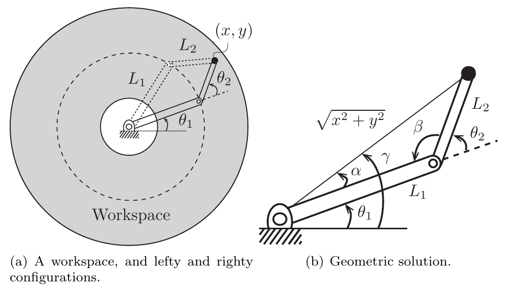

*The same interior workspace point admits two elbow postures. The triangle on the right provides the geometric IK solution. Cropped from book Figure 6.1, printed p. 220.*

#### Reachability and elbow branches

Squaring and adding the position equations gives

$$
r^2=x^2+y^2=L_1^2+L_2^2+2L_1L_2\cos\theta_2.
$$

Define

$$
D=\frac{x^2+y^2-L_1^2-L_2^2}{2L_1L_2}.
$$

A solution requires $|D|\leq 1$, equivalently

$$
\boxed{|L_1-L_2|\leq r\leq L_1+L_2.}
$$

The two elbow branches can be written as

$$
\boxed{\theta_2=\operatorname{atan2}\!\left(\pm\sqrt{1-D^2},D\right).}
$$

For each choice of $\theta_2$, recover the shoulder angle using

$$
\boxed{
\theta_1=\operatorname{atan2}(y,x)
-\operatorname{atan2}(L_2\sin\theta_2,L_1+L_2\cos\theta_2).
}
$$

This is an equivalent form of the book's law-of-cosines construction. The first angle points toward the target; the second is the angle between that direction and link 1. `atan2(y, x)` preserves the quadrant and handles $x=0$ when $y\ne 0$.

Ignoring joint limits and identifying angles modulo $2\pi$, there are two solutions in the annulus interior and one where the branches merge at a boundary, assuming $L_1\ne L_2$. The special case $L_1=L_2$, $(x,y)=(0,0)$ has infinitely many solutions: $\theta_2=\pi$ and any $\theta_1$.

#### Short example

With $L_1=L_2=1$ and target $(x,y)=(1,1)$, $D=0$, so

$$
(\theta_1,\theta_2)=(0,\pi/2)
\quad\text{or}\quad
(\pi/2,-\pi/2).
$$

Both reach the same point, but their endpoint orientations $\theta_1+\theta_2$ differ. Specifying position alone and specifying a full pose are different IK problems.

### 6.3 Analytic IK for PUMA and Stanford Arms

#### Decouple wrist position from orientation

The book's PUMA-type 6R and Stanford-type RRPRRR arms have three wrist axes intersecting at a common **wrist center**. Wrist rotation changes orientation without moving this center, so IK separates into:

1. Find the first three joint coordinates that place the wrist center correctly.
2. Find the last three joint angles that produce the remaining orientation.

If the tool origin is offset from the wrist center by a fixed vector $r$ expressed in the tool frame, a desired tool pose $(R_d,p_d)$ requires wrist-center position

$$
p_w=p_d-R_d r.
$$

The position formulas below use $p=(p_x,p_y,p_z)=p_w$, not necessarily the tool-tip position.

#### PUMA-type arm: shoulder and elbow geometry

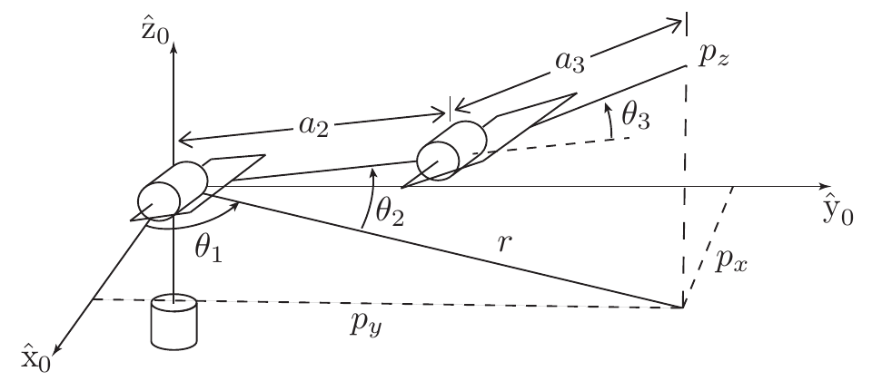

*Zero-offset PUMA position geometry. The first joint rotates the arm plane about $\hat z_0$; the next two joints position the wrist center within that plane. Cropped from book Figure 6.2, printed p. 222.*

In the zero-shoulder-offset model above, $a_2$ is the shoulder-to-elbow length and $a_3$ is the elbow-to-wrist-center length. The shoulder is at the fixed-frame origin. Joint angle $\theta_1$ sets the arm plane's azimuth, $\theta_2$ raises link 2 from the horizontal, and $\theta_3$ is the angle of link 3 relative to link 2.

The dashed projection in the figure has length $r=\sqrt{p_x^2+p_y^2}$. To include both shoulder branches, use a **signed** radial coordinate instead:

$$
\rho=\pm\sqrt{p_x^2+p_y^2}.
$$

For $\rho>0$, choose $\theta_1=\operatorname{atan2}(p_y,p_x)$; for $\rho<0$, add $\pi$. The remaining position equations reduce to a planar 2R problem with target $(\rho,p_z)$:

$$
D=\frac{\rho^2+p_z^2-a_2^2-a_3^2}{2a_2a_3},
\qquad
\theta_3=\operatorname{atan2}\!\left(\pm\sqrt{1-D^2},D\right),
$$

$$
\theta_2=\operatorname{atan2}(p_z,\rho)
-\operatorname{atan2}(a_3\sin\theta_3,a_2+a_3\cos\theta_3).
$$

Two shoulder choices and two elbow choices give up to four position branches. At $p_x=p_y=0$, the wrist center lies on the first joint axis and its position no longer determines $\theta_1$.

#### PUMA shoulder offset and solution branches

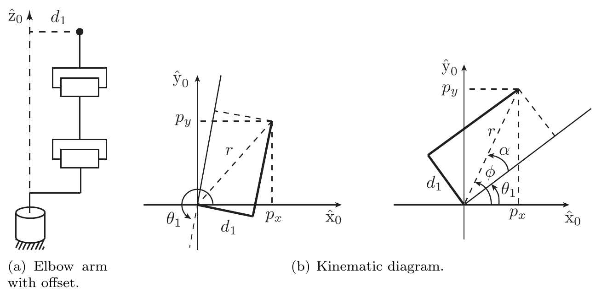

*The shoulder offset $d_1$ separates the first joint axis from the arm plane. In the top view, the wrist-center radius $r$ is the hypotenuse of a triangle with perpendicular components $d_1$ and $\rho$. Cropped from book Figure 6.3, printed p. 222.*

Here $d_1$ is a lateral offset, not a base height. With the positive offset direction shown in the right-hand top view, the horizontal wrist position is

$$
\begin{bmatrix}p_x\\p_y\end{bmatrix}
=\begin{bmatrix}\cos\theta_1&-\sin\theta_1\\\sin\theta_1&\cos\theta_1\end{bmatrix}
\begin{bmatrix}\rho\\d_1\end{bmatrix}.
$$

Consequently, the two shoulder branches can be parameterized by

$$
\rho=\pm\sqrt{p_x^2+p_y^2-d_1^2},\qquad
\theta_1=\operatorname{atan2}(p_y,p_x)-\operatorname{atan2}(d_1,\rho).
$$

For $\rho>0$, these angles correspond to $\theta_1=\phi-\alpha$ in the figure: $\phi$ points from the origin toward the wrist projection, and $\alpha$ corrects for the offset. Keeping the sign of $\rho$ also handles the other shoulder branch. For each branch, solve the same planar target $(\rho,p_z)$ as above, with

$$
D=\frac{p_x^2+p_y^2+p_z^2-d_1^2-a_2^2-a_3^2}{2a_2a_3}.
$$

Both $p_x^2+p_y^2\geq d_1^2$ and $|D|\leq1$ are necessary. For each signed $\rho$, take both signs in the expression for $\theta_3$, then compute $\theta_2$ from the preceding two-link formula. This gives up to four position solutions before checking joint limits; branches can merge at singular configurations.

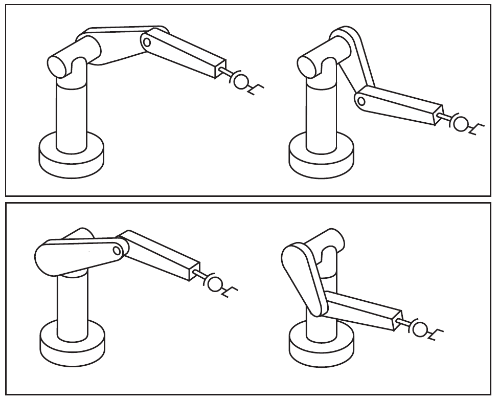

*Four position-IK branches: the upper pair has lefty shoulder postures and the lower pair has righty shoulder postures; each pair contains the two elbow choices. Wrist angles are solved separately to match the target orientation. Cropped from book Figure 6.5, printed p. 224.*

#### Solve the remaining wrist orientation

Using the space-form PoE model, once $\theta_1,\theta_2,\theta_3$ are known,

$$
e^{[S_4]\theta_4}e^{[S_5]\theta_5}e^{[S_6]\theta_6}
=e^{-[S_3]\theta_3}e^{-[S_2]\theta_2}e^{-[S_1]\theta_1}T_{sd}M^{-1}.
$$

The right-hand side is known. For the book's home wrist-axis directions $z,y,x$, its rotation block $R$ satisfies

$$
R=R_z(\theta_4)R_y(\theta_5)R_x(\theta_6).
$$

Thus the orientation subproblem is ZYX Euler-angle extraction. For the branch with $\cos\theta_5>0$,

$$
\theta_4=\operatorname{atan2}(R_{21},R_{11}),\quad
\theta_5=\operatorname{atan2}\!\left(-R_{31},\sqrt{R_{11}^2+R_{21}^2}\right),\quad
\theta_6=\operatorname{atan2}(R_{32},R_{33}).
$$

A second nonsingular branch is $(\theta_4+\pi,\pi-\theta_5,\theta_6+\pi)$ modulo $2\pi$. When $\cos\theta_5=0$, the first and last wrist rotations cannot be independently recovered. These formulas depend on the stated wrist-axis convention.

#### Stanford-type arm: replace the elbow by a prismatic joint

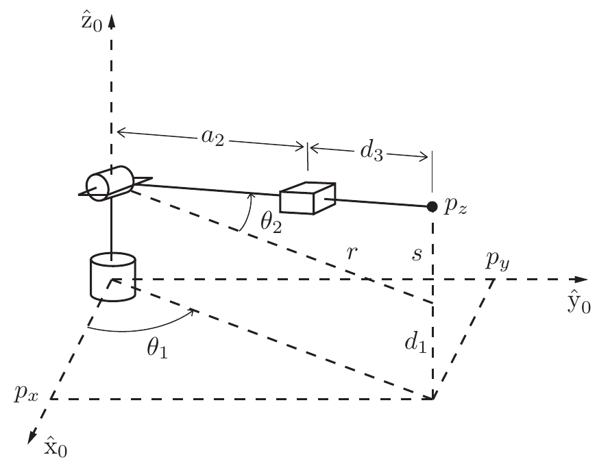

*The Stanford arm's first three joints form an RRP positioning mechanism: $\theta_1$ sets azimuth, $\theta_2$ sets elevation, and the prismatic joint changes radial reach. Cropped from book Figure 6.6, printed p. 225.*

In this diagram, $d_1$ is the shoulder height above the fixed-frame origin, $a_2$ is the fixed length along the extending arm, and the segment labeled $d_3$ is the prismatic displacement denoted by $\theta_3$ in these formulas. Thus the shoulder-to-wrist distance is $a_2+\theta_3$. The horizontal distance $r$ and vertical displacement $s$ from the shoulder are

$$
r=\sqrt{p_x^2+p_y^2},\qquad s=p_z-d_1.
$$

One position branch is

$$
\theta_1=\operatorname{atan2}(p_y,p_x),\qquad
\theta_2=\operatorname{atan2}(s,r),\qquad
\boxed{\theta_3=\sqrt{r^2+s^2}-a_2.}
$$

Here $d_1$ is the base-height offset, $a_2$ is the fixed radial length, and $\theta_3$ is a translation. The last expression follows from $(\theta_3+a_2)^2=r^2+s^2$, taking the positive total radial extension. Another branch uses $\theta_1+\pi$ and $\pi-\theta_2$ with the same extension. Actual prismatic travel limits must still be checked. The wrist-orientation calculation is the same as above.

### 6.4 Newton-Raphson and Local Linearization

An analytic solution exploits a particular mechanism's geometry. Numerical IK instead repeatedly corrects an initial guess using the local differential map. An analytic solution for an idealized arm can also initialize numerical IK for a calibrated model whose axes differ slightly from the ideal geometry.

For a scalar equation $g(\theta)=0$, linearize about the current iterate $\theta^k$:

$$
0\approx g(\theta^k)+g'(\theta^k)\Delta\theta.
$$

Solving for the correction gives the Newton-Raphson update

$$
\theta^{k+1}=\theta^k-\frac{g(\theta^k)}{g'(\theta^k)}.
$$

For an IK task $x=f(\theta)$, let $e^k=x_d-f(\theta^k)$. The corresponding linearization is

$$
f(\theta^k+\Delta\theta)\approx f(\theta^k)+J(\theta^k)\Delta\theta,
\qquad
\boxed{J(\theta^k)\Delta\theta\approx e^k.}
$$

If $J$ is square and invertible,

$$
\theta^{k+1}=\theta^k+J(\theta^k)^{-1}e^k.
$$

The plus sign follows because $J=\partial f/\partial\theta$, whereas $\partial g/\partial\theta=-J$. In code, solve the linear system rather than explicitly forming an inverse.

Each iteration must recompute both the error and the Jacobian. The correction solves a **local approximation**; it generally does not solve the original nonlinear problem in one step.

### 6.5 The Jacobian Pseudoinverse

When $J\in\mathbb R^{m\times n}$ is rectangular or singular, replace the inverse by the Moore-Penrose pseudoinverse:

$$
\boxed{\Delta\theta=J^\dagger e.}
$$

| Linearized problem | Meaning of $J^\dagger e$ |
|:--|:--|
| $J\Delta\theta=e$ has an exact solution | The exact solution with the smallest Euclidean joint-step norm |
| No exact solution exists | The minimum-norm solution among those minimizing $\lVert J\Delta\theta-e\rVert_2$ |

The second case occurs when $e$ has a component outside the column space of $J$. Even a tall or rank-deficient Jacobian can solve a particular error exactly if that error lies in its column space.

Under the stated rank conditions,

$$
J^\dagger=
\begin{cases}
J^T(JJ^T)^{-1},&\text{full row rank},\\
(J^TJ)^{-1}J^T,&\text{full column rank}.
\end{cases}
$$

These formulas explain the geometry; an SVD-based pseudoinverse is preferable for numerical computation. With $J=U\Sigma V^T$, use $J^\dagger=V\Sigma^\dagger U^T$, reciprocating nonzero singular values and leaving zero singular values at zero. A numerical implementation uses a threshold for effectively zero values.

Small retained singular values produce large corrections. A pseudoinverse makes the linearized problem well defined, but does not ensure convergence of nonlinear IK or reachability of the target.

### 6.6 Numerical IK on SE(3)

#### Turn the pose discrepancy into a body twist

For a full pose, $T_{sd}-T_{sb}(\theta^k)$ is a $4\times4$ matrix difference, not the six-component twist required by the geometric Jacobian. Instead, express the target in the current body frame:

$$
T_{bd}=T_{sb}(\theta^k)^{-1}T_{sd}.
$$

Take its matrix logarithm and convert from an $se(3)$ matrix to a six-vector:

$$
\boxed{
[V_b]=\log T_{bd},\qquad
V_b=\begin{bmatrix}\omega_b\\v_b\end{bmatrix}=(\log T_{bd})^\vee.
}
$$

The vee symbol $\vee$ reverses the bracket map: it extracts the three angular and three linear components. This construction satisfies

$$
T_{sb}(\theta^k)e^{[V_b]}=T_{sd}.
$$

Thus $V_b$ describes a constant body twist that would carry the current frame to the target if followed for **unit time**. Here it is a pose-error coordinate used by the solver; it is not a measured velocity or a command to move the robot for one second.

For a small joint correction,

$$
T(\theta^k+\Delta\theta)
\approx T(\theta^k)e^{[J_b(\theta^k)\Delta\theta]},
$$

which motivates $J_b\Delta\theta\approx V_b$ and the update

$$
\boxed{\theta^{k+1}=\theta^k+J_b(\theta^k)^\dagger V_b.}
$$

The logarithm gives an exact finite displacement for the end-effector frame. Realizing it through this joint correction is approximate because the robot Jacobian changes as the joints move.

#### Stop using separate angular and linear tolerances

At every iteration, recompute $V_b$ and require **both**

$$
\lVert\omega_b\rVert\leq\epsilon_\omega,
\qquad
\lVert v_b\rVert\leq\epsilon_v.
$$

The angular and linear components have different units: radians and the model's length unit under the unit-time interpretation. Separate tolerances avoid adding these directly into a single unscaled error threshold.

In general, $v_b$ is not simply $R_{sb}^T(p_d-p_{sb})$: the matrix logarithm couples translation with rotation. They coincide for pure translation and agree to first order near zero pose error.

#### Space-frame formulation

Express the same displacement twist in the space frame using the current pose:

$$
V_s=\operatorname{Ad}_{T_{sb}}V_b,
\qquad
\boxed{\theta^{k+1}=\theta^k+J_s(\theta^k)^\dagger V_s.}
$$

Always pair $V_b$ with $J_b$, or $V_s$ with $J_s$. These describe the same exact linear constraint after a frame change. However, when only an approximate least-squares step is possible, their unweighted pseudoinverse steps can differ: the adjoint is generally not orthogonal, so it changes the residual metric. Linear-error tolerance values are also frame dependent.

### 6.7 Worked Example and Python Implementation

Book Example 6.1 uses a planar 2R arm with both links of length $1\,\mathrm m$. At home the arm points along $+x$, with

$$
M=\begin{bmatrix}
1&0&0&2\\0&1&0&0\\0&0&1&0\\0&0&0&1
\end{bmatrix},\qquad
B_1=\begin{bmatrix}0\\0\\1\\0\\2\\0\end{bmatrix},\quad
B_2=\begin{bmatrix}0\\0\\1\\0\\1\\0\end{bmatrix}.
$$

The target pose is generated by $(\theta_1,\theta_2)=(30^\circ,90^\circ)$: its position is approximately $(0.366,1.366)\,\mathrm m$ and its orientation is $120^\circ$ about $z$. Start from $(0^\circ,30^\circ)$ and use $\epsilon_\omega=10^{-3}\,\mathrm{rad}$, $\epsilon_v=10^{-4}\,\mathrm m$.

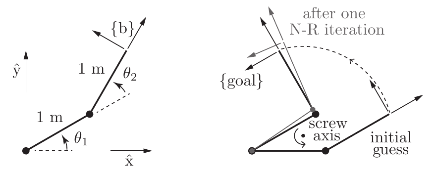

*The first joint update approaches the target pose. The curved dashed path represents the constant-twist frame motion used to define the error; it is not the arm's executed trajectory. Cropped from book Figure 6.8, printed p. 231.*

| Iteration $k$ | Joint angles in degrees | $\lVert\omega_b\rVert$ | $\lVert v_b\rVert$ |
|:--:|:--|:--:|:--:|
| 0 | $(0.00,30.00)$ | 1.571 | 1.924 |
| 1 | $(34.23,79.18)$ | 0.115 | 0.131 |
| 2 | $(29.98,90.22)$ | 0.004 | 0.004 |
| 3 | $(30.00,90.00)$ | Below $10^{-3}$ | Below $10^{-4}$ |

The table rounds the book's intermediate values. Although a 2R arm cannot realize an arbitrary planar pose, this particular target is reachable because it was generated by the same arm's forward kinematics.

The following implementation exposes the iteration while using the [official Modern Robotics Python library](https://github.com/NxRLab/ModernRobotics/tree/master/packages/Python) for rigid-transform operations and Jacobians. It returns the final estimate, a convergence flag, and the number of updates.

```python
import numpy as np
import modern_robotics as mr


def ik_body(Blist, M, T_sd, theta0, eomg=1e-3, ev=1e-4, max_iter=20):
    theta = np.array(theta0, dtype=float, copy=True)
    for k in range(max_iter + 1):
        T_sb = mr.FKinBody(M, Blist, theta)
        V_b = mr.se3ToVec(mr.MatrixLog6(mr.TransInv(T_sb) @ T_sd))
        if np.linalg.norm(V_b[:3]) <= eomg and np.linalg.norm(V_b[3:]) <= ev:
            return theta, True, k
        if k == max_iter:
            return theta, False, k
        theta += np.linalg.pinv(mr.JacobianBody(Blist, theta)) @ V_b


M = np.eye(4)
M[0, 3] = 2.0
Blist = np.array([
    [0, 0],
    [0, 0],
    [1, 1],
    [0, 0],
    [2, 1],
    [0, 0],
], dtype=float)

# Generate a valid target pose without rounding its rotation matrix.
T_sd = mr.FKinBody(M, Blist, np.deg2rad([30.0, 90.0]))
theta, success, updates = ik_body(
    Blist, M, T_sd, np.deg2rad([0.0, 30.0])
)
print(success, updates, np.round(np.rad2deg(theta), 2))
# True 3 [30. 90.]
```

For a standalone run, place this block in a scratch script such as `/tmp/ik_example.py`, install its dependencies with `python3 -m pip install numpy modern_robotics` in your Python environment, and run `python3 /tmp/ik_example.py`. All input angles are in radians. This implements the chapter's unconstrained iteration; the success flag reports pose-error convergence only.

### 6.8 Inverse Velocity Kinematics and Redundancy

Configuration IK finds a pose solution. **Inverse velocity kinematics** finds joint rates for a requested instantaneous twist:

$$
J(\theta)\dot\theta=V_d,\qquad
\boxed{\dot\theta=J(\theta)^\dagger V_d.}
$$

$J$ and $V_d$ must refer to the same frame. For example, the desired trajectory's space twist satisfies $[V_{s,d}]=\dot T_{sd}T_{sd}^{-1}$. A desired body twist defined in the desired frame must be transformed into the current body frame before pairing it with the current $J_b$.

This allows velocity tracking without solving full configuration IK at every timestep. Integrating velocity commands can accumulate pose error, so trajectory tracking also needs pose feedback, developed in Chapter 11.

#### Minimum-norm motion and null-space freedom

When the task is feasible, all exact velocity solutions can be written as

$$
\dot\theta=J^\dagger V_d+(I-J^\dagger J)z,
$$

where $z$ is arbitrary. Since $J(I-J^\dagger J)=0$, the second term does not change the instantaneous task velocity. The pseudoinverse alone chooses the minimum Euclidean norm, corresponding to zero added null-space motion. This is a local joint-rate criterion, not a guarantee of the globally nearest IK configuration.

#### Weighted motion

The chapter also considers different costs for joint velocities. For a symmetric positive-definite weight $W$ and a full-row-rank $J$,

$$
\min_{\dot\theta}\frac12\dot\theta^TW\dot\theta
\quad\text{subject to}\quad J\dot\theta=V_d
$$

has solution

$$
\boxed{
\dot\theta=G V_d,\qquad
G=W^{-1}J^T(JW^{-1}J^T)^{-1}.
}
$$

For $W=I$, this becomes the ordinary pseudoinverse solution. Taking $W$ to be the robot's mass matrix minimizes instantaneous kinetic energy. The book denotes that matrix by $M(\theta)$; $W$ here distinguishes it from the home transform $M$ used in forward kinematics.

#### Add a secondary configuration objective

Let $h(\theta)$ be a potential or posture cost, so its rate of change is $\dot h=\nabla h^T\dot\theta$. Following the book's optimization formulation, minimize

$$
\frac12\dot\theta^TW\dot\theta+\nabla h^T\dot\theta
\quad\text{subject to}\quad J\dot\theta=V_d.
$$

Stationarity gives $W\dot\theta+\nabla h=J^T\lambda$. Substituting $\dot\theta=W^{-1}J^T\lambda-W^{-1}\nabla h$ into the constraint yields

$$
\boxed{\dot\theta=G V_d-(I-GJ)W^{-1}\nabla h.}
$$

The second term uses the remaining joint freedom to reduce the secondary cost without altering $J\dot\theta$. The task motion itself can still increase $h$.

*Source correction: printed p. 234 of the supplied PDF shows a plus sign before this projected gradient term. The minus sign above follows directly from the stated minimization and its stationarity equation. With $W=I$ and $V_d=0$, it gives $\dot h=-\lVert(I-J^\dagger J)\nabla h\rVert^2\leq0$, which checks the descent direction.*

### 6.9 Convergence and Closed Task-Space Loops

#### The initial guess determines the local search

Newton-Raphson can converge quickly near a regular solution. A poor initial guess, a near-singular Jacobian, or an unreachable target can produce large steps, oscillation, stagnation, or failure to converge. A failed run does not prove that no IK solution exists.

For a slowly changing sequence of target poses, use the previous solution as the next initial guess. This often keeps the solver near a useful solution branch, but it does not guarantee continuity across singularities or enforce joint limits and collision avoidance.

Always bound the number of iterations and inspect the final pose error. A small joint update alone does not establish success: at a singularity, a nonzero error can be orthogonal to every achievable instantaneous motion direction.

#### A closed endpoint path need not close in joint space

For a redundant robot, a trajectory satisfying

$$
T_{sd}(0)=T_{sd}(t_f)
$$

may still produce

$$
\theta(0)\ne\theta(t_f).
$$

Returning the end effector to its starting pose does not fix the remaining posture freedom. Local pseudoinverse updates need not return the robot to the original joint configuration; joint-space repeatability requires additional conditions.

The book's "closed loops" in Section 6.4 refers to closed **trajectories**, not the mechanically closed kinematic chains studied in Chapter 7.

### 6.10 Common Confusions

| Confusion | Clarification |
|:--|:--|
| "IK is just inverting the transform $T$." | $T^{-1}$ reverses a frame transformation; IK inverts the nonlinear map from joints to poses. |
| "Six joints mean one solution." | Multiple discrete branches are common, and singular targets need separate analysis. |
| "The pseudoinverse removes singularity problems." | It defines a least-squares step; tiny singular values can still produce large steps, and nonlinear convergence is not guaranteed. |
| "The twist error is position subtraction plus Euler-angle subtraction." | It comes from $\log(T_{sb}^{-1}T_{sd})$ and includes rotation-translation coupling. |
| "One IK iteration is one physical controller timestep." | It is a numerical correction to a candidate configuration; it has no prescribed execution duration. |
| "The closest solution is guaranteed." | The initial guess influences convergence, but minimum-norm local steps do not solve a global nearest-configuration problem. |
| "Reaching the pose makes the motion valid." | Pose convergence alone says nothing about joint limits, collisions, or the path between configurations. |

### 6.11 Formula Sheet

| Concept | Formula |
|:--|:--|
| Full-pose IK | $T(\theta_d)=T_{sd}$ |
| Planar 2R reachability | $\lvert L_1-L_2\rvert\leq\sqrt{x^2+y^2}\leq L_1+L_2$ |
| Local coordinate correction | $J(\theta^k)\Delta\theta\approx x_d-f(\theta^k)$ |
| Pseudoinverse correction | $\Delta\theta=J^\dagger e$ |
| Body pose error | $V_b=(\log(T_{sb}^{-1}T_{sd}))^\vee$ |
| Body IK update | $\theta^{k+1}=\theta^k+J_b^\dagger V_b$ |
| Space pose error | $V_s=\operatorname{Ad}_{T_{sb}}V_b$ |
| Space IK update | $\theta^{k+1}=\theta^k+J_s^\dagger V_s$ |
| Convergence test | $\lVert\omega\rVert\leq\epsilon_\omega$ and $\lVert v\rVert\leq\epsilon_v$ |
| Inverse velocity kinematics | $\dot\theta=J^\dagger V_d$ |
| Null-space freedom | $\dot\theta=J^\dagger V_d+(I-J^\dagger J)z$ |
| Weighted inverse, full row rank | $G=W^{-1}J^T(JW^{-1}J^T)^{-1}$ |
| Weighted secondary-objective motion | $\dot\theta=GV_d-(I-GJ)W^{-1}\nabla h$ |

### 6.12 Software Map

| Operation | Modern Robotics / NumPy function |
|:--|:--|
| Body-frame numerical IK | `IKinBody(Blist, M, T, thetalist0, eomg, ev)` |
| Space-frame numerical IK | `IKinSpace(Slist, M, T, thetalist0, eomg, ev)` |
| Current pose | `FKinBody(M, Blist, thetalist)` / `FKinSpace(M, Slist, thetalist)` |
| Current Jacobian | `JacobianBody(Blist, thetalist)` / `JacobianSpace(Slist, thetalist)` |
| Inverse rigid transform | `TransInv(T)` |
| Rigid-transform logarithm | `MatrixLog6(T)` |
| Extract twist coordinates | `se3ToVec(se3mat)` |
| Change twist frame | `Adjoint(T) @ V` |
| Moore-Penrose pseudoinverse | `np.linalg.pinv(J)` |

`IKinBody` and `IKinSpace` return `(thetalist, success)`. Their screw-axis lists have shape $6\times n$, with home screw axes as columns. The target `T` has shape $4\times4$, and the initial guess has $n$ joint coordinates. `eomg` and `ev` are interpreted in the selected body or space frame. See the [official Python implementation](https://github.com/NxRLab/ModernRobotics/blob/master/packages/Python/modern_robotics/core.py) for the library routines.

### 6.13 Understanding Checklist

After this chapter, you should be able to:

* distinguish position-only IK from full-pose IK and count task-relative redundancy;
* derive the planar 2R reachability condition and both elbow solutions;
* explain how a common wrist center separates position and orientation IK;
* describe the PUMA and Stanford position subproblems;
* derive a Newton-Raphson joint correction from local linearization;
* distinguish minimum-norm exact solutions from least-squares approximations;
* compute a body pose error using the matrix logarithm and pair it with the correct Jacobian;
* implement the iterative solver with separate angular and linear stopping tolerances;
* explain how the initial guess and small Jacobian singular values affect convergence;
* use null-space freedom and a weighted inverse to resolve redundancy;
* explain why a closed end-effector path may not return the joints to their initial configuration.

Chapter 7 extends kinematic analysis to mechanisms with closed chains, whose joint motions must also satisfy loop-closure constraints.

---

## Chapter 8: Dynamics of Open Chains

**Scope:** Sections 8.1-8.5 of the supplied May 2017 book PDF, printed pp. 272-300. Chapter 7 was skipped. Task-space dynamics, constrained dynamics, URDF inertial parameters, gearing, and friction modeling in Sections 8.6 onward are outside this note.

Kinematics describes how a robot moves; **dynamics relates that motion to the forces and torques needed to produce it**. The two main problems are

| Problem | Given | Find |
|:--|:--|:--|
| Inverse dynamics | Joint positions $\theta$, velocities $\dot\theta$, accelerations $\ddot\theta$, and external loading | Required joint effort $\tau$ |
| Forward dynamics | Current state $(\theta,\dot\theta)$, applied joint effort $\tau$, and external loading | Joint acceleration $\ddot\theta$ |

Unless stated otherwise, assume a fixed-base open chain with rigid links, independent one-DOF joints, and no joint friction. A revolute joint's effort is a torque; a prismatic joint's effort is a force. Both are entries of $\tau\in\mathbb R^n$, with mechanical power $\tau^T\dot\theta$.

Prerequisites are [twists and adjoints](#33-rigid-body-motions-and-twists), [wrenches](#34-wrenches), and [body Jacobians](#54-body-jacobian), not closed-chain kinematics. Retain the angular-first conventions

$$
V=\begin{bmatrix}\omega\\v\end{bmatrix},\qquad
F=\begin{bmatrix}m\\f\end{bmatrix},\qquad
T_{ab}:\text{ coordinates in frame }\{b\}\text{ to frame }\{a\}.
$$

The equation we will build and then compute in two different ways is

$$
\boxed{\tau=M(\theta)\ddot\theta+c(\theta,\dot\theta)+g(\theta)+J(\theta)^TF_{\mathrm{tip}}.}
$$

| Symbol | Meaning |
|:--|:--|
| $M(\theta)\in\mathbb R^{n\times n}$ | Joint-space mass matrix; not a homogeneous home transform |
| $c(\theta,\dot\theta)\in\mathbb R^n$ | Coriolis and centripetal effort vector |
| $g(\theta)\in\mathbb R^n$ | Gravity-compensation effort vector |
| $h(\theta,\dot\theta)=c+g$ | Velocity/gravity bias for the frictionless model |
| $\mathbf g\in\mathbb R^3$ | Physical gravitational acceleration in base coordinates, distinct from $g(\theta)$ |
| $F_{\mathrm{tip}}\in\mathbb R^6$ | Wrench the **robot applies to the environment**, in the same frame as $J$ |

The environment applies $-F_{\mathrm{tip}}$ to the robot. If a different convention instead defines $F_{\mathrm{ext}}$ as the environment-on-robot wrench, the corresponding term on the right is $-J^TF_{\mathrm{ext}}$. This sign convention will also determine the backward recursion.

#### How the chapter fits together

The sections answer successive questions about **the same dynamics equation**, rather than introducing unrelated models:

| Step | Question | Result carried into the next step |
|:--|:--|:--|
| [8.1: energy view](#81-lagrangian-formulation) | Where do $M$, $c$, and $g$ come from, and what do they mean? | Differentiate kinetic and potential energy to obtain the equation; interpret $M$ in joint and endpoint coordinates. |
| [8.2: one link](#82-dynamics-of-a-single-rigid-body) | How can we obtain the required force and moment without differentiating the whole robot's energy? | Build a rigid-body law mapping a link's motion and inertia to its required wrench. |
| [8.3: the chain](#83-newton-euler-inverse-dynamics) | How do those single-link laws combine across joints? | Propagate motion outward and required loads inward to compute $\tau$. |
| [8.4: equivalence](#84-dynamic-equations-in-closed-form) | Where are the original $M$, $c$, and $g$ inside that recursion? | Collect its terms and recover the energy-based mass matrix and dynamics equation. |
| [8.5: simulation](#85-forward-dynamics-of-open-chains) | Given effort instead of acceleration, how does the robot move? | Solve the same equation for $\ddot\theta$, then integrate the state. |

In particular, the matrices encountered here describe inertia at different levels: $I_b$ describes one body's rotation, $G_b$ describes its full rigid motion, $M$ combines all links in joint coordinates, and $\Lambda$ expresses the robot's kinetic energy in endpoint coordinates when the relevant Jacobian is invertible. The transformations between them will explain their relationship.

### 8.1 Lagrangian Formulation

**Starting question:** given a robot's geometry and mass distribution, how do we determine the joint effort needed for a prescribed motion? The energy route is: write $K$ and $P$, differentiate them to obtain $M\ddot\theta+c+g$, then interpret that equation. Mass ellipsoids and apparent endpoint mass are interpretations of the resulting $M$, not additional force laws.

#### Start with energy to avoid solving internal joint forces

Choose independent generalized coordinates $q$. Their conjugate generalized forces $f$ are defined by power $f^T\dot q$. For an open-chain robot, use $q=\theta$ and $f=\tau$.

Why use energy? An ideal joint's constraint reactions do no work along its allowed motion. Using independent joint coordinates lets us derive the actuator efforts without first solving every internal reaction force. The geometry enters through the positions and velocities used to compute energy.

With kinetic energy $K$ and potential energy $P$, define the Lagrangian

$$
\mathcal L(q,\dot q)=K(q,\dot q)-P(q).
$$

The Euler-Lagrange equations with applied generalized forces are

$$
\boxed{f_i=\frac{d}{dt}\frac{\partial\mathcal L}{\partial\dot q_i}
-\frac{\partial\mathcal L}{\partial q_i}.}
$$

For a mass moving vertically with upward coordinate $x$, $K=\tfrac12m\dot x^2$ and $P=mgx$. Therefore $f=m\ddot x+mg$: part of the applied force accelerates the mass, and part supports its weight. Gravity is already included through $P$; it must not be added again as a separate applied force.

#### From kinetic energy to the mass matrix and velocity coupling

At a fixed configuration, each link's velocity is linear in $\dot\theta$. Since kinetic energy is quadratic in those velocities, the robot's total energy has the form

$$
K=\frac12\dot\theta^TM(\theta)\dot\theta,
\qquad g(\theta)=\frac{\partial P}{\partial\theta}.
$$

If gravity is represented by the vector $\mathbf g$, a convenient potential is $P=-\sum_i m_i\mathbf g^Tp_{c_i}$, up to an arbitrary constant, where $p_{c_i}$ is link $i$'s center-of-mass position in the base frame.

Thus $M$ is **the matrix of kinetic-energy coefficients**, not an extra assumption added to the Euler-Lagrange equation. Its entries depend on configuration because the same joint rates move the link masses differently at different postures. [Section 8.4](#84-dynamic-equations-in-closed-form) will construct it explicitly from all the rigid links' inertias and Jacobians.

Now differentiate this energy. Let $m_{ij}(\theta)$ be an entry of the symmetric matrix $M$:

$$
\frac{d}{dt}\frac{\partial K}{\partial\dot\theta_i}
=\sum_jm_{ij}\ddot\theta_j+
\sum_{j,k}\frac{\partial m_{ij}}{\partial\theta_k}\dot\theta_j\dot\theta_k,
\qquad
\frac{\partial K}{\partial\theta_i}
=\frac12\sum_{j,k}\frac{\partial m_{jk}}{\partial\theta_i}\dot\theta_j\dot\theta_k.
$$

The first expression has **two sources of change**: joint rates change, producing $M\ddot\theta$, and the kinetic-energy coefficients change as the robot changes posture, producing velocity products. Subtracting the second expression and adding $\partial P/\partial\theta_i$ gives

$$
\boxed{\tau=M(\theta)\ddot\theta+c(\theta,\dot\theta)+g(\theta)}
$$

without an endpoint load. Symmetrizing the coefficients of $\dot\theta_j\dot\theta_k$ gives a compact formula for the remaining kinetic-energy terms:

$$
\Gamma_{ijk}=\frac12\left(
\frac{\partial m_{ij}}{\partial\theta_k}
+\frac{\partial m_{ik}}{\partial\theta_j}
-\frac{\partial m_{jk}}{\partial\theta_i}\right),
\qquad
c_i=\sum_{j,k}\Gamma_{ijk}\dot\theta_j\dot\theta_k.
$$

The $\Gamma_{ijk}$ are **Christoffel symbols of the first kind**. Here their role is bookkeeping: they collect derivatives of $M$ into the velocity-product vector $c$. They are not new physical parameters. Equivalently, define the **Coriolis matrix**

$$
C_{ij}(\theta,\dot\theta)=\sum_k\Gamma_{ijk}\dot\theta_k,
\qquad c=C\dot\theta.
$$

The dependency is therefore $K\rightarrow M\rightarrow c$, while $P\rightarrow g$. In this frictionless model, choosing $M(\theta)$ fixes the corresponding velocity-product terms; they cannot be chosen independently. If $M$ is constant in the chosen coordinates, these terms vanish. The following example makes that dependency concrete.

#### Worked model: the book's point-mass 2R arm

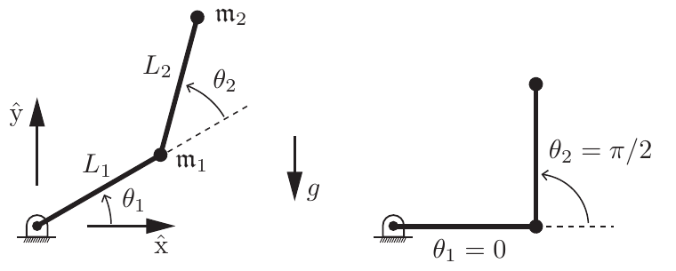

*The links are massless rods of lengths $L_1,L_2$, with masses $m_1,m_2$ at their distal ends. The second angle is relative to the first link; gravity points along negative $y$. Cropped from book Figure 8.1, printed p. 273.*

Use one model throughout: first obtain its dynamics from energy, then reuse its mass matrix to interpret joint coupling and endpoint mass. The planar mass positions are

$$
p_1=\begin{bmatrix}L_1\cos\theta_1\\L_1\sin\theta_1\end{bmatrix},
\quad
p_2=\begin{bmatrix}
L_1\cos\theta_1+L_2\cos(\theta_1+\theta_2)\\
L_1\sin\theta_1+L_2\sin(\theta_1+\theta_2)
\end{bmatrix}.
$$

Differentiate these positions to obtain velocities. Their squared magnitudes are

$$
\begin{aligned}
\|\dot p_1\|^2&=L_1^2\dot\theta_1^2,\\
\|\dot p_2\|^2&=L_1^2\dot\theta_1^2
+L_2^2(\dot\theta_1+\dot\theta_2)^2
+2L_1L_2\cos\theta_2\,\dot\theta_1(\dot\theta_1+\dot\theta_2).
\end{aligned}
$$

Thus $K=\tfrac12m_1\|\dot p_1\|^2+\tfrac12m_2\|\dot p_2\|^2$, and

$$
P=(m_1+m_2)gL_1\sin\theta_1+m_2gL_2\sin(\theta_1+\theta_2),
$$

where the scalar $g>0$ is gravitational acceleration magnitude. To simplify the algebra, define

$$
\alpha=(m_1+m_2)L_1^2,\qquad
\beta=m_2L_1L_2,\qquad \delta=m_2L_2^2.
$$

**Read off inertia from energy.** Writing $K=\tfrac12M_{11}\dot\theta_1^2+M_{12}\dot\theta_1\dot\theta_2+\tfrac12M_{22}\dot\theta_2^2$ gives

$$
M(\theta)=\begin{bmatrix}
\alpha+\delta+2\beta\cos\theta_2 & \delta+\beta\cos\theta_2\\
\delta+\beta\cos\theta_2 & \delta
\end{bmatrix}.
$$

The off-diagonal entry appears because both joint rates contribute to the motion of $m_2$. The $\cos\theta_2$ terms appear because the two links' velocity contributions align differently as the elbow angle changes. This is the concrete reason that the arm's inertia is a configuration-dependent matrix rather than a scalar mass.

**Differentiate that same energy to obtain the other efforts.** For example, the second Euler-Lagrange equation follows from

$$
\begin{aligned}
\frac{\partial K}{\partial\dot\theta_2}
&=(\delta+\beta\cos\theta_2)\dot\theta_1+\delta\dot\theta_2,\\
\frac{d}{dt}\frac{\partial K}{\partial\dot\theta_2}
&=(\delta+\beta\cos\theta_2)\ddot\theta_1+\delta\ddot\theta_2
-\beta\sin\theta_2\dot\theta_1\dot\theta_2,\\
\frac{\partial K}{\partial\theta_2}
&=-\beta\sin\theta_2(\dot\theta_1^2+\dot\theta_1\dot\theta_2).
\end{aligned}
$$

Subtracting the last line cancels the mixed-velocity term, leaving $+\beta\sin\theta_2\dot\theta_1^2$. Applying the same procedure to the first joint yields

$$
c(\theta,\dot\theta)=\begin{bmatrix}
-\beta\sin\theta_2(2\dot\theta_1\dot\theta_2+\dot\theta_2^2)\\
\beta\sin\theta_2\dot\theta_1^2
\end{bmatrix},
$$

$$
g(\theta)=\begin{bmatrix}
(m_1+m_2)gL_1\cos\theta_1+m_2gL_2\cos(\theta_1+\theta_2)\\
m_2gL_2\cos(\theta_1+\theta_2)
\end{bmatrix}.
$$

Together these give $\tau=M\ddot\theta+c+g$ with no endpoint wrench. Notice that $M$ contains $\cos\theta_2$, its derivatives generate the $\sin\theta_2$ factors in $c$, and differentiating the height terms in $P$ generates the cosines in $g$. Each term has a traceable origin. The point-mass assumption matters: uniform rigid rods with distributed mass would have different inertia and center-of-mass terms.

#### Why zero joint acceleration does not mean zero physical acceleration

The derivation produced $c$ even before assigning it a physical name. Why can this effort be needed when $\ddot\theta=0$? A link's mass can change its direction of motion while its joint speed stays constant. Differentiating $\dot p=J_p(\theta)\dot\theta$ gives $\ddot p=J_p\ddot\theta+\dot J_p\dot\theta$: setting the first term to zero does not remove the second.

Terms proportional to $\dot\theta_i^2$ are called **centripetal** terms, and terms proportional to $\dot\theta_i\dot\theta_j$, $i\ne j$, are **Coriolis** terms. They describe these acceleration effects in joint coordinates. The Cartesian term $\dot J_p\dot\theta$ is an acceleration; $c$ is the resulting generalized effort after accounting for the masses and joint geometry, not the same vector.

For the 2R arm at $(\theta_1,\theta_2)=(0,\pi/2)$ with $\ddot\theta=0$,

$$
\ddot p_2=
\underbrace{\begin{bmatrix}-L_1\dot\theta_1^2\\-L_2\dot\theta_1^2-L_2\dot\theta_2^2\end{bmatrix}}_{\text{centripetal}}
+\underbrace{\begin{bmatrix}0\\-2L_2\dot\theta_1\dot\theta_2\end{bmatrix}}_{\text{Coriolis}}.
$$

The masses can accelerate even while both joint speeds remain constant. Coriolis/centripetal terms are not friction: they account for changing motion directions and dynamic coupling.

#### Check the connection through energy conservation

The same dependency between $M$ and $c$ has an important consequence: velocity coupling must be consistent with mechanical power. This is why the book introduces the identity involving $\dot M-2C$, rather than treating it as an unrelated matrix property.

The vector $c$ and matrix $C$ are different objects. For the Christoffel construction above, $\dot M-2C$ is skew-symmetric. Its entries reduce to

$$
(\dot M-2C)_{ij}
=\sum_k\left(\frac{\partial m_{kj}}{\partial\theta_i}
-\frac{\partial m_{ik}}{\partial\theta_j}\right)\dot\theta_k,
$$

which change sign when $i,j$ are exchanged. Consequently $\dot\theta^T(\dot M-2C)\dot\theta=0$. To see why this matters, differentiate the total energy and substitute the dynamics:

$$
\begin{aligned}
\frac{d}{dt}(K+P)
&=\dot\theta^TM\ddot\theta+\frac12\dot\theta^T\dot M\dot\theta+\dot\theta^Tg\\
&=\dot\theta^T\tau+\frac12\dot\theta^T(\dot M-2C)\dot\theta\\
&=\dot\theta^T\tau.
\end{aligned}
$$

This is the frictionless robot without an endpoint load. With the outgoing tip-wrench convention, the power balance becomes $\tfrac{d}{dt}(K+P)=\dot\theta^T\tau-V_{\mathrm{tip}}^TF_{\mathrm{tip}}$. The velocity terms account for the changing kinetic-energy coefficients; they do not dissipate energy like friction. An arbitrary matrix factorization $c=C\dot\theta$ need not have the same skew-symmetry property.

#### From the mass matrix to mass ellipsoids

We now know how to compute effort. The next question is geometric: **why does the same acceleration magnitude require different effort in different directions?** Isolate the inertial part by considering zero velocity with gravity and external loads removed or compensated. Then $\tau_{\mathrm{net}}=M\ddot\theta$, the matrix analogue of $f=ma$.

$M$ is symmetric. It is positive definite when every nonzero generalized velocity produces positive kinetic energy, as for a nondegenerate rigid-link model with independent joint coordinates. Off-diagonal entries express coupling: accelerating one joint can require torque at another.

At a fixed configuration, write $M=Q\operatorname{diag}(\lambda_i)Q^T$, where the columns $v_i$ of $Q$ are orthonormal eigenvectors. In these principal coordinates each acceleration component is multiplied by its own $\lambda_i$. A sphere therefore becomes an ellipsoid:

* a unit acceleration ball maps to a torque ellipsoid with axes $v_i$ and semiaxis lengths $\lambda_i$;
* a unit torque ball maps through $M^{-1}$ to an acceleration ellipsoid with semiaxis lengths $1/\lambda_i$;
* torque and acceleration are parallel only along an eigenvector, unless all eigenvalues are equal.

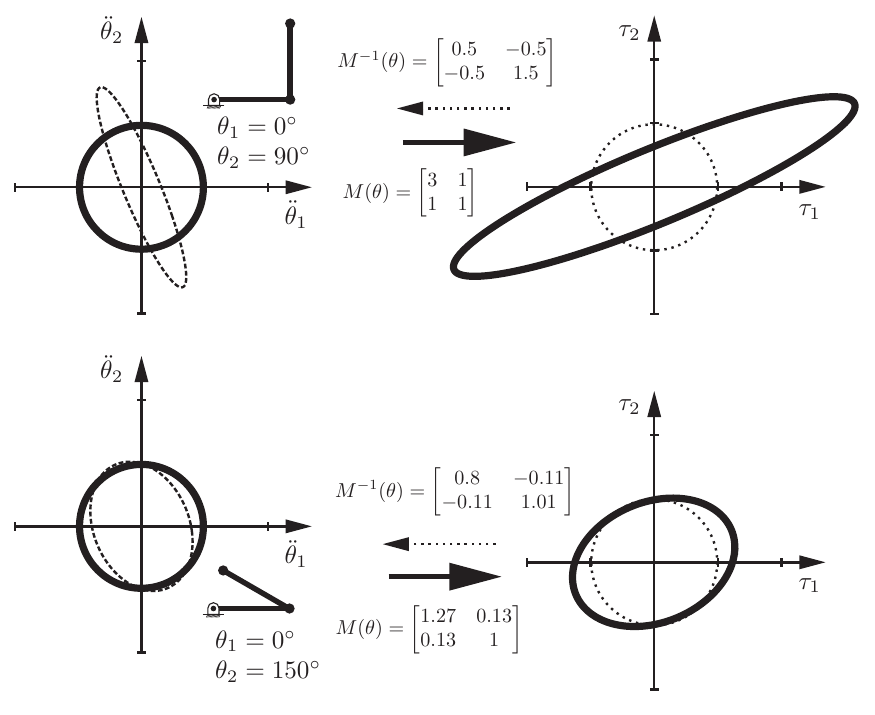

*Solid curves show a unit acceleration circle and its torque image; dotted curves show a unit torque circle and its acceleration image. The 2R arm has unit lengths and masses. Interpret the torques as inertial torques after removing gravity. Cropped from Figure 8.3, printed p. 280.*

For the unit 2R example at $(0,\pi/2)$,

$$
M=\begin{bmatrix}3&1\\1&1\end{bmatrix},\qquad
M^{-1}=\begin{bmatrix}0.5&-0.5\\-0.5&1.5\end{bmatrix}.
$$

A net torque $(1,0)$ therefore produces acceleration $(0.5,-0.5)$, not $(1,0)$. These are acceleration-to-force ellipsoids, not constant-energy velocity ellipsoids, whose radii scale as $1/\sqrt{\lambda_i}$. Euclidean balls also presume a chosen coordinate scaling; mixing revolute and prismatic coordinates requires care about units.

#### From joint-space inertia to apparent endpoint mass

The ellipsoid above answers a question about **joint** efforts and accelerations. A person pushing the end effector instead asks: "What inertia does the whole arm present at this endpoint?" We need the same kinetic energy expressed in endpoint velocities, not a new mass attached to the tool.

For a square, invertible Jacobian $J$, $V=J\dot\theta$ implies $\dot\theta=J^{-1}V$. Substitute this into the energy already derived:

$$
K=\frac12(J^{-1}V)^TM(J^{-1}V)
=\frac12V^T\underbrace{(J^{-T}MJ^{-1})}_{\Lambda}V,
\qquad
\boxed{\Lambda=J^{-T}MJ^{-1}.}
$$

Here, for the planar example, $V=(\dot x,\dot y)$ and $J$ is the $2\times2$ position Jacobian, not a six-row spatial Jacobian. Thus $M$ and $\Lambda$ describe **the same robot in different velocity coordinates**; their eigenvalues refer to different acceleration/effort spaces.

The connection to force is equally direct. At rest, with gravity compensated and no other load, let $f_{\mathrm{push}}$ be an external planar force applied **to** the robot at the endpoint. With no additional joint drive, $M\ddot\theta=J^Tf_{\mathrm{push}}$, and the endpoint acceleration is $a=J\ddot\theta$. Eliminating $\ddot\theta$ gives

$$
f_{\mathrm{push}}=J^{-T}MJ^{-1}a=\Lambda a.
$$

This uses an incoming push, not the outgoing $F_{\mathrm{tip}}$ convention. The endpoint mass ellipsoid follows by applying the same eigenvector construction to $\Lambda$. The energy identity holds at any velocity where $J$ is invertible, but this simple force-acceleration interpretation assumes rest; at nonzero velocity there are additional velocity terms.

Return to the same 2R arm at $(0,\pi/2)$ with unit lengths and masses:

$$
J=\begin{bmatrix}-1&-1\\1&0\end{bmatrix},\qquad
\Lambda=\begin{bmatrix}1&0\\0&2\end{bmatrix}.
$$

For $V=(1,0)$, $\dot\theta=J^{-1}V=(0,-1)$: only the second joint moves, so only $m_2$ moves. For $V=(0,1)$, $\dot\theta=(1,-1)$: both masses move vertically at unit speed. Their kinetic energies are therefore $1/2$ and $1$, giving apparent masses 1 and 2. At rest, a unit push along $x$ consequently produces unit acceleration, whereas a unit push along $y$ produces acceleration $1/2$.

The inverse-Jacobian formula requires nonsingularity; it is not a general redundant-robot formula. A singular endpoint map prevents this change of coordinates even when the joint-space $M$ remains positive definite. Full task-space dynamics in Section 8.6 is not covered here.

**What carries forward:** geometry and mass determine energy; energy yields $M$, its configuration derivatives yield $c$, and potential energy yields $g$. Ellipsoids visualize the inertial map, while $\Lambda$ changes its coordinates. We now understand the equation, but symbolically differentiating a large robot's energy is cumbersome. Newton-Euler will compute the **same physical efforts** by balancing forces and moments one link at a time. First we need the dynamics law for one link.

### 8.2 Dynamics of a Single Rigid Body

**Question inherited from Section 8.1:** what local law can replace differentiating the whole robot's energy? Each link both translates and rotates, so its scalar mass is insufficient. We first describe its rotational inertia, use Newton's and Euler's laws to find the required force and moment, then package those laws into a six-dimensional form that can be reused for every link.

#### Center of mass and rotational inertia

Rotation gives different particles different speeds, so rotational energy depends on how mass is distributed about the rotation axis. For a rigid body represented by point masses $m_k$, let $r_k$ be their positions in a body-fixed frame whose origin is the center of mass. Then

$$
m=\sum_km_k,\qquad \sum_km_kr_k=0.
$$

The rotational energy is $K_{\mathrm{rot}}=\tfrac12\sum_km_k\|\omega_b\times r_k\|^2$. Collecting its coefficients into $K_{\mathrm{rot}}=\tfrac12\omega_b^TI_b\omega_b$ gives the rotational inertia matrix about this origin:

$$
I_b=-\sum_km_k[r_k]^2
=\sum_km_k\left(\|r_k\|^2I_3-r_kr_k^T\right).
$$

For continuous density $\rho$, replace sums by integrals. For example,

$$
I_{xx}=\int(y^2+z^2)\rho\,dV,\qquad
I_{xy}=-\int xy\rho\,dV,
\qquad
I_b=\begin{bmatrix}I_{xx}&I_{xy}&I_{xz}\\I_{xy}&I_{yy}&I_{yz}\\I_{xz}&I_{yz}&I_{zz}\end{bmatrix}.
$$

The negative sign in the off-diagonal entry is part of this convention. In a body-fixed frame, $I_b$ is constant, unlike the configuration-dependent robot mass matrix $M(\theta)$.

The eigenvectors of $I_b$ are the **principal axes**, and its eigenvalues are the principal moments of inertia. Choosing these axes as the coordinate axes diagonalizes $I_b$. For familiar uniform solids about their centers of mass:

| Solid and axis convention | Principal moments |
|:--|:--|
| Box with side lengths $a,b,c$ along $x,y,z$ | $\tfrac{m}{12}(b^2+c^2),\ \tfrac{m}{12}(a^2+c^2),\ \tfrac{m}{12}(a^2+b^2)$ |
| Cylinder of radius $r$, length $h$, symmetry axis $z$ | $I_{xx}=I_{yy}=\tfrac{m}{12}(3r^2+h^2),\ I_{zz}=\tfrac12mr^2$ |
| Ellipsoid with semiaxes $a,b,c$ along $x,y,z$ | $\tfrac{m}{5}(b^2+c^2),\ \tfrac{m}{5}(a^2+c^2),\ \tfrac{m}{5}(a^2+b^2)$ |

These formulas supply the content of book Figure 8.5 without needing that figure. Rotational inertia is positive definite for ordinary three-dimensional bodies; idealized point or line masses can have zero moments about some axes.

#### Newton's and Euler's equations in body coordinates

Having identified the inertia, we can relate motion to load. Body coordinates keep $I_b$ constant, but the axes themselves rotate; differentiating momentum in those axes must account for that rotation. This is the single-body counterpart of the changing-coordinate effects that produced $c$ in Section 8.1.

Let $V_b=(\omega_b,v_b)$ be the body twist at the center of mass, and $F_b=(m_b,f_b)$ the total applied wrench, both expressed in the same body frame. Then

$$
\boxed{f_b=m(\dot v_b+\omega_b\times v_b),}
\qquad
\boxed{m_b=I_b\dot\omega_b+\omega_b\times(I_b\omega_b).}
$$

The dots differentiate the **body-coordinate components**. In particular, $\dot v_b$ alone is not the physical center-of-mass acceleration written in that rotating frame. Since the inertial velocity is $Rv_b$ and $\dot R=R[\omega_b]$,

$$
R^T\frac{d}{dt}(Rv_b)=\dot v_b+[\omega_b]v_b.
$$

Applying the same transport rule to angular momentum $I_b\omega_b$ explains the rotational cross-product term. Even constant angular-velocity components can require torque if rotation is not about a principal axis. With diagonal inertia, for example,

$$
(m_b)_x=I_{xx}\dot\omega_x+(I_{zz}-I_{yy})\omega_y\omega_z,
$$

with cyclic expressions for $y,z$. For planar rotation about a principal $z$ axis, this reduces to $(m_b)_z=I_{zz}\dot\omega_z$.

#### Change the inertia frame correctly

The body law is easiest to derive at the center of mass, but model data or joint frames may use another origin or orientation. Before combining links or subcomponents, we therefore need to express inertia in a common frame while preserving the body's kinetic energy.

For a rotated frame $\{c\}$ with the **same origin** and $\omega_b=R_{bc}\omega_c$, energy invariance gives

$$
I_c=R_{bc}^TI_bR_{bc}.
$$

For a parallel frame with its origin at $q$ relative to the center of mass, **Steiner's theorem** gives

$$
I_q=I_b+m(\|q\|^2I_3-qq^T).
$$

The scalar parallel-axis theorem is $I_d=I_{\mathrm{cm}}+md^2$. To combine rigid subcomponents, rotate and shift their inertias into one common frame before summing them; adding matrices about unrelated origins is invalid.

#### Spatial inertia, momentum, and the Lie bracket

We now have separate rotational and translational laws. The chain algorithm needs to transform both together using the twists and wrenches of Chapter 3. At the center of mass the energy is $K=\tfrac12\omega_b^TI_b\omega_b+\tfrac12m v_b^Tv_b$, so define the $6\times6$ **spatial inertia** and spatial momentum as

$$
G_b=\begin{bmatrix}I_b&0\\0&mI_3\end{bmatrix},
\qquad P_b=G_bV_b,
\qquad K=\frac12V_b^TG_bV_b.
$$

$P_b$ here is spatial momentum, not the scalar potential energy $P$. "Spatial inertia" means the six-dimensional inertia representation, not necessarily an inertia expressed in the world frame.

The remaining cross products in the body-frame equations can also be written as one matrix operation. For $V=(\omega,v)$, the **small adjoint**, or Lie-bracket matrix, is

$$
\operatorname{ad}_V=
\begin{bmatrix}[\omega]&0\\{}[v]&[\omega]\end{bmatrix},
\qquad
\operatorname{ad}_{V_1}V_2=
\begin{bmatrix}
\omega_1\times\omega_2\\
v_1\times\omega_2+\omega_1\times v_2
\end{bmatrix}.
$$

It satisfies $\operatorname{ad}_{V_1}V_2=-\operatorname{ad}_{V_2}V_1$ and $\operatorname{ad}_VV=0$. Equivalently, its twist matrix is the commutator $[V_1][V_2]-[V_2][V_1]$.

Do not confuse $\operatorname{ad}_V$, which describes velocity-product interactions, with the finite frame-change matrix

$$
\operatorname{Ad}_T=
\begin{bmatrix}R&0\\{}[p]R&R\end{bmatrix},\qquad
T=\begin{bmatrix}R&p\\0&1\end{bmatrix}.
$$

Newton's and Euler's equations combine into

$$
\boxed{F_b=G_b\dot V_b-\operatorname{ad}_{V_b}^TG_bV_b.}
$$

The minus sign is important. Expanding the second term recovers the positive cross-product terms in the classical equations above.

For another frame $\{a\}$ rigidly attached to the body, use the full transform $T_{ba}$, including translation:

$$
\boxed{G_a=\operatorname{Ad}_{T_{ba}}^TG_b\operatorname{Ad}_{T_{ba}},}
\qquad
F_a=G_a\dot V_a-\operatorname{ad}_{V_a}^TG_aV_a.
$$

This follows from $V_b=\operatorname{Ad}_{T_{ba}}V_a$ and invariant kinetic energy. Away from the center of mass, $G_a$ generally has translation-rotation coupling blocks; it is not simply $\operatorname{diag}(I_a,mI_3)$.

The construction follows the same energy rule as $\Lambda=J^{-T}MJ^{-1}$: substitute the velocity-coordinate map into a quadratic energy. Here we change the frame of **one body's twist**; there we changed **the whole robot's joint velocities** to endpoint velocities. These are related transformations, not interchangeable inertia matrices.

**Result for the chain:** given a link's $G_i$, $V_i$, and $\dot V_i$, we can now compute its net required wrench. What remains is to find those link motions from the joint motion and determine which joint transmits each load.

### 8.3 Newton-Euler Inverse Dynamics

**Question inherited from Section 8.2:** how do we combine single-body laws when each link supports the links beyond it? There are two dependencies with opposite directions:

1. A child link's motion depends on its parent's motion plus its own joint motion, so compute $V_i,\dot V_i$ from **base to tip**.
2. The wrench supplied by a parent must accelerate its own child link and support that child's downstream load, so compute $F_i$ from **tip to base**, starting with the known endpoint load.

These dependencies explain the two passes; they are not an arbitrary order of calculation. After each transmitted wrench is known, project it onto the joint's allowed motion to obtain the actuator effort.

#### Model data and frame conventions

Attach frame $\{0\}$ to the base, frame $\{i\}$ to link $i$'s center of mass, and frame $\{n+1\}$ to the end effector, fixed relative to link $n$.

| Quantity | Definition |
|:--|:--|
| $M_i=M_{0i}$ | Home pose of link frame $\{i\}$ in the base frame |
| $M_{i,i-1}=M_i^{-1}M_{i-1}$ | Home pose of the parent frame expressed in link frame $\{i\}$; take $M_0=I_4$ |
| $A_i\in\mathbb R^6$ | Joint $i$ screw axis in link frame $\{i\}$, constant |
| $G_i\in\mathbb R^{6\times6}$ | Inertia of link $i$ in that same frame, constant |
| $V_i,\dot V_i$ | Link twist and its component derivative, expressed in $\{i\}$ |
| $F_i$ | Wrench transmitted from the parent through joint $i$ onto link $i$, expressed in $\{i\}$ |

The $M_i$ and $M_{ij}$ in this table are homogeneous transforms, not the joint mass matrix $M(\theta)$. Given the home space screw $S_i$ from Chapter 4,

$$
A_i=\operatorname{Ad}_{M_i^{-1}}S_i,
\qquad
T_{i,i-1}(\theta_i)=e^{-[A_i]\theta_i}M_{i,i-1}.
$$

The negative exponential appears because this transform expresses the **parent in the moving child frame**. Its inverse is $T_{i-1,i}=M_{i-1,i}e^{[A_i]\theta_i}$.

#### Forward pass: propagate motion from base to tip

For a stationary base, initialize

$$
V_0=0,\qquad \dot V_0=\begin{bmatrix}0\\-\mathbf g\end{bmatrix}.
$$

The top zero is a three-vector. Using an artificial base acceleration opposite gravity is a computational way to obtain gravity-compensation efforts; the physical base does not accelerate. If $\mathbf g=(0,0,-9.81)$, the initialized linear acceleration is $(0,0,+9.81)$.

For $i=1,\ldots,n$, let $X_i=\operatorname{Ad}_{T_{i,i-1}}$ and compute

$$
\boxed{V_i=X_iV_{i-1}+A_i\dot\theta_i,}
$$

$$
\boxed{\dot V_i=X_i\dot V_{i-1}+A_i\ddot\theta_i
+\operatorname{ad}_{V_i}A_i\dot\theta_i.}
$$

The terms in the second equation are parent acceleration transported into the child frame, acceleration contributed by the joint, and a velocity-product term from the changing frame. To see the latter's origin, differentiate the twist recursion:

$$
\dot X_iV_{i-1}
=-\operatorname{ad}_{A_i\dot\theta_i}X_iV_{i-1}
=\operatorname{ad}_{V_i}A_i\dot\theta_i.
$$

The last equality uses $X_iV_{i-1}=V_i-A_i\dot\theta_i$ and the antisymmetry of the Lie bracket. Dropping this derivative of the frame transform would lose the Coriolis/centripetal effects.

#### Backward pass: propagate loads from tip to base

The forward pass has supplied every link's motion, so the single-body law now gives every link's net wrench requirement. It does **not** yet give $F_i$: the parent must supply that requirement plus the load transmitted to the next link. Starting from the known tip load makes that next-link contribution available at each backward step.

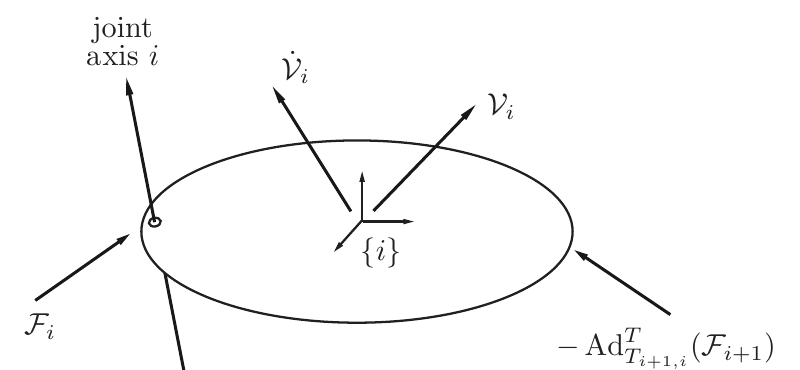

*Link $i$ receives $F_i$ from its parent and the reaction $-\operatorname{Ad}_{T_{i+1,i}}^TF_{i+1}$ from its child. Their sum must produce the link's rigid-body dynamics. Cropped from Figure 8.6, printed p. 293.*

Initialize $F_{n+1}=F_{\mathrm{tip}}$ in the end-effector frame, and use the fixed terminal transform $T_{n+1,n}=M_{n+1,n}$. For $i=n,\ldots,1$,

$$
\boxed{F_i=X_{i+1}^TF_{i+1}+G_i\dot V_i
-\operatorname{ad}_{V_i}^TG_iV_i,}
\qquad
\boxed{\tau_i=A_i^TF_i.}
$$

The wrench recursion comes from rearranging the free-body balance

$$
F_i-X_{i+1}^TF_{i+1}
=G_i\dot V_i-\operatorname{ad}_{V_i}^TG_iV_i.
$$

The transpose transforms the child wrench into the parent link's coordinates, as required by power invariance. $F_i$ is the full six-dimensional transmitted wrench; the actuator supplies only its component conjugate to the joint's one allowed motion. In fact,

$$
F_i^T(A_i\dot\theta_i)=\tau_i\dot\theta_i,
$$

which explains the projection $\tau_i=A_i^TF_i$ without requiring the other constraint-force components to vanish.

```text
Model: home transforms, link inertias, joint screw axes
Input: theta, dtheta, ddtheta, gravity, outgoing tip wrench

Base -> tip: compute each relative transform, twist, and acceleration
Tip -> base: compute each transmitted wrench and joint effort
Output: tau
```

Both passes perform a fixed amount of work per link, so one inverse-dynamics evaluation is $O(n)$. "Forward pass" here means recursion direction; it is still part of **inverse dynamics**, not a simulation timestep.

Unlike the Lagrange derivation, the algorithm never has to construct $M$ or $C$ explicitly. Their physical effects are already present in the propagated accelerations and rigid-body wrench terms. The next section identifies those effects algebraically, connecting this computation back to Section 8.1.

### 8.4 Dynamic Equations in Closed Form

**Question inherited from Section 8.3:** where are $M$, $c$, and $g$ hidden inside the recursion? This section is an equivalence check, not a third dynamics model. First, express every link's energy using joint velocities to recover $M$. Then collect the recursion's acceleration, velocity, gravity, and endpoint-load contributions into the same equation obtained by Lagrange.

#### Construct the mass matrix from link kinetic energies

Section 8.2 gave the link energy $\tfrac12V_i^TG_iV_i$. To add these energies and compare with Section 8.1, express all $V_i$ in terms of the **same** joint-rate vector. For each link, let $J_{ib}(\theta)$ be its body Jacobian, padded with zero columns for downstream joints so its shape is $6\times n$. Then

$$
V_i=J_{ib}\dot\theta,
\qquad
K=\frac12\sum_iV_i^TG_iV_i
=\frac12\dot\theta^T\left(\sum_iJ_{ib}^TG_iJ_{ib}\right)\dot\theta.
$$

Therefore,

$$
\boxed{M(\theta)=\sum_{i=1}^nJ_{ib}(\theta)^TG_iJ_{ib}(\theta).}
$$

Each inertia and Jacobian must use the same link frame. This derivation explains both symmetry and configuration dependence: the link inertias are constant, but the Jacobians vary. Also,

$$
x^TMx=\sum_i(J_{ib}x)^TG_i(J_{ib}x)>0
$$

whenever a nonzero joint velocity $x$ necessarily moves some link with positive kinetic energy. An end-effector kinematic singularity does not, by itself, make the joint mass matrix singular.

This completes the connection between inertia levels: mass distribution determines each $I_i$, combining rotation and translation gives $G_i$, and the link Jacobians combine these into $M$. If the endpoint Jacobian is square and invertible, $M$ can then be re-expressed as $\Lambda$. Only the coordinates and level of aggregation change; all are tied to the same kinetic energy.

#### Stack the recursive equations

The energy calculation identifies $M$ but does not yet show how the full recursion produces $c$, $g$, and the tip-load term. Stacking the equations lets us eliminate the intermediate link motions and wrenches and collect those contributions. The following notation separates the propagation matrix $\mathsf L$ from the scalar Lagrangian $\mathcal L$ used earlier.

| Symbol | Definition and size |
|:--|:--|
| $\mathbf V,\mathbf F\in\mathbb R^{6n}$ | Stack $V_1,\ldots,V_n$ and $F_1,\ldots,F_n$ |
| $\mathsf A\in\mathbb R^{6n\times n}$ | Block diagonal with $6\times1$ blocks $A_i$ |
| $\mathsf G\in\mathbb R^{6n\times6n}$ | $\operatorname{diag}(G_1,\ldots,G_n)$ |
| $\mathsf W\in\mathbb R^{6n\times6n}$ | Only nonzero blocks are $\mathsf W_{i,i-1}=X_i$, for $i=2,\ldots,n$ |
| $D\in\mathbb R^{6n\times6n}$ | $\operatorname{diag}(\operatorname{ad}_{A_i\dot\theta_i})$ |
| $E\in\mathbb R^{6n\times6n}$ | $\operatorname{diag}(\operatorname{ad}_{V_i})$ |
| $b_0\in\mathbb R^{6n}$ | First block $X_1\dot V_0$, remaining blocks zero |
| $f_{\mathrm{tip}}\in\mathbb R^{6n}$ | Last block $X_{n+1}^TF_{\mathrm{tip}}$, remaining blocks zero |

For the stationary base $V_0=0$, including gravity via $\dot V_0$, the stacked equations are

$$
\begin{aligned}
\mathbf V&=\mathsf W\mathbf V+\mathsf A\dot\theta,\\
\dot{\mathbf V}&=\mathsf W\dot{\mathbf V}+\mathsf A\ddot\theta-D\mathsf W\mathbf V+b_0,\\
\mathbf F&=\mathsf W^T\mathbf F+\mathsf G\dot{\mathbf V}-E^T\mathsf G\mathbf V+f_{\mathrm{tip}},\\
\tau&=\mathsf A^T\mathbf F.
\end{aligned}
$$

The minus sign before $D\mathsf W\mathbf V$ is the same frame-derivative term derived in Section 8.3. Since $\mathsf W$ is strictly block-lower-triangular, $\mathsf W^n=0$, and

$$
\mathsf L=(I-\mathsf W)^{-1}=I+\mathsf W+\cdots+\mathsf W^{n-1}.
$$

The block $(i,j)$ of $\mathsf L$ is $\operatorname{Ad}_{T_{ij}}$ for $i>j$, identity for $i=j$, and zero otherwise. It accumulates the successive frame transformations along the chain. Rearranging gives

$$
\begin{aligned}
\mathbf V&=\mathsf L\mathsf A\dot\theta,\\
\dot{\mathbf V}&=\mathsf L(\mathsf A\ddot\theta-D\mathsf W\mathbf V+b_0),\\
\mathbf F&=\mathsf L^T(\mathsf G\dot{\mathbf V}-E^T\mathsf G\mathbf V+f_{\mathrm{tip}}).
\end{aligned}
$$

Substituting into $\tau=\mathsf A^T\mathbf F$ separates the dynamics terms:

$$
\begin{aligned}
M&=\mathsf A^T\mathsf L^T\mathsf G\mathsf L\mathsf A,\\
c&=-\mathsf A^T\mathsf L^T(\mathsf G\mathsf L D\mathsf W+E^T\mathsf G)\mathsf L\mathsf A\dot\theta,\\
g&=\mathsf A^T\mathsf L^T\mathsf G\mathsf Lb_0,\\
J^TF_{\mathrm{tip}}&=\mathsf A^T\mathsf L^Tf_{\mathrm{tip}}.
\end{aligned}
$$

The block rows of $\mathsf L\mathsf A$ are exactly the link Jacobians, so this mass matrix equals the sum of $J_{ib}^TG_iJ_{ib}$. The two contributions to $c$ come from the changing frames in acceleration propagation and the velocity-dependent term in each body's wrench law. Gravity enters through the artificial base acceleration $b_0$; the endpoint wrench is propagated backward and projected into joint efforts. Thus the recursion contains the same categories of effort as the energy derivation, without computing Christoffel symbols.

The block formulation explains the structure; explicit dense block matrices are not required to run the recursive algorithm. Its key consequence for the next section is that, at a fixed state, the dependence on $\ddot\theta$ is linear: all remaining terms form a known bias/load vector.

**Sign check against the supplied PDF:** Equation (8.74) on printed p. 298 displays plus signs for the velocity-product terms after rearrangement. These conflict with the minus sign in (8.69), the differentiated recursion, and the negative expression for $c$ in (8.79). The equations here retain the consistent **minus** sign; this correction follows directly from the derivation above.

### 8.5 Forward Dynamics of Open Chains

**Final question:** so far we have prescribed accelerations and computed the necessary effort. If motors instead apply a known effort, what acceleration results? Because Section 8.4 recovered the same equation and isolated its linear acceleration term, we can solve that equation in the opposite direction and reuse the inverse-dynamics algorithm to obtain its coefficients.

#### Solve for acceleration, not for configuration

With $\theta,\dot\theta,\tau,F_{\mathrm{tip}}$ given, solve

$$
\boxed{M(\theta)\ddot\theta
=\tau-c(\theta,\dot\theta)-g(\theta)-J^TF_{\mathrm{tip}}.}
$$

Although the mathematical expression uses $M^{-1}$, numerical code should solve the linear system, for example with `np.linalg.solve(M, rhs)`. Forward dynamics returns an instantaneous acceleration; an integration method is still needed to obtain future positions and velocities.

#### Reuse inverse dynamics to obtain every term

Write $\operatorname{ID}(\theta,\dot\theta,\ddot\theta,\mathbf g,F_{\mathrm{tip}})$ for the inverse-dynamics routine, with the robot model fixed. The decomposition derived earlier makes it a way to measure individual terms: zero acceleration removes $M\ddot\theta$, zero velocity removes $c$, and zero gravity removes $g$. Once the biases are off, a unit acceleration $e_j$ returns $Me_j$, exactly column $j$ of $M$.

This gives the following calls, without a separate symbolic dynamics derivation:

| Desired term | Inverse-dynamics call |
|:--|:--|
| Bias $h=c+g$ | $\operatorname{ID}(\theta,\dot\theta,0,\mathbf g,0)$ |
| Velocity-product vector $c$ | $\operatorname{ID}(\theta,\dot\theta,0,0,0)$ |
| Gravity vector $g(\theta)$ | $\operatorname{ID}(\theta,0,0,\mathbf g,0)$ |
| Endpoint contribution $J^TF_{\mathrm{tip}}$ | $\operatorname{ID}(\theta,0,0,0,F_{\mathrm{tip}})$ |
| Mass-matrix column $M_{:j}$ | $\operatorname{ID}(\theta,0,e_j,0,0)$ |

Here $e_j$ is the $j$th unit vector in joint-acceleration space; each zero has the dimension of its argument. In particular, computing a mass-matrix column requires setting **both velocity and gravity to zero**, as well as the tip wrench. Otherwise the result includes a bias, not just $M e_j$.

Constructing $M$ takes $n$ inverse-dynamics calls. Since each is $O(n)$, that construction is $O(n^2)$; a generic dense linear solve adds its own cost. This is the method explained in Section 8.5, not a derivation of more specialized articulated-body algorithms.

#### Numerical integration

A solved acceleration describes only the current instant. Simulation requires advancing time, then recomputing dynamics because the configuration, velocity, and possibly input effort have changed. Introduce the first-order state $q_1=\theta$, $q_2=\dot\theta$:

$$
\dot q_1=q_2,\qquad
\dot q_2=\operatorname{ForwardDynamics}(q_1,q_2,\tau,F_{\mathrm{tip}}).
$$

Given initial state $(\theta[0],\dot\theta[0])$ and timestep $\Delta t$, the book's **explicit Euler** update is

$$
\begin{aligned}
\ddot\theta[k]&=\operatorname{ForwardDynamics}(\theta[k],\dot\theta[k],\tau[k],F_{\mathrm{tip}}[k]),\\
\theta[k+1]&=\theta[k]+\Delta t\,\dot\theta[k],\\
\dot\theta[k+1]&=\dot\theta[k]+\Delta t\,\ddot\theta[k].
\end{aligned}
$$

Both updates use the **old state**. Updating velocity first and then using that new velocity for position is a different integration method. Reduce the timestep and compare trajectories to check numerical convergence; explicit Euler can drift in energy or become unstable. The book points to higher-order methods such as fourth-order Runge-Kutta for more accurate integration.

#### Worked numerical check and Python implementation

To close the loop, return to the point-mass 2R arm: the $M$, $c$, and $g$ derived from energy in Section 8.1 now serve as inputs to an inverse/forward dynamics consistency check and a simulated timestep. Use $L_1=L_2=m_1=m_2=1$, $g=9.81$, no endpoint wrench, and

$$
\theta=(0,\pi/2),\qquad \dot\theta=(1,2),\qquad
\ddot\theta_{\mathrm{desired}}=(0.5,-0.25).
$$

The terms are

$$
M=\begin{bmatrix}3&1\\1&1\end{bmatrix},\quad
c=\begin{bmatrix}-8\\1\end{bmatrix},\quad
g=\begin{bmatrix}19.62\\0\end{bmatrix},\quad
\tau=M\ddot\theta_{\mathrm{desired}}+c+g
=\begin{bmatrix}12.87\\1.25\end{bmatrix}.
$$

The following runnable NumPy example implements the derived equations, not a general-purpose dynamics library. It verifies inverse/forward consistency and performs one Euler step. Run the block in a Python notebook or REPL with NumPy installed; a standalone version can be executed with `python3 <script_path>`.

```python
import numpy as np


def two_r_terms(theta, dtheta, lengths=(1.0, 1.0),
                masses=(1.0, 1.0), gravity=9.81):
    q1, q2 = np.asarray(theta, dtype=float)
    w1, w2 = np.asarray(dtheta, dtype=float)
    l1, l2 = lengths
    m1, m2 = masses
    alpha = (m1 + m2) * l1**2
    beta = m2 * l1 * l2
    delta = m2 * l2**2
    M = np.array([
        [alpha + delta + 2 * beta * np.cos(q2), delta + beta * np.cos(q2)],
        [delta + beta * np.cos(q2), delta],
    ])
    c = beta * np.sin(q2) * np.array([-2 * w1 * w2 - w2**2, w1**2])
    distal = m2 * gravity * l2 * np.cos(q1 + q2)
    g = np.array([(m1 + m2) * gravity * l1 * np.cos(q1) + distal, distal])
    return M, c, g


def inverse_dynamics_2r(theta, dtheta, ddtheta):
    M, c, g = two_r_terms(theta, dtheta)
    return M @ np.asarray(ddtheta, dtype=float) + c + g


def forward_dynamics_2r(theta, dtheta, tau):
    M, c, g = two_r_terms(theta, dtheta)
    return np.linalg.solve(M, np.asarray(tau, dtype=float) - c - g)


def euler_step_2r(theta, dtheta, tau, dt):
    theta = np.asarray(theta, dtype=float)
    dtheta = np.asarray(dtheta, dtype=float)
    ddtheta = forward_dynamics_2r(theta, dtheta, tau)
    return theta + dt * dtheta, dtheta + dt * ddtheta


theta = np.array([0.0, np.pi / 2])
dtheta = np.array([1.0, 2.0])
target_ddtheta = np.array([0.5, -0.25])
tau = inverse_dynamics_2r(theta, dtheta, target_ddtheta)
recovered = forward_dynamics_2r(theta, dtheta, tau)
assert np.allclose(tau, [12.87, 1.25])
assert np.allclose(recovered, target_ddtheta)
print(tau)        # [12.87  1.25]
print(recovered)  # [ 0.5  -0.25]
print(euler_step_2r(theta, dtheta, tau, dt=0.001))
# (array([0.001, 1.57279633]), array([1.0005, 1.99975]))
```

A useful equilibrium check is $\dot\theta=0$, $\tau=g(\theta)$, which must return $\ddot\theta=0$. Zero torque generally does **not** produce zero acceleration because gravity remains active.

### Chapter 8 Common Confusions

| Confusion | Clarification |
|:--|:--|
| "Dynamics is another name for forward kinematics." | Dynamics maps effort and state to acceleration, or state and acceleration to effort. |
| "Zero $\ddot\theta$ means no mass accelerates." | Cartesian acceleration still has velocity-product terms. |
| "$g(\theta)$ is the three-vector of gravity." | It is an $n$-vector of compensation efforts; $\mathbf g$ is physical gravitational acceleration. |
| "$I_b$, $G_b$, and $M$ are interchangeable." | They are a body's $3\times3$ rotational inertia, its $6\times6$ spatial inertia, and the robot's $n\times n$ joint mass matrix. |
| "An inertia matrix can be moved between frames like a vector." | It transforms by a congruence transformation preserving kinetic energy. |
| "$\dot v_b$ is the center-of-mass acceleration." | Body-frame rotation adds $\omega_b\times v_b$. |
| "$F_i$ is just the actuator torque." | It contains all transmitted forces and moments; $A_i^TF_i$ extracts the actuator effort. |
| "The forward Newton-Euler pass solves forward dynamics." | Both passes together solve inverse dynamics. |
| "A kinematic singularity makes $M$ singular." | Endpoint motion can be singular even while moving links retain positive kinetic energy. |
| "Forward dynamics gives the next joint position." | It gives acceleration; numerical integration produces the next state. |
| "The tip-wrench sign is arbitrary once the code runs." | Robot-on-environment versus environment-on-robot conventions change the equation's sign. |

### Chapter 8 Formula Sheet

| Concept | Formula |
|:--|:--|
| Lagrangian | $\mathcal L=K-P$ |
| Euler-Lagrange | $\tau_i=\tfrac{d}{dt}\tfrac{\partial\mathcal L}{\partial\dot\theta_i}-\tfrac{\partial\mathcal L}{\partial\theta_i}$ |
| Robot kinetic energy | $K=\tfrac12\dot\theta^TM\dot\theta$ |
| Gravity compensation | $g=\partial P/\partial\theta$ |
| Velocity products | $c_i=\sum_{j,k}\Gamma_{ijk}\dot\theta_j\dot\theta_k=(C\dot\theta)_i$ |
| Energy identity | $\dot M-2C$ is skew-symmetric for the Christoffel construction |
| COM spatial inertia | $G=\operatorname{diag}(I_b,mI_3)$ |
| Single-body dynamics | $F=G\dot V-\operatorname{ad}_V^TGV$ |
| Spatial inertia frame change | $G_a=\operatorname{Ad}_{T_{ba}}^TG_b\operatorname{Ad}_{T_{ba}}$ |
| Forward twist recursion | $V_i=X_iV_{i-1}+A_i\dot\theta_i$ |
| Forward acceleration recursion | $\dot V_i=X_i\dot V_{i-1}+A_i\ddot\theta_i+\operatorname{ad}_{V_i}A_i\dot\theta_i$ |
| Backward wrench recursion | $F_i=X_{i+1}^TF_{i+1}+G_i\dot V_i-\operatorname{ad}_{V_i}^TG_iV_i$ |
| Joint effort | $\tau_i=A_i^TF_i$ |
| Mass matrix | $M=\sum_iJ_{ib}^TG_iJ_{ib}=\mathsf A^T\mathsf L^T\mathsf G\mathsf L\mathsf A$ |
| Forward dynamics | $M\ddot\theta=\tau-c-g-J^TF_{\mathrm{tip}}$ |

### Chapter 8 Software Map

| Operation | Modern Robotics / NumPy function |
|:--|:--|
| Recursive inverse dynamics | `InverseDynamics(theta, dtheta, ddtheta, g, Ftip, Mlist, Glist, Slist)` |
| Construct $M$ | `MassMatrix(theta, Mlist, Glist, Slist)` |
| Compute $c$ | `VelQuadraticForces(theta, dtheta, Mlist, Glist, Slist)` |
| Compute $g(\theta)$ | `GravityForces(theta, g, Mlist, Glist, Slist)` |
| Compute $J^TF_{\mathrm{tip}}$ | `EndEffectorForces(theta, Ftip, Mlist, Glist, Slist)` |
| Solve for acceleration | `ForwardDynamics(theta, dtheta, tau, g, Ftip, Mlist, Glist, Slist)` |
| Euler state update | `EulerStep(theta, dtheta, ddtheta, dt)` |
| Lie-bracket matrix | `ad(V)` |
| Solve $Mx=b$ | `np.linalg.solve(M, b)` |

The library uses `Slist` with shape $6\times n$ for **home space screws**, not the link-frame $A_i$. `Mlist` contains the $n+1$ adjacent home transforms $M_{0,1},\ldots,M_{n,n+1}$, with shape $(n+1,4,4)$; these point in the opposite direction from $M_{i,i-1}$ in the forward recursion. `Glist` has shape $(n,6,6)$. `g` is the base-frame gravity three-vector, and `Ftip` is the outgoing wrench in the end-effector frame. See the [official Python implementation](https://github.com/NxRLab/ModernRobotics/blob/master/packages/Python/modern_robotics/core.py).

### Chapter 8 Understanding Checklist

After Sections 8.1-8.5, you should be able to:

* distinguish inverse dynamics, forward dynamics, and state integration;
* explain the progression from energy to the dynamics equation, from single-link wrench balance to recursive computation, and from that computation to simulation;
* derive $M$, $c$, and $g$ for the point-mass 2R example from kinetic and potential energy;
* explain why $c$ is determined by configuration derivatives of $M$, rather than being an independent correction;
* explain why Coriolis and centripetal terms persist when joint accelerations vanish;
* derive the Christoffel expression and explain the energy meaning of $\dot M-2C$;
* interpret mass ellipsoids and state the invertibility assumption for apparent endpoint mass;
* connect $I_b$, $G_b$, $M$, and $\Lambda$ through the kinetic energy they represent, identifying the coordinates used by each;
* construct, rotate, and shift a rigid body's rotational and spatial inertia;
* distinguish body-coordinate velocity derivatives from physical acceleration;
* explain the difference between $\operatorname{Ad}_T$ and $\operatorname{ad}_V$;
* carry out the two Newton-Euler passes with consistent frames, gravity initialization, and wrench signs;
* connect the recursive equations to both closed-form mass-matrix expressions;
* obtain mass-matrix columns and bias terms through inverse-dynamics calls;
* simulate a state update without confusing explicit Euler with a velocity-first update.

This completes the requested coverage through Section 8.5. No notes for Chapter 7 or Sections 8.6 onward are included.

---

## Chapter 9: Trajectory Generation

**Source:** Chapter 9, especially Sections 9.1-9.6, printed pages 325-347 of the supplied May 2017 book PDF. The examples below explain the constructions without requiring the source figures or exercises to be looked up separately.

[Chapter 8](#chapter-8-dynamics-of-open-chains) answered: **what effort produces a specified motion?** This chapter asks the preceding design question: **what motion should the controller be asked to follow?** The answer must specify position over time, with sufficiently smooth derivatives and feasible velocities, accelerations, and actuator efforts.

The progression is important. First choose **where to move**, then choose **how quickly to move along that path**. Simple point-to-point profiles satisfy kinematic limits. Timed via points allow intermediate requirements to shape the trajectory. Finally, substituting the path into the dynamics replaces approximate acceleration limits with **state-dependent limits derived from actual actuator capabilities**. Obstacle-avoiding path search belongs to Chapter 10; tracking the resulting trajectory belongs to control.

### 9.1 Definitions: Path, Time Scaling, and Trajectory

A **path** $\theta(s)$ specifies configurations indexed by a scalar progress variable $s\in[0,1]$. A **time scaling** $s(t)$ specifies progress at time $t\in[0,T]$. Their composition is the **trajectory**:

$$
\theta:[0,1]\rightarrow\Theta,\qquad
s:[0,T]\rightarrow[0,1],\qquad
\theta(t)=\theta(s(t)).
$$

$\Theta$ is configuration space and $T$ is the total duration. The parameter $s$ is dimensionless progress, not necessarily distance or normalized arc length. Usually $s(0)=0$, $s(T)=1$, and $\dot s\geq0$ so the robot does not reverse along the path.

Let primes denote differentiation with respect to $s$ and dots differentiation with respect to time. Applying the chain rule gives

$$
\boxed{\dot\theta=\theta'(s)\dot s,\qquad
\ddot\theta=\theta'(s)\ddot s+\theta''(s)\dot s^2.}
$$

The two acceleration terms have different origins: $\theta'\ddot s$ changes progress speed; $\theta''\dot s^2$ comes from the path's changing tangent. Therefore **constant path speed does not generally mean zero joint acceleration**. For a circular Cartesian path, this is the familiar centripetal-acceleration effect.

This separation lets us change duration without changing geometry, but timing cannot repair an unreachable configuration or a collision already present in the path. Twice-differentiable paths and time scalings give well-defined accelerations. Several ideal profiles below are only piecewise smooth: their acceleration jumps are deliberate limitations, not a claim of global smoothness.

### 9.2 Point-to-Point Trajectories

The basic task is to move from rest at a start configuration to rest at a goal. Specifying those endpoints still leaves two choices: the connecting path and its time scaling.

#### 9.2.1 Straight-Line Paths

##### Joint-space interpolation

Define $\Delta\theta=\theta_{\mathrm{end}}-\theta_{\mathrm{start}}$. The simplest joint-space path is

$$
\theta(s)=\theta_{\mathrm{start}}+s\Delta\theta,\qquad
\theta'=\Delta\theta,\qquad\theta''=0.
$$

All joints share the same progress variable, so their displacements stay synchronized. Within a chosen joint-coordinate branch, box limits $\theta_{i,\min}\leq\theta_i\leq\theta_{i,\max}$ form a convex set: interpolation between allowed endpoints respects those limits. This says **nothing about collision avoidance**, and revolute-joint wrapping must be chosen consistently.

Forward kinematics is nonlinear, so a straight joint-space path generally creates a curved end-effector path. Conversely, a Cartesian straight line may require a curved joint path, cross a singularity, or leave the reachable workspace despite having reachable endpoints. [Inverse kinematics](#66-numerical-ik-on-se3) must supply a continuous feasible joint branch; a sequence of unrelated IK solutions can jump between branches.

##### Pose interpolation on SE(3)

For homogeneous poses $X_{\mathrm{start}},X_{\mathrm{end}}\in SE(3)$, elementwise linear interpolation is invalid in general: the interpolated rotation need not remain orthonormal. Use the [matrix exponential and logarithm](#33-rigid-body-motions-and-twists) instead.

**Constant screw path:** express the relative displacement in the start frame and follow its twist:

$$
\Xi=\log(X_{\mathrm{start}}^{-1}X_{\mathrm{end}})\in se(3),\qquad
\boxed{X(s)=X_{\mathrm{start}}\exp(\Xi s).}
$$

Postmultiplication is required because $\Xi$ is expressed in the start frame. The screw axis is constant, but the frame origin generally follows a curved path. After time scaling, the body twist satisfies $[V_b]=X^{-1}\dot X=\Xi\dot s$: the axis remains fixed while the twist magnitude follows $\dot s$.

**Decoupled Cartesian path:** if a straight line of the frame origin is required, interpolate translation separately from rotation:

$$
p(s)=p_{\mathrm{start}}+s(p_{\mathrm{end}}-p_{\mathrm{start}}),\qquad
R(s)=R_{\mathrm{start}}\exp\!\left(\log(R_{\mathrm{start}}^TR_{\mathrm{end}})s\right).
$$

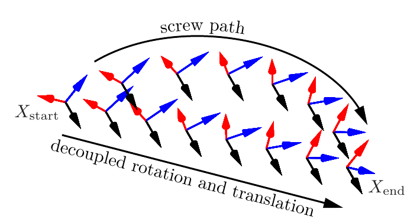

*Book Figure 9.2: the same endpoint poses admit different geometric paths. The lower path keeps the origin on a Cartesian straight line; the upper path follows one fixed screw. Neither implies constant speed in time until $s(t)$ is chosen.*

Both constructions stay in $SE(3)$, but neither guarantees joint feasibility. A consistent rotation-logarithm branch is also needed; a principal logarithm alone does not specify a deliberate multi-turn rotation.

#### 9.2.2 Time Scaling a Straight-Line Path

For the joint line, geometry is now fixed and $\theta''=0$, so

$$
\dot\theta=\Delta\theta\dot s,\qquad
\ddot\theta=\Delta\theta\ddot s.
$$

Suppose joint limits are symmetric constants $|\dot\theta_i|\leq\bar v_i$ and $|\ddot\theta_i|\leq\bar a_i$. The most restrictive moving joint sets scalar path limits:

$$
v_{\max}=\min_{i:\Delta\theta_i\ne0}\frac{\bar v_i}{|\Delta\theta_i|},\qquad
a_{\max}=\min_{i:\Delta\theta_i\ne0}\frac{\bar a_i}{|\Delta\theta_i|}.
$$

These are limits on $\dot s$ and $|\ddot s|$, with units $\mathrm{s}^{-1}$ and $\mathrm{s}^{-2}$. Stationary joints impose no bound through these ratios. If every joint is stationary, no motion profile is needed.

**Running example:** use two revolute coordinates, $\theta_{\mathrm{start}}=(0,0)$, $\theta_{\mathrm{end}}=(1,0.5)\,\mathrm{rad}$, $\bar v=(1,0.75)\,\mathrm{rad}/\mathrm{s}$, and $\bar a=(2,1)\,\mathrm{rad}/\mathrm{s}^2$. Then $v_{\max}=1$ and $a_{\max}=2$. We will change the timing while preserving the same line in joint space.

##### Cubic: enforce endpoint positions and velocities

Let $s(t)=a_0+a_1t+a_2t^2+a_3t^3$. The four constraints $s(0)=0$, $s(T)=1$, and $\dot s(0)=\dot s(T)=0$ determine its four coefficients. With normalized time $u=t/T$:

$$
s=3u^2-2u^3,\qquad
\dot s=\frac{6u(1-u)}{T},\qquad
\ddot s=\frac{6-12u}{T^2}.
$$

The peak speed occurs at $u=1/2$, and the largest acceleration magnitude occurs at the endpoints:

$$
\max\dot s=\frac{3}{2T},\qquad
\max|\ddot s|=\frac{6}{T^2},\qquad
\boxed{T\geq\max\!\left(\frac{3}{2v_{\max}},\sqrt{\frac6{a_{\max}}}\right).}
$$

For the running example, the shortest duration **within this cubic family** is $T=\sqrt3\approx1.732$ s. It is not the fastest trajectory among all possible time scalings.

The drawback appears when joining this motion to stationary intervals: acceleration jumps from zero to $6/T^2$ at the start and back to zero at the end. The derivative of acceleration, **jerk**, contains ideal impulses at those joins, which can excite vibration.

##### Quintic: also enforce endpoint accelerations

Adding $\ddot s(0)=\ddot s(T)=0$ gives six constraints, requiring a fifth-degree polynomial:

$$
s=10u^3-15u^4+6u^5,\qquad
\dot s=\frac{30u^2(1-u)^2}{T},\qquad
\ddot s=\frac{60u(1-u)(1-2u)}{T^2}.
$$

Its maximum speed is $15/(8T)$ at $u=1/2$. Its acceleration extrema occur at $u=(3\mp\sqrt3)/6$ and have magnitude $10/(\sqrt3T^2)$. Thus

$$
\boxed{T\geq\max\!\left(\frac{15}{8v_{\max}},
\sqrt{\frac{10}{\sqrt3\,a_{\max}}}\right).}
$$

For the same example, $T_{\min}=1.875$ s. The quintic is smoother at the boundaries, but its higher peak speed at a fixed duration can require more time. Acceleration is continuous when joined to rest; jerk remains finite but can jump. Smoothness and time optimality are different design objectives.

##### Trapezoidal and triangular velocity profiles

To finish as quickly as possible under **constant path-speed and path-acceleration bounds**, accelerate at $a$, coast at $v$, then decelerate at $-a$, choosing $a=a_{\max}$ and $v=v_{\max}$. Let $t_a=v/a$. The area under $\dot s(t)$ must equal the normalized path length 1:

$$
1=v(T-t_a),\qquad
T=\frac1v+\frac va,\qquad
t_v=T-2t_a=\frac1v-\frac va.
$$

A nonnegative coasting duration requires $v^2/a\leq1$. For this case,

$$
s(t)=\begin{cases}
\tfrac12at^2,&0\leq t\leq t_a,\\
vt-\tfrac{v^2}{2a},&t_a\leq t\leq T-t_a,\\
1-\tfrac12a(T-t)^2,&T-t_a\leq t\leq T.
\end{cases}
$$

The corresponding velocities are $at$, $v$, and $a(T-t)$; accelerations are $a$, $0$, and $-a$. In the running example, $t_a=0.5$ s, $t_v=0.5$ s, and $T=1.5$ s, faster than either polynomial family but with acceleration jumps.

If $v_{\max}^2/a_{\max}>1$, there is not enough distance to reach the speed limit and stop. The profile is **triangular**, with

$$
v_{\mathrm{peak}}=\sqrt{a_{\max}},\qquad
t_a=\frac1{\sqrt{a_{\max}}},\qquad
T=\frac2{\sqrt{a_{\max}}}.
$$

These formulas use unit path length in $s$. At equality, the trapezoid has zero coasting time. For a prescribed duration, $v$, $a$, and $T$ cannot all be selected independently: they must satisfy the area constraint and the joint limits.

##### S-curve: bound jerk instead of stepping acceleration

Acceleration jumps motivate an additional constraint $|s^{(3)}|\leq J$. A symmetric seven-stage S-curve uses jerk values

$$
(+J,\ 0,\ -J,\ 0,\ -J,\ 0,\ +J).
$$

These stages ramp acceleration up, hold positive acceleration, ramp it to zero, coast, ramp to negative acceleration, hold it, and ramp back to zero. Position, velocity, and acceleration are continuous; jerk changes by finite steps.

For a profile that reaches both $a$ and $v$, let $t_J$ be each jerk-ramp duration, $t_A$ each constant-acceleration duration, and $t_V$ the coast duration. Integrating acceleration and requiring unit travel gives

$$
t_J=\frac aJ,\qquad t_A=\frac va-\frac aJ,\qquad
t_V=\frac1v-\frac va-\frac aJ,\qquad
T=4t_J+2t_A+t_V.
$$

These full-profile formulas require $t_A,t_V\geq0$. Negative values mean the assumed peak acceleration or speed cannot be attained: remove the corresponding stage and solve for reduced peaks, rather than accepting a negative duration.

To construct each segment from initial $(s_0,v_0,a_0)$ and constant jerk $j$, integrate over local time $h$:

$$
a(h)=a_0+jh,\quad
v(h)=v_0+a_0h+\tfrac12jh^2,\quad
s(h)=s_0+v_0h+\tfrac12a_0h^2+\tfrac16jh^3.
$$

Use each segment's endpoint as the next segment's initial state. For the running example, adding $J=8\,\mathrm{s}^{-3}$ gives $t_J=t_A=t_V=0.25$ s and $T=1.75$ s. On a joint-space line, joint jerk is $\Delta\theta\,s^{(3)}$; curved paths introduce additional geometric terms, so these scalar bounds alone are not sufficient for arbitrary paths.

These four profiles solve a fixed-path timing problem. If intermediate positions must instead be reached at specified times, it is often simpler to construct the coordinate histories directly.

### 9.3 Polynomial Via Point Trajectories

A **via point** specifies an intermediate configuration and its arrival time. The book constructs each joint history independently; use $\beta$ for one joint coordinate. Given $(\beta_j,\dot\beta_j)$ at time $T_j$ and $(\beta_{j+1},\dot\beta_{j+1})$ at $T_{j+1}$, define $h_j=T_{j+1}-T_j>0$ and local time $r=t-T_j$.

Four endpoint constraints determine one cubic segment:

$$
\beta(T_j+r)=a_{j0}+a_{j1}r+a_{j2}r^2+a_{j3}r^3,
\qquad 0\leq r\leq h_j,
$$

$$
\begin{aligned}
a_{j0}&=\beta_j,& a_{j1}&=\dot\beta_j,\\
a_{j2}&=\frac{3(\beta_{j+1}-\beta_j)}{h_j^2}
-\frac{2\dot\beta_j+\dot\beta_{j+1}}{h_j},\\
a_{j3}&=-\frac{2(\beta_{j+1}-\beta_j)}{h_j^3}
+\frac{\dot\beta_j+\dot\beta_{j+1}}{h_j^2}.
\end{aligned}
$$

Adjacent segments share the same position and velocity at their common via, making the trajectory $C^1$. Their accelerations generally differ: the preceding segment ends at $2a_{j2}+6a_{j3}h_j$, while the next begins at $2a_{j+1,2}$. Using quintics with a shared specified acceleration at each via makes the joins $C^2$.

**Example of why via velocities matter:** let times be $(0,1,2)$, positions $(0,1,0)$, and velocities $(0,1,0)$. The segments are

$$
\beta(t)=2t^2-t^3\quad(0\leq t\leq1),\qquad
\beta(1+r)=1+r-5r^2+3r^3\quad(0\leq r\leq1).
$$

At $t=1$, both give position 1 and velocity 1, but acceleration jumps from $-2$ to $-10$. The positive via velocity also forces overshoot before reversing: $\beta(1.1)=1.053>1$. Thus **legal via positions do not guarantee legal interpolated positions**, unlike joint-space straight-line interpolation inside a box.

Via timing and velocity choices therefore determine the path between vias as well as its speed. With only two points and zero endpoint velocities, this construction reduces to cubic time scaling of a straight line. With more points, check the whole trajectory for joint limits, collisions, velocities, and accelerations. B-spline control-point curves offer a convex-hull property, but generally do not pass through every control point; a convex hull containing an obstacle is not a collision-free guarantee.

### 9.4 Time-Optimal Time Scaling

The simple profiles assumed constant acceleration limits. [Chapter 8's dynamics](#81-lagrangian-formulation) explains why this is only an approximation: gravity, inertia, velocity coupling, and available actuator torque change with posture and speed.

Now assume a joint path $\theta(s)$ has already been chosen. The goal is to find its **fastest feasible timing**, not a faster alternative geometric path. In the book's no-tip-load model,

$$
M(\theta)\ddot\theta+c(\theta,\dot\theta)+g(\theta)=\tau,\qquad
\tau_i^{\min}(\theta,\dot\theta)\leq\tau_i\leq\tau_i^{\max}(\theta,\dot\theta).
$$

Torque bounds may depend on speed; for example, an electric motor's available torque can fall as its speed rises. No motor model from the skipped Section 8.9 is required below: the bounds are inputs to the calculation.

#### Reduce the dynamics to one progress coordinate

Substitute the chain-rule expressions from Section 9.1. Because $c(\theta,\dot\theta)$ is quadratic in joint velocity, all velocity-product terms acquire a factor $\dot s^2$:

$$
\boxed{\tau=m(s)\ddot s+c_p(s)\dot s^2+g_p(s),}
$$

$$
\begin{aligned}
m(s)&=M(\theta(s))\theta'(s),\\
(c_p)_i(s)&=(M(\theta(s))\theta''(s))_i
+\sum_{j,k}\Gamma_{ijk}(\theta(s))\theta'_j(s)\theta'_k(s),\\
g_p(s)&=g(\theta(s)).
\end{aligned}
$$

The book writes $c(s)$ and $g(s)$; subscripts here distinguish path coefficients from the earlier full dynamics functions. The $M\theta''$ term is essential: a curved path demands acceleration even at constant $\dot s$. The Christoffel term accounts for configuration-dependent inertial coupling; it can remain nonzero even on a straight joint-space path with $\theta''=0$.

Although $M$ is positive definite, **$m=M\theta'$ is an $n$-vector**, not a positive mass matrix: its components can be positive, negative, or zero. The scalar kinetic-energy coefficient along the path is instead $\theta'^TM\theta'$. This distinction determines the signs of the actuator inequalities.

#### Convert each torque limit into an acceleration interval

At a specified $(s,\dot s)$, set $b_i=(c_p)_i\dot s^2+(g_p)_i$. For $m_i\ne0$, actuator $i$ imposes

$$
L_i=\min\!\left(\frac{\tau_i^{\min}-b_i}{m_i},
\frac{\tau_i^{\max}-b_i}{m_i}\right),\qquad
U_i=\max\!\left(\frac{\tau_i^{\min}-b_i}{m_i},
\frac{\tau_i^{\max}-b_i}{m_i}\right).
$$

Taking the min/max handles reversal of the inequality when $m_i<0$. Every actuator must be satisfied simultaneously, so intersect the intervals:

$$
\boxed{L(s,\dot s)=\max_iL_i(s,\dot s),\qquad
U(s,\dot s)=\min_iU_i(s,\dot s),\qquad
L\leq\ddot s\leq U.}
$$

For example, if two actuators reduce locally to $-2\leq2\ddot s+1\leq4$ and $-1\leq-\ddot s\leq2$, their intervals are $[-1.5,1.5]$ and $[-2,1]$. The shared feasible interval is **$[-1.5,1]$**, not the union. The negative coefficient in the second actuator is why blindly dividing bounds without reordering fails.

If $m_i=0$, do not divide. Its torque is independent of $\ddot s$ at that state: check $\tau_i^{\min}\leq b_i\leq\tau_i^{\max}$ directly. Failure excludes the state; satisfaction leaves acceleration to the other actuators. This does not imply a singular robot mass matrix.

We have now converted an $n$-joint dynamics problem into a scalar timing problem with state-dependent acceleration limits. The remaining question is how to choose accelerations now while preserving the ability to slow down later.

#### 9.4.1 The Phase Plane

Plot $s$ horizontally and $\dot s$ vertically. A rest-to-rest trajectory moves rightward from $(0,0)$ to $(1,0)$. Its time-domain tangent is

$$
\frac{d}{dt}\begin{bmatrix}s\\\dot s\end{bmatrix}
=\begin{bmatrix}\dot s\\\ddot s\end{bmatrix},\qquad L\leq\ddot s\leq U.
$$

Thus the vectors $(\dot s,L)$ and $(\dot s,U)$ bound a **motion cone**. For $\dot s>0$, the phase-curve slope is $d\dot s/ds=\ddot s/\dot s$, not simply $\ddot s$.

* $L<U$: a range of accelerations is available.
* $L=U$: exactly one acceleration remains; the cone collapses to one direction.
* $L>U$: no acceleration satisfies every actuator; the state is inadmissible.

Under the book's regularity assumptions, feasible speeds at each $s$ form an interval from zero to a **velocity limit curve** $\dot s_{\lim}(s)$. This ceiling is induced by dynamics and torque limits, not just a separately specified motor-speed limit.

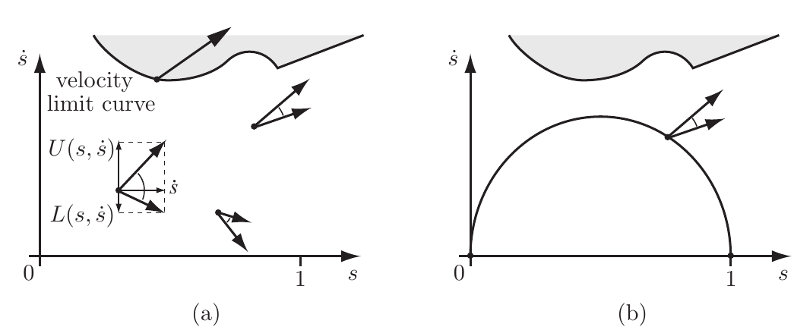

*Book Figure 9.11: the gray region is inadmissible. On the boundary the cone collapses; below it, a candidate trajectory is feasible only if its tangent lies inside the local cone. The right-hand example is below the ceiling but demands more braking than is available.*

The travel time can be written

$$
T=\int_0^Tdt=\int_0^1\frac{1}{\dot s(s)}\,ds.
$$

The endpoint singularities are interpreted as limits; ordinary rest-to-rest acceleration profiles have finite travel time. Larger feasible speed reduces time, but **being below the speed ceiling is not enough**: the trajectory must also be reachable from the start and able to brake to the goal.

#### 9.4.2 The Time-Scaling Algorithm

##### First understand the single-switch case

Integrate $\ddot s=U(s,\dot s)$ forward from $(0,0)$ to find the fastest acceleration curve. Integrate $\ddot s=L(s,\dot s)$ **backward in time** from $(1,0)$ to find states from which maximum braking reaches the goal. If they intersect without violating the velocity limit curve, switch from $U$ to $L$ at the intersection.

The backward integration still uses the forward-time acceleration law $L$; it does not mean negating $L$ and then running forward. At rest, $\ddot s/\dot s$ is undefined, so integrate $(\dot s,\ddot s)$ in time or use a numerical reformulation rather than dividing by zero.

For the simple constant bounds $U=a$, $L=-a$, the two curves satisfy

$$
\dot s_{\mathrm{forward}}=\sqrt{2as},\qquad
\dot s_{\mathrm{braking}}=\sqrt{2a(1-s)}.
$$

They meet at $s=1/2$, with peak speed $\sqrt a$ and total time $2/\sqrt a$: **the triangular profile reappears as a phase-plane solution**. Adding the running example's constant speed cap $\dot s\leq1$ with $a=2$ requires coasting, giving the previously derived 1.5 s trapezoid.

##### Why a speed bottleneck requires additional switches

A forward maximum-acceleration curve can hit an inadmissible region before reaching the final braking curve. Continuing to accelerate is impossible, and waiting until the boundary to brake may be too late. The algorithm finds an earlier braking switch that passes a bottleneck at a tangent point, then accelerates again.

The book's construction, under its stated assumptions, is:

1. **Build the final braking curve $F$.** Integrate $L$ backward from $(1,0)$ until $s=0$ or the velocity limit curve is reached.
2. **Build a forward acceleration curve $A$.** From the current starting/switch state, integrate $U$. If it meets $F$ first, record the $U\rightarrow L$ switch and finish along $F$.
3. **If $A$ reaches the ceiling first**, record the contact abscissa $s_{\lim}$ and search speeds between zero and the ceiling at that abscissa. For each test speed, integrate $L$ forward. A curve penetrating the ceiling starts too fast; a curve dropping to zero starts too slowly. Binary search for the limiting curve that just touches the ceiling, giving a tangent state $(s_{\tan},\dot s_{\tan})$.
4. **Find where braking must start.** Integrate $L$ backward from that tangent state until it intersects the preceding $A$. This intersection is the earlier $U\rightarrow L$ switch; keep the braking segment from there to the tangent.
5. **Accelerate after the bottleneck.** At the tangent state, switch $L\rightarrow U$ and repeat from step 2 until the final braking curve is reached.

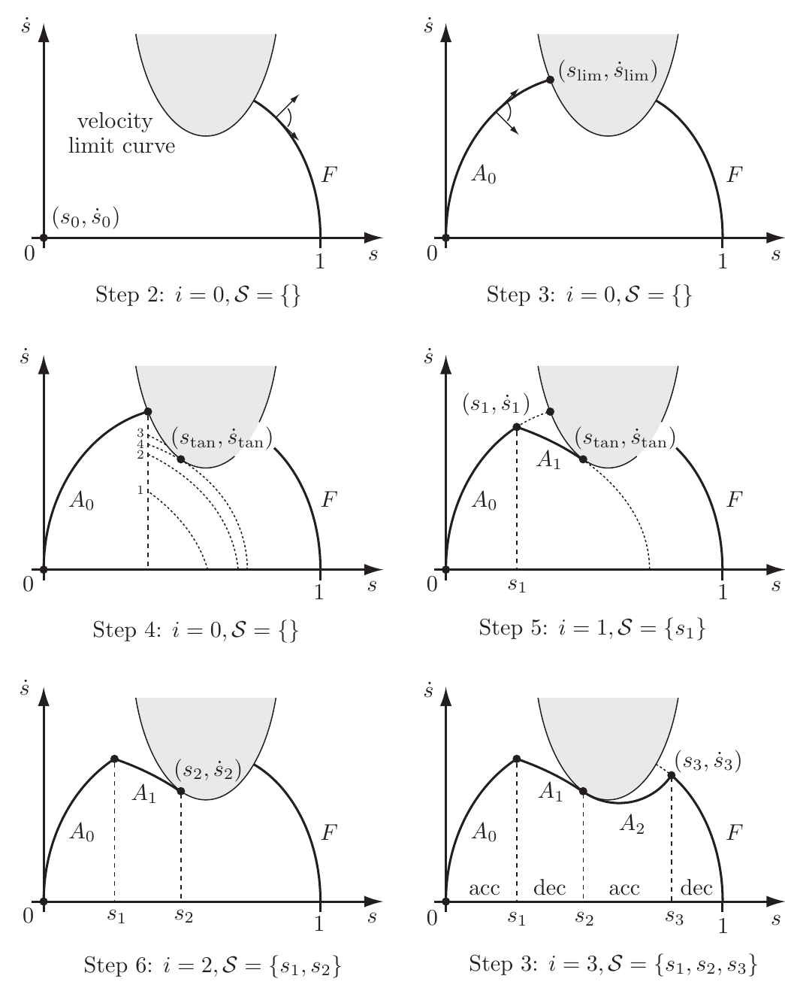

*Book Figure 9.13: $F$ is the goal-reaching braking curve. The intermediate tangent requires braking before the bottleneck and acceleration afterward, producing the sequence acceleration, deceleration, acceleration, deceleration. The figure's step labels refer to the book's six-step version of the same construction.*

"Maximum acceleration" means the largest **permitted path acceleration** $U$; it need not be positive at every state. Similarly, $L$ is the smallest permitted acceleration, not necessarily a fixed negative number. On regular optimal arcs, at least one actuator bound is active, but the limiting actuator can change along the path.

#### 9.4.3 Searching the Velocity Limit Curve

Instead of the binary search, explicitly construct $\dot s_{\lim}(s)$ and locate tangent states. At a differentiable regular boundary with $L=U$, tangency requires

$$
L(s,\dot s_{\lim})=U(s,\dot s_{\lim})
=\dot s_{\lim}\frac{d\dot s_{\lim}}{ds}.
$$

This comes from equating the boundary slope to the motion slope $\ddot s/\dot s$. A boundary point with a different feasible tangent cannot be traversed through smoothly while remaining admissible on both sides. Tangent candidates still have to be connected to the start/goal curves; finding one does not by itself solve the trajectory.

#### 9.4.4 Assumptions and Caveats

The simple algorithm is not a universal planner. Its assumptions explain both its usefulness and its limits:

* **Static support:** along the path, gravity compensation must lie within actuator bounds so sufficiently slow motions are feasible. Weak actuators can instead require momentum to cross certain postures; the simple algorithm does not cover that case. Boundary cases with no torque margin require additional care.
* **One feasible speed interval:** for each $s$, all speeds below one positive ceiling are assumed admissible. Friction or more complex actuator models can produce disconnected feasible regions.
* **Regular path dynamics:** zero-inertia components $m_i=0$ require direct speed-feasibility checks. Singular boundary arcs can require an acceleration between $L$ and $U$ that follows the boundary, rather than rapid switching between extremes.
* **No jerk constraint in this formulation:** bang-bang acceleration can jump, so torque feasibility does not imply vibration-free motion. A boundary-following/coasting arc is also possible when additional speed constraints are active.
* **Model and feedback margin:** model errors, friction, and disturbances matter. An actuator-saturated nominal solution may leave no effort for tracking corrections. Practical execution usually reserves margin rather than using the theoretical optimum unchanged.

The central result is therefore a capability bound **for a fixed path and specified dynamics/constraints**. A different path may be faster, and a slightly slower timing may track much more reliably.

### 9.5 Summary and Formula Sheet

The chapter moves from geometry to progressively stronger timing requirements:

| Need | Construction | Main qualification |
|:--|:--|:--|
| Simple endpoint motion | Joint line + cubic | Endpoint acceleration jumps when joined to rest |
| Smooth start and stop | Joint line + quintic | Zero endpoint acceleration is not global time optimality |
| Fast motion with constant speed/acceleration limits | Trapezoid or triangle | Acceleration discontinuities; fixed joint-space line |
| Bounded jerk | S-curve | Some stages disappear on short motions |
| Timed intermediate configurations | Piecewise via-point polynomials | Check overshoot and derivative continuity |
| Fastest traversal under actuator limits | Path dynamics + phase-plane time scaling | Requires a feasible fixed path and the algorithm's assumptions |

| Concept | Formula |
|:--|:--|
| Path to trajectory | $\theta(t)=\theta(s(t))$ |
| Velocity and acceleration | $\dot\theta=\theta'\dot s$, $\ddot\theta=\theta'\ddot s+\theta''\dot s^2$ |
| Joint line | $\theta(s)=\theta_{\mathrm{start}}+s\Delta\theta$ |
| Screw path | $X(s)=X_{\mathrm{start}}\exp(s\log(X_{\mathrm{start}}^{-1}X_{\mathrm{end}}))$ |
| Cubic scaling, $u=t/T$ | $s=3u^2-2u^3$ |
| Quintic scaling | $s=10u^3-15u^4+6u^5$ |
| Trapezoid duration for unit progress | $T=1/v+v/a$, requiring $v^2/a\leq1$ |
| Triangle duration | $T=2/\sqrt a$, $v_{\mathrm{peak}}=\sqrt a$ |
| Path-constrained dynamics | $\tau=m\ddot s+c_p\dot s^2+g_p$ |
| Shared acceleration interval | $L=\max_iL_i$, $U=\min_iU_i$ |
| Phase-plane slope | $d\dot s/ds=\ddot s/\dot s$ for $\dot s>0$ |
| Travel time | $T=\int_0^1(1/\dot s(s))\,ds$ |

### 9.6 Software and Worked Implementation

The book provides these Modern Robotics library functions:

| Operation | Function and output |
|:--|:--|
| Cubic progress | `CubicTimeScaling(Tf, t)` returns scalar $s(t)$ |
| Quintic progress | `QuinticTimeScaling(Tf, t)` returns scalar $s(t)$ |
| Joint-space trajectory | `JointTrajectory(thetastart, thetaend, Tf, N, method)` returns an $N\times n$ array |
| Constant-screw trajectory | `ScrewTrajectory(Xstart, Xend, Tf, N, method)` returns $N$ poses |
| Decoupled Cartesian trajectory | `CartesianTrajectory(Xstart, Xend, Tf, N, method)` returns $N$ poses |

`method` is `3` or `5` for cubic or quintic scaling. Samples include both endpoints, with spacing `Tf / (N - 1)` and `N >= 2`. The pose generators do not solve IK or check collisions, and these functions do not automatically select a feasible duration or implement the torque-constrained time-optimal algorithm.

The following standalone NumPy example implements the chapter's polynomial formulas and via-point coefficients. Run the block in a Python notebook/REPL with NumPy installed, or as `python3 <script_path>`. It checks the running example's endpoints and kinematic limits; it is **not** a general trajectory planner or a test of torque feasibility.

```python
import numpy as np


def polynomial_scaling(t, duration, order=5):
    t = np.asarray(t, dtype=float)
    if duration <= 0 or np.any(t < 0) or np.any(t > duration):
        raise ValueError("Require duration > 0 and 0 <= t <= duration")
    u = t / duration
    if order == 3:
        s = 3 * u**2 - 2 * u**3
        ds = 6 * u * (1 - u) / duration
        dds = (6 - 12 * u) / duration**2
    elif order == 5:
        s = 10 * u**3 - 15 * u**4 + 6 * u**5
        ds = 30 * u**2 * (1 - u)**2 / duration
        dds = 60 * u * (1 - u) * (1 - 2 * u) / duration**2
    else:
        raise ValueError("order must be 3 or 5")
    return s, ds, dds


def minimum_polynomial_duration(delta, velocity_limits,
                                acceleration_limits, order=5):
    delta = np.abs(np.asarray(delta, dtype=float))
    vlim = np.asarray(velocity_limits, dtype=float)
    alim = np.asarray(acceleration_limits, dtype=float)
    if delta.shape != vlim.shape or delta.shape != alim.shape:
        raise ValueError("Displacements and limits must have equal shapes")
    if np.any(vlim <= 0) or np.any(alim <= 0):
        raise ValueError("Limits must be positive")
    if order == 3:
        peak_v, peak_a = 1.5, 6.0
    elif order == 5:
        peak_v, peak_a = 15 / 8, 10 / np.sqrt(3)
    else:
        raise ValueError("order must be 3 or 5")
    return max(np.max(peak_v * delta / vlim),
               np.max(np.sqrt(peak_a * delta / alim)))


def cubic_via_coefficients(p0, p1, v0, v1, duration):
    if duration <= 0:
        raise ValueError("Via times must strictly increase")
    h = duration
    return np.array([p0, v0,
                     3 * (p1 - p0) / h**2 - (2 * v0 + v1) / h,
                     -2 * (p1 - p0) / h**3 + (v0 + v1) / h**2])


start = np.array([0.0, 0.0])
goal = np.array([1.0, 0.5])
vlim = np.array([1.0, 0.75])
alim = np.array([2.0, 1.0])
delta = goal - start
T3 = minimum_polynomial_duration(delta, vlim, alim, order=3)
T5 = minimum_polynomial_duration(delta, vlim, alim, order=5)
assert np.isclose(T3, np.sqrt(3))
assert np.isclose(T5, 1.875)

for order, duration in [(3, T3), (5, T5)]:
    t = np.linspace(0, duration, 1001)
    s, ds, dds = polynomial_scaling(t, duration, order)
    theta = start + s[:, None] * delta
    dtheta = ds[:, None] * delta
    ddtheta = dds[:, None] * delta
    assert np.allclose(theta[[0, -1]], [start, goal])
    assert np.allclose(dtheta[[0, -1]], 0)
    assert np.all(np.abs(dtheta) <= vlim + 1e-10)
    assert np.all(np.abs(ddtheta) <= alim + 1e-10)
    if order == 5:
        assert np.allclose(ddtheta[[0, -1]], 0)
    print(f"order={order}, duration={duration:.6f} s")

left = cubic_via_coefficients(0, 1, 0, 1, 1)
right = cubic_via_coefficients(1, 0, 1, 0, 1)
assert np.allclose(left, [0, 0, 2, -1])
assert np.allclose(right, [1, 1, -5, 3])
assert np.isclose(np.polynomial.polynomial.polyval(0.1, right), 1.053)
print("Via accelerations:", 2 * left[2] + 6 * left[3], 2 * right[2])
# order=3, duration=1.732051 s
# order=5, duration=1.875000 s
# Via accelerations: -2.0 -10.0
```

The duration calculation uses analytic extrema, so its kinematic bound is stronger than merely observing that a finite sample grid passed. A zero-displacement request returns zero minimum duration; hold the configuration rather than calling the time-scaling function with $T=0$.

### Chapter 9 Common Confusions

| Confusion | Clarification |
|:--|:--|
| "A path specifies the motion speed." | A path specifies geometry; the time scaling supplies speed. |
| "Constant $\dot s$ means no acceleration." | Curvature contributes $\theta''\dot s^2$. |
| "Straight in joint space is straight in task space." | Nonlinear forward kinematics generally bends the endpoint path. |
| "Linear interpolation of transformation matrices is valid." | It generally leaves $SE(3)$; use exponential/logarithmic interpolation. |
| "A constant screw path has constant angular speed." | Its axis is fixed; time-domain speed depends on $\dot s$. |
| "Quintic is always faster than cubic because it is smoother." | Endpoint smoothness and peak velocity/acceleration are separate constraints. |
| "Every trapezoid reaches its requested top speed." | Short motions become triangular; the velocity ceiling may never be reached. |
| "Passing through legal vias guarantees a legal path." | Polynomial segments may overshoot or cross obstacles. |
| "Positive-definite $M$ makes every $m_i$ positive." | $m=M\theta'$ is a vector and may have negative or zero components. |
| "A point below the speed ceiling is part of a feasible trajectory." | Its incoming/outgoing slopes must also respect the local motion cone. |
| "$L=U$ is the same as $L>U$." | Equality permits one acceleration; strict inequality permits none. |
| "Time-optimal timing solves motion planning and tracking." | It optimizes a given path under a model; neither collision search nor feedback is supplied. |

### Chapter 9 Understanding Checklist

After this chapter, you should be able to:

* distinguish a path, a time scaling, and their composed trajectory;
* derive velocity and acceleration by the chain rule and explain the curvature term;
* choose between joint-space, screw, and decoupled Cartesian paths, identifying their feasibility risks;
* derive cubic and quintic scalings from endpoint constraints and select a duration from analytic extrema;
* construct a trapezoidal profile, detect its triangular limit, and explain why an S-curve adds jerk ramps;
* compute cubic via-point coefficients and check position, velocity, acceleration, and overshoot at joins;
* reduce Chapter 8's dynamics to $m\ddot s+c_p\dot s^2+g_p=\tau$;
* obtain $L,U$ from all actuator limits, including negative and zero coefficients;
* interpret motion cones and explain why the highest locally admissible speed may still be impossible to brake from;
* connect a triangular profile to forward acceleration and backward braking curves;
* explain why bottlenecks require earlier braking and additional tangent switches;
* state the assumptions and practical limitations of the time-optimal algorithm;
* use the chapter's trajectory generators without assuming they check IK, collisions, or torque limits.
