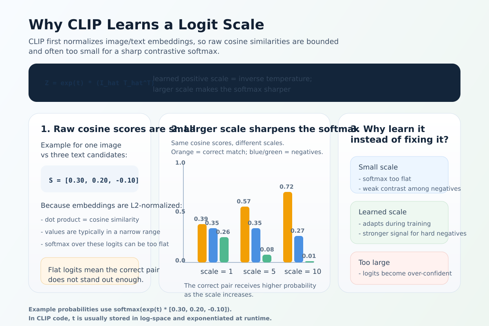

# [CLIP: Contrastive Language-Image Pre-training](https://arxiv.org/abs/2103.00020)

## 1. Overview & Motivation
- **Core Idea**: Learn visual representations directly from natural language supervision (internet image-text pairs) instead of fixed-class labeled datasets like ImageNet.
- **Why it matters**: Traditional supervised models are limited to pre-defined categories and require task-specific fine-tuning. CLIP enables **zero-shot transfer** – the model can classify or retrieve images for new concepts just by providing text descriptions.
- **Dataset**: 400 million (image, text) pairs collected from the internet (WIT – WebImageText).
- **Key Capability**: Joint multimodal embedding space where matching image-text pairs are aligned (high cosine similarity), mismatches are pushed apart.
- **Impact**: Foundational for modern open-vocabulary vision, image generation (Stable Diffusion uses CLIP embeddings), and multimodal LLMs.

## 2. Model Architecture
CLIP consists of **two independent encoders** that map images and text into a shared embedding space.

### 2.1 Image Encoder
Two families explored (ViT performs best at scale):

| Variant                  | Description                                                                 | Best Zero-Shot ImageNet |
|--------------------------|-----------------------------------------------------------------------------|--------------------------|
| Modified ResNet          | ResNet-50/101 with improvements:<br>• ResNet-D downsampling<br>• Anti-aliased blur pooling (reduces aliasing artifacts)<br>• Attention pooling (multi-head QKV where query = global avg pool, keys/values = feature map) | ~70–74%                 |
| Vision Transformer (ViT) | Patch-based (16×16 or 32×32), standard with minor tweaks (extra LN, different init) | **ViT-L/14@336px: 76.2%** (top model) |

- Output: Global feature vector (after pooling) → linear projection → L2-normalized embedding.

### 2.2 Text Encoder
- Transformer (GPT-2 style, causal/masked attention).
- Vocabulary: Lower-cased Byte-Pair Encoding (49,152 tokens).
- Max length: 77 tokens (context length, including special tokens).
- Input: Text wrapped with [SOS] and [EOS] tokens.
- **Feature extraction**: Hidden state of the **[EOS]** token (aggregates full sequence context) → layer norm → linear projection → L2-normalized embedding.
- Sizes: 63M parameters base (12 layers, 512 width, 8 heads); scaled by width to match image encoder.

### 2.3 Projection to Shared Space
- Separate linear layers (no bias) for image and text → fixed dimension (512–1024).
- Final embeddings are **L2-normalized** → cosine similarity = dot product.

## 3. Pre-training Objective (Contrastive Loss)
- **Task**: Given batch of N real (image, text) pairs, predict which image matches which text.
- **Symmetric InfoNCE-style loss**:

For L2-normalized image embeddings $\hat{I} \in \mathbb{R}^{N \times d}$ and text embeddings $\hat{T} \in \mathbb{R}^{N \times d}$:

$$
S = \hat{I}\hat{T}^{\top}
$$

$$
Z = \exp(t) \cdot S
$$

where $t$ is a learned **logit scale** parameter. Many implementations store the parameter in log space and use `exp(t)` at runtime.

$$
\begin{aligned}
L_{i \rightarrow t} &= \operatorname{CE}(Z, \operatorname{diag\_labels}) \\
L_{t \rightarrow i} &= \operatorname{CE}(Z^{\top}, \operatorname{diag\_labels}) \\
L &= \frac{L_{i \rightarrow t} + L_{t \rightarrow i}}{2}
\end{aligned}
$$

with:

$$
\operatorname{diag\_labels} = [0, 1, \dots, N-1]
$$

Equivalently, written out as row-wise softmax losses:

$$
\begin{aligned}
L_{i \rightarrow t}
&= - \frac{1}{N} \sum_{i=1}^{N}
\log \frac{\exp(Z_{ii})}{\sum_{j=1}^{N} \exp(Z_{ij})} \\
L_{t \rightarrow i}
&= - \frac{1}{N} \sum_{i=1}^{N}
\log \frac{\exp(Z_{ii})}{\sum_{j=1}^{N} \exp(Z_{ji})}
\end{aligned}
$$

- **Why symmetric**: Ensures bidirectional alignment (image→text and text→image retrieval both strong).
- Batch size: 32,768 (many hard negatives → strong signal).

### Why CLIP uses a logit scale parameter



After L2 normalization, image-text similarities are cosine scores, so they are bounded and often numerically small. If we directly apply softmax to these raw scores, the distribution can be too flat:

* the positive pair does not stand out enough
* hard negatives are not penalized strongly enough
* the contrastive cross-entropy provides a weaker ranking signal

CLIP therefore learns a scalar multiplier:

$$
Z = \exp(t) \cdot \hat{I}\hat{T}^{\top}
$$

This parameter is often called `logit_scale`, and it is effectively an **inverse temperature**:

* **larger** `exp(t)` → sharper softmax, stronger separation between matched and mismatched pairs
* **smaller** `exp(t)` → flatter softmax, weaker discrimination

Why learn it instead of fixing it?

* The best sharpness changes during training.
* Different model sizes, batch sizes, and embedding distributions prefer different scales.
* A learned scale lets the model adapt automatically instead of relying on one hand-picked constant.

In practice, implementations usually store the parameter in log space and compute `exp(t)` at runtime. They also often clamp the maximum value for stability, because an excessively large scale can make the logits too confident and training less stable.

### PyTorch Implementation (Core Loss)
```python
import torch
import torch.nn.functional as F

def clip_loss(image_embeds, text_embeds, logit_scale):
    # [N, D] -> L2 normalize
    image_embeds = F.normalize(image_embeds, dim=-1)
    text_embeds = F.normalize(text_embeds, dim=-1)

    logits = image_embeds @ text_embeds.T * logit_scale.exp()
    labels = torch.arange(len(logits), device=logits.device)

    loss_i2t = F.cross_entropy(logits, labels)
    loss_t2i = F.cross_entropy(logits.T, labels)
    return (loss_i2t + loss_t2i) / 2
```

### Text Encoder EOS Pooling (Real Hugging Face Code Example)
```python
pooled_output = last_hidden_state[
    torch.arange(last_hidden_state.shape[0], device=last_hidden_state.device),
    (input_ids == self.eos_token_id).int().argmax(dim=-1)
]
```
- Dynamically finds first [EOS] position → avoids padding artifacts.

## 4. Zero-Shot Inference
- No fine-tuning needed.
- For classification with classes {c₁, c₂, ...}:
  1. Create prompted texts: e.g., "a photo of a {c_i}."
  2. Encode texts → text embeddings T.
  3. Encode image → image embedding I.
  4. Probabilities: softmax(I · T * exp(t))

### PyTorch Zero-Shot Example (Hugging Face / OpenCLIP style)
```python
from transformers import CLIPProcessor, CLIPModel
import torch.nn.functional as F

model = CLIPModel.from_pretrained("openai/clip-vit-large-patch14")
processor = CLIPProcessor.from_pretrained("openai/clip-vit-large-patch14")

classes = ["dog", "cat", "car"]
prompts = [f"a photo of a {c}." for c in classes]

text_inputs = processor(text=prompts, return_tensors="pt", padding=True)
with torch.no_grad():
    text_features = model.get_text_features(**text_inputs)
    text_features = F.normalize(text_features, dim=-1)

image_inputs = processor(images=your_images, return_tensors="pt")
with torch.no_grad():
    image_features = model.get_image_features(**image_inputs.pixel_values)
    image_features = F.normalize(image_features, dim=-1)

logits = image_features @ text_features.T * model.logit_scale.exp()
probs = logits.softmax(dim=-1)
```

- **Prompt engineering**: Ensembles of 80+ templates improve ImageNet zero-shot to ~76%.

## 5. Key Results & Efficiency
- **Zero-shot ImageNet**: ViT-L/14@336px → 76.2% top-1 (matches supervised ResNet-50).
- Strong on 30+ datasets: OCR, action recognition, geo-localization, fine-grained classification.
- **Efficiency (Figure 2)**: Contrastive objective is ~12× more sample-efficient than predictive captioning.
- Scaling: Performance increases predictably with compute (similar to GPT scaling laws).

## 6. Modern Comparison: CLIP vs. SigLIP (2023/2025)
| Aspect               | Original CLIP (2021)                  | SigLIP (2023+)                          |
|----------------------|---------------------------------------|-----------------------------------------|
| Loss                 | Softmax contrastive (InfoNCE)        | Pairwise sigmoid + bias                |
| Batch size dependence| Needs very large batches (32k+)      | Performs well at smaller batches       |
| Memory efficiency    | O(N²) similarity matrix              | Lower memory, easier distributed       |
| Zero-shot ImageNet   | ~76% (ViT-L)                         | ~84–88% (same size)                    |
| Modern usage         | Historical baseline                  | Preferred (PaliGemma, many open models)|

## 7. Practical Tips for PyTorch Implementation
- Use **OpenCLIP** repo (`mlfoundations/open_clip`) for reproductions and training.
- Hugging Face: `openai/clip-*` models for inference.
- For training from scratch: Large batches + mixed precision + gradient checkpointing essential.
- Common pitfalls: Padding in text encoder (always use dynamic EOS pooling), temperature scaling.

These notes cover the full paper and practical PyTorch aspects. CLIP remains the foundational contrastive VLM paradigm!
