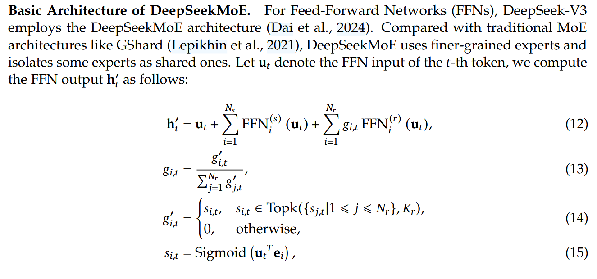
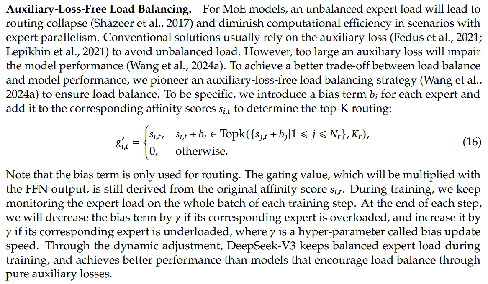
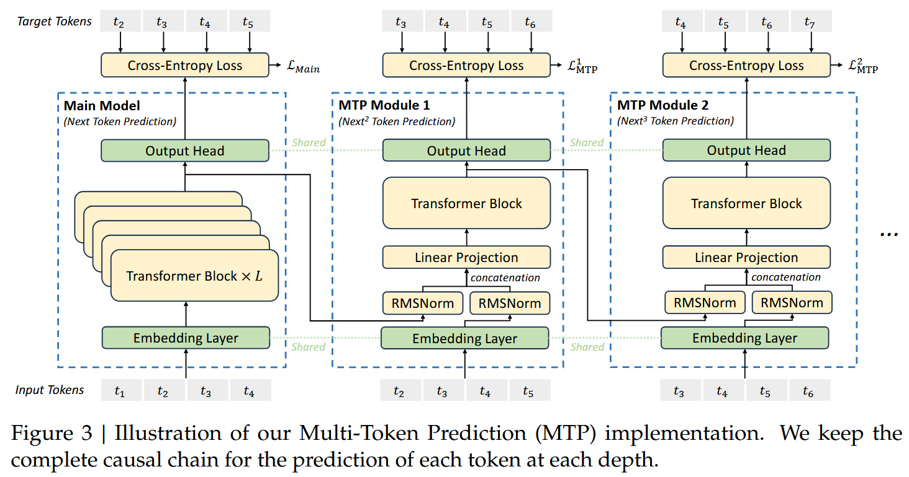

# [DeepSeek-V3](https://arxiv.org/abs/2412.19437v1)

## Convenient Links
* [Github](https://github.com/deepseek-ai/DeepSeek-V3)
* Hugging face:
    * [DeepSeek-V3-Base](https://huggingface.co/deepseek-ai/DeepSeek-V3-Base)
    * [DeepSeek-V3](https://huggingface.co/deepseek-ai/DeepSeek-V3)

## Compare Table with [DeepSeek-V2](./DeepSeek_V2.md)
|Component|DeepSeek-V2|DeepSeek-V3|Why the Change/Improvement?|
|:---:|:---:|:---:|:---:|
|Total parameters|236B|671B|Larger scale for stronger capabilities|
|Activated per token|21B|37B|More active capacity → better reasoning|
|Attention mechanism|MLA (latent KV compression)|MLA (same, further matured)|Proven KV cache savings|
|MoE design|DeepSeekMoE with auxiliary loss|DeepSeekMoE with **auxiliary-loss-free** balancing|Removes unstable auxiliary loss term|
|Training objective|Standard next-token prediction|**Multi-token prediction** (predict multiple future tokens)|Accelerates learning & improves performance|
|Context length|128K|128K (same, but more stable at scale)|—|

## Detailed Notes on DeepSeek-V3 (Technical Report, December 2024)

### Overview & Abstract Highlights
- **Model Specs**: Mixture-of-Experts (MoE) with **671B total parameters**, **37B activated per token**.
- **Context Length**: 128K tokens.
- **Key Innovations** (building on DeepSeek-V2):
  - Multi-head Latent Attention (MLA) for efficient KV cache.
  - DeepSeekMoE with **auxiliary-loss-free** load balancing (major stability upgrade).
  - **Multi-token prediction (MTP)** training objective for stronger reasoning.
- **Training**: Pre-trained on **14.8T** diverse, high-quality tokens.
  - Full training cost: **2.788M H800 GPU hours** (~3 months on large cluster).
  - **Zero irrecoverable loss spikes or rollbacks** – exceptionally stable.
- **Performance**:
  - Outperforms all open-source models at release.
  - Comparable to closed-source leaders (e.g., GPT-4o, Claude-3.5-Sonnet) on many benchmarks.
  - Especially strong in math, coding, reasoning.
- **Release**: Checkpoints at https://github.com/deepseek-ai/DeepSeek-V3.

### 1. Introduction
- Context: DeepSeek's progression – V1 (dense), V2 (MoE with MLA + DeepSeekMoE), V3 (matures both + new ideas).
- Goal: Achieve frontier-level performance with economical training and efficient inference.
- Key motivation: Validate V2 ideas at larger scale while fixing pain points (e.g., auxiliary loss instability).

### 2. Architecture (Core Model Structure – Detailed Breakdown)
This is the heart of V3. It reuses V2's validated components but refines them for scale and stability.

**2.1 Basic Architecture**
| Component                  | Details                                                                 | Key Benefit / Trade-off                                      |
|----------------------------|-------------------------------------------------------------------------|-------------------------------------------------------------|
| Total params               | 671B                                                                    | Massive capacity                                            |
| Active params per token    | 37B                                                                     | Stronger "thinking" per token vs. V2's 21B                  |
| Layers                     | Not explicitly stated, but MoE replaces FFN in most layers              | Sparse computation                                          |
| Attention                  | Multi-head Latent Attention (MLA)                                       | ~93% KV cache reduction (inherited from V2)                 |
| MoE                        | DeepSeekMoE (shared + routed experts)                                   | Economical training                                         |
| New: Load balancing        | **Auxiliary-loss-free**                                                 | No hyperparameter, more stable, better specialization       |
| New: Training objective    | **Multi-token prediction** (predict several future tokens)              | Better long-range reasoning; ~20-30% extra training compute |

**2.1.1 Multi-head Latent Attention (MLA)**
- Recap from V2: Compresses KV into low-rank latent vector (fixed small size).
- Mechanics:
  - Joint low-rank compression of K and V.
  - Decoupled RoPE (rotary embeddings applied separately).
- Why it works: KV cache size becomes independent of sequence length → huge inference speedup for long contexts.
- Nuance: Slight compression rank tuning needed; too low → minor quality drop.

**2.1.2 DeepSeekMoE with Auxiliary-Loss-Free Load Balancing**
- Standard MoE issue: Routers can collapse (all tokens to few experts) → auxiliary loss traditionally used to penalize imbalance.

- V3 innovation: **Remove auxiliary loss entirely**.
  - Achieved via careful initialization, routing design, and architectural priors.
  - Natural balancing emerges → clearer expert specialization (see Appendix C visualizations).
- Benefits:
  - Eliminates unstable hyperparameter.
  - Contributes to zero loss spikes.
  - Slightly better performance than aux-loss version.
- Trade-off: Requires precise engineering; not plug-and-play like older MoE.

**2.2 Multi-Token Prediction (MTP)**

- Standard: Predict only next token.
- MTP: Lightweight auxiliary heads predict multiple future tokens (e.g., 4–8) from intermediate layers.
- Discarded at inference → zero extra cost.
- Benefits:
  - Direct supervision to early layers → faster credit assignment.
  - Better modeling of long dependencies → big gains in math/coding/reasoning.
- Ablations (Section 4.5.1): Clear uplift; optimal around 4–8 tokens.

### 3. Infrastructures (Engineering for Efficiency & Stability)
- **Compute**: Large H800 clusters.
- **Framework Highlights**:
  - DualPipe + comp/comm overlap.
  - Optimized all-to-all (MoE routing bottleneck).
  - Memory-saving tricks.
- **FP8 Mixed Precision** (huge cost saver):
  - Forward/backward in [FP8](../Math/dtypes.md), master weights in BF16.
  - Custom quantization handles outliers.
  - Result: ~2× memory/throughput gain, negligible quality loss (Appendix B).
- **Inference**: Fast prefilling + decoding via MLA.
- **Hardware Suggestions**: Better interconnects and FP8-native cores.

### 4. Pre-Training
- **Data**: 14.8T tokens (high-quality, diverse: web, books, code, math).
- **Hyperparameters**: Standard AdamW, cosine LR, large batch.
- **Long Context**: 128K via careful extension (YaRN-style).
- **Ablations**:
  - MTP: Strong gains.
  - Aux-loss-free: Better stability/specialization.
  - Batch-wise vs sequence-wise balance: Batch-wise preferred.

### 5. Post-Training (Alignment)
- **SFT**: High-quality instruction data.
- **RL**: 
  - Custom reward model.
  - Group Relative Policy Optimization (GRPO).
- **Evaluations**:
  - Standard benchmarks: Tops open-source, matches closed.
  - Open-ended: Strong reasoning, helpfulness.
  - As reward model: Effective for self-rewarding loops.
- **Discussions**: Distillation, self-rewarding, MTP effects post-RL.

### 6. Conclusion & Limitations
- Achievements: Frontier performance, low cost, extreme stability.
- Limitations: Still 128K context (not ultra-long), hardware-bound all-to-all.
- Future: Longer contexts, multimodal, better hardware utilization.

### Appendices
- B: FP8 ablations (near-zero loss vs BF16).
- C: Expert specialization visualizations (aux-loss-free has cleaner patterns).
