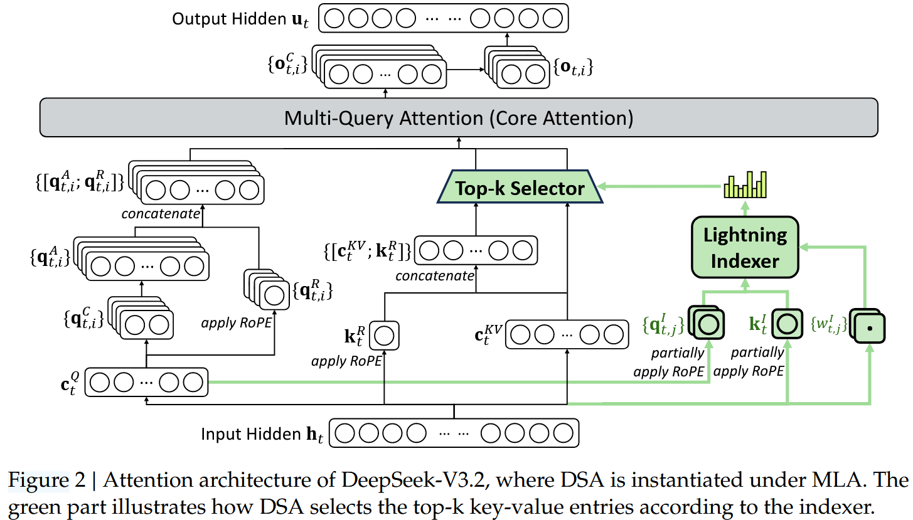
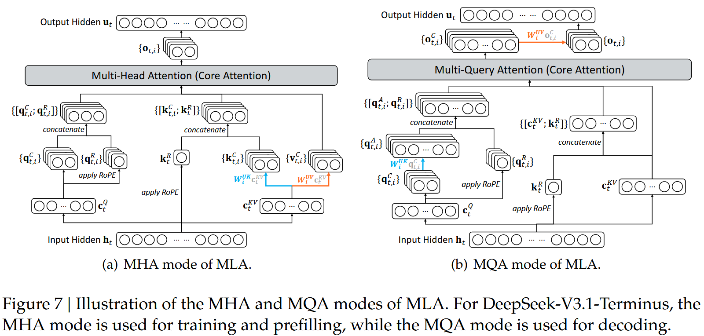
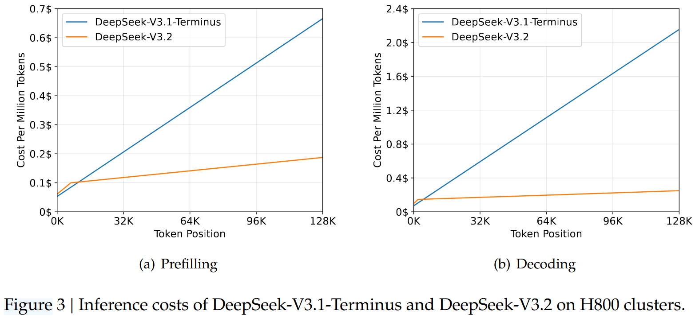

# [DeepSeek-V3.2](https://arxiv.org/abs/2512.02556)

**DeepSeek-V3.2** aims to **close the gap between open and frontier closed LLMs** by improving **(a) long-context efficiency**, **(b) post-training RL scalability**, and **(c) agent/tool-use generalization**—without sacrificing performance. 

<!-- When we go deeper, the most important low-level questions will be:

What exactly is stored in the KV cache under MLA-MQA?

What vectors does the lightning indexer use for $q^I$, $k^I$, and why those?

How do they implement Top-k selection and gathering efficiently at 128K?

How does this interact with long-context prefill vs decoding? -->

---

## 1) High-level contributions (the “3 pillars”)

### 1. DeepSeek Sparse Attention (DSA)

A new attention mechanism that **keeps long-context performance** while **reducing attention compute** in long sequences. 

### 2. Scalable RL framework (post-training compute scaled hard)

They emphasize that open models often under-invest in post-training. V3.2 claims a **post-training compute budget >10% of pretraining cost**, enabling reasoning performance comparable to GPT-5 (and a “Speciale” variant that pushes further). 

### 3. Large-scale agentic task synthesis pipeline

A pipeline that generates **many tool-use environments + prompts**, then uses RL to train for **generalizable agent behavior** (not just overfitting to a narrow toolset). 

---

## 2) Architecture changes vs DeepSeek-V3.1 / V3 (what actually changes)

The paper states: relative to **DeepSeek-V3.1-Terminus**, the **only architectural modification** in V3.2 is **introducing DSA** via continued training. 

So you can think of V3.2 as:

* V3.1-Terminus base (128K)
  * swap dense attention for DSA (sparse selection)
  * heavy post-training RL + agent synthesis

---

## 3) DeepSeek Sparse Attention (DSA)

### 3.1 Core idea

Instead of attending to **all previous tokens** $O(L^2)$, each query token attends to **top-k selected tokens** $O(L·k)$, where $k ≪ L$. 

  
  

    <strong>Fig 1: Attention architecture of DeepSeek-V3.2.</strong>
  

### 3.2 Two-component design (Prototype)

**(A) Lightning Indexer**
Computes an **index score** $I_{t,s}$ between query token $h_t$ at position $t$ and each previous token $h_s$ at position $s$ to decide which tokens matter. Interpretation: “How likely is token $h_s$ to matter for token $h_t$?”

They define:
$$
I_{t,s}=\sum_{j=1}^{H_I} w^I_{t,j}\cdot \mathrm{ReLU}(q^I_{t,j}\cdot k^I_s)
$$

* $H_I$: number of indexer heads (small)
* $q^I_{t,j}$, $w^I_{t,j}$: derived from query token $h_t$
* $k^I_s$: derived from token $h_s$ shared across indexer heads
* ReLU chosen for throughput (Negative similarities contribute 0; Keeps computation simple and avoids exponentials here)
* Indexer can run efficiently (they mention FP8 feasibility). 

**(B) Fine-grained token selection**
For each query token $t$, pick the **top-k** tokens $s$ by index score $I_{t,s}$, retrieve only those KV entries, then run normal attention over that subset:
$$
u_t=\mathrm{Attn} (h_t, \{c_s \mid I_{t,s}\in \mathrm{Top}\text{-}k(I_{t,:})\} )
$$

### 3.3 How DSA is implemented inside MLA

They **instantiate DSA under MLA** (their [Multi-head Latent Attention](../Attention_Machanisms/MLA.md) setup from [earlier DeepSeek work](./DeepSeek_V2.md)) but specifically in a way that is kernel-efficient: they use **[MQA mode](../Attention_Machanisms/MQA.md)** so that each latent KV is shared across query heads. 

* The paper highlights a kernel-level constraint: **KV entries retrieved for sparse attention should be shareable across multiple query heads** for efficiency. so they choose MQA-mode MLA. 
  > If KV were per-head (classic full MHA), sparse retrieval would mean:
  > * either retrieving different KV sets per head (expensive / irregular)
  > * or doing awkward merging that kills throughput
* See Fig 1 for the architectural flow: “Lightning Indexer → Top-k Selector → Core attention uses only selected KV.”. 
* Fig 2 clarifies MLA’s **MHA vs MQA** modes. 

  
  

    <strong>Fig 2: Illustration of the MHA and MQA modes of MLA.</strong>
  

---

## 4) How they *train* DSA (continued pretraining)

They start from **DeepSeek-V3.1-Terminus** whose context length is already **128K**, then do continued pretraining in **two stages** with the same long-context data distribution. 

### 4.1 Stage 1: Dense warm-up (initialize the indexer)

* Keep **dense attention**
* **Freeze all parameters** except the lightning indexer
* Goal: make indexer outputs approximate the main attention distribution

**How they build the target distribution**

* For each query token $t$, aggregate main attention scores by summing over heads
* L1-normalize across sequence positions → target $p_{t,:}$

**Loss**
$$
L_I = \sum_t D_{KL} (p_{t,:} || \mathrm{Softmax}(I_{t,:}) )
$$

**Training settings:**
* LR: $10^{-3}$
* 1000 steps
* Each step: 16 sequences × 128K
* Total warm-up tokens: 2.1B 

### 4.2 Stage 2: Sparse training (turn on top-k selection)

* Enable token selection + train all model params to adapt to sparsity
* Still aligns indexer, but only on selected set $S_t={s \mid I_{t,s}\in\mathrm{Top}\text{-}k}$

**Loss becomes:**
$$
L_I = \sum_t D_{KL} (p_{t,S_t} || \mathrm{Softmax}(I_{t,S_t}) )
$$
Key training detail:

* They **detach the indexer input**: indexer learns only from $L_I$, main model learns only from LM loss. 

**Training settings:**

* LR: $7.3\times 10^{-6}$
* k = **2048 selected KV tokens** per query token
* 15000 steps
* Each step: 480 sequences × 128K
* Total tokens: 943.7B 

---

## 5) Efficiency & inference cost claims

### 5.1 Complexity

* Core attention reduced from **$O(L^2)$** to **$O(L·k)$** for $k≪L$. 
* Lightning indexer is still $O(L^2)$, but much cheaper than full attention and can run efficiently:
  * fewer heads ($H_I$ small)
  * simpler ops (ReLU, no full softmax over all heads for value mixing)
  * and they mention it can run efficiently (including FP8 feasibility)

### 5.2 Real service cost curves

Fig 3 shows **cost per million tokens vs token position** on H800 clusters (assumed cost: $2/GPU-hour). DeepSeek-V3.2 is cheaper than V3.1-Terminus for long-context prefilling and decoding. 

  
  

    <strong>Fig 3: Inference costs.</strong>
  

They also mention:

* For short-sequence prefilling they implement a “masked MHA mode” to simulate DSA for better short-context efficiency. 

---

## 6) Post-training pipeline (what happens after continued pretraining)

They say V3.2 keeps the same post-training pipeline as V3.2-Exp:

* **Specialist distillation**
* **Mixed RL training** (single RL stage mixing reasoning + agent + alignment) 

### 6.1 Specialist distillation

They train **specialist models** per domain (fine-tuned from the same V3.2 base checkpoint) with large-scale RL compute. Domains include:

* math, programming, general logical reasoning
* general agent tasks, agentic coding, agentic search
* each has thinking + non-thinking modes 

Then:

* Specialists generate domain data for the final model
* Distilled model is slightly below specialists, then RL “closes the gap.” 

### 6.2 Mixed RL training (GRPO)

They use **GRPO** and train on reasoning + agent + human alignment together to avoid catastrophic forgetting from multi-stage RL. 

Rewards mentioned:

* For reasoning + agent tasks: rule-based outcome reward, length penalty, language consistency reward
* For general tasks: generative reward model with per-prompt rubrics 

### 6.3 DeepSeek-V3.2 vs DeepSeek-V3.2-Speciale

* **V3.2 (official)**: trained with token constraints for efficiency
* **Speciale**: trained **only on reasoning data**, reduced length penalty, plus DeepSeekMath-V2 dataset & reward method to strengthen proof ability 

---

## 7) Scaling GRPO (RL stability tricks)

They restate GRPO objective (Eq. 5–6) and then list stabilizers. 
Key ideas to remember:

### 7.1 Unbiased KL estimate (fix K3 estimator issues)

They adjust KL estimation with importance sampling to make gradients unbiased (Eq. 7), arguing original estimator can blow up gradients when ( \pi_\theta \ll \pi_{ref} ). 

### 7.2 Off-policy sequence masking

Because they reuse rollout data across multiple updates (off-policy drift) + inference/training impl differences, they:

* compute divergence between sampling policy ( \pi_{old} ) and current ( \pi_\theta )
* **mask** sequences with **negative advantage** and **too large divergence** (Eq. 8–9) 

### 7.3 Keep Routing (MoE stability)

MoE routing may differ between inference sampling and training due to policy updates / framework mismatch. They **record routing paths during sampling** and enforce them during training. 

### 7.4 Keep Sampling Mask (top-p/top-k consistency)

Sampling truncation changes action space, breaking importance sampling assumptions. They **preserve truncation masks** from ( \pi_{old} ) and apply them in training so ( \pi_\theta ) and ( \pi_{old} ) share the same action subset. 

---

## 8) “Thinking in Tool-Use” (agent + reasoning integration)

### 8.1 Thinking context management (key practical trick)

They keep reasoning traces **across tool calls**, and only discard them when a **new user message** arrives. Tool call history/results remain preserved even if reasoning gets removed. 

They warn: some agent frameworks simulate tool interactions via *user messages*, which reduces the benefit—so they recommend non-thinking models for those frameworks. 

### 8.2 Cold-start

They combine:

* reasoning data (with `<think>...</think>`)
* non-reasoning agent data (toolcall format)
* a designed system prompt to teach “tool calls inside thinking”
  …so the model sometimes produces the desired mixed trajectories, which becomes a seed for later RL. 
  (Examples of system prompts are in Appendix B tables 6–8.) 

---

## 9) Large-scale agent task synthesis (the big data engine)

Based on keu idea **Use environments where success is easy to verify (tests, search verification, programmatic checks), so RL reward is reliable at scale**, they build RL tasks across several agent types (Table 1 in paper): 

* **Code agent**: 24,667 tasks (real env, extracted prompts)
* **Search agent**: 50,275 tasks (real env, synthesized prompts)
* **General agent**: 4,417 tasks (synth env, synth prompts)
* **Code interpreter**: 5,908 tasks (real env, extracted prompts)

### 9.1 Search agent synthesis pipeline (multi-agent)

Pipeline:

1. sample long-tail entities from web corpora
2. question-construction agent explores entity via search tools
3. multiple answer-generation agents produce diverse candidates
4. verification agent validates answers via multi-pass search
5. retain samples where ground truth is correct and all candidates are verifiably incorrect
   Then combine with filtered helpful RL data + rubrics + generative RM scoring. 

### 9.2 Code agent environments (GitHub issues → executable tests)

They mine issue–PR pairs, filter for quality, and build reproducible environments using an environment-setup agent that installs deps and runs tests (JUnit output). Environment accepted only if:

* gold patch turns failing tests to passing (F2P > 0)
* without causing regressions (P2F = 0) 

### 9.3 General agent synthesis (synth envs that are “hard to solve, easy to verify”)

They auto-synthesize:

* a sandbox DB (data gathered from web)
* task-specific tools (functions)
* tasks + solution function + verification function (Python)
* iterative difficulty increase; expand tools if needed

Then keep only tasks with non-zero pass@100 and end up with **1,827 environments** / **4,417 tasks**. 
Trip planning example shown on page 12 illustrates constraints + toolset + JSON output format. 

---

## 10) Evaluation overview (what they measure and how)

### 10.1 Benchmarks (selected)

They evaluate on a large set including:

* reasoning/knowledge: MMLU-Pro, GPQA, HLE (text-only)
* math: AIME 2025, HMMT 2025, IMOAnswerBench
* coding: LiveCodeBench, Codeforces
* agent/tool: Terminal Bench 2.0, SWE-Verified, BrowseComp (+Zh), τ²-bench, MCP-Universe, MCP-Mark, Tool-Decathlon 

### 10.2 Tool-use eval settings

* tool-use benchmarks use function call format with thinking mode
* temperature 1.0
* context window 128K 

### 10.3 Main result narrative

* DeepSeek-V3.2: ~GPT-5-High level on many reasoning tasks, below Gemini-3.0-Pro overall
* Strong gains in coding-agent benchmarks vs open models
* Tool-use still below frontier but gap narrowed 

### 10.4 Speciale results

Speciale improves accuracy by using more reasoning tokens, and reports “gold-level” performance on competitions (IOI/IMO/ICPC/CMO tables). 
But token efficiency is worse; official V3.2 uses stricter length constraints to balance cost. 

---

## 11) Context management for search agents (test-time compute scaling)

When token usage > 80% of context length, they apply strategies:

* **Summary** (summarize overflowed trajectory then re-rollout)
* **Discard-75%** tool history
* **Discard-all** tool history (like “new context tool”)
  They compare to a parallel baseline (sample N trajectories). Discard-all performs well, reaching 67.6 on BrowseComp in their setting. 

---

## 12) Limitations & future work (their own admission)

They cite three main limitations vs frontier closed models:

1. **World knowledge breadth** lags due to fewer total training FLOPs → plan to scale pretraining compute
2. **Token efficiency**: needs longer reasoning trajectories → improve “intelligence density”
3. Still inferior on hardest tasks → refine foundation + post-training recipe 

---

## 13) Mental model: “What changed from V3 to V3.2?”

If you already learned V2/V3, a useful compression is:

* **Pretrain/Backbone**: basically same family
* **Key arch delta**: **DSA** (sparse selection via a learned indexer) to make 128K cheaper
* **Key capability delta**: **scale RL** + **agent synthesis** to push reasoning + tool-use generalization
* **Speciale**: “remove some efficiency constraints and go all-in on reasoning tokens”

All supported by the paper’s description and figures/tables. 