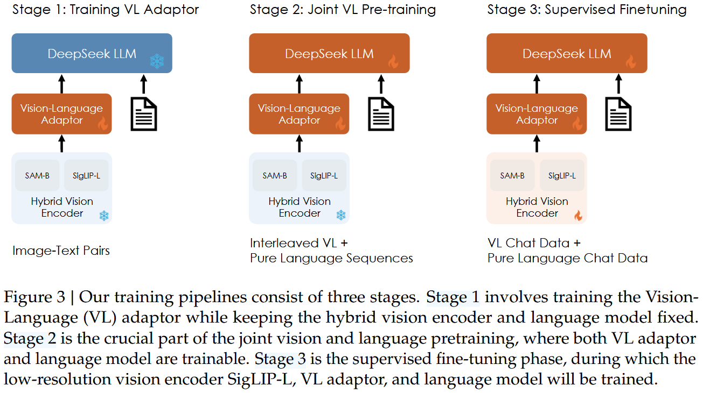

# [DeepSeek-VL](https://arxiv.org/abs/2403.05525)

## Convenient Links
* [Github](https://github.com/deepseek-ai/DeepSeek-VL)
* Hugging face:
    * [DeepSeek-VL-1.3B-base](https://huggingface.co/deepseek-ai/deepseek-vl-1.3b-base)
    * [DeepSeek-VL-1.3B-chat](https://huggingface.co/deepseek-ai/deepseek-vl-1.3b-chat)
    * [DeepSeek-VL-7B-base](https://huggingface.co/deepseek-ai/deepseek-vl-7b-base)
    * [DeepSeek-VL-7B-chat](https://huggingface.co/deepseek-ai/deepseek-vl-7b-chat)

## 1. Overview & Key Contributions

**Goal**: Build an open-source VLM that excels in **real-world** tasks, not just academic benchmarks.

**Model Sizes Released**:
- DeepSeek-VL-1.3B (based on DeepSeek-LLM-1.3B checkpoint)
- DeepSeek-VL-7B (based on DeepSeek-LLM-7B checkpoint)

**Three Core Pillars** (from the abstract):

| Pillar              | Focus                                                                 | Why It Matters (Real-World Angle)                                                                 |
|---------------------|-----------------------------------------------------------------------|---------------------------------------------------------------------------------------------------|
| Data Construction   | Diverse, scalable, real-world coverage + taxonomy-based SFT data      | Covers web screenshots, PDFs, charts, OCR, code-from-UI, textbooks → practical user scenarios    |
| Model Architecture  | Hybrid vision encoder for high-res (1024×1024) within fixed tokens    | Handles tiny text/objects, dense documents without exploding token count                         |
| Training Strategy   | Preserve LLM language strength while adding vision capability         | Avoids "catastrophic forgetting" of language skills during multimodal training                    |

**Big Picture Results**:
- State-of-the-art or competitive on many VL benchmarks **at same model size**.
- Strong performance on pure language benchmarks (minimal degradation).
- Excellent human evaluations and real-world user experience.

---

## 2. Introduction & Motivation

### Historical Context
LLMs exploded in 2022–2023 → people wanted models that also understand images (GPT-4V, Gemini).  
Open-source VLMs improved quickly on benchmarks but still lagged in **real-world** use (e.g., reading dense PDFs, understanding charts, tiny objects, OCR).

### Main Gaps in Prior Open-Source VLMs
- Too much focus on instruction tuning, not enough **pretraining** → missing broad world knowledge.
- Instruction data often just mixes academic datasets → good benchmarks, poor real user experience.
- Most use low-resolution vision encoders (336×336 or 448×448) → struggle with fine details or OCR.
- Multimodal pretraining often **hurts** language ability (catastrophic forgetting).

DeepSeek-VL attacks all four gaps directly.

---

## 3. Data Construction

### 3.1 Pretraining Data (Stage 1 & 2)
Very diverse, ~70% is pure text to preserve language ability.

| Category                | Examples / Sources                                                                 | % of Mix | Purpose |
|-------------------------|------------------------------------------------------------------------------------|----------|---------|
| Interleaved image-text  | MMC4, Wikipedia, Wikihow, in-house PDFs/Epubs                                      | ~13%     | In-context multi-image understanding |
| Image caption           | Capsfusion, TaiSu, Detailed Caption                                                | ~11%     | Basic image → text alignment |
| Table & chart           | Chart2text, Unichart, ScienceQA, ScreenQA, etc.                                    | ~2%      | Structured visual reasoning |
| Web Code                | Websight (UI → code), Jupyter notebooks (plots → code)                             | ~0.4%    | Code generation from screenshots/plots |
| Scene text OCR          | ArT, MLT-17, TextOCR, HierText, etc.                                               | ~1%      | Text in natural scenes |
| Document OCR            | Custom arXiv PDFs + e-books/educational materials rendered to image-text pairs     | ~2%      | Dense documents, formulas, layouts |
| Text-only               | DeepSeek-LLM 2T text corpus                                                        | **70%**  | Preserve strong language modeling |

### 3.2 Supervised Fine-Tuning (SFT) Data (Stage 3)
Smaller but high-quality, focused on **real user scenarios**.

| Class                   | Examples / Sources                                      | % of Mix | Notes |
|-------------------------|---------------------------------------------------------|----------|-------|
| In-house (taxonomy-based) | Curated from real GPT-4V/Gemini test cases              | 10.5%    | Chinese + English, covers broad taxonomy |
| General multi-modality  | ShareGPT4V, LAION-GPTV, LLaVA-1.6, etc.                 | 35.5%    | Standard open-source instruction data |
| Table & chart           | Subset from pretraining (Ureader, ScienceQA, etc.)      | 4.1%     | - |
| Web Code                | Screen-to-code, ScreenQA                                | 2.0%     | - |
| Text-only SFT           | DeepSeek-LLM chat data                                  | 47.9%    | Preserve dialogue ability |

**Taxonomy for In-house Data** (very practical – Table 3 in paper):

- Recognition (global/local description, OCR)
- Conversion (image → code, prompt, text)
- Analysis (charts, professional images, encyclopedia)
- Commonsense Reasoning (relationships, function, anomaly)
- Logical Reasoning (math, physics, etc.)
- Evaluation (aesthetic, reality)
- Multi-graph & Safety

This taxonomy guides both SFT data creation **and** their internal evaluation set.

---

## 4. Model Architecture (Detailed Explanation)

This is the part you love – let's go deep!

### Overall Structure
```
Image → Hybrid Vision Encoder → Vision-Language Adaptor → DeepSeek LLM → Text output
```

### 4.1 Hybrid Vision Encoder (Key Innovation)
Most VLMs use a single vision encoder (e.g., CLIP/SigLIP) → good semantics but:
- Low resolution → poor at tiny text/objects
- "CLIP-blind pairs" → similar embeddings for visually different images
> **CLIP-blind pairs:**
>  * Definition: Pairs of images that are perceptually/ visually very different but have **high cosine similarity** (>0.9 sometimes) in CLIP's embedding space.
>  * Why "blind"? The model is "blind" to the visual differences that humans easily see because CLIP is trained with **InfoNCE (noise-contrastive estimation) loss:** for a batch, pull the matching image-text pair close, push all others away.

**Solution**: Combine **two** encoders:

1. **SigLIP-L (384×384)**  
   - Text-aligned (trained with contrastive loss on image-text pairs)  
   - Strong high-level semantics

2. **SAM-B (1024×1024)**  
   - Vision-only self-supervised (segment-anything model backbone)  
   - Excellent low-level details and visual grounding

**Processing Pipeline**:
- High-res path (SAM-B): Image → 1024×1024 → 64×64×256 feature map → interpolate to 96×96 → two conv(stride=2) → 24×24×1024 → reshape to **576×1024**
- Low-res path (SigLIP-L): Image → 384×384 → **576×1024** feature map
- Concatenate → **576 tokens × 2048 dim**

This gives **rich semantic + detailed** information while staying at a fixed 576 visual tokens (efficient!).

### 4.2 Vision-Language Adaptor
Simple but effective **hybrid MLP** (2 layers total):

- Separate single-layer MLPs for high-res and low-res features
- Concatenate outputs
- Final MLP layer → project to LLM embedding space

Total adaptor parameters are tiny compared to the LLM.

### 4.3 Language Model Backbone
Built on **DeepSeek-LLM** (same as LLaMA-style):
- Pre-Norm RMSNorm
- SwiGLU FFN
- RoPE positional embeddings
- Same tokenizer as DeepSeek-LLM

They start from an **intermediate checkpoint** of DeepSeek-LLM (not from scratch) to preserve language strength.

**Visual Summary** (described from paper figures):
- The hybrid encoder produces two feature maps that are fused into a fixed-length token sequence.
- These tokens are fed exactly like text tokens into the LLM.

**Trade-offs**:
- More accurate high-res understanding vs. slightly higher computation (but still efficient).
- Fixed token budget → works well for multi-turn chat and interleaved image-text.

---

## 5. Training Strategy (3 Stages)

| Stage | What is Trained | Frozen Parts | Key Ideas & Findings |
|-------|-----------------|--------------|---------------------|
| 1 – Adaptor Warmup | Only VL adaptor | Vision encoders + LLM | Use ~3.75M caption + OCR pairs. Scaling data here **does not help** (projector capacity limited). |
| 2 – Joint VL Pretraining | VL adaptor + LLM | Vision encoders | Crucial stage. Start with 100% text → gradually decrease to ~70% text / 30% multimodal ("modality warm-up"). Prevents catastrophic forgetting of language. Group modalities per batch for 20% faster training. |
| 3 – Supervised Fine-Tuning | Low-res encoder (SigLIP) + adaptor + LLM | High-res encoder (SAM-B, too big for memory) | Mix multimodal + text chat data. Only supervise answers. |

**Critical Insight from Stage 2**:
- Pure multimodal pretraining → huge drop in language metrics.
- 70% text preserves language while still gaining strong vision ability.

---

## 6. Evaluation Highlights

### Multimodal Benchmarks (7B model competitive with much larger open-source models)

| Benchmark | DeepSeek-VL-7B | Top Open-Source 7B | GPT-4V |
|-----------|----------------|-------------------|--------|
| MMBench   | 73.2           | ~68               | —      |
| SEEDBench | 70.4           | ~70               | 71.6   |
| MathVista | 36.1           | ~35               | 47.8   |
| OCRBench  | 456            | Lower             | 659    |

### Language Benchmarks (minimal degradation vs DeepSeek-LLM-7B)

| Benchmark | DeepSeek-VL-7B Chat | DeepSeek-LLM-7B Chat |
|-----------|---------------------|----------------------|
| MMLU      | 52.4                | 49.4                 |
| HellaSwag | 68.4                | 68.5                 |
| GSM8K     | 55.0                | 63.0 (some drop)     |

### Human & GPT-4V Evaluation
- DeepSeek-VL-7B close to GPT-4V in recognition, conversion, commonsense.
- Wins >60% head-to-head vs other open-source VLMs when judged by GPT-4V.


## Simple inference example:
```python
from transformers import AutoModelForCausalLM, AutoProcessor
model = AutoModelForCausalLM.from_pretrained("deepseek-ai/deepseek-vl-7b-chat", trust_remote_code=True)
processor = AutoProcessor.from_pretrained("deepseek-ai/deepseek-vl-7b-chat", trust_remote_code=True)

# Prepare conversation with image + text
conversation = [{"role": "User", "content": "<image_placeholder>\nDescribe this image in detail.", "images": ["path/to/image.jpg"]}]
inputs = processor(conversation, return_tensors="pt")
# Generate...
```