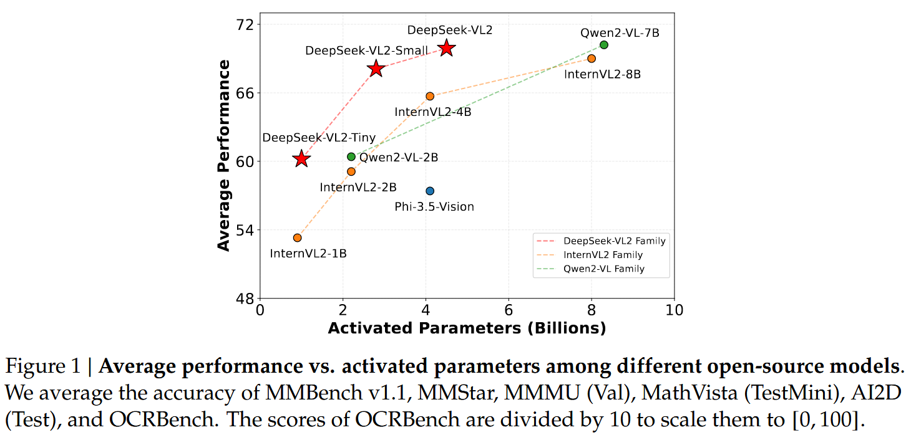
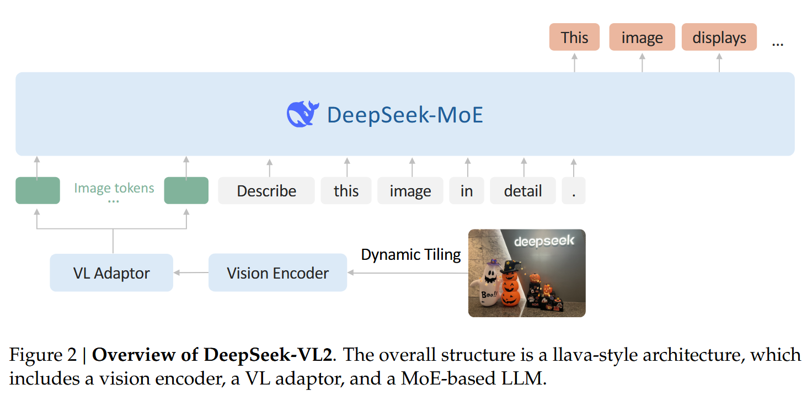
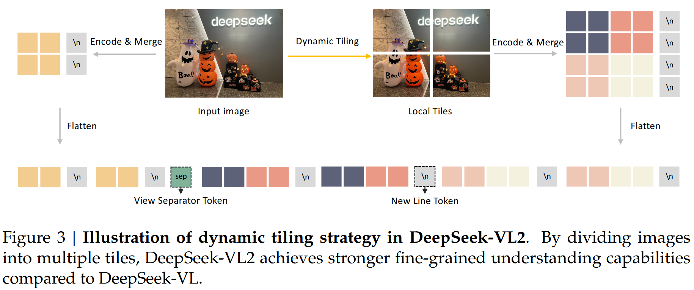

# [DeepSeek-VL2](https://arxiv.org/abs/2412.10302)

DeepSeek-VL2 is an advanced open-source series of **[Mixture-of-Experts (MoE)](../MoE/DeepSeekMoE.md)** Vision-Language Models (VLMs) from DeepSeek-AI (2024). It builds on [DeepSeek-VL (the predecessor)](./DeepSeek_VL.md) with major upgrades in vision encoding, language modeling, and data quality. The series includes three variants: Tiny (1.0B activated parameters), Small (2.8B), and Base (4.5B). These models excel in real-world multimodal tasks like visual question answering (VQA), OCR, document/chart understanding, and visual grounding, often achieving state-of-the-art (SOTA) or competitive performance with fewer activated parameters than dense or other MoE models.

**Key Highlights from the Abstract**  
- Two core upgrades:  
  1. Dynamic tiling for high-resolution images of varying aspect ratios.  
  2. [DeepSeekMoE](../MoE/DeepSeekMoE.md) + [Multi-head Latent Attention (MLA)](../Attention_Machanisms/MLA.md) for efficient inference (compressed KV cache).  
- Trained on improved, diverse vision-language data.  
- Strong in VQA, OCR, document/table/chart understanding, visual grounding.  
- Open-source: Codes and models at https://github.com/deepseek-ai/DeepSeek-VL2.

**Performance Context**  

Figure 1 in the paper shows DeepSeek-VL2 outperforming or matching open-source peers (e.g., InternVL2, Qwen2-VL, Molmo) on averaged benchmarks (MMBench, MMStar, MMMU, etc.) with fewer activated parameters.

## Convenient Links
* [Github](https://github.com/deepseek-ai/DeepSeek-VL2)
* Hugging face:
    * [DeepSeek-VL2](https://huggingface.co/deepseek-ai/deepseek-vl2)
    * [DeepSeek-VL2-small](https://huggingface.co/deepseek-ai/deepseek-vl2-small)
    * [DeepSeek-VL2-tiny](https://huggingface.co/deepseek-ai/deepseek-vl2-tiny)

## Key Improvements over DeepSeek-VL (Predecessor)

DeepSeek-VL (2024) used a hybrid vision encoder (SigLIP low-res + SAM-B high-res) but was limited to fixed 1024×1024 resolution. DeepSeek-VL2 addresses this and adds efficiency:  
- **Vision**: Replaces fixed hybrid with dynamic tiling using a single SigLIP-SO400M encoder → better high-res and extreme aspect ratios.  
- **Language**: Switches to MoE (DeepSeekMoE) with MLA → massive efficiency gains (lower KV cache, higher throughput).  
- **Data**: Higher quality/quantity/diversity, adding visual grounding support.  
- **New Capabilities**: Precise visual grounding, GUI perception.

## Model Architecture (Core Focus)

DeepSeek-VL2 follows a LLaVA-style decoder-only architecture:  
**Vision Encoder** → **VL Adaptor** → **MoE LLM**.

### 1. Dynamic Tiling Vision Encoder
- Uses a **single SigLIP-SO400M-384** (base resolution 384×384).  
- Handles arbitrary high-res/aspect ratios by:  
  - Defining candidate resolutions: multiples of 384×384 (up to 9×9 tiles).  
  - Choosing the resolution that minimizes padding when resizing the image.  
  - Splitting into m×n local 384×384 tiles + 1 global thumbnail tile.  
- Each tile → 27×27 = 729 visual embeddings (1152-dim).  
- **Token Budget Control**: For >2 images, disables tiling (fixed mode).  
- **Advantages**:  
  - Avoids quadratic scaling of global attention on huge images.  
  - Preserves local attention benefits of ViT.  
  - Excels at ultra-high-res tasks (OCR, grounding, documents).  
- **Trade-offs**: Slight overhead for tile selection; managed by disabling for multi-image inputs.

**Visual Flow (Figure 3 in paper)**: Global thumbnail + grid of local tiles, with special tokens for row/column separation.



### 2. Vision-Language Adaptor
- Post-tiling: Applies 2×2 pixel shuffle → compresses each tile from 27×27 → 14×14 = 196 tokens.  
- Adds special tokens:  
  - `<tile_newline>` for row ends in global and local tiles.  
  - `<view-separator>` between global and local tiles.  
- Final visual sequence: ~210 (global) + 1 (separator) + local tiles with newlines.  
- Projects via **2-layer MLP** into LLM embedding space.

### 3. DeepSeekMoE Language Model with MLA
- Based on DeepSeekMoE (from DeepSeek-V2/V3 series).  
- **Multi-head Latent Attention (MLA)**: Compresses KV cache into latent vectors → drastic memory reduction and higher throughput.  
- **MoE Details** (Table 1 in paper):

    | Component              | Tiny          | Small         | Base          |
    |-----------------------|---------------|---------------|---------------|
    | Total Params (LLM)    | 3B            | 16B           | 27B           |
    | Activated Params      | 0.57B → 1.0B total | 2.4B → 2.8B total | 4.1B → 4.5B total |
    | Layers                | 12            | 27            | 30            |
    | Embedding Size        | 1,280         | 2,048         | 2,560         |
    | Attention Heads       | 10            | 16            | 32            |
    | Attention Type        | Standard MHA  | MLA (rank=512)| MLA (rank=512)|
    | Routed Experts        | 64            | 64            | 72            |
    | Shared Experts        | 2             | 2             | 2             |
    | Top-K Routing         | 6             | 6             | 6             |
    | Routing Function      | Softmax       | Softmax       | Sigmoid       |
    | Expert Bias Correction| No            | No            | Yes           |

- **Efficiency Gains**: Sparse MoE + MLA → low activated params, fast inference, high throughput.

**Overall Token Flow**  
```
Image → Dynamic tiles → SigLIP features → Pixel shuffle + special tokens → MLP projection → MoE LLM (with text tokens).
```

## Data Construction

Three-stage pipeline with carefully curated data:

### 1. VL Alignment (~1.2M samples)
- ShareGPT4V captions/conversations → warm up MLP adaptor.

### 2. VL Pretraining (majority of compute)
- ~70% VL data / 30% text-only (from DeepSeek LLM corpus).  
- Categories: Interleaved image-text, dense captions (recaptioned for quality), OCR (English/Chinese docs), VQA (general + table/chart/doc + web-to-code + visual prompt), visual grounding, grounded conversation.

### 3. Supervised Fine-Tuning (SFT)
- Mix of open-source + high-quality in-house QA (based on real-world taxonomy).  
- Focus: General VQA, OCR/doc, table/chart, reasoning/math, textbook, web-to-code, visual grounding (with bounding boxes), grounded conversation.  
- Text-only instructions included to preserve language ability.

## Training Methodology

Three stages (Table 2 in paper for hyperparameters):

1. **Alignment**: Train only VL adaptor + vision encoder (LLM frozen).  
2. **Pretraining**: Unfreeze everything; ~800B image-text tokens.  
3. **SFT**: All params trainable; supervise only answers/special tokens.

- Infrastructure: HAI-LLM framework, pipeline + tensor + expert parallelism, careful load balancing for vision encoder.

## Evaluation Highlights

- **OCR/Doc Benchmarks** (Table 3): Strongest among similar-scale models (e.g., 809–834 on OCRBench).  
- **General/Math Benchmarks** (Table 4): Competitive/SOTA (e.g., DeepSeek-VL2 Base: 62.8 MathVista, 79.2 MMBench-V1.1).  
- **Grounding** (Table 5): Best among open-source VLMs at similar scale.  
- Qualitative: Excellent dense description, meme understanding, multi-image reasoning, storytelling, grounding (including in-context and emergent abilities).

## Conclusion & Limitations

DeepSeek-VL2 advances efficient MoE VLMs with dynamic high-res vision and strong multimodal performance. Models deployable on modest hardware (e.g., Base on ~80GB GPU).

**Future Directions** (from paper): Longer context for multi-image, robustness to blurry/unseen objects, stronger reasoning.