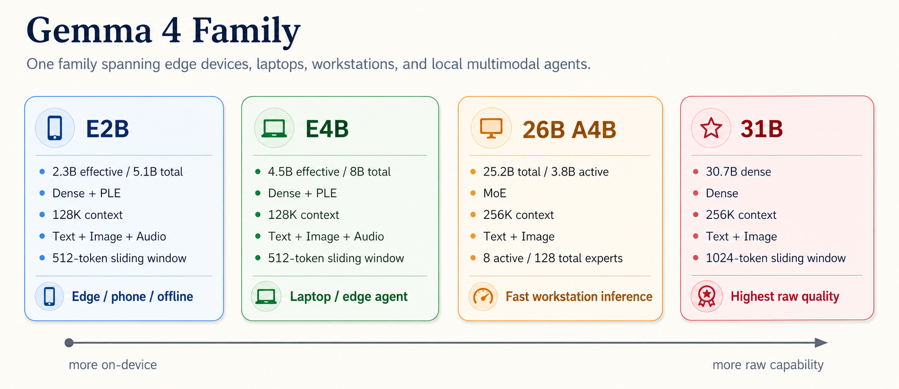
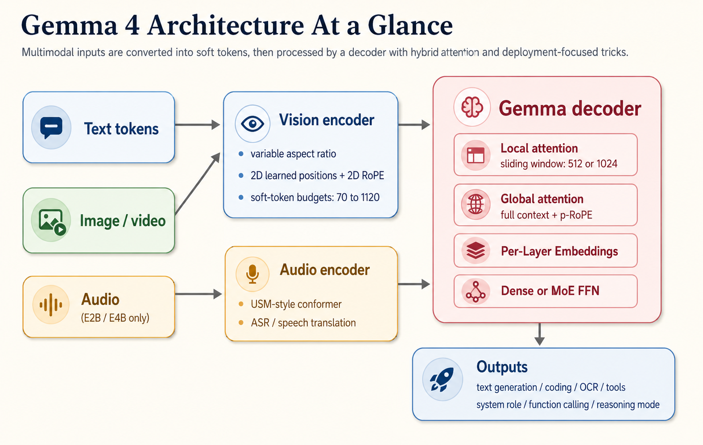
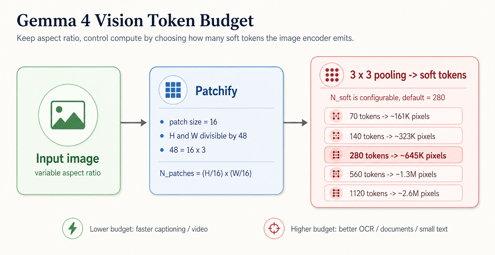

# Gemma 4

> Note: as of 2026-05-09, I did not find a public Gemma 4 arXiv technical report. This note is based on official release materials, model cards, and implementation docs from Google DeepMind / Google and the official Google model cards on Hugging Face.

## Convenient Links
* [Google DeepMind model page](https://deepmind.google/models/gemma/gemma-4/)
* [Google launch blog](https://blog.google/innovation-and-ai/technology/developers-tools/gemma-4/)
* [Google official Gemma 4 31B model card](https://huggingface.co/google/gemma-4-31B)
* [Transformers Gemma 4 docs](https://huggingface.co/docs/transformers/model_doc/gemma4)
* [Google Open Source blog: Apache 2.0 release](https://opensource.googleblog.com/2026/03/gemma-4-expanding-the-gemmaverse-with-apache-20.html)

## 1. Overview

Gemma 4 is Google DeepMind's April 2, 2026 release of open multimodal models built from **Gemini 3 research and technology**. The family is designed around one idea:

> maximize **intelligence-per-parameter** across very different deployment settings, from edge devices to workstation/server inference.

Compared with Gemma 3, Gemma 4 pushes harder on:

* **reasoning**
* **agentic workflows**
* **native multimodality**
* **long context**
* **on-device deployment**
* **licensing flexibility**

The release is also important operationally: Gemma 4 is distributed under **Apache 2.0**, which is much more deployment-friendly than the earlier Gemma-specific license family.

## 2. Model Family



Gemma 4 comes in four main sizes:

| Model | Architecture | Parameters | Context | Modalities | Target |
|---|---|---:|---:|---|---|
| Gemma 4 E2B | Dense | 2.3B effective, 5.1B incl. embeddings | 128K | Text, Image, Audio | phones / edge |
| Gemma 4 E4B | Dense | 4.5B effective, 8B incl. embeddings | 128K | Text, Image, Audio | laptops / edge |
| Gemma 4 26B A4B | MoE | 25.2B total, 3.8B active | 256K | Text, Image | fast workstation inference |
| Gemma 4 31B | Dense | 30.7B | 256K | Text, Image | highest quality |

Two naming details matter:

* **E** = **effective parameters**
  * used for E2B / E4B, where the total parameter count is larger because of extra embedding tables, but the active compute footprint is smaller
* **A** = **active parameters**
  * used for `26B A4B`, meaning the model contains about 25B total parameters but activates only about 4B at inference time

## 3. What Is New Relative to Gemma 3

At a high level, Gemma 4 keeps the Gemma family style, but upgrades multiple parts of the stack:

1. **Multimodality broadens**
   * all models support text + image
   * E2B / E4B also add native audio
   * video is handled as image-frame sequences
2. **Vision becomes more flexible**
   * no longer "always squash everything into one fixed square"
   * supports variable aspect ratios and configurable visual token budgets
3. **Architecture becomes more deployment-aware**
   * hybrid local/global attention
   * MoE option for faster large-model inference
   * per-layer embeddings for small models
4. **Agent features become first-class**
   * native `system` role
   * native function calling
   * configurable thinking mode
5. **Licensing becomes more open**
   * Apache 2.0

## 4. Core Architecture



Gemma 4 is best understood as a **multimodal decoder-centric model family**:

```text
text tokens
 + image soft tokens
 + audio tokens (E2B / E4B only)
 -> Gemma decoder
 -> text output
```

The release materials highlight five main architectural ideas.

### 4.1 Hybrid Attention: Local + Global

The language backbone interleaves:

* **local sliding-window attention**
* **full global attention**

Conceptually, an attention layer can be written as:

$$
\operatorname{Attn}(Q, K, V; M)
=
\operatorname{softmax}\!\left(\frac{QK^\top + M}{\sqrt{d}}\right)V
$$

where `M` is the attention mask.

For Gemma 4, we can think of two masks:

$$
M =
\begin{cases}
M_{\text{local}} & \text{for sliding-window layers} \\
M_{\text{global}} & \text{for full-context layers}
\end{cases}
$$

So the model alternates between:

$$
\operatorname{Attn}_{\text{local}}
\quad \text{and} \quad
\operatorname{Attn}_{\text{global}}
$$

Why do this?

* **local layers** reduce memory and compute
* **global layers** keep long-range reasoning ability

From the official model cards:

* E2B / E4B use **512-token** sliding windows
* 31B / 26B A4B use **1024-token** sliding windows
* the **final layer is global**

This is a classic "efficiency without losing too much global awareness" tradeoff.

### 4.2 Longer Context with p-RoPE

The official model card states that global layers use **Proportional RoPE (p-RoPE)** for long-context support.

The release materials do not publish the full derivation, but the practical takeaway is:

* small models reach **128K**
* large models reach **256K**

without making every layer fully global.

So Gemma 4 does not scale context merely by "making the context window bigger"; it also changes the **attention layout** and **positional treatment** to keep memory manageable.

### 4.3 Per-Layer Embeddings (PLE)

One of the most interesting Gemma 4 additions is **Per-Layer Embeddings (PLE)**, especially in the smaller edge-oriented models.

Instead of relying only on one input embedding stream, Gemma 4 feeds an auxiliary signal into each decoder layer.

From the official Transformers documentation, the per-layer input is:

$$
p_\ell
=
\frac{p_\ell^{\text{token-id}} + p_\ell^{\text{context}}}{\sqrt{2}}
$$

where:

* $p_\ell^{token-id}$ comes from a token-identity lookup
* $p_\ell^{context}$ comes from projecting the main input embeddings

Conceptually:

$$
p_\ell^{\text{context}}
=
\operatorname{RMSNorm}(W_\ell h_0)
$$

and then:

$$
h_{\ell+1}
=
h_\ell
+ \operatorname{Attn}_\ell(h_\ell)
+ \operatorname{FFN}_\ell(h_\ell)
+ p_\ell
$$

The intuition is important:

* normal LLMs force the input embedding to front-load everything
* PLE gives **each layer** its own small side-channel for token-specific information

This is one reason E2B / E4B can stay small in active compute while remaining surprisingly capable.

### 4.4 Dense and MoE Both Exist

Gemma 4 is not a single architecture; it is a family mixing:

* **dense models**: E2B, E4B, 31B
* **MoE model**: 26B A4B

For the MoE model, the model card says:

* **128 total experts**
* **8 active experts**
* **1 shared expert**

The conceptual MoE FFN looks like:

$$
\operatorname{FFN}_{\text{MoE}}(h)
=
\operatorname{FFN}_{\text{shared}}(h)
+
\sum_{e \in \operatorname{TopK}(h)} g_e(h)\,\operatorname{FFN}_e(h)
$$

with `K = 8` active routed experts.

This is why `26B A4B` is attractive:

* total capacity is large
* active compute per token is much closer to a small model

So it sits between:

* **31B dense** for best raw quality
* **E4B** for fastest small-model deployment

### 4.5 Native Agent-Oriented Interface Features

Gemma 4 is also designed around modern agent usage:

* native `system` role support
* native function calling
* configurable thinking mode
* structured JSON output support from the launch blog

This is less about the backbone math and more about **productized model behavior**: the family is clearly meant to be easy to plug into tool-using workflows.

## 5. Vision Architecture



Gemma 4's vision stack is one of the biggest differences from earlier Gemma releases.

### 5.1 Variable Aspect Ratio and Variable Resolution

Unlike many vision-language models that resize every image into a single fixed square, Gemma 4 supports **variable aspect ratio** images while still keeping the token count under control.

The official constraints are:

1. total pixels must fit inside a **patch budget**
2. both height and width must be divisible by **48**

Why 48?

* patch size = **16**
* pooling kernel = **3**

So:

$$
48 = 16 \times 3
$$

This means the model patchifies first and then pools those patch-level features into a smaller set of **soft tokens**.

### 5.2 Soft Token Budget

The supported visual token budgets are:

| Soft Tokens | Patches Before Pooling | Approx. Image Area |
|---:|---:|---:|
| 70 | 630 | ~161K pixels |
| 140 | 1,260 | ~323K pixels |
| 280 | 2,520 | ~645K pixels |
| 560 | 5,040 | ~1.3M pixels |
| 1120 | 10,080 | ~2.6M pixels |

The default is **280 soft tokens per image**.

A useful conceptual approximation is:

$$
N_{\text{patch}}
=
\frac{H}{16}\cdot\frac{W}{16}
$$

and after `3 x 3` pooling:

$$
N_{\text{soft}}
\approx
\frac{N_{\text{patch}}}{9}
$$

That matches the published budgets:

* `630 / 9 = 70`
* `1260 / 9 = 140`
* `2520 / 9 = 280`

This is a very practical design:

* low token budget -> faster inference, useful for captioning/video
* high token budget -> better OCR, documents, UI, tiny text

### 5.3 Positional Encoding in Vision

The official docs describe two spatial mechanisms:

* **learned 2D position embeddings**
* **2D RoPE**

The position table stores up to **10,240 positions per axis**, and 2D RoPE rotates:

* half of head dimensions for the **x-axis**
* half for the **y-axis**

This gives the model a better way to preserve spatial relations such as:

* above / below
* left / right

### 5.4 No Standard ImageNet Mean/Std Normalization

The official docs explicitly note that Gemma 4 **does not use standard ImageNet mean/std normalization**. The patch embedding stack handles the final scaling internally to `[-1, 1]`.

This matters if you later implement preprocessing yourself.

## 6. Audio and Video

Audio support is available only on **E2B** and **E4B**.

From the official materials:

* audio encoder is **USM-style conformer based**
* audio tasks include:
  * ASR
  * speech translation
* audio max length is **30 seconds**
* video max length is **60 seconds** if processed at **1 frame per second**

All models can process video by treating it as **a sequence of frames**, but only the small models natively include the audio pathway.

## 7. Training and Data

Google has not published a full training technical report yet, but the official model card gives several important facts:

* pretraining data includes:
  * web documents
  * code
  * mathematics
  * images
  * audio
* language coverage:
  * trained on data spanning **140+ languages**
* data cutoff:
  * **January 2025**

This already tells us a lot about Gemma 4's intended positioning:

* not a pure text LLM
* not a simple text+image adapter
* not just a benchmark-tuned coding model

It is trained as a **broad multimodal general-purpose family** with explicit emphasis on reasoning, coding, agent use, and global multilingual support.

## 8. Practical Capability Profile

The official model cards summarize Gemma 4's core abilities as:

* **thinking / reasoning**
* **long context**
* **image understanding**
  * OCR
  * document / PDF parsing
  * screen and UI understanding
  * chart comprehension
  * handwriting recognition
  * pointing / object localization
* **video understanding**
* **interleaved multimodal input**
* **function calling**
* **coding**
* **multilingual support**
* **audio understanding** on E2B / E4B

This is a strong signal that Gemma 4 is meant to be a **local-first multimodal agent model family**, not only a chat model.

## 9. Benchmark Highlights

The official model cards report the following instruction-tuned benchmark results.

### Selected reasoning and coding metrics

| Benchmark | 31B | 26B A4B | E4B | E2B | Gemma 3 27B |
|---|---:|---:|---:|---:|---:|
| MMLU Pro | 85.2 | 82.6 | 69.4 | 60.0 | 67.6 |
| AIME 2026 | 89.2 | 88.3 | 42.5 | 37.5 | 20.8 |
| LiveCodeBench v6 | 80.0 | 77.1 | 52.0 | 44.0 | 29.1 |
| GPQA Diamond | 84.3 | 82.3 | 58.6 | 43.4 | 42.4 |
| Tau2 | 76.9 | 68.2 | 42.2 | 24.5 | 16.2 |

### Selected multimodal and long-context metrics

| Benchmark | 31B | 26B A4B | E4B | E2B | Gemma 3 27B |
|---|---:|---:|---:|---:|---:|
| MMMU Pro | 76.9 | 73.8 | 52.6 | 44.2 | 49.7 |
| OmniDocBench 1.5 | 0.131 | 0.149 | 0.181 | 0.290 | 0.365 |
| MATH-Vision | 85.6 | 82.4 | 59.5 | 52.4 | 46.0 |
| MRCR v2 8-needle 128K | 66.4 | 44.1 | 25.4 | 19.1 | 13.5 |

Interpretation:

1. **31B dense** is the best raw-quality checkpoint.
2. **26B A4B** gets close while spending far fewer active parameters.
3. **E4B** is unusually strong for its size and is probably the most practical "small serious model" in the family.
4. Gemma 4 is not just a text upgrade over Gemma 3; the multimodal gains are also large.

## 10. Why Gemma 4 Is Interesting

Gemma 4 is technically interesting because it combines several trends that usually appear separately:

### 10.1 It mixes deployment regimes in one family

Most model families choose one:

* edge
* workstation
* datacenter

Gemma 4 explicitly spans all three.

### 10.2 It treats multimodality as native, not decorative

The vision path is not just "image in, fixed square resize, one projector". The configurable vision-token budget and aspect-ratio preservation suggest Google expects real usage on:

* OCR
* documents
* UIs
* charts
* screen understanding

### 10.3 It optimizes for local agents

Function calling, structured output, system-role support, and on-device orientation make it especially suitable for:

* coding assistants
* local copilots
* embedded assistants
* edge automation

### 10.4 It uses architecture, not only scaling, to improve efficiency

Gemma 4 is not "just a bigger Gemma":

* hybrid local/global attention
* MoE option
* PLE
* variable visual token budget

These are all ways to improve the **quality / latency / memory** tradeoff without blindly scaling dense parameters.

## 11. Limitations and Open Questions

Even though Gemma 4 looks strong, several caveats remain.

### 11.1 No public full technical report yet

This is the biggest limitation for study.

We know many useful architectural facts from model cards and implementation docs, but we still do **not** have a full public paper describing:

* exact pretraining recipe
* post-training recipe
* exact data mixture weights
* full ablation story
* exact p-RoPE derivation

So some parts of our understanding are currently release-driven rather than paper-driven.

### 11.2 Scores are vendor-reported

The benchmark tables are official, but still **self-reported by the model publisher**. They are useful, but should not be treated as the last word on real-world ranking.

### 11.3 Audio is only on the small models

This makes the family a bit asymmetric:

* small models = broader modalities
* large models = stronger raw reasoning / text / image quality

### 11.4 Vision quality depends on token budget

The variable-resolution design is powerful, but it also means:

* OCR/document tasks may need larger budgets
* high budgets increase compute and memory

So the model is flexible, but the deployment tradeoff becomes your responsibility.

## 12. Key Takeaway

Gemma 4 is best understood as a **multimodal, agent-oriented, deployment-aware open model family**.

Its most important ideas are not any single feature in isolation, but the combination of:

* **hybrid local/global long-context attention**
* **Dense + MoE family design**
* **Per-Layer Embeddings for efficient small models**
* **variable-aspect-ratio vision with configurable token budget**
* **native tool / system / reasoning support**
* **Apache 2.0 openness**

If Gemma 3 was a strong open multimodal model family, then Gemma 4 pushes that idea toward a clearer target:

> **frontier-capable local multimodal agents**, from phones to workstations.

## 13. References

1. Google DeepMind. *Gemma 4 model page*.  
2. Google Blog. *Gemma 4: Byte for byte, the most capable open models*. Published April 2, 2026.  
3. Google / Hugging Face official model card: `google/gemma-4-31B`.  
4. Hugging Face Transformers documentation: *Gemma4*.  
5. Google Open Source Blog. *Gemma 4: Expanding the Gemmaverse with Apache 2.0*.
