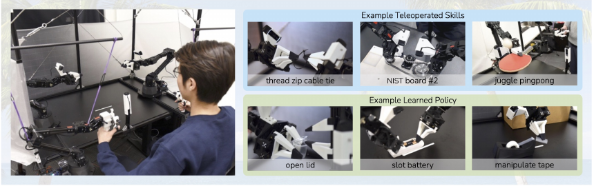
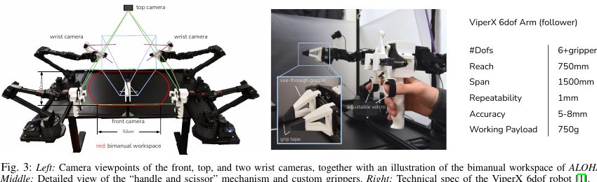
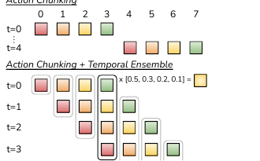
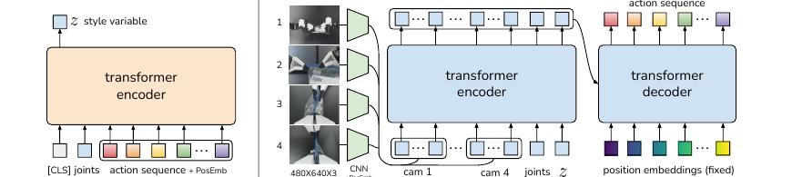
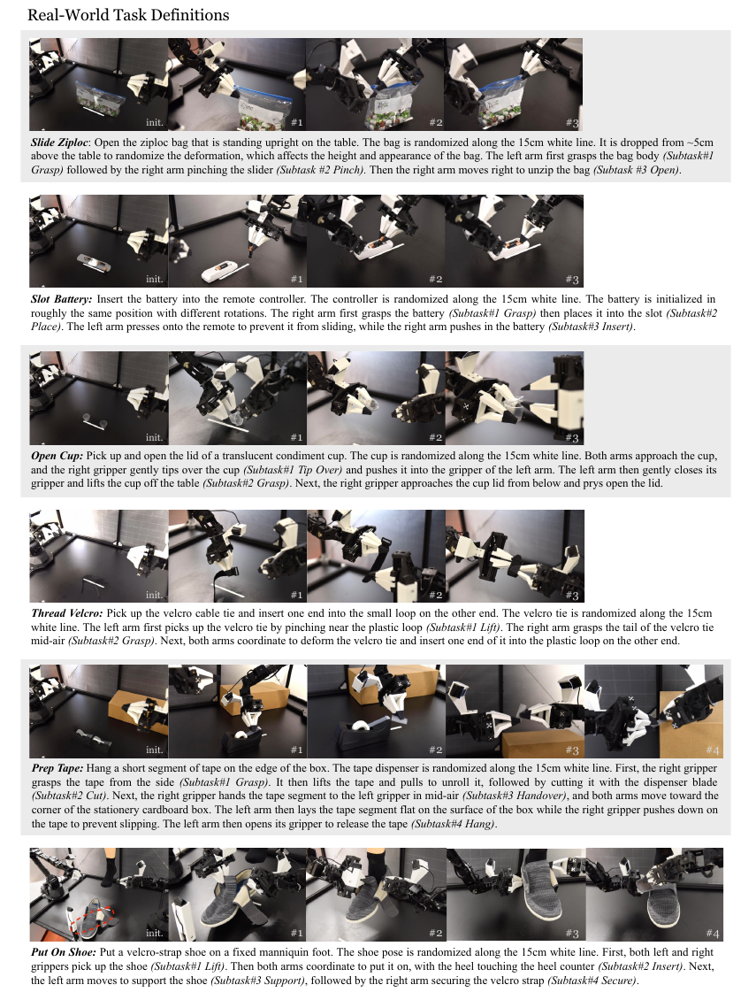
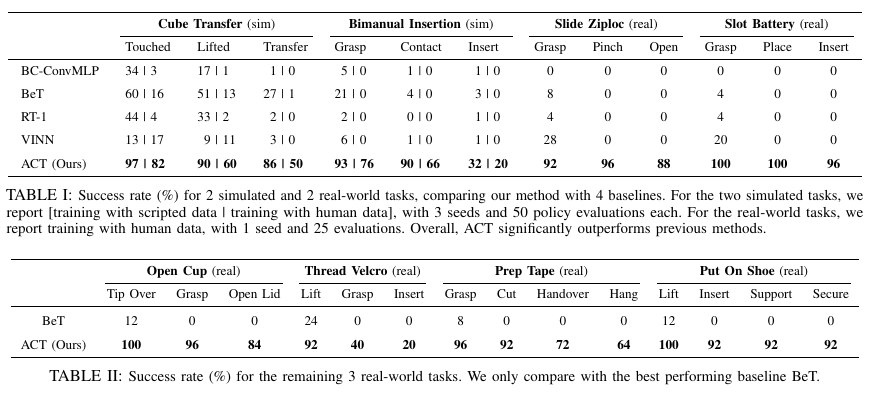
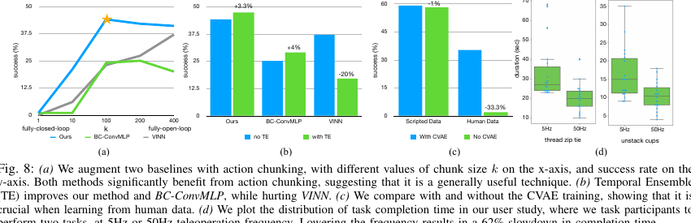

# [Learning Fine-Grained Bimanual Manipulation with Low-Cost Hardware](https://arxiv.org/abs/2304.13705)

## Convenient Links

* [Paper (arXiv)](https://arxiv.org/abs/2304.13705)
* [Project Page](https://tonyzhaozh.github.io/aloha/)
* [RT-1 note in this repo](./RT_1.md)
* [OpenVLA note in this repo](./OpenVLA.md)

## 1. One-Sentence Summary

This paper introduces **ALOHA**, a low-cost open-source bimanual teleoperation platform, and **Action Chunking with Transformers (ACT)**, an imitation learning method that predicts future action sequences instead of one-step actions, enabling fine-grained real-world bimanual manipulation such as opening a translucent cup, slotting a battery, and putting on a shoe with roughly **10-20 minutes of demonstrations per task**.

## 2. Why This Paper Matters

ACT is important because it attacks a different bottleneck from large VLA papers such as [RT-2](./RT_2.md) and [OpenVLA](./OpenVLA.md).

Those papers ask:

> How do we scale semantic robot policies with large vision-language models?

This paper asks:

> Can low-cost hardware learn high-precision, contact-rich bimanual skills from a small amount of real demonstrations?

The answer is yes, but only after solving two coupled problems:

1. **Hardware**: build a cheap but dexterous enough bimanual teleoperation setup.
2. **Learning**: make behavior cloning work for long, high-frequency, precise manipulation.

The paper's main lesson is:

> Fine manipulation is not only a model-size problem. Data collection interface, control frequency, action representation, and temporal smoothing matter just as much.

## 3. Important Scope Clarification

ACT is related to VLA systems, but it is **not** a language-conditioned generalist VLA in the same sense as RT-2 or OpenVLA.

In this paper:

* each task is trained separately
* the policy does not take a natural-language instruction as input
* observations are RGB images plus robot joint positions
* actions are continuous target joint positions

So ACT is best viewed as:

* a strong **visual imitation learning** method for bimanual manipulation
* an important precursor / component-level idea for later robot learning systems

Its most reusable algorithmic idea is **predicting action chunks and temporally ensembling overlapping predictions**.

## 4. High-Level System



*Figure adapted from the paper: ALOHA is a low-cost bimanual teleoperation system, and ACT learns real manipulation skills from demonstrations collected with it.*

The full pipeline is:

```text
human teleoperation with ALOHA
-> record multi-view RGB + follower joint positions + leader joint actions
-> train ACT as a CVAE over future action chunks
-> deploy only the decoder policy
-> query policy every timestep and ensemble overlapping action predictions
-> send target joint positions to low-level PID controllers
```

The system combines:

* low-cost bimanual hardware
* high-frequency teleoperation at `50Hz`
* multi-camera visual feedback
* action sequence prediction
* temporal ensembling
* CVAE training for noisy human demonstrations

## 5. Hardware: ALOHA



*Figure adapted from the paper: ALOHA uses two ViperX follower arms, two smaller WidowX leader arms, four webcams, and custom 3D-printed grippers.*

ALOHA stands for:

> A Low-cost Open-source Hardware System for Bimanual Teleoperation.

The hardware design principles are:

1. **Low-cost**
2. **Versatile**
3. **User-friendly**
4. **Repairable**
5. **Easy to build**

The key hardware choices are:

* two **ViperX 6-DoF follower arms**
* two smaller **WidowX leader arms**
* direct **joint-space mapping** from leader to follower
* custom 3D-printed "see-through" grippers
* four Logitech C922x RGB webcams
* bimanual teleoperation and recording at `50Hz`

The whole system costs under about **20k USD**, which is much cheaper than high-end bimanual dexterous manipulation setups.

### Why joint-space teleoperation?

The paper prefers joint-space mapping over task-space mapping because:

* low-cost 6-DoF arms can operate near singularities
* inverse kinematics can fail during fine contact-rich manipulation
* joint-space mapping gives low-latency, high-bandwidth control
* the leader robot's inertia naturally damps human hand jitter

This is a practical design decision. The system is not trying to estimate perfect end-effector poses; it is trying to give the human a responsive interface for collecting high-quality demonstrations.

## 6. Problem Setup

At timestep `t`, ACT observes:

$$
o_t = \left(I_t^{1:4}, q_t\right)
$$

where:

* $I_t^{1:4}$ are RGB images from four cameras
* $q_t \in \mathbb{R}^{14}$ contains follower joint positions for two arms

The action is:

$$
a_t \in \mathbb{R}^{14}
$$

where `a_t` is the target joint position for the two follower arms.

The demonstration dataset is:

$$
\mathcal{D}
=
\left\{
\left(o_t^{(n)}, a_t^{(n)}\right)_{t=1}^{T_n}
\right\}_{n=1}^{N}
$$

A one-step behavior cloning policy would learn:

$$
\pi_\theta(a_t \mid o_t)
$$

But for fine manipulation, one-step BC is fragile because small errors compound quickly.

ACT instead learns:

$$
\pi_\theta(a_{t:t+k} \mid o_t)
$$

That is, it predicts a **future chunk of `k` actions** from the current observation.

## 7. Core Idea 1: Action Chunking



*Figure adapted from the paper: ACT predicts chunks of future actions and combines overlapping predictions with temporal ensembling.*

The central idea is simple:

> Instead of predicting only the next action, predict the next `k` actions.

For chunk size `k`, the policy outputs:

$$
\hat{a}_{t:t+k}
=
\left[
\hat{a}_t,\hat{a}_{t+1},\dots,\hat{a}_{t+k-1}
\right]
$$

This reduces the effective horizon by about `k`:

$$
T
\rightarrow
\frac{T}{k}
$$

Intuition:

* a one-step policy must make hundreds of precise decisions
* a chunking policy can learn coherent short manipulation primitives
* the model can represent pauses and non-Markovian human behavior more naturally

Examples of chunks could be:

* grasp the corner of a wrapper
* insert a battery into a slot
* hand tape from one gripper to the other

This is especially useful for fine manipulation because small one-step errors can place the robot outside the training distribution.

## 8. Core Idea 2: Temporal Ensembling

Naive action chunking can create jerky motion:

* observe once
* predict `k` actions
* execute all `k`
* then observe again

This only incorporates new visual feedback every `k` steps.

ACT instead queries the policy **at every timestep**. This means multiple action chunks predict an action for the same future timestep.

Let $A_t[i]$ be the `i`-th candidate action stored for timestep `t`. ACT applies an exponential weighted average:

$$
a_t
=
\frac{
\sum_i w_i A_t[i]
}{
\sum_i w_i
},
\qquad
w_i = \exp(-m i)
$$

where:

* older and newer chunk predictions overlap
* `m` controls how quickly new predictions dominate
* the averaging is over predictions for the **same timestep**

This last point matters. ACT is not smoothing adjacent actions in time. It is combining several predictions of the same action, which reduces modeling noise without directly biasing the trajectory toward neighboring timesteps.

## 9. Core Idea 3: CVAE for Human Demonstrations

Human demonstrations are noisy and multi-modal.

Given the same observation, a human might choose slightly different valid trajectories. This is especially true in regions where precision is less critical or when mid-air handovers happen at variable positions.

ACT models this with a conditional VAE.

### 9.1 Encoder

The CVAE encoder approximates:

$$
q_\phi(z \mid a_{t:t+k}, \bar{o}_t)
$$

where:

* `z` is a latent style variable
* $a_{t:t+k}$ is the demonstration action chunk
* $\bar{o}_t$ is the observation without images, mainly joint state

The encoder predicts the mean and variance of a diagonal Gaussian:

$$
q_\phi(z \mid a_{t:t+k}, \bar{o}_t)
=
\mathcal{N}
\left(
\mu_\phi,\operatorname{diag}(\sigma_\phi^2)
\right)
$$

### 9.2 Decoder / Policy

The decoder is the actual policy:

$$
\pi_\theta(\hat{a}_{t:t+k} \mid o_t, z)
$$

During training, `z` is sampled from the encoder.
During inference, the encoder is discarded and:

$$
z = 0
$$

which is the mean of the unit Gaussian prior.

### 9.3 Training Objective

The paper describes the ACT objective as a reconstruction term plus a KL regularizer:

$$
\mathcal{L}
=
\mathcal{L}_{\text{reconst}}
+
\beta
D_{\text{KL}}
\left(
q_\phi(z \mid a_{t:t+k}, \bar{o}_t)
\;\|\;
\mathcal{N}(0,I)
\right)
$$

In implementation, they use an L1 reconstruction loss:

$$
\mathcal{L}_{\text{reconst}}
=
\left\|
\hat{a}_{t:t+k}
-
a_{t:t+k}
\right\|_1
$$

The paper reports that L1 gives more precise action sequence modeling than L2 in their setting.

## 10. ACT Architecture



*Figure adapted from the paper: ACT is trained as a CVAE; the encoder is used only during training, and the decoder becomes the deployed policy.*

The policy observation contains:

* 4 RGB images, each `480 x 640 x 3`
* two-arm joint positions, `14D`
* style variable `z`

The visual pipeline is:

```text
4 RGB images
-> ResNet18 image encoders
-> 15 x 20 x 512 feature map per camera
-> flatten to 300 x 512 tokens per camera
-> concatenate 4 cameras -> 1200 x 512 visual tokens
-> append projected joints and z
-> transformer encoder
-> transformer decoder
-> k x 14 target joint positions
```

Important shape details:

* 4 cameras produce `4 x 300 = 1200` visual tokens
* joint positions are projected from `14 -> 512`
* `z` is projected into the same hidden width
* transformer encoder input is approximately `1202 x 512`
* transformer decoder output is `k x 512`
* final MLP maps to `k x 14`

The main hyperparameters reported in the appendix are:

| Hyperparameter        |  Value  |
| :-------------------- | :------: |
| Learning rate         | `1e-5` |
| Batch size            |  `8`  |
| Encoder layers        |  `4`  |
| Decoder layers        |  `7`  |
| Hidden dimension      | `512` |
| Feedforward dimension | `3200` |
| Attention heads       |  `8`  |
| Chunk size`k`       | `100` |
| Beta                  |  `10`  |
| Dropout               | `0.1` |

The model has about **80M parameters**, trains from scratch for each task, takes about **5 hours** on a single 11GB RTX 2080 Ti, and runs inference in about **0.01 seconds** on the same GPU.

## 11. Training and Inference Algorithms

### 11.1 Training

The training loop is:

```text
sample observation o_t and future action chunk a_{t:t+k}
infer z from CVAE encoder q_phi(z | a_{t:t+k}, o_bar_t)
predict action chunk with decoder pi_theta(a_hat_{t:t+k} | o_t, z)
optimize reconstruction + beta * KL
```

Mathematically:

$$
z \sim q_\phi(z \mid a_{t:t+k}, \bar{o}_t)
$$

$$
\hat{a}_{t:t+k}
=
\pi_\theta(o_t,z)
$$

$$
\mathcal{L}
=
\left\|
\hat{a}_{t:t+k}
-
a_{t:t+k}
\right\|_1
+
\beta D_{\text{KL}}
\left(
q_\phi(z \mid a_{t:t+k}, \bar{o}_t)
\;\|\;
\mathcal{N}(0,I)
\right)
$$

### 11.2 Inference

At inference time:

* discard the CVAE encoder
* set `z = 0`
* query the policy at every timestep
* store overlapping future action predictions
* temporally ensemble all predictions for the current timestep

In pseudocode:

```text
for timestep t:
    observe o_t
    predict action chunk a_hat_{t:t+k} = pi_theta(o_t, z=0)
    add each predicted action to the FIFO buffer for its target timestep
    average all predictions for current timestep with exp weighting
    send the averaged target joint position to the robot controller
```

## 12. Tasks and Data Collection



*Figure adapted from the paper: the six real-world ALOHA tasks require precise bimanual coordination and visual feedback.*

The paper evaluates on:

* **6 real-world ALOHA tasks**
* **2 simulated MuJoCo tasks**

The real-world tasks are:

| Task          | Main difficulty                                    |
| :------------ | :------------------------------------------------- |
| Slide Ziploc  | grasp and slide a small bag zipper                 |
| Slot Battery  | place and push a battery into a remote             |
| Open Cup      | tip, grasp, lift, and pry open a translucent cup   |
| Thread Velcro | insert one end of a cable tie into a small loop    |
| Prep Tape     | cut tape, hand over mid-air, and hang it on a box  |
| Put On Shoe   | coordinate both arms to put a shoe on a fixed foot |

Data collection details:

* `50` demonstrations for each real task
* `100` demonstrations for Thread Velcro
* each episode takes about `8-14` seconds
* recording happens at `50Hz`
* each episode has about `400-700` timesteps
* total data is about `10-20` minutes per task
* wall-clock collection takes about `30-60` minutes per task because of resets and failed teleoperation attempts

The paper emphasizes that human demonstrations are stochastic even when collected by one person. This is one reason the CVAE objective helps.

## 13. Main Results



*Figure adapted from the paper: ACT strongly outperforms BC-ConvMLP, BeT, RT-1-style baselines, and VINN on fine-grained tasks.*

The main results are strong because the baselines usually make progress only on early subtasks, while ACT completes the final task.

### 13.1 Final Success Rates

For the key final subtasks:

| Task                             | ACT final success |
| :------------------------------- | :---------------: |
| Cube Transfer, scripted sim      |      `86%`      |
| Cube Transfer, human sim         |      `50%`      |
| Bimanual Insertion, scripted sim |      `32%`      |
| Bimanual Insertion, human sim    |      `20%`      |
| Slide Ziploc                     |      `88%`      |
| Slot Battery                     |      `96%`      |
| Open Cup                         |      `84%`      |
| Thread Velcro                    |      `20%`      |
| Prep Tape                        |      `64%`      |
| Put On Shoe                      |      `92%`      |

The paper reports that ACT improves over the best previous method by large margins on the simulated tasks:

* `+59%`
* `+49%`
* `+29%`
* `+20%`

depending on task and data type.

For the first two real-world tasks, Slide Ziploc and Slot Battery, ACT reaches final success of `88%` and `96%`, while the baselines make little or no progress past the early stages.

For the remaining real-world tasks, the strongest baseline BeT still has `0%` final success, while ACT reaches:

* Open Cup: `84%`
* Thread Velcro: `20%`
* Prep Tape: `64%`
* Put On Shoe: `92%`

Thread Velcro remains the hardest successful task because perception is difficult: the black cable tie has low contrast and occupies only a small part of the image.

## 14. Ablations



*Figure adapted from the paper: action chunking, temporal ensembling, CVAE training, and high-frequency teleoperation all contribute to ACT's performance.*

### 14.1 Action Chunking

The paper varies the chunk size `k`.

Important result:

* `k = 1` gives about `1%` success
* `k = 100` gives about `44%` success

This supports the main claim:

> reducing the effective horizon is crucial for fine-grained imitation learning.

Very large `k` starts to hurt because the policy becomes too open-loop and cannot react enough to visual feedback.

### 14.2 Temporal Ensembling

Temporal ensembling gives:

* ACT: `+3.3%`
* BC-ConvMLP: `+4%`
* VINN: `-20%`

This suggests temporal ensembling is most useful for parametric models with prediction noise. It can hurt nearest-neighbor methods because their retrieved actions are already ground-truth demonstration actions.

### 14.3 CVAE Objective

The CVAE objective matters most for human demonstrations.

The paper reports:

* scripted data: little difference with or without CVAE
* human data: success drops from `35.3%` to `2%` without CVAE

Interpretation:

* scripted data is deterministic
* human data is multi-modal and noisy
* the latent `z` helps model this variability during training

### 14.4 High-Frequency Control

The user study compares `50Hz` vs `5Hz` teleoperation.

Lowering the frequency from `50Hz` to `5Hz` causes about a **62% slowdown** in task completion time, with statistical significance reported as `p < 0.001`.

This matters because many robot learning systems run much slower than `50Hz`. For fine manipulation, the paper shows that high-frequency human control is not just a convenience; it directly affects demonstration quality.

## 15. Why ACT Works

ACT works because several design choices reinforce each other.

### ALOHA gives high-quality demonstrations

The leader-follower joint-space setup makes it possible for humans to collect precise bimanual data with low-cost hardware.

### Action chunking reduces effective horizon

Fine manipulation episodes can contain hundreds of high-frequency steps. Predicting chunks makes the sequence easier to imitate.

### Temporal ensembling keeps the policy reactive and smooth

The policy still observes every timestep, but action outputs are smoothed over overlapping chunk predictions.

### CVAE training handles human variability

Human demonstrations are not single-mode trajectories. The CVAE objective gives the model a way to absorb that variability during training.

### Continuous joint targets preserve precision

Unlike RT-1-style discretized action bins, ACT directly predicts continuous target joint positions. This fits the paper's emphasis on millimeter-level manipulation.

## 16. Limitations

### Hardware limitations

ALOHA struggles with tasks that require:

* multiple dexterous fingers
* fingernails or very thin edges
* high torque
* lifting heavy objects
* twisting tightly sealed objects

This is expected because the system deliberately uses low-cost parallel-jaw grippers and lightweight arms.

### Learning limitations

The paper reports failure cases such as:

* unwrapping candies
* opening a small flat ziploc bag

These tasks fail mainly because:

* key visual cues are hard to perceive
* object deformation is highly variable
* 50 demonstrations may not be enough

The authors suggest that better perception, pretraining, and more data are promising directions.

## 17. ACT vs RT-1 / RT-2 / OpenVLA

| Aspect         | ACT                                | RT-1                                    | RT-2 / OpenVLA                |
| :------------- | :--------------------------------- | :-------------------------------------- | :---------------------------- |
| Main goal      | fine-grained bimanual manipulation | multi-task language-conditioned control | generalist VLA behavior       |
| Input          | 4 RGB cameras + joints             | language + image history                | language + image              |
| Output         | continuous joint targets           | discretized action heads                | action tokens                 |
| Training       | per-task imitation learning        | large multi-task BC                     | VLM/VLA fine-tuning           |
| Key idea       | action chunks + temporal ensemble  | FiLM + TokenLearner + Transformer       | action-as-text / VLM transfer |
| Hardware focus | central contribution               | less central                            | less central                  |

The important distinction is:

* ACT is more about **precision and demonstration quality**
* RT-2/OpenVLA are more about **semantic generalization and scaling**

For studying robot learning, ACT is valuable because it explains why action representation and control frequency can matter as much as model architecture.

## 18. Key Takeaways

1. **ACT predicts action sequences, not one-step actions**
2. **Temporal ensembling combines overlapping chunk predictions for the same timestep**
3. **The CVAE objective is crucial for noisy human demonstrations**
4. **ALOHA shows that low-cost hardware can collect high-quality bimanual demonstrations**
5. **Fine manipulation needs high-frequency, closed-loop visual feedback**
6. **ACT is not a generalist language-conditioned VLA, but its action chunking idea is highly reusable for later robot policy learning**
