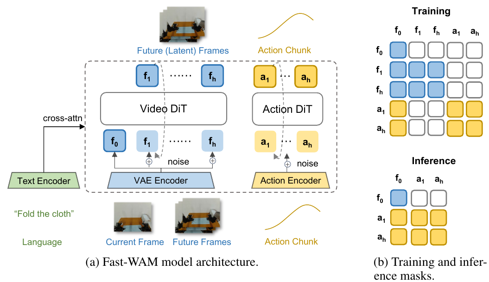
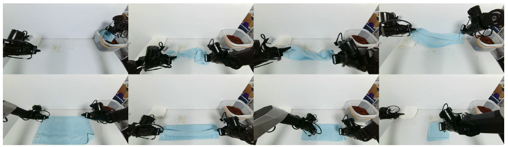
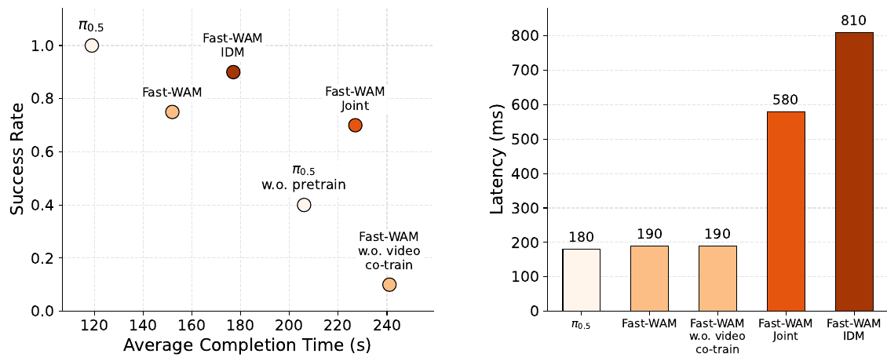

# Fast-WAM: Do World Action Models Need Test-time Future Imagination?

> **Brief:** Fast-WAM learns actions together with future-video prediction, but generates only actions at inference. A structured attention mask makes action prediction independent of future-video tokens, allowing a pretrained video backbone to provide useful representations without expensive future-video denoising. The main finding is that video co-training matters more than test-time imagination in the evaluated settings.

**Reference:** Tianyuan Yuan, Zibin Dong, Yicheng Liu, and Hang Zhao, Tsinghua University and Galaxea AI, 2026. This note follows the supplied **arXiv:2603.16666v2 PDF, dated March 23, 2026**.

## Convenient Links

* [Paper, arXiv v2](https://arxiv.org/abs/2603.16666v2)
* [Official project page](https://yuantianyuan01.github.io/FastWAM/)
* [Official code](https://github.com/yuantianyuan01/FastWAM)
* [Diffusion Policy note](./Diffusion_Policy.md)
* [pi0.5 note](./Pi_0_5.md)
* [LIBERO note](../Datasets/LIBERO.md)

## 1. What Question Does Fast-WAM Ask?

A **World Action Model (WAM)** combines visual world modeling with action prediction. Many WAMs generate future observations before, or jointly with, actions. Fast-WAM separates two possible sources of their performance:

| Component | When it happens | Potential benefit or cost |
|:--|:--|:--|
| Video co-training | Training | Predicting future observations encourages representations that capture motion and interactions |
| Explicit future imagination | Inference | Generated futures can guide actions, but iterative video denoising adds substantial latency |

Let $o$ be the current visual observation, $l$ the language instruction, $a_{1:H}$ an action chunk of horizon $H$, and $v_{1:T}$ future visual observations. An imagine-then-execute policy can be expressed as

$$
p(a_{1:H}\mid o,l)
=\int p(v_{1:T}\mid o,l)\,
p(a_{1:H}\mid o,l,v_{1:T})\,dv_{1:T}.
$$

Conceptually, it predicts a possible future and then produces actions conditioned on that future. Implementations may generate video and actions jointly rather than use two strictly sequential modules.

Fast-WAM instead uses

$$
p_\theta(a_{1:H}\mid o,l)
=p_\theta(a_{1:H}\mid z(o,l)),
$$

where $z(o,l)$ is a representation computed from the current context by the video backbone. It is **not a sampled future video**. The backbone learns with future-video supervision, but the deployed policy does not need to render or denoise a future to act.

This is a direct policy at inference, not a planner that searches over candidate future trajectories.

## 2. Architecture and Information Flow



*The current observation is the shared visual context. Future-video tokens and action tokens both access it, but actions cannot access future-video tokens. At inference, the future tokens disappear. Cropped from Figure 2, p. 5.*

### 2.1 Components

There are **three encoders and two interacting transformer branches**, rather than a video generator whose output is fed into an action generator in sequence:

| Component | Input | Output and role |
|:--|:--|:--|
| Built-in T5 text encoder | Instruction string $l$ | Language embeddings $L$, supplied to both transformer branches through cross-attention |
| Pretrained video VAE encoder | Camera images/video | Compressed visual latents; this is a visual encoder, not the action generator |
| Action encoder, shown in Figure 2 | Numerical action variables at the sampled noise level | Action embeddings suitable for the action DiT; these are not words or discrete FAST tokens |
| Pretrained Wan2.2-5B video DiT | Clean current-observation tokens and, during training, noisy future-video tokens | Contextual visual features and predictions of future-latent flow velocity; DiT means Diffusion Transformer |
| Action expert DiT | Noisy action embeddings, visual context, language, and noise-level conditioning | Predicted action flow velocity, used to update the noisy action chunk |

The action expert has hidden dimension **1024** and approximately **1B parameters**; the reported total model size is approximately **6B**. Its transformer architecture follows the video branch at a reduced hidden width. The paper does not specify the exact action encoder/output projection layers or all tensor dimensions.

The **Mixture-of-Transformer (MoT)** structure connects modality-specific branches through shared attention. It is not a learned top-$k$ router selecting interchangeable experts. Likewise, "shared attention" does not mean that the 5B video branch and 1B action branch have identical weights or hidden widths.

Keep three visual quantities separate: **VAE latents** encode images, **DiT hidden features** provide context for actions, and **predicted flow velocities** are the video branch's training outputs. None of these is itself a decoded RGB future video.

### 2.2 Three token groups

1. **Current observation:** clean latent tokens $f_0$ from the first/current frame. The symbol represents a group of tokens, not necessarily one token.
2. **Future video:** noisy latent tokens for future frames, used during training for video prediction.
3. **Actions:** noisy action tokens processed by the action expert.

The attention mask is the central design choice. In the following table, rows are query groups and columns are the key/value groups they can read:

| Query group | Current observation | Future video | Actions |
|:--|:--:|:--:|:--:|
| Current observation | Yes | No | No |
| Future video | Yes | Yes | No |
| Actions | Yes | No | Yes |

Attention within the future-video group and within the action group is bidirectional. Language cross-attention is separate from this table.

**Why must the current observation also be isolated?** Blocking only direct action-to-future attention would not suffice: if current-observation tokens could read future tokens, actions could retrieve that future information indirectly through the observation. The mask blocks both routes. It also keeps the observation representation independent of the noisy actions.

**How can video training help actions if the branches cannot read each other?** They share the visual backbone and current-observation representations. The video-prediction loss supplies gradients that shape these shared parameters; actions then use the resulting representations. Sharing learned parameters does not require access to a particular future sample during the forward pass.

Consequently, deleting future tokens at inference does not remove an input that the action branch was allowed to rely on during training. This is a trained architectural property, not an inference-only shortcut applied to an arbitrary WAM.

### 2.3 How the branches interact inside the model

Read the mask as a rule applied throughout transformer processing, not just a filter on the final output. At a given layer, let $O$, $F$, and $A$ denote the hidden tokens for the current observation, future video, and actions. The permitted attention operations can be summarized as

$$
\begin{aligned}
\Delta O &= \operatorname{Attn}(Q_O,K_O,V_O),\\
\Delta F &= \operatorname{Attn}(Q_F,[K_O;K_F],[V_O;V_F]),\\
\Delta A &= \operatorname{Attn}(Q_A,[K_O;K_A],[V_O;V_A]).
\end{aligned}
$$

Here $Q$, $K$, and $V$ mean projected queries, keys, and values; subscripts identify their token group. Semicolons concatenate token sequences. For one attention head,

$$
\operatorname{Attn}(Q,K,V)
=\operatorname{softmax}\!\left(\frac{QK^\top}{\sqrt{d_k}}\right)V,
$$

where $d_k$ is the query/key width. These equations explain the mask, not the exact source-code layout. Cross-branch attention requires compatible projected dimensions; it does not imply concatenating the raw hidden states of differently sized branches without projection.

Alongside these interactions, each branch processes its own hidden states with transformer operations and receives language through cross-attention. The noisy branches also need their flow-noise level to predict the appropriate velocity. The paper does not detail every normalization, projection, or conditioning layer.

**There are not separate video DiTs for the current and future frames.** These are two token groups processed by the video backbone. The action expert reads permitted current-observation features through attention; it does not consume the video branch's predicted future or video-output head.

An important consequence is that Fast-WAM's future-video branch also **cannot read actions**. Its video objective is conditioned on observation and language, not an explicit action-conditioned simulator of the form $p(v\mid o,l,a)$. Here, "world modeling" should not be mistaken for rolling out a supplied candidate action sequence.

## 3. Training Pipeline: From Demonstrations to Two Losses

### 3.1 What one training example contains

Take a time window from a recorded robot demonstration:

$$
(o,l,A^*,V^*),\qquad A^*=a^*_{1:H}\in\mathbb R^{H\times d_{\mathrm{act}}}.
$$

| Data | Meaning | Use in training |
|:--|:--|:--|
| $o$ | Current camera observations | Clean conditioning input shared by both branches |
| $l$ | Task instruction, such as "Fold the cloth" | Language conditioning for both branches |
| $A^*$ | Recorded continuous robot actions following the observation | Clean target from which noisy action inputs and action-loss targets are constructed |
| $V^*$ | Recorded future camera frames from the same demonstration window | Clean video supervision, encoded into latent targets and then noised |

$H=32$ is the number of physical action steps in the chunk. The action dimension $d_{\mathrm{act}}$ depends on the robot representation and is not specified in the paper. A batch adds a leading batch dimension to these quantities.

**The training future is recorded data, not a future first imagined by the model.** Ground-truth future frames supervise their own branch; they are not privileged conditioning inputs to the action branch.

### 3.2 Encode language, images, and actions in their respective spaces

1. **Language:** T5 converts the instruction into an embedding sequence $L=E_{\mathrm{text}}(l)$. Language reaches both DiTs through cross-attention, rather than being treated as another camera frame.
2. **Images:** concatenate the multiple camera views into a single image at each selected time, then use the pretrained video VAE to obtain visual latents. Separate the clean current-observation group $O_0$ from the future target latents $Z^*$. This is a logical separation; the paper does not prescribe the exact VAE-call layout.
3. **Actions:** keep the demonstration's numerical action chunk as the clean target $A^*$. After noise is added as below, the action encoder maps the noisy variables into transformer embeddings. An action-output mapping returns the predicted velocity to action space for the loss.

The paper uses temporal downsampling by 4 and **9 video frames per chunk**. That is a frame count, not a claim that the DiT receives 9 visual tokens. VAE compression and visual tokenization determine the latent sequence length; the exact token counts and image resolution are not given. Similarly, a 32-step action chunk and an action hidden width of 1024 describe different axes, not 1024 physical action coordinates.

The current-observation representation must contain only currently available visual information. Keeping its DiT attention isolated would not repair a preprocessing pipeline that had already mixed future information into it.

### 3.3 Add noise only to the prediction targets

Fast-WAM uses the same flow-matching formulation for both modalities. Let $y$ be either $A^*$ or $Z^*$. The latter is the paper's future-latent target $z_{1:T}$, distinct from the conditioning representation $z(o,l)$ in Section 1.

Sample Gaussian noise $\epsilon\sim\mathcal N(0,I)$ and a noise level $t\in(0,1)$, then form

$$
y_t=(1-t)y+t\epsilon.
$$

At $t=0$ this is clean data; at $t=1$ it is pure noise. The target velocity follows directly by differentiation:

$$
\frac{dy_t}{dt}=\epsilon-y.
$$

Thus the two prediction paths receive noisy actions $A_t$ and noisy future latents $Z_t$. **Do not add this target noise to $O_0$ or the instruction.** The notation $t$ describes the noise level for either branch; the paper does not specify whether the two branches share a sampled level or draw levels independently.

The model predicts the corresponding velocity, with loss

$$
\mathcal L_{\mathrm{FM}}(y)
=\mathbb E_{y,\epsilon,t}
\left[\left\|f_\theta(y_t,t,o,l)-(\epsilon-y)\right\|_2^2\right].
$$

Concretely, the action output is compared with $\epsilon_A-A^*$ and the video output with $\epsilon_Z-Z^*$. Their output shapes must match the action chunk and future latent target, respectively. These are **velocity predictions**, not direct clean-action or RGB-frame predictions from one forward pass.

The two branch losses are combined:

$$
\mathcal L_{\mathrm{act}}=\mathcal L_{\mathrm{FM}}(A^*),
\qquad
\mathcal L_{\mathrm{vid}}=\mathcal L_{\mathrm{FM}}(Z^*),
$$

$$
\boxed{\mathcal L=\mathcal L_{\mathrm{act}}+\lambda\mathcal L_{\mathrm{vid}}.}
$$

$\lambda$ balances action learning and video supervision; its numerical value is not specified in the paper. The masks determine which inputs each branch of $f_\theta$ can access.

**Noise time is not robot time.** The variable $t$ indexes the flow from data to noise, while $H$ and $T$ index action and video horizons. At inference, action generation starts from noise and integrates the learned field in the reverse direction, from $t=1$ toward $t=0$.

### 3.4 One training forward pass

```text
Recorded instruction ----------------> T5 --------------------> L
Recorded current camera views -------> VAE / tokenization ----> O0 (clean)
Recorded future camera frames -------> VAE -> Z* -> add noise -> Zt
Recorded action chunk ----------------------> A* -> add noise -> At

Video DiT:  O0 and embedded Zt, conditioned on L and noise level
  O0 tokens read only O0 tokens
  O0 hidden features -> current-observation context C for the action branch
  Zt tokens read O0 and Zt tokens
  future-token output -> latent-velocity prediction -> video loss

Action DiT: action-encoder(At), conditioned on C, L, and noise level
  action tokens read current-observation features C and action tokens
  action tokens cannot read future-video tokens Zt
  action output -> action-velocity prediction -> action loss

action loss + lambda * video loss -> backpropagate -> optimizer update
```

The branches interact within the masked MoT computation; the layout above separates their roles for explanation. It does **not** mean that training first generates a complete future and then runs the action model.

**The action branch has the same conditioning in training and inference:** current-observation features $C$, language embeddings $L$, and the noise level $t$, alongside the noisy action input $A_t$. Schematically, its velocity prediction is

$$
\hat u_A=\hat u_{A,\theta}(A_t,t;C,L).
$$

Here $C$ denotes the current-observation features produced by the video backbone and accessed through masked attention, potentially at multiple layers. It is not the raw VAE latent $O_0$ or the predicted future video. Training constructs $A_t$ from a recorded action chunk and noise; inference starts from pure noise and updates it repeatedly. Neither phase conditions actions on future-video tokens.

For the stated flow-matching objective, a training example is evaluated at sampled noise levels. Training does not require executing the full 10-step inference denoising loop for each example. Nor does this latent-space video loss require decoding a generated video into pixels before computing the loss.

Backpropagation updates the trainable parameters through both losses. In particular, video learning shapes the visual backbone used by the action branch, even though future-token activations cannot flow into actions. This is **joint representation learning**, not teacher-generated action labels or a separate distillation stage. The paper does not give a complete list of frozen versus trainable encoder parameters.

## 4. Inference Pipeline: Encode Once, Denoise Actions Repeatedly

### 4.1 One policy call

Only the current observation and instruction are available. There are no recorded future frames or target actions.

```text
Instruction -> T5 -> language embeddings L
Current camera views -> concatenate -> VAE -> clean observation tokens O0
O0 + L -> ONE video-DiT pass -> reusable observation context C

Gaussian action noise A(1)
  -> action encoder -> action DiT with C, L, current noise level
  -> action-velocity prediction -> update noisy actions
  -> repeat for 10 denoising steps -> final 32-step action chunk
```

1. **Build conditioning once:** encode the instruction and current images, then process the clean observation tokens with the video backbone. Here $C$ names the reusable visual context; it is the representation summarized as $z(o,l)$ earlier, not a predicted future.
2. **Initialize the unknown actions:** sample Gaussian noise with the shape of an action chunk, $A^{(1)}\sim\mathcal N(0,I)$ in $\mathbb R^{H\times d_{\mathrm{act}}}$. Unlike training, there is no clean $A^*$ to mix with this noise.
3. **Predict and apply a velocity repeatedly:** embed the current noisy actions, run the action DiT using visual and language conditioning, and update the action variables toward the clean end of the flow. Reuse the visual context, but recompute action features because the actions and noise level change.
4. **Return numerical actions:** after 10 denoising steps, output the 32-step action chunk. This is not a sequence of text tokens and does not require a VAE video decoder.

For intuition, a first-order Euler update would be

$$
A^{(t_{j+1})}
=A^{(t_j)}+(t_{j+1}-t_j)
\hat u_A\!\left(A^{(t_j)},t_j;C,L\right),
\qquad t_{j+1}<t_j,
$$

where $\hat u_A$ is the predicted action velocity. The negative time increment moves from noise toward data. This is an illustrative integration step, not a claim that the paper specifies this exact solver or time grid. It reports 10 denoising steps and CFG scale 1.0, but not the full numerical integration configuration.

### 4.2 Why the video computation is reusable

The mask explains why the visual computation can be reused: observation tokens depend on neither future-video tokens nor the changing noisy action tokens. Their context does not need to be recomputed from those tokens at each action-denoising step.

At the attention level, this permits reusing observation-side keys and values while recomputing action-side queries, keys, and values. That is an implementation interpretation of the dependency structure; the paper does not specify the cache layout or API. The conditioning may be a collection of layerwise features, not necessarily one pooled vector passed only into the first action layer.

This reuse is **within a policy call**. A new camera observation requires new visual context. The predicted chunk is then available to the controller; the paper does not specify the exact execution/replanning schedule.

| Item | Training | Inference |
|:--|:--|:--|
| Current observation and language | Clean conditioning | Clean conditioning |
| Future video | Recorded targets, encoded and noised for the video loss | Absent; no future tokens or future denoising |
| Action input | Recorded chunk mixed with noise at a sampled level | Start from pure noise, then use the iteratively updated chunk |
| Video DiT | Processes current and noisy future token groups | Processes only current-observation tokens once |
| Action DiT | Predicts velocity at sampled noise levels | Predicts velocities over 10 denoising steps |
| Output supervision | Action and future-latent velocity losses | No losses or ground-truth targets |
| VAE video decoder | Not required by the stated latent-space loss | Not required for action generation |

**The entire policy is not a one-step action generator.** Fast-WAM removes future-video generation, not the video backbone or iterative action denoising. It also does not change from future-conditioned actions in training to observation-only actions at inference: actions use only observation/language context in both phases.

The reported **190 ms** is inference latency on one NVIDIA RTX 5090D V2 32GB GPU. It is not a 190 ms duration for each physical action, and a 32-action chunk does not by itself specify the robot's controller frequency or how many actions execute before replanning.

## 5. Training Data and Settings

### 5.1 Pretraining versus downstream policy training

```text
Pretrained general video model: Wan2.2-5B
  -> Add the action expert
  -> Train on robot demonstrations with action + future-video objectives
  -> Evaluate the trained policy on the corresponding benchmark/task
```

**"Without embodied pretraining" does not mean training from scratch.** Fast-WAM starts from pretrained video-model weights. It avoids a separate large-scale robot-policy pretraining stage before the reported downstream training, but still learns from the robot demonstrations listed below. These results are not zero-shot robot control.

| Setting | Demonstrations | Training steps | Evaluation |
|:--|:--|:--|:--|
| LIBERO | Four suites, each with 500 demonstrations over 10 tasks; 2,000 demonstrations total | 20k | 2,000 trials across 40 tasks |
| RoboTwin 2.0 | 2,500 clean-scene and 25,000 randomized-scene demonstrations; multi-task training | 30k | 100 trials per task in each of the clean and randomized conditions |
| Real-world towel folding | 60 hours of teleoperation on Galaxea R1 Lite | 30k | Success rate and average task-completion time |

The RoboTwin setup is described as spanning more than 50 tasks; Appendix Table 3 gives the per-task breakdown. The real-world task is one deformable-object manipulation task, not a broad real-world task suite.



*The real-world evaluation requires coordinated manipulation of a deformable towel over multiple stages. Cropped from Figure 3, p. 7.*

| Hyperparameter | Reported setting |
|:--|:--|
| Action horizon | 32 actions |
| Video sampling | Temporal downsampling by 4; 9 video frames per chunk |
| Optimizer | AdamW |
| Learning rate / weight decay | $10^{-4}$ / 0.01 |
| Learning-rate schedule | Cosine annealing |
| Precision / gradient clipping | Mixed precision / 1.0 |
| Noise schedule | Described as logit-normal over $t$ for training and inference |
| Inference denoising / CFG | 10 steps / scale 1.0 |

The paper does not provide a detailed freeze/unfreeze curriculum, batch size, or the complete noise-schedule parameterization. Those should not be inferred from the neighboring VLA recipes.

## 6. Controlled Variants: Separating the Two Effects

| Variant | Video co-training | Test-time future video | How actions are generated |
|:--|:--:|:--:|:--|
| **Fast-WAM** | Yes | No | Condition on current-observation representations |
| Fast-WAM-Joint | Yes | Yes | Jointly denoise video and actions, allowing attention between them |
| Fast-WAM-IDM | Yes | Yes | Generate future video first, then condition action prediction on it |
| Fast-WAM without video co-training | No | No | Same architecture and inference as Fast-WAM; remove the video objective |

**IDM** means inverse dynamics model: given the current observation and a desired/predicted future, infer actions connecting them. Its training uses noise augmentation on ground-truth video tokens with probability 0.5, following the compared design.

The authors align backbone, tokenization, and training recipes as closely as possible. Joint and IDM nevertheless change attention or conditioning, so they are controlled architectural comparisons, not merely the same checkpoint with video generation toggled off.

The no-video ablation still starts from the pretrained video backbone. It tests the value of **video co-training during robot-policy learning**, not whether general video pretraining is useful.

## 7. Results and Their Interpretation

### 7.1 RoboTwin 2.0

Success rates in percent, from paper Table 1. "Embodied PT" means the separate embodied pretraining reported for the baseline, not downstream training on RoboTwin demonstrations.

| Method | Embodied PT | Clean | Randomized | Average |
|:--|:--:|--:|--:|--:|
| pi0 | Yes | 65.92 | 58.40 | 62.2 |
| pi0.5 | Yes | 82.74 | 76.76 | 79.8 |
| Motus | Yes | 88.66 | 87.02 | 87.8 |
| Motus from Wan2.2 | No | 77.56 | 77.00 | 77.3 |
| LingBot-VA | Yes | 92.90 | 91.50 | 92.2 |
| LingBot-VA from Wan2.2 | No | 80.60 | Not reported | Not comparable* |
| **Fast-WAM** | No | **91.88** | **91.78** | **91.8** |
| Fast-WAM-Joint | No | 90.84 | 90.32 | 90.6 |
| Fast-WAM-IDM | No | 91.16 | 91.34 | 91.3 |
| Fast-WAM without video co-training | No | 82.76 | 84.80 | 83.8 |

*The source lists 80.6 in the average column for LingBot-VA from Wan2.2, but reports only its clean score. It is not a two-condition average like the other rows.*

Fast-WAM is close to pretrained LingBot-VA and slightly above both imagine-then-execute variants in the reported average. Removing video co-training costs **8.0 percentage points**, much more than the differences among the three video-co-trained variants.

### 7.2 LIBERO

Success rates in percent, from paper Table 2.

| Method | Embodied PT | Spatial | Object | Goal | Long | Average |
|:--|:--:|--:|--:|--:|--:|--:|
| OpenVLA | Yes | 84.7 | 88.4 | 79.2 | 53.7 | 76.5 |
| pi0 | Yes | 96.8 | 98.8 | 95.8 | 85.2 | 94.1 |
| pi0.5 | Yes | 98.8 | 98.2 | 98.0 | 92.4 | 96.9 |
| LingBot-VA | Yes | 98.5 | 99.6 | 97.2 | 98.5 | 98.5 |
| Motus | Yes | 96.8 | 99.8 | 96.6 | 97.6 | 97.7 |
| **Fast-WAM** | No | **98.2** | **100.0** | **97.0** | **95.2** | **97.6** |
| Fast-WAM-Joint | No | 99.6 | 99.4 | 98.2 | 96.8 | 98.5 |
| Fast-WAM-IDM | No | 98.8 | 97.8 | 97.8 | 97.6 | 98.0 |
| Fast-WAM without video co-training | No | 89.2 | 99.2 | 95.4 | 90.0 | 93.5 |

Fast-WAM is competitive, but not the highest-scoring model. Removing video co-training costs **4.1 percentage points** overall, including **9.0** on Spatial and **5.2** on Long. By comparison, adding explicit future generation improves the reported average by only 0.9 points for Joint or 0.4 for IDM.

### 7.3 Real-world quality and inference speed



*Left: eventual task success versus physical task-completion time. Right: model inference latency, which is a different metric. Cropped from Figure 4, p. 9.*

The following success rates and completion times are approximate readings from the left-hand plot, not a separate numerical results table:

| Method | Success | Average completion time |
|:--|--:|--:|
| pi0.5 with pretraining | ~100% | ~120 s |
| **Fast-WAM** | **~75%** | **~150 s** |
| Fast-WAM-IDM | ~90% | ~180 s |
| Fast-WAM-Joint | ~70% | ~230 s |
| pi0.5 without pretraining | ~40% | ~205 s |
| Fast-WAM without video co-training | ~10% | ~240 s |

Pretrained pi0.5 remains the strongest real-world model in this comparison. Within the Fast-WAM family, IDM has higher success than Fast-WAM, while Fast-WAM completes the task faster. Thus, removing future generation produces a **speed/success tradeoff** here, not uniformly identical performance.

The latency values below are explicitly labeled in the right-hand plot:

| Method | Inference latency |
|:--|--:|
| pi0.5 | 180 ms |
| **Fast-WAM** | **190 ms** |
| Fast-WAM without video co-training | 190 ms |
| Fast-WAM-Joint | 580 ms |
| Fast-WAM-IDM | 810 ms |

Fast-WAM is approximately **3.1 times faster than Joint** and **4.3 times faster than IDM**. The paper's "over 4x" headline applies to the IDM comparison, not both variants. Video co-training improves the deployed policy without changing its reported inference latency relative to the no-video ablation.

## 8. Takeaways and Limits

1. **Separate learning a world representation from generating a future.** Predicting future video can be valuable supervision even when deployment requires only actions.
2. **The attention mask makes the separation possible.** Actions never rely on future-video tokens, directly or indirectly through observation tokens, during training.
3. **Single-pass visual encoding does not mean single-step action generation.** Fast-WAM retains iterative action denoising while removing iterative video denoising.
4. **The strongest evidence is the controlled ablation.** Dropping video co-training hurts more than dropping test-time imagination on the reported simulation averages; real-world results also show a substantial co-training benefit.
5. **Do not generalize this to all planning problems.** The real-world evaluation covers one task, IDM retains a success advantage there, and the paper does not report uncertainty estimates or the real-world trial count. It also does not fully specify how failed trials enter the completion-time average. These results do not establish that explicit future prediction is unnecessary for every task or distribution shift.

**In one sentence:** Fast-WAM uses future-video prediction to improve a policy that acts from current observations, without requiring it to generate future video every time it acts.
