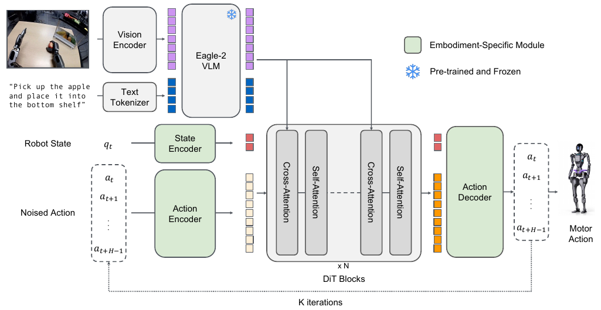
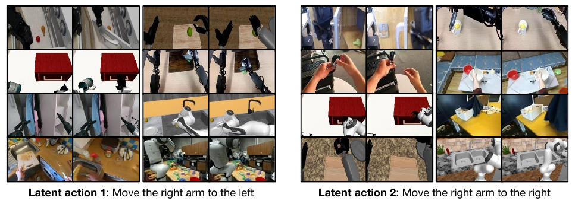

# [GR00T N1: An Open Foundation Model for Generalist Humanoid Robots](https://arxiv.org/abs/2503.14734)

GR00T N1 combines an **Eagle-2 vision-language backbone** with a **cross-attention action transformer trained by flow matching**. Its other main contribution is a data pipeline: real robot demonstrations, physics simulation, human videos, and generated robot videos provide complementary supervision for one cross-embodiment policy.

**Source:** the supplied NVIDIA et al. paper, arXiv:2503.14734v2, especially Sections 2-4 and Appendices E-F. This note describes **N1**, not later GR00T versions. The released GR00T-N1-2B has **2.2B parameters**, including a **1.34B VLM**.

## Convenient Links

* [Paper](https://arxiv.org/abs/2503.14734v2)
* [pi0](./Pi_0.md) / [Diffusion Policy](./Diffusion_Policy.md) / [Open X-Embodiment](../Datasets/Open_X_Embodiment.md)

## 1. What Problem Does the Design Solve?

A generalist robot needs both **scene/task understanding** and **embodiment-specific motor control**. Internet vision-language training helps with the first, but does not directly teach the second. Robot demonstrations supply motor supervision, but are expensive and heterogeneous.

GR00T addresses these two gaps together:

* **Architecture:** a VLM provides visual-language features; a smaller action path turns those features and the robot state into continuous actions.
* **Data:** embodiment-specific input/output modules let a shared policy learn from different robots and from video-derived action representations.

For robot embodiment $e$, a motor-action training example is

$$
o_t=(I_t^1,\ldots,I_t^n,\ell_t,q_t),\qquad
A_t=[a_t,\ldots,a_{t+H-1}]\in\mathbb R^{H\times d_a^{(e)}},\quad H=16.
$$

Here $t$ is robot time, $I_t^i$ are current camera images, $\ell_t$ is the instruction, and $q_t$ is proprioception. State/action dimensions and meanings depend on the embodiment: joint-based humanoid control and end-effector-based arm control are not interchangeable coordinates. The output is a **16-step action chunk**, not text or future video.

## 2. How the VLM and Action Transformer Connect



*Paper Figure 3: image/language features feed DiT cross-attention; state/action encoders and the action decoder are embodiment-specific. The loop denotes iterative action refinement, not repeated video generation.*

### 2.1 System 2 Produces a Feature Memory

Eagle-2 combines **SigLIP-2** with **SmolLM2**. Each image is encoded at $224\times224$ resolution and reduced by pixel shuffle to **64 visual tokens**. Image tokens and the instruction enter the language model in Eagle-2's chat format.

GR00T extracts the **12th-layer** vision-language representations:

$$
\varphi_t=\operatorname{Eagle2}_{\leq12}(I_t^{1:n},\ell_t)
\in\mathbb R^{B\times N_{\mathrm{VL}}\times d_{\mathrm{VL}}}.
$$

$B$ is batch size and $N_{\mathrm{VL}}$ includes the visual and text tokens. The paper reports better downstream success and faster inference with these intermediate features than final-layer features. "System 2" here does **not** mean the VLM must generate a textual plan or chain of thought before acting.

### 2.2 System 1 Reads That Memory and Refines Actions

The action path receives the current state and a noisy candidate chunk $A_t^\tau$, where $\tau$ is **flow time**, not robot time. Its modules are:

| Module | Input and role |
|:--|:--|
| Embodiment-specific state MLP | Projects $q_t$ into the shared DiT feature space |
| Embodiment-specific action MLP | Embeds noisy action vectors together with flow time $\tau$ |
| Shared DiT | Alternates cross-attention to $\varphi_t$ with self-attention over state/action tokens; also conditions on $\tau$ through adaptive layer normalization |
| Embodiment-specific decoder MLP | Maps the final $H$ action hidden states to a flow field of shape $B\times H\times d_a^{(e)}$ |

**Where is the coupling?** Let $h$ denote the evolving DiT state/action stream. Schematically, one cross-attention head computes

$$
Q=hW_Q,\quad K=\varphi_tW_K,\quad V=\varphi_tW_V,\qquad
\operatorname{CrossAttn}(h,\varphi_t)
=\operatorname{softmax}\!\left(\frac{QK^T}{\sqrt{d_k}}\right)V.
$$

The query comes from the action path; keys/values come from VLM features. Cross-attention supplies task/scene information, while self-attention coordinates the state and all actions in the chunk. Each DiT cross-attention layer has its own projections but reads the **same selected-layer VLM feature memory**.

This differs from [pi0's layerwise coupling](./Pi_0.md#23-attention-determines-the-conditioning-and-the-cache): pi0 uses corresponding VLM/expert layers in masked joint attention. GR00T does **not** pair DiT layer $l$ with VLM layer $l$, concatenate both branches' Q/K/V, or require matching transformer depths. The feature interface decouples their architectures.

During policy pre-training and post-training, the **language model stays frozen**, while the vision encoder, DiT, and embodiment adapters are trained. Thus joint policy training does not mean every VLM parameter is updated.

The adapters solve a dimension/interface problem; the next question is how to obtain useful action targets when a video has no recorded motor commands.

## 3. How Different Data Sources Become Training Examples

### 3.1 Separate the Observation from the Supervision

The deployed policy sees current images, language, and robot state. **Future frames are used offline to build labels**, not supplied to the deployed policy.

| Data source | Available supervision | How GR00T uses it |
|:--|:--|:--|
| Real robot demonstrations | Recorded states and motor actions | Motor-action flow targets; videos also provide latent-action targets |
| Physics simulation | Simulated states and motor actions | Action-labeled trajectories, with latent labeling also applicable |
| Human egocentric videos | Visual motion, but no robot motor actions | Learned latent-action targets under a distinct "LAPA" embodiment |
| Neural-generated robot videos | Images, but no measured motor actions | Latent actions and/or inverse-dynamics pseudo-actions |

Internet-scale vision-language knowledge enters through Eagle-2 pretraining. It should not be confused with an explicitly specified web-caption loss mixed into every robot-training batch.

### 3.2 Latent Actions: Learn What Changed without Requiring Robot Coordinates

The first labeler is a **VQ-VAE trained jointly on heterogeneous videos**. For a current/future frame pair, its training path is

$$
z_t=E(x_t,x_{t+H}),\qquad
\bar z_t=\operatorname{NearestCode}(z_t),\qquad
\hat x_{t+H}=D(x_t,\bar z_t).
$$

The encoder must describe the change between frames; the decoder reconstructs the future frame from the current frame and quantized motion representation. The VQ-VAE objective learns a shared representation across human and robot videos.

**After this labeler is trained, GR00T uses the continuous, pre-quantization embedding $z_t$ as the action label**, not the discrete codebook index. These labels are treated as a separate **LAPA embodiment** and learned with the same flow-matching objective through the appropriate adapters. They are neither language tokens nor commands that can be sent directly to a robot.



*Paper Figure 4: frame pairs with similar latent embeddings show corresponding leftward or rightward arm motion across different embodiments. This illustrates shared motion structure, not identical joint commands.*

For example, a human hand moving toward a cup and a robot gripper moving toward a cup can provide related motion supervision without sharing an action dimension. Real robot data still supplies the motor targets needed to ground the deployed robot's output. The paper does not fully specify missing-proprioception handling or the exact latent-label sequence layout for human videos; a robot state should not be assumed available there.

### 3.3 Inverse Dynamics: Predict Robot Actions When Motor-Labeled Data Exists

The second labeler is an **embodiment-specific inverse dynamics model (IDM)** trained on real action-labeled trajectories:

$$
(x_t,x_{t+H})\xrightarrow{\text{IDM}}\hat A_t.
$$

It uses SigLIP-2 image features and a flow-matching DiT to predict the intervening motor-action chunk. Once trained, it labels frame pairs from generated videos. Unlike LAPA, this supervision estimates the robot's action coordinates rather than a learned latent motion space.

Although the VQ-VAE encoder also performs an inverse-dynamics role, the paper's **"IDM-labeled actions"** refer to this motor-supervised model. Its predictions remain **pseudo-labels**, not measured actions. In post-training with generated videos, the paper treats pseudo-actions as labels for a different embodiment rather than assuming they are equivalent to real demonstrations.

### 3.4 Expand the Videos and Trajectories Before Policy Training

**Neural trajectories expand visual task variations.** Appendix F uses **WAN2.1-I2V-14B**, LoRA-fine-tuned on teleoperation videos. A multimodal LLM inspects an initial scene and proposes new feasible object/source/destination instructions. The video model generates trajectories from the initial image and instruction; a multimodal judge checks instruction adherence, and failed cases undergo re-captioning.

The full path is therefore:

```text
Real teleoperation videos -> fine-tune image-to-video model
Initial image + new instruction -> generated video -> check/re-caption
Generated current/future frame pairs -> LAPA and/or IDM labels
Current images + instruction + available state -> GR00T policy
Video-derived action labels -> supervise the policy's action output
```

The paper expands **88.4 hours of in-house GR-1 demonstrations into 827.3 hours of generated videos**. Those 827.3 hours are not additional measured robot-action data. Video generation and both labelers are **offline preparation tools**, absent from normal policy inference.

**Simulation supplies physically executed action labels.** DexMimicGen segments seed demonstrations into object-centric subtasks, transforms end-effector trajectories to new object poses, connects segments, and replays them in physics simulation. Only successful trajectories are retained. Unlike a neural video, the simulation rollout already provides motor actions and states.

The headline **780,000 trajectories / 6,500 hours generated in 11 hours** covers combined pre- and post-training data generation; it is not the simulation duration in the pre-training corpus below.

## 4. What One Policy Training Step Computes

Once targets have been prepared, the policy need not reconstruct future video. It learns to transform noise into an action target conditioned on the current observation.

For a motor-action example, sample Gaussian noise $\epsilon$ with the same shape as $A_t$ and a flow time $\tau$:

$$
A_t^\tau=(1-\tau)\epsilon+\tau A_t,\qquad
\frac{dA_t^\tau}{d\tau}=A_t-\epsilon.
$$

Thus $\tau=0$ is noise and $\tau=1$ is data. Using a consistent noise-to-action convention, the objective is

$$
\mathcal L_{\mathrm{fm}}
=\mathbb E_{(o_t,A_t,e),\epsilon,\tau}
\left[\left\|v_\theta(\varphi_t,q_t,A_t^\tau,\tau;e)
-(A_t-\epsilon)\right\|_F^2\right].
$$

The velocity prediction is conditioned on **current visual-language features, robot state, the noisy chunk, time, and the embodiment-specific interface**. It is not an unconditional action denoiser. Latent-action examples use their continuous latent targets and corresponding adapter instead of motor coordinates.

> **Source sign caveat:** page 5, Equation (1) of the supplied v2 prints the target $\epsilon-A_t$, despite using the interpolation above and a positive Euler update from noise at $\tau=0$. Those signs are inconsistent. This note uses $A_t-\epsilon$, the derivative of the stated path; the opposite target requires reversing the time/update convention. This is a clarification of the printed equations, not a claim about a particular code version.

In one training step, encode current images/language, mix the target with noise, run the embodiment encoders and conditioned DiT, decode the velocity, and compare it with the target velocity. Training samples flow times using the paper's shifted Beta distribution, biased toward noisier inputs; it does **not** unroll all four inference steps for every example.

To improve spatial grounding, an auxiliary head on vision-language features predicts the normalized 2D center $c$ of the instruction's target object. OWL-v2 supplies bounding-box annotations, converted to center coordinates:

$$
\mathcal L_{\mathrm{det}}=\|c_{\mathrm{pred}}-c_{\mathrm{gt}}\|_2^2,
\qquad \mathcal L=\mathcal L_{\mathrm{fm}}+\mathcal L_{\mathrm{det}}.
$$

This adds object-localization supervision during training; the deployed policy still outputs actions rather than requiring an external detector to choose them.

## 5. Pre-Training Builds Breadth; Post-Training Specializes It

The following aggregates are from **Table 7**, not the larger combined simulation-generation claim:

| Pre-training source | Hours | Examples |
|:--|--:|:--|
| Real robots | 3,288.8 | GR-1, Open X-Embodiment subsets, AgiBot-Alpha, RH20T-Robot |
| Human videos | 2,517.0 | Ego4D, Ego-Exo4D, HoloAssist, other egocentric datasets |
| Physics simulation | 1,742.6 | GR-1 manipulation trajectories |
| Neural-generated videos | 827.3 | Generated GR-1 trajectories |
| **Total** | **8,375.7** | **592.9 million frames** |

Pre-training mixes these sources and embodiments to learn shared visual-motor structure. Post-training then adapts the checkpoint to tasks for one target robot embodiment. The standard recipe keeps the language model frozen in both stages.

| Setting | Pre-training | Post-training |
|:--|:--|:--|
| Batch size | 16,384 | 128 or 1,024 |
| Gradient steps | 200,000 | 20,000-60,000 |
| Optimizer and learning rate | AdamW, $10^{-4}$ | Same |
| Schedule | Cosine decay, 5% warmup | Same |
| Trainable components | Vision encoder, DiT, state/action adapters | Same, for the target embodiment |

Pre-training costs approximately **50,000 H100 GPU-hours**. This is policy pre-training compute, not the entire synthetic-data generation budget.

For the **additional neural-trajectory post-training experiments**, real and generated trajectories are sampled **1:1**. The video generator and IDM are trained only on the permitted low-data subset in low-data evaluations. This matters: otherwise the apparent benefit of synthetic augmentation could hide access to extra real demonstrations.

## 6. Inference: Four Refinements Produce Sixteen Actions

For a fixed current observation:

1. Encode images and instruction into $\varphi_t$ and select the deployed robot's adapters.
2. Initialize $A_t^0\sim\mathcal N(0,I)$ with shape $16\times d_a^{(e)}$.
3. Run **four** conditioned flow updates, with $\tau_k=k/4$:

$$
A_t^{\tau_{k+1}}
=A_t^{\tau_k}+\frac14
v_\theta(\varphi_t,q_t,A_t^{\tau_k},\tau_k;e),
\qquad k=0,1,2,3.
$$

4. Convert the final chunk back to the robot's control representation, execute actions, and refresh observations for subsequent planning.

The VLM feature memory is independent of the changing noisy actions, so it can be computed once and reused across these four refinements. All 16 action positions are refined together; **four solver steps do not mean four robot timesteps**. No future images, latent labeler, IDM, or video generator are required.

The paper reports **63.9 ms to sample a 16-action chunk** on an L40 using bf16. Its introductory 10 Hz System-2 / 120 Hz System-1 description concerns the two-system runtime framing; it should not be read as 120 complete VLM-plus-four-step policy calls per second. Chunk generation latency and robot action execution rate are different quantities.

## 7. What the Experiments Establish

### 7.1 Base-Checkpoint Generalization Is Not Post-Training Performance

Without task-specific post-training, the GR-1 checkpoint is tested on two small, targeted settings, each with 15 trials: left-to-right handover followed by placement, and novel-object placement into a novel container. Reported scores are **76.6%** and **73.3%**, respectively. The first includes partial credit for grasping without successful placement, so it is not a strict whole-task success rate. These are encouraging demonstrations, not comprehensive zero-shot evidence across arbitrary tasks.

### 7.2 Post-Training Improves Data Efficiency

Simulation results with **100 demonstrations per task** (paper Table 2):

| Model | RoboCasa, 24 tasks | DexMG, 9 tasks | GR-1, 24 tasks | Reported all-task average |
|:--|--:|--:|--:|--:|
| BC Transformer | 26.3% | 53.9% | 16.1% | 26.4% |
| Diffusion Policy | 25.6% | 56.1% | 32.7% | 33.4% |
| **GR00T N1** | **32.1%** | **66.5%** | **50.0%** | **45.0%** |

The overall average reflects the task counts, not an unweighted mean of three benchmark percentages. These compare a broadly pretrained, post-trained GR00T with baselines trained from scratch; they do not isolate architecture alone.

Real GR-1 results (paper Table 3; reported overall averages across the evaluation tasks). The real-robot protocol awards partial credit for completed phases, so these are not uniformly binary whole-task success rates:

| Model | 10% of post-training data | Full post-training data |
|:--|--:|--:|
| Diffusion Policy | 10.2% | 46.4% |
| **GR00T N1** | **42.6%** | **76.8%** |

GR00T gains **32.4 percentage points** in the low-data setting and **30.4 points** with full data. Using only 10%, it comes within **3.8 points** of Diffusion Policy trained on all demonstrations. This supports the value of transferring broad pre-training into target-robot learning.

### 7.3 Generated Videos Help, but Label Quality Matters

The neural-trajectory post-training ablation (paper Figure 9) reports RoboCasa gains of **4.2, 8.8, and 6.8 percentage points** with 30, 100, and 300 demonstrations per task, plus **5.8 points** across eight low-data real-robot tasks. LAPA labels slightly outperform IDM labels at the smallest simulation data budget; IDM becomes stronger with more labeled data for training the inverse model.

The connection is important: a generated video is useful only after its visual behavior has been converted into informative action supervision. These experiments test **post-training augmentation**, not the isolated contribution of every source in the full pre-training mixture.

## 8. Limits and Main Takeaway

* **Specialization can remove useful behavior.** The base model sometimes hands an object from left to right; post-training on right-hand-only demonstrations can lose that behavior.
* **Synthetic supervision is imperfect.** Generated videos may violate physics, and IDM outputs may be inaccurate. Latent motion similarity alone does not establish executable motor control.
* **The demonstrated scope is mainly short-horizon tabletop manipulation**, not general humanoid locomotion or long-horizon whole-body autonomy.

The central design is **VLM feature memory + cross-attention flow policy + embodiment-specific adapters**. The data contribution makes that policy trainable beyond directly action-labeled robot demonstrations: simulation supplies grounded commands, while latent learning and inverse dynamics convert human/generated videos into additional supervision. Task-specific post-training then turns that broad prior into a more reliable controller for the chosen robot.
