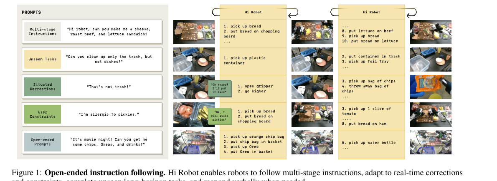
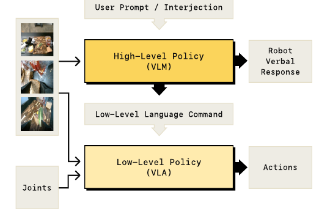
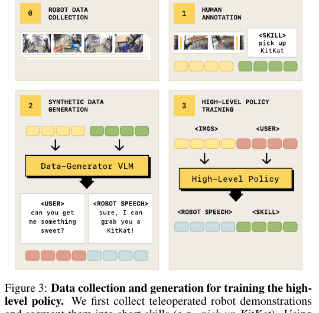
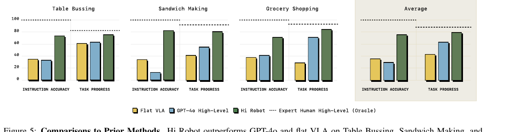
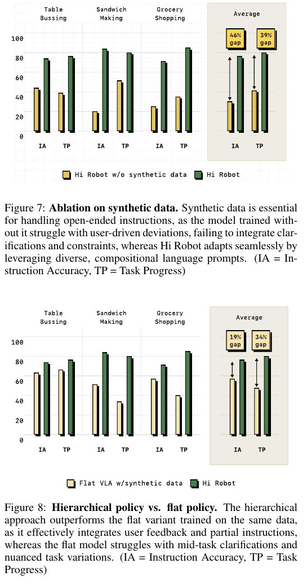

# [Hi Robot: Open-Ended Instruction Following with Hierarchical Vision-Language-Action Models](https://arxiv.org/abs/2502.19417)

## Convenient Links

* [Paper (arXiv)](https://arxiv.org/abs/2502.19417)
* [Project Page](https://www.pi.website/research/hirobot)
* [pi0 note in this repo](./Pi_0.md)
* [pi0.5 note in this repo](./Pi_0_5.md)

## 1. One-Sentence Summary

Hi Robot is a **hierarchical robot instruction-following system** that uses a high-level VLM to translate open-ended prompts, corrections, and constraints into simple low-level commands, then uses a low-level VLA policy based on pi0 to execute those commands as continuous action chunks.

## 2. Why Hi Robot Matters

Most robot policies can follow short atomic commands:

```text
pick up the cup
put the bowl in the bin
open the gripper
```

But real users often give messy, contextual, changing instructions:

```text
clean up only the trash, but not dishes
make me a vegetarian sandwich
that's not trash
I also want a KitKat
no, not that
```

These instructions require two different abilities:

| Ability | Example |
| :------ | :------ |
| High-level reasoning | infer that pickles should be avoided if the user says they are allergic |
| Low-level control | move the arm, grasp the object, and place it correctly |

Hi Robot separates these roles into a high-level policy and a low-level policy.



## 3. Core Idea

Hi Robot treats open-ended robot control as a hierarchy:

```text
user prompt + images
-> high-level VLM
-> low-level language command + optional robot speech
-> low-level VLA
-> action chunk
```

The high-level model acts like a deliberative planner. It reads the scene and the user interaction, then predicts a simple command that the low-level policy is likely to execute well.

The low-level model acts like a reactive controller. It receives the simplified command, images, and robot state, then outputs continuous robot actions.



## 4. Problem Setup

At time $t$, the robot observes:

$$
o_t = [I_t^1, \dots, I_t^n, \ell_t, q_t]
$$

where:

| Symbol | Meaning |
| :----- | :------ |
| $I_t^1, \dots, I_t^n$ | images from multiple cameras |
| $\ell_t$ | user's current prompt or interjection |
| $q_t$ | robot state, such as joints and gripper state |

The robot must produce an action chunk:

$$
A_t = [a_t, a_{t+1}, \dots, a_{t+H-1}]
$$

where $H$ is the action horizon.

A flat VLA would try to model:

$$
p(A_t \mid o_t)
$$

Hi Robot instead introduces an intermediate command $\hat{\ell}_t$:

$$
\hat{\ell}_t \sim p^{hi}(\hat{\ell}_t \mid I_t^1,\dots,I_t^n,\ell_t)
$$

$$
A_t \sim p^{lo}(A_t \mid I_t^1,\dots,I_t^n,\hat{\ell}_t,q_t)
$$

So the information flow becomes:

```text
complex instruction -> simple executable command -> continuous action chunk
```

## 5. High-Level Policy

The high-level policy is a VLM. It takes image observations and the current user prompt, then predicts:

* a low-level language command, such as `pick up one slice of bread`
* optionally, a robot verbal response, such as `Sure, I won't add pickles`

The high-level policy is rerun:

* after a fixed interval, about once per second in the implementation
* immediately when the user gives new feedback or a correction

This lets the robot adapt mid-task without asking the low-level controller to parse every complex instruction by itself.

## 6. Low-Level Policy

The low-level policy is the pi0 VLA.

It receives:

```text
camera images
+ robot state
+ simple low-level command
```

and outputs:

```text
continuous action chunk A_t
```

In the paper's implementation, the low-level and high-level policies start from the same base VLM family, **PaliGemma-3B**. The low-level policy adds pi0's flow-matching action expert so it can produce continuous robot actions.

The hierarchy is modular: the high-level VLM could in principle be paired with a different language-conditioned low-level policy.

## 7. User Interaction

A key feature is that the user can interrupt the robot while it is acting.

Example:

```text
User: clean up only the trash, but not dishes
Robot command: pick up the bowl
User: that's not trash
High-level policy: respond sorry, open gripper
Low-level policy: open gripper
```

The high-level model observes the current scene, so the correction is grounded. It is not just doing text-only dialogue.

This is the main distinction from a pure LLM planner:

```text
language-only planner:
    prompt -> command

Hi Robot:
    prompt + current robot images + interaction history -> situated command
```

## 8. Data Collection and Synthetic Interaction Generation

The paper's main training challenge is that open-ended user interactions are hard to collect at scale.

The data pipeline is:

```text
teleoperated robot demos
-> segment into short skills
-> human skill labels
-> synthetic user prompts and robot responses
-> high-level policy training data
```



### 8.1 Demonstration Data

The authors first collect robot demonstrations:

$$
D_{demo}
$$

Each demonstration has a coarse overall goal, such as:

```text
make a sandwich
clean the table
go grocery shopping
```

The demonstrations are segmented into short skills:

```text
pick up one piece of lettuce
put bread on the chopping board
open gripper
move the right arm to the left
```

These skill labels form:

$$
D_{labeled}
$$

### 8.2 Synthetic Interaction Data

A data-generator VLM receives:

```text
images
+ previous skill labels
+ current skill label
+ task description
```

and generates plausible user prompts and robot responses:

```text
current skill: pick up KitKat
synthetic user prompt: can you get me something sweet?
robot response: sure, I can grab you a KitKat
```

This creates:

$$
D_{syn}
$$

The high-level policy is trained on:

$$
D_{syn} \cup D_{labeled}
$$

with standard next-token prediction.

The low-level policy is trained on:

$$
D_{labeled} \cup D_{demo}
$$

with the pi0 flow-matching action objective.

## 9. Why Synthetic Data Is Important

Human-labeled robot data usually contains direct skill labels:

```text
pick up cheese
put bread on plate
drop wrapper in trash
```

But user prompts are more compositional:

```text
make a sandwich without tomatoes
get me something sweet
clean up only trash
leave the rest
```

Synthetic data bridges this gap. It teaches the high-level policy to map flexible, indirect, and corrective language into commands the low-level policy can execute.

## 10. Training and Implementation Details

The implementation uses:

| Component | Detail |
| :-------- | :----- |
| Base VLM | PaliGemma-3B |
| Low-level policy | pi0 VLA with flow-matching action expert |
| High-level objective | cross-entropy next-token prediction |
| Low-level objective | flow matching for continuous action chunks |
| Optimizer | AdamW |
| Adam betas | $\beta_1=0.9$, $\beta_2=0.95$ |
| Weight decay | `0` |
| Gradient clipping | max norm `1` |
| EMA | `0.999` |
| LR schedule | 1000-step warmup, then constant `1e-5` |
| Batch size | `512` |

The high-level policy is lightweight to train compared with the low-level controller: the appendix reports about **2 hours on 8 H100 GPUs** for high-level policy training.

## 11. Robot Systems

The paper evaluates Hi Robot across three robot platforms:

| Robot | Hardware | State/action size |
| :---- | :------- | :---------------- |
| UR5e | single 6-DoF arm + parallel-jaw gripper | `7D` |
| Bimanual ARX | two 6-DoF arms + cameras | `14D` |
| Mobile ARX | bimanual arms on Mobile ALOHA-style base | `14D` state, `16D` action |

The system uses speech input and output:

| Component | Implementation |
| :-------- | :------------- |
| Speech-to-text | local Whisper large-v2 |
| Text-to-speech | Cartesia API |
| Low-level inference hardware | 1-2 RTX 4090 GPUs |

The appendix reports low-level inference around `73 ms` on-board and `86 ms` with off-board WiFi. With action chunking, this supports `50 Hz` robot control.

## 12. Evaluation Tasks

The paper evaluates three domains:

| Domain | What the robot must handle |
| :----- | :------------------------- |
| Table bussing | distinguish trash, dishes, utensils, and user corrections |
| Sandwich making | compose ingredients while respecting preferences and allergies |
| Grocery shopping | retrieve semantically specified items and handle additions |

Each evaluation uses **20 trials per task per method**.

The two reported metrics are:

| Metric | Meaning |
| :----- | :------ |
| Instruction Accuracy (`IA`) | whether the high-level command matches user intent and scene context |
| Task Progress (`TP`) | fraction of required objects or configurations completed |

## 13. Main Results

Hi Robot is compared against:

| Baseline | Meaning |
| :------- | :------ |
| Flat VLA | same pi0 low-level policy, but no hierarchy |
| GPT-4o high-level | GPT-4o chooses low-level commands, paired with the same low-level policy |
| Expert human high-level | oracle human provides low-level commands |



The main result is that Hi Robot performs better than both the flat VLA and GPT-4o high-level baseline across table bussing, sandwich making, and grocery shopping.

The figure caption highlights that Hi Robot averages over **40% higher instruction accuracy than GPT-4o**. The human high-level oracle remains strongest in some cases, showing that the low-level policy can execute well when given good commands.

## 14. What Goes Wrong in the Baselines

The qualitative comparison shows three common GPT-4o high-level failures:

1. It misidentifies objects.
2. It skips needed subtasks.
3. It ignores user intent or current robot state.

The flat VLA has a different problem: it lacks an explicit place to revise its plan after feedback, so it often continues default behavior instead of adapting to corrections.

## 15. Ablation Studies

The paper tests two important ablations.



### 15.1 Synthetic Data Ablation

Removing synthetic data hurts both instruction accuracy and task progress.

The average gaps shown in Figure 7 are:

| Metric | Gap between full Hi Robot and no-synthetic variant |
| :----- | -------------------------------------------------: |
| Instruction Accuracy | `46%` |
| Task Progress | `39%` |

This supports the claim that human skill labels alone are not diverse enough for open-ended instruction following.

### 15.2 Hierarchy Ablation

The paper also compares Hi Robot to a flat VLA trained with the same synthetic data.

The average gaps shown in Figure 8 are:

| Metric | Gap between Hi Robot and flat VLA with synthetic data |
| :----- | ----------------------------------------------------: |
| Instruction Accuracy | `19%` |
| Task Progress | `34%` |

This suggests that synthetic data is not enough by itself. The explicit high-level / low-level separation helps the system maintain coherence across multi-step tasks and user corrections.

## 16. Hi Robot vs pi0 and pi0.5

| Aspect | pi0 | Hi Robot | pi0.5 |
| :----- | :-- | :------- | :---- |
| Main goal | general VLA control | open-ended interactive instruction following | open-world household generalization |
| Hierarchy | usually external or implicit | explicit high-level VLM + low-level VLA | explicit semantic subtask prediction |
| Low-level action model | flow matching | pi0 flow-matching VLA | flow matching with FAST-assisted training |
| User feedback | not the focus | central focus | less central than open-world deployment |
| Training emphasis | robot action generation | synthetic interaction data + hierarchical decomposition | heterogeneous co-training across homes, robots, and web data |

Hi Robot is best understood as a hierarchical interaction system built around pi0-style low-level control.

pi0.5 is closer to a large-scale open-world generalist robot policy, while Hi Robot focuses more directly on handling complex prompts, live corrections, and human constraints.

## 17. Limitations

The paper identifies several limitations:

* the high-level policy has limited long-context memory
* low-level execution can still fail on recovery from dropped objects or other out-of-distribution states
* synthetic data quality depends on prompt engineering
* high-level and low-level models are trained separately
* the high-level model is not directly aware of whether the low-level policy successfully completed a command
* future systems may need tighter coupling between reasoning and execution

## 18. Key Takeaways

1. **Hierarchy matters.** A separate high-level VLM gives the system a place to interpret complex prompts and revise behavior.
2. **Synthetic interaction data matters.** It teaches the model how real users might phrase corrections, constraints, and indirect requests.
3. **Grounding matters.** The high-level model sees images, so its commands are situated in the current robot state and scene.
4. **Low-level skill still matters.** The high-level policy only helps if the low-level VLA can execute the generated command.
5. **Hi Robot is an interaction layer around VLA control.** It turns an atomic-command policy into a more steerable open-ended robot system.

The shortest mental model:

```text
Hi Robot = VLM planner for language and feedback
         + VLA controller for physical action chunks
         + synthetic interaction data to connect the two
```
