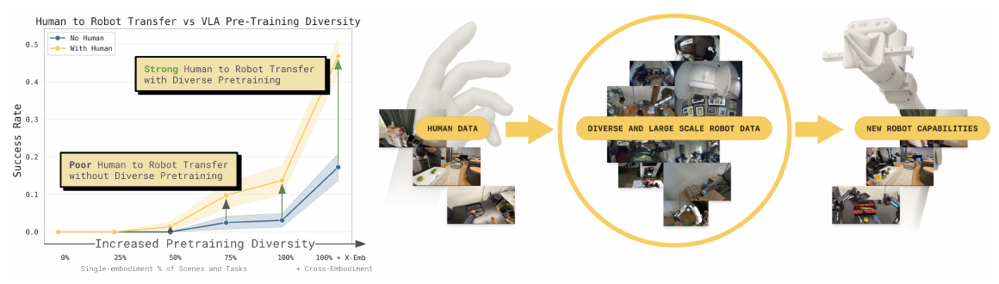
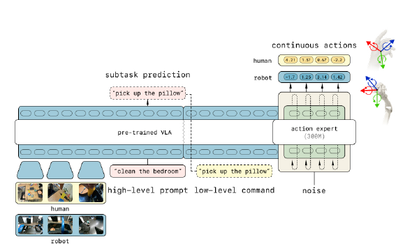
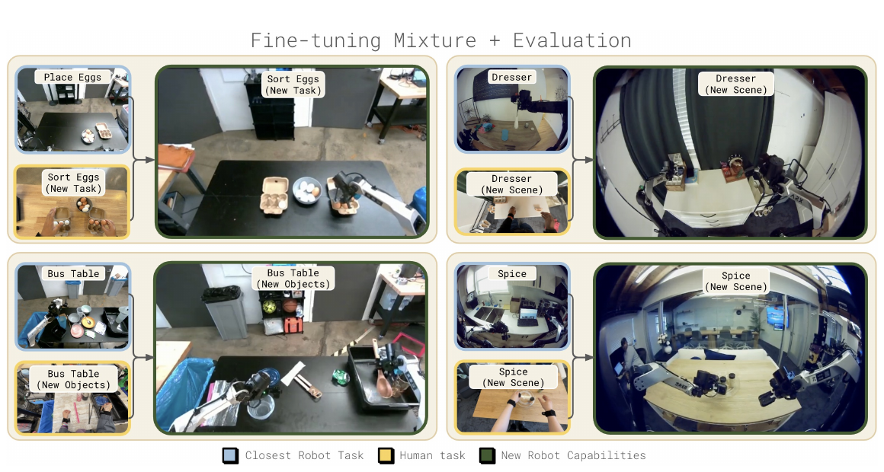
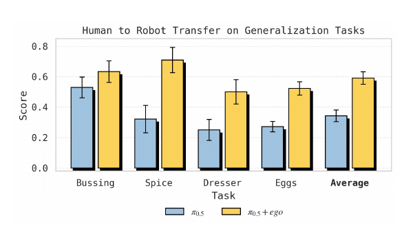
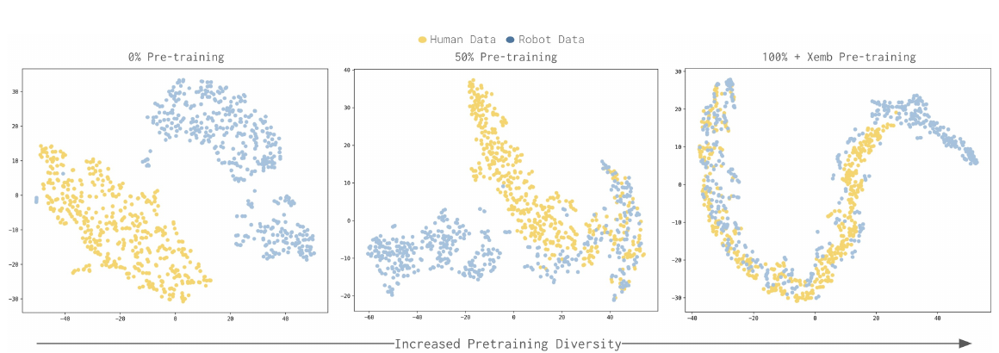

# Emergence of Human-to-Robot Transfer in Vision-Language-Action Models

> **Brief:** **Human-video co-training for VLA transfer:** convert egocentric human demonstrations into relative hand and head trajectories, train them with the same subtask, FAST-token, and flow-matching objectives used for robot data, and rely on diverse pi0.5 pretraining to enable cross-embodiment transfer without paired demonstrations or a domain-alignment loss.

**Reference:** Simar Kareer et al., *Emergence of Human to Robot Transfer in Vision-Language-Action Models*.

## Convenient Links

* [pi0.5 note](./Pi_0_5.md)
* [pi0.5-KI note](./Pi_0_5_KI.md)
* [FAST action-tokenization note](./Pi_0_FAST.md)
* [PaliGemma note](../../Vision_Language_Models/PaliGemma.md)

## 1. One-Sentence Summary

The paper shows that a diversely pretrained pi0.5 VLA can learn new robot scenes, objects, and task semantics from only `14 hours` of targeted egocentric human demonstrations, whereas the same co-training recipe provides little or negative transfer when VLA pretraining is insufficiently diverse.

## 2. Core Question

Human video is easier to collect and covers more environments and behaviors than robot teleoperation. The hard part is converting that experience into useful robot control despite large differences in appearance, sensing, morphology, and kinematics.

Earlier approaches commonly add an explicit bridge:

* learn affordances, keypoints, or latent actions instead of robot actions;
* pair human and robot demonstrations;
* render a robot into human video;
* add domain-adaptation or representation-alignment losses;
* use wearable hardware that imitates a robot end effector.

This paper asks:

> If a VLA is already pretrained across enough scenes, tasks, and robot embodiments, can it treat a human as one more embodiment and discover the useful correspondence during ordinary co-training?

Its answer is conditional:

| VLA initialization | Effect of adding human data |
|:--|:--|
| Base VLM or narrow robot pretraining | Little benefit and sometimes negative transfer |
| Diverse scene-task robot pretraining | Clear human-to-robot transfer |
| Diverse cross-embodiment pretraining | Strongest transfer |



*Paper Figure 1, cropped. Human data becomes increasingly useful as robot pretraining covers more scenes, tasks, and embodiments.*

## 3. What “Emergence” Means

Let $D_{\mathrm{pre}}$ be the robot pretraining mixture, and let $D_R$ and $D_H$ be downstream robot and human data. Define the transfer gain as

$$
\Delta_{\mathrm{H2R}}(D_{\mathrm{pre}})
=
J\!\left(\operatorname{FT}(\theta(D_{\mathrm{pre}}),D_R\cup D_H)\right)
-
J\!\left(\operatorname{FT}(\theta(D_{\mathrm{pre}}),D_R)\right),
$$

where $J$ is downstream robot performance.

The central observation is

$$
\Delta_{\mathrm{H2R}}(D_{\mathrm{pre}}^{\mathrm{diverse}})
\gg
\Delta_{\mathrm{H2R}}(D_{\mathrm{pre}}^{\mathrm{narrow}}).
$$

Two qualifications matter:

1. The controlled scaling variable is primarily **pretraining-data diversity**, not parameter count. All compared checkpoints use the pi0.5 architecture.
2. “Emergence” describes a strongly nonlinear empirical trend in these experiments, not a proven universal threshold for every VLA or task.

## 4. Base Policy: pi0.5

The method starts from the pretrained [pi0.5](./Pi_0_5.md) VLA. Its relevant outputs are:

| Output | Representation | Training objective |
|:--|:--|:--|
| High-level subtask | Language tokens | Next-token prediction |
| Low-level action | Discrete FAST tokens | Next-token prediction |
| Low-level action | Continuous action chunk | Flow matching in a `300M` action expert |

Given observation $o_t$, task instruction $l_t$, subtask $l_t^{\mathrm{sub}}$, and action chunk $A_t=a_{t:t+H}$, the hierarchy is

$$
p_\theta(l_t^{\mathrm{sub}}\mid o_t,l_t),
$$

followed by

$$
\pi_\theta(A_t\mid o_t,l_t^{\mathrm{sub}}).
$$

The human-data extension is called **pi0.5 + ego**:

```text
pretrained pi0.5
+ egocentric human observations
+ reconstructed relative hand/head actions
+ dense subtask labels
+ joint human and robot fine-tuning
= pi0.5 + ego
```

## 5. Architecture and Information Flow



*Paper Figure 4, cropped. Human and robot observations share the pretrained VLA; both supervise subtask and action prediction.*

The model does not add a human-specific policy head:

```text
human or robot camera streams
+ high-level instruction
-> shared pretrained VLA
-> predicted subtask text
-> FAST action tokens
+ continuous flow-matching action expert
-> embodiment-specific relative action trajectory
```

Broad pretraining is expected to provide reusable concepts such as object identity, task semantics, pick-and-place phases, and the relationship between end-effector motion and scene changes. Human fine-tuning can then supply a missing scene or semantic rule without reteaching basic robot manipulation.

## 6. Human Data Pipeline

### 6.1 Sensors and Collection

Each operator wears three synchronized cameras:

* one high-resolution head-mounted camera;
* one left-wrist camera;
* one right-wrist camera.

Operators collect repeated, episodic demonstrations while keeping their hands visible for tracking.

| Human task | Hours | Information missing from matching robot data |
|:--|--:|:--|
| Bussing | `3 h` | New kitchen tools and table objects |
| Spice | `3 h` | Target kitchen scene |
| Dresser | `3 h` | Target apartment and dresser scene |
| Sort Eggs | `5 h` | Sort white and brown eggs into different cartons |
| **Total** | **`14 h`** | Scene, object, and task concepts |

This is targeted data collected in a robot-demonstration style. The paper does not directly train from passive Internet video.

### 6.2 Processing and Annotation

The pipeline reconstructs:

* head-camera motion $e_t\in\mathbb R^6$ using visual SLAM;
* `17` three-dimensional hand keypoints in the head-camera frame;
* a six-degree-of-freedom pose for each hand;
* dense language descriptions of the atomic subtask performed by each arm.

The pose built from palm, middle-finger, and ring-finger keypoints acts as a human pseudo-end-effector.

```text
synchronized videos
-> head trajectory from visual SLAM
-> 3D hand-keypoint reconstruction
-> left/right 6-DoF pseudo-end-effector poses
-> relative action chunks
+ dense subtask annotation
-> VLA examples
```

## 7. Relative Action Representation

Absolute human-hand and robot-arm poses are not comparable. Both are represented as motion relative to the first pose of an action chunk.

For an end-effector pose $T_t\in SE(3)$,

$$
\Delta T_{t\rightarrow t+k}=T_t^{-1}T_{t+k},
$$

which can be represented by a six-dimensional translation-and-rotation coordinate

$$
a_{t+k}=\operatorname{Log}\!\left(T_t^{-1}T_{t+k}\right)\in\mathbb R^6.
$$

The full action chunk is

$$
A_t=[a_t,a_{t+1},\ldots,a_{t+H-1}].
$$

### Robot Targets

Each robot step contains

$$
\underbrace{6+1}_{\text{left arm + gripper}}
+
\underbrace{6+1}_{\text{right arm + gripper}}
+
\underbrace{2}_{\text{mobile base}}
=16,
$$

so

$$
A_t^R\in\mathbb R^{H\times16}.
$$

### Human Targets

Each human step contains

$$
\underbrace{6}_{\text{left hand}}
+
\underbrace{6}_{\text{right hand}}
+
\underbrace{6}_{\text{head/base motion}}
=18,
$$

so

$$
A_t^H\in\mathbb R^{H\times18}.
$$

No human gripper action is estimated because hand openness during contact is difficult to reconstruct reliably. Gripper behavior remains grounded in robot data.

### What “No Explicit Alignment” Means

The action vectors are **not identical**, and choosing relative Cartesian trajectories is a useful manual correspondence. The paper avoids a more specialized transfer mechanism:

* no paired human and robot trajectories;
* no learned retargeting model;
* no contrastive or adversarial embodiment-alignment loss;
* no robot rendering or image overlay.

The precise description is:

> Human and robot motion is roughly aligned through relative end-effector coordinates, while latent representation alignment is left to heterogeneous VLA co-training.

## 8. Training Objectives

Human and robot examples use the same three objective families.

### 8.1 High-Level Subtasks

$$
\mathcal L_{\mathrm{HL}}
=-
\sum_j
\log p_\theta
\left(l_{t,j}^{\mathrm{sub}}\mid o_t,l_t,l_{t,<j}^{\mathrm{sub}}\right).
$$

Example targets include `pick up the spice bottle` and `place the brown egg in the right carton`.

### 8.2 FAST Action Tokens

If FAST compresses an action chunk into tokens $z_{1:M}$,

$$
\mathcal L_{\mathrm{FAST}}
=-
\sum_{m=1}^{M}
\log p_\theta(z_m\mid o_t,l_t^{\mathrm{sub}},z_{<m}).
$$

### 8.3 Continuous Flow Matching

For clean action chunk $A$, noise $\epsilon$, and flow time $\tau\in[0,1]$,

$$
A^\tau=(1-\tau)\epsilon+\tau A,
\qquad
u=\epsilon-A.
$$

The action expert minimizes

$$
\mathcal L_{\mathrm{flow}}
=
\mathbb E_{A,\epsilon,\tau}
\left[
\left\|
v_\theta(A^\tau,o_t,l_t^{\mathrm{sub}},\tau)-u
\right\|_2^2
\right].
$$

The target sign follows pi0.5's reverse-time convention: sampling integrates the learned field from noise toward the clean action. Using the opposite sign together with the opposite integration direction describes the same geometric path, but mixing the conventions would be incorrect.

Schematically,

$$
\mathcal L
=
\lambda_{\mathrm{HL}}\mathcal L_{\mathrm{HL}}
+
\lambda_{\mathrm{FAST}}\mathcal L_{\mathrm{FAST}}
+
\lambda_{\mathrm{flow}}\mathcal L_{\mathrm{flow}}.
$$

There is no additional human-robot consistency loss. Transfer must arise through shared model parameters and shared task structure.

## 9. Fine-Tuning Mixture

For each benchmark, human data containing the missing concept is mixed evenly with robot data from the closest available task:

$$
p(D_{\mathrm{FT}})=0.5p(D_H)+0.5p(D_R^{\mathrm{nearest}}).
$$



*Paper Figure 3, cropped. Blue is the nearest robot task, yellow introduces a concept through human demonstrations, and green is the robot evaluation setting.*

Robot data remains essential because it preserves executable control, supplies gripper targets, and anchors the human concept to a nearby robot skill. Human data contributes the missing scene, object set, or semantic rule.

The recipe is therefore not “train a robot from human video alone.” It is **adapt a strong robot foundation model with complementary human and robot experience**.

## 10. Benchmark

Each task withholds one concept from robot fine-tuning data and provides it only in human data.

| Task | Axis | Robot data contains | Human data adds | Metric |
|:--|:--|:--|:--|:--|
| Spice | Scene | Put bottles on racks in known kitchens | Target unseen kitchen | Binary success |
| Dresser | Scene | Tidy dressers in other homes | Target unseen apartment | Binary success |
| Bussing | Object | Sort trash and dinnerware | New tools and kitchen objects | Fraction of 9 objects placed correctly |
| Sort Eggs | Task | Pick and place eggs into cartons | Sort by color and close cartons | Normalized egg/carton score |

Sort Eggs is especially diagnostic: the robot already knows how to manipulate eggs, but only human data specifies

```text
white eggs -> left carton
brown eggs -> right carton
```

Each experiment uses `20-40` physical evaluations. Error bars report one standard error.

## 11. Main Results



*Paper Figure 7, cropped. Targeted human data improves all four tasks and raises the average score from roughly `0.34` to `0.59`.*

| Task | Robot-only pi0.5 | pi0.5 + ego | Interpretation |
|:--|--:|--:|:--|
| Bussing | `53%` | `63%` | New objects transfer, but modestly |
| Spice | `32%` | `71%` | Strong scene transfer |
| Dresser | `25%` | `50%` | Scene success approximately doubles |
| Sort Eggs | about `0.27` | about `0.52` | New sorting semantics transfer |

For Sort Eggs, the paper additionally reports:

* color-sorting accuracy rises from `57%` to `78%`;
* pi0.5 + ego places about four more eggs correctly on average.

The “nearly double” description applies to the aggregate score and some tasks, not uniformly to every benchmark.

## 12. Scaling Pretraining Diversity

The authors construct increasingly broad initializations:

| Level | Pretraining coverage |
|:--|:--|
| `0%` | Base VLM initialization without robot VLA pretraining |
| `25-100%` | Increasing fractions of scene-task combinations for ARX and mobile ARX |
| `100% + X-emb` | Full pi0.5 mixture with many additional robot embodiments |

At each level they compare nearest-robot-task fine-tuning with and without human data.

Observed trend:

* `0%` and `25%`: almost no human-data benefit;
* `75%` and `100%`: clear gains;
* `100% + X-emb`: strongest transfer.

Sort Eggs cleanly separates zero-shot generalization from **transfer capacity**. Robot-only performance plateaus because sorting never appears in robot data, while human-plus-robot performance increases with pretraining diversity because the model becomes better able to absorb the missing rule.

Thus a checkpoint can show little zero-shot improvement yet become substantially better at learning from another embodiment.

## 13. Representation Evidence



*Paper Figure 5, cropped. A t-SNE projection shows separated human/robot embeddings without VLA pretraining and increasing overlap with broader pretraining.*

The analysis mean-pools the first `200` final-layer VLM embeddings and projects human and robot examples with t-SNE:

```text
0% pretraining       -> separated embodiment clusters
50% pretraining      -> partial overlap
100% + X-emb         -> strong human/robot interleaving
```

The authors interpret this as embodiment-agnostic representation learning. The evidence is suggestive, not conclusive: t-SNE distorts global geometry, all embeddings are measured after co-fine-tuning, and two-dimensional overlap does not establish a causal mechanism. The behavioral scaling result is stronger evidence.

## 14. Where Transfer Occurs

### Low-Level Transfer

Bussing and Sort Eggs are evaluated without a separate high-level policy. Their gains must pass through low-level action prediction, showing that human data provides more than language-level supervision.

### High-Level and Low-Level Transfer

Spice and Dresser use both levels. The paper ablates four combinations:

| High-level policy | Low-level policy | Result |
|:--|:--|:--|
| Robot-only | Robot-only | Baseline |
| Robot-only | Human co-trained | Low-level improves, but plans can remain wrong or stale |
| Human co-trained | Robot-only | Plans improve, but execution can misinterpret them |
| Human co-trained | Human co-trained | Best combined performance |

One-sided failure examples include repeatedly predicting `pick up spice bottle` after it is already held, or executing `put the necklace in the jewelry box` at the wrong dresser location. Long-horizon transfer is strongest when both semantic planning and motor prediction learn from human data.

## 15. Comparison with Robot Data

For Sort Eggs and Dresser, comparable human data is nearly as useful as demonstrations from the target robot. Bussing has a larger gap: the paper reports about `25%` with human transfer versus `65%` with target-robot data in that comparison.

For cross-robot comparison, the authors collect `400` Bussing demonstrations (`7.45 h`) on a UR5 and transfer to an ARX robot. Both human-to-ARX and UR5-to-ARX data improve over the baseline, but both remain below target-ARX demonstrations.

This supports the view that human data behaves like another cross-embodiment source rather than a completely separate learning problem.

## 16. Wrist-Camera Ablation

Human wrist cameras improve Bussing and Dresser but have little effect on Spice and Sort Eggs.

The likely distinction is observability:

* clutter and small accessories benefit from close hand-level views;
* global scene layout or egg color is already visible from the head camera.

Wrist cameras are not always required, but collecting them broadens the task range for which human data contains robot-relevant visual evidence.

## 17. What the Paper Shows

### Supported

1. A strong VLA can gain robot capabilities from targeted embodied human data.
2. Transfer gain grows with scene, task, and embodiment diversity in robot pretraining.
3. Transfer occurs through both language subtasks and low-level action objectives.
4. Relative end-effector coordinates can work without paired retargeting or a special alignment loss.
5. Human data can approach target-robot data on some tasks and resembles cross-robot transfer.

### Not Established

1. Training useful robot policies from arbitrary Internet human video alone.
2. A universal emergence threshold shared by all VLA architectures.
3. Parameter-count scaling independent of data diversity.
4. Exact embodiment invariance or identical human and robot action spaces.
5. Elimination of data engineering: SLAM, hand tracking, action construction, and language annotation remain necessary.

## 18. Limitations

* The benchmark contains only four targeted manipulation tasks.
* Human data totals `14 hours` and is episodic rather than passive in-the-wild video.
* Collection requires synchronized cameras, SLAM, 3D hand tracking, and dense annotation.
* Human actions omit gripper state.
* Larger morphology gaps may transfer differently.
* The full pretraining data and pi0.5 implementation are not reproducible from this paper alone.
* Physical experiments use only `20-40` evaluations per setting.
* The 50/50 fine-tuning mixture is fixed rather than extensively optimized.
* t-SNE provides qualitative rather than causal alignment evidence.

## 19. Practical Mental Model

```text
diverse multi-robot VLA pretraining
-> reusable scene, task, and motion abstractions

targeted human demonstrations
-> missing scene/object/task knowledge
+ relative hand/head trajectories
+ subtask language

nearest-neighbor robot demonstrations
-> executable robot control
+ gripper and embodiment grounding

50/50 co-fine-tuning with shared objectives
-> pi0.5 + ego
-> new robot capability
```

The shortest accurate takeaway is:

> Human video does not replace robot data in this recipe. Diverse robot pretraining creates the interface that lets a modest amount of structured human experience become useful robot supervision.

## 20. Key Takeaways

1. **Treat humans as another embodiment.** Reuse the VLA and objective families instead of building a separate human policy.
2. **Align motion coordinates, not full kinematics.** Relative hand and robot end-effector trajectories provide rough shared semantics.
3. **Keep robot data in the mixture.** It anchors executable control and gripper behavior.
4. **Transfer capacity scales with pretraining diversity.** Scene-task breadth and additional robot embodiments both matter.
5. **Human data can add concepts absent from robot demonstrations.** Sort Eggs isolates this semantic transfer clearly.
6. **Transfer is not only high-level.** Bussing and Eggs demonstrate direct low-level action transfer.
7. **The emergence claim is scoped.** It concerns data-diversity scaling in pi0.5, not a universal law or parameter-count threshold.
