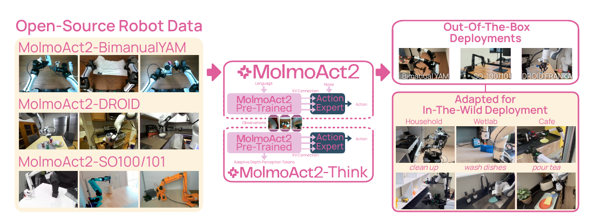
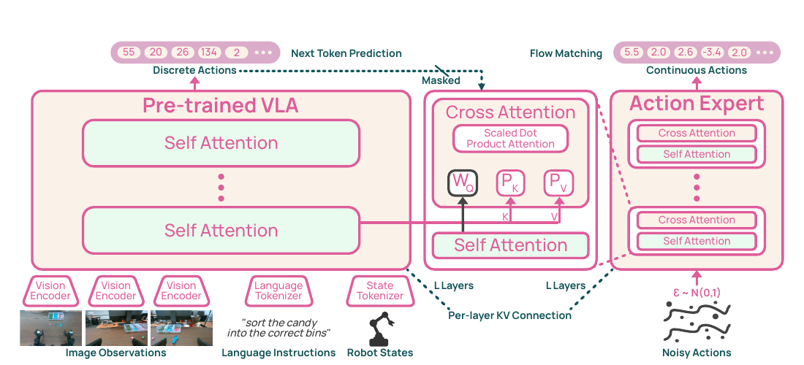
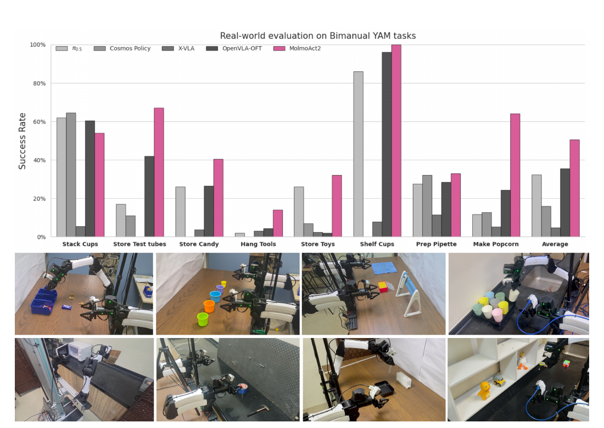

# MolmoAct2: Action Reasoning Models for Real-World Deployment

> **Brief:** **A fully open VLA designed around practical deployment.** MolmoAct2 specializes a 4B Molmo2 backbone for embodied reasoning, learns robot actions first as discrete FAST tokens, and then attaches a flow-matching action expert through per-layer key-value conditioning. Its `Think` variant predicts and reuses compact depth tokens for explicit spatial reasoning.

**Reference:** Haoquan Fang et al., *MolmoAct2: Action Reasoning Models for Real-World Deployment*.

## Convenient Links

* [pi0.5 note](./Pi_0_5.md)
* [pi0-FAST note](./Pi_0_FAST.md)
* [Real-Time Chunking note](../Inference/RTC.md)

## 1. One-Sentence Summary

MolmoAct2 separates **visual-language understanding** from **continuous control**: a robot-aware Molmo2-ER backbone supplies layer-wise attention context, while a smaller DiT expert converts Gaussian noise into a continuous one-second action chunk.

*Paper Figure 1, cropped. The released system combines open robot data, a discrete-action VLA, a continuous action expert, and an adaptive-depth variant.*

## 2. What Problem It Addresses

The paper identifies four obstacles to deploying generalist VLAs:

1. Strong frontier policies are often closed.
2. Open models may depend on expensive or narrowly supported robots.
3. Explicit spatial reasoning can require hundreds of autoregressive tokens before acting.
4. High benchmark success does not guarantee fast, stable real-world trajectories.

MolmoAct2 therefore develops the whole stack together: embodied-reasoning VLM, robot datasets, action tokenizer, continuous action head, and optimized inference.

## 3. System Overview

MolmoAct2 is trained in three stages:

~~~text
Molmo2
  -> embodied-reasoning specialization
Molmo2-ER
  -> discrete robot-action pre-training
MolmoAct2-Pretrain
  -> continuous-action post-training
MolmoAct2-Post
  -> embodiment/task fine-tuning
Deployment checkpoint
~~~

This staging solves different alignment problems in order:

| Stage | Main purpose | Robot output |
|:--|:--|:--|
| Molmo2-ER training | Add spatial and embodied reasoning to the VLM | None |
| VLA pre-training | Make the VLM understand robot state and action vocabulary | Discrete FAST tokens |
| Post-training | Connect VLM reasoning to smooth control | Discrete tokens + continuous actions |
| Fine-tuning | Adapt control to one embodiment or benchmark | Continuous action chunk by default |

The discrete and continuous action paths are not competing deployment policies. Discrete pre-training first makes the backbone action-aware; the continuous expert then uses that learned context to produce precise control efficiently.

## 4. Molmo2-ER Backbone

Molmo2-ER starts from the **Molmo2-4B** checkpoint and adds approximately **3.3M** embodied-reasoning examples. They cover image and video QA, pointing, detection, cross-view reasoning, ego-exo correspondence, and abstract spatial reasoning.

Training uses a **specialize-then-rehearse** recipe:

1. **Specialize:** 20K steps on embodied data plus 8% Tulu-3 text data.
2. **Rehearse:** 1.5K steps mixing embodied data and the original Molmo2 multimodal data equally within the non-text portion.

The second stage restores broad multimodal competence that could otherwise be forgotten during specialization.

The resulting backbone uses:

| Component | Setting |
|:--|:--|
| Vision encoder | SigLIP2 ViT, 380M parameters, 384 x 384 input |
| Vision-language connector | 57M parameters |
| Language model | Molmo2, 4.0B parameters, 36 layers |
| Embodied benchmark result | 63.8 average over 13 benchmarks |

Molmo2-ER improves the Molmo2 average from **46.8 to 63.8** and leads 9 of the 13 evaluated embodied-reasoning benchmarks. This matters downstream: with discrete action training alone, replacing Molmo2 with Molmo2-ER raises LIBERO-Long success from **77.6% to 83.6%**.

## 5. Action and State Representation

### 5.1 MolmoAct2-FAST Tokenizer

Robot embodiments have different dimensions, control frequencies, and coordinate conventions. MolmoAct2 standardizes each example as follows:

1. Take **one second** of future actions.
2. Normalize continuous dimensions with 1st-99th percentile statistics.
3. Handle binary or narrow-range gripper commands separately.
4. Pad every action vector to **32 dimensions**.
5. Transform the trajectory into frequency-domain coefficients, quantize them, and apply byte-pair encoding.

The resulting MolmoAct2-FAST tokenizer has a **2,048-token action vocabulary**. It is trained on **one million** sequences covering five embodiments and both absolute-joint and delta-end-effector control.

| Tokenizer data | Sampling weight | Control type |
|:--|--:|:--|
| Bimanual YAM | 30% | Absolute joint |
| SO-100/101 | 30% | Absolute joint |
| DROID Franka | 30% | Absolute joint |
| Fractal / RT-1 | 3.33% | Delta end-effector |
| BC-Z | 3.33% | Delta end-effector |
| Bridge | 3.33% | Delta end-effector |

### 5.2 State Tokens

Proprioceptive values are normalized and uniformly quantized into **256 state tokens**. Setup and control strings explicitly identify the robot and action convention, so one backbone can distinguish, for example, a bimanual joint controller from a Franka end-effector controller.

## 6. Policy Architecture

*Paper Figure 4, cropped. Each action-expert layer cross-attends to projected keys and values from the corresponding VLM layer.*

### 6.1 Division of Labor

| Module | Responsibility |
|:--|:--|
| Molmo2-ER VLA | Encode images, instruction, embodiment/control description, and robot state |
| Discrete output head | Predict FAST action tokens with next-token prediction |
| DiT action expert | Generate a continuous action chunk with flow matching |

The expert has **621M parameters**, hidden width **768**, and **36 layers**, matching the VLM's depth. Each block contains bidirectional action self-attention, cross-attention to VLM context, and an MLP.

### 6.2 Per-Layer KV Conditioning

For VLM layer $\ell$, let $(K_\ell^{\mathrm{vlm}},V_\ell^{\mathrm{vlm}})$ be its self-attention keys and values. Learned projections adapt them to the expert width:

$$
\widetilde K_\ell=P_KK_\ell^{\mathrm{vlm}},
\qquad
\widetilde V_\ell=P_VV_\ell^{\mathrm{vlm}}.
$$

The matching expert layer then computes

$$
\operatorname{CA}(Q_\ell,\widetilde K_\ell,\widetilde V_\ell)
=
\operatorname{softmax}\left(
\frac{Q_\ell\widetilde K_\ell^\top}{\sqrt{d_h}}
\right)\widetilde V_\ell.
$$

Thus the controller receives the VLM's attention state at **every depth**, rather than only its final hidden state. In the LIBERO ablation, per-layer KV conditioning averages **95.9%**, compared with **94.0%** for hidden-state conditioning.

### 6.3 Flow-Matching Objective

For clean normalized action chunk $a$, Gaussian noise $\epsilon$, and $t\sim U[0,1]$, training constructs

$$
x_t=(1-t)\epsilon+ta,
\qquad
u^*=a-\epsilon.
$$

The expert predicts this velocity field:

$$
\mathcal L_{\mathrm{flow}}
=
\mathbb E_{a,\epsilon,t}
\left[
\left\|m\odot\left(f_\theta(x_t,t,c)-u^*\right)\right\|_2^2
\right],
$$

where $c$ is VLM context and $m$ removes padded timesteps and dimensions. At inference, the released model starts from Gaussian noise and applies **10 Euler integration steps** to obtain the clean action chunk.

## 7. Robot Data

MolmoAct2 adds or curates three primary deployment datasets:

| Dataset | Scale | Main contribution |
|:--|:--|:--|
| MolmoAct2-BimanualYAM | 34.5K demonstrations, 720+ hours, 28+ tasks | Large, repeatable bimanual manipulation data |
| MolmoAct2-DROID | 74,604 successful episodes, 17.76M frames | DROID with idle segments and unsuccessful data removed |
| MolmoAct2-SO100/101 | 38,059 episodes, 19.8M frames, about 184 hours | Diverse low-cost community robot data |

The SO-100/101 subset is selected from 1,222 LeRobot datasets contributed by 377 users. Structural validation, license checks, evaluation-data removal, and a TOPReward quality gate remove unusable sources.

An open VLM re-annotates robot episodes from sampled frames plus the original instruction. Across the reported robot mixture, this increases unique labels from **71,121 (22%)** to **146,485 (46%)**.

Additional BC-Z, BridgeData V2, RT-1, and MolmoAct trajectories broaden embodiment and control coverage. Multimodal examples preserve general vision-language capability.

## 8. Training Recipe

### 8.1 Discrete VLA Pre-Training

Robot sequences contain images, instruction, setup/control markers, discrete state tokens, and FAST action tokens. A single autoregressive objective predicts the next text or action token.

| Setting | Value |
|:--|:--|
| Sampling mixture | 90% robot, 10% multimodal |
| Main robot weights | YAM 30%, SO-100/101 30%, DROID 30% of robot sampling |
| Remaining robot weight | 10% across BC-Z, Bridge, RT-1, and MolmoAct |
| Updates / sequence length | 200K / 4,200 tokens |
| Global batch / compute | 128 / 64 H100s, about 5,760 GPU hours |

This stage trains the full vision encoder, connector, LLM, and new token embeddings, but **does not yet train the continuous expert**.

### 8.2 Continuous Post-Training

Post-training attaches the action expert and minimizes

$$
\mathcal L_{\mathrm{post}}
=
\mathcal L_{\mathrm{LM}}+\mathcal L_{\mathrm{flow}}.
$$

For each action target it samples $K=4$ independent noise-time pairs, reusing the same VLM context. Robot chunks are padded to at most 30 timesteps and 32 action dimensions.

Two details prevent target leakage and destructive interference:

* The ground-truth discrete action-token span is masked from the expert's context.
* The VLM keys and values are detached for the flow loss. Therefore, continuous-action gradients update the expert and KV adapters, while the language-model loss updates the VLM.

Post-training runs for **100K updates** with global batch 128 on 64 H100s. Robot sequences use length 2,100; non-robot VLM sequences retain length 4,200.

### 8.3 Embodiment-Specific Fine-Tuning

Fine-tuning starts from `MolmoAct2-Post`, uses only robot data, and increases flow samples from $K=4$ to $K=8$. Unlike post-training, it allows flow-loss gradients into the VLM because knowledge insulation did not consistently improve this stage.

| Checkpoint | Action chunk | Updates |
|:--|:--|--:|
| Bimanual YAM | 30 steps at 30 Hz, absolute joints | 100K |
| DROID | 15 steps at 15 Hz, absolute joints | 100K |
| SO-100/101 | 30 steps at 30 Hz, absolute joints | 100K |
| LIBERO | 10 steps at 10 Hz, relative end effector | 50K; best checkpoint at 40K |

## 9. MolmoAct2-Think

MolmoAct2-Think makes spatial reasoning explicit with a compact depth prefix before action generation:

1. Depth Anything V2 estimates monocular depth.
2. A VQ-VAE converts a 320 x 320 depth map into a **10 x 10 grid**.
3. Each cell becomes one of **128 depth-code tokens**.
4. The action expert conditions on the resulting depth tokens through the same per-layer KV path.

At the first control step, all 100 depth tokens are generated. At later steps, corresponding RGB patches are compared with cosine similarity. A cell is regenerated only when

$$
\cos(x_{t,i},x_{t-1,i})<0.996;
$$

otherwise, its previous predicted depth token is reused. Reasoning cost therefore scales with the changed part of the scene rather than the complete grid.

During post-training, examples uniformly request action, depth, or depth-plus-action outputs. Fine-tuning mixes action and depth-plus-action examples, corrupts 10% of teacher-forced depth tokens, and learns a per-layer gate that controls how strongly the expert trusts predicted depth.

## 10. Evaluation Results

### 10.1 Out-of-the-Box on Trained Embodiments

These checkpoints receive no additional task-specific training for the reported target benchmark, but their robot embodiment was present in large-scale training.

| Evaluation | MolmoAct2 | Strong comparison | Difference |
|:--|--:|--:|--:|
| MolmoSpaces simulation | 37.7 | pi0.5-DROID: 34.5 | +3.2 |
| MolmoBot simulation | 20.6 | pi0.5-DROID: 10.0 | +10.6 |
| Real DROID setup | 87.1 | MolmoBot: 48.4 | +38.7 |
| Real SO-100 setup | 56.7 | pi0-SO100/101: 45.3 | +11.4 |

Here, **zero-shot means new tasks, objects, scenes, and camera poses on a trained embodiment**. It does not mean control of an arbitrary unseen robot.

### 10.2 Adaptation to New Tasks and Embodiments

*Paper Figure 7, cropped. Fine-tuned MolmoAct2 is evaluated over eight real-world bimanual tasks.*

| Evaluation | MolmoAct2 | Comparison |
|:--|--:|:--|
| LIBERO average | 97.2% | pi0.5: 96.9%; MolmoAct2-Think: **98.1%** |
| RoboEval | 44.3% | 3.8 points above pi0.5 |
| Eight real-world YAM tasks | 50.1% | 15 points above OpenVLA-OFT |
| YAM under OOD shifts | 50.69% | OpenVLA-OFT: 39.89% |

The OOD evaluation varies object position, lighting, language, and distractors. MolmoAct2-Think leads every category, but spatial variation remains hardest at **26.25%**, so fine-grained spatial transfer is still limited.

### 10.3 What the Ablations Show

| Change | Result |
|:--|:--|
| Molmo2 -> Molmo2-ER backbone | LIBERO-Long discrete policy: 77.6% -> 83.6% |
| Hidden-state -> per-layer KV conditioning | LIBERO average: 94.0% -> 95.9% |
| One -> eight flow samples | LIBERO average: 94.15% -> 95.90% |
| Expert-only -> full fine-tuning | LIBERO average: 93.05% -> 97.20% |
| Standard -> adaptive-depth model | LIBERO average: 97.2% -> 98.1% |

The gains are distributed across the backbone, conditioning interface, flow supervision, and adaptation recipe. The action expert alone is not sufficient; the VLM must also adapt during downstream fine-tuning.

## 11. Inference Speed

On LIBERO with horizon 10 and one H100:

| Continuous inference path | Original | Cache | Cache + CUDA Graphs |
|:--|--:|--:|--:|
| MolmoAct2 | 23.02 Hz | 27.39 Hz | **55.79 Hz** |
| MolmoAct2-Think | 8.04 Hz | 9.72 Hz | **12.71 Hz** |

The VLM context is constant across the ten flow steps, so cross-attention intermediates can be cached. The fixed-shape flow loop also benefits strongly from CUDA Graph replay. Adaptive autoregressive depth decoding is variable-length and therefore gains less.

The autoregressive discrete-action path reaches only **14.17 Hz** for MolmoAct2 and **6.82 Hz** for MolmoAct2-Think. Continuous flow output is consequently the default deployment path.

## 12. Limitations and Practical Takeaways

* **Open-loop chunks:** each one-second chunk is executed before the next observation. There is no real-time re-chunking or explicit continuity loss across chunk boundaries.
* **Amortized rate:** 55.79 Hz means horizon divided by chunk-generation latency, not a 55.79 Hz closed-loop observation-policy cycle.
* **Embodiment-bound zero-shot control:** out-of-the-box deployment is demonstrated only for YAM, DROID Franka, and SO-100/101; new kinematics require fine-tuning.
* **Reasoning has a cost:** MolmoAct2-Think improves difficult tasks and interpretability, but remains substantially slower than standard MolmoAct2.

The central design lesson is that a deployable VLA benefits from **progressive alignment**: first teach the VLM a robot-action language, then attach continuous control, and finally adapt the complete system to the target embodiment. Per-layer KV conditioning provides the bridge between reasoning and control, while adaptive depth tokens make explicit reasoning selective instead of paying its full autoregressive cost at every step.
