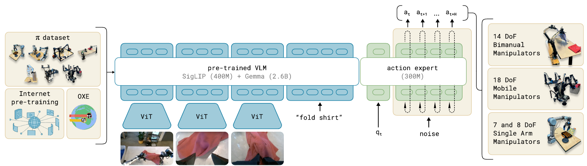

# [pi0: A Vision-Language-Action Flow Model for General Robot Control](https://arxiv.org/abs/2410.24164)

pi0 combines a **pretrained PaliGemma VLM** with a **continuous-action expert**: images and language provide context, while the expert transforms noise into a 50-step robot action chunk through conditional flow matching. Broad robot pre-training supplies diverse physical experience; task-specific post-training improves execution quality.

**Source:** the supplied Black et al. paper, especially Sections IV-V and Appendices B-D. This note describes the original paper's model, not later OpenPI configurations or pi0.5.

## Convenient Links

* [Paper](https://arxiv.org/abs/2410.24164) / [Project](https://physicalintelligence.company/blog/pi0)
* [PaliGemma](../../Vision_Language_Models/PaliGemma.md) / [Diffusion Policy](./Diffusion_Policy.md) / [pi0-FAST](./Pi_0_FAST.md) / [pi0.5](./Pi_0_5.md)

## 1. What Enters and Leaves the Policy?

At robot timestep $t$, a training example pairs the **current observation** with a **future demonstrated action chunk**:

$$
o_t=(I_t^1,\ldots,I_t^n,\ell_t,q_t),\qquad
A_t=[a_t,\ldots,a_{t+H-1}],\quad H=50.
$$

| Variable | Content | Role |
|:--|:--|:--|
| $I_t^i$ | Current RGB image from camera $i$; PI robots use 2 or 3 views | Locate objects and understand the scene |
| $\ell_t$ | Task instruction or annotated subtask | Specify the desired behavior |
| $q_t$ | Current proprioceptive configuration | Specify the robot's physical state |
| $A_t$ | Sequence of continuous, embodiment-specific control vectors | Supervise the next action chunk, not future images |

The policy learns $p(A_t\mid o_t)$. Actions are **not discretized into language-vocabulary tokens**: one action token represents the whole control vector for one future robot step. Thus a 50-step chunk uses 50 action tokens, not 50 times the number of action dimensions.

For cross-embodiment batching, the paper zero-pads state/action vectors to **18 dimensions** and masks missing camera slots. A bimanual 14-dimensional example therefore becomes $q_t\in\mathbb R^{18}$ and $A_t\in\mathbb R^{50\times18}$. Padding makes tensor shapes compatible; it does not make different robots' controls physically identical.

This interface motivates the architecture: image/language inputs fit a pretrained VLM, but robot state and continuous noisy actions need their own processing path.

## 2. Model Structure: Two Experts, Connected at Every Layer



*Paper Figure 3: the pretrained image/language path and the smaller action expert form one policy shared across robot embodiments. The figure summarizes the system; the token routing and attention below specify its computation.*

### 2.1 Encode the Inputs

| Input | Encoding path | Transformer expert |
|:--|:--|:--|
| Images | PaliGemma's SigLIP image encoder, then projection to visual tokens | VLM weights |
| Instruction | Text tokenizer and embedding lookup | VLM weights |
| State $q_t$ | Linear projection to one state token | Action-expert weights |
| Noisy actions $A_t^\tau$ | Per-action projection combined with flow-time encoding | Action-expert weights |

The backbone is approximately **3B parameters** (SigLIP about 400M plus Gemma about 2.6B); the randomly initialized action expert adds **300M**, for about **3.3B total**. Robot training adapts the pretrained VLM together with the new action components; this is not merely a frozen VLM feature extractor.

The experts have separate transformer parameters but communicate through **self-attention at corresponding layers**. Routing is fixed by token type, not a learned top-$k$ MoE router. The VLM hidden width is 2048; the action expert uses width 1024 and MLP width 4096. Their residual-stream widths need not match because interaction occurs through compatible attention projections, not by directly concatenating their raw hidden vectors.

In particular, an action token's query reads image/language and state keys/values as well as other action tokens. The VLM does **not** first generate a textual plan or a single final embedding that is passed to an otherwise independent decoder.

### 2.2 How Flow Time Enters the Action Expert

Let $\tau\in[0,1]$ denote **flow time**, distinct from robot timestep $t$. pi0 uses

$$
A_t^\tau=(1-\tau)\epsilon+\tau A_t,
$$

so **$\tau=0$ is pure noise and $\tau=1$ is the clean demonstrated action chunk**. This is the reverse of a convention that increases time while adding noise.

**Why provide time if it already influenced the noisy actions?** The mixture does not uniquely identify its ingredients: different noise samples and times can produce the same value. For a scalar clean action $a=1$, both cases below give $a^\tau=0.5$, but require different target velocities:

| Flow time $\tau$ | Noise $\epsilon$ | Mixed action $(1-\tau)\epsilon+\tau a$ | Target $a-\epsilon$ |
|:--:|:--:|:--:|:--:|
| $1/4$ | $1/3$ | $1/2$ | $2/3$ |
| $3/4$ | $-1$ | $1/2$ | $2$ |

The noisy chunk can contain statistical clues about its noise level, but it does not generally determine $\tau$. Explicit time conditioning removes that ambiguity instead of requiring the network to infer it.

**What changes with time?** For a fixed pair $(A_t,\epsilon)$, the straight-path target $A_t-\epsilon$ is constant. However, the model sees only the mixed chunk, observation, and time, not that pair. Under the squared-error objective, its ideal prediction is the conditional mean

$$
v^*(x,o_t,\tau)=\mathbb E[A_t-\epsilon\mid A_t^\tau=x,\ o_t,\ \tau].
$$

Different times change which clean/noise pairs are plausible at the same $x$, so this field generally depends on $\tau$. Omitting time would instead average over those possible times as well, potentially mixing incompatible velocities. This is the conditional-mean interpretation of the [flow-matching objective](https://arxiv.org/html/2210.02747v2#S3). It does **not** imply a universal rule that velocity magnitude or variance must decrease near clean data; pi0 also uses a fixed Euler step size, not a time-dependent "large step versus fine adjustment" rule.

**How does pi0 supply this condition?** For each noisy action vector $a_{t+j}^{\tau}$, Appendix B gives the input embedding

$$
e_j=W_3\,\operatorname{swish}\!\left(
W_2\,[W_1a_{t+j}^{\tau};\phi(\tau)]\right),
$$

where $\phi(\tau)$ is a sinusoidal encoding and $[\,;\,]$ denotes concatenation. With action dimension $d=18$ and expert width $w=1024$, $W_1$ maps $d\rightarrow w$, $W_2$ maps $2w\rightarrow w$, and $W_3$ maps $w\rightarrow w$.

The sinusoidal features expose time at multiple frequencies, and the MLP fuses them with the current action values. [Fourier-feature research](https://arxiv.org/abs/2006.10739) motivates this richer representation, but **sinusoidal encoding is not mathematically required**: a scalar or learned time embedding can also condition a network. The pi0 paper specifies this design without establishing that scalar time input would fail. In short, $A_t^\tau$ tells the expert **what its current action estimate is**, $\tau$ tells it **where it is along the noise-to-action path**, and $o_t$ supplies the task and scene context through attention.

All 50 actions share the sampled $\tau$ but have different action vectors. A final linear projection of their 50 output hidden states predicts a **$50\times18$ flow-velocity field**, not the finished action chunk in one pass. The main pi0 expert is Gemma-style; the DiT/AdaLN-Zero design described in Appendix C belongs to the **pi0-small baseline**, not this model.

### 2.3 Attention Determines the Conditioning and the Cache

**Layer coupling, not a final-feature handoff.** At transformer layer $l$, keep separate hidden streams: $h_v^{(l)}$ for image/language tokens and $h_e^{(l)}$ for state/action tokens. Their widths may differ, but their attention projections have compatible head dimensions. Each layer performs:

1. **Project separately:** each branch uses its own normalization and $Q/K/V$ projection weights.
2. **Attend jointly:** concatenate the projected queries, keys, and values along the **token axis**, apply positional encoding to queries/keys, and compute masked attention. Raw hidden states of widths 2048 and 1024 are not concatenated into one shared-width stream.
3. **Split and update separately:** split attention outputs by token range; each branch applies its own output projection, residual connections, normalization, and MLP. The resulting pair of hidden streams enters layer $l+1$.

Schematically, for one attention head, omitting layer indices:

$$
Q=[Q_v;Q_e],\quad K=[K_v;K_e],\quad V=[V_v;V_e],
\qquad
[Z_v;Z_e]=\operatorname{softmax}\!\left(\frac{QK^T}{\sqrt{d_h}}+B\right)V.
$$

Here $[\,;\,]$ concatenates tokens, $d_h$ is the head dimension, and $B$ is an additive mask: zero for allowed attention and $-\infty$ for blocked entries. Multi-query attention shares key/value heads across query heads. The official [`gemma_pytorch.py`](https://github.com/Physical-Intelligence/openpi/blob/215abfb217dbac7d5f1273282331b9b1866c0479/src/openpi/models_pytorch/gemma_pytorch.py) implements this in `compute_layer_complete`: branch-specific projections, `torch.cat`, joint attention, then branch-specific updates inside a layer loop.

**Joint computation does not mean unrestricted two-way information flow.** The paper's sequence has three attention blocks, despite using only two parameter sets. Rows below are queries; columns are the keys/values they may read:

| Query block | Images + language | State | Noisy actions |
|:--|:--:|:--:|:--:|
| Images + language | Yes | No | No |
| State | Yes | Yes | No |
| Noisy actions | Yes | Yes | Yes |

Thus action queries read image/language features from the **corresponding VLM layer**, plus state and action features. VLM queries cannot read state/actions, and state queries cannot read actions. Attention is bidirectional **inside** each block, including across the action chunk; it is not left-to-right autoregressive action generation. The coupling supplies VLM information to the expert at every layer without feeding noisy actions back into the VLM stream.

**Why this permits caching.** Image/language and state representations never depend on noisy actions or flow time. For the paper's inference scheme:

* Compute observation keys/values **at every layer** once for the current observation.
* At each flow step, recompute action queries/keys/values. Action layer $l$ reads cached observation keys/values from layer $l$ together with the current action keys/values.
* Refresh the cache when replanning from a new observation or instruction.

The VLM can therefore finish its entire observation pass before iterative sampling starts, but it supplies a **stack of per-layer caches**, not just its final hidden features. Layerwise conditioning does not require rerunning both branches together at every flow step. The state token uses action-expert weights yet belongs to the paper's cacheable observation prefix: parameter routing and cache boundaries are different concepts.

**Paper versus implementation:** in the linked [`pi0_pytorch.py`](https://github.com/Physical-Intelligence/openpi/blob/215abfb217dbac7d5f1273282331b9b1866c0479/src/openpi/models_pytorch/pi0_pytorch.py), `sample_actions` caches only image/language tokens; for pi0, `denoise_step` recomputes state together with noisy actions through `embed_suffix`. Its mask still prevents state from reading actions, so state caching is possible but not implemented in that path. This is a caching-policy difference, not a different layer-coupling principle. The inference explanation below follows the paper.

The entire process can be illustrated as...
```
VLM
[B,Tv,2048]
     ↓ own QKV projection
Q: [B,Tv,8,256]
K,V: [B,Tv,1,256]
          \
           \
            → concat along TOKEN dimension
           /
          /
Expert
[B,Ta,1024]
     ↓ own QKV projection
Q: [B,Ta,8,256]
K,V: [B,Ta,1,256]

                ↓

joint attention

Q:   [B,Tv+Ta,8,256]
K/V: [B,Tv+Ta,1,256]

                ↓

attention output
[B,Tv+Ta,8,256]

                ↓ flatten heads

[B,Tv+Ta,2048]

        ↙                    ↘

VLM tokens                 Expert tokens
[B,Tv,2048]               [B,Ta,2048]

↓ VLM o_proj               ↓ Expert o_proj

[B,Tv,2048]               [B,Ta,1024]
```

## 3. Training Pipeline: From a Demonstration to One Loss

The architecture tells us where inputs go; flow matching specifies what the action outputs must learn. For one sampled pair $(o_t,A_t)$:

1. **Prepare the example.** Select current images, state, and a task/subtask label; collect the next 50 demonstrated actions. Apply the robot's padding and missing-camera mask.
2. **Construct a noisy chunk.** Sample Gaussian noise $\epsilon$ with the same shape as $A_t$, and sample flow time $\tau$ independently of robot timestep $t$.
3. **Run the conditioned forward pass.** Encode the observation and feed $A_t^\tau$ with $\tau$ through the two-expert transformer using the mask above.
4. **Regress the flow velocity.** Compare the predicted field with the known direction from sampled noise to demonstrated actions and backpropagate the loss.

The interpolation and target are

$$
A_t^\tau=(1-\tau)\epsilon+\tau A_t,\qquad
\epsilon\sim\mathcal N(0,I),\qquad
\frac{d A_t^\tau}{d\tau}=A_t-\epsilon.
$$

Thus the conditional flow-matching objective is

$$
\mathcal L(\theta)=
\mathbb E_{(o_t,A_t),\epsilon,\tau}
\left[\left\|v_\theta(A_t^\tau,o_t,\tau)-(A_t-\epsilon)\right\|_F^2\right].
$$

The norm sums squared errors over chunk steps and action coordinates. "Flow velocity" means change in action space per unit $\tau$, not physical joint velocity. Here $\tau$ is written explicitly; the paper abbreviates the predictor as $v_\theta(A_t^\tau,o_t)$ even though its action embeddings include time.

```text
images + instruction + state -> observation tokens
A_t + epsilon + tau -> noisy chunk -> time-conditioned action tokens
observation tokens + action tokens -> transformer -> predicted velocity
predicted velocity vs. (A_t - epsilon) -> squared-error loss
```

The clean chunk supplies the noisy input and target; it is **not an additional clean-action prefix visible to the model**. Training samples a time and learns the local vector field rather than running the complete 10-step sampling loop for every loss. Appendix B favors noisier inputs: an equivalent sampling form is $z\sim\operatorname{Beta}(1.5,1)$, $\tau=0.999(1-z)$.

For example, a bimanual shirt-folding sample pairs three current images, `fold shirt`, and padded joint state with a $50\times18$ demonstrated chunk. One forward pass predicts a $50\times18$ velocity field conditioned on that observation. It does not predict images, an intermediate textual plan, or just the next single action.

## 4. Inference Pipeline: From Noise to Executed Actions

At deployment there is no demonstrated $A_t$. The observation path and conditioning stay the same; the learned field now constructs a chunk from noise:

1. **Observe once per replan:** obtain current images, instruction, and state; encode them and cache the observation keys/values, including the state token.
2. **Initialize:** sample $A_t^0\sim\mathcal N(0,I)$.
3. **Integrate:** run 10 action-suffix forward passes, reusing that cache and updating both the noisy chunk and flow time.
4. **Execute and refresh:** select the robot's valid action dimensions, execute the chosen leading portion, then collect a new observation and rebuild the cache for the next chunk.

For $k=0,\ldots,9$, with $\tau_k=k/10$ and $\delta=0.1$,

$$
A_t^{\tau_{k+1}}=A_t^{\tau_k}
+\delta\,v_\theta(A_t^{\tau_k},o_t,\tau_k).
$$

The result $A_t^1$ is a continuous action chunk. **The 10 flow steps refine the entire chunk; they are not 10 robot actions.** All flow steps for this chunk condition on the same $o_t$; observation feedback enters at the next replan.

| Robot setup | Controller rate | Actions executed before replanning | Replan interval |
|:--|:--:|:--:|:--:|
| UR5e / Franka | 20 Hz | 16 of the predicted 50 | 0.8 s |
| Other evaluated robots | 50 Hz | 25 of the predicted 50 | 0.5 s |

The executed portion is open-loop at the policy level; replanning closes the observation-action loop. The paper does not aggregate overlapping chunks: temporal ensembling hurt performance in its trials.

With three cameras on an RTX 4090, Appendix D reports **14 ms** for image encoding, **32 ms** for the observation pass, and **27 ms total** for all ten action passes: **73 ms onboard**, or **86 ms** including offboard network latency. Therefore "50 Hz control" means playing action commands at that rate, not running the entire VLM every 20 ms.

## 5. Where the Training Examples Come From

The same input/output interface supports two robot-training stages; the difference is the data distribution, not a switch from action regression to reinforcement learning.

| Stage | Data and initialization | Purpose |
|:--|:--|:--|
| VLM initialization | Start from pretrained PaliGemma; initialize the action expert and new projections from scratch | Import visual-language representations before robot training |
| Robot pre-training | PI data plus open robot datasets, using the flow-matching objective | Learn broad cross-robot behavior, including varied situations and recoveries |
| Task post-training | Fine-tune the robot-pretrained model on curated target-task demonstrations | Favor consistent, fluent execution; reported data needs range from roughly 5 to 100+ hours per task |

Important details of the pre-training mixture:

* **PI data:** about 10,000 hours, **903M timesteps**, **7 robot configurations**, and **68 broadly defined tasks**. The timestep count splits into 106M single-arm and 797M dual-arm samples; it is not a count of independent episodes.
* **Open data:** OXE-based data, Bridge v2, and DROID supply **9.1% of the sampling mixture**, not 9.1% of elapsed demonstration hours. Figure 4 specifies an OXE "Magic Soup" subset, despite the overview's broader wording about the entire OXE dataset.
* **Balancing:** sample task-robot groups with weights proportional to $n^{0.43}$, where $n$ is their sample count, reducing domination by the largest groups compared with sampling proportional to $n$.
* **Language:** use both task names and fine-grained annotations of roughly two-second trajectory segments. This teaches the same policy to respond to whole-task prompts or intermediate subtask commands.

The original paper's common interface is 18-dimensional padding plus camera masking. It does not fully specify every dataset's action normalization or conversion rules; these should not be guessed from later implementations.

For long tasks, an **external** high-level VLM or human can supply intermediate commands, such as `pick up the napkin` and `put it in the trash`. These replace the language input to pi0's action pipeline; the original pi0 does not internally generate subtasks as pi0.5 does.

## 6. What the Experiments Establish

| Evaluation | Main result | How to interpret it |
|:--|:--|:--|
| Direct prompting after robot pre-training | Strongest results on the five evaluated tasks versus OpenVLA/Octo; the 160k-update pi0 comparison also outperforms those baselines | No task post-training, but these task families occur in pre-training; not evidence that every task is unseen |
| Language guidance | Full pi0 benefits more from intermediate instructions than pi0-small without VLM initialization | Supports the usefulness of VLM priors; pi0-small also differs architecturally, so this is not a perfectly isolated initialization ablation |
| New-task fine-tuning | Broad robot pre-training often improves adaptation, particularly with limited data or related skills | Distinguish robot-pretrained pi0 from task-only training with VLM initialization |
| Complex multi-stage tasks | Pre-training plus post-training generally beats either alone; all reported task scores exceed half the maximum | Scores measure task progress over 10 trials, not necessarily full-task success rates |

The main model uses **700k robot pre-training updates**; the paper separately reports a **160k-update comparison** with the baselines. Its results support the combined architecture and data recipe, not a clean claim that flow matching alone explains all gains.

Remaining limitations include imperfect reliability, uncertain data requirements for new tasks, and the need for task-specific post-training or external planning on difficult tasks. VLM priors and continuous generation do not by themselves guarantee correct language following, safe actions, or successful long-horizon execution.

## 7. Compact Mental Model

**Demonstration window -> observation prefix + noisy action tokens -> two-expert attention -> flow-velocity loss. At inference: cache the observation -> refine noise into 50 actions -> execute a prefix -> observe again.**

The crucial distinction is that the action expert learns and samples **with observation conditioning throughout**; it is neither an unconditional denoiser nor an autoregressive text-action decoder.
