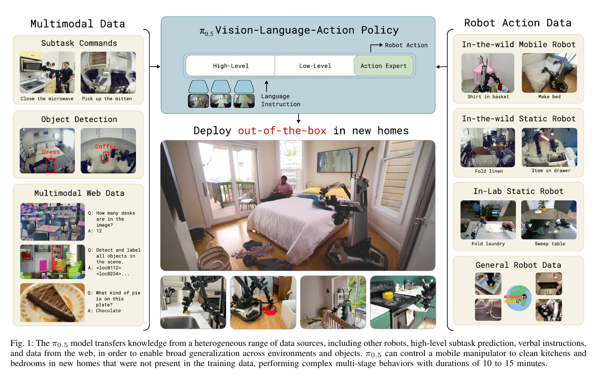
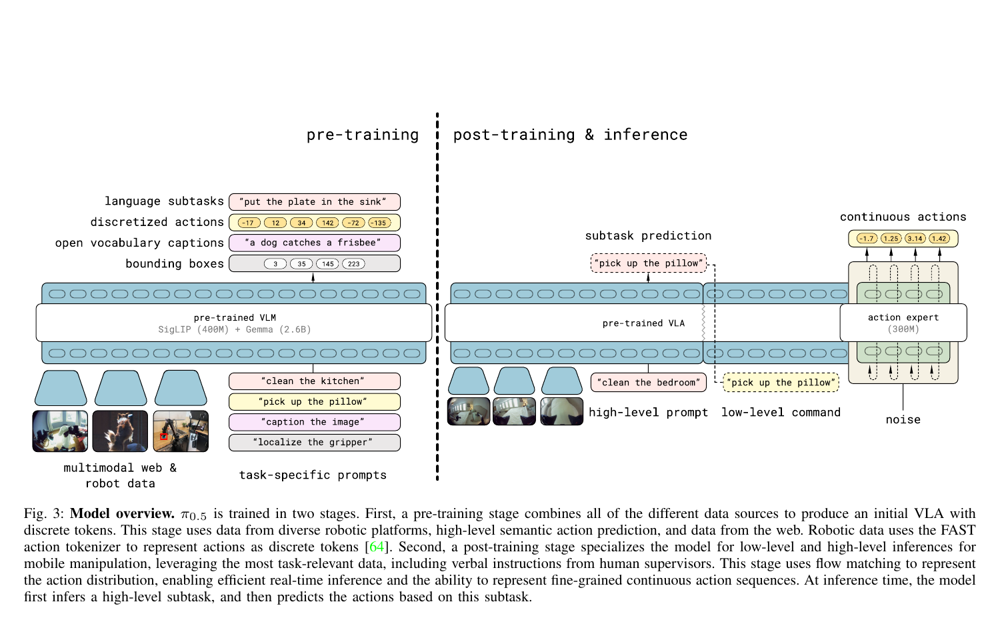
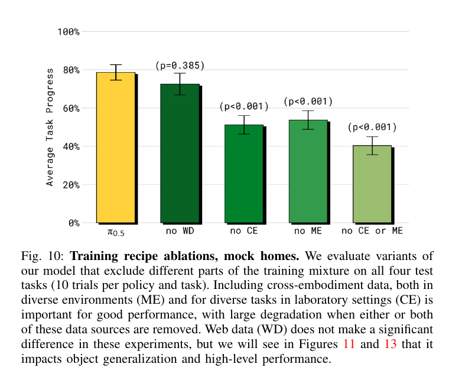
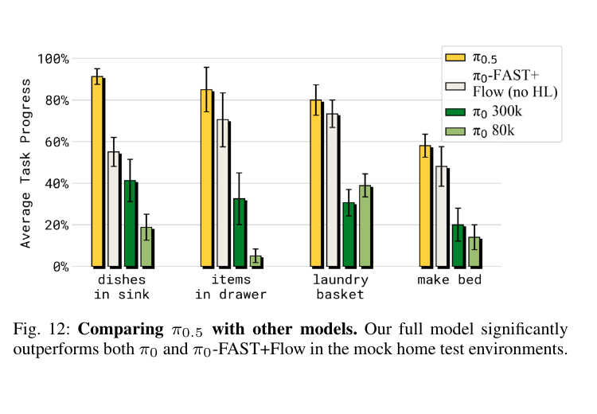

# [pi0.5: A Vision-Language-Action Model with Open-World Generalization](https://arxiv.org/abs/2504.16054)

## Convenient Links

* [Paper (arXiv)](https://arxiv.org/abs/2504.16054)
* [Project Page / Blog](https://pi.website/blog/pi05)
* [pi0 note in this repo](./Pi_0.md)
* [pi0-FAST note in this repo](./Pi_0_FAST.md)
* [Open X-Embodiment note in this repo](../Datasets/Open_X_Embodiment.md)
* [Real-Time Chunking note in this repo](../Inference/RTC.md)

## 1. One-Sentence Summary

pi0.5 is a **hierarchical VLA for open-world mobile manipulation** that extends pi0 with heterogeneous co-training, FAST action-token pretraining, a flow-matching action expert, and explicit semantic subtask prediction; using about **400 hours of target mobile-manipulator data** together with much broader robot and web data, it performs multi-stage kitchen and bedroom tasks in homes not seen during training.

## 2. Why pi0.5 Matters

Most VLA evaluations change an object, instruction, or background while keeping the robot close to its training distribution. pi0.5 targets a harder setting:

```text
new home
+ new layout
+ new object instances and categories
+ long, multi-stage task
+ navigation and manipulation
```

Collecting every possible kitchen or bedroom configuration is infeasible. The paper instead asks whether a policy can transfer knowledge from heterogeneous sources:

* mobile manipulators in many homes
* fixed manipulators in an even wider range of homes
* many robot embodiments and laboratory tasks
* semantic subtask annotations
* human verbal guidance
* image captioning, visual question answering, and object localization data

The central claim is:

> Open-world robot generalization depends not only on more target-robot data, but also on transferring the right knowledge from other embodiments, semantic supervision, and web data.



## 3. What "Open-World Generalization" Means Here

The paper evaluates three kinds of novelty at the same time:

| Generalization axis | Example |
| :------------------ | :------ |
| Environment | an entirely unseen kitchen or bedroom |
| Object | a new plate instance or an unseen object category |
| Task composition | combining known manipulation skills into a new multi-stage sequence |

This is harder than solving one unseen pick-and-place task. A command such as:

```text
clean the bedroom
```

requires the robot to decide what to do next, navigate, manipulate deformable and rigid objects, and continue for several minutes.

## 4. High-Level Pipeline

pi0.5 uses two training stages and two inference levels:

```text
PaliGemma initialization
-> pre-train with FAST-token actions and heterogeneous tasks
-> add a flow-matching action expert during post-training
-> specialize on successful mobile-manipulation data
-> predict the next semantic subtask at runtime
-> condition on that subtask and generate a continuous action chunk
```



The same transformer represents both the high-level and low-level policies. It is not a planner connected to a separately trained controller.

## 5. Hierarchical Policy Factorization

Let:

* $o_t = [I_t^1, \ldots, I_t^n, q_t]$ be camera images and robot state
* $\ell$ be the overall task, such as `put away the dishes`
* $\hat{\ell}$ be the predicted subtask, such as `pick up the plate`
* $a_{t:t+H}$ be a continuous action chunk

The joint policy is factorized as:

$$
\pi_\theta(a_{t:t+H}, \hat{\ell} \mid o_t, \ell)
=
\pi_\theta(a_{t:t+H} \mid o_t, \hat{\ell})
\pi_\theta(\hat{\ell} \mid o_t, \ell)
$$

This yields two inference calls:

### 5.1 High-Level Inference

$$
\hat{\ell}
\sim
\pi_\theta(\hat{\ell} \mid o_t, \ell)
$$

The model reads the overall task and current scene, then autoregressively generates the next semantic subtask as text.

### 5.2 Low-Level Inference

$$
a_{t:t+H}
\sim
\pi_\theta(a_{t:t+H} \mid o_t, \hat{\ell})
$$

The flow-matching action expert generates continuous robot commands conditioned on that subtask.

The explicit factorization makes the intended information flow clear:

```text
overall task -> semantic subtask -> continuous actions
```

## 6. Architecture

pi0.5 retains the two-expert structure of pi0:

| Component | Role | Approximate size |
| :-------- | :--- | ----------------: |
| SigLIP encoder | image features | `400M` |
| Gemma language model | text, state, FAST tokens, semantic prediction | `2.6B` |
| Action expert | continuous flow-matching action chunks | `300M` |
| Total | unified VLA | `3.3B` |

The model supports several token types in one transformer:

* image patches
* language prompt tokens
* tokenized proprioceptive state
* bounding-box coordinates
* FAST action tokens
* continuous noisy action tokens

The main VLM and action expert exchange information through self-attention. FAST action tokens attend to the observation prefix and earlier FAST tokens. Continuous action tokens attend to the prefix and one another, but not to FAST action tokens, preventing one action representation from leaking the target to the other.

## 7. Why Use Both FAST and Flow Matching?

The two representations solve different bottlenecks:

| Representation | Advantage | Disadvantage |
| :------------- | :-------- | :----------- |
| FAST action tokens | efficient, stable next-token pretraining | autoregressive decoding is slow for real-time control |
| Continuous flow matching | precise actions and fast parallel chunk generation | expensive to use throughout large-scale pretraining |

pi0.5 therefore uses:

```text
FAST tokens for scalable pretraining
+
flow matching for real-time inference
```

This is an important difference from pi0, which trains with the continuous action expert throughout training.

## 8. Joint Training Objective

For a clean action chunk $a_{t:t+H}$, Gaussian noise $\omega$, and flow time $\tau$, the paper defines:

$$
a_{t:t+H}^{\tau,\omega}
=
\tau a_{t:t+H}
+
(1-\tau)\omega,
\qquad
\omega \sim \mathcal{N}(0,I)
$$

The model combines autoregressive cross-entropy with a continuous flow loss:

$$
\mathcal{L}(\theta)
=
\mathbb{E}
\left[
\mathcal{H}
\left(x_{1:M}, f_\theta^{\ell}(o_t,\ell)\right)
+
\alpha
\left\|
\omega-a_{t:t+H}
-
f_\theta^a
\left(a_{t:t+H}^{\tau,\omega},o_t,\ell\right)
\right\|_2^2
\right]
$$

where:

* $\mathcal{H}$ trains text outputs, bounding boxes, subtasks, and FAST action tokens
* $f_\theta^a$ is the continuous action expert
* $\alpha$ balances the two losses

Under this interpolation, $\tau=0$ is pure noise and $\tau=1$ is the clean action. The target $\omega-a_{t:t+H}$ follows the paper's reverse-time sign convention; the sampler integrates in the denoising direction. The important implementation point is that the action expert learns a vector field that transforms a noisy chunk into a clean continuous chunk.

## 9. Two-Stage Training Recipe

### 9.1 Pre-Training

The first stage runs for:

$$
280{,}000 \text{ gradient steps}
$$

During this stage:

* all outputs are represented as discrete tokens
* robot actions are encoded with FAST
* the action expert is not yet active, so $\alpha=0$
* the model performs standard autoregressive next-token prediction

Not every pre-training example contains robot actions. The target sequence depends on which dataset supplied the example:

```text
sample one example from the heterogeneous mixture
|
+-- robot trajectory (MM, ME, or CE)
|   |-- images -----------------------> SigLIP visual tokens
|   |-- command + tokenized state ----> Gemma input tokens
|   `-- clean action chunk -----------> FAST discrete tokens
|                                      used as prediction targets
|
+-- high-level annotated robot example (HL)
|   |-- image + overall command ------> VLM input prefix
|   |-- bounding boxes + subtask -----> text/coordinate targets
|   `-- action chunk, when present ---> FAST token targets
|
`-- web example (WD)
    |-- image + question/prompt ------> VLM input prefix
    `-- caption, answer, or boxes ----> text/coordinate targets

all applicable targets
-> one autoregressive token sequence
-> Gemma next-token cross-entropy
```

Thus, "all tasks use discrete tokens" does **not** mean that all tasks predict actions. It means that every available target is expressed through the autoregressive vocabulary:

| Example type | Autoregressive target |
| :----------- | :-------------------- |
| Robot control | FAST action tokens |
| Semantic robot annotation | bounding boxes and subtask text, optionally followed by FAST actions |
| Captioning or VQA | ordinary text tokens |
| Object localization | coordinate tokens |

The loss is applied only to output positions relevant to the sampled example. No noisy continuous action tokens are constructed in this stage, and the flow-matching branch contributes no loss.

This stage mixes robot control with semantic and web tasks. It adapts the VLM efficiently without paying the cost of continuous flow matching for every pretraining example.

### 9.2 Post-Training

The second stage runs for:

$$
80{,}000 \text{ additional steps}
$$

with:

$$
\alpha = 10
$$

During post-training:

* the randomly initialized `300M` action expert is added
* FAST next-token prediction continues to preserve textual abilities
* the flow objective trains continuous action generation
* the robot data is narrowed toward successful mobile-manipulation behavior
* verbal-instruction examples are introduced

At this point, `SigLIP + Gemma` is already the robot-adapted VLA produced by pre-training, not the original generic PaliGemma checkpoint. A post-training robot example is processed through two parallel action branches:

```text
post-training example (images, command, state, clean action chunk)
|
+-- observation path
|   |-- images -----------------------> SigLIP
|   |                                  -> visual prefix tokens
|   `-- command + tokenized state ----> Gemma
|                                      -> language/state prefix tokens
|
`-- clean action chunk A
    |
    +-- discrete branch
    |   `-- FAST(A) ------------------> autoregressive FAST targets
    |                                   -> token cross-entropy
    |
    `-- continuous branch
        |-- sample tau and noise omega
        |-- A^(tau, omega) = tau A + (1 - tau) omega
        `-- noisy action tokens + tau -> action expert
                                         -> predicted flow vector
                                         -> flow-matching loss

combined objective
-> token loss + 10 * flow loss
-> jointly update the VLM and action expert
```

For a low-level action example, the `command` in this diagram is the semantic subtask, such as `pick up the plate`, rather than the broad task `clean the kitchen`. Separate high-level examples teach the VLM to map the broad task and current observation to that subtask.

The action expert obtains visual-language context through attention. Its action-token queries can attend to the VLM prefix and to other continuous action tokens:

```text
SigLIP visual tokens --------+
Gemma command/state tokens --+--> action expert attention
noisy continuous actions ----+

FAST target tokens ----------X--> continuous action tokens
```

The last connection is intentionally blocked. If continuous action tokens could attend to FAST tokens representing the same clean action chunk, the action expert could copy the answer instead of learning to infer actions from the observation and command.

For post-training examples without low-level actions, such as captioning, localization, or verbal high-level supervision, only the applicable token loss is used. The flow loss is evaluated only when the example supplies a continuous action target.

This stage converts a broadly co-trained VLA into a practical real-time mobile-manipulation policy.

## 10. Data Mixture

The paper groups its data into six sources:

| Symbol | Data source | Purpose | Training stage |
| :----- | :---------- | :------ | :------------- |
| `MM` | mobile manipulators in about 100 homes | direct experience for household tasks | pre + post |
| `ME` | fixed single/dual-arm robots in diverse homes | visual and behavioral diversity across environments | pre + post |
| `CE` | cross-embodiment laboratory data, including OXE | transfer manipulation skills from other tasks and robots | pre only |
| `HL` | subtask text and relevant bounding boxes | semantic decomposition and scene grounding | pre + post subset |
| `WD` | captioning, VQA, and object localization | broad object and visual-semantic knowledge | pre + post |
| `VI` | experts verbally selecting subtasks while the learned policy acts | demonstrations for the high-level policy | post only |

The target-platform `MM` slice contains about:

| Quantity | Value |
| :------- | ----: |
| Mobile manipulation data | `400 hours` |
| Home environments | about `100` |
| Share of first-stage examples from target mobile household data | `2.4%` |

Therefore, **97.6% of first-stage examples are not target mobile manipulators performing household tasks**. The reported generalization is primarily a transfer result, not simply a consequence of a huge target-platform dataset.

## 11. Semantic Supervision

For long robot demonstrations, the authors manually label semantic segments:

```text
overall task: clean the kitchen
current subtask: pick up the plate
relevant object: plate bounding box
low-level target: robot action chunk
```

The model is trained to predict the relevant bounding boxes before the subtask. This encourages the high-level policy to ground its decision in the current scene rather than generate an ungrounded task label.

Verbal-instruction data is collected differently. A human watches the robot and selects the next subtask in real time while the already learned low-level policy executes it. This produces high-level demonstrations without requiring the human to teleoperate every joint command.

## 12. Robot and Action Interface

The experiments use two mobile bimanual platforms with:

* four cameras: forward, rear, and two wrist cameras
* two `6-DoF` arms and parallel-jaw grippers
* a holonomic mobile base
* a `1-DoF` or `2-DoF` torso lift
* `18`- or `19`-dimensional state and action vectors

For cross-embodiment training:

* joint-space and end-effector-space actions are distinguished in the prompt
* each action dimension is normalized to `[-1, 1]` using its dataset's 1st and 99th percentiles
* lower-dimensional robots are zero-padded to a shared action size

The policy directly commands arm and gripper target poses, torso position, and base velocity at `50 Hz`. Simple PD controllers track these targets. The system uses no separate trajectory planner or collision detector.

## 13. Runtime Inference

At runtime, the policy alternates between semantic planning and control:

```text
1. Read the overall command and all four cameras.
2. Autoregressively predict the next subtask.
3. Use the subtask as the low-level command.
4. Read the forward and wrist cameras.
5. Run 10 flow-matching denoising steps.
6. Produce and execute a 50-action continuous chunk.
7. Repeat as the scene or task stage changes.
```

The action horizon is `50` actions. In the paper's inclusive notation, this is written as $a_{t:t+H}$ with $H=49$.

High-level inference runs less frequently than low-level action generation. This matters because the semantic decision need not be regenerated at the `50 Hz` control rate.

## 14. Evaluation Protocol

All reported evaluation environments are excluded from training.

The authors use:

* mock kitchens and bedrooms for controlled comparisons
* three real kitchens and three real bedrooms for final deployment tests
* four quantitative mock-home tasks
* 10 trials per task and policy for standard evaluations

The four scored tasks are:

| Task | Required behavior |
| :--- | :---------------- |
| Dishes in sink | identify and move multiple dishes |
| Items in drawer | select objects and operate a drawer |
| Laundry basket | collect clothing from the room |
| Make bed | manipulate sheets, blankets, and pillows |

The main metric is **task progress**, computed from a task-specific rubric. For example, placing half of the required dishes in the sink gives roughly half credit. This is more informative than binary success for episodes that last several minutes.

## 15. Results in Unseen Real Homes

pi0.5 is evaluated in three real homes, using a kitchen and bedroom in each. The reported tasks include items in drawer, laundry basket, and dishes in sink.

Across the plotted home/task pairs, average task progress is approximately **65% to 94%**. Performance in the mock environments is in the same range, supporting their use for controlled ablations.

Individual multi-stage trials typically last **2 to 5 minutes**. The paper also demonstrates full kitchen or bedroom cleaning sequences lasting **10 to 15 minutes**.

The important result is not that every task succeeds. It is that an end-to-end learned policy can compose navigation, semantic selection, and dexterous manipulation in completely unseen homes.

## 16. Scaling with Training Environments

The authors vary target mobile-manipulation data across `3`, `12`, `22`, `53`, `82`, and `104` locations while controlling the number of unique training samples.

Approximate values read from Figure 8 are:

| Training locations | Average task progress |
| -----------------: | --------------------: |
| `3` | `14%` |
| `12` | `47%` |
| `22` | `61%` |
| `53` | `75%` |
| `82` | `66%` |
| `104` | `86%` |

The trend is not perfectly monotonic, but performance improves substantially with environment diversity.

The `104`-location co-trained model performs similarly to a model trained directly on data from the test homes. In contrast, baselines without heterogeneous pretraining reach only about `39%` even with test-home data and about `5%` with the 104 training homes.

This comparison indicates that the gain is not explained by target data alone. The heterogeneous pretraining recipe is essential.

## 17. Co-Training Ablations

Figure 10 removes one or more training sources while keeping the evaluation fixed:



| Model | Average mock-home task progress | Significance vs. full model |
| :---- | ------------------------------: | :-------------------------- |
| Full pi0.5 | about `78%` | - |
| No web data (`no WD`) | about `72%` | `p = 0.385`, not significant here |
| No laboratory cross-embodiment data (`no CE`) | about `51%` | `p < 0.001` |
| No diverse non-mobile home data (`no ME`) | about `53%` | `p < 0.001` |
| No `CE` or `ME` | about `40%` | `p < 0.001` |

The strongest lesson is that both forms of cross-embodiment transfer matter:

* `ME` transfers across embodiment while preserving household diversity
* `CE` transfers manipulation skills from diverse robots and tasks
* removing both loses nearly half of the full model's task progress

Web data has a smaller effect on aggregate mock-home progress, but a clear effect on semantic generalization. In the language-following evaluation, removing web data sharply reduces success on unseen object categories.

## 18. Comparison with pi0 Variants

The paper compares the full model against:

* pi0 trained for `80k` steps
* pi0 trained for `300k` steps
* `pi0-FAST+Flow`, which uses the hybrid action recipe but only robot-action data and has no high-level co-training



Approximate averages across the four mock-home tasks in Figure 12 are:

| Model | Average task progress |
| :---- | --------------------: |
| pi0.5 | about `79%` |
| pi0-FAST+Flow | about `62%` |
| pi0, `300k` steps | about `31%` |
| pi0, `80k` steps | about `19%` |

Two conclusions follow:

1. FAST-token pretraining is much more compute-efficient than training only with the continuous action expert.
2. Hybrid action training alone does not explain pi0.5's performance; the semantic and web co-training tasks add a substantial gain.

## 19. Does Explicit High-Level Inference Matter?

Figure 13 holds the full pi0.5 low-level controller fixed and changes the high-level policy:

| High-level method | Average task progress |
| :---------------- | --------------------: |
| Full pi0.5 | about `78%` |
| Implicit high level: no subtask inference at runtime, but keep `HL` training data | about `71%` |
| No `HL` data or inference | about `62%` |
| No verbal-instruction data | about `60%` |
| No web data | about `60%` |
| GPT-4 high-level policy | about `58%` |
| Human high-level policy | about `63%` |

Explicit subtask prediction helps, but the second-best result is the **implicit high-level** model. This reveals two separate benefits:

```text
HL data during training
-> improves the learned representation and low-level policy

explicit HL prediction during inference
-> provides an additional planning benefit
```

The full model outperforming the human and GPT-4 high-level baselines does not imply that its abstract reasoning is universally better. Its learned subtask vocabulary is co-adapted with the low-level policy, while external high-level policies may choose commands that are semantically reasonable but poorly matched to what the controller can execute.

## 20. pi0 vs. pi0.5

| Aspect | pi0 | pi0.5 |
| :----- | :-- | :---- |
| Main goal | broad dexterous cross-embodiment control | open-world mobile manipulation |
| High-level policy | external VLM or human can provide commands | same model explicitly predicts subtasks |
| Pretraining actions | continuous flow matching | discrete FAST tokens |
| Post-training actions | continuous flow matching | joint FAST + continuous flow matching |
| Non-robot co-training | primarily inherited through VLM initialization | captioning, VQA, and localization are actively co-trained |
| Semantic supervision | language-conditioned control | subtask labels, bounding boxes, and verbal guidance |
| Main evaluation | diverse dexterous robot tasks | long-horizon tasks in unseen homes |

pi0.5 should therefore be understood as a new training and inference recipe built on pi0, not merely a larger checkpoint.

## 21. Limitations

The paper reports several remaining failure modes:

* unfamiliar or mechanically difficult drawer and cabinet handles
* partial observability, such as an arm occluding a spill
* distracted high-level behavior, such as repeatedly opening and closing a drawer
* relatively simple overall prompts
* limited context and no rich long-term memory across rooms
* dependence on manually or verbally supplied semantic supervision
* evaluation on a small number of real homes and household task families

The model also has no explicit motion planner or collision detector. End-to-end control is a strong demonstration, but it does not provide the safety guarantees required for unconstrained deployment around people.

## 22. Main Takeaways

1. **Environment diversity matters.** Generalization rises sharply as training spans more homes.
2. **Cross-embodiment data matters.** Both diverse home data and diverse laboratory tasks transfer to the mobile platform.
3. **Web data matters selectively.** Its clearest benefit is language following with unseen object categories and high-level inference.
4. **Semantic supervision helps twice.** It improves representations during training and provides explicit task decomposition at runtime.
5. **Hybrid action training is practical.** FAST enables efficient large-scale training, while flow matching enables precise real-time action chunks.
6. **The hierarchy remains end-to-end learned.** One model predicts both semantic subtasks and low-level actions.

The broader lesson is:

> A general robot policy needs transferable knowledge at several abstraction levels: what objects are, what should happen next, and how to execute the corresponding motion.
