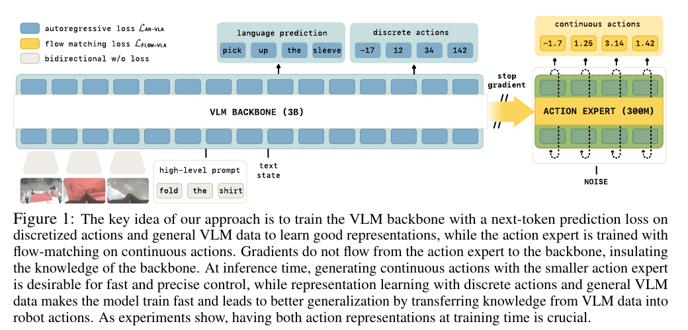
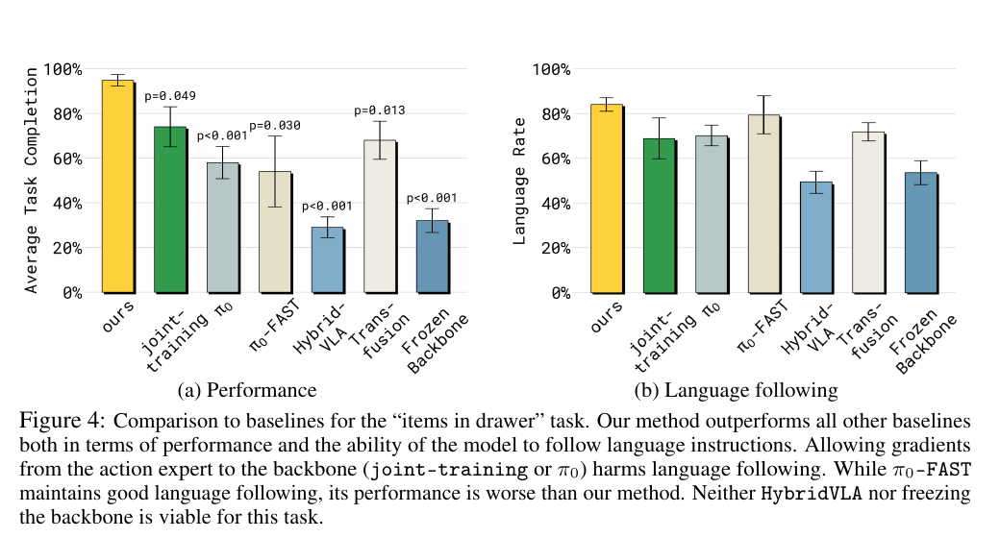
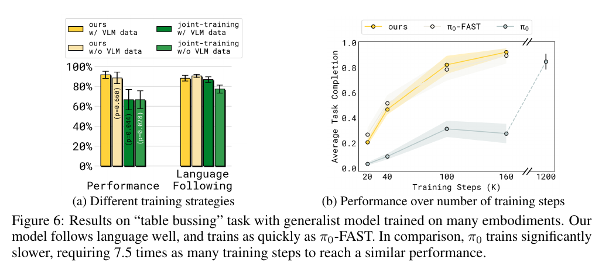
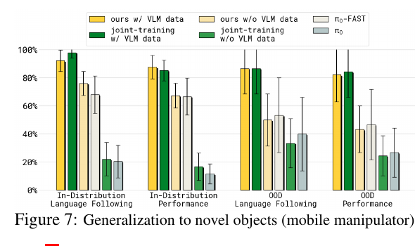

# [pi0.5-KI: Knowledge-Insulated Vision-Language-Action Models](https://pi.website/research/knowledge_insulation)

> **Brief:** **Knowledge-insulated VLA:** jointly train a PaliGemma backbone with FAST action tokens and VLM data while training a flow-matching action expert on continuous actions, but stop the flow-loss gradient before it enters the pretrained backbone.

This note uses **pi0.5-KI** as shorthand for the paper's knowledge-insulated, pi0-based model. The manuscript itself generally calls the model **our method** rather than assigning it the formal name `pi0.5-KI`.

## Convenient Links

* [Paper project page and videos](https://pi.website/research/knowledge_insulation)
* [pi0 note](./Pi_0.md)
* [pi0.5 note](./Pi_0_5.md)
* [FAST / pi0-FAST note](./Pi_0_FAST.md)
* [Diffusion Policy note](./Diffusion_Policy.md)

## 1. One-Sentence Summary

pi0.5-KI resolves a conflict between **fast VLA adaptation** and **fast continuous control**:

```text
FAST next-token loss
-> efficiently adapts the pretrained VLM to robot actions

flow-matching action expert
-> generates precise continuous action chunks quickly

stop-gradient between them
-> prevents the randomly initialized expert from corrupting VLM knowledge
```

The paper's headline result is that this recipe trains about as quickly as pi0-FAST, runs with a small continuous-action expert like pi0, follows language more reliably, and transfers VLM knowledge better.

## 2. The Problem

A VLA must solve two different problems:

1. learn useful visual-language representations for robot control;
2. emit precise, high-frequency continuous actions.

Existing action representations solve one side more naturally than the other.

| Action representation | Training | Runtime | Main weakness |
| :-------------------- | :------- | :------ | :------------ |
| Autoregressive discrete tokens | stable next-token learning | sequential decoding | slow control and quantization error |
| Diffusion or flow matching | slower representation learning | parallel continuous chunks | a new action module can damage the VLM during fine-tuning |

The paper reports that pi0-FAST needs about **750 ms** on an RTX 4090 to autoregressively produce a one-second action chunk, corresponding to roughly `1.3 Hz`. A pi0-style 300M action expert can instead support approximately `10 Hz` control.

However, speed is not the only issue. A pi0-style action expert begins with random parameters. If its flow loss backpropagates through the pretrained VLM from the first update, noisy optimization signals can overwrite useful visual and language features.

This produces three unsatisfactory baselines:

```text
FAST only:
good representation learning, slow inference

flow expert only:
fast inference, slow convergence and weaker language following

freeze the VLM:
preserves old knowledge, but cannot learn robot-specific representations
```

Knowledge insulation is designed to avoid all three failures.

## 3. Core Architecture



*Paper Figure 1. The VLM learns language and FAST action prediction, while the smaller action expert learns continuous flow matching. The stop-gradient blocks only the expert-to-backbone training path.*

The model builds on the pi0 mixture-of-experts architecture:

| Component | Role | Size |
| :-------- | :--- | ---: |
| PaliGemma VLM backbone | images, language, state, text and FAST-token prediction | about `3B` total VLM |
| Gemma language backbone inside the VLM | transformer width 2048, 18 blocks | about `2B` |
| Flow-matching action expert | noisy continuous actions to continuous flow vectors | about `300M` |

The VLM and action expert use separate transformer parameters but interact inside self-attention. They have compatible query, key, and value head dimensions, allowing action tokens to read VLM context.

For an observation

$$
o_t = (I_t^{1:V}, q_t, \ell),
$$

the inputs are:

* camera images $I_t^{1:V}$;
* proprioceptive state $q_t$;
* language instruction $\ell$;
* a noisy continuous action chunk for the action expert;
* FAST action tokens as autoregressive targets during training.

The predicted action horizon is

$$
a_{1:H}, \qquad H=50.
$$

## 4. Two Representations of the Same Action

For every robot trajectory, the same clean action chunk is represented in two ways.

### 4.1 Discrete FAST branch

FAST applies temporal compression before tokenization:

$$
z_{1:L} = T_{\mathrm{FAST}}(a_{1:H}).
$$

The VLM predicts these tokens autoregressively:

$$
\mathcal{L}_{\mathrm{FAST}}
=
-\sum_{j=1}^{L}
\log p_{\theta_b}(z_j \mid o_t,z_{<j}),
$$

where $\theta_b$ denotes the backbone parameters.

This branch is used as a **representation-learning objective**. It teaches the backbone to encode visual and language information sufficient to infer robot motion.

### 4.2 Continuous flow branch

For Gaussian noise $\omega$ and flow time $\tau$:

$$
a_{1:H}^{\tau,\omega}
=
\tau a_{1:H} + (1-\tau)\omega,
\qquad
\omega \sim \mathcal{N}(0,I).
$$

The action expert predicts the paper's flow target:

$$
\mathcal{L}_{\mathrm{flow}}
=
\left\|
\omega-a_{1:H}
-f_{\theta_a}^{a}
\left(a_{1:H}^{\tau,\omega},o_t\right)
\right\|_2^2,
$$

where $\theta_a$ denotes the action-expert parameters.

At runtime, the predicted vector field is integrated for a few steps to transform noise into a continuous action chunk.

## 5. Joint Training Objective

The complete data mixture may contain:

* robot examples with action targets;
* VLM examples with text targets;
* examples with both language and action targets;
* robot-planning or next-step language annotations.

Let $M_j^{\mathrm{tok}}$ select text or FAST-token targets and let $M^{\mathrm{act}}$ indicate that a continuous action is available. A simplified form of the paper's joint objective is

$$
\mathcal{L}_{\mathrm{CO\text{-}VLA}}
=
\mathbb{E}
\left[
-\sum_j
M_j^{\mathrm{tok}}
\log p_\theta(y_{j+1}\mid x_{\le j})
+
\alpha M^{\mathrm{act}}\mathcal{L}_{\mathrm{flow}}
\right].
$$

The output tokens $y$ include both:

* normal language tokens;
* discrete FAST action tokens.

This shared next-token interface makes heterogeneous co-training straightforward. Examples without robot actions simply set $M^{\mathrm{act}}=0$.

## 6. Knowledge Insulation

Joint FAST and flow training alone is **not** the complete method. Without insulation, the flow loss can still update the pretrained backbone:

$$
\frac{\partial \mathcal{L}_{\mathrm{flow}}}
{\partial \theta_b}
\ne 0.
$$

Knowledge insulation changes the action expert's context input from

$$
h_b=f_{\theta_b}(o_t)
$$

to

$$
\bar{h}_b=\operatorname{sg}(h_b),
$$

where $\operatorname{sg}$ is the stop-gradient operator. Conceptually:

$$
\hat{v}
=
f_{\theta_a}^{a}
\left(a^{\tau,\omega},\operatorname{sg}(h_b)\right).
$$

The resulting gradient routing is

$$
\frac{\partial \mathcal{L}_{\mathrm{FAST}}}{\partial\theta_b}
\ne 0,
\qquad
\frac{\partial \mathcal{L}_{\mathrm{flow}}}{\partial\theta_b}
=0,
\qquad
\frac{\partial \mathcal{L}_{\mathrm{flow}}}{\partial\theta_a}
\ne 0.
$$

Therefore:

```text
FAST/text losses -> update VLM backbone
flow loss        -> update action expert
flow loss        -X-> VLM backbone
```

The backbone is **not frozen**. It continues learning from robot FAST tokens and VLM targets. Only the potentially disruptive gradient from the newly initialized action expert is blocked.

Because the two losses now train effectively separated parameter groups, the paper sets

$$
\alpha=1.
$$

## 7. Stop-Gradient Inside Attention

The gradient barrier must be applied where the action expert reads VLM features.

Let:

* $X_b$ be backbone-token activations;
* $X_a$ be action-expert-token activations;
* $P_{bb}$ be backbone-to-backbone attention;
* $P_{ab}$ be action-to-backbone attention;
* $P_{aa}$ be action-to-action attention.

The attention structure is

$$
P =
\begin{pmatrix}
P_{bb} & 0 \\
P_{ab} & P_{aa}
\end{pmatrix}.
$$

The upper-right zero means backbone tokens do not read action-expert tokens. Action tokens may read the backbone and one another.

For the cross-expert attention logits, the backbone keys are detached:

$$
P_{ab}
\propto
\operatorname{softmax}
\left(
Q_a(X_a)\,
\operatorname{sg}\!\left(K_b(X_b)\right)^\top
\right).
$$

The corresponding value path is also detached:

$$
E_a
=
P_{ab}\operatorname{sg}\!\left(V_b(X_b)\right)
+
P_{aa}V_a(X_a).
$$

The forward pass is unchanged: the action expert still receives visual-language context. Only backward flow into the VLM is removed.

## 8. Attention Mask and Leakage Prevention

There are three relevant token groups:

```text
VLM prefix:
images + instruction + state

FAST branch:
discrete autoregressive action tokens

flow branch:
continuous noisy action tokens
```

The paper enforces:

* prefix tokens attend bidirectionally within the prefix;
* FAST tokens attend to the prefix and previous FAST tokens;
* continuous action tokens attend to the prefix and each other;
* FAST and continuous action tokens do **not** attend to one another;
* no VLM token attends to action-expert tokens.

The FAST and flow targets encode the same clean action. If one branch could read the other, it could copy target information instead of learning control from the observation and instruction.

## 9. Training and Inference

### 9.1 Training

Both action branches are active simultaneously:

```text
clean action chunk
|
+-- FAST tokenizer
|   `-> token cross-entropy -> VLM backbone
|
`-- add noise and sample flow time
    `-> flow matching -> action expert

VLM data
`-> text cross-entropy -> VLM backbone
```

Unlike pi0.5's original two-stage recipe, the knowledge-insulated model does not need to finish FAST-only pretraining before adding the continuous expert. Both can be trained together safely because their gradient paths are separated.

The paper uses pi0's flow-time distribution, biased toward low flow times, rather than uniform sampling. It sets $s=0.999$ with Beta parameters $\alpha=1.5$ and $\beta=1$.

### 9.2 Runtime

FAST tokens are a training signal, not the normal control output:

```text
images + state + instruction
-> VLM context
-> 300M action expert
-> iterative flow integration
-> continuous 50-action chunk
```

The expensive autoregressive FAST sequence is not decoded. This is the sense in which the model can **train like an autoregressive VLA but run like a continuous-action VLA**.

## 10. Relation to pi0, pi0-FAST, and pi0.5

| Model | Backbone training signal | Continuous expert | Expert gradient enters VLM? | Runtime action |
| :---- | :----------------------- | :---------------- | :-------------------------- | :------------- |
| pi0 | flow matching | yes | yes | continuous flow |
| pi0-FAST | FAST tokens | no | not applicable | autoregressive FAST |
| pi0.5 | FAST pretraining, then joint FAST + flow post-training | added in stage 2 | yes in the paper's joint-training description | continuous flow |
| pi0.5-KI | joint FAST + VLM + flow in one stage | yes from the start | **no** | continuous flow |

The important progression is:

```text
pi0:
fast runtime, but flow gradients can disrupt the VLM

pi0-FAST:
fast learning, but slow runtime

pi0.5:
separates FAST pretraining and flow post-training in time

pi0.5-KI:
trains both simultaneously, but separates their backward paths
```

pi0.5-KI is therefore best understood as a formalized and strengthened training recipe, not a new high-level task-planning architecture.

## 11. Data

### 11.1 Generalist robot mixture

The generalist policy is trained on 12 robot configurations:

* static single-arm manipulators;
* static bimanual manipulators;
* mobile bimanual manipulators;
* Open X-Embodiment data.

The mixture spans diverse environments and tasks, including tasks not used in the evaluation.

### 11.2 VLM co-training mixture

The non-robot mixture contains:

| Task | Sources described in the paper |
| :--- | :----------------------------- |
| Image captioning | CapsFusion, COCO |
| Visual question answering | Cambrian-7M, PixMo, VQAv2 |
| Object localization | standard localization sets plus web household and indoor-scene boxes |

VLM co-training serves two purposes:

1. continuously rehearses general visual-language capabilities;
2. transfers semantic knowledge about unseen objects into the action policy.

The joint objective can additionally consume robot examples annotated with planning or next-step language. These are robot-semantic supervision rather than part of the web VLM mixture.

### 11.3 Specialist models

The paper also trains specialist policies on data from one target embodiment. This separates benefits caused by the architecture from those caused by broad multi-robot training.

## 12. Training Details Reported by the Paper

| Setting | Value |
| :------ | :---- |
| VLM initialization | pretrained PaliGemma |
| VLM transformer | width 2048, 18 blocks, MLP dimension 16,384 |
| Action expert | width 1024, 18 blocks, MLP dimension 4096 |
| Attention heads | 18, with one KV head |
| Head dimension | 256 |
| Action expert size | about 300M parameters |
| Action horizon | 50 |
| Flow-time sampling | pi0-style low-time-biased Beta distribution |
| Flow-loss multiplier after insulation | $\alpha=1$ |

The paper does not provide a complete optimizer, learning-rate, batch-size, or hardware recipe.

### 12.1 Proprioceptive state variants

Three state encodings are evaluated:

| State representation | Mechanism |
| :------------------- | :-------- |
| Text state | discretize values and write bins as ordinary numbers |
| Special-token state | map discretized bins to dedicated vocabulary tokens |
| Continuous state | affine projection of the real-valued state vector |

Knowledge insulation works well with text and continuous state. Special-token state performs worse, so the gain cannot be explained only by changing the state representation relative to pi0.

## 13. Evaluation Tasks

The evaluation covers:

* **items in drawer:** open a drawer, place three requested items, and close it;
* **table bussing:** sort 12 dishes, utensils, and trash into the correct receptacles;
* **T-shirt folding:** dexterous bimanual folding;
* **mobile manipulation:** make a bed, put dishes in a sink, place an item in a drawer, and put laundry in a basket;
* **DROID:** unseen tabletop picking, placing, wiping, and drawer tasks;
* **LIBERO:** Spatial, Object, Goal, Long, and LIBERO-90 suites.

The items-in-drawer task and several mobile tasks use environments excluded from training.

## 14. Performance and Language Following



*Paper Figure 4. On items-in-drawer, stopping the expert gradient gives the strongest task completion and language following.*

The figure isolates an important distinction:

* **joint-training** has both FAST and flow losses but no gradient barrier;
* **ours** adds the barrier;
* **frozen backbone** prevents all VLM adaptation;
* **pi0-FAST** preserves language behavior but lacks precise, fast continuous control.

The knowledge-insulated policy reaches roughly 95% average task completion in this experiment. Allowing expert gradients into the VLM reduces both completion and language following. Freezing the backbone is also poor because generic VLM features do not yet encode enough robot-specific information.

On DROID, the reported progress scores are:

| Model | DROID score |
| :---- | ----------: |
| pi0.5-KI | **$0.55\pm0.09$** |
| pi0 | $0.49\pm0.09$ |
| pi0-FAST | $0.45\pm0.09$ |

## 15. Training Speed



*Paper Figure 6. The FAST representation objective makes the knowledge-insulated model converge at approximately pi0-FAST speed, while retaining flow-based runtime control.*

On generalist table bussing:

* pi0.5-KI and pi0-FAST reach high task completion by roughly `160k` steps;
* flow-only pi0 needs about `1.2M` steps to reach comparable performance;
* the paper summarizes this as **7.5x more training steps** for pi0.

Joint discrete and continuous training adds about **20% compute per step**, but the much faster convergence more than offsets this overhead relative to flow-only training.

## 16. Generalization from VLM Data



*Paper Figure 7. VLM co-training is especially valuable for following instructions involving objects excluded from robot training.*

The policy must move previously unseen objects from a kitchen counter into a drawer. Removing VLM data has a modest effect in-distribution but a much larger effect on out-of-distribution language following and task performance.

This supports the intended transfer path:

```text
captioning / VQA / localization data
-> preserved and adapted VLM representation
-> action expert reads that representation
-> correct behavior for novel object concepts
```

The generalist model also performs best on average across four mobile-manipulation tasks in unseen environments. Flow-only pi0 is much weaker when compared after the same number of training steps.

## 17. LIBERO Results

Success rates reported in the paper:

| Model | Spatial | Object | Goal | Long | LIBERO-90 |
| :---- | ------: | -----: | ---: | ---: | --------: |
| OpenVLA-OFT | 97.6 | 98.4 | **97.9** | **94.5** | - |
| pi0 | 96.8 | **98.8** | 95.8 | 85.2 | - |
| pi0-FAST | 96.4 | 96.8 | 88.6 | 60.2 | - |
| pi0.5-KI, from scratch | 96.6 | 97.2 | 94.6 | 84.8 | 92.7 |
| pi0.5-KI, from generalist | **98.0** | 97.8 | 95.6 | 85.8 | **96.0** |

The generalist-initialized model sets the paper's best results on LIBERO-Spatial and LIBERO-90, but it does not lead on LIBERO-Object, Goal, or Long.

## 18. Ablation Findings

### 18.1 Stop-gradient vs. joint training

Joint-training without stop-gradient can work when enough VLM rehearsal data is present, but it is less reliable. The explicit gradient barrier gives stronger protection when the action expert is randomly initialized.

### 18.2 Stop-gradient vs. freezing

These are fundamentally different:

| Method | Robot action signal reaches VLM? | Flow gradient reaches VLM? |
| :----- | :------------------------------: | :-------------------------: |
| Freeze backbone | no | no |
| Joint training | yes, through FAST | yes |
| Knowledge insulation | **yes, through FAST** | **no** |

The successful middle ground is to adapt the VLM with a clean autoregressive signal while blocking only the new expert's gradient.

### 18.3 FAST vs. naive action tokens

Naive per-dimension tokens still improve representation learning over flow-only training, but perform worse than FAST. Subsampling naive tokens with stride 5 is better than using every timestep, supporting FAST's premise that temporally compressed targets provide a better learning signal.

### 18.4 No cross-representation attention

HybridVLA allows autoregressive action tokens to attend to continuous-action inputs. The paper finds this substantially worse on items-in-drawer. Keeping the two action representations isolated prevents target leakage.

### 18.5 VLM data

VLM co-training improves knowledge preservation and is particularly important for novel-object language following. Its effect is strongest when expert gradients are not otherwise insulated.

## 19. Why the Recipe Works

The design assigns each component a learning signal suited to its role:

| Component | Learning signal | What it learns |
| :-------- | :-------------- | :------------- |
| Pretrained VLM | text and FAST next-token losses | semantics plus action-relevant visual representation |
| Action expert | flow-matching loss | precise continuous action distribution |
| VLM co-training | captioning, VQA, localization, planning | semantic rehearsal and transfer |
| Stop-gradient | no forward change; backward restriction | prevents optimization interference |

The FAST branch makes the backbone's hidden state action-informative. The action expert can then consume that hidden state without forcing the backbone to optimize through a randomly initialized continuous decoder.

## 20. Limitations

* Training two action representations costs about 20% more compute per step.
* Better language following is not perfect; correlations in robot data can still cause instruction neglect.
* The paper does not provide a complete reproducible optimizer and hardware recipe.
* Knowledge insulation protects the backbone from flow gradients, but it does not eliminate interference among FAST, language, and VLM co-training objectives.
* The approach requires action tokenization even though FAST tokens are discarded at runtime.
* Some benchmark suites, especially LIBERO-Long, are not improved over the strongest baselines.

## 21. Main Takeaways

1. **Do not confuse insulation with freezing.** The VLM still adapts through text and FAST losses.
2. **Use two action representations for two purposes.** FAST is for learning; flow matching is for execution.
3. **Block only the harmful gradient path.** The action expert reads VLM features in the forward pass but cannot update them through its loss.
4. **Prevent target leakage.** FAST and continuous action tokens must not attend to one another.
5. **Continue VLM co-training.** Knowledge preservation and novel-object transfer require semantic rehearsal.
6. **The method is single-stage.** Unlike pi0.5's staged FAST-then-flow recipe, both branches can be trained together when their backward paths are insulated.

The central idea can be summarized as:

> Let the pretrained backbone learn robot control through a stable token objective, let the action expert learn precise continuous control through flow matching, and do not let the newly initialized expert rewrite the backbone.
