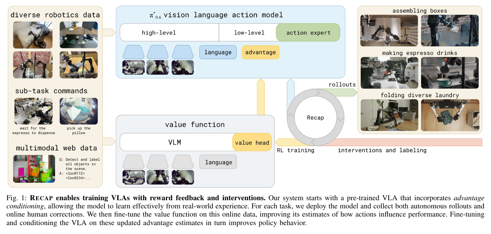
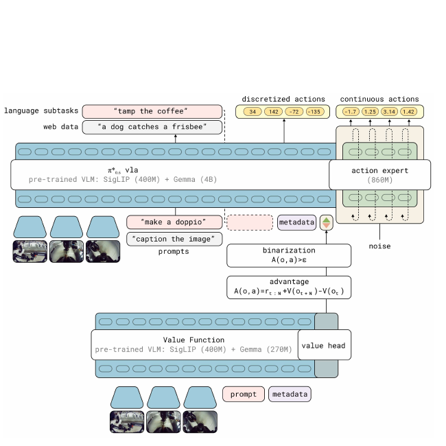
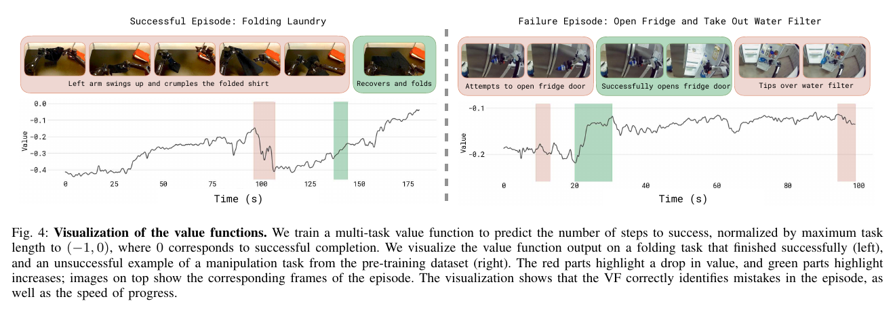
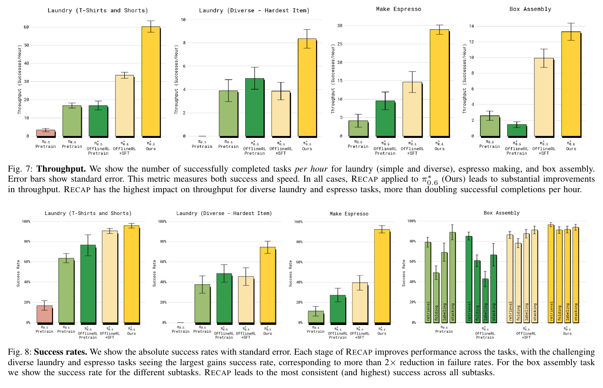
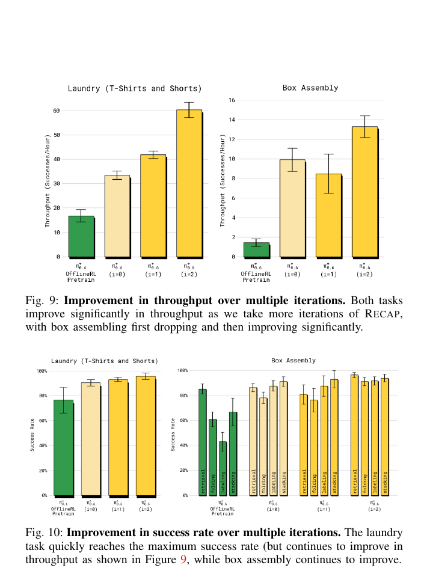

# [pi0.6*: A VLA That Learns From Experience](https://pi.website/blog/pistar06)

> **Brief:** **Experience-trained VLA:** pi0.6* extends the supervised pi0.6 policy with advantage conditioning and trains it using RECAP, an iterative offline-RL recipe that combines demonstrations, autonomous rollouts, outcome labels, and optional human corrections.

## Convenient Links

* [Project page and videos](https://pi.website/blog/pistar06)
* [pi0.5 note](./Pi_0_5.md)
* [pi0.5-KI note](./Pi_0_5_KI.md)
* [FAST / pi0-FAST note](./Pi_0_FAST.md)
* [Real-Time Chunking note](../Inference/RTC.md)

## 1. One-Sentence Summary

pi0.6* uses a learned value function to label actions as better or worse than the behavior policy, then trains a large flow-matching VLA to imitate all collected actions while conditioning action generation on the label; repeated deployment and retraining more than doubles throughput on some difficult real-world tasks and roughly halves their failure rates.

## 2. pi0.6 Versus pi0.6*

The star is important:

| Name | Meaning |
| :--- | :------ |
| **pi0.6** | the improved, supervised VLA base model |
| **pi0.6*** | pi0.6 augmented with an advantage input and trained with RECAP |

The paper is mainly about **pi0.6*** and its training method, not only a new supervised architecture.

```text
pi0.6
+ value function
+ binary advantage conditioning
+ autonomous experience
+ optional human corrections
= pi0.6* trained with RECAP
```

RECAP means **RL with Experience and Corrections via Advantage-conditioned Policies**.



*Paper Figure 1. A generalist VLA and a separate value function are pre-trained on diverse data. Downstream rollouts, outcome labels, and interventions are then fed back into the critic and policy training loop.*

## 3. Why Imitation Learning Is Not Enough

Supervised imitation learning has two limits:

1. it reproduces the quality and speed of the demonstrations rather than improving beyond them;
2. deployment errors create observations that may not exist in the demonstration set.

Real-robot RL could address both problems, but conventional policy-gradient methods are awkward for a multi-billion-parameter VLA whose continuous actions are represented by flow matching. RECAP instead turns policy improvement back into a supervised-learning problem:

```text
experience -> value estimates -> binary action labels
           -> conditional behavior cloning -> improved policy
```

This has three practical advantages:

* old demonstrations, failed rollouts, successful rollouts, and interventions can remain in one dataset;
* no tractable flow-policy log-likelihood is required;
* the entire VLA can be trained end to end with standard next-token and flow-matching losses.

## 4. Base pi0.6 Policy

pi0.6 evolves the pi0.5 and pi0.5-KI design:

| Component | pi0.6 design |
| :-------- | :----------- |
| Visual-language backbone | SigLIP vision encoder with a Gemma 3 `4B` language model |
| Action expert | `860M` parameters, trained with flow matching |
| High-level output | textual next-subtask prediction |
| Low-level output | continuous joint-position and gripper action chunks at `50 Hz` |
| Auxiliary action output | FAST-tokenized discrete actions |
| Pre-training data | robot demonstrations from many platforms plus multimodal web data |
| Gradient routing | knowledge insulation stops the flow-loss gradient before the VLM backbone |

Compared with pi0.5, the paper identifies three direct changes:

* additional pre-training data from multiple robot platforms;
* Gemma 3 `4B` as the base language model;
* an action expert enlarged to `860M`.

Let

$$
o_t=[X_t^1,\ldots,X_t^n,q_t]
$$

contain camera images and robot configuration, and let

$$
\ell=\ell_t+s
$$

contain the task prompt plus metadata that controls how the task should be performed. The model predicts:

* a textual subtask $\hat{\ell}$;
* a FAST-tokenized action chunk $a_{t:t+H}^{\mathrm{FAST}}$;
* a continuous action chunk $a_{t:t+H}$.

Its output factorization is:

$$
\begin{aligned}
\log \pi_\theta(
a_{t:t+H},
a_{t:t+H}^{\mathrm{FAST}},
\hat{\ell}
\mid o_t,\ell)
={}&
\log \pi_\theta(\hat{\ell}\mid o_t,\ell) \\
&+
\log \pi_\theta(
a_{t:t+H}^{\mathrm{FAST}}
\mid o_t,\ell,\hat{\ell}) \\
&+
\log \pi_\theta(
a_{t:t+H}
\mid o_t,\ell,\hat{\ell}).
\end{aligned}
$$

The subtask is generated first, so both action representations are conditioned on the current semantic plan. FAST tokens and continuous actions are predicted independently; the action expert does not receive the FAST targets as input.

## 5. Adding Advantage Conditioning

pi0.6* inserts one additional text field after the predicted subtask and before the action targets:

```text
Advantage: positive
```

or

```text
Advantage: negative
```

Denote this binary indicator by $I_t$. Its position in the sequence is deliberate:

```text
observation + task
-> predicted subtask
-> advantage indicator
-> FAST actions + continuous actions
```

Therefore, $I_t$ changes the action distribution but not the subtask likelihood. At inference, requesting `Advantage: positive` asks the policy to generate the action distribution associated with better-than-reference behavior.



*Paper Figure 3. The separate value model produces an advantage estimate, which is binarized and supplied to the VLA. The VLA retains KI training and its continuous action expert.*

## 6. RECAP Step 1: Collect Experience

For a downstream task, the current policy is deployed to collect:

* autonomous successes;
* autonomous failures;
* optional human teleoperation corrections;
* an episode-level success or failure label.

Interventions mainly provide recovery actions and prevent catastrophic failures. Autonomous trajectories are still necessary because they reveal the policy's own mistakes, execution speed, and subtle inefficiencies.

All collected data is retained. RECAP does not simply delete failures or keep only the best trajectories.

## 7. RECAP Step 2: Train the Value Function

### 7.1 Sparse reward

For terminal time $T$, the reward is:

$$
r_t=
\begin{cases}
0, & t=T \text{ and the episode succeeds},\\
-C_{\mathrm{fail}}, & t=T \text{ and the episode fails},\\
-1, & \text{otherwise}.
\end{cases}
$$

For a successful episode, the value is therefore the negative expected number of remaining steps. Higher values mean faster progress toward completion. Failed episodes receive a large negative terminal value.

Values are normalized per task to $(-1,0)$ because task durations differ substantially; $0$ represents successful completion.

### 7.2 Distributional critic

The critic is a language-conditioned distributional value function:

$$
p_\phi(V\mid o_t,\ell)\in\Delta_B,
\qquad B=201.
$$

For trajectory $\tau$, define the empirical return:

$$
R_t(\tau)=\sum_{t'=t}^{T}r_{t'}.
$$

After discretizing it to $R_t^B$, the value model minimizes:

$$
\min_\phi
\mathbb{E}_{\tau\sim\mathcal{D}}
\left[
\sum_{o_t\in\tau}
\mathcal{H}
\left(
R_t^B(\tau),
p_\phi(V\mid o_t,\ell)
\right)
\right].
$$

The scalar value is the expectation over the bins:

$$
V^{\pi_{\mathrm{ref}}}(o_t,\ell)
=
\sum_b p_\phi(V=b\mid o_t,\ell)\,v(b).
$$

The critic follows the VLA's multimodal design but uses a smaller `670M` Gemma 3-based VLM. It is also co-trained on a small multimodal web mixture to reduce overfitting.



*Paper Figure 4. Value rises as a task approaches completion, falls when the robot makes a mistake, and reflects recovery. This gives RECAP more information than a terminal success label alone.*

### 7.3 Advantage estimate

RECAP uses an $N$-step estimate:

$$
A^{\pi_{\mathrm{ref}}}(o_t,a_t,\ell)
=
\sum_{t'=t}^{t+N-1}r_{t'}
+
V^{\pi_{\mathrm{ref}}}(o_{t+N},\ell)
-
V^{\pi_{\mathrm{ref}}}(o_t,\ell).
$$

The implementation uses:

* full-trajectory Monte Carlo estimates during pre-training;
* $N=50$ during downstream post-training.

The continuous advantage is converted to a label:

$$
I_t
=
\mathbf{1}
\left[
A^{\pi_{\mathrm{ref}}}(o_t,a_t,\ell)>\epsilon_\ell
\right].
$$

The task-specific threshold $\epsilon_\ell$ controls the tradeoff between staying close to the collected behavior and selecting only its best actions.

## 8. RECAP Step 3: Extract an Improved Policy

The desired regularized policy can be written as:

$$
\hat{\pi}(a\mid o,\ell)
\propto
\pi_{\mathrm{ref}}(a\mid o,\ell)
\left(
\frac{
\pi_{\mathrm{ref}}(a\mid I,o,\ell)
}{
\pi_{\mathrm{ref}}(a\mid o,\ell)
}
\right)^\beta.
$$

When $\beta=1$, this reduces to the advantage-conditioned distribution:

$$
\hat{\pi}(a\mid o,\ell)
=
\pi_{\mathrm{ref}}(a\mid I,o,\ell).
$$

The policy is trained with both unconditional and conditional behavior cloning:

$$
\min_\theta
\mathbb{E}_{\mathcal{D}_{\pi_{\mathrm{ref}}}}
\left[
-\log\pi_\theta(a_t\mid o_t,\ell)
-\alpha
\log\pi_\theta(a_t\mid I_t,o_t,\ell)
\right].
$$

In practice, the implementation replaces explicit tuning of $\alpha$ with **30% advantage-conditioning dropout**. This trains both conditional and unconditional predictions and permits classifier-free guidance (CFG) at inference.

Human correction actions are always assigned $I_t=\mathrm{True}$, on the assumption that the teleoperator is correcting the current failure.

### Why this can learn from failures

A failed trajectory is not uniformly bad. Before failure, it may contain useful reaching, grasping, or recovery actions. The value difference labels useful and harmful regions separately, while conditional training keeps both in the dataset:

```text
positive action -> learned under I=True
negative action -> learned under I=False
```

At deployment, the policy is queried for the positive branch.

## 9. Flow-Matching Policy Objective

For a clean chunk $a_{t:t+H}$, Gaussian noise $\omega$, and flow time $\eta$:

$$
a_{t:t+H}^{\eta,\omega}
=
\eta a_{t:t+H}
+
(1-\eta)\omega,
\qquad
\omega\sim\mathcal{N}(0,I).
$$

The combined discrete and continuous action objective is motivated as a lower bound:

$$
\begin{aligned}
&\log \pi_\theta(
a_{t:t+H},
a_{t:t+H}^{\mathrm{FAST}}
\mid I_t,o_t,\ell,\hat{\ell})
\\
&\quad\gtrsim
\mathbb{E}_{\eta,\omega}
\left[
\log p_\theta(
a_{t:t+H}^{\mathrm{FAST}}
\mid I_t,o_t,\ell,\hat{\ell})
-
\alpha_\eta
\left\|
\omega-a_{t:t+H}
-
f_\theta(
a_{t:t+H}^{\eta,\omega},
I_t,o_t,\ell,\hat{\ell})
\right\|_2^2
\right].
\end{aligned}
$$

The FAST next-token loss adapts the VLM representations, while the insulated flow loss trains fast continuous action generation.

## 10. Full Training Recipe

### 10.1 Generalist pre-training

The generalist stage uses tens of thousands of hours of multi-task, multi-robot demonstrations:

1. train a value function $V_{\mathrm{pre}}$ on the demonstration mixture;
2. estimate advantages and choose a per-task threshold;
3. train the advantage-conditioned policy $\pi_{\mathrm{pre}}$;
4. co-train with robot data, subtask prediction, FAST actions, continuous flow matching, and multimodal web data.

During pre-training, $\epsilon_\ell$ is selected so that approximately **30%** of a random `10,000`-point sample for each task is labeled positive.

```
              GENERAL PRETRAINING
                     │
                     ▼
      huge multi-task robot demonstrations
                     │
             ┌───────┴────────┐
             ▼                │
       Train value V          │
             │                │
             ▼                │
      estimate advantage A    │
             │                │
             ▼                │
    positive / negative tag   │
             │                │
             └───────┬────────┘
                     ▼
              Train π*0.6
                     │
                     ▼
          RL-pretrained general VLA
```

### 10.2 Downstream specialization

For target task $\ell$:

1. initialize $\mathcal{D}_\ell$ with demonstrations;
2. fine-tune the value model;
3. fine-tune the policy with $I_t=\mathrm{True}$ for demonstrations, producing $\pi_\ell^0$;
4. deploy $\pi_\ell^{k-1}$ and add autonomous rollouts and optional corrections to $\mathcal{D}_\ell$;
5. retrain $V_\ell^k$ on all accumulated task data;
6. recompute advantage indicators and retrain $\pi_\ell^k$;
7. repeat if further improvement is needed.

A subtle implementation choice is that each iteration fine-tunes the policy and critic again from their **pre-trained checkpoints**, not from the preceding iteration's weights. The growing dataset carries the experience forward, while restarting from the shared checkpoints reduces model drift.

For downstream training, the threshold usually makes about **40%** of rollout actions positive. The easy laundry task uses a stricter threshold of about **10%** because demonstrations are already reliable but slow.

```
          TASK-SPECIFIC TRAINING
                     │
                     ▼
          task demonstrations
                     │
            SFT (I = positive)
                     │
                     ▼
                    π⁰
                     │
                     ▼
             REAL ROBOT DEPLOY
                     │
         ┌───────────┴───────────┐
         ▼                       ▼
 autonomous trajectories    human corrections
         │                       │
         └───────────┬───────────┘
                     ▼
             success/failure label
                     │
                     ▼
                   reward
                     │
                     ▼
          accumulated dataset D
                     │
                     ▼
              retrain value V
                     │
                     ▼
             calculate advantage
                     │
                     ▼
       positive / negative condition
                     │
                     ▼
               retrain VLA
                     │
                     ▼
                    π¹
                     │
                     ▼
                repeat...
```

### 10.3 Inference

The default evaluation uses $\beta=1$, meaning direct positive-advantage conditioning. CFG with moderate $\beta>1$ can sharpen this distribution, but large values can push actions toward aggressive extremes; the paper reports useful values around `1.5` to `2.5`.

The value model is needed to label training data. Once the improved behavior has been distilled into pi0.6*, ordinary deployment can condition the VLA on the positive indicator without running the critic in the control loop.

## 11. Robot and Experience Data

The downstream experiments use a static bimanual platform:

* two `6-DoF` arms with parallel-jaw grippers;
* joint-position control at `50 Hz`;
* one base camera and one wrist camera per arm;
* joint and gripper positions as proprioceptive inputs.

Representative experience budgets are:

| Task | Collected experience |
| :--- | :------------------- |
| T-shirts and shorts | `300` autonomous trajectories on four robots per iteration |
| Box assembly | `600` autonomous trials and `360` intervention trials per iteration |
| Diverse laundry | `450` evaluation episodes and `287` correction episodes |
| Cafe | one iteration with `414` autonomous and `429` correction episodes |
| Targeted laundry failure | `600` trajectories per iteration for two iterations, without extra demonstrations or interventions |

Corrections solve exploration and recovery problems; autonomous experience is what improves details such as speed and fluency.

## 12. Evaluation Tasks and Metrics

| Task | Success criterion |
| :--- | :---------------- |
| T-shirts and shorts | retrieve, flatten, fold, and stack an item within `200 s` |
| Diverse laundry | fold one of 11 trained item types; evaluate the difficult button-up shirt within `500 s` |
| Targeted failure removal | fold an adversarially placed orange shirt with its collar centered and facing up within `200 s` |
| Double-shot espresso | grind, tamp, lock the portafilter, extract, and serve without critical mistakes within `200 s` |
| Box assembly | fold, label, and stack a box within `600 s` |

The primary metrics are:

* **success rate**, which measures reliability;
* **throughput**, successful completions per hour, which measures reliability and speed together.

This distinction matters. A policy can maintain a high success rate while becoming much faster.

## 13. Main Results



*Paper Figures 7 and 8. Each stage adds offline-RL pre-training, task SFT, and finally on-robot RECAP experience. Yellow bars denote the final pi0.6* policy.*

Approximate means read from the paper's plots:

| Task | Offline RL + SFT throughput | Final pi0.6* throughput | Final success |
| :--- | --------------------------: | ----------------------: | ------------: |
| T-shirts and shorts | about `34/hour` | about `60/hour` | about `96%` |
| Diverse laundry | about `4/hour` | about `8.3/hour` | about `74%` |
| Espresso | about `15/hour` | about `29/hour` | about `92%` |
| Box assembly | about `10/hour` | about `13/hour` | roughly `90%+` across stages |

The strongest gains occur on diverse laundry and espresso:

* throughput roughly doubles or better;
* failure rates fall by about `2x`;
* all final tasks except diverse laundry reach success rates above `90%`.

The trained system was also run for long uninterrupted deployments:

* espresso preparation for `13 hours`;
* folding novel laundry in a new home for more than `2 hours`;
* assembling production packaging boxes in a factory setting.

## 14. Iteration and Extraction Ablations



*Paper Figures 9 and 10. Laundry improves quickly, while the longer box task needs another collection-and-training iteration.*

Over two RECAP iterations:

* laundry throughput improves by about `50%`; success exceeds `90%` after the first iteration, so the second iteration mainly improves speed;
* box throughput improves by about `2x`, and folding and labeling success approach `90%`;
* the targeted collar-orientation failure reaches `97%` success after two iterations of autonomous experience;
* advantage conditioning produces substantially higher throughput than AWR or the paper's PPO baseline on the same collected data.

The comparison with AWR is especially informative: AWR obtains reasonable success but produces slower behavior. RECAP's binary conditioning preserves all data while explicitly selecting the high-value behavior branch.

## 15. Limitations

RECAP is not a fully autonomous online-RL system:

* humans still provide outcome labels, interventions, and episode resets;
* exploration is mostly greedy, relying on policy stochasticity and human corrections;
* data collection and model updates happen in alternating batches rather than concurrently;
* reward labels may be ambiguous for tasks with multiple quality criteria;
* large CFG weights can make actions overly aggressive;
* the experience budgets remain substantial for physical robots.

## 16. Key Takeaways

1. **pi0.6 and pi0.6* are different.** pi0.6 is the supervised base; pi0.6* is the advantage-conditioned, experience-trained policy.
2. **The value model is a training-time teacher.** It converts sparse episode outcomes into local action labels and need not remain in the deployment control loop.
3. **Failures are not discarded.** RECAP trains conditional branches for both good and bad behavior, then requests the good branch at inference.
4. **Human corrections and autonomous rollouts have different roles.** Corrections teach recovery; autonomous experience improves speed, robustness, and the policy's own failure modes.
5. **The main practical result is throughput.** RECAP improves not only whether a task succeeds, but how quickly reliable successes accumulate.
