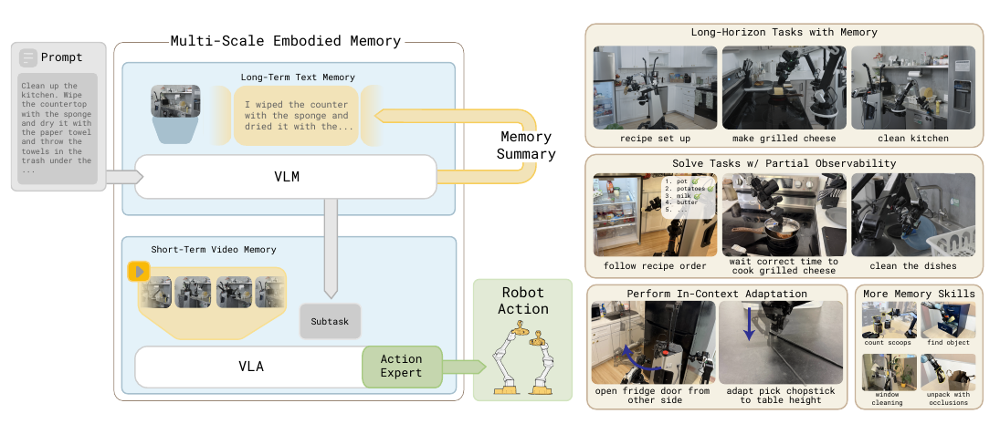
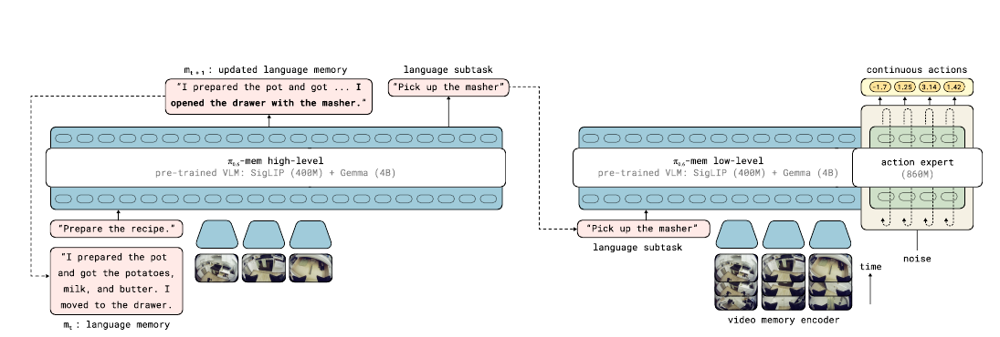
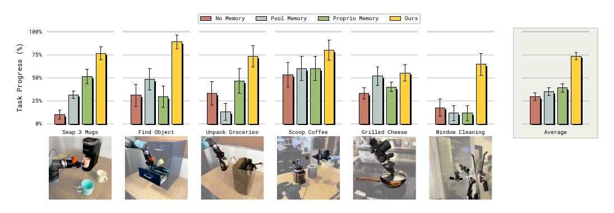

# MEM: Multi-Scale Embodied Memory for Vision-Language-Action Models

> **Brief:** **A mixed-modal memory system for long-horizon robot control:** MEM preserves recent physical details in a compact video representation while recursively summarizing long-term task progress in language. Integrated with pi0.6, it supports tasks requiring up to **15 minutes** of memory without giving the VLA an equally long sequence of raw frames.

**Reference:** Marcel Torne et al., *MEM: Multi-Scale Embodied Memory for Vision Language Action Models*.

## Convenient Links

* [pi0.6 note](./Pi_0_6.md)
* [pi0-FAST note](./Pi_0_FAST.md)
* [Real-Time Chunking note](../Inference/RTC.md)

## 1. One-Sentence Summary

MEM splits robot memory by information scale: a **video encoder** retains dense recent visual context for control, while a **language memory** stores a compressed semantic history for planning over minutes.

## 2. Why One Memory Representation Is Not Enough

A long-horizon robot needs different information at different time scales:

| Need | Useful information | Representation |
|:--|:--|:--|
| Recover an object hidden by the robot arm | Recent geometry and motion | Dense video memory |
| Change a grasp after a failed attempt | The preceding strategy and outcome | Dense video memory |
| Avoid adding an ingredient twice | Completed semantic events | Language memory |
| Finish a multi-stage cleanup task | Overall task progress | Language memory |

Keeping every past image preserves detail but makes inference cost grow with episode length. Keeping only text is compact but discards the geometry, timing, and motion needed for precise control. MEM combines both.

*Paper Figure 1, cropped. Recent observations support physical control, while compressed text carries long-horizon task state.*

## 3. Policy Structure

Let:

* $g$ be the overall language goal;
* $o_t$ be the current multimodal observation;
* $m_t$ be the language memory before the current decision;
* $l_{t+1}$ be the next language subtask;
* $a_{t:t+H}$ be the next continuous action chunk;
* $K$ be the short video horizon and $T$ the full history, with $K\ll T$.

The desired long-context policy is

$$
\pi(a_{t:t+H},l_{t+1},m_{t+1}\mid o_{t-T:t},m_t,g).
$$

MEM approximately factorizes it into high- and low-level policies:

$$
\begin{aligned}
&\pi(a_{t:t+H},l_{t+1},m_{t+1}\mid o_{t-T:t},m_t,g) \\
&\quad\approx
\underbrace{\pi_{\mathrm{LL}}(a_{t:t+H}\mid o_{t-K:t},l_{t+1},g)}_{\text{recent video }\rightarrow\text{ robot actions}}
\underbrace{\pi_{\mathrm{HL}}(l_{t+1},m_{t+1}\mid o_t,m_t,g)}_{\text{semantic history }\rightarrow\text{ subtask and updated memory}}.
\end{aligned}
$$

The information flow is:

~~~text
current observation + goal + old language memory
                -> high-level policy
                -> next subtask + updated language memory

recent observations + goal + next subtask
                -> low-level policy
                -> continuous action chunk
~~~

The low-level policy does not directly consume the full language memory. The high-level policy uses that memory to choose the subtask that conditions low-level control.

*Paper Figure 2, cropped. The high-level model updates semantic memory; the low-level model encodes recent video and predicts actions.*

## 4. Long-Term Language Memory

The language state $m_t$ summarizes earlier events that remain useful for future decisions. The high-level policy jointly predicts the next subtask and a revised summary:

$$
(l_{t+1},m_{t+1})\sim
\pi_{\mathrm{HL}}(\cdot\mid o_t,m_t,g).
$$

For example:

~~~text
m_t:   I placed a plate in the cabinet and moved to the counter.
event: The robot picks up a bowl.
m_t+1: I placed a plate in the cabinet, moved to the counter,
       and picked up a bowl.
~~~

### 4.1 Training Targets

Robot episodes contain subtask annotations $l_{0:T}$ and whether each subtask succeeded or failed. An off-the-shelf LLM receives this sequence and generates target summaries that retain only information relevant to future execution. These targets supervise the high-level transition from $m_t$ to $m_{t+1}$.

### 4.2 Why Compression Matters

A summary can replace object-by-object details with a sufficient statistic, such as changing three bowl descriptions into "three bowls were placed in the top-right cabinet." This:

* keeps the context short as the episode grows;
* prevents failed retries from repeatedly appending the same subtask.

Demonstrations are usually close to optimal, but a deployed policy may retry a subtask several times. Naively concatenating every predicted subtask therefore creates a history unlike the training data. MEM can keep $m_{t+1}=m_t$ until the subtask succeeds.

## 5. Short-Term Video Memory

The video encoder extends the pretrained image ViT without adding learned parameters.

For patch $p$ and relative time $t\in[-K,0]$, it adds a fixed temporal encoding:

$$
\hat z_{p,t}^{\,l-1}=z_{p,t}^{l-1}+e(t),
\qquad e(0)=0.
$$

The condition $e(0)=0$ makes a one-frame input match the original pretrained image encoder at initialization.

The encoder combines:

1. **Spatial attention:** patches within each frame attend bidirectionally.
2. **Causal temporal attention:** every fourth ViT layer lets the same spatial patch attend across current and earlier frames.

If each frame contains $n$ patches and the history contains $K$ frames, full space-time attention costs

$$
O(n^2K^2).
$$

Factorized spatial and temporal attention reduces this to

$$
O(Kn^2+nK^2).
$$

After temporal information is mixed into the current-frame representation, tokens belonging to older frames are dropped before the VLA backbone. The backbone therefore receives approximately the same number of visual tokens as a single-image VLA.

~~~text
K image histories
-> spatial + causal temporal attention in the video encoder
-> retain current-frame tokens containing temporal context
-> ordinary VLA backbone
~~~

In the latency study with four camera streams on one NVIDIA H100, this encoder remains under the stated **300 ms** real-time threshold through the plotted **16-frame** context; naively passing every frame to the backbone quickly exceeds it.

## 6. pi0.6-MEM Instantiation

| Component | Setting |
|:--|:--|
| VLM initialization | Gemma 3 **4B** VLM with a SigLIP **400M** vision encoder |
| High-level output | Next subtask and updated language memory |
| Low-level outputs | Discrete FAST tokens and continuous flow-matched actions |
| Action expert | **860M** parameters |
| Camera input | **448 x 448** per stream, up to four streams |
| Robot state | One projected proprioceptive token per remembered timestep |
| Gradient path | Action-expert gradients do not flow into the VLM backbone |

Past joint states are projected directly into the backbone embedding space. Encoding every state as text would create a large number of language tokens as the history grows.

## 7. Training Recipe

### 7.1 Data Mixture

pi0.6-MEM is pretrained with:

* teleoperated robot demonstrations;
* policy rollouts and human corrections;
* vision-language examples;
* video-language examples such as video captioning.

Non-robot video teaches general temporal reasoning, while robot trajectories with different quality, speed, and control frequency discourage brittle correlations.

### 7.2 Memory Horizon

| Stage | Visual history |
|:--|:--|
| Pretraining | Six observations: five past plus the current frame, at a **1 s** stride |
| Post-training | Up to **18 frames** spanning **54 s** in the experiments |

The model first develops memory behavior at scale and then adapts to a longer task-specific context. Adding the video-memory mechanism only during post-training performs substantially worse, despite using the same pretrained base pi0.6 checkpoint.

On-robot experiments use either inference-time or training-time [Real-Time Chunking](../Inference/RTC.md) for asynchronous real-time action generation.

## 8. Evaluation

Main comparisons use **10 rollouts** per policy and task or recipe and report mean plus or minus standard error.

### 8.1 Long-Horizon Tasks

| Task | What must be remembered | Result |
|:--|:--|:--|
| Recipe setup | Retrieved items, requested locations, and open doors | Five recipes in unseen kitchens with unseen objects; full MEM has the best progress |
| Kitchen cleanup | Washed dish sides, wiped surfaces, stored objects, and open doors | Full MEM substantially outperforms memoryless pi0.6 and single-memory ablations |

Training covers **42 recipes** across diverse kitchens. Complete tasks can require up to **15 minutes** of memory.

The ablations explain why both scales matter:

* **Video only:** retains local interaction history but loses old semantic milestones.
* **Text only:** tracks milestones but lacks recent geometry, motion, and timing.
* **Naive text plus video:** appends old subtasks without learned compression and suffers from retry-induced train-inference shift.
* **Full MEM:** combines local physical evidence with stable long-term progress.

### 8.2 In-Context Strategy Adaptation

| Task | Adaptation | Gain annotated in Paper Figure 7 |
|:--|:--|--:|
| Pick up a chopstick on an unseen low table | Adjust grasp height after a miss | **+11%** |
| Open a refrigerator with an ambiguous hinge side | Switch pulling direction after failure | **+62%** |

A memoryless policy sees the current scene but not which strategy it already tried, so it can repeat the same error.

### 8.3 Core Memory Benchmark

*Paper Figure 8, cropped. MEM is compared with no memory, average-pooled visual memory, and proprioceptive-state memory.*

The benchmark covers swapping mugs without repeats, finding a hidden object, unpacking an occluded grocery bag, counting coffee scoops, timing grilled cheese, and tracking cleaned window regions.

| Method | Main failure mode |
|:--|:--|
| No memory | Falls to chance when the current observation is insufficient |
| Pool Memory | Average pooling compresses away detailed visual history |
| Proprio Memory | Remembers robot motion but not hidden environment state |
| MEM video memory | Performs strongly across all tested core memory skills |

This comparison uses only short-term memory to isolate visual-memory design. The long-horizon experiments separately establish the benefit of language memory.

### 8.4 Ordinary Manipulation

Across table bussing, shirt folding, counter cleanup, bed making, dishes, batch folding, and box building, pi0.6-MEM matches memoryless pi0.6 on average. This matters because history-conditioned policies can learn spurious correlations or copy prior actions; the paper attributes MEM's robustness largely to diverse pretraining.

## 9. What the Results Establish

1. **Mixed modalities are complementary.** Neither text nor video alone satisfies both semantic and geometric memory needs.
2. **Compression must match the time scale.** Language removes obsolete events; video preserves recent physical evidence before dropping old tokens.
3. **Memory is a pretrained capability.** Introducing history only during task post-training is much less effective.
4. **Memory enables adaptation, not just recall.** A recent failure can change the next control strategy within the same rollout.

## 10. Limitations and Open Questions

* Demonstrated language memory lasts within one episode; memory across days or deployments remains future work.
* Language memory is lossy and recursively predicted, so an omitted or incorrect event can affect later subtasks.
* High-level training requires subtask labels, success/failure labels, and LLM-generated summary targets.
* Long-horizon evaluations use ten rollouts per policy-task pair, leaving uncertainty around rare failures.
* Reported latency uses an NVIDIA H100; deployment cost depends on hardware, camera count, and context length.

## 11. Key Takeaway

MEM does not merely give a VLA more context. It matches representation to time scale:

$$
\boxed{
\text{recent physical history}\rightarrow\text{compressed video features},
\qquad
\text{long-term task history}\rightarrow\text{compressed language state}
}
$$

This preserves the detail needed for action correction and partial observability while keeping multi-minute task progress computationally manageable.
