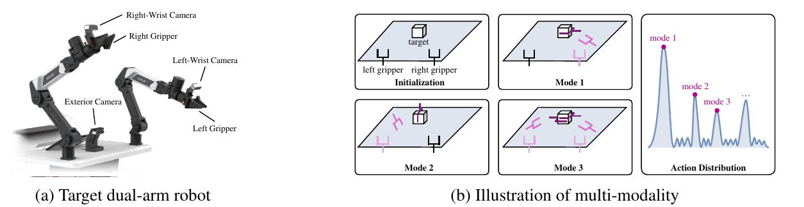
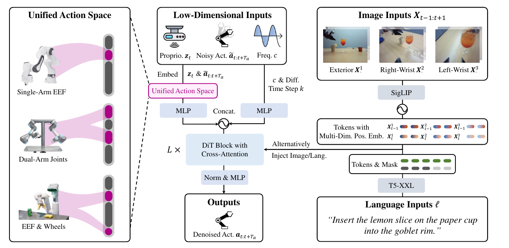

# [RDT-1B: A Diffusion Foundation Model for Bimanual Manipulation](https://arxiv.org/abs/2410.07864)

RDT (**Robotics Diffusion Transformer**) is a language-conditioned policy that generates continuous bimanual action chunks by diffusion. Its central contributions are a **physically interpretable shared state/action representation** for multi-robot pre-training and a **1.2B-parameter diffusion transformer** adapted to robot data, with separate frozen language and vision encoders.

**Source:** the supplied Liu et al. paper, arXiv:2410.07864v1, especially Sections 3-5 and Appendices A-H. The paper's objective is to transfer broad multi-robot experience into a target bimanual robot, not to demonstrate zero-shot deployment on every embodiment.

## Convenient Links

* [Paper](https://arxiv.org/abs/2410.07864v1)
* [Diffusion Policy](./Diffusion_Policy.md) / [ACT / ALOHA](./ACT.md) / [Octo](./Octo.md) / [GR00T N1](./GR00T_N1.md)
* [Open X-Embodiment](../Datasets/Open_X_Embodiment.md)

## 1. Why Diffusion and Multi-Robot Pre-Training?

Bimanual manipulation has two related difficulties. First, several coordinated motions can accomplish the same task: use the left hand, use the right hand, or coordinate both. A deterministic predictor trained with squared error can average incompatible demonstrations into an invalid motion. RDT instead learns a **conditional distribution over action chunks**. Diffusion is one way to represent these multiple modes; it does not guarantee that every sampled motion is feasible.



*Paper Figure 2: two wrist cameras and an exterior camera observe the robot; different coordinated trajectories can reach the same target. Multiple motion modes motivate distributional action prediction.*

Second, collecting enough demonstrations for one dual-arm robot is expensive. RDT therefore **pre-trains on heterogeneous robot datasets, then fine-tunes on target-robot demonstrations**. But an end-effector position from one dataset cannot simply occupy the same numeric slot as a joint angle from another. A shared physical representation must come before shared model training.

## 2. What Enters and Leaves the Policy?

At robot timestep $t$, the policy conditions on

$$
o_t=(X_{t-1},X_t,z_t,c),\qquad
A_t=[a_t,\ldots,a_{t+63}],\qquad p(A_t\mid\ell,o_t).
$$

| Symbol | Meaning |
|:--|:--|
| $\ell$ | Task instruction |
| $X_{t-1},X_t$ | Two image timesteps, each containing exterior, right-wrist, and left-wrist views |
| $z_t$ | Current proprioception, such as joint positions and velocities |
| $c$ | Robot control frequency in Hz |
| $A_t$ | A chunk of **64 future control vectors**; each action typically specifies desired components of the next state |

Only **current proprioception** is supplied, not a proprioceptive history. The authors exclude historical states to discourage memorized motion patterns that ignore images. The two image timesteps still provide visual motion information; no future image is an input.

Control frequency matters because 64 steps span different physical durations at different rates. $c$ tells the model how to interpret robot time; the separate diffusion timestep $k$ will tell it how noisy the candidate action chunk is. Neither is an action index within the chunk.

### 2.1 A 128-Dimensional Physical Representation

Both state and action vectors are mapped into **fixed semantic slots**, rather than merely padded to a common length. Selected groups from Appendix C are shown below; ranges use Python's half-open convention.

| Physical quantity | Right arm / gripper slots | Left arm / gripper slots |
|:--|:--|:--|
| Arm joint positions | `[0:10]` | `[50:60]` |
| Gripper joint positions | `[10:15]` | `[60:65]` |
| Arm joint velocities | `[15:25]` | `[65:75]` |
| Gripper joint velocities | `[25:30]` | `[75:80]` |
| End-effector position | `[30:33]` | `[80:83]` |
| End-effector orientation, 6D rotation representation | `[33:39]` | `[83:89]` |
| End-effector linear velocity | `[39:42]` | `[89:92]` |
| End-effector angular velocity | `[42:45]` | `[92:95]` |

Base planar linear velocity uses `[100:102]`, and base angular velocity uses index `102`; other unlisted slots are reserved. A single-arm robot maps to the **right-arm slots**. Missing quantities are padded, not invented through inverse kinematics.

**Why append a mask?** A padded zero should not mean the same thing as a measured zero velocity. For a mapped vector $u\in\mathbb R^{128}$, append a binary availability vector $m$ before encoding:

$$
[u;m]\in\mathbb R^{256}.
$$

Here we define $m_i=1$ for an available quantity and $m_i=0$ for padding. State and action availability can differ: a robot can observe velocities while commanding positions only. This mask describes the representation; it is distinct from language padding masks or randomly dropping observations during training.

**Worked example:** ALOHA has six arm joint positions plus one gripper value per side. A 14-value position command occupies right slots `0:6` and `10`, and left slots `50:56` and `60`. Its other slots are unavailable. A 64-step demonstration thus becomes a **$64\times128$ action target**, with a mask making each encoded action input 256-dimensional. It does not become 128 independently tokenized scalar commands.

### 2.2 Align Units without Erasing Physical Meaning

Preprocessing standardizes units such as meters, radians, meters/second, and radians/second, and represents end-effector rotations in 6D. The paper explicitly avoids per-dataset normalization to $[-1,1]$ or a standard Gaussian: a meter should retain the same scale across datasets.

This alignment preserves useful semantics, but does not make robots' kinematics, coordinate frames, or joint layouts identical. Target-robot fine-tuning is still needed. With the common representation established, one shared state/action encoder and decoder can process heterogeneous data.

## 3. Model Structure: Separate Encoders, Alternating Cross-Attention



*Paper Figure 3: state, noisy actions, control frequency, and diffusion timestep form the main token stream. Frozen SigLIP and T5-XXL supply separate conditioning memories to successive cross-attention layers.*

### 3.1 Turn Each Input into Tokens

| Path | Processing | Transformer input |
|:--|:--|:--|
| State and noisy actions | Physical mapping + availability mask, then a **shared 3-layer MLP** | 1 state token + 64 action tokens |
| Control frequency $c$ and diffusion timestep $k$ | Separate MLP encoders; low-dimensional conditioning uses Fourier features | 1 token each |
| Images | Square padding, resize to $384\times384$, **frozen SigLIP**, trainable 2-layer MLP | Patch-token memory, width $1152\rightarrow2048$ |
| Language | **Frozen T5-XXL**, trainable 2-layer MLP | Variable-length token memory, width $4096\rightarrow2048$ |

The main sequence has **$1+64+1+1=67$ tokens**, each of width **2048**. Position embeddings distinguish token types and action order. Image positional embeddings additionally identify **history timestep, camera view, and patch position**. Missing camera views are filled with background color; language padding is masked during attention.

The RDT backbone has **28 layers and 32 attention heads**, with **1.2B parameters** in the paper's configuration. This size does not mean the separate frozen T5-XXL and SigLIP encoders are collectively only 1.2B parameters. The adapters, RDT backbone, and decoder are trained; the two pretrained encoders remain frozen.

### 3.2 Where Do Vision and Language Meet the Actions?

RDT does **not** first fuse images and text through a joint pretrained VLM. Let $C_{\mathrm{img}}$ and $C_{\mathrm{lang}}$ be the two encoder memories, and $h^{(l)}$ the main token stream. In each DiT block, self-attention mixes state, action, frequency, and diffusion-time information. Cross-attention then reads **one conditioning modality**, alternating modalities across successive layers:

```text
Main stream: [state, 64 noisy actions, control frequency, diffusion timestep]
    -> block reading language tokens
    -> block reading image tokens
    -> block reading language tokens
    -> block reading image tokens
    -> ... -> normalize -> MLP decoder -> 64 clean-action predictions
```

This shows the alternating pattern, not a requirement on which modality is first. For a chosen condition memory $C$, the attention is schematically

$$
Q=h^{(l)}W_Q,\qquad K=CW_K,\qquad V=CW_V,
\qquad \operatorname{CrossAttn}(h^{(l)},C)
=\operatorname{softmax}\!\left(\frac{\tilde Q\tilde K^T}{\sqrt{d_h}}\right)V,
$$

where $\tilde Q,\tilde K$ denote normalized queries/keys and $d_h$ is head dimension. Residual and feed-forward updates are omitted here. **Actions query the condition features**, and later layers combine information accumulated from both modalities. The separate T5/SigLIP layers are not paired layer-by-layer with the RDT layers.

Why alternate rather than concatenate both memories? Images produce many more tokens than language, so joint injection can encourage the model to neglect instruction details. **Alternating Condition Injection (ACI)** gives each modality a separate attention stage. It alternates across transformer layers, not across diffusion sampling steps.

### 3.3 Why Modify a Standard DiT?

Physical signals can have different scales, sharp changes, and sensor outliers. The authors use **QKNorm** to stabilize attention and replace centering LayerNorm with **RMSNorm**. Figure 4 shows unstable pre-training without this combined normalization change.

After the transformer, a **nonlinear MLP decoder** maps the 64 action-token outputs back to 128-dimensional clean-action estimates. This improves the decoder's capacity relative to a linear projection. The paper's small task ablations support the MLP and ACI choices; they do not establish that linear heads or joint attention are universally unsuitable.

During training, each multimodal input is independently masked with **10% probability** to reduce over-reliance on one input, such as the exterior camera. This regularization does not imply classifier-free guidance at inference: the authors report **not using CFG**, since it did not help and caused unstable arm behavior.

## 4. Training: Predict the Clean Chunk from a Noisy One

Let $A_t^0$ be the clean chunk in the shared physical representation. At one training step, sample $k$ uniformly from the 1000 diffusion timesteps and independent Gaussian noise $\epsilon\sim\mathcal N(0,I)$:

$$
\alpha_k=1-\beta_k,\qquad
\bar\alpha_k=\prod_{i=1}^{k}\alpha_i,\qquad
A_t^k=\sqrt{\bar\alpha_k}A_t^0+
\sqrt{1-\bar\alpha_k}\epsilon.
$$

$\beta_k$ is the noise schedule. Increasing $k$ adds noise; $k=0$ denotes clean actions. The model's output and the paper's objective are

$$
\hat A_t^0=f_\theta(\ell,o_t,A_t^k,k),\qquad
\mathcal L(\theta)=\mathbb E_{(\ell,o_t,A_t^0),k,\epsilon}
\left[\operatorname{MSE}(A_t^0,\hat A_t^0)\right].
$$

RDT therefore uses **clean-sample prediction**, not noise prediction and not the flow-velocity target used by [GR00T N1](./GR00T_N1.md). The network sees current observation features during **both training and inference**. Availability masks accompany state/action inputs; the equation abbreviates that preprocessing rather than treating padding as measured data.

One training example passes through the system as follows:

```text
Robot episode -> clean/filter -> align units, camera slots, and physical slots
At time t: instruction + two image timesteps + current state + control rate
Future 64 demonstrated commands -> clean unified target A^0
Sample k and Gaussian noise -> noisy candidate A^k
Frozen T5 / SigLIP -> projected condition memories
State + A^k + masks + c + k -> 67-token RDT stream
Alternating conditioned DiT -> MLP -> predicted clean target -> MSE
```

Only the action candidate follows the diffusion noising process; the observation supplies the task and physical context. Training samples one noise level per example, rather than unrolling the entire inference sampler. Two-arm coordination is learned within the jointly generated chunk, not by sampling independent left- and right-arm policies.

## 5. Data and Training Stages

### 5.1 Pre-Training Supplies Breadth

The collection contains **46 datasets, over 1 million trajectories, and about 21 TB**, mostly from single-arm robots. Sources include Open X-Embodiment datasets, DROID, RH20T, RoboSet, BridgeData V2, and ALOHA/Mobile ALOHA.

The data pipeline removes duplicate/failed episodes, blank images, erroneous velocities, and overly short trajectories. Initial sampling weights scale with $\sqrt{N_j}$ for dataset size $N_j$, then are adjusted for quality, diversity, and convergence. This avoids letting the largest dataset dominate every batch. All modalities are aligned using the representation and preprocessing above; raw vectors from different robots are not simply concatenated together.

### 5.2 Fine-Tuning Connects the Prior to ALOHA

The target-robot dataset contains **6K+ trajectories, 3M+ frames, 300+ tasks, 100+ objects, and 15+ scenes**. It includes joint observations, three camera views, and manually annotated task instructions. GPT-4-Turbo generates expanded and simplified instructions; original, expanded, and simplified forms are sampled with equal group probability during fine-tuning.

Additional augmentation includes image color/corruption changes and Gaussian proprioceptive noise at **40 dB SNR**. Fine-tuning removes initial idle segments and episodes shorter than 32 frames, and downsamples episodes longer than 2048 frames.

| Setting | Reported configuration |
|:--|:--|
| Optimizer | AdamW, learning rate $10^{-4}$, weight decay $10^{-2}$ |
| Schedule | Constant learning rate with 500 warmup steps |
| Batch and precision | $32\times48=1536$, bf16 |
| Pre-training | 1M steps on 48 H100 80 GB GPUs, about one month |
| Target-robot fine-tuning | 130K steps on the same GPUs, about three days |
| Diffusion training | DDPM, **1000 noise timesteps**, squared-cosine schedule |
| Action sampling | DPM-Solver++, **5 sampling steps** |

**Checkpoint detail:** Appendix H says fine-tuning starts from the **500K-step pre-training checkpoint**, not the final 1M-step checkpoint, due to scheduling constraints. Also, the introduction's comparison with a 100-step sampler should not be mistaken for the actual 1000-step training noise schedule.

## 6. Inference: Denoise, Unpack, and Execute

At deployment, the clean demonstration is unavailable. The policy instead:

1. Collects two image timesteps, current proprioception, the instruction, and the control frequency; applies the same physical/camera mapping.
2. Encodes the image and language conditions. These features can be reused while denoising a chunk because they do not depend on its noisy candidate.
3. Starts from Gaussian noise of shape **$64\times128$**. At each of **five DPM-Solver++ steps**, RDT predicts the clean chunk from the current candidate and noise level; the solver uses that prediction to construct a less noisy candidate.
4. Extracts the target robot's valid control coordinates. For the ALOHA position-command example, this yields **$64\times14$** commands, not 128 robot actuators.
5. Executes commands and gathers new observations for subsequent predictions. The supplied paper does not detail an exact executed-prefix length or chunk-stitching rule, so neither should be inferred from the chunk size alone.

One forward pass produces a **clean-action estimate** used by the sampler; it does not eliminate the need for iterative sampling. Diffusion iterations and robot control steps are different axes.

The paper reports about **6 chunks/s** and **381 generated actions/s** on an RTX 4090 24 GB. The latter counts action vectors across 64-step chunks; it is **not 381 observation-conditioned replanning calls/s** or proof of a 381 Hz physical control loop.

## 7. Results: What Transfers, and Under Which Evaluation?

### 7.1 Separate Zero-Shot Elements from Few-Shot Skills

All reported real-robot results use the target-robot training setup. "Zero-shot" means **unseen objects, rooms, or instruction details after ALOHA fine-tuning**, not a pretrained model controlling an entirely new robot without adaptation. "Few-shot" means that only 1 or 5 demonstrations of a particular skill occur in the fine-tuning dataset; it is not in-context learning at inference.

Selected results from Table 3:

| Evaluation | RDT with pre-training | RDT trained from scratch | Metric / trial count |
|:--|--:|--:|:--|
| Wash Cup, two unseen cups | 75%, 50% | 0%, 0% | Full-task success, 8 trials per cup |
| Pour Water, three unseen rooms | 62.5%, 100%, 62.5% | 25%, 75%, 25% | Full-task success, 8 trials per room |
| Left hand, one-third water level | 100% | 62.5% | Correct-amount criterion, 8 trials |
| Right hand, two-thirds water level | 75% | 12.5% | Correct-amount criterion, 8 trials |
| Handover, 5 demonstrations | 40% | 16% | Full-task success, 25 trials |
| Fold Shorts, 1 demonstration | 68% | 40% | Full-task success, 25 trials |
| Joystick control | 48% | 32% | Straight-walking criterion, 25 trials |

For instruction following, demonstrations contain water levels described as little, half, and full, rather than one-third and two-thirds. Correct amount is evaluated separately from completing the pouring sequence. Likewise, the joystick task's **76% basic completion** differs from its stricter **48% straight-walking** score.

### 7.2 Read the Headline Score Carefully

Figure 1 reports **68.2%** for pretrained RDT, **34.8%** for RDT from scratch, **12.2%** for ACT, **1.7%** for OpenVLA, and **1.6%** for Octo. Appendix H computes this composite by averaging:

1. Full-task success and any additional criteria within each task.
2. Tasks within each evaluation dimension: unseen objects, unseen scenes, instruction following, few-shot learning, and dexterity.
3. The five dimension scores.

Thus the **33.4-point pre-training gain** and **56.0-point advantage over ACT** refer to this composite, not a pooled fraction of fully successful rollouts. The baseline comparison also changes model size, training history, and adaptation recipe. OpenVLA and Octo are fine-tuned on task-relevant subsets after the authors report poor convergence on the full target dataset; ACT is not language-conditioned and cannot directly evaluate instruction following.

### 7.3 What the Ablations Support

Table 2 tests one unseen cup, one unseen room, and the left-hand one-third amount criterion:

| Variant | Unseen cup | Unseen room | Correct amount |
|:--|--:|--:|--:|
| Deterministic regression | 12.5% | 50% | 12.5% |
| Smaller RDT, 166M parameters | 37.5% | 62.5% | 25% |
| RDT without pre-training | 0% | 25% | 62.5% |
| **Full RDT** | **50%** | **62.5%** | **100%** |

These support contributions from diffusion, model scale, and pre-training, with different effects across tasks; the larger model does not improve every column. The separate MLP/ACI architecture ablations in Figure 4 use models **without pre-training**, so they should not be presented as full-pretrained-model comparisons.

## 8. Limits and Main Takeaway

The experiments cover seven selected tasks on one ALOHA platform, often with only eight trials per setting. They support transfer to specified unseen elements and few-shot skills, but not universal bimanual competence or zero-shot cross-embodiment control. The mobile base is used to move the platform between scenes, not to learn autonomous mobility.

RDT's central progression is **semantic physical slots make heterogeneous robot data usable; broad pre-training builds a transferable prior; alternating image/language conditioning guides a diffusion model toward coordinated action chunks; target-robot fine-tuning makes that prior useful for bimanual control**. The physical slot mapping, availability masks, clean-action prediction target, and distinction between sampling speed and control frequency are the details needed to understand the complete pipeline.
