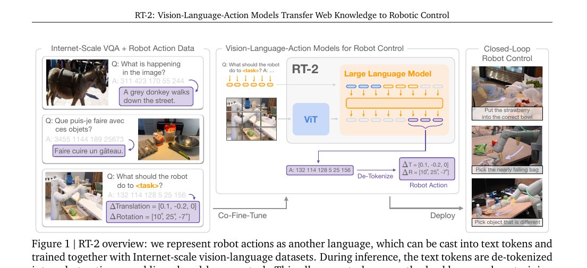
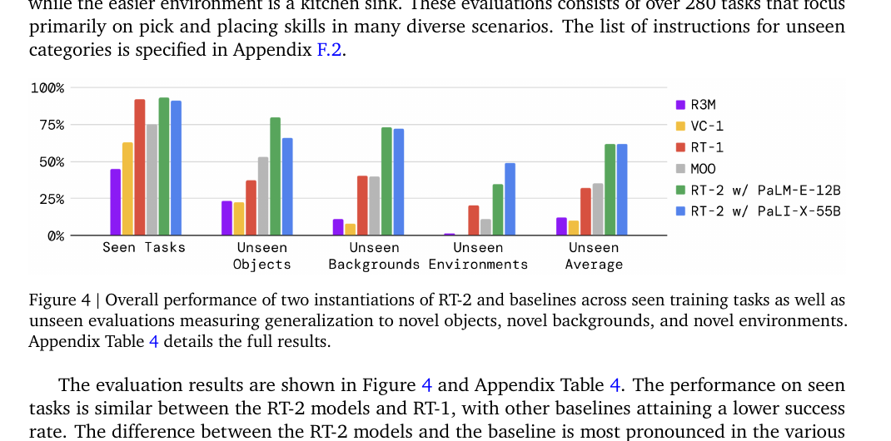
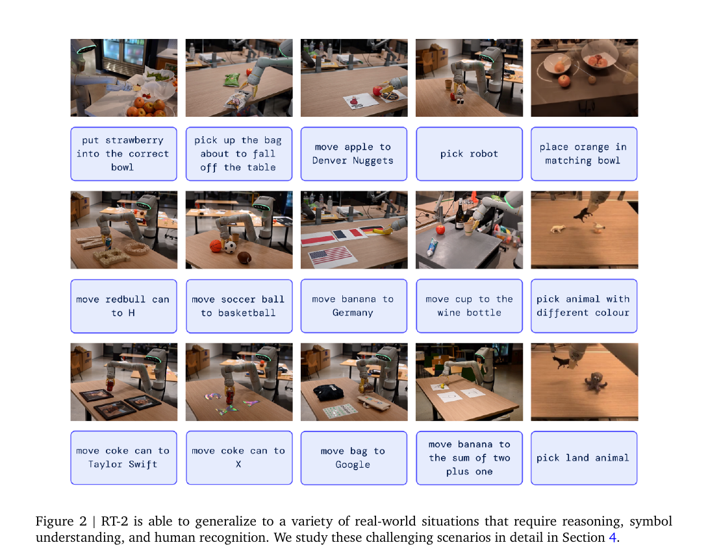
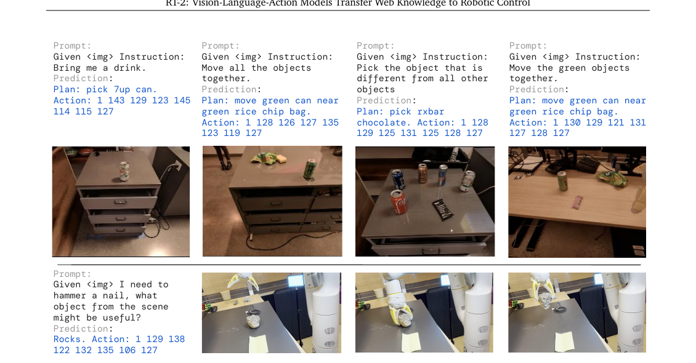

# [RT-2: Vision-Language-Action Models Transfer Web Knowledge to Robotic Control](https://arxiv.org/abs/2307.15818)

## Convenient Links
* [Paper (arXiv)](https://arxiv.org/abs/2307.15818)
* [Project Page](https://robotics-transformer2.github.io/)
* [RT-1 note in this repo](./RT_1.md)

## 1. One-Sentence Summary

RT-2 turns low-level robot actions into **text tokens**, then **co-fine-tunes a large pre-trained vision-language model** on both **robot trajectories** and **web-scale vision-language data**, so the resulting policy can keep robot motor skills while inheriting part of the semantic understanding and reasoning ability of Internet-scale VLMs.

## 2. Why RT-2 Matters

RT-1 already showed that large-scale real-robot behavior cloning can produce a strong multi-task policy. RT-2 asks the next question:

> Can we directly transfer the semantic knowledge of large vision-language models into low-level robot control?

Its importance is not just "a bigger RT-1". RT-2 makes three conceptual moves:

1. **It removes the action-head boundary between language and control**
   * instead of attaching a custom continuous-control head to a VLM, it expresses robot actions as language-like tokens
2. **It keeps the original web task distribution during robot fine-tuning**
   * this is the paper's key co-fine-tuning recipe
3. **It treats emergent semantic generalization as a first-class robotics metric**
   * not only unseen objects, but also symbols, logos, multilingual commands, and simple reasoning

From today's perspective, RT-2 is one of the clearest early demonstrations of the **VLA (Vision-Language-Action)** paradigm.

## 3. Core Idea: Treat Robot Actions as Another Language

The central idea of RT-2 is surprisingly simple:

```text
image + instruction -> VLM -> text tokens -> de-tokenize -> robot action
```

Instead of designing a separate action output space, RT-2 reuses the **existing token prediction interface** of a VLM.

Let the robot action at step `t` be:

$$
a_t =
\left[
\tau_t,\;
\Delta p_t^x,\Delta p_t^y,\Delta p_t^z,\;
\Delta r_t^x,\Delta r_t^y,\Delta r_t^z,\;
g_t
\right]
$$

where:

* $`\tau_t`$ is a discrete termination command
* $`\Delta p_t`$ is Cartesian end-effector displacement
* $`\Delta r_t`$ is rotational displacement
* $`g_t`$ is gripper extension

All continuous dimensions are discretized into bins, mapped to tokens, and emitted just like ordinary text.

This is what lets RT-2 share one backbone across:

* captioning / VQA-style web tasks
* language-conditioned robotic control

without introducing an action-only decoder head.

## 4. Problem Setup and Training Objective

The paper is mostly a systems-and-experiments paper, so it does not write the full VLA objective in one compact mathematical block. The equations below are a concise restatement of the training procedure described in the paper.

At control step `t`, the policy receives:

* a language instruction `i`
* one or more images `x_t`

and outputs an action-token sequence:

$$
y_t = [y_{t,1}, y_{t,2}, \dots, y_{t,K}]
$$

where `y_t` is the tokenized form of the robot action.

### 4.1 Autoregressive Action-Token Modeling

RT-2 uses the standard next-token factorization:

$$
p_\theta(y_t \mid x_t, i)
=
\prod_{k=1}^{K}
p_\theta\!\left(y_{t,k} \mid x_t, i, y_{t,<k}\right)
$$

For robot data, the behavior-cloning loss is therefore:

$$
\mathcal{L}_{\text{robot}}(\theta)
=
- \sum_t \sum_{k=1}^{K}
\log
p_\theta\!\left(
y_{t,k}^{*} \mid x_t, i, y_{t,<k}^{*}
\right)
$$

This is just **language-model next-token prediction**, except the target tokens encode a robot action.

### 4.2 Action Discretization

For each continuous action dimension $`a_t^{(m)}`$, RT-2 discretizes it uniformly into 256 bins:

$$
\hat{a}_t^{(m)} = \operatorname{bin}\!\left(a_t^{(m)}\right),
\qquad
\hat{a}_t^{(m)} \in \{0,1,\dots,255\}
$$

The final robot action is represented as a token sequence:

$$
y_t =
\left[
\tau_t,\;
\hat{\Delta p}_t^x,\hat{\Delta p}_t^y,\hat{\Delta p}_t^z,\;
\hat{\Delta r}_t^x,\hat{\Delta r}_t^y,\hat{\Delta r}_t^z,\;
\hat{g}_t
\right]
$$

The key point is that **the model predicts a short string of action tokens instead of a continuous vector**.

### 4.3 Co-Fine-Tuning with Web Data

The paper's most important training detail is that RT-2 is **not** naively fine-tuned only on robot data. Instead, it is co-fine-tuned on:

* robot action data
* the original web-scale vision-language data

Conceptually, this can be written as:

$$
\mathcal{L}(\theta)
=
\lambda_{\text{robot}} \mathcal{L}_{\text{robot}}
+
\lambda_{\text{web}} \mathcal{L}_{\text{web}}
$$

In practice, the paper describes this as **mixed-batch co-fine-tuning with increased robot sampling weight**, rather than explicitly presenting a weighted analytic loss.

This matters because it helps the model preserve the semantic concepts learned during pretraining instead of forgetting them during robot fine-tuning.

## 5. High-Level Pipeline



*Figure adapted from the paper: RT-2 casts robot actions into text tokens and trains them jointly with Internet-scale VLM data.*

The overall flow is:

```text
instruction + image
-> pre-trained VLM backbone
-> autoregressive token prediction
-> output constrained to valid robot-action tokens
-> de-tokenize tokens into Cartesian / rotation / gripper action
-> closed-loop robot control
```

Compared with RT-1, the biggest conceptual simplification is that the policy interface is now the same as the VLM interface:

```text
{vision, text} -> {tokens}
```

RT-2 just makes some of those tokens represent actions.

## 6. Architecture Details

### 6.1 Two RT-2 Instantiations

The paper studies two VLM backbones:

1. **RT-2-PaLI-X**
2. **RT-2-PaLM-E**

They are both VLA models, but they inherit different backbone structures.

### RT-2-PaLI-X

Appendix D describes PaLI-X as:

* a **ViT-22B** image tower
* image tokens projected into
* a **UL2-like encoder-decoder** language backbone of about **32B** parameters and **50 layers**

The paper evaluates **5B** and **55B** PaLI-X based RT-2 variants.

### RT-2-PaLM-E

Appendix D describes the used PaLM-E variant as:

* a **ViT-4B** visual model
* projected into the language token space
* a **decoder-only** PaLM-E language model

The main evaluated PaLM-E-based RT-2 variant is **12B**.

### 6.2 The Key Architectural Decision

RT-2 does **not** add a custom continuous-control prediction head on top of the VLM.

Instead:

* images and text are processed by the existing VLM backbone
* robot actions are written as output tokens
* the same token-prediction machinery is reused

This means RT-2 is much closer to:

```text
VLM repurposed for acting
```

than to:

```text
robot policy with a VLM feature extractor attached
```

This distinction is one of the paper's main points.

### 6.3 Action Tokenization Details

The paper uses the RT-1-style discretization protocol, but adapts it to each model's tokenizer.

### PaLI-X case

For PaLI-X, integers up to `1000` already have dedicated tokens, so action bins can be mapped directly to numeric tokens.

### PaLM-E case

For PaLM-E, the tokenizer does not provide the same convenient numeric tokenization. The paper therefore **overwrites the 256 least frequently used tokens** and repurposes them as the action vocabulary.

This is effectively a form of **symbol tuning**:

* the model keeps its original language-token interface
* a subset of token IDs is reassigned to robot-action semantics

### 6.4 Output Constraint at Inference Time

A standard VLM can emit arbitrary language tokens. A robot policy cannot.

So when RT-2 is prompted with a robot-action task, decoding is constrained to the set of **valid action tokens**:

$$
\mathcal{V}_{\text{decode}} = \mathcal{V}_{\text{action}}
$$

rather than the full text vocabulary:

$$
\mathcal{V}_{\text{decode}} = \mathcal{V}_{\text{full}}
$$

for ordinary language tasks.

This is a small but critical safety/validity detail:

* it avoids invalid control outputs
* it keeps the model usable as a real robot controller

### 6.5 Real-Time Inference

RT-2 is much larger than RT-1, so deployment becomes a systems problem.

The paper reports:

* **55B RT-2-PaLI-X**: about **1-3 Hz**
* **5B RT-2-PaLI-X**: about **5 Hz**

The deployment solution is to run RT-2 through a **multi-TPU cloud service** and query it over the network from the robot.

This is important because RT-2 is not merely a training result. The paper explicitly shows that such a large VLA can still be used in **closed-loop control**.

## 7. Training Data and Evaluation Setup

RT-2 uses:

* **web-scale VLM data** from PaLI-X / PaLM-E pretraining
* **robot trajectory data** from RT-1

The robot data comes from:

* **13 robots**
* **17 months** of collection
* an office-kitchen-like environment

The paper reports about **6,000 robotic evaluation trials**.

The evaluation covers:

1. **Seen tasks**
2. **Generalization to unseen objects**
3. **Generalization to unseen backgrounds**
4. **Generalization to unseen environments**
5. **Emergent semantic capabilities**
6. **Ablations on model size and training recipe**
7. **Chain-of-thought prompting**

This is one reason the paper was influential: it does not stop at "does imitation learning still work?", but asks whether web-scale pretraining changes what the robot can generalize to.

## 8. Main Results

### 8.1 Overall Generalization Results



*Figure adapted from the paper: RT-2 stays competitive on seen tasks and gains a large advantage on unseen generalization.*

Appendix Table 4 gives the clearest quantitative summary:

| Model | Seen Tasks | Unseen Average |
|:---|:---:|:---:|
| R3M | 45 | 12 |
| VC-1 | 63 | 10 |
| RT-1 | 92 | 32 |
| MOO | 75 | 35 |
| RT-2-PaLI-X-55B | 91 | 62 |
| RT-2-PaLM-E-12B | 93 | 62 |

Two observations matter:

1. **RT-2 does not sacrifice seen-task performance**
   * it stays roughly on par with RT-1
2. **RT-2 strongly improves unseen-task generalization**
   * roughly **2x** the unseen average of RT-1

This supports the paper's main thesis:

> web-pretrained vision-language knowledge helps the robot handle novel semantics and novel visual conditions.

### 8.2 Emergent Capabilities



*Figure adapted from the paper: RT-2 shows symbol understanding, semantic grounding, and simple reasoning behaviors that were not explicitly present in the robot data.*

The paper splits emergent capabilities into three broad families:

1. **Symbol understanding**
   * e.g. place an object near a number, letter, icon, or logo
2. **Reasoning**
   * e.g. same color, different color, math-based target selection, multilingual commands
3. **Human recognition**
   * e.g. move an object to the person with glasses

Appendix Table 5 reports:

| Model | Symbol Avg | Reasoning Avg | Person Avg | Overall Avg |
|:---|:---:|:---:|:---:|:---:|
| VC-1 | 11 | 10 | 13 | 11 |
| RT-1 | 16 | 16 | 20 | 17 |
| RT-2-PaLI-X-55B | 82 | 46 | 53 | 60 |
| RT-2-PaLM-E-12B | 36 | 43 | 43 | 40 |

This is the part of the paper that made RT-2 especially notable. It is not just more robust to clutter or novel objects; it also starts to exploit web-scale semantic knowledge in robotic contexts.

### 8.3 Why Co-Fine-Tuning Matters

The ablation results in Appendix Table 6 show three strong trends:

1. **Training from scratch is poor**
   * a 5B model trained from scratch gets only **9** unseen average
2. **Fine-tuning beats scratch**
   * 5B fine-tuning reaches **42**
3. **Co-fine-tuning beats fine-tuning**
   * 5B co-fine-tuning reaches **44**
   * 55B co-fine-tuning reaches **63**

This tells you that RT-2 is not "just a large behavior-cloning model". Its gains depend on:

* starting from a strong web-pretrained VLM
* preserving that web knowledge during robot fine-tuning

### 8.4 Language Table Transfer

The paper also evaluates a smaller **RT-2-PaLI-3B** on the open-source **Language Table** environment.

Reported success:

| Model | Language Table |
|:---|:---:|
| BC-Zero | `72 +- 3` |
| RT-1 | `74 +- 13` |
| LAVA | `77 +- 4` |
| RT-2-PaLI-3B | `90 +- 10` |

This matters because it shows the method is not restricted to one robot benchmark or one exact embodiment.

### 8.5 Chain-of-Thought Variant



*Figure adapted from the paper: a chain-of-thought variant lets RT-2 emit a natural-language plan before the action tokens.*

The paper explores a simple but interesting extension:

```text
Instruction: ...
Plan: ...
Action: <action tokens>
```

Instead of predicting only action tokens, the model first generates a short natural-language plan, then the robot action.

This can still be trained with the same autoregressive objective:

$$
\mathcal{L}_{\text{CoT}}
=
- \sum_t \sum_{k}
\log p_\theta(z_{t,k}^{*} \mid x_t, i, z_{t,<k}^{*})
$$

where `z_t` now contains both:

* plan tokens
* action tokens

The paper reports qualitative improvements on prompts such as:

* "Bring me a drink."
* "Pick the object that is different from all other objects."
* "I need to hammer a nail, what object from the scene might be useful?"

This is an early hint that **high-level reasoning and low-level control may be merged into one VLA model**, rather than split into separate planner and controller modules.

## 9. Why RT-2 Works

RT-2 works because it combines four ingredients that reinforce each other:

1. **Robot data provides grounded motor behavior**
   * how to move, grasp, place, terminate
2. **Web-scale VLM pretraining provides semantic priors**
   * what logos, symbols, foods, colors, and people are
3. **Shared token space forces the model into one unified interface**
   * no separate action head means less modular separation between "language understanding" and "acting"
4. **Co-fine-tuning reduces catastrophic forgetting**
   * the model keeps using web knowledge while learning robot control

The paper's real contribution is not merely that "bigger models help". It is that **the format of the action interface** makes direct transfer from VLM pretraining possible.

## 10. RT-1 vs RT-2

| Aspect | RT-1 | RT-2 |
|:---|:---|:---|
| Core policy type | Robot policy built from a custom visuomotor architecture | Large VLM repurposed into a VLA |
| Vision-language fusion | FiLM-conditioned visual tokenizer | Native VLM multimodal backbone |
| Output space | Discretized robot action heads | Text-token action sequence |
| Main training source | Robot data | Robot data + web-scale VLM data |
| Main strength | Real-time multi-task robot control | Stronger semantic generalization and emergent reasoning |
| Typical scale | ~35M | 5B / 12B / 55B class |

The shortest possible comparison is:

* **RT-1** asks how to scale robot imitation learning
* **RT-2** asks how to transfer web-scale VLM knowledge into robot control

## 11. Limitations

The paper is explicit that RT-2 does **not** magically gain new physical skills from web data alone.

Reported limitations include:

1. **No new motor primitives from web pretraining alone**
   * semantics transfer better than manipulation skill
2. **Weakness on precise or dexterous tasks**
   * e.g. folding towels
3. **Weakness on tool use or part-specific grasping**
   * e.g. grasping a handle in a targeted way
4. **Limited multi-layer reasoning**
   * chain-of-thought helps, but the capability is still shallow
5. **High deployment cost**
   * large VLA models can be a bottleneck for high-frequency control

So the right mental model is not:

> RT-2 makes robots generally intelligent.

It is closer to:

> RT-2 gives robot policies a significantly richer semantic prior, while physical skill remains bounded by robot data.

## 12. Final Takeaways

RT-2 is one of the clearest papers for understanding the VLA idea because its recipe is so simple:

```text
keep the VLM
+ turn actions into tokens
+ co-fine-tune on robot data and web data
= a robot policy with stronger semantic generalization
```

If you only remember a few points, remember these:

1. **Actions are represented as tokens, not a custom action head**
2. **Co-fine-tuning with web data is essential**
3. **Generalization gains show up most clearly on unseen semantics, not seen tasks**
4. **RT-2 is an early but important bridge from VLMs to VLAs**
