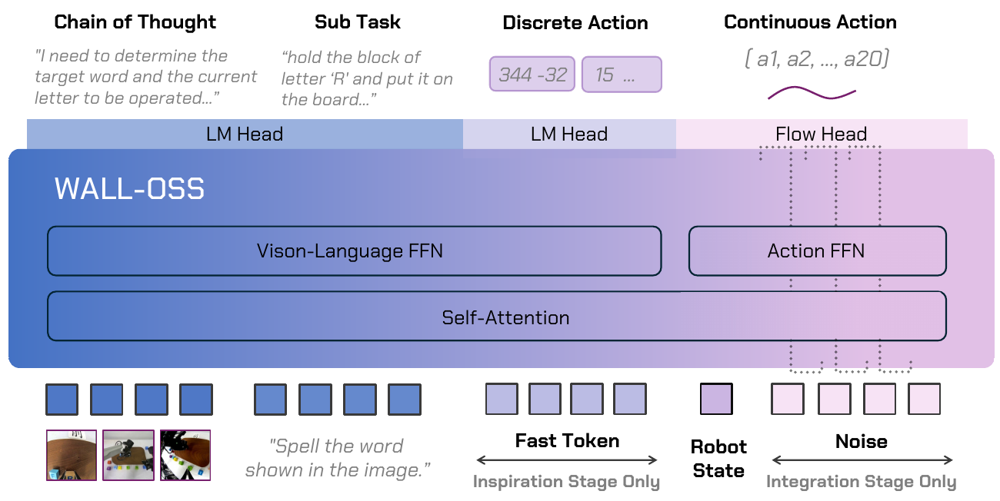
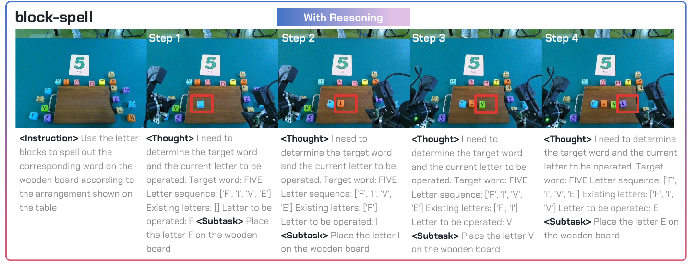
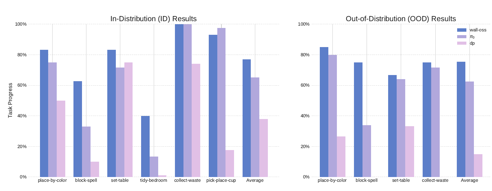

# WALL-OSS: Igniting VLMs toward the Embodied Space

> **Brief:** WALL-OSS adapts Qwen2.5-VL-3B into a vision-language-action model using shared self-attention, separate vision-language and action FFNs, and a curriculum from embodied VQA and discrete FAST actions to continuous flow-matching control. Its Unified Cross-Level CoT connects instructions, reasoning, subtask plans, and robot actions within one model.

**Reference:** Andy Zhai et al., X Square Robot, *Igniting VLMs toward the Embodied Space*, 2025. This note follows the supplied **arXiv v1 PDF**, whose cover is dated September 8, 2025 and whose arXiv submission is dated September 15, 2025.

## Convenient Links

* [Paper, arXiv v1](https://arxiv.org/abs/2509.11766v1)
* [Official code, linked as wall-x in the paper](https://github.com/X-Square-Robot/wall-x)
* [Project page](https://x2robot.com/en/research/68bc2cde8497d7f238dde690)
* [pi0 note](./Pi_0.md)
* [pi0-FAST note](./Pi_0_FAST.md)
* [pi0.5 note](./Pi_0_5.md)
* [Hi Robot note](./Pi_Hi_Robot.md)

## 1. What Problem It Addresses

A pretrained VLM can understand ordinary images and instructions without knowing how to execute them on a robot. The paper identifies three gaps:

| Gap | Why it matters | WALL-OSS response |
|:--|:--|:--|
| Modalities and data scale | Continuous, high-frequency actions have much less aligned training data than image-text pairs | First learn discrete action tokens; use intermediate reasoning and subtasks to connect language to control |
| Pretraining distribution | Robot cameras contain egocentric views, unusual optics, arm occlusions, and task stages poorly covered by web images | Co-train on general and embodied VQA, including localization and progress understanding |
| Training objectives | Next-token prediction and continuous action generation impose different optimization demands | Introduce continuous control gradually with task-specific FFNs and shared attention |

The aim is to improve embodied understanding while learning actions, rather than merely preserving the initial VLM unchanged. The authors attribute weak instruction following in some VLA designs to insufficient coupling between semantics and control; the experiments support the overall recipe more directly than they isolate this architectural explanation.

## 2. Policy Architecture



*Shared self-attention connects visual, language, robot-state, and action representations. Vision-language and action FFNs specialize the processing after attention. Cropped from paper Figure 3, p. 4.*

| Component | Role |
|:--|:--|
| Qwen2.5-VL-3B backbone | Initializes visual-language understanding |
| Shared self-attention | Exchanges information across modalities within the transformer |
| Vision-Language FFN | Handles VQA, reasoning/subtask text, and discrete action modeling |
| Action FFN and flow head | Process action features and predict the continuous denoising field |
| Static router | Directs features to the appropriate FFN by their role |

The paper calls this a **tightly coupled MoE**. Here, MoE does not mean a learned top-$k$ router that dynamically chooses among many interchangeable experts. The routing is static: vision-language features and action-centric features use different FFNs while sharing attention.

Inputs include camera views and an instruction; the architecture also shows robot state and, during continuous-action training, noisy action inputs. The main formalism abbreviates the visual-language conditioning as

$$
c=(\text{vision},\text{instruction}),\qquad h=F_\theta(c).
$$

This abbreviation is not a complete specification of every input token. The PDF does not detail the state tokenizer, all attention masks, the action dimension, or the total parameter count after adding the action branch. The backbone's `3B` designation should not be treated as the exact total VLA size.

## 3. Training Stages at a Glance

```text
Pretrained Qwen2.5-VL-3B
  -> Inspiration: embodied/general VQA + discrete FAST action prediction
  -> Integration phase 1: freeze the VLM; fit the continuous action branch
  -> Integration phase 2: jointly optimize VLM and continuous action branch
  -> Task-specific fine-tuning, where used in the experiments
  -> Optional reasoning/subtask generation + continuous actions
```

The authors call both **Inspiration** and **Integration** parts of their VLA pretraining. The later task-specific fine-tuning is separate. Integration should therefore not be confused with the fine-tuning on the six scored manipulation tasks.

| Stage | Action representation | Optimization described in the PDF |
|:--|:--|:--|
| Inspiration | Discrete FAST tokens | Adapt the original VLM with VQA and action-token supervision |
| Integration, phase 1 | Continuous actions | Hold the VLM fixed and train the flow/action branch |
| Integration, phase 2 | Continuous actions | Unfreeze the VLM and jointly optimize with the action branch |
| Task fine-tuning | Continuous actions plus applicable text/grounding targets | Adapt to demonstrations, with multimodal co-training for WALL-OSS |

Unlike the pi0.5 recipe described in the neighboring note, this PDF explicitly says that Integration **replaces discrete action prediction** with continuous action modeling. It does not establish a continued FAST loss throughout Integration.

## 4. Inspiration: Discrete Actions and Embodied VQA

### 4.1 FAST supplies action-token supervision

Let $A$ be a continuous action trajectory. FAST converts it into discrete tokens:

$$
z_{1:K}=\operatorname{FAST}(A),
\qquad
A\xrightarrow{\text{DCT}}\text{frequency coefficients}
\xrightarrow{\text{quantization}}\text{discrete symbols}
\xrightarrow{\text{BPE}}z_{1:K}.
$$

DCT means discrete cosine transform, and BPE means byte-pair encoding. These tokens let the VLM learn actions with the same next-token prediction machinery used for language. They are not text descriptions of actions; they encode the numerical trajectory.

### 4.2 Training objective

Using $y_t$ for a text target token and $z_k$ for an action token, the paper's explicit Inspiration objective is

$$
\mathcal L_{\mathrm{insp}}
=-\lambda_{\mathrm{VQA}}\sum_t\log p_\theta(y_t\mid y_{<t},c)
-\lambda_D\sum_k\log p_\theta(z_k\mid z_{<k},c).
$$

The two weights balance text/VQA and discrete action supervision across the data mixture. The applicable targets depend on the example: a VQA sample supplies a text answer, while an action trajectory supplies FAST tokens and may have reasoning or subtask annotations.

The intended result is a backbone that can identify relevant objects, reason about robot scenes, and associate instructions with trajectories before it must generate precise continuous control.

The prose also mentions masked language modeling, contrastive learning, and temporal/causal objectives, but the displayed loss only specifies token likelihoods. Their detailed implementations and weights are not provided in this PDF.

## 5. Integration: Continuous Flow-Matching Control

### 5.1 Noisy trajectories and the velocity target

Let $x_0$ be a clean action chunk and $\epsilon\sim\mathcal N(0,I)$ be Gaussian noise. The paper constructs

$$
x_t=(1-\rho(t))x_0+\rho(t)\epsilon
$$

and writes the continuous-action objective as

$$
\mathcal L_{\mathrm{int}}
=\lambda_C\mathbb E\left[
w(t)\left\|v_\phi(x_t,h,t)-(\epsilon-x_0)\right\|_2^2
\right].
$$

Here $v_\phi$ predicts the trajectory's velocity field, $w(t)$ weights noise levels, and $\lambda_C$ weights continuous-action learning. Flow time $t$ indexes noise level, not a physical robot timestep.

For the linear schedule $\rho(t)=t$, the target is exactly $dx_t/dt=\epsilon-x_0$. The path goes from data at $t=0$ to noise at $t=1$; generation starts from noise and integrates in the reverse direction toward $t=0$.

**Notation detail:** the PDF permits a general $\rho(t)$ but writes the linear-path target $\epsilon-x_0$. With a nonlinear schedule and velocity defined with respect to $t$, the derivative would be $\rho'(t)(\epsilon-x_0)$. The actual schedule and time parameterization must be specified to implement this consistently; the PDF does not give them.

### 5.2 Why freeze and then unfreeze?

During phase 1, the action branch learns to use the already adapted visual-language representation without changing the backbone:

$$
\frac{\partial\mathcal L_{\mathrm{int}}}{\partial\theta}=0,
\qquad
\frac{\partial\mathcal L_{\mathrm{int}}}{\partial\phi}\ne0.
$$

During phase 2, both parameter groups receive gradients:

$$
\frac{\partial\mathcal L_{\mathrm{int}}}{\partial\theta}\ne0,
\qquad
\frac{\partial\mathcal L_{\mathrm{int}}}{\partial\phi}\ne0.
$$

The first phase stabilizes the new control branch; the second lets action supervision adapt the shared multimodal representation. The backbone is not permanently frozen or insulated from the action loss.

## 6. Unified Cross-Level CoT

**Uni-CoT** expands reasoning beyond a textual explanation to a sequence of semantic and control levels:

```text
overall instruction -> reasoning -> subtask instruction -> continuous action
```

For example, spelling the answer to an image-card prompt requires identifying the answer, determining which letter comes next, grounding that letter block, and manipulating it. These are related prediction tasks trained within one model.



*The Block-Spell example links the inferred word and current progress to the next letter-placement subtask. Cropped from the bottom panel of paper Figure 6, p. 9.*

The model can include or bypass intermediate text. Renaming symbols to avoid confusion with the earlier conditioning variable, the paper's schematic objective is

$$
\min_\theta\mathbb E\left[
\ell_{\mathrm{act}}\big(F_\theta(v,\ell,C),A\big)
+\lambda\ell_{\mathrm{VQA}}\big(H_\theta(v,\ell),y\big)
\right],
$$

where $v$ denotes visual input, $\ell$ the instruction, $C$ optional reasoning, $A$ the target trajectory, and $y$ a VQA target. The paper calls this a **path-drop** objective: examples can train the full reasoning path or a direct instruction-to-action path. It does not specify a path-drop probability or a complete sampling algorithm.

The practical distinction from an external planner/controller pipeline is shared model training and representations. The paper's end-to-end terminology should not be interpreted as a specified method for differentiating through sampled discrete reasoning tokens; it provides text and action supervision, not such an estimator.

## 7. Data and Annotation

The data combines robot trajectories with general and embodied VQA. Figure 5 labels the overall mixture as:

| Source | Figure 5 share | Purpose and examples |
|:--|--:|:--|
| Self-collected robot actions | 57.5% | Daily manipulation, assembly, mobile and bimanual tasks |
| Open-source robot actions | 33.1% | Cross-platform experience from DROID, BC-Z, Bridge, Agibotworld, RH20T, and others |
| Multimodal VQA | 9.4% | General perception plus embodied localization, reasoning, and progress understanding |

These are the figure's corpus-composition percentages, not established per-stage sampling ratios or per-source hour counts. Section 4 says the corpus exceeds **10,000 hours**, while Section 4.4 uses the broader wording **tens of thousands of hours** without an exact reconciled breakdown.

### 7.1 Robot data normalization

The authors describe aligning heterogeneous datasets through:

* common coordinate frames and units: meters and radians;
* a shared DoF template with masks/placeholders for absent joints;
* multi-camera calibration, timestamp alignment, and video resampling;
* standardized action time bases and trajectory interpolation for flow matching.

The self-collected platforms include tabletop arms, mobile stands, wheeled bimanual systems, and wheeled humanoids. Quality control includes removing idle/low-quality frames, filtering outliers, synchronizing sensors, and human audits.

### 7.2 Embodied VQA provides task-specific semantics

General VQA maintains broad perception and language ability. Embodied VQA targets what robot trajectories need:

| Supervision | Example information |
|:--|:--|
| Action planning | What subgoal should come next? |
| Spatial and temporal QA | Object location, event order, task progress |
| Perception | Object attributes and scene description |
| Cognition and affordance | Whether and how an object can be interacted with |

A multi-model annotation pipeline produces fine-grained trajectory labels with human spot checks. Targets include natural language and structured boxes or points, such as `<box>[x1,y1,x2,y2]</box>`. Splits are stratified by scene, object, task, and morphology; rare skills and long trajectories receive additional sampling emphasis.

## 8. Fine-Tuning and Runtime Inference

### 8.1 Fine-tuning supervision

For the downstream comparisons, all policies receive the same task supervision, but their initialization and training objectives differ. WALL-OSS additionally interleaves action training with VQA and semantic targets.

The paper reports interleaving ratios of **1:15 for non-subtask VQA** and **1:100 for subtask samples**. It separately states that only about **1%** of training data carries subtask labels for the long-horizon experiments, and **1% of frames** carries reasoning/sub-instruction supervision in the reasoning experiments. These are sparse semantic labels alongside robot-action demonstrations, not only 1% of the total action data.

### 8.2 Runtime behavior

The experimentally described full path is:

1. Read the scene and overall instruction.
2. Generate reasoning when needed and predict a subtask instruction.
3. Condition continuous action generation on that semantic context and current observation/state.
4. Execute actions and use updated observations to determine subsequent subtasks.

The paper also describes direct instruction-to-action prediction and interleaving reasoning with execution. It does not report enough scheduling or timing detail to infer a particular real-time chunking algorithm, control frequency, number of flow steps, or measured reasoning latency. The illustrative `a1, ..., a20` in the architecture figure is not a documented universal deployment horizon.

## 9. Evaluation Protocol

The evaluation consists of an in-house Embodied VQA benchmark and **six fine-tuned manipulation tasks**, plus a separate **zero-shot instruction-pick-place** test:

| Task | Main capability | Fine-tuning episodes | Pretraining/task distinction |
|:--|:--|--:|:--|
| Instruction-pick-place | Follow varied object/container descriptions | None | Evaluated without task-specific fine-tuning |
| Place-by-color | Match visual colors or interpret printed color words | 500 | Task excluded from pretraining |
| Block-spell | Infer an answer, then manipulate letter blocks in sequence | 1,600 | Fine-tuned reasoning task |
| Set-table | Arrange two table settings through multiple stages | 1,500 | Task excluded from pretraining |
| Tidy-bedroom | Collect clothes and arrange pillows | 1,000 | Task excluded from pretraining |
| Collect-waste | Mobile manipulation and precise disposal | 900 | Fine-tuned; also evaluated in a novel environment |
| Pick-place-cup | Reorient cup/plate and complete placement | 500 | Fine-tuned manipulation task |

The Collect-Waste count above follows Section 5.1.1; Section 5.2.3 instead says **1,000 demonstrations**. The PDF does not resolve this discrepancy. It also uses Pick-Up-Waste for the same task in its task figure.

**Unseen during pretraining does not mean zero-shot at evaluation:** Set-Table, Tidy-Bedroom, and Place-by-Color receive the fine-tuning episodes shown above.

### 9.1 Baselines and metrics

The baselines are **pi0** and **Diffusion Policy**. In this evaluation, pi0 uses pretrained VLM weights, while Diffusion Policy trains from scratch. Two instruction settings are considered:

* **Flat:** a high-level instruction directly conditions the policy.
* **GPT4-Subtask:** human-annotated subtasks are used in training and GPT-4 generates subtasks at inference.

For Block-Spell, flat baselines have near-zero progress, so Figure 7 reports the stronger GPT-subtask baseline setting. The figure is therefore not uniformly a comparison against flat policies.

Manipulation assessments use third-party evaluators blinded to model version, with prescribed environments, initial conditions, and scoring rubrics. Figure 7 reports **task progress**, which can give partial credit; this should not automatically be read as binary episode success. VQA is manually evaluated on sampled frames from the authors' robot data.

## 10. Main Results

### 10.1 Embodied understanding after pretraining

Paper Table 2 compares WALL-OSS with its original backbone:

| Model | Object grounding | Scene captioning | Action planning |
|:--|--:|--:|--:|
| Qwen2.5-VL-3B | 46.1% | 57.7% | 59.8% |
| WALL-OSS | **91.6%** | **87.6%** | **69.0%** |

The largest gain is object grounding: **45.5 percentage points**. The result supports improved robot-scene understanding; it does not measure retention of every general-purpose VLM capability. The authors still observe mistakes in identifying the current task stage.

### 10.2 Zero-shot instruction following

Without instruction-pick-place fine-tuning, Section 5.2.2 reports average task progress of:

| Instruction targets | Task progress |
|:--|--:|
| Objects and containers seen in pretraining | 85% |
| Novel objects and containers | 61% |

The authors attribute many novel-object failures to grasp/place pose errors rather than incorrect semantic target selection. These numbers are stated in the text; despite its local reference to Figure 7, that figure shows the other manipulation tasks.

### 10.3 Fine-tuned manipulation



*Task progress after task-specific fine-tuning. ID covers six tasks; OOD covers four, so their averages summarize different task sets. Cropped from paper Figure 7, p. 11.*

Approximate average bar heights are:

| Evaluation | WALL-OSS | pi0 | Diffusion Policy |
|:--|--:|--:|--:|
| ID, six tasks | about 78% | about 65% | about 38% |
| OOD, four tasks | about 75% | about 62% | about 15% |

These rounded readings are task-progress values, not a separately tabulated success-rate result. The OOD tasks are Place-by-Color, Block-Spell, Set-Table, and Collect-Waste.

WALL-OSS has a substantial advantage on reasoning and long-horizon tasks, while both VLM-initialized policies perform strongly on simpler action tasks. For example, the text reports 100% ID success for both WALL-OSS and pi0 on Collect-Waste and above 90% on Pick-Place-Cup. Some percentages in that discussion differ from the task-progress bars; keep the text's success statements separate from Figure 7's metric.

Set-Table and Tidy-Bedroom involve more than five stages, with reported average durations exceeding three and five minutes respectively. The qualitative failure analysis emphasizes repeated actions and stage confusion in baselines, even when individual grasping actions work. Subtask generation supplies an explicit indication of what remains to be done.

## 11. What the Ablation Shows

Paper Table 3 measures selecting the correct block under a precise instruction, rather than completing the entire spelling task:

| Block type | WALL-OSS, multimodal co-training | WALL-OSS, action-only | pi0, action-only |
|:--|--:|--:|--:|
| Letter | **87%** | 26% | 9% |
| Number | **95%** | 80% | 35% |

The multimodal configuration jointly trains actions, reasoning/subtasks, and 2D referring-expression grounding. The action-only WALL-OSS variant uses subtask instructions but optimizes action generation only.

Two conclusions follow from this comparison:

* Continuing multimodal co-training improves fine-grained instruction following, especially letter selection.
* WALL-OSS retains an advantage over pi0 even in action-only fine-tuning, consistent with benefits from its preceding training and model design.

This is a bundled ablation: it does not separately identify the causal contribution of reasoning, subtask prediction, grounding, static routing, or shared attention. Similarly, the paper observes little reasoning benefit for direct visual color matching, with larger gains when printed words or inferred answers determine the action.

## 12. Interpretation and Reporting Limits

The central lesson is a **curriculum for transferring semantics into control**: embodied VQA teaches the backbone what to recognize and reason about, discrete action prediction connects those semantics to trajectories, and continuous joint training turns that representation into executable motion.

The evidence is strongest for improved embodied VQA, fine-grained instruction following under multimodal co-training, and task progress on the authors' real-robot tasks. Broader claims of universal generalization or a uniquely superior coupling mechanism go beyond the reported comparisons.

The supplied PDF leaves several reproduction details unspecified:

* optimizer, learning rates, batch sizes, training steps, and compute budget;
* exact loss weights, path-drop schedule, and per-stage data sampling;
* action/state dimensions, tokenizer settings, and complete attention masks;
* flow sampler, deployment horizon, control rate, and inference latency;
* evaluation trial counts, detailed scoring thresholds, and statistical uncertainty.

The code link is useful for implementation follow-up, but its later contents should not be silently treated as the configuration behind this v1 paper's results.

## 13. Key Takeaways

* WALL-OSS uses **shared attention with statically routed FFNs**, not a conventional learned top-$k$ MoE.
* Inspiration learns embodied semantics and discrete actions; Integration trains continuous control, first with a frozen VLM and then jointly.
* Uni-CoT permits reasoning and subtask outputs but does not require a fixed full textual chain for every action.
* The long-horizon results involve task-specific fine-tuning; the separate instruction-pick-place test is zero-shot with respect to that fine-tuning.
* The clearest ablation is the gain from maintaining multimodal supervision during fine-tuning, especially for selecting the correct letter block.
