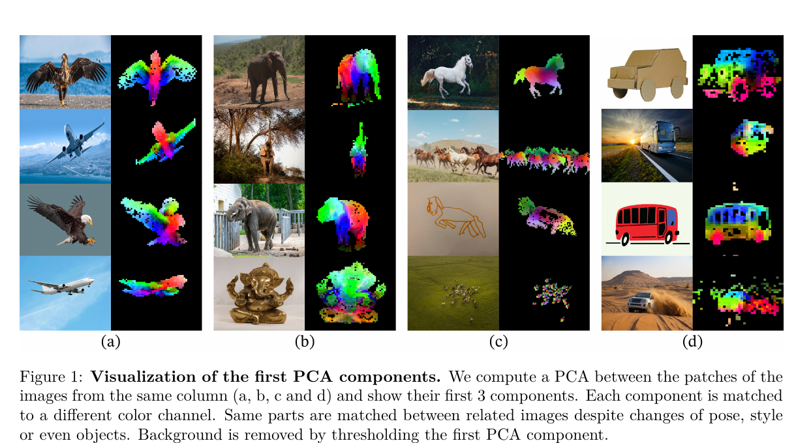
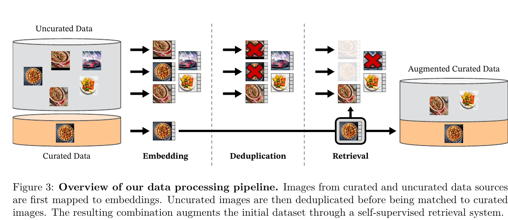
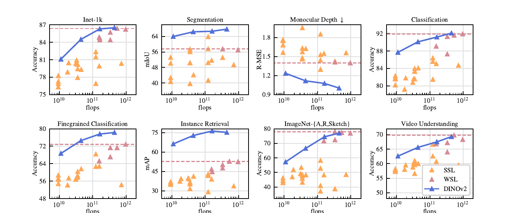
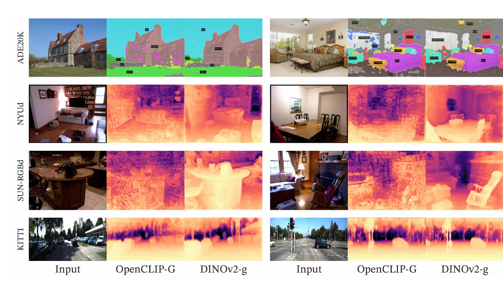

# [DINOv2](https://arxiv.org/abs/2304.07193)

> **Brief:** **Self-supervised vision foundation model:** DINOv2 combines DINO image-level learning, iBOT masked-patch learning, KoLeo feature regularization, and curated image-only pretraining to produce strong frozen global and dense visual features.

**DINOv2** (*Learning Robust Visual Features without Supervision*, Oquab et al., 2024) is an image-only Vision Transformer family trained without labels or captions. It is stored with the vision-language model notes because it is commonly used as the **vision encoder** inside multimodal systems, but DINOv2 itself is **not a vision-language model**: it has no text encoder and does not align images with language.

## Convenient Links

- [Paper](https://arxiv.org/abs/2304.07193)
- [Official code and pretrained models](https://github.com/facebookresearch/dinov2)
- Related notes: [CLIP](./CLIP.md), [SigLIP](./SigLIP.md)

## 1. Core Goal

The paper asks whether a single image encoder can provide reusable visual features for many tasks without labels, captions, or task-specific backbone fine-tuning.

DINOv2 focuses on three ingredients:

1. **Data:** construct the curated and diverse **LVD-142M** image dataset.
2. **Objective:** combine global image discrimination with local masked-patch prediction.
3. **Scale:** train a 1.1B-parameter ViT-g teacher efficiently, then distill it into smaller models.

The resulting frozen backbone supports:

- global tasks through the class token, such as classification and retrieval;
- dense tasks through patch tokens, such as segmentation and depth estimation;
- lightweight adaptation using k-NN, a linear probe, or a task head.

## 2. What the Encoder Produces

For an input image $x$, a ViT with patch size $14$ produces

$$
f_\theta(x) = [z_{\mathrm{CLS}}, z_1, z_2, \ldots, z_P],
$$

where:

- $z_{\mathrm{CLS}}$ is a global image representation;
- $z_i$ is the representation of patch $i$;
- $P$ depends on the input resolution.

The two output types serve different downstream interfaces:

| Feature | Captures | Typical use |
|---|---|---|
| Class token | Whole-image semantics | classification, retrieval, video frame pooling |
| Patch tokens | Spatially localized structure | segmentation, depth, correspondence, detection heads |

The patch features develop object-part correspondence without pixel labels. In the paper's PCA visualization below, similar object parts receive similar colors across changes in viewpoint, style, and even object category.

*Paper Figure 1. The first three PCA components of patch features reveal aligned semantic parts and foreground-background separation.*

## 3. LVD-142M Data Curation

Simply scaling raw web images is not enough. The paper finds that a curated 142M-image set gives substantially better transfer than an equally sized random sample from the same source.

*Paper Figure 3. Curated images act as queries that retrieve visually related images from a large uncurated pool.*

### 3.1 Data sources

The pipeline starts from:

- **curated seeds:** ImageNet-22k, ImageNet-1k train, Google Landmarks, and datasets covering fine-grained recognition, segmentation, depth, and retrieval;
- **uncurated pool:** images downloaded from a public repository of crawled web pages.

The raw pool is filtered by unsafe or restricted domains, PCA-hash deduplication, NSFW filtering, and identifiable-face blurring. This leaves **1.2B unique images**.

### 3.2 Deduplication

Near-duplicate images are removed to improve diversity. The authors also remove near-duplicates of validation and test images from all benchmarks used in the paper to reduce evaluation leakage.

### 3.3 Self-supervised retrieval

A self-supervised ViT-H/16 trained on ImageNet-22k maps both curated and uncurated images into an embedding space. Retrieval uses cosine similarity:

$$
\operatorname{sim}(q, x) =
\frac{f(q)^\top f(x)}{\lVert f(q) \rVert_2\lVert f(x) \rVert_2}.
$$

For a large seed dataset, the pipeline retrieves approximately four nearest neighbors for each query image. For a small seed dataset, it samples from matching k-means clusters and caps each retrieved subset to preserve dataset balance.

Faiss performs the GPU-accelerated indexing and search. The complete pipeline ran on 20 nodes with 8 V100-32GB GPUs per node and took less than two days.

### 3.4 Why curation matters

Selected ViT-g/14 ablation results are shown below. All compared models use the same number of training iterations and omit the final high-resolution stage.

| Pretraining data | ImageNet-1k | ImageNet-A | ADE20K | Oxford-M | iNat2018 | iNat2021 |
|---|---:|---:|---:|---:|---:|---:|
| Random uncurated 142M | 83.3 | 59.4 | **48.5** | 54.3 | 68.0 | 76.4 |
| LVD-142M | **85.8** | **73.9** | 47.7 | **64.6** | **82.3** | **86.4** |

The uncurated set is slightly better on this ADE20K setup, but LVD-142M is much stronger across classification, robustness, retrieval, and unseen natural-image domains.

## 4. Student-Teacher Training

DINOv2 uses a student network $f_{\theta_s}$ and a teacher network $f_{\theta_t}$ with the same architecture during training from scratch.

1. Generate multiple augmented crops of the same image.
2. Give global and local crops to the student; randomly mask patches in selected student views.
3. Give unmasked global views to the teacher.
4. Match teacher and student distributions at both class-token and patch-token levels.
5. Update the student with gradients.
6. Update the teacher as an exponential moving average (EMA) of the student:

$$
\theta_t \leftarrow m\theta_t + (1-m)\theta_s,
$$

where the momentum $m$ follows a cosine schedule from $0.994$ to $1$.

The teacher therefore supplies slowly changing targets without requiring labels or a separately pretrained model.

## 5. Image-Level DINO Objective

The student and teacher class tokens pass through separate DINO projection heads and become probability distributions over learned prototypes. For two views of the same image:

$$
\mathcal{L}_{\mathrm{DINO}}
= -\sum_k p_t^{(k)}\log p_s^{(k)}.
$$

The student learns to make different crops of the same image agree at the global semantic level. In practice, the loss is summed across compatible teacher-student view pairs.

The teacher output uses three iterations of **Sinkhorn-Knopp centering**, while the student output uses softmax normalization. This balances prototype assignments and helps avoid representational collapse.

## 6. Patch-Level iBOT Objective

The student receives masked patches, but the teacher sees the corresponding visible patches. For each masked patch index $i$:

$$
\mathcal{L}_{\mathrm{iBOT}}
= -\sum_{i \in \mathcal{M}}\sum_k
p_{t,i}^{(k)}\log p_{s,i}^{(k)},
$$

where $\mathcal{M}$ is the set of masked patch positions.

This forces the student to infer local content from context and is important for dense prediction. In the paper's ablation, adding masked image modeling improves ADE20K linear segmentation from **44.2 to 47.1 mIoU**.

DINOv2 uses **separate projection heads** for DINO and iBOT. Although the earlier iBOT recipe shared these heads, the authors find that untying them works better at scale.

## 7. KoLeo Feature Regularization

The KoLeo regularizer encourages class-token features to spread across the representation space. For L2-normalized features $x_1,\ldots,x_n$, define the nearest-neighbor distance

$$
d_{n,i} = \min_{j \ne i}\lVert x_i-x_j\rVert_2.
$$

The regularizer is

$$
\mathcal{L}_{\mathrm{KoLeo}}
= -\frac{1}{n}\sum_{i=1}^{n}\log d_{n,i}.
$$

Minimizing it discourages feature collapse and near-duplicate embeddings. The training recipe uses weight $\lambda_{\mathrm{KoLeo}}=0.1$:

$$
\mathcal{L}
= \mathcal{L}_{\mathrm{DINO}}
+ \mathcal{L}_{\mathrm{iBOT}}
+ 0.1\mathcal{L}_{\mathrm{KoLeo}}.
$$

Its clearest effect is instance retrieval: Oxford-M mAP rises from **55.6 to 63.9** in the paper's ablation, while ImageNet and segmentation remain stable.

## 8. Architecture and Model Family

All models use ViTs with $14\times14$ image patches.

| Model | Embedding dim. | Heads | Blocks | FFN | Training route |
|---|---:|---:|---:|---|---|
| DINOv2-S | 384 | 6 | 12 | MLP | distilled |
| DINOv2-B | 768 | 12 | 18 | MLP | distilled |
| DINOv2-L | 1024 | 16 | 24 | MLP | distilled or from scratch |
| DINOv2-g | 1536 | 24 | 40 | SwiGLU | from scratch |

The largest ViT-g backbone has **1.1B parameters**. Its 1536-dimensional embedding and 24 heads give 64 dimensions per head, which maps efficiently to GPU matrix kernels.

## 9. Efficient Large-Scale Training

The implementation is reported to be about **2x faster** and use only **one-third of the memory** of the reference iBOT implementation on the same hardware.

Key systems techniques are:

- **Memory-efficient attention:** a custom FlashAttention implementation reduces attention memory and runtime.
- **Sequence packing:** large and small crop token sequences are concatenated, with a block-diagonal attention mask preventing cross-image attention.
- **Efficient stochastic depth:** dropped residual branches are skipped instead of computed and then masked.
- **FSDP:** student, teacher, and AdamW optimizer states are sharded across GPUs.
- **Mixed precision:** backbone communication and training use float16; DINO-head gradient reductions stay in float32 for stability.

## 10. Training Recipe

All model variants train for **625k iterations** with AdamW.

| Setting | From-scratch ViT-L/g | Distilled ViT-S/B/L |
|---|---:|---:|
| Batch size | 3072 | 2048 |
| Base learning rate | $3.5\times10^{-4}$ | $1\times10^{-3}$ |
| Stochastic-depth rate | 0.4 | 0 |
| Weight decay | cosine, 0.04 $\rightarrow$ 0.2 | same |
| LR warmup | 100k iterations | same |
| Target network | EMA teacher, $m$: 0.994 $\rightarrow$ 1 | frozen ViT-g; separate student EMA |
| LayerScale initialization | $10^{-5}$ | $10^{-5}$ |
| Precision | float16, except selected head reductions | same |

### 10.1 High-resolution adaptation

After normal pretraining, the model trains for another **10k iterations at $518\times518$** resolution with compressed schedules and a lower base learning rate.

This is much cheaper than full high-resolution pretraining. The paper's controlled experiment shows that a short high-resolution phase approaches the dense-task quality of training at high resolution from the beginning, which costs about three times as much compute in that setup.

### 10.2 Distillation

Smaller models are distilled from a frozen ViT-g teacher instead of being trained only through EMA self-distillation:

- freeze the pretrained ViT-g teacher;
- train a smaller student against its outputs;
- keep a separate EMA copy of the student as the final model;
- remove masking and stochastic depth;
- apply the iBOT loss on the two global crops.

The distilled ViT-L outperforms a ViT-L trained from scratch on all 12 transfer benchmarks evaluated in the distillation ablation. This is why the released smaller variants inherit much of the large teacher's representation quality.

## 11. Evaluation Protocol

The paper primarily evaluates the **quality of frozen representations**, not the capacity of a fully fine-tuned network. Depending on the task, it places one of the following on top of the frozen backbone:

- k-nearest neighbors;
- logistic regression or a linear classifier;
- a linear dense-prediction head;
- a DPT depth decoder;
- a ViT-Adapter and Mask2Former segmentation head.

This distinction matters: strong numbers mean the required information is already accessible in the representation. Supervised fine-tuning is still possible; on ImageNet-1k, ViT-g improves from 86.5% linear accuracy to 88.5% after fine-tuning at resolution 224.

## 12. Main Results

*Paper Figure 2. DINOv2 scaling improves global, local, robustness, retrieval, and video metrics; depth RMSE is lower-is-better.*

### 12.1 ImageNet linear evaluation

All backbones are frozen and evaluated at $224\times224$ unless noted.

| Model | k-NN | Linear | ImageNet-ReaL | ImageNet-V2 |
|---|---:|---:|---:|---:|
| DINOv2-S/14 | 79.0 | 81.1 | 86.6 | 70.9 |
| DINOv2-B/14 | 82.1 | 84.5 | 88.3 | 75.1 |
| DINOv2-L/14 | **83.5** | 86.3 | 89.5 | 78.0 |
| DINOv2-g/14 | **83.5** | **86.5** | **89.6** | **78.4** |
| OpenCLIP-G/14 | 83.2 | 86.2 | 89.4 | 77.2 |
| EVA-CLIP-g/14 | **83.5** | 86.4 | 89.3 | 77.4 |

DINOv2-g slightly exceeds the text-supervised OpenCLIP and EVA-CLIP baselines on this frozen-feature evaluation, despite using no captions.

### 12.2 Robustness and transfer

With an ImageNet-trained linear head, DINOv2-g reaches:

| ImageNet-A | ImageNet-R | ImageNet-C $\downarrow$ | ImageNet-Sketch |
|---:|---:|---:|---:|
| 75.9 | 78.8 | 28.2 | 62.5 |

On additional frozen-feature evaluations, DINOv2-g obtains:

| iNat2018 | iNat2021 | Places205 | Kinetics-400 | UCF-101 | SSv2 |
|---:|---:|---:|---:|---:|---:|
| 81.6 | 85.7 | 67.5 | 78.4 | 91.2 | 38.3 |

It also averages **92.1%** over 12 fine-grained classification benchmarks, versus 91.9% for OpenCLIP-G.

### 12.3 Retrieval

DINOv2 is particularly strong for instance matching. On Oxford-Hard, frozen DINOv2-g features achieve **52.3 mAP**, compared with 19.7 for OpenCLIP-G and 12.7 for iBOT. This aligns with the KoLeo regularizer's goal of maintaining separated instance features.

### 12.4 Dense prediction

*Paper Figure 7. Frozen DINOv2-g features provide stronger spatial detail than OpenCLIP-G for segmentation and monocular depth prediction.*

Selected DINOv2-g results with a frozen backbone:

| Task | Lightweight setup | Stronger head/setup |
|---|---:|---:|
| ADE20K segmentation, mIoU | 49.0 linear | 53.0 multiscale; 60.2 with ViT-Adapter + Mask2Former |
| Cityscapes segmentation, mIoU | 71.3 linear | 81.0 multiscale |
| Pascal VOC segmentation, mIoU | 83.0 linear | 86.2 multiscale |
| NYU depth, RMSE $\downarrow$ | 0.344 one-layer linear | 0.279 DPT |
| KITTI depth, RMSE $\downarrow$ | 2.62 one-layer linear | 2.11 DPT |
| NYU $\rightarrow$ SUN depth, RMSE $\downarrow$ | 0.402 one-layer linear | 0.338 DPT |

The masked-patch objective is central here: global contrastive alignment alone does not force patch tokens to retain the spatial detail needed for dense tasks.

## 13. DINOv2 vs. CLIP and SigLIP

| Property | DINOv2 | CLIP / SigLIP |
|---|---|---|
| Training data | Images only | Image-text pairs |
| Supervision | Self-supervised views and masks | Weak language supervision |
| Encoders | Vision encoder | Vision encoder + text encoder |
| Native text query / zero-shot labels | No | Yes |
| Global image features | Strong | Strong |
| Dense patch features | Explicitly optimized with iBOT | Not the primary training target |
| Typical multimodal role | Visual backbone feeding another model | Shared image-text embedding model |

A multimodal system can use DINOv2 to encode an image and then project its visual tokens into an LLM. In that system, language understanding comes from the LLM and connector, not from DINOv2 itself.

## 14. Limitations and Responsible Use

- **No language alignment:** DINOv2 cannot directly answer text queries or perform CLIP-style zero-shot classification.
- **Heavy pretraining cost:** reproducing ViT-g is reported as 22,016 A100 GPU-hours, 9.7 MWh, and an estimated 3.7 tCO2e.
- **Curation bias:** the seed datasets and retrieval encoder determine which images are selected from the web pool.
- **Geographic imbalance:** Dollar Street evaluation shows 74.0% for Africa versus 89.7% for Europe, and 67.4% for low-income versus 90.5% for high-income households.
- **A head is still required:** frozen features are reusable, but segmentation, depth, and task-specific labels still require downstream training.
- **Patch resolution is finite:** a patch size of 14 and finite input resolution limit very small-object and boundary detail.

## 15. Takeaways

1. DINOv2 is a **general visual encoder**, not a complete vision-language model.
2. Its strongest design choice is the combination of **global DINO** and **local iBOT** objectives.
3. **KoLeo** improves feature diversity and instance retrieval.
4. **LVD-142M curation** is as important as model scale; random web data performs much worse on most transfer tasks.
5. A large ViT-g teacher can transfer its quality to practical ViT-S/B/L models through distillation.
6. The model's main value is the quality of its **frozen class and patch tokens**, which transfer across global and dense visual tasks.
