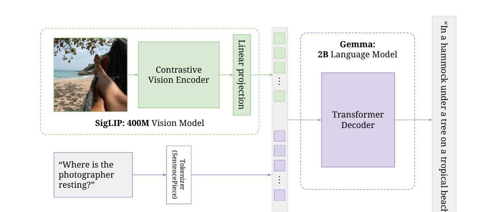
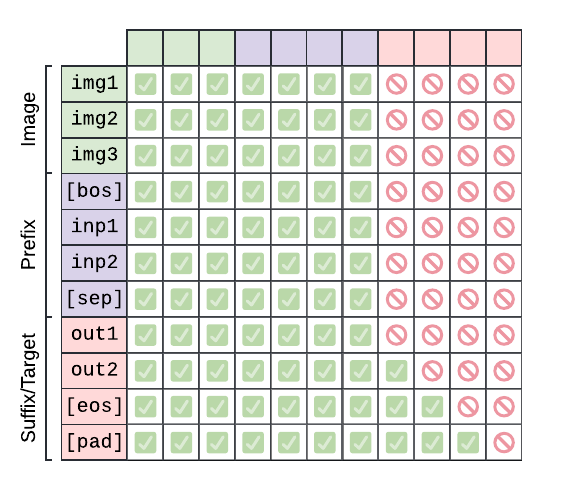
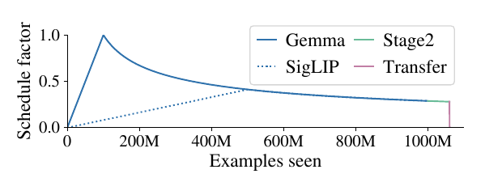

# [PaliGemma: A Versatile 3B VLM for Transfer](https://arxiv.org/abs/2407.07726)

> **Brief:** **Transfer-oriented vision-language model:** a SigLIP-So400m image encoder, a zero-initialized linear projector, and a Gemma-2B decoder trained jointly with prefix-LM attention on captioning, VQA, OCR, detection, segmentation, and grounding tasks.

## Convenient Links

* [Paper (arXiv)](https://arxiv.org/abs/2407.07726)
* [SigLIP note](./SigLIP.md)
* [Gemma 3 note](./Gemma_3.md)
* [pi0 note](../Robotics/Policies/Pi_0.md)

## 1. One-Sentence Summary

PaliGemma is an open, sub-3B base VLM from Google DeepMind that joins a pretrained `400M` SigLIP vision encoder to a pretrained Gemma-2B decoder, jointly adapts the entire model on one billion multimodal examples, and is designed to be fine-tuned into strong specialists rather than used as a zero-shot chatbot.

## 2. What PaliGemma Is Designed For

PaliGemma follows a different goal from instruction-tuned assistants:

> Learn a compact visual-language representation that can be transferred efficiently to many downstream tasks.

Its interface is deliberately general:

```text
one or more images + task prefix -> autoregressively generated text
```

The generated "text" can represent more than natural language:

* captions and answers;
* object labels and quantized bounding-box coordinates;
* referring-expression segmentation masks;
* OCR transcriptions;
* structured outputs for other tasks after fine-tuning.

This distinction matters when choosing a checkpoint:

| Model type | Intended use |
|:--|:--|
| PaliGemma base (`pt`) | Starting point for task-specific or mixed-task fine-tuning |
| Transferred checkpoint | Specialist for VQA, captioning, OCR, segmentation, and related tasks |
| Instruction/chat model | Conversational use; requires an additional instruction-tuning stage |

The original paper studies the first two. It explicitly warns that the base checkpoints are not optimized for a friendly zero-shot interface.

## 3. Architecture



*Paper Figure 1, cropped. SigLIP features and Gemma text embeddings become one token sequence processed by the decoder.*

PaliGemma has three learned components:

| Component | Initialization | Role |
|:--|:--|:--|
| Vision encoder | SigLIP ViT-So400m checkpoint | Convert an image into patch-level visual features |
| Connector | Zero-initialized linear layer | Map visual features to Gemma's embedding dimension |
| Language decoder | Raw pretrained Gemma-2B v1.0 | Integrate visual and textual context and generate output tokens |

The high-level path is:

```text
image
-> SigLIP ViT-So400m
-> visual patch features
-> linear projection
-> Gemma-compatible visual tokens
                             \
prompt -> SentencePiece -> text embeddings
                             /
-> concatenate visual and text tokens
-> Gemma decoder
-> output tokens
```

### 3.1 How SigLIP and Gemma Work Together

SigLIP was originally trained with both an image tower and a text tower for contrastive image-text alignment. PaliGemma does **not** send language through SigLIP and does not retain SigLIP's text tower in the VLM path.

Instead:

1. SigLIP's **image encoder** turns the image into spatial visual features.
2. A linear connector maps each feature into Gemma's token-embedding space.
3. Gemma embeds the textual prefix with its own SentencePiece tokenizer and embedding table.
4. Projected image tokens and Gemma text tokens are concatenated.
5. Gemma's self-attention jointly processes both modalities and generates the suffix.

If SigLIP produces

$$
V=f_{\mathrm{vision}}(I)\in\mathbb R^{N_{\mathrm{img}}\times d_v},
$$

the connector computes

$$
\tilde V=VW_p\in\mathbb R^{N_{\mathrm{img}}\times d_{\mathrm{LM}}}.
$$

Because $\tilde V$ and Gemma's text embeddings have the same width, they can enter the same Transformer sequence. The connector changes the **representation dimension**; it does not discretize an image into vocabulary IDs.

### 3.2 Why a Linear Connector Is Enough

The paper compares the linear connector with a one-hidden-layer GeLU MLP.

| Stage-1 setting | Linear | MLP |
|:--|--:|--:|
| Tune all components | `77.2` average transfer score | `77.1` |
| Freeze both pretrained towers | `70.7` | `69.7` |

The MLP brings no measurable advantage when the full model can adapt. PaliGemma therefore uses the simpler linear map.

## 4. Input Sequence and Image Resolution

During training, the decoder receives:

```text
[image tokens..., BOS, prefix tokens..., SEP,
 suffix tokens..., EOS, PAD...]
```

Here:

* **prefix** means the task description, prompt, or question;
* **suffix** means the answer or serialized target;
* newline (`\n`) is used as the separator token;
* image tokens are placed first, so no special image-position markers are needed.

PaliGemma uses fixed square input sizes:

| Checkpoint | Visual grid | Image tokens |
|:--:|:--:|--:|
| `224 x 224` | `16 x 16` | `256` |
| `448 x 448` | `32 x 32` | `1,024` |
| `896 x 896` | `64 x 64` | `4,096` |

The count grows quadratically with resolution:

$$
N_{\mathrm{img}}=\left(\frac{H}{14}\right)\left(\frac{W}{14}\right).
$$

This explains both the benefit and cost of high-resolution checkpoints: they preserve finer visual detail, but give Gemma a much longer sequence to process.

### Multiple Images and Video

For multiple images, each image is encoded independently and all visual sequences are concatenated without an extra separator or image-ID embedding. Video tasks sample up to 16 frames and use the same mechanism.

For example:

$$
16\text{ frames}\times256\text{ tokens/frame}=4096\text{ visual tokens},
$$

which equals the visual-token count of one `896 x 896` image.

## 5. Prefix-LM Attention



*Paper Figure 2, cropped. Green cells are visible attention connections; red cells are masked.*

PaliGemma is decoder-only, but it does not apply a standard causal mask to the entire sequence. It treats the image and textual prompt as a bidirectional **input prefix**, then treats the answer as an autoregressive **suffix**.

Let the first $L$ positions contain image tokens, `BOS`, prompt tokens, and `SEP`. For query position $i$ and key position $j$, the attention mask is

$$
M_{ij}=
\begin{cases}
0, & i\leq L\text{ and }j\leq L,\\
0, & i>L\text{ and }j\leq i,\\
-\infty, & \text{otherwise}.
\end{cases}
$$

Therefore:

* image and prompt tokens attend bidirectionally to the complete input prefix;
* image tokens can condition their representation on the question;
* a suffix token can attend to the full input and earlier suffix tokens;
* no input token can look ahead into the target suffix;
* no suffix token can see a future suffix token.

The language-model loss is applied only to suffix tokens:

$$
\mathcal L
=-\sum_{t=1}^{N_{\mathrm{suffix}}}
\log p_\theta\left(y_t\mid I,p,y_{<t}\right).
$$

The paper finds that this prefix-LM mask is better than making image and prefix tokens causal. Applying prediction loss to the prefix also hurts downstream transfer: asking the model to predict the question spends capacity on an objective that is not the intended output task.

## 6. Structured Outputs as Text

PaliGemma extends Gemma's vocabulary with:

* `1,024` location tokens, `<loc0000>` through `<loc1023>`;
* `128` VQ-VAE mask tokens, `<seg000>` through `<seg127>`.

Normalized coordinates are quantized into the location-token vocabulary. Detection or grounded captioning can therefore emit object text mixed with coordinate tokens. Referring-expression segmentation emits a compact sequence of mask-code tokens that can be decoded back into a mask.

The important design principle is:

> Keep one autoregressive output interface, and serialize task-specific structures into tokens.

This avoids adding a separate prediction head for every task. Fine-tuning teaches the model the required syntax and target vocabulary.

The paper also studies initialization for the newly added embeddings. Standard Gaussian initialization with $\sigma=0.02$ ultimately transfers better than initializing near the mean of Gemma's existing embeddings, despite the latter having lower loss only at the very beginning.

## 7. Four Training Stages

PaliGemma's recipe is easiest to understand as four stages:

```text
Stage 0: separately pretrained SigLIP and Gemma checkpoints
    -> Stage 1: long 224px multimodal pretraining
    -> Stage 2a: short 448px continued pretraining
    -> Stage 2b: short 896px continued pretraining
    -> Stage 3: downstream transfer
```

### 7.1 Stage 0: Unimodal Initialization

The authors reuse public pretrained components:

* SigLIP ViT-So400m supplies visual features and image-text alignment priors;
* raw Gemma-2B supplies language modeling knowledge;
* the linear connector begins at zero.

This initialization is essential. Resetting either pretrained tower before multimodal training causes large transfer degradation.

### 7.2 Stage 1: Multimodal Pretraining

Stage 1 trains at `224 x 224` resolution with:

| Setting | Value |
|:--|:--|
| Examples seen | `1B` |
| Visual tokens | `256` per image |
| Text sequence length | `128` prefix and suffix tokens combined |
| Frozen components | None |
| Objective | Prefix-LM, suffix loss only |

Unlike many connector-alignment recipes, PaliGemma tunes **SigLIP, the connector, and Gemma together**. The image encoder receives a slow linear learning-rate warm-up so that noisy gradients from the initially unaligned language path do not immediately damage its pretrained representation.

The ablations provide useful nuance:

* freezing SigLIP produces a similar average final transfer score, but worse pretraining perplexity on spatial tasks such as detection;
* freezing Gemma is significantly worse;
* tuning every component is the most generally useful base-model recipe.

### 7.3 Stage 2: Resolution Upcycling

Stage 2 continues pretraining rather than merely changing image size at inference:

| Step | Additional examples | Image tokens | Text length |
|:--|--:|--:|--:|
| `224 -> 448` | `50M` | `1,024` | up to `512` |
| `448 -> 896` | `10M` | `4,096` | up to `512` |

It uses the same task families as Stage 1 but upweights resolution-sensitive objectives such as OCR, detection, and segmentation. These tasks can also provide long, information-dense targets, such as all text or all objects in an image.

The paper shows that native continued pretraining at each resolution works better than:

* applying a `224` checkpoint directly at `448`;
* transferring a `448` checkpoint back at `224`;
* splitting a high-resolution image into independently encoded windows.

Higher resolution helps for two reasons: the input contains more visual information, and the longer visual sequence gives the decoder more computation. The ablation attributes the gains on resolution-sensitive tasks roughly equally to these effects.

### 7.4 Stage 3: Transfer

The base model is fine-tuned for a downstream task or task mixture. The default recommendation is full-model tuning with a short warm-up and cosine learning-rate decay to zero.

The paper explores:

| Hyperparameter | Candidate values | Simple starting point |
|:--|:--|:--|
| Resolution | `224`, `448`, `896` | Match task detail requirements |
| Epochs | `1`, `3`, `10`, `30`, `100` | Task dependent, initially at most `10` |
| Learning rate | `3e-5`, `1e-5`, `3e-6` | `1e-5` |
| Batch size | Task dependent | `256` |
| Label smoothing | `0.0`, `0.1`, `0.3` | `0.0` |
| LLM dropout | `0.0`, `0.1`, `0.3` | `0.0` |
| Weight decay | `0` or `0.1 x lr` | `0` |
| Freeze SigLIP | `false`, `true` | `false` |

Captioning can benefit from beam search; most other reported tasks use greedy decoding.

## 8. Pretraining Data and Task Mixture

PaliGemma pretraining prioritizes dense learning signal and broad transferable skills rather than conversational formatting.

| Task family | Prefix pattern or target | What it teaches |
|:--|:--|:--|
| Multilingual captioning | `caption {lang}` | Objects, attributes, relations, and multilingual descriptions |
| OCR | `ocr` | Reading text in raster order |
| VQA | `answer en {question}` | Question-conditioned visual understanding |
| VQG | `question {lang} {answer}` | Generate a question from an image and answer |
| Detection | `detect {class}; ...` | Localization with quantized coordinates |
| Segmentation | `segment {class}; ...` | Referring and instance-mask generation |
| Grounded captioning | `caption <box tokens>` | Describe a specified image region |

Named sources include WebLI in more than 100 languages, CC3M-35L, and OpenImages-derived tasks. Detection and segmentation data also use open-world pseudo-labeling. Some pretraining datasets are private, so the full data mixture cannot be reconstructed only from public sources.

Important data-integrity choices:

* downstream transfer datasets are not included in pretraining;
* near-duplicates of evaluation images are removed from web-scale data;
* pretraining targets are not generated by a larger commercial VLM;
* each pretraining task receives a task prefix to reduce conflicting supervision.

Task prefixes improve upstream task disambiguation, although the paper finds little difference in average downstream score after full task-specific transfer.

## 9. Learning-Rate and Compute Setup



*Paper Figure 3, cropped. Gemma warms up first; SigLIP adapts more slowly before joining the continuous pretraining schedule.*

Stages 1 and 2 use one continuous reciprocal-square-root schedule rather than restarting or fully decaying the learning rate between stages. Transfer acts as the cooldown and uses a cosine decay to zero.

Reported training details:

| Item | Setting |
|:--|:--|
| Framework | `big_vision`, JAX, GSPMD |
| Hardware | Cloud TPUv5e-256 |
| Parallelism | Fully sharded data parallelism over data, parameters, and optimizer state |
| Stage-1 time | Slightly less than `3 days` |
| Each Stage-2 time | About `15 hours` |
| Stage-1 token count | Slightly less than `350B` |
| Combined Stage-2 token count | About `90B` |
| Model FLOP utilization | `55%` |
| Throughput | `5,189 tokens/s/device` |
| Training parameter/optimizer precision | `float32` |
| Verified inference precision | `bfloat16` |

Image preprocessing is lightly randomized across resize implementations, JPEG encoding, and a slight inception crop. This makes checkpoints less brittle to differences among downstream image pipelines.

## 10. Evaluation Results

The paper transfers PaliGemma to almost 40 tasks spanning captioning, VQA, documents, diagrams, remote sensing, segmentation, multiple images, and video. Transfer task images are excluded from the pretraining mixture.

### 10.1 Selected Results

Metrics differ by task, so rows should be compared across resolutions, not directly across tasks.

| Task and metric | `224` | `448` | `896` |
|:--|--:|--:|--:|
| COCO captioning, CIDEr | `141.9` | `144.6` | - |
| VQAv2, accuracy | `83.2` | `85.6` | - |
| TextCaps, CIDEr | `127.5` | `153.9` | - |
| ChartQA human, relaxed accuracy | `40.0` | `54.2` | - |
| TextVQA, accuracy | `55.5` | `73.2` | `74.9` |
| DocVQA, ANLS | `43.7` | `78.0` | `84.8` |
| InfoVQA, ANLS | `28.5` | `40.5` | `47.8` |
| ST-VQA, ANLS | `63.3` | `81.8` | `84.4` |
| RefCOCO testA, mIoU | `75.7` | `77.9` | `78.7` |
| ScienceQA, accuracy | `95.4` | `95.9` | - |

The pattern is more important than any single number:

* ordinary captioning and knowledge VQA improve modestly with resolution;
* OCR-heavy documents, charts, scene text, and segmentation benefit strongly;
* higher resolution is not automatically helpful for every task, as shown by small regressions on some reasoning benchmarks;
* a compact 3B model can remain competitive with much larger PaLI-family systems after suitable transfer.

### 10.2 Transfer Efficiency

A single simple transfer configuration works within `2.5%` of task-specific tuning on most evaluated tasks. Referring segmentation and scientific captioning are notable exceptions that benefit from longer training and regularization.

In limited-data experiments, after selecting the best run among several hyperparameters and seeds:

* `4,096` examples bring most tasks within `10%` of full-data performance;
* `256` examples bring most within `20%`;
* `64` examples are often enough for an initial prototype.

Few-example results have high seed variance, especially for segmentation. These numbers demonstrate adaptation potential, not a guarantee that one arbitrary fine-tuning run will reach the reported score.

## 11. Main Ablation Lessons

| Question | Finding |
|:--|:--|
| Is long multimodal pretraining useful? | Yes. Shortening Stage 1 generally hurts; skipping it is worst. `100M` examples are adequate for cheap ablations, but the final model uses `1B`. |
| Should all tokens use causal attention? | No. Bidirectional attention over image plus prompt transfers better. |
| Should loss include prompt tokens? | No. Suffix-only supervision performs better. |
| Should SigLIP remain frozen? | Full tuning improves spatial pretraining objectives; final average transfer can be similar when SigLIP is frozen. |
| Should Gemma remain frozen? | No. Freezing the language model substantially hurts transfer. |
| Linear or MLP connector? | Linear is equally strong or slightly better. |
| Is a pretrained vision encoder necessary? | It is much more sample-efficient than projecting raw RGB patches directly into Gemma. |
| Can one checkpoint serve every resolution? | Not reliably. Native Stage-2 checkpoints transfer best at their own resolution. |
| Is windowing equivalent to native high resolution? | No. It is a fallback when continued pretraining is unavailable and brings at most a small speed improvement. |

## 12. PaliGemma as a Robotics Backbone

PaliGemma is relevant to robot policies such as [pi0](../Robotics/Policies/Pi_0.md) because it provides a compact, jointly trained visual-language backbone:

```text
camera image -> SigLIP spatial features
language instruction -> Gemma tokens
joint Gemma attention -> grounded multimodal representation
```

However, PaliGemma itself predicts text tokens, not continuous motor commands. A VLA must add an action representation and training objective, for example a separate continuous action expert. PaliGemma supplies visual-language knowledge; the robot-policy architecture supplies state conditioning, temporal control, and action generation.

## 13. Limitations

* The base model is not instruction tuned and should not be judged as an out-of-the-box chatbot.
* Fixed square resolutions require separate checkpoints and visual-token cost grows quadratically.
* The `2B` language backbone is efficient but weaker than larger LLMs on difficult language-only reasoning.
* Some pretraining datasets are private, limiting full recipe reproducibility.
* Serialized detection and segmentation are elegant but require task-specific formatting and decoding.
* Multi-image inputs are concatenated without explicit image identifiers, leaving Gemma to infer boundaries from ordering and task supervision.
* Strong transfer still requires selecting a suitable resolution, learning rate, epoch count, and sometimes regularization.

## 14. Practical Mental Model

The shortest accurate description is:

```text
PaliGemma
= pretrained SigLIP image encoder
+ zero-initialized linear projector
+ pretrained Gemma-2B decoder
+ bidirectional image/prompt prefix
+ causal, suffix-only text objective
+ long joint multimodal pretraining
+ short native-resolution upcycling
+ downstream full-model fine-tuning
```

Its main contribution is not a novel connector or a very large decoder. It is a carefully validated recipe showing that strong pretrained vision and language components, fully adapted together under the right attention mask and task mixture, can produce a small base VLM with unusually broad transfer capability.

## 15. Key Takeaways

1. **PaliGemma is a base model for transfer.** Fine-tuning is part of its intended use, not an optional repair step.
2. **SigLIP handles images; Gemma handles language and multimodal generation.** SigLIP's text tower is not used in the combined model.
3. **Visual features become soft Gemma tokens through a linear projection.** They are embeddings, not discrete vocabulary tokens.
4. **Prefix-LM attention is central.** Image and prompt tokens communicate bidirectionally, while outputs remain autoregressive.
5. **The whole model is trained jointly.** Keeping the VLM fully adaptable is especially useful for spatial skills.
6. **Resolution needs training, not only resizing.** Native `224`, `448`, and `896` checkpoints serve different detail and compute requirements.
7. **One text-generation interface supports many visual tasks.** Coordinates and masks are serialized with dedicated tokens.
8. **The reported strength is broad transferability.** Nearly 40 tasks and limited-data experiments test adaptation beyond standard VQA.
