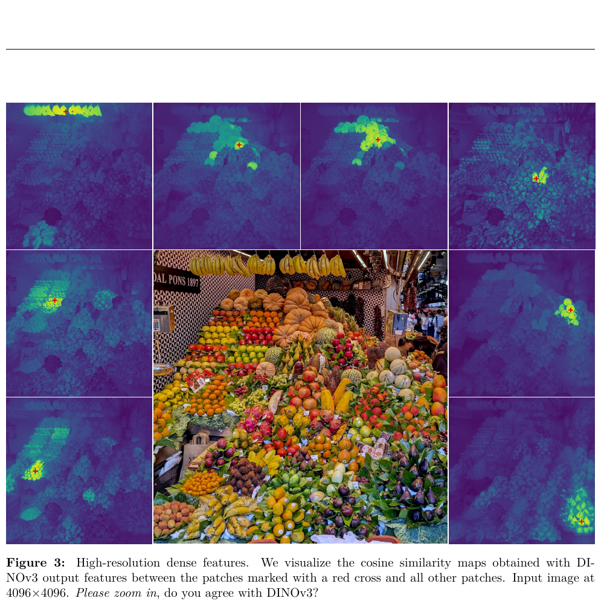
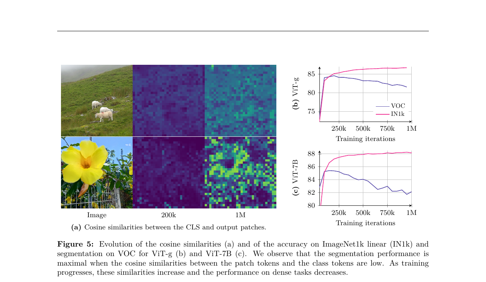
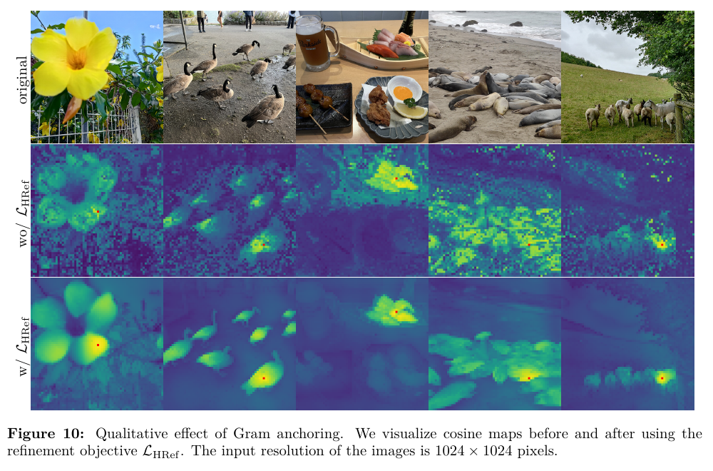
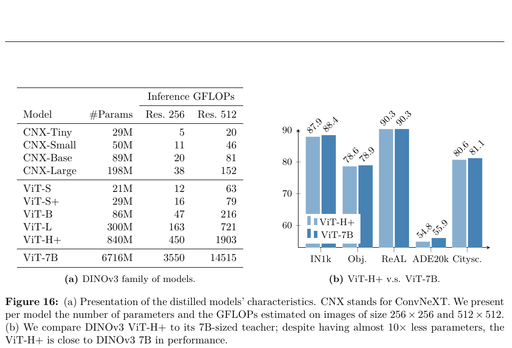
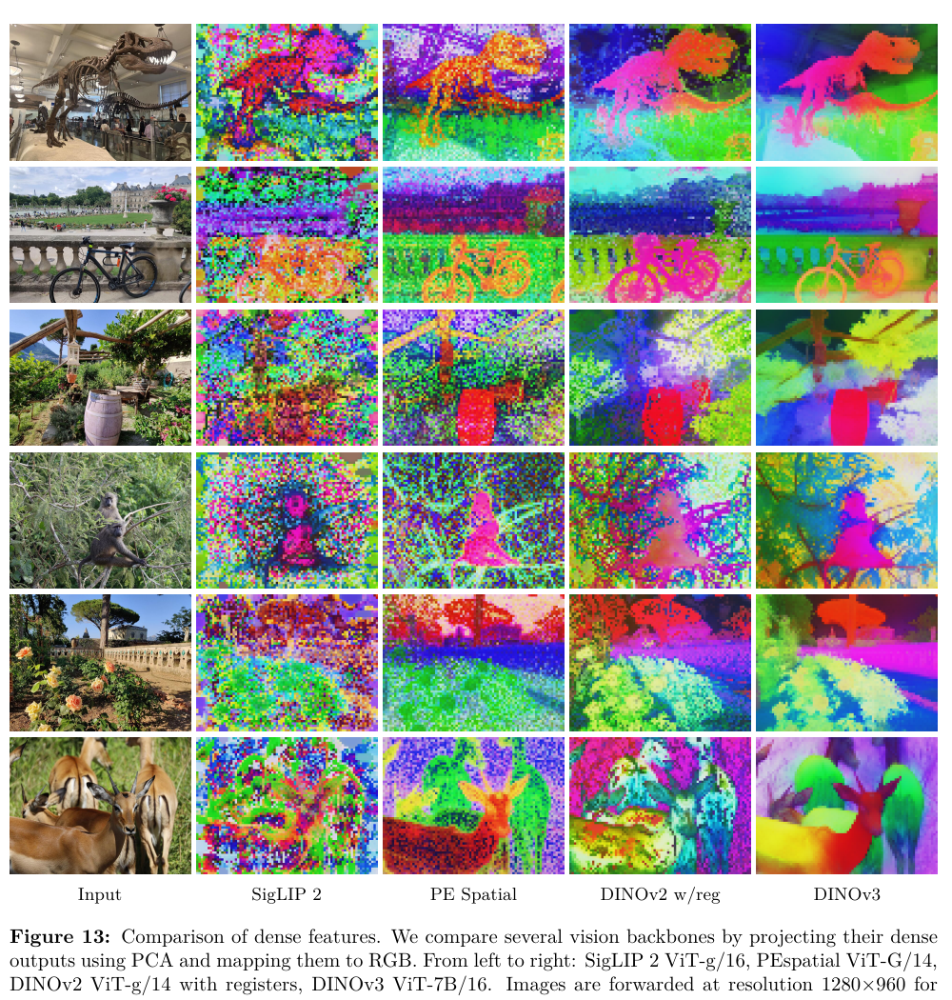

# [DINOv3](https://arxiv.org/abs/2508.10104)

> **Brief:** **Large-scale self-supervised vision foundation model:** DINOv3 scales image-only DINO training to a 6.7B-parameter ViT and 1.689B curated images, then uses Gram anchoring to repair the dense patch features that otherwise degrade during long training.

**DINOv3** (Siméoni et al., 2025) is a family of self-supervised image encoders. Like DINOv2, the base model uses neither labels nor captions and is a **vision model**. Its frozen features are intended to serve as a reusable encoder for classification, retrieval, segmentation, depth, tracking, 3D vision, and multimodal systems.

## Convenient Links

- [Paper](https://arxiv.org/abs/2508.10104)
- [Official code and pretrained models](https://github.com/facebookresearch/dinov3)
- [DINOv2 note](./DINOv2.md)
- Related notes: [CLIP](../Vision_Language_Models/CLIP.md), [SigLIP](../Vision_Language_Models/SigLIP.md)

## 1. One-Sentence Summary

DINOv3 keeps DINOv2's image-level DINO, patch-level iBOT, and KoLeo objectives, but scales the data and teacher by roughly an order of magnitude, replaces learned position embeddings with jittered axial RoPE, trains for one million constant-schedule iterations, and finally restores clean local features by matching the student's patch-similarity Gram matrix to an earlier, spatially stronger teacher.

## 2. What Changes From DINOv2?

| Aspect | DINOv2 | DINOv3 |
| :----- | :----- | :----- |
| Curated image set | LVD-142M | LVD-1689M plus retrieval and selected public datasets |
| Largest teacher | ViT-g, `1.1B` | ViT-7B, `6.7B` |
| Patch size | `14` | `16` |
| Position encoding | learned | axial RoPE with box jitter |
| Embedding dimension | `1536` | `4096` |
| Attention heads | `24 x 64` | `32 x 128` |
| Registers | `4` | `4` |
| Main schedule | cosine schedules | constant hyperparameters after warmup |
| Main training length | `625k` iterations | `1M` iterations |
| Dense-feature correction | none | Gram anchoring |
| Released family | ViT-S/B/L/g | ViT-S/S+/B/L/H+/7B and ConvNeXt-T/S/B/L |

The most important change is not simply the larger model. DINOv3 identifies and solves a scaling failure:

```text
longer SSL training
-> better class-token semantics
-> worse patch-level locality
-> weaker segmentation, depth, and correspondence
```

Gram anchoring allows the model to keep the first benefit without accepting the second failure.

## 3. Global and Dense Outputs

For an image split into $P$ patches, a DINOv3 ViT produces:

$$
f_\theta(x)
=
\left[
z_{\mathrm{CLS}},
z_{\mathrm{reg}}^1,\ldots,z_{\mathrm{reg}}^4,
z_1,\ldots,z_P
\right].
$$

The outputs have different uses:

| Output | Information | Typical downstream use |
| :----- | :---------- | :--------------------- |
| $z_{\mathrm{CLS}}$ | global image semantics | classification and instance retrieval |
| register tokens | scratch space that absorbs non-local artifacts | internal representation stabilization |
| patch tokens $z_i$ | spatially localized visual features | segmentation, depth, tracking, and correspondence |

The main goal of DINOv3 is to make both the class token and patch tokens strong at the same time.



*Paper Figure 3. Each heat map compares one red-marked patch with every other patch in a `4096 x 4096` image. Similarities remain localized despite the very high input resolution.*

## 4. Training Data

### 4.1 Initial pool

The authors begin with approximately **17 billion** images from public Instagram posts. These images had already passed platform-level content moderation.

The final training mixture has three sources:

1. **Clustering-based curation:** hierarchical k-means and balanced sampling produce **LVD-1689M**, a 1.689B-image set intended to cover web visual concepts evenly.
2. **Retrieval-based curation:** selected downstream datasets act as seeds for retrieving relevant images from the raw pool.
3. **Public vision datasets:** ImageNet-1k, ImageNet-22k, and Mapillary add high-quality, task-relevant images.

The clustering hierarchy uses five levels:

$$
200\text{M}
\rightarrow
8\text{M}
\rightarrow
800\text{k}
\rightarrow
100\text{k}
\rightarrow
25\text{k clusters}.
$$

### 4.2 Batch sampling

Most iterations use heterogeneous batches from the broad mixture. In **10%** of iterations, the model receives a homogeneous ImageNet-1k batch.

This small stream of concentrated, high-quality data improves common recognition tasks without replacing the broad, balanced background distribution.

### 4.3 Data ablation

All variants below use a shortened `200k`-iteration experiment:

| Data | IN1k linear | ObjectNet | iNat2021 | Paris retrieval |
| :--- | ----------: | --------: | --------: | --------------: |
| Raw | 84.8 | 70.3 | 70.1 | 63.3 |
| Clustering only | 85.4 | 72.3 | 81.3 | 85.2 |
| Retrieval only | 86.7 | 70.7 | 86.0 | 82.7 |
| Full LVD-1689M mixture | **87.2** | **72.8** | **87.0** | **85.9** |

Clustering gives diversity, retrieval gives task relevance, and their combination is the most balanced.

## 5. ViT-7B Architecture

| Property | DINOv3 teacher |
| :------- | -------------: |
| Parameters | `6.7B` |
| Transformer blocks | `40` |
| Patch size | `16 x 16` |
| Embedding dimension | `4096` |
| Attention heads | `32` |
| Dimension per head | `128` |
| FFN | SwiGLU, hidden dimension `8192` |
| Register tokens | `4` |
| DINO prototypes | `256k` |
| iBOT prototypes | `96k` |

### 5.1 Axial RoPE

DINOv3 replaces learned positional embeddings with an axial rotary position representation. Each patch receives 2D coordinates in a normalized box:

$$
(u_i,v_i)\in[-1,1]^2.
$$

The relative position enters attention through RoPE rather than a fixed learned table. This permits variable resolutions and aspect ratios without interpolating a position-embedding grid.

### 5.2 RoPE-box jitter

During training, the coordinate range is randomly scaled:

$$
[-1,1]^2
\longrightarrow
[-s,s]^2,
\qquad
s\sim\mathcal{U}(0.5,2).
$$

This prevents the model from treating one absolute coordinate scale as canonical and improves robustness across resolutions, scales, and aspect ratios.

## 6. Initial Self-Supervised Objective

DINOv3 keeps the student-teacher structure of DINOv2:

1. the student sees two global crops, eight local crops, and masked patch tokens;
2. the EMA teacher sees unmasked global crops;
3. the student learns to match the teacher's image-level and patch-level assignments;
4. gradients update the student, while EMA updates the teacher.

### 6.1 Global DINO loss

The class tokens from different views are projected into prototype distributions. For teacher view $g$ and student view $v$:

$$
\mathcal{L}_{\mathrm{DINO}}
=
-
\sum_k
p_T^{(g)}(k)
\log p_S^{(v)}(k).
$$

This creates crop-invariant global semantics.

### 6.2 Masked-patch iBOT loss

For masked patch set $\mathcal{M}$:

$$
\mathcal{L}_{\mathrm{iBOT}}
=
-
\sum_{i\in\mathcal{M}}
\sum_k
p_{T,i}(k)\log p_{S,i}(k).
$$

The student must infer the teacher's visible-patch representation from image context. This objective supplies local supervision.

### 6.3 Distributed KoLeo

KoLeo spreads class-token representations across the feature space. DINOv3 applies it to small groups of 16 samples, potentially distributed across GPUs.

The initial loss is:

$$
\mathcal{L}_{\mathrm{Pre}}
=
\mathcal{L}_{\mathrm{DINO}}
+
\mathcal{L}_{\mathrm{iBOT}}
+
0.1\mathcal{L}_{\mathrm{DKoLeo}}.
$$

DINO and iBOT use separate heads and Sinkhorn-Knopp balancing. DINOv3 additionally applies separate LayerNorm operations to backbone outputs from global and local crops, improving late-training stability and dense performance.

## 7. Main Training Settings

| Setting | Value |
| :------ | :---- |
| Optimizer | AdamW |
| Main iterations | `1,000,000` |
| Global batch size | `4096` images |
| Hardware | `256` GPUs |
| Global crops | `2 x 256 x 256` |
| Local crops | `8 x 112 x 112` |
| Total tokens per batch | about `3.7M` |
| Learning rate | constant `4e-4` after warmup |
| LR warmup | `100k` iterations |
| Weight decay | constant `0.04` |
| Teacher EMA | constant `0.999` |
| Stochastic depth | `0.4` |
| Precision | bfloat16 with FP8 matrix multiplications |
| Parallelism | fully sharded data parallelism |

DINOv2 requires the final training horizon in advance because many hyperparameters follow cosine schedules. DINOv3 keeps the main learning rate, weight decay, and EMA momentum constant, allowing training to continue while downstream metrics improve.

## 8. The Dense-Feature Collapse

Longer training improves ImageNet linear classification, but semantic segmentation peaks early and then falls.



*Paper Figure 5. From `200k` to `1M` iterations, class-token accuracy continues to improve while VOC segmentation and patch locality degrade, especially for ViT-7B.*

The observed failure is:

1. patch norms remain stable because register tokens already handle high-norm outliers;
2. patch tokens become increasingly similar to the class token;
3. local neighborhoods become noisy and less spatially specific;
4. dense tasks decline after roughly `200k` iterations.

This is not ordinary representation collapse. Global discrimination remains strong. The problem is a gradual loss of **local similarity structure**.

## 9. Gram Anchoring

### 9.1 Patch Gram matrix

Let the student and Gram teacher produce L2-normalized patch features:

$$
X_S,X_G\in\mathbb{R}^{P\times d}.
$$

Their Gram matrices contain every pairwise patch similarity:

$$
G_S=X_SX_S^\top,
\qquad
G_G=X_GX_G^\top.
$$

Entry $(i,j)$ is:

$$
(G_S)_{ij}
=
\langle x_{S,i},x_{S,j}\rangle.
$$

The new loss is:

$$
\mathcal{L}_{\mathrm{Gram}}
=
\left\|
X_SX_S^\top
-
X_GX_G^\top
\right\|_F^2.
$$

The Gram teacher is an earlier EMA-teacher checkpoint, typically around `200k` iterations, when dense features are still spatially coherent.

### 9.2 Why match similarities instead of features?

Direct feature distillation,

$$
\left\|X_S-X_G\right\|_F^2,
$$

would force the mature model to copy the early model's exact representation and could undo later semantic improvements.

Gram matching constrains only pairwise geometry. For any orthogonal transformation $Q$:

$$
(X_SQ)(X_SQ)^\top
=
X_SQQ^\top X_S^\top
=
X_SX_S^\top.
$$

The student may therefore rotate or reorganize its feature basis while preserving which patches are related. This separates two goals:

```text
DINO + iBOT
-> improve semantic features

Gram anchoring
-> preserve spatial similarity structure
```

### 9.3 Refinement objective

After the one-million-iteration pre-training phase, DINOv3 begins a refinement phase:

$$
\mathcal{L}_{\mathrm{Ref}}
=
w_D\mathcal{L}_{\mathrm{DINO}}
+
\mathcal{L}_{\mathrm{iBOT}}
+
w_{DK}\mathcal{L}_{\mathrm{DKoLeo}}
+
w_{\mathrm{Gram}}\mathcal{L}_{\mathrm{Gram}}.
$$

The implementation uses:

$$
w_{\mathrm{Gram}}=2.
$$

The Gram teacher is updated from the main EMA teacher every `10k` steps, for at most three updates. Anchoring takes effect quickly: the paper reports substantial dense-task recovery within the first `10k` refinement iterations while global losses remain largely unaffected.

## 10. High-Resolution Gram Teacher

An early teacher has better locality, and a higher-resolution teacher has finer spatial detail. DINOv3 combines both:

1. send a crop at twice the normal resolution through the Gram teacher;
2. bicubically downsample its patch-feature map by `2x`;
3. compare that smoothed feature map with the student's normal-resolution map;
4. match their Gram matrices.

This creates the high-resolution refinement objective $\mathcal{L}_{\mathrm{HRef}}$.

The paper's ablation improves:

| Method | IN1k linear | ADE20K mIoU | NYUv2 RMSE $\downarrow$ |
| :----- | -----------: | -----------: | ----------------------: |
| Before Gram refinement | **88.2** | 50.3 | 0.307 |
| Gram, `200k` teacher, `1x` | 88.0 | 53.6 | 0.285 |
| Gram, `200k` teacher, `2x` | 88.0 | **55.7** | **0.281** |

Dense performance improves sharply while global classification is essentially preserved.



*Paper Figure 10. Before refinement, unrelated patches receive noisy high similarities. High-resolution Gram anchoring restores compact, object-aligned similarity regions.*

## 11. High-Resolution Adaptation

The main model is trained at global-crop resolution `256`, but downstream tasks often need much larger images. DINOv3 adds a short `10k`-iteration mixed-resolution stage:

$$
\text{global crops}\in\{512,768\},
$$

$$
\text{local crops}\in\{112,168,224,336\}.
$$

Gram anchoring remains active and is essential for preserving dense quality in this stage.

The result is not just compatibility with larger images. Dense performance improves as resolution increases, and stable feature maps generalize beyond the maximum training resolution of `768` to inputs above `4096` pixels.

## 12. Distillation and Model Family

Running a 6.7B vision encoder is expensive. DINOv3 freezes the ViT-7B model and distills it into multiple students.

Unlike the original self-distillation stage:

* the teacher is fixed rather than an EMA of each student;
* multiple students share the same expensive teacher forward pass;
* each student group trains in parallel on the gathered teacher outputs;
* Gram anchoring is unnecessary because distilled students do not exhibit the same long-run locality failure.

Students train for `1M` iterations, followed by a `250k` cosine learning-rate cooldown and high-resolution adaptation.



*Paper Figure 16. DINOv3 provides ViT and ConvNeXt variants over a wide compute range. The 840M ViT-H+ remains close to the 6.7B teacher on representative global and dense tasks.*

| Family | Models and parameter counts |
| :----- | :-------------------------- |
| ViT | S `21M`, S+ `29M`, B `86M`, L `300M`, H+ `840M`, 7B `6716M` |
| ConvNeXt | Tiny `29M`, Small `50M`, Base `89M`, Large `198M` |

The ConvNeXt students show that the learned representation can transfer across architecture families, not only between smaller and larger ViTs.

## 13. Optional Text Alignment

Base DINOv3 is image-only. The paper separately creates **DINOv3 dino.txt**:

1. freeze a distilled DINOv3 ViT-L;
2. add two trainable transformer layers above the visual backbone;
3. concatenate the class token with mean-pooled patch features;
4. train a text encoder from scratch against image-caption pairs using a contrastive LiT-style objective.

This produces global and local language alignment without retraining the visual encoder.

Selected zero-shot results for ViT-L-size models:

| Model | IN1k | ObjectNet | COCO I-to-T R@1 | ADE20K mIoU | Cityscapes mIoU |
| :---- | ----: | --------: | --------------: | -----------: | ---------------: |
| SigLIP 2 | **83.1** | **84.4** | **71.4** | 10.8 | 16.3 |
| DINOv3 dino.txt | 82.3 | 80.5 | 63.7 | **24.7** | **36.9** |

SigLIP 2 remains stronger for global image-text alignment, while DINOv3's clean patch features produce much stronger open-vocabulary dense segmentation.

## 14. Evaluation Principle

Most DINOv3 evaluations freeze the image backbone:

```text
image
-> one frozen DINOv3 forward pass
-> non-parametric method, linear probe, or task decoder
```

This matters when reading the results:

* a **linear probe** tests whether information is already linearly accessible;
* a **non-parametric method** tests the raw geometry of the representation;
* a **trained decoder** tests whether the frozen backbone can support a full task system;
* only the decoder's parameters are trained unless the paper explicitly states otherwise.

## 15. Dense-Feature Results



*Paper Figure 13. PCA projections of frozen patch features from SigLIP 2, PE Spatial, DINOv2 with registers, and DINOv3. DINOv3 is visibly cleaner and more spatially coherent.*

### 15.1 Linear dense probes

| Frozen backbone | ADE20K | Cityscapes | VOC | NYUv2 $\downarrow$ | KITTI $\downarrow$ |
| :-------------- | -----: | ----------: | --: | ------------------: | -----------------: |
| DINOv2 ViT-g/14 | 49.5 | 75.6 | 83.1 | 0.372 | 2.624 |
| DINOv3 ViT-7B/16 | **55.9** | **81.1** | **86.6** | **0.309** | **2.346** |

These use only a linear transform over frozen patch features.

### 15.2 Correspondence and tracking

| Task | DINOv2 | DINOv3 |
| :--- | -----: | -----: |
| NAVI geometric correspondence recall | 60.1 | **64.4** |
| SPair semantic correspondence recall | 56.1 | **58.7** |
| DAVIS tracking J&F, large resolution | 76.6 | **83.3** |
| YouTube-VOS tracking J&F, large resolution | 74.6 | **80.7** |
| MOSE tracking J&F, large resolution | 48.5 | **55.6** |

The tracking algorithm propagates first-frame labels through patch similarity and does not train DINOv3 on video.

### 15.3 Unsupervised object discovery

TokenCut on frozen DINOv3 features reaches:

| VOC 2007 | VOC 2012 | COCO-20k |
| -------: | -------: | -------: |
| **66.1** | **69.5** | **55.1** |

This exceeds DINOv2 by `5.9`, `9.1`, and `9.7` CorLoc points respectively, showing that the cleaned patch graph is useful without labels or a trained head.

## 16. Global-Feature Results

Linear classifiers are trained on frozen class tokens:

| Model | IN1k | IN-V2 | IN-ReaL | IN-R | IN-Sketch | IN-A | IN-C $\downarrow$ | ObjectNet |
| :---- | ---: | ----: | -------: | ---: | --------: | ---: | ----------------: | --------: |
| DINOv2 ViT-g | 87.3 | 79.5 | 89.9 | 81.1 | 65.4 | 81.7 | 24.1 | 66.4 |
| DINOv3 ViT-7B | **88.4** | **81.4** | **90.4** | **91.1** | **71.3** | **86.9** | **19.6** | **79.0** |

DINOv3 closes much of the classification gap to caption-supervised encoders while using no language supervision in backbone pre-training.

Instance retrieval also improves strongly:

| Model | Oxford-H | Paris-H | Met GAP | AmsterTime |
| :---- | -------: | ------: | ------: | ---------: |
| DINOv2 | 58.2 | 84.6 | 44.6 | 48.9 |
| DINOv3 | **60.7** | **87.1** | **55.4** | **56.5** |

## 17. Frozen Backbone in Full Vision Systems

DINOv3 is also used beneath larger task decoders:

| System | Backbone training | Result |
| :----- | :---------------- | :----- |
| Plain-DETR detection | frozen | COCO `65.6` mAP, `66.1` with TTA |
| Mask2Former segmentation | frozen | ADE20K `62.6` mIoU, `63.0` with TTA |
| Depth Anything V2-style depth | frozen | new best or near-best results across NYUv2, KITTI, ETH3D, ScanNet, and DIODE |
| VGGT with DINOv3 ViT-L | fine-tuned in this experiment | improves camera pose, multi-view reconstruction, and view matching over DINOv2-based VGGT |

The detection and segmentation decoders are still substantial. The claim is not that DINOv3 solves these tasks with no training, but that one frozen encoder can support strong specialized heads.

## 18. Geospatial DINOv3

To test whether the recipe transfers beyond ordinary web images, the paper trains a separate 7B model on **SAT-493M**:

* `493M` Maxar RGB orthorectified satellite crops;
* `512 x 512` resolution at `0.6 m` ground sampling distance;
* `100k` initial self-supervised iterations;
* `10k` Gram-refinement iterations;
* `8k` high-resolution iterations at resolution `512`;
* subsequent distillation into ViT-L.

The satellite and web models set strong results for canopy height, land-cover segmentation, and overhead-object detection. An important finding is that the web model remains competitive on several geospatial tasks, while the satellite model is strongest when domain-specific metric detail matters.

## 19. Cost and Limitations

### 19.1 Compute

The reported cost for one ViT-7B pre-training run is:

| GPU hours | Energy estimate | Carbon estimate |
| --------: | --------------: | --------------: |
| `61,440` H100 hours | `47 MWh` | `18 tCO2e` |

The carbon figure assumes PUE `1.1` and US-average carbon intensity. The authors estimate the entire research project, including experiments, at roughly `9M` GPU hours and `2600 tCO2e`.

### 19.2 Practical limitations

* the 6.7B teacher is too expensive for many deployments, making distillation essential;
* the primary web dataset is not a small, directly reproducible public benchmark;
* image-only SSL does not provide native language grounding or generation;
* text alignment is a separate caption-supervised stage;
* strong full-system numbers still require task-specific decoders and labeled downstream data;
* patch size `16` limits native output granularity even when features are spatially strong;
* the paper mainly measures frozen transfer, not every possible fine-tuning behavior.

## 20. Key Takeaways

1. **Scaling SSL exposes a local-feature failure.** Global semantics improve while patch locality degrades.
2. **Gram anchoring preserves relationships, not coordinates.** It protects pairwise patch geometry without freezing the representation to an early checkpoint.
3. **An early, high-resolution teacher is a spatial prior.** Its smoothed feature map repairs the mature student's dense structure.
4. **DINOv3 is an image encoder, not a VLM.** Language support comes from the separate dino.txt alignment stage.
5. **The strongest result is versatility.** One frozen backbone supports global recognition, dense prediction, video tracking, retrieval, geometry, and scientific imagery.
6. **The 7B model is a teacher as much as a deployable model.** Distillation transfers most of its quality into practical ViT and ConvNeXt variants.
