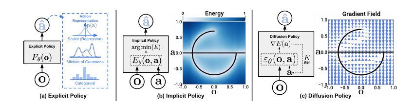
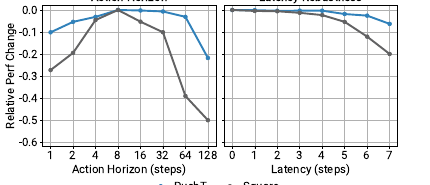
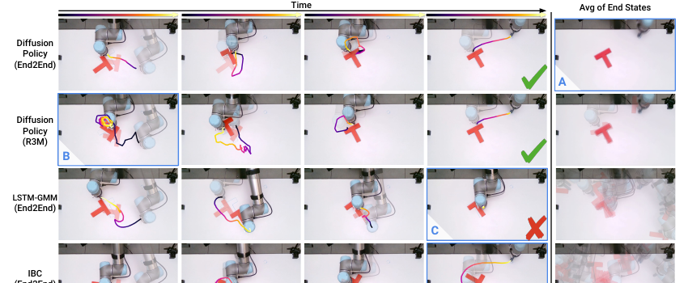

# [Diffusion Policy: Visuomotor Policy Learning via Action Diffusion](https://arxiv.org/abs/2303.04137)

## Convenient Links
* [Paper (arXiv)](https://arxiv.org/abs/2303.04137)
* [Project Page](https://diffusion-policy.cs.columbia.edu/)
* [Official Code](https://github.com/real-stanford/diffusion_policy)
* [ACT note in this repo](./ACT.md)
* [OpenVLA note in this repo](./OpenVLA.md)

## 1. One-Sentence Summary

Diffusion Policy把机器人策略写成一个**条件扩散模型**：给定最近的视觉/状态观测，模型从高斯噪声中逐步去噪出一段未来动作序列，再用 receding horizon control 执行前几步并不断重规划，从而更稳定地表达多模态、高维、连续控制动作。

## 2. Why This Paper Matters

传统 behavior cloning 常把策略写成：

$$
a_t = f_\theta(o_t)
$$

这种单步回归在机器人任务里有三个明显问题：

* 人类示教天然多模态，同一个状态可能有多个合理动作。
* 机器人动作是连续、高精度、高维的，离散分类或 GMM 容易受维度和 mode collapse 影响。
* 单步动作彼此独立，容易产生抖动、模式切换和误差累积。

Diffusion Policy的核心价值是把策略结构换掉：

$$
\pi_\theta(A_t \mid O_t)
$$

其中 $O_t$ 是最近一段观测，$A_t$ 是未来一段动作序列。动作不是直接回归出来，而是通过扩散采样生成出来。

论文在 `15` 个任务、`4` 类 benchmark 上评估，报告平均成功率提升约 `46.9%`。更重要的是，它总结出几个后来 VLA / 机器人模仿学习里反复出现的设计点：动作 chunk、receding horizon、位置控制、端到端视觉条件、扩散式多模态建模。

## 3. Policy Representation



*Figure adapted from the paper: explicit policy directly predicts actions, implicit policy optimizes an energy function, and Diffusion Policy iteratively follows a learned action-score / denoising field.*

论文比较了三类策略表示：

* **Explicit policy**：直接输出动作，比如 regression、GMM、categorical bins。
* **Implicit policy**：学习能量函数 $E_\theta(o, a)$，推理时搜索低能量动作。
* **Diffusion policy**：学习动作分布的 score / denoising field，从噪声逐步优化到动作。

Diffusion Policy和 implicit policy 都能表达多模态动作，但 diffusion 避免了 EBM 里负样本采样和归一化常数估计的问题。

## 4. DDPM Background

普通 DDPM 学习一个数据分布 $p(x_0)$。前向加噪过程可以写成：

$$
q(x_k \mid x_0)
=
\mathcal{N}
\left(
x_k;
\sqrt{\bar{\alpha}_k}x_0,
(1-\bar{\alpha}_k)I
\right)
$$

等价采样形式是：

$$
x_k
=
\sqrt{\bar{\alpha}_k}x_0
+
\sqrt{1-\bar{\alpha}_k}\epsilon,
\qquad
\epsilon \sim \mathcal{N}(0, I)
$$

噪声预测网络 $\epsilon_\theta$ 的训练目标是：

$$
\mathcal{L}_{\text{DDPM}}
=
\mathbb{E}_{x_0,k,\epsilon}
\left[
\left\|
\epsilon
-
\epsilon_\theta(x_k, k)
\right\|_2^2
\right]
$$

推理时从 $x_K \sim \mathcal{N}(0, I)$ 开始，反复预测噪声并去噪。论文中把这个过程解释成 noisy gradient descent：

$$
x_{k-1}
=
\alpha_k
\left(
x_k
-
\gamma_k \epsilon_\theta(x_k, k)
+
\sigma_k z
\right),
\qquad
z \sim \mathcal{N}(0, I)
$$

直觉是：$\epsilon_\theta$ 学到的是把当前噪声样本推回真实数据流形的方向。

## 5. Diffusion Policy Formulation

机器人策略里，扩散对象不再是图像，而是未来动作序列：

$$
A_t^0
=
\left[
a_t,\,
a_{t+1},\,
\dots,\,
a_{t+T_p-1}
\right]
\in
\mathbb{R}^{T_p \times d_a}
$$

条件输入是最近 $T_o$ 步观测：

$$
O_t
=
\left[
o_{t-T_o+1},\,
\dots,\,
o_t
\right]
$$

加噪后的动作序列为：

$$
A_t^k
=
\sqrt{\bar{\alpha}_k}A_t^0
+
\sqrt{1-\bar{\alpha}_k}\epsilon
$$

训练目标变成条件噪声预测：

$$
\mathcal{L}
=
\mathbb{E}_{A_t^0,O_t,k,\epsilon}
\left[
\left\|
\epsilon
-
\epsilon_\theta(O_t, A_t^k, k)
\right\|_2^2
\right]
$$

其中 $\epsilon_\theta(O_t, A_t^k, k)$ 是策略网络。它看见当前观测、带噪动作序列和扩散步数，输出动作噪声估计。

## 6. Overall Pipeline


*Figure adapted from the paper: observations condition the denoising network, and the model iteratively denoises a future action sequence.*

完整流程如下：

```text
latest observations O_t
-> visual / proprio encoder
-> initialize noisy future action sequence A_t^K ~ N(0, I)
-> repeat denoising K times with epsilon_theta(O_t, A_t^k, k)
-> obtain denoised action sequence A_t^0
-> execute the first T_a actions
-> observe again and replan
```

这里有三个 horizon：

* $T_o$：observation horizon，看最近多少帧观测。
* $T_p$：prediction horizon，扩散模型一次生成多少步未来动作。
* $T_a$：action / execution horizon，真正执行前多少步，然后重新观测和采样。

通常有：

$$
T_a \le T_p
$$

这种设计兼顾了两件事：

* 生成一段动作序列，让动作在短时间内一致、平滑。
* 不把整段都执行完，而是只执行前几步，保持闭环反馈和反应速度。

## 7. Receding Horizon Control

如果一次预测 $T_p$ 步但只执行 $T_a$ 步，那么第 $t$ 次推理得到：

$$
\hat{A}_t
=
\left[
\hat{a}_t,\,
\hat{a}_{t+1},\,
\dots,\,
\hat{a}_{t+T_p-1}
\right]
$$

实际执行：

$$
\hat{a}_t,\,
\hat{a}_{t+1},\,
\dots,\,
\hat{a}_{t+T_a-1}
$$

然后在 $t+T_a$ 时刻重新收集观测并再次采样。这个机制就是 receding horizon control。

它的作用不是简单“少执行几步”，而是把两个矛盾目标折中：

* 如果只预测单步动作，策略可能在多模态动作之间抖动。
* 如果一次执行很长动作 chunk，环境变化后反应太慢。

论文的经验结论是：多数任务里 action horizon 约 `8` 步效果较好，过短不够平滑，过长会降低响应速度。



*Figure adapted from the paper: action horizon has a consistency-responsiveness tradeoff; receding-horizon position control is also robust to several steps of latency.*

## 8. Why It Models Multimodal Actions Better


*Figure adapted from the paper: in Push-T, there are multiple valid ways to approach the object; Diffusion Policy samples different modes but commits to one mode within a rollout.*

在示教数据中，同一个状态可能对应多个动作。例如 Push-T 任务中，可以从左边绕过去推，也可以从右边绕过去推。

单步回归容易学成两个模式的平均值：

$$
\hat{a}
\approx
\frac{a_{\text{left}} + a_{\text{right}}}{2}
$$

这在机器人控制里通常是坏动作。

GMM 或离散分类虽然可以表达多峰分布，但维度升高后需要很多 mixture / bins，训练和调参都变困难。Diffusion Policy的随机初始化和迭代采样天然支持不同采样进入不同动作 basin：

$$
A_t^K \sim \mathcal{N}(0, I)
\quad
\Longrightarrow
\quad
A_t^0 \sim p_\theta(A_t \mid O_t)
$$

更关键的是，它一次生成动作序列，而不是独立采样每个单步动作，所以同一个 rollout 内更容易保持在同一个模式里。

## 9. Relationship to Implicit Policy / EBM

Implicit policy常写成：

$$
p_\theta(a \mid o)
=
\frac{
\exp(-E_\theta(o,a))
}{
Z(o,\theta)
}
$$

其中：

$$
Z(o,\theta)
=
\int \exp(-E_\theta(o,a))\,da
$$

是难以计算的归一化常数。因此训练时常用 InfoNCE / negative samples 近似：

$$
\mathcal{L}_{\text{InfoNCE}}
=
-
\log
\frac{
\exp(-E_\theta(o,a))
}{
\exp(-E_\theta(o,a))
+
\sum_{j=1}^{N_{\text{neg}}}
\exp(-E_\theta(o,\tilde{a}_j))
}
$$

Diffusion Policy绕开了显式估计 $Z(o,\theta)$。因为 score function 中归一化常数对动作的梯度为零：

$$
\nabla_a \log p(a \mid o)
=
-
\nabla_a E_\theta(o,a)
-
\nabla_a \log Z(o,\theta)
=
-
\nabla_a E_\theta(o,a)
$$

噪声预测网络近似的是动作分布的 score / denoising direction：

$$
\epsilon_\theta(o,a,k)
\approx
-
\nabla_a \log p_k(a \mid o)
$$

所以它保留了 implicit policy 的多模态表达能力，但训练目标是稳定的 MSE 噪声预测。

## 10. Network Architectures

论文主要讨论两类 $\epsilon_\theta$：

### CNN-based Diffusion Policy

CNN 版本使用 1D temporal convolution 处理动作序列：

$$
A_t^k \in \mathbb{R}^{T_p \times d_a}
\rightarrow
\epsilon_\theta(O_t,A_t^k,k)
$$

观测特征通过 FiLM 注入每个卷积层：

$$
\text{FiLM}(h)
=
\gamma(O_t,k) \odot h
+
\beta(O_t,k)
$$

特点：

* 比较稳定，容易作为新任务起点。
* 对平滑位置控制效果好。
* temporal convolution 有低频 bias，快速变化的速度控制任务可能受限。

### Transformer-based Diffusion Policy

Transformer 版本把带噪动作作为 token 序列，并把观测 embedding 作为 cross-attention 条件：

$$
\text{Action tokens}
\xrightarrow{\text{causal self-attention + obs cross-attention}}
\text{noise tokens}
$$

特点：

* 更适合高频变化动作和复杂任务。
* 超参数更敏感。
* 计算成本更高。

## 11. Visual Conditioning

视觉输入不是扩散输出的一部分，而是条件：

$$
p_\theta(A_t \mid O_t)
\quad
\text{instead of}
\quad
p_\theta(A_t, O_t)
$$

这个选择很重要：

* 只需要编码当前观测，不需要扩散生成未来图像或未来状态。
* 视觉 encoder 可以在每次 policy query 中只运行一次。
* 去噪迭代只发生在动作空间，推理速度更适合实时控制。

论文使用 ResNet-18 视觉 encoder，并做了两个实用修改：

* 用 spatial softmax 替代 global average pooling，以保留空间位置信息。
* 用 GroupNorm 替代 BatchNorm，提升和 EMA / 小 batch 训练时的稳定性。

## 12. Training and Inference

训练过程：

```text
sample a demonstration window (O_t, A_t^0)
sample diffusion step k
sample Gaussian noise epsilon
construct noisy actions A_t^k
predict epsilon_hat = epsilon_theta(O_t, A_t^k, k)
optimize MSE(epsilon_hat, epsilon)
```

推理过程：

```text
encode current observation window O_t
sample A_t^K from Gaussian noise
for k = K, ..., 1:
    predict noise epsilon_theta(O_t, A_t^k, k)
    denoise one step
return A_t^0
execute first T_a actions
```

真实机器人里推理速度很关键。论文在仿真中常使用 `100` 个 diffusion steps；真实机器人中用 DDIM 把 inference steps 减到约 `16`，以降低延迟。

## 13. Action Normalization

论文强调动作归一化很关键。常用做法是把每个动作维度按 min-max 缩放到 `[-1, 1]`：

$$
\tilde{a}_i
=
2
\cdot
\frac{
a_i - a_i^{\min}
}{
a_i^{\max} - a_i^{\min} + \varepsilon
}
-
1
$$

反归一化：

$$
a_i
=
\frac{\tilde{a}_i + 1}{2}
\left(a_i^{\max} - a_i^{\min}\right)
+
a_i^{\min}
$$

原因是扩散采样通常会 clamp / stabilize 到固定范围。如果动作没有归一化，某些动作维度可能难以被采样覆盖。

## 14. Main Experimental Takeaways

论文覆盖的任务包括：

* Robomimic：Lift、Can、Square、Transport、ToolHang。
* Push-T：接触丰富的 T 形块推动任务。
* Multimodal Block Pushing、Franka Kitchen。
* 真实世界 Push-T、倒杯子/翻杯、倒酱和抹酱。
* 双臂 egg beater、mat unrolling、shirt folding。

关键结论：

* Diffusion Policy在 state policy 和 visual policy 上都显著优于 LSTM-GMM、IBC、BET 等 baseline。
* 位置控制比速度控制更适合 Diffusion Policy，因为动作序列预测可以利用位置动作的长期一致性。
* action horizon 存在 trade-off，太短不稳定，太长反应慢。
* 端到端训练视觉 encoder 通常比直接冻结预训练视觉 encoder 更可靠。
* 在真实 Push-T 中，端到端视觉 Diffusion Policy接近人类表现，并明显优于 IBC / LSTM-GMM。



*Figure adapted from the paper: real-world Push-T comparisons show Diffusion Policy producing more consistent end states than LSTM-GMM and IBC.*

## 15. Limitations

Diffusion Policy并不是万能的。

主要限制包括：

* 仍然是 imitation learning，示教质量和覆盖度不足时会失败。
* 扩散采样比单次前向回归慢，真实机器人需要 DDIM、较少 inference steps 或更快 denoiser。
* 长 horizon 或高频控制任务里，receding horizon 的参数需要调。
* 对视觉 encoder 和数据增强仍敏感，端到端训练并不总是数据高效。
* 它不直接解决语言泛化、跨机器人泛化和互联网知识迁移，这些是 RT-2 / OpenVLA 更关注的问题。

## 16. Relation to ACT and VLA Models

Diffusion Policy和 [ACT](./ACT.md) 都强调**一次预测一段动作**，但建模方式不同：

* ACT 用 CVAE + Transformer decoder 直接预测 action chunk。
* Diffusion Policy 用条件扩散从噪声生成 action chunk。
* ACT 的 temporal ensemble 每一步融合重叠 chunk。
* Diffusion Policy 更强调 receding horizon，只执行前几步再重采样。

和 RT-1 / RT-2 / OpenVLA 相比：

* Diffusion Policy不是语言条件通用 VLA。
* 它更像一个强大的连续控制 policy head / visuomotor policy。
* 后续很多 VLA 系统可以把高层语言模型输出的目标，交给 diffusion-style action decoder 生成连续动作。

## 17. Key Takeaways

* Diffusion Policy的关键不是“把扩散模型搬到机器人”，而是把**动作序列分布**作为生成对象。
* 条件噪声预测损失比 EBM / IBC 的 negative sampling 更稳定。
* Receding horizon 是让扩散采样可用于闭环控制的核心工程设计。
* 视觉作为条件而不是生成目标，可以显著减少推理成本。
* 对真实机器人任务，动作归一化、位置控制、视觉端到端训练和 inference steps 都是决定效果的关键细节。

