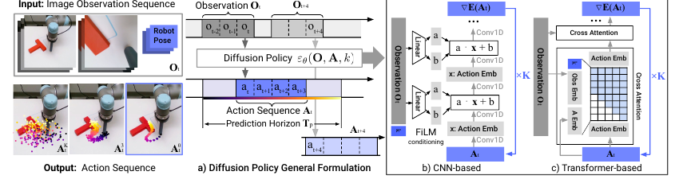
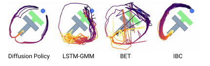

# [Diffusion Policy: Visuomotor Policy Learning via Action Diffusion](https://arxiv.org/abs/2303.04137)

## Convenient Links
* [Paper (arXiv)](https://arxiv.org/abs/2303.04137)
* [Project Page](https://diffusion-policy.cs.columbia.edu/)
* [Official Code](https://github.com/real-stanford/diffusion_policy)
* [ACT note in this repo](./ACT.md)
* [OpenVLA note in this repo](./OpenVLA.md)

## 1. One-Sentence Summary

Diffusion Policy represents a robot visuomotor policy as a **conditional diffusion model over future action sequences**. Given recent visual and proprioceptive observations, the policy starts from Gaussian action noise, iteratively denoises it into a coherent action chunk, executes only the first few actions, and then replans in a receding-horizon loop.

## 2. Why This Paper Matters

Standard behavior cloning often writes the policy as a one-step regression problem:

$$
a_t = f_\theta(o_t)
$$

This is fragile for robot control because:

* Human demonstrations are often multimodal: the same observation can admit several valid actions.
* Robot actions are continuous, high-dimensional, and precision-sensitive.
* Independently predicted one-step actions can jitter, switch modes, and accumulate errors.

Diffusion Policy changes the policy structure:

$$
\pi_\theta(A_t \mid O_t)
$$

where $O_t$ is a recent observation window and $A_t$ is a future action sequence. The action sequence is not directly regressed; it is generated by an iterative denoising process.

The paper evaluates the method on `15` tasks from `4` manipulation benchmarks and reports an average success-rate improvement of about `46.9%`. More importantly, it identifies several design choices that later robot learning systems repeatedly reuse: action chunks, receding-horizon control, position control, visual conditioning, and diffusion-based multimodal action modeling.

## 3. Policy Representation


*Figure adapted from the paper: explicit policies directly predict actions, implicit policies optimize an energy function, and Diffusion Policy follows a learned action-score / denoising field.*

The paper compares three policy representations:

* **Explicit policy**: directly predicts actions using regression, GMMs, or categorical bins.
* **Implicit policy**: learns an energy function $E_\theta(o, a)$ and searches for low-energy actions at inference time.
* **Diffusion policy**: learns a denoising / score field and iteratively refines noisy actions into valid actions.

Diffusion Policy keeps the multimodal expressiveness of implicit policies, but avoids the unstable negative-sampling and normalization-constant issues that often appear in energy-based behavior cloning.

## 4. DDPM Background

A standard DDPM learns a data distribution $p(x_0)$. The closed-form forward noising process is:

$$
q(x_k \mid x_0)
=
\mathcal{N}
\left(
x_k;
\sqrt{\bar{\alpha}_k}x_0,
(1-\bar{\alpha}_k)I
\right)
$$

Equivalently:

$$
x_k
=
\sqrt{\bar{\alpha}_k}x_0
+
\sqrt{1-\bar{\alpha}_k}\epsilon,
\qquad
\epsilon \sim \mathcal{N}(0, I)
$$

The noise-prediction network $\epsilon_\theta$ is trained with:

$$
\mathcal{L}_{\text{DDPM}}
=
\mathbb{E}_{x_0,k,\epsilon}
\left[
\left\|
\epsilon
-
\epsilon_\theta(x_k, k)
\right\|_2^2
\right]
$$

At inference time, the model starts from $x_K \sim \mathcal{N}(0, I)$ and repeatedly predicts noise to denoise the sample. The paper also interprets the update as noisy gradient descent:

$$
x_{k-1}
=
\alpha_k
\left(
x_k
-
\gamma_k \epsilon_\theta(x_k, k)
+
\sigma_k z
\right),
\qquad
z \sim \mathcal{N}(0, I)
$$

Intuitively, $\epsilon_\theta$ learns the direction that moves a noisy sample back toward the data manifold.

## 5. Diffusion Policy Formulation

For robot control, the generated object is not an image. It is a future action sequence:

$$
A_t^0
=
\left[
a_t,\,
a_{t+1},\,
\dots,\,
a_{t+T_p-1}
\right]
\in
\mathbb{R}^{T_p \times d_a}
$$

The conditioning input is the recent observation window:

$$
O_t
=
\left[
o_{t-T_o+1},\,
\dots,\,
o_t
\right]
$$

The noisy action sequence is:

$$
A_t^k
=
\sqrt{\bar{\alpha}_k}A_t^0
+
\sqrt{1-\bar{\alpha}_k}\epsilon
$$

The conditional denoising objective is:

$$
\mathcal{L}
=
\mathbb{E}_{A_t^0,O_t,k,\epsilon}
\left[
\left\|
\epsilon
-
\epsilon_\theta(O_t, A_t^k, k)
\right\|_2^2
\right]
$$

Here $\epsilon_\theta(O_t, A_t^k, k)$ is the policy network. It sees the current observation window, a noisy future action sequence, and the diffusion timestep, then predicts the noise component in the action sequence.

## 6. Overall Pipeline



*Figure adapted from the paper: observations condition the denoising network, and the model iteratively denoises a future action sequence.*

The full pipeline is:

```text
latest observations O_t
-> visual / proprioceptive encoder
-> initialize noisy future action sequence A_t^K ~ N(0, I)
-> repeat denoising K times with epsilon_theta(O_t, A_t^k, k)
-> obtain denoised action sequence A_t^0
-> execute the first T_a actions
-> observe again and replan
```

There are three horizons:

* $T_o$: observation horizon, the number of recent observation steps.
* $T_p$: prediction horizon, the number of future actions generated by diffusion.
* $T_a$: action / execution horizon, the number of actions executed before replanning.

Usually:

$$
T_a \le T_p
$$

This design balances two goals:

* Generate a short sequence so nearby actions are temporally consistent.
* Execute only part of the sequence so the controller remains closed-loop and reactive.

## 7. Receding-Horizon Control

At time $t$, the policy predicts:

$$
\hat{A}_t
=
\left[
\hat{a}_t,\,
\hat{a}_{t+1},\,
\dots,\,
\hat{a}_{t+T_p-1}
\right]
$$

Only the first $T_a$ actions are executed:

$$
\hat{a}_t,\,
\hat{a}_{t+1},\,
\dots,\,
\hat{a}_{t+T_a-1}
$$

Then the robot collects new observations and samples a new action sequence.

This is receding-horizon control. It is not just a speed trick. It is the mechanism that lets diffusion sampling work as a closed-loop robot policy.

The trade-off is:

* If $T_a$ is too short, the robot may not get enough temporal consistency.
* If $T_a$ is too long, the robot reacts too slowly to changes.

The paper finds that an action horizon around `8` steps works well for many tested tasks.


*Figure adapted from the paper: action horizon has a consistency-responsiveness trade-off; receding-horizon position control is also robust to several steps of latency.*

## 8. Why It Models Multimodal Actions Better



*Figure adapted from the paper: in Push-T, there are multiple valid ways to approach the object; Diffusion Policy samples different modes but commits to one mode within a rollout.*

In demonstrations, the same state may have multiple valid actions. In Push-T, for example, the end-effector can approach the block from the left or from the right.

Single-step regression tends to average modes:

$$
\hat{a}
\approx
\frac{a_{\text{left}} + a_{\text{right}}}{2}
$$

For robot control, this average can be invalid.

GMMs and discretized action classifiers can represent multimodality, but they become hard to tune as action dimensionality grows. Diffusion Policy uses stochastic initialization and iterative denoising:

$$
A_t^K \sim \mathcal{N}(0, I)
\quad
\Longrightarrow
\quad
A_t^0 \sim p_\theta(A_t \mid O_t)
$$

Different noise initializations can converge to different action modes. Since the model generates a sequence rather than independent one-step actions, it is more likely to stay committed to one mode within a rollout.

## 9. Relationship to Implicit Policies / EBMs

An implicit policy can be written as:

$$
p_\theta(a \mid o)
=
\frac{
\exp(-E_\theta(o,a))
}{
Z(o,\theta)
}
$$

where:

$$
Z(o,\theta)
=
\int \exp(-E_\theta(o,a))\,da
$$

is an intractable normalization constant.

Training often uses an InfoNCE-style approximation with negative samples:

$$
\mathcal{L}_{\text{InfoNCE}}
=
-
\log
\frac{
\exp(-E_\theta(o,a))
}{
\exp(-E_\theta(o,a))
+
\sum_{j=1}^{N_{\text{neg}}}
\exp(-E_\theta(o,\tilde{a}_j))
}
$$

Diffusion Policy avoids estimating $Z(o,\theta)$ directly. The score with respect to the action removes the normalization constant:

$$
\nabla_a \log p(a \mid o)
=
-
\nabla_a E_\theta(o,a)
-
\nabla_a \log Z(o,\theta)
=
-
\nabla_a E_\theta(o,a)
$$

The denoising network approximates a score-like direction:

$$
\epsilon_\theta(o,a,k)
\approx
-
\nabla_a \log p_k(a \mid o)
$$

So Diffusion Policy keeps the key advantage of implicit policies, namely multimodal action distributions, while training with a stable MSE noise-prediction objective.

## 10. Network Architectures

The paper studies two choices for $\epsilon_\theta$.

### CNN-Based Diffusion Policy

The CNN version applies 1D temporal convolutions over the action sequence:

$$
A_t^k \in \mathbb{R}^{T_p \times d_a}
\rightarrow
\epsilon_\theta(O_t,A_t^k,k)
$$

Observation features are injected into convolution layers with FiLM conditioning:

$$
\text{FiLM}(h)
=
\gamma(O_t,k) \odot h
+
\beta(O_t,k)
$$

Properties:

* Stable and easy to start with on new tasks.
* Works well with smooth position-control action spaces.
* Temporal convolutions have a low-frequency bias, which can hurt tasks requiring sharp, high-frequency velocity changes.

### Transformer-Based Diffusion Policy

The Transformer version treats noisy actions as tokens and uses observation embeddings as cross-attention context:

$$
\text{action tokens}
\xrightarrow{\text{causal self-attention + observation cross-attention}}
\text{noise tokens}
$$

Properties:

* Better suited for complex tasks and fast-changing action trajectories.
* More sensitive to hyperparameters.
* More computationally expensive than the CNN version.

## 11. Visual Conditioning

The model learns:

$$
p_\theta(A_t \mid O_t)
$$

instead of the joint distribution:

$$
p_\theta(A_t, O_t)
$$

This is an important design choice:

* The model does not need to generate future images or future observations.
* The visual encoder runs once per policy query.
* All diffusion iterations happen only in action space, which is much cheaper.

The paper uses a ResNet-18 visual encoder with two practical modifications:

* Replace global average pooling with spatial softmax to preserve spatial information.
* Replace BatchNorm with GroupNorm for more stable training with small batches and EMA-style training.

## 12. Training and Inference

Training:

```text
sample a demonstration window (O_t, A_t^0)
sample diffusion step k
sample Gaussian noise epsilon
construct noisy actions A_t^k
predict epsilon_hat = epsilon_theta(O_t, A_t^k, k)
optimize MSE(epsilon_hat, epsilon)
```

Inference:

```text
encode the current observation window O_t
sample A_t^K from Gaussian noise
for k = K, ..., 1:
    predict noise epsilon_theta(O_t, A_t^k, k)
    denoise one step
return A_t^0
execute the first T_a actions
```

Inference latency matters for real robots. The paper often uses `100` diffusion steps in simulation, but uses DDIM to reduce real-world inference to about `16` denoising steps.

## 13. Action Normalization

The paper emphasizes that action normalization is critical. A common approach is to scale each action dimension to `[-1, 1]`:

$$
\tilde{a}_i
=
2
\cdot
\frac{
a_i - a_i^{\min}
}{
a_i^{\max} - a_i^{\min} + \varepsilon
}
-
1
$$

The inverse transform is:

$$
a_i
=
\frac{\tilde{a}_i + 1}{2}
\left(a_i^{\max} - a_i^{\min}\right)
+
a_i^{\min}
$$

This matters because diffusion sampling is usually stabilized in a fixed range. If raw action dimensions are poorly scaled, some parts of the action space become difficult to reach during sampling.

## 14. Main Experimental Takeaways

The paper evaluates on:

* Robomimic: Lift, Can, Square, Transport, and ToolHang.
* Push-T: contact-rich pushing of a T-shaped block.
* Multimodal Block Pushing and Franka Kitchen.
* Real-world Push-T, mug flipping, sauce pouring, and sauce spreading.
* Real-world bimanual tasks: egg beater, mat unrolling, and shirt folding.

Key findings:

* Diffusion Policy outperforms LSTM-GMM, IBC, and BET across state-based and vision-based policies.
* Position control works especially well with Diffusion Policy because action-sequence prediction benefits from temporally coherent absolute targets.
* The action horizon has a consistency-responsiveness trade-off.
* End-to-end visual training is often more reliable than freezing a pretrained visual encoder.
* On real-world Push-T, end-to-end visual Diffusion Policy is close to human-level performance and clearly outperforms IBC and LSTM-GMM.


*Figure adapted from the paper: real-world Push-T comparisons show Diffusion Policy producing more consistent end states than LSTM-GMM and IBC.*

## 15. Limitations

Diffusion Policy is not a complete solution to robot learning.

Main limitations:

* It is still imitation learning, so demonstration quality and coverage matter.
* Diffusion inference is slower than a single feed-forward regression policy.
* High-rate control may require fewer denoising steps, faster denoisers, or better samplers.
* Horizon choices still need tuning for each task family.
* Visual representation learning remains sensitive to data augmentation and training setup.
* It does not directly solve language grounding, cross-robot transfer, or internet-knowledge transfer. Those are the focus of systems such as RT-2 and OpenVLA.

## 16. Relationship to ACT and VLA Models

Diffusion Policy and [ACT](./ACT.md) both predict **future action chunks**, but they use different probabilistic structures:

* ACT uses a CVAE plus a Transformer decoder to directly predict an action chunk.
* Diffusion Policy uses conditional denoising to generate an action chunk from noise.
* ACT uses temporal ensembling to combine overlapping chunks at every timestep.
* Diffusion Policy emphasizes receding-horizon execution: sample a chunk, execute the first few actions, and then replan.

Compared with RT-1, RT-2, and OpenVLA:

* Diffusion Policy is not a language-conditioned generalist VLA.
* It is better understood as a strong continuous-control visuomotor policy head.
* A large VLA system can use a language / vision-language backbone for high-level grounding and a diffusion-style decoder for continuous low-level actions.

## 17. Key Takeaways

* The key idea is not merely "use diffusion for robotics"; it is to model the **distribution of future action sequences**.
* Conditional noise prediction is more stable than EBM-style negative-sampling objectives.
* Receding-horizon execution is the core control mechanism that makes iterative diffusion sampling usable on robots.
* Treating vision as conditioning, not as something to generate, keeps inference practical.
* For real robots, action normalization, position control, visual encoder training, and the number of inference steps are all important implementation details.

