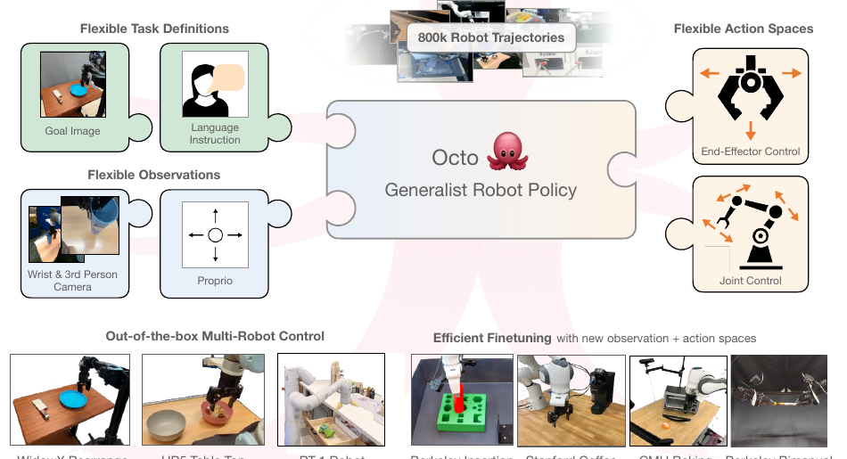
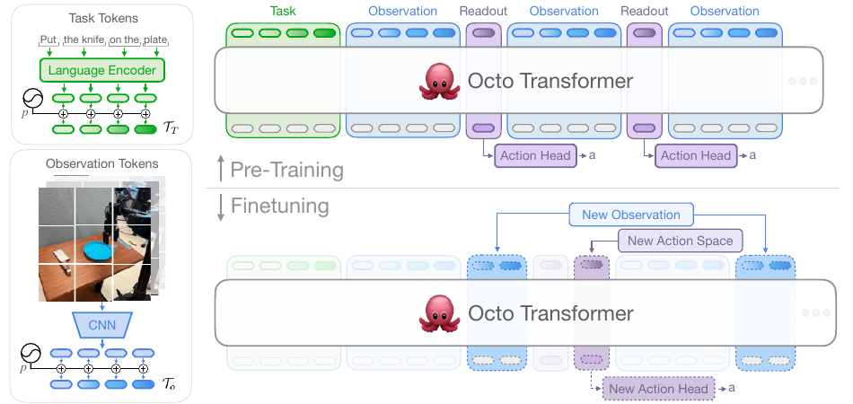
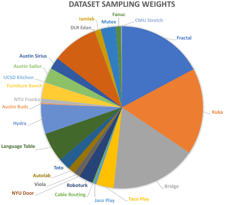
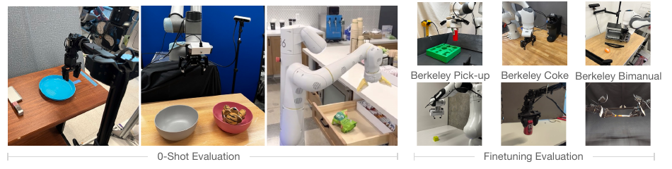
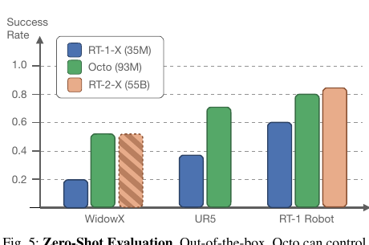
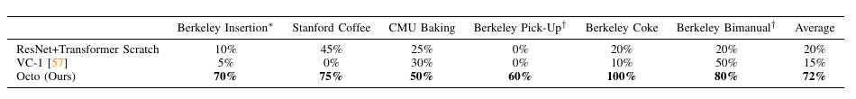
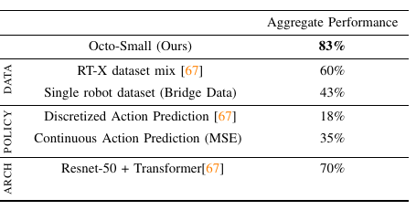
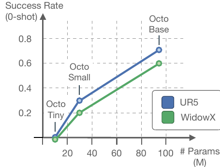

# [Octo: An Open-Source Generalist Robot Policy](https://arxiv.org/abs/2405.12213)

## Convenient Links
* [Paper (arXiv)](https://arxiv.org/abs/2405.12213)
* [Project Page](https://octo-models.github.io/)
* [Official Code](https://github.com/octo-models/octo)
* [Open X-Embodiment note in this repo](./Open_X_Embodiment.md)
* [Diffusion Policy note in this repo](./Diffusion_Policy.md)
* [RT-1 note in this repo](./RT_1.md)
* [OpenVLA note in this repo](./OpenVLA.md)

## 1. One-Sentence Summary

Octo is an open-source generalist robot policy pretrained on about **800k robot trajectories** from Open X-Embodiment. It uses a transformer backbone over flexible task and observation tokens, then decodes continuous action chunks with a diffusion action head, enabling out-of-the-box multi-robot control and efficient finetuning to new sensors, action spaces, and robot embodiments.

## 2. Why This Paper Matters

Most robot policies are trained for one robot, one sensor setup, one action space, and one task distribution. That makes every new robot setup expensive:

```text
new robot or task
-> collect demonstrations
-> train a policy from scratch
-> repeat
```

Octo asks a different question:

> Can we pretrain one open robot policy on many robot datasets, then reuse it as a strong initialization for new robot setups?

The paper matters because it focuses on **usable generalist robot policies**, not just benchmark scaling:

* flexible task definitions: language or goal images
* flexible observations: third-person cameras, wrist cameras, and new observation adapters
* flexible action spaces: end-effector deltas, joint control, and new action heads
* open-source checkpoints and training code
* practical finetuning on consumer GPUs



*Figure adapted from the paper: Octo is designed as a flexible generalist robot policy that can handle multiple task definitions, observation spaces, and action spaces.*

## 3. Core Problem

A generalist robot policy must handle heterogeneity across:

* robot embodiments
* cameras and sensor layouts
* task specifications
* action spaces
* environments
* dataset formats
* compute budgets for downstream finetuning

This is harder than ordinary vision-language pretraining because robot datasets are not just static input-output pairs. They encode closed-loop behavior:

$$
\pi(a_t \mid o_{\le t}, \tau)
$$

where:

* $o_{\le t}$ is the observation history
* $\tau$ is the task definition, such as language or goal image
* $a_t$ is a continuous robot action

Octo extends this to action chunks:

$$
\pi(A_t \mid O_t, \tau)
$$

where:

$$
A_t =
\left[
a_t,\,
a_{t+1},\,
\dots,\,
a_{t+H_a-1}
\right]
$$

is a future action sequence.

## 4. High-Level Architecture



*Figure adapted from the paper: task tokens and observation tokens are processed by a transformer; learned readout tokens feed lightweight action heads.*

Octo has three main parts:

```text
task / observation tokenizers
-> Octo transformer backbone
-> readout tokens
-> diffusion action head
-> continuous action chunk
```

The paper writes the model abstractly as:

$$
T_\ell, T_g, T_o
=
\operatorname{Tokenizer}(\ell, g, o_{1:H})
$$

$$
e_\ell, e_g, e_o
=
\mathcal{T}(T_\ell, T_g, T_o)
$$

$$
a = R(e)
$$

where:

* $T_\ell$ are language task tokens
* $T_g$ are goal-image task tokens
* $T_o$ are observation tokens
* $\mathcal{T}$ is the Octo transformer
* $R$ is a readout head, usually the diffusion action head

## 5. Task and Observation Tokenizers

Octo converts all inputs into a shared token interface.

### 5.1 Language Tokens

Language instructions are tokenized and passed through a frozen pretrained T5-base encoder:

$$
\ell
\rightarrow
T_\ell
\in
\mathbb{R}^{L \times D}
$$

The paper uses T5-base with `111M` parameters and produces a sequence of `16` language embedding tokens.

### 5.2 Goal Image Tokens

Goal images are treated as another task specification:

$$
g
\rightarrow
T_g
$$

This lets the same policy support tasks such as:

```text
do what leads from the current image to this goal image
```

Goal image conditioning is important because many robot datasets lack rich language annotations.

### 5.3 Observation Tokens

RGB observations, such as third-person and wrist camera images, are passed through a shallow convolutional stack and split into flattened patches:

$$
o_t
\rightarrow
T_{o,t}
\in
\mathbb{R}^{N_p \times D}
$$

In the released Octo setup:

* third-person images use `256 x 256` resolution and produce `256` patch tokens
* wrist images use `128 x 128` resolution and produce `64` patch tokens
* patch size is `16 x 16`

The paper reports that smaller `16 x 16` patches worked better than `32 x 32` patches, especially for grasping and fine-grained tasks.

## 6. Transformer and Block-Wise Attention

Octo arranges tokens in blocks:

```text
task tokens,
observation tokens at t=1,
readout token at t=1,
observation tokens at t=2,
readout token at t=2,
...
```

The transformer uses block-wise masked attention:

* task tokens encode the task context
* observation tokens at time `t` can attend to task tokens and observation tokens from time `<= t`
* readout tokens passively read task and observation tokens
* observation and task tokens do not attend to readout tokens
* missing modalities can be masked out

This matters because it enables modular finetuning.

For example, if a downstream task adds a new wrist camera or force-torque sensor, Octo can add:

```text
new tokenizer + new position embeddings
```

without reinitializing the pretrained transformer backbone.

## 7. Readout Tokens

Octo inserts learned readout tokens:

$$
T_{R,t}
$$

A readout token acts like a task-conditioned summary of the observation history up to time `t`.

It is similar in spirit to a `[CLS]` token:

$$
e_{R,t}
=
\mathcal{T}(T_\ell, T_g, T_{o,1:t}, T_{R,t})
$$

Then an action head consumes the readout embedding:

$$
A_t = R(e_{R,t})
$$

The readout-token design is one of Octo's key modularity choices:

* the transformer produces generic multimodal context embeddings
* output heads can be swapped or added for new action spaces
* new readouts can be added without changing the input tokenizers

## 8. Diffusion Action Head

Octo uses a conditional diffusion head for continuous action prediction.

The action head predicts an action chunk:

$$
A_t^0
=
\left[
a_t,\,
a_{t+1},\,
\dots,\,
a_{t+H_a-1}
\right]
$$

Starting from Gaussian noise:

$$
x_K \sim \mathcal{N}(0,I)
$$

the diffusion head iteratively denoises:

$$
x_{k-1}
=
\alpha_k
\left(
x_k
-
\gamma_k
\epsilon_\theta(x_k, e_R, k)
+
\mathcal{N}(0,\sigma_k^2 I)
\right)
$$

where:

* $x_k$ is the noisy action chunk at diffusion step `k`
* $e_R$ is the transformer readout embedding
* $\epsilon_\theta$ is a small denoising network
* $\alpha_k, \gamma_k, \sigma_k$ define the noise schedule

The training objective follows DDPM-style noise prediction:

$$
\mathcal{L}_{\text{diffusion}}
=
\mathbb{E}_{A^0,k,\epsilon}
\left[
\left\|
\epsilon
-
\epsilon_\theta(A^k, e_R, k)
\right\|_2^2
\right]
$$

where:

$$
A^k
=
\sqrt{\bar{\alpha}_k}A^0
+
\sqrt{1-\bar{\alpha}_k}\epsilon
$$

The paper reports that diffusion action heads outperform both:

* MSE action heads, which can produce slow "hedging" behavior
* discrete action heads, which can be decisive but lose precision

The released model uses a 3-layer MLP diffusion action head with residual connections, layer normalization, a cosine noise schedule, and `20` diffusion steps.

## 9. Training Data



*Figure adapted from the paper: Octo trains on a curated mixture of 25 Open X-Embodiment datasets.*

Open X-Embodiment contains around `1.5M` robot episodes. Octo curates about `800k` trajectories from it.

The Octo mixture uses `25` datasets, including:

* Fractal
* Kuka
* Bridge
* BC-Z
* Stanford Hydra
* Language Table
* Taco Play
* Furniture Bench
* Roboturk
* Berkeley Autolab UR5
* and other smaller datasets

The curation filters out datasets that:

* lack image streams
* do not use delta end-effector control
* are too repetitive
* have low image resolution
* are too niche for broad manipulation pretraining

The paper also aligns gripper actions so that:

$$
1 = \text{open gripper},
\qquad
0 = \text{closed gripper}
$$

## 10. Training Details

Octo trains two model sizes:

| Model | Layers | Hidden size | MLP size | Heads | Parameters |
|---|---:|---:|---:|---:|---:|
| Octo-Small | 12 | 384 | 1536 | 6 | 27M |
| Octo-Base | 12 | 768 | 3072 | 12 | 93M |

Important training details:

* optimizer: AdamW
* learning rate: `3e-4`
* weight decay: `0.1`
* gradient clipping: `1.0`
* batch size: `2048`
* schedule: inverse square-root decay with linear warmup
* warmup steps: `2000`
* observation history: `2` frames
* Octo-Base training: `300k` steps on a TPU v4-128 pod, about `14` hours
* finetuning: around `50k` steps, about `5` hours on a single NVIDIA A5000

The paper also uses hindsight goal relabeling: a future state from the trajectory can be selected as a goal image. This enables goal-image conditioning even when explicit goal labels are unavailable.

## 11. Evaluation Setup



*Figure adapted from the paper: Octo is evaluated on 9 real robot setups across 4 institutions.*

The evaluation covers:

* zero-shot control on robot setups seen in the pretraining distribution
* finetuning to new tasks and environments
* new observation inputs, such as force-torque sensing
* new action spaces, such as joint position control
* new robot embodiments, including bimanual setups

The robot setups include:

* WidowX BridgeV2
* UR5 Tabletop
* RT-1 Robot
* Berkeley Peg Insertion
* Stanford Coffee
* CMU Baking
* Berkeley Pick-Up
* Berkeley Coke
* Berkeley Bimanual

## 12. Main Results

### 12.1 Zero-Shot Multi-Robot Control



*Figure adapted from the paper: Octo outperforms RT-1-X on the tested zero-shot setups and performs similarly to RT-2-X where compared.*

Octo can control multiple robots out of the box when the setup is close to the pretraining distribution.

The paper reports:

* Octo outperforms RT-1-X on WidowX, UR5, and RT-1 Robot evaluations.
* Octo performs similarly to RT-2-X on the tested WidowX and RT-1 Robot tasks.
* Goal-image conditioning improves WidowX success rate by about `25%` compared with language conditioning.

### 12.2 Finetuning to New Domains



*Figure adapted from the paper: Octo finetuning outperforms training from scratch and VC-1 visual representation transfer across six downstream domains.*

Average success rates across six finetuning domains:

| Method | Average success |
|---|---:|
| ResNet + Transformer from scratch | 20% |
| VC-1 pretrained visual representation | 15% |
| Octo finetuning | 72% |

This is one of the most important results in the paper. Octo is not only a zero-shot policy; it is also a strong initialization for data-efficient robot policy learning.

### 12.3 Design Ablations



*Figure adapted from the paper: wider data mixtures, diffusion action heads, and transformer-first ViT-style architecture matter.*

The ablations show:

* full Octo-Small achieves `83%` aggregate performance in the WidowX ablation setup
* using the narrower RT-X dataset mix drops performance to `60%`
* using only single-robot Bridge data drops performance to `43%`
* replacing the diffusion head with MSE drops to `35%`
* discretized action prediction drops to `18%`
* ResNet-50 + Transformer reaches `70%`, below the transformer-first Octo design

### 12.4 Model Scaling



*Figure adapted from the paper: larger Octo models improve zero-shot performance on UR5 and WidowX tasks.*

The paper compares Octo-Tiny, Octo-Small, and Octo-Base. Larger models improve zero-shot success, especially in robustness to initial scene configuration and visual scene perception.

## 13. What Worked

The appendix summarizes several useful engineering lessons.

Things that improved performance:

* one frame of observation history during pretraining
* action chunking
* smaller `16 x 16` image patches instead of `32 x 32`
* large shuffle buffers and trajectory-level interleaving
* wide and diverse pretraining data mixtures
* diffusion action heads
* transformer-first architectures that concentrate compute in the backbone

## 14. What Did Not Work Yet

The paper also reports negative findings:

* MSE action heads caused slow hedging behavior.
* Discrete action heads were less precise for continuous control.
* ResNet encoders did not scale as well as the ViT-style tokenization under large-data pretraining.
* ImageNet pretrained ResNet encoders did not improve zero-shot evaluation.
* Relative gripper action representation reduced retrying behavior after grasp failure.
* Adding proprioceptive inputs during pretraining seemed worse in their setup, possibly due to causal confusion.
* Finetuning or enlarging the language model did not improve language-conditioned policy performance.

These negative results are useful because they clarify that the final Octo recipe is not arbitrary.

## 15. Limitations

Octo is a strong open generalist policy, but the paper is clear about limitations:

* wrist camera usage remains difficult because only a subset of the pretraining data contains wrist camera observations
* language annotations are limited in richness and coverage
* the model is trained mainly on single-arm and dual-arm manipulators, not navigation or mobile manipulation
* it is still behavior cloning, so data coverage and demonstration quality are limiting factors
* zero-shot generalization degrades for novel skills that are not represented in the pretraining data

## 16. Relation to RT-1, RT-2, OpenVLA, and Diffusion Policy

Compared with [RT-1](./RT_1.md):

* RT-1 is a transformer policy trained for a specific real-world robot setup.
* Octo generalizes the idea to multiple robot embodiments and flexible token interfaces.

Compared with RT-X / RT-2:

* Octo is fully open source.
* Octo is much smaller than RT-2-X but can perform similarly on some tested robot tasks.
* Octo emphasizes finetuning to new observation and action spaces.

Compared with [OpenVLA](./OpenVLA.md):

* OpenVLA is closer to a VLM-backed language-conditioned action-token model.
* Octo is a robot-policy-first transformer with flexible sensor/action adapters and continuous diffusion action decoding.

Compared with [Diffusion Policy](./Diffusion_Policy.md):

* Diffusion Policy focuses on action diffusion for visuomotor imitation learning.
* Octo uses a diffusion action head as the decoder inside a broader cross-embodiment generalist policy.

## 17. Key Takeaways

* Octo is an open-source generalist robot policy pretrained on a large Open X-Embodiment mixture.
* Its main architectural idea is a flexible token interface: task tokens, observation tokens, readout tokens, and action heads.
* Block-wise masked attention lets Octo add or remove modalities during finetuning.
* Diffusion action heads are important for continuous, multimodal robot control.
* The strongest practical result is not only zero-shot control, but data-efficient finetuning to new robots, observations, and action spaces.
* The paper's ablations suggest that data mixture, model scale, transformer-first architecture, and diffusion decoding all matter.

