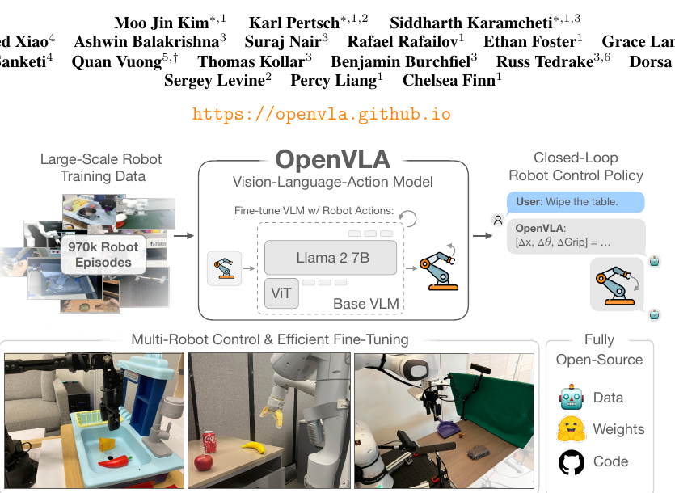
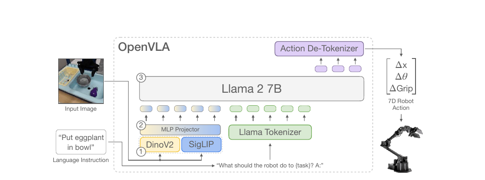
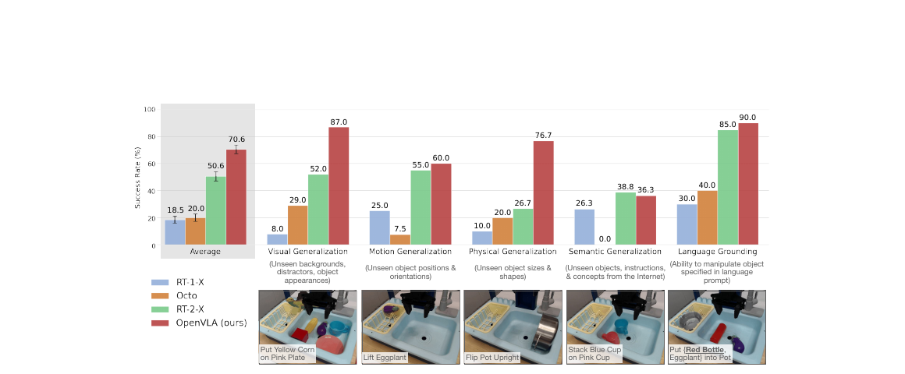
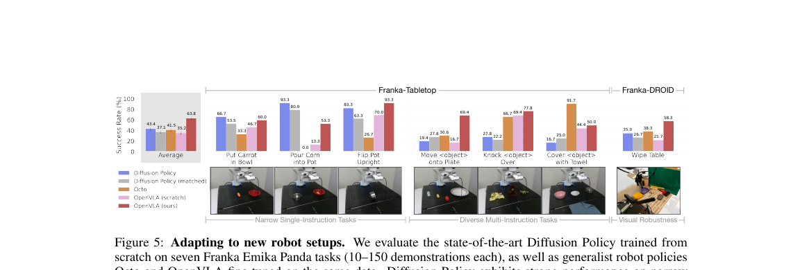
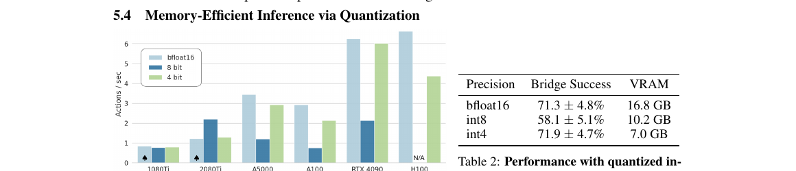

# [OpenVLA: An Open-Source Vision-Language-Action Model](https://arxiv.org/abs/2406.09246)

## Convenient Links
* [Paper (arXiv)](https://arxiv.org/abs/2406.09246)
* [Project Page](https://openvla.github.io/)
* [RT-2 note in this repo](./RT_2.md)

## 1. One-Sentence Summary

OpenVLA is a **7B open-source VLA** that fine-tunes a pretrained **Prismatic VLM** on **970k robot episodes** from **Open X-Embodiment**, treating robot control as **token prediction** and showing that a relatively compact open model can outperform much larger closed VLAs such as **RT-2-X (55B)** on broad real-world robot evaluations.

## 2. Why OpenVLA Matters

OpenVLA matters for two reasons at once:

1. It is a **strong generalist VLA**
   * not just a code release, but a state-of-the-art policy at the time of publication
2. It is the first paper that really treats **open VLA training, adaptation, and deployment** as first-class engineering problems
   * open weights
   * open training pipeline
   * practical LoRA fine-tuning
   * quantized inference on commodity GPUs

So compared with RT-2, the contribution is not only "another action-as-text policy". The real contribution is:

> a reproducible, open, reasonably sized VLA stack that people can actually fine-tune and run.

The paper repeatedly positions OpenVLA as an answer to two bottlenecks in previous VLAs:

* existing strong VLAs were largely **closed**
* efficient **fine-tuning to new robot domains** was underexplored

## 3. Core Idea

At a high level, OpenVLA keeps the RT-2-style idea of predicting actions as language-like tokens, but swaps in an **open-source VLM backbone** and builds a much more practical adaptation/deployment story around it.

```text
image + instruction
-> open VLM backbone
-> action tokens
-> de-tokenize
-> 7D robot control action
```

The paper's central claim is:

* if you start from a strong open VLM
* curate a large diverse robot dataset carefully
* and fine-tune it end-to-end for action-token prediction

then you can get a **generalist robot policy** that is both:

* strong out of the box
* easy to adapt to new robot tasks

## 4. High-Level Pipeline



*Figure adapted from the paper: OpenVLA connects large-scale robot data, an open 7B VLA, and practical closed-loop control plus efficient fine-tuning.*

The overall training/deployment story is:

```text
Open X robot trajectories
-> fine-tune Prismatic-7B VLM on robot actions
-> obtain OpenVLA
-> run directly as a multi-robot control policy
-> optionally adapt with full fine-tuning or LoRA
-> optionally serve with quantized inference
```

The paper emphasizes that all of the following are open:

* robot pretraining recipe
* model checkpoints
* PyTorch training code
* fine-tuning notebooks
* inference tooling

This openness is part of the research contribution, not just a packaging decision.

## 5. Architecture



*Figure adapted from the paper: OpenVLA uses a fused DINOv2 + SigLIP vision encoder, an MLP projector, and a Llama 2 7B language backbone.*

OpenVLA builds on **Prismatic-7B**, a patch-as-token VLM. The architecture has three main parts:

1. **Vision encoder**
   * fused **DINOv2 + SigLIP**
2. **Projector**
   * a small **2-layer MLP**
3. **Language backbone**
   * **Llama 2 7B**

The key detail is the visual encoder design:

* image patches are passed through **SigLIP**
* the same patches are also passed through **DINOv2**
* the resulting features are concatenated channel-wise

This fused visual backbone is important because the paper argues the two encoders bring different strengths:

* **SigLIP** contributes semantic alignment
* **DINOv2** contributes stronger low-level spatial features

That is a very natural fit for robotics, where the model must understand both:

* what object the user means
* where and how to move precisely

## 6. Action Formulation

Unlike RT-2, OpenVLA predicts a **7-dimensional robot action** rather than a terminate token plus a longer action string.

The control vector can be summarized as:

$$
a_t =
\left[
\Delta x_t,\Delta y_t,\Delta z_t,\;
\Delta r_t^x,\Delta r_t^y,\Delta r_t^z,\;
g_t
\right]
$$

where:

* `\Delta x,\Delta y,\Delta z` are end-effector translation deltas
* `\Delta r^x,\Delta r^y,\Delta r^z` are rotation deltas
* `g_t` is the gripper action

The user instruction is injected with a prompt like:

```text
What should the robot do to {task}? A:
```

The model then auto-regressively emits the tokenized action.

## 7. Training Objective and Tokenization

### 7.1 Action-As-Text Prediction

Let the discretized action-token sequence for timestep `t` be:

$$
y_t = [y_{t,1}, y_{t,2}, \dots, y_{t,7}]
$$

OpenVLA models the action with a standard autoregressive factorization:

$$
p_\theta(y_t \mid x_t, i_t)
=
\prod_{k=1}^{7}
p_\theta\!\left(y_{t,k} \mid x_t, i_t, y_{t,<k}\right)
$$

where:

* `x_t` is the image observation
* `i_t` is the language instruction

### 7.2 Per-Dimension Quantile Binning

Each action dimension is discretized independently into **256 bins**.

For action dimension `m`, define:

$$
\ell_m = Q_{0.01}\!\left(a^{(m)}\right),
\qquad
u_m = Q_{0.99}\!\left(a^{(m)}\right)
$$

where `Q_{0.01}` and `Q_{0.99}` are the 1st and 99th quantiles computed from training data.

Then the bin width is:

$$
\Delta_m = \frac{u_m - \ell_m}{256}
$$

and discretization can be written as:

$$
\hat{a}_t^{(m)}
=
\operatorname{clip}
\left(
\left\lfloor
\frac{a_t^{(m)} - \ell_m}{\Delta_m}
\right\rfloor,
0,
255
\right)
$$

This is a subtle but important difference from RT-2 style min-max discretization:

* RT-2 followed min-max style bounds
* OpenVLA uses **1% / 99% quantiles**

The reason is practical: outliers in robot data can otherwise stretch the discretization range too much and waste resolution.

### 7.3 Loss on Action Tokens Only

After tokenization, OpenVLA is trained with standard next-token cross-entropy, but the loss is computed **only on the action tokens**:

$$
\mathcal{L}_{\text{action}}(\theta)
=
- \sum_t \sum_{k=1}^{7}
\log p_\theta\!\left(
y_{t,k}^{*} \mid x_t, i_t, y_{t,<k}^{*}
\right)
$$

So conceptually this is language-model training, but the target sequence is a short action string rather than natural language.

### 7.4 Action De-Tokenization

At inference time, the predicted bin can be converted back to a continuous action value by mapping it to the corresponding interval, for example its center:

$$
\tilde{a}_t^{(m)}
=
\ell_m + \left(\hat{a}_t^{(m)} + \frac{1}{2}\right)\Delta_m
$$

The paper focuses more on the tokenization side than on the exact de-tokenization formula, but this is the natural inverse of the discretization rule.

## 8. Data: 970k Robot Episodes from Open X-Embodiment

OpenVLA is trained on a curated **970k-episode** subset of **Open X-Embodiment (OpenX)**.

The full OpenX collection at the time had:

* 70+ datasets
* 2M+ robot trajectories

OpenVLA does **not** use the raw pool directly. The curation goals are:

1. **consistent input / output spaces**
2. **balanced diversity of robots, tasks, and scenes**

To enforce consistency, the paper follows RT-X / Octo style filtering:

* keep **manipulation** datasets
* require at least one **third-person camera**
* use **single-arm end-effector control**

For mixture balancing, OpenVLA reuses **Octo's mixture weights**, which down-weight less diverse datasets and up-weight higher-diversity ones.

One practical detail is especially worth noting:

* they experimented with adding **DROID** at `10%` mixture weight
* but observed persistently low action-token accuracy
* so DROID was **removed during the final third of training**

This is a good example of the paper's engineering style: the authors are not just scaling data blindly; they explicitly track whether the model is actually fitting each source.

## 9. Key Design Decisions

The paper spends useful effort on smaller-scale design exploration before launching the final training run. These lessons are more informative than just reporting the final model.

### 9.1 Why Prismatic?

They compared multiple open VLM backbones, including:

* **IDEFICS-1**
* **LLaVA**
* **Prismatic**

The main finding was:

* IDEFICS-1 and LLaVA were similar on simple one-object tasks
* LLaVA was better than IDEFICS-1 on multi-object language grounding
* Prismatic was better still, likely due to its fused **SigLIP + DINOv2** visual backbone

So the choice of Prismatic is not arbitrary; it is backed by robotics-specific language grounding and spatial reasoning results.

### 9.2 Image Resolution

They compared:

* `224 x 224`
* `384 x 384`

and found no real policy improvement from higher resolution, while `384` took about **3x longer** to train.

So the final OpenVLA model uses:

* **224 x 224** input images

This is a good reminder that VLM best practices do not automatically transfer to VLA best practices.

### 9.3 Fine-Tune the Vision Encoder

Prior VLM work often prefers freezing the visual encoder. OpenVLA finds the opposite for VLA training:

* **fine-tuning the vision encoder is crucial**

The likely reason is intuitive: robot control needs very fine-grained spatial details that a frozen web-pretrained encoder may not preserve strongly enough.

### 9.4 More Epochs than Typical VLM Training

The paper notes that VLA training benefited from **many more passes** over the robot data than standard LLM/VLM training.

Their final run completes:

* **27 epochs**

and real-robot performance keeps improving until action-token accuracy exceeds about:

* **95%**

### 9.5 Learning Rate

They report best results with:

* fixed learning rate `2e-5`

and do **not** find learning rate warmup helpful.

## 10. Training and Inference Infrastructure

The final OpenVLA run uses:

* **64 A100 GPUs**
* **14 days**
* about **21,500 A100-hours**
* batch size **2048**

At inference time:

* **bfloat16** OpenVLA needs about **15 GB** GPU memory
* it runs at about **6 Hz** on **one RTX 4090**

The released codebase includes:

* AMP
* FlashAttention
* FSDP
* HuggingFace `AutoModel` integration
* LoRA fine-tuning
* quantized inference
* remote inference server for streaming actions to robots

This makes OpenVLA notable not only as a paper result, but also as a **usable software stack**.

## 11. Main Results

### 11.1 Out-of-the-Box Generalist Performance



*Figure adapted from the paper: on BridgeData V2 WidowX evaluations, OpenVLA leads overall and beats RT-2-X in most categories except semantic generalization.*

The paper evaluates OpenVLA directly on two real robot setups:

1. **BridgeData V2 WidowX**
2. **Google Robot**

### BridgeData V2 WidowX

This suite contains:

* **17 tasks**
* **170 total rollouts**

covering:

* visual generalization
* motion generalization
* physical generalization
* semantic generalization
* language grounding

Mean success rate:

| Model | Mean Success Rate |
|:---|:---:|
| RT-1-X | `18.5 +- 2.7%` |
| Octo | `20.0 +- 2.6%` |
| RT-2-X | `50.6 +- 3.5%` |
| OpenVLA | `70.6 +- 3.2%` |

This is the clearest headline result in the paper:

* OpenVLA beats the much larger **RT-2-X**
* and does so while being roughly **7x smaller** (`7B` vs `55B`)

The paper notes one exception:

* **semantic generalization** remains a strength of RT-2-X

That makes sense, because RT-2-X uses larger-scale Internet co-training and preserves more raw web semantics.

### Google Robot

This suite contains:

* **12 tasks**
* **60 total rollouts**

with both:

* in-distribution tasks
* out-of-distribution tasks

Mean success rate:

| Model | Mean Success Rate |
|:---|:---:|
| RT-1-X | `33.3 +- 6.1%` |
| Octo | `26.7 +- 5.8%` |
| RT-2-X | `78.3 +- 5.4%` |
| OpenVLA | `85.0 +- 4.6%` |

Here OpenVLA and RT-2-X are closer, but OpenVLA is still slightly stronger overall.

### Main Takeaway

Across both platforms, the paper's message is:

* **Internet-pretrained VLAs clearly beat non-VLA generalist robot policies**
* and a carefully trained **open 7B VLA can rival or beat a closed 55B model**

### 11.2 Data-Efficient Adaptation to New Robot Setups



*Figure adapted from the paper: OpenVLA is especially strong when fine-tuned on diverse multi-instruction tasks, not just narrow single-skill settings.*

The fine-tuning experiments use:

* **Franka-Tabletop** (`5 Hz`)
* **Franka-DROID** (`15 Hz`)

with only:

* **10 to 150 demonstrations per task**

The main comparison is against:

* **Diffusion Policy** from scratch
* **Diffusion Policy (matched)**
* **Octo** fine-tuned
* **OpenVLA (scratch)**, i.e. fine-tuning base Prismatic without OpenX robot pretraining
* **OpenVLA**

Average performance:

| Setup | Diffusion Policy | Diffusion Policy (matched) | Octo | OpenVLA (scratch) | OpenVLA |
|:---|:---:|:---:|:---:|:---:|:---:|
| Franka-Tabletop | `48.5 +- 4.9%` | `43.4 +- 4.7%` | `43.4 +- 4.4%` | `43.4 +- 4.6%` | `67.2 +- 4.0%` |
| Franka-DROID | `35.0 +- 8.0%` | `26.7 +- 7.5%` | `38.3 +- 8.5%` | `21.7 +- 6.6%` | `58.3 +- 7.2%` |

The pattern is important:

* **Diffusion Policy** is strong on narrow single-instruction tasks
* **OpenVLA** is stronger on multi-instruction, language-grounded, distractor-heavy tasks

So OpenVLA is not simply "better imitation learning". It is especially better when:

* multiple objects are present
* the target object must be chosen from language
* visual robustness matters

The `OpenVLA (scratch)` ablation also shows that **large-scale robot pretraining really matters**.

### 11.3 Parameter-Efficient Fine-Tuning

One of the most practically useful parts of the paper is Section 5.3.

The authors compare:

* full fine-tuning
* last-layer-only
* frozen vision
* sandwich fine-tuning
* **LoRA**

Reported results:

| Strategy | Success Rate | Train Params (M) | VRAM (batch 16) |
|:---|:---:|:---:|:---:|
| Full FT | `69.7 +- 7.2%` | `7188.1` | `163.3 GB` |
| Last layer only | `30.3 +- 6.1%` | `465.1` | `51.4 GB` |
| Frozen vision | `47.0 +- 6.9%` | `6760.4` | `156.2 GB` |
| Sandwich | `62.1 +- 7.9%` | `914.2` | `64.0 GB` |
| LoRA, rank=32 | `68.2 +- 7.5%` | `97.6` | `59.7 GB` |
| LoRA, rank=64 | `68.2 +- 7.8%` | `195.2` | `60.5 GB` |

The main conclusion is clear:

* **LoRA matches full fine-tuning surprisingly well**
* while training only about **1.4%** of parameters

The paper recommends:

* **LoRA rank `r = 32`**

and reports that with LoRA, OpenVLA can be adapted on a new task in:

* **10 to 15 hours on a single A100**

That is a very practical result.

### Important Caveat

The paper explicitly notes that the Section 5.3 / 5.4 efficiency experiments use a **slightly simplified OpenVLA variant**:

* smaller robot data mixture
* **SigLIP-only** vision backbone instead of fused DINOv2 + SigLIP

So these results should be interpreted as strong evidence for feasibility, not as a perfectly apples-to-apples measurement on the flagship fused model.

### 11.4 Quantized Inference



*Figure adapted from the paper: 4-bit quantization preserves policy quality while cutting memory substantially; 8-bit degradation is mainly a latency issue, not necessarily a modeling issue.*

The paper tests:

* `bfloat16`
* `int8`
* `int4`

on representative BridgeData V2 tasks.

Main numbers:

| Precision | Bridge Success | VRAM |
|:---|:---:|:---:|
| bfloat16 | `71.3 +- 4.8%` | `16.8 GB` |
| int8 | `58.1 +- 5.1%` | `10.2 GB` |
| int4 | `71.9 +- 4.7%` | `7.0 GB` |

The interesting detail is **why** `int8` underperforms:

* not mainly because the model quality collapses
* but because **inference becomes too slow**
* which changes the closed-loop robot dynamics under non-blocking control

Appendix D.4 confirms this interpretation:

* when all precisions are evaluated under **blocking control** to remove the latency confound
* `int8`, `int4`, and `bfloat16` perform comparably

So the real lesson is:

* for robot policies, **latency is part of model quality**

This is a strong robotics-specific systems insight.

### 11.5 Appendix Ablation Insights

The appendix adds two valuable ablation conclusions:

### OpenX pretraining matters a lot

Table 9 compares:

* **OpenVLA**
* **OpenVLA-Bridge**: no OpenX pretraining, only BridgeData V2
* **OpenVLA-Bridge-SigLIP**: also removes DINOv2

Mean success:

| Model | Mean Success Rate |
|:---|:---:|
| OpenVLA | `76.3 +- 4.8%` |
| OpenVLA-Bridge | `45.6 +- 5.6%` |
| OpenVLA-Bridge-SigLIP | `40.6 +- 5.5%` |

So:

* **OpenX robot pretraining** is a huge factor
* the **DINOv2 fusion** helps too, but less dramatically

### Data cleaning matters

Appendix C explains an important practical detail:

* the original BridgeData V2 contained many **all-zero / no-op actions**
* these could cause policies to freeze
* OpenVLA filters them out during training

This likely contributes to OpenVLA's particularly strong BridgeData V2 performance relative to RT-2-X.

## 12. Why OpenVLA Works

OpenVLA's gains come from combining several ingredients rather than one magic trick:

1. **A strong open VLM backbone**
   * Prismatic-7B already aligns vision and language well
2. **A fused visual encoder**
   * SigLIP for semantics, DINOv2 for spatial detail
3. **Large and diverse robot pretraining**
   * 970k curated OpenX episodes
4. **Engineering discipline**
   * mixture curation
   * filtering no-op actions
   * choosing lower image resolution when it is enough
5. **Practical adaptation/deployment support**
   * LoRA and quantization are built into the story, not added later as an afterthought

This is why OpenVLA is more than "open RT-2". It is a deliberately engineered **research platform** for VLA work.

## 13. OpenVLA vs RT-2 and Octo

| Aspect | RT-2 | Octo | OpenVLA |
|:---|:---|:---|:---|
| Backbone style | Large VLM repurposed for action | Transformer robot policy trained from scratch | Open Prismatic VLM repurposed for action |
| Output interface | action-as-text tokens | custom robot action policy head | action-as-text tokens |
| Scale | up to 55B in evaluated variants | ~93M | 7B |
| Web-data co-training during VLA phase | yes, central to RT-2 | no | no, starts from pretrained VLM then robot-fine-tunes |
| Openness | largely closed | open | open |
| Fine-tuning story | limited in the paper | supported | major focus of the paper |
| Quantization / consumer deployment | not central | not central | explicitly studied |

The simplest summary is:

* **RT-2** proved the VLA concept at large scale
* **Octo** showed open generalist robot policies
* **OpenVLA** combined the two directions into an open, practical action-as-text VLA stack

## 14. Limitations

The paper is explicit about current weaknesses:

1. **Single-image input only**
   * no observation history, no richer multimodal sensory stack yet
2. **Inference throughput is still limited**
   * especially for high-frequency control settings like ALOHA-style manipulation
3. **Reliability is still far from solved**
   * many tasks remain below `90%` success
4. **Dexterity is weaker than specialized policies**
   * Diffusion Policy can still be smoother on narrow precise tasks
5. **Major VLA design questions remain open**
   * effect of larger base VLMs
   * whether robot+web co-training like RT-2 would help
   * best visual feature choices for VLA control

So OpenVLA should be viewed as a strong open baseline and platform, not as the final answer to general robot intelligence.

## 15. Final Takeaways

OpenVLA is one of the most important VLA papers to read after RT-2 because it shifts the conversation from:

```text
Can giant VLMs control robots?
```

to:

```text
Can an open VLA be strong, adaptable, and practical?
```

Its answer is largely yes.

If you only remember a few points, remember these:

1. **OpenVLA is a 7B open-source VLA built on Prismatic, DINOv2 + SigLIP, and Llama 2**
2. **It tokenizes 7D robot control and trains with standard next-token cross-entropy on action tokens only**
3. **It beats RT-2-X on broad real-world evaluations despite being much smaller**
4. **LoRA and 4-bit inference make adaptation and deployment meaningfully more practical**
5. **OpenX pretraining and careful data curation are at least as important as raw model architecture**
