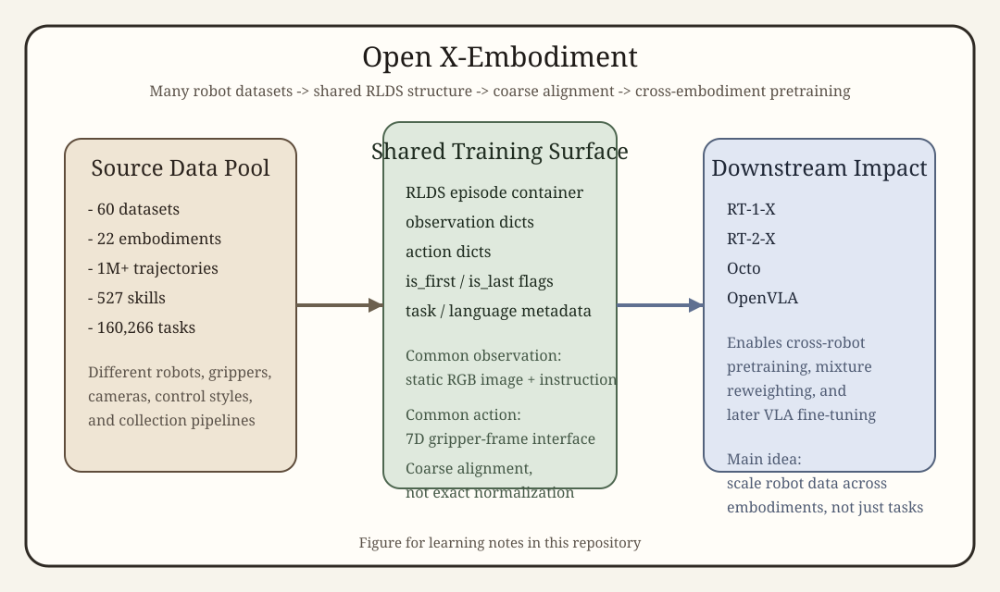

# [Open X-Embodiment: Robotic Learning Datasets and RT-X Models](https://arxiv.org/abs/2310.08864)

## Convenient Links
* [Paper (arXiv)](https://arxiv.org/abs/2310.08864)
* [Project Page](https://robotics-transformer-x.github.io/)
* [GitHub Repository](https://github.com/google-deepmind/open_x_embodiment)
* [RT-2 note in this repo](./RT_2.md)
* [OpenVLA note in this repo](./OpenVLA.md)

## 1. One-Sentence Summary

Open X-Embodiment is a large community-scale **robot learning dataset and standardization effort** that pools more than **1 million** real robot trajectories across **22 embodiments** and **60 datasets** into a shared RLDS-style format, so researchers can study **cross-embodiment pretraining** instead of training each robot policy from one lab's siloed data only.

## 2. Why Open X-Embodiment Matters

Before Open X-Embodiment, most robot learning pipelines had a strong data bottleneck:

* each lab collected data on its own robot
* observation spaces were different
* action interfaces were different
* language annotations were inconsistent
* trained policies usually transferred poorly outside the original setup

So the core question behind Open X-Embodiment is:

> Can robot learning benefit from the same "more diverse pretraining data" story that helped vision and language?

This is why the paper matters. It is not just releasing a big dataset. It is trying to establish a new training regime:

```text
many labs + many robots + many tasks
-> coarsely standardized shared dataset
-> one pretraining pool
-> better robot policies on many embodiments
```

From today's perspective, Open X-Embodiment is one of the most important data papers behind later generalist robot systems such as **RT-X**, **Octo**, and **OpenVLA**.

## 3. What "X-Embodiment" Means

The "`X`" in Open X-Embodiment means the dataset is intentionally built across **many embodiments**, not one canonical robot.

Here "embodiment" includes differences such as:

* robot arm morphology
* gripper type
* camera placement
* workspace geometry
* control interface
* task distribution

The paper's key bet is that useful robot knowledge is partly **shared across embodiments**.

For example:

* "move the end effector toward the target"
* "close the gripper around an object"
* "align the grasp with the object pose"

are not identical across robots, but they are not unrelated either.

So Open X-Embodiment does **not** assume that all robots are already perfectly aligned. Instead, it asks whether **coarse alignment plus scale** is enough to create positive transfer.

## 4. What the Release Contains

The project page summarizes the release with the following scale:

* **60 datasets**
* **22 embodiments**
* **1M+ trajectories**
* **527 skills**
* **160,266 tasks**

The resource is focused on **real-world robot manipulation data** rather than purely simulated trajectories.

The contributing datasets are diverse in several ways:

* different robot arms and grippers
* different camera viewpoints
* different task horizons
* different environments such as tabletops, kitchens, and lab workspaces
* different collection styles, including teleoperation and scripted data collection

This diversity is exactly the point. Open X-Embodiment is trying to turn "heterogeneity" from a nuisance into a training advantage.

## 5. High-Level Data Pipeline



*Figure created for this repo: Open X-Embodiment pools heterogeneous robot datasets, converts them into a shared RLDS-style structure, then uses a coarsely aligned observation/action interface to train RT-X style models and later open VLA systems.*

At a high level, the pipeline is:

```text
many robot datasets
-> convert to a common RLDS-like episode format
-> define a coarsely aligned observation/action interface
-> train cross-embodiment robot policies
-> evaluate transfer back on many robots
```

The important nuance is that the standardization is **practical**, not perfect.

It is not:

* one universal camera calibration
* one exact physical coordinate system
* one exact action semantics for every robot

It is instead a common enough interface that large sequence models can learn across sources.

## 6. Data Format: RLDS as the Shared Container

The Open X-Embodiment repository releases the data in **RLDS** format.

Conceptually, let the full resource be:

$$
\mathcal{D} = \bigcup_{m=1}^{M} \mathcal{D}^{(m)}
$$

where:

* $`\mathcal{D}^{(m)}`$ is the dataset from source `m`
* `M` is the number of contributing datasets

Each episode can be viewed abstractly as:

$$
\tau =
\left\{
\left(o_t, a_t, i, \mu_t\right)
\right\}_{t=1}^{T}
$$

where:

* $`o_t`$ is the observation at step `t`
* $`a_t`$ is the robot action
* `i` is the task or language instruction
* $`\mu_t`$ stands for metadata such as step flags or auxiliary fields

In practice, RLDS stores data as episodes of steps, where each step can contain:

* observation dictionaries
* action dictionaries
* `is_first`, `is_last`, `is_terminal`
* optional reward / discount fields
* optional language or task metadata

You can think of RLDS as the **container-level standardization layer**. It does not magically solve embodiment mismatch, but it makes different robot datasets loadable in one consistent pipeline.

## 7. Observation Interface

For the released RT-X checkpoints and project examples, the shared input interface is intentionally simple:

* a **single RGB image** from a static workspace camera
* a **language instruction**

This matters because it reduces one source of mismatch. Many robot datasets have extra modalities:

* wrist cameras
* depth
* force signals
* proprioception

But if every dataset used a totally different sensor bundle, cross-dataset training would become much harder. So Open X-Embodiment leans toward a **common denominator observation space** that many labs can provide.

That design choice is pragmatic:

* it loses some information
* but it greatly increases interoperability

## 8. Action Interface: Coarse Alignment, Not Exact Normalization

The released RT-X models use a shared **7-dimensional action space** expressed with respect to the **robot gripper frame**.

A concise way to write the action is:

$$
a_t =
\left[
\Delta x_t,\Delta y_t,\Delta z_t,\;
\Delta r_t^x,\Delta r_t^y,\Delta r_t^z,\;
g_t
\right]
$$

where:

* $`\Delta x,\Delta y,\Delta z`$ are translational motion commands
* $`\Delta r^x,\Delta r^y,\Delta r^z`$ are rotational motion commands
* $`g_t`$ is the gripper action

This looks very clean mathematically, but the paper is careful about an important caveat:

> the underlying datasets are only **coarsely aligned** in action semantics.

For example, different source datasets may differ in:

* absolute vs delta control
* velocity-like vs position-like commands
* control frequency
* frame conventions
* whether some action dimensions are meaningful at all

The Open X-Embodiment pipeline often handles this by:

* mapping source actions into the shared schema when possible
* setting irrelevant dimensions to zero when an embodiment does not use them
* keeping the shared space broad enough that many robots can fit into it

So the dataset's action space should be understood as:

* **useful for transfer**
* **not a physically exact universal robotics standard**

That distinction is one of the most important ideas in the whole paper.

## 9. The Learning View: Why This Dataset Enables Cross-Embodiment Pretraining

Once many robot datasets are written into one shared container and one coarse interface, a policy can be trained on the union of all of them.

At a high level, the behavior-cloning objective is:

$$
\mathcal{L}_{\text{BC}}(\theta)
=
- \sum_{m=1}^{M}
\sum_{\tau \in \mathcal{D}^{(m)}}
\sum_{t=1}^{T}
\log \pi_\theta\!\left(a_t \mid o_{\le t}, i\right)
$$

This is the main conceptual shift:

* traditional robot learning often trains on one dataset from one embodiment
* Open X-Embodiment encourages pretraining on the **union** of many embodiments

The expected payoff is that the model can learn:

* visual priors about common objects
* instruction-following patterns
* generic reaching / grasping regularities
* robustness to visual variation

before being evaluated or fine-tuned on any one robot.

## 10. RT-X: The Model Side of the Paper

The title of the paper is not only about the dataset. It also includes **RT-X models**, which are cross-embodiment variants of the Robotics Transformer family.

The project page presents two released model families:

* **RT-1-X**
* **RT-2-X**

The naming is intentional:

* **RT-1-X** extends the RT-1 style robot-policy idea to many embodiments
* **RT-2-X** combines cross-embodiment robot data with a stronger vision-language backbone

This is useful when reading the paper because Open X-Embodiment is not merely a passive data archive. The paper also asks:

> If we actually train large robot policies on this pooled data, do we get positive transfer?

The answer in the paper is broadly yes, but with some important caveats discussed below.

## 11. What the Paper Shows Empirically

The empirical message of the paper is not "all robots become interchangeable". It is more specific and more interesting.

### 11.1 Cross-Embodiment Data Usually Helps

Pooling data across embodiments generally improves performance relative to training only on local robot data, especially when a lab's own dataset is not very large.

This is the central result:

* extra heterogeneous robot data is often better than extra homogeneous robot data alone

In other words, scale matters in robotics too, even when the extra data is messy.

### 11.2 Model Capacity Matters

The paper also shows that the pooled dataset is large and heterogeneous enough that **model capacity becomes a real bottleneck**.

This is why the RT-X story has two parts:

* release a big dataset
* scale the model enough to actually absorb it

Smaller models can underfit the diversity of the combined resource, while stronger VLM-style backbones can benefit more from the same data pool.

### 11.3 Positive Transfer Is Strongest in the Lower-Data Regime

One of the most practically important findings is that cross-embodiment training is especially helpful for labs that do **not** already have huge in-house robot datasets.

That makes Open X-Embodiment scientifically important and also socially important:

* it lowers the barrier to entry
* it makes robot pretraining less exclusive to a few very large labs

### 11.4 Richer Semantic Generalization Needs More Than Just Pooling

Open X-Embodiment helps a lot, but it is not the whole story for semantic generalization.

This is why later systems diverge:

* **RT-2 / RT-2-X** emphasize web-scale VLM knowledge transfer
* **OpenVLA** emphasizes an open-source VLM backbone plus curated OpenX-style pretraining
* **Octo** emphasizes a practical open generalist robot policy stack

So the dataset solves a major data bottleneck, but it does not replace strong model architecture or language/vision pretraining.

## 12. Why Open X-Embodiment Became a Foundation for Later Work

The importance of Open X-Embodiment is easier to see when you place it historically:

1. **RT-1** showed that large-scale real robot imitation learning works
2. **Open X-Embodiment / RT-X** showed that robot data can be pooled across embodiments
3. **RT-2** showed how web-scale VLM semantics can be transferred into control
4. **OpenVLA** showed that an open VLM plus curated OpenX data can become a strong practical VLA

This is why the dataset keeps showing up in later papers.

For example:

* OpenVLA trains on a curated **970k-episode** subset of Open X-Embodiment
* Octo also uses large OpenX-style multi-robot training mixtures
* many open-source robotics pipelines now assume RLDS-compatible loading or OpenX-derived curation logic

So even when a later paper is "about the model", Open X-Embodiment is often the quiet data foundation underneath it.

## 13. Practical Reading Notes

If you see a later VLA paper say something like:

* "trained on OpenX"
* "Open X subset"
* "RT-X data mixture"
* "Octo mixture weights"

it usually implies several hidden assumptions:

1. the data came from many robot embodiments, not one
2. it was converted to a common episode format
3. the action interface was only coarsely aligned
4. data filtering and mixture weighting matter a lot

That is why Open X-Embodiment is worth studying directly instead of treating it as just a dataset name in somebody else's appendix.

## 14. Limitations

Open X-Embodiment is a major step forward, but it does not solve everything.

### The alignment is intentionally coarse

The shared observation/action space is good enough for training, but not a perfect canonical world model for all robots.

### Dataset quality is uneven

Different source datasets vary in:

* task coverage
* annotation quality
* sensor fidelity
* control conventions

So "more data" does not automatically mean "uniformly better data".

### Manipulation is still the center of gravity

The dataset is broad, but it is still mostly about manipulation-style tasks rather than the full range of embodied intelligence.

### Scaling alone does not solve planning and reasoning

Cross-embodiment pretraining improves reusable robot priors, but complex long-horizon reasoning still depends heavily on the model and training recipe.

## 15. Key Takeaways

1. **Open X-Embodiment is best understood as both a dataset and a standardization effort**
2. **Its main contribution is enabling cross-embodiment robot pretraining rather than perfect robot unification**
3. **RLDS provides the shared container, while a coarsely aligned observation/action interface provides the shared learning surface**
4. **The paper shows that heterogeneous multi-robot data can produce real positive transfer, especially in lower-data regimes**
5. **Later generalist robot systems such as RT-X, Octo, and OpenVLA are much easier to understand once you understand Open X-Embodiment**
