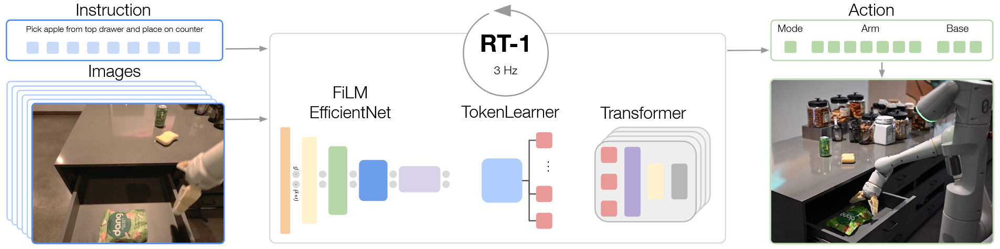
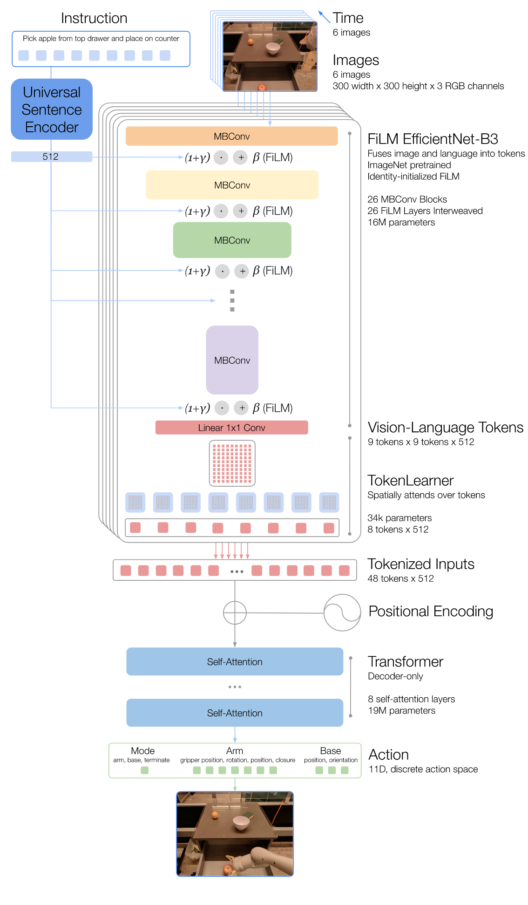
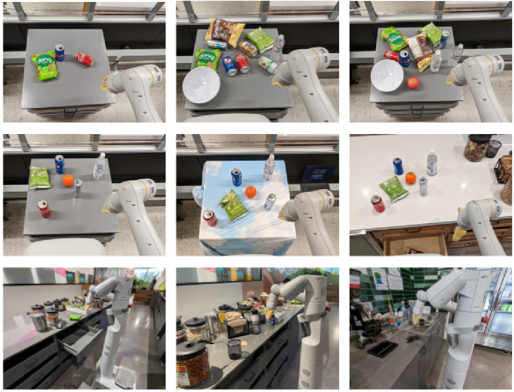

# [RT-1: Robotics Transformer for Real-World Control at Scale](https://arxiv.org/abs/2212.06817)

## Convenient Links
* [Paper (arXiv)](https://arxiv.org/abs/2212.06817)
* [Project Page](https://robotics-transformer1.github.io/)
* [Code](https://github.com/google-research/robotics_transformer)

## 1. One-Sentence Summary

RT-1 treats language-conditioned robot control as a sequence modeling problem: it maps an instruction plus a short image history to **discretized robot actions** with a compact, real-time architecture built from **FiLM-conditioned EfficientNet**, **TokenLearner**, and a **decoder-only Transformer**.

## 2. Why RT-1 Matters

RT-1 is one of the earliest papers that clearly showed a scaling-style story for embodied control on **real robots**, not just simulation. Its significance is not only that it uses a Transformer, but that it demonstrates three things together:

1. **Large-scale multi-task robot data helps**: the model is trained on about **130k demonstrations**, collected over **17 months** using **13 robots**.
2. **A single language-conditioned policy can cover hundreds of instructions**: the paper reports success on **744 instructions** grouped into multiple skills.
3. **Real-time control constraints matter**: unlike many sequence models, RT-1 is explicitly designed to run at about **3 Hz** on a real robot.

From today's perspective, RT-1 can be viewed as an important precursor to later **VLA (Vision-Language-Action)** systems.

## 3. Problem Setup

RT-1 studies **language-conditioned visuomotor policy learning**. At each timestep, the policy receives:

* a natural-language instruction `i`
* an image history `x_{0:t}`

and produces an action `a_t`:

$$
\pi_\theta(a_t \mid i, x_{0:t})
$$

The dataset consists of successful demonstration episodes:

$$
\mathcal{D} = \left\{ \left(i^{(n)}, \{(x_t^{(n)}, a_t^{(n)})\}_{t=0}^{T^{(n)}} \right) \right\}_{n=1}^{N}
$$

RT-1 is trained with **behavior cloning**, i.e. negative log-likelihood minimization:

$$
\mathcal{L}_{\text{BC}}(\theta)
=
- \sum_{n=1}^{N}\sum_{t=0}^{T^{(n)}}
\log \pi_\theta\!\left(a_t^{(n)} \mid i^{(n)}, x_{0:t}^{(n)}\right)
$$

The paper frames the problem as sequential decision making, but the actual learning recipe is imitation learning on large-scale demonstrations.

## 4. High-Level Pipeline



*Figure adapted from the paper: RT-1 overview, including architecture, training scale, and evaluation themes.*

The end-to-end path is:

```text
instruction + 6 RGB frames
-> USE text embedding
-> FiLM-conditioned EfficientNet-B3
-> 81 vision-language tokens per frame
-> TokenLearner compresses to 8 tokens per frame
-> 48 tokens over 6-frame history
-> decoder-only Transformer
-> discretized action outputs
```

The model has about **35M parameters**:

* **FiLM-EfficientNet tokenizer**: about **16M**
* **decoder-only Transformer**: about **19M**

This size is modest by LLM standards, but the paper's main point is not raw parameter count. The point is that the model is **large enough to absorb broad robot data** while still being **fast enough for closed-loop control**.

## 5. Architecture Details



*Figure adapted from the paper: detailed RT-1 architecture.*

### 5.1 Instruction and Image Tokenization

RT-1 uses a history of **6 images**, each resized to **300 x 300**. Each frame is passed through an **ImageNet-pretrained EfficientNet-B3**, producing a feature map of shape:

$$
9 \times 9 \times 512
$$

Flattening this spatial feature map yields:

$$
81 \text{ visual tokens per frame}
$$

The language instruction is embedded with the **Universal Sentence Encoder (USE)**, then injected into the image encoder through **FiLM** layers.

### 5.2 FiLM Conditioning

FiLM applies a feature-wise affine transformation conditioned on the instruction embedding:

$$
\operatorname{FiLM}(h \mid e_i)
=
\left(1 + \gamma(e_i)\right) \odot h + \beta(e_i)
$$

where:

* `h` is an intermediate visual feature
* `e_i` is the instruction embedding
* `\gamma(\cdot)` and `\beta(\cdot)` are learned functions of the instruction

This is important because RT-1 does **early language fusion**. Instead of extracting image features first and only later mixing in language, the instruction already shapes what the vision stack should pay attention to.

The paper also highlights a practical detail: the FiLM layers are **identity-initialized**, so the inserted conditioning layers do not destroy the useful behavior of the pretrained EfficientNet at the start of training.

### 5.3 TokenLearner: Compress 81 Tokens to 8

Directly feeding all visual tokens into a Transformer would be expensive:

$$
6 \text{ frames} \times 81 \text{ tokens/frame} = 486 \text{ tokens}
$$

RT-1 therefore uses **TokenLearner** to compress each frame's 81 tokens down to **8 learned tokens**:

$$
81 \rightarrow 8
$$

After this compression, the 6-frame history becomes:

$$
6 \times 8 = 48 \text{ tokens}
$$

This is a major reason RT-1 can use a Transformer while still meeting real-time latency constraints.

### 5.4 Decoder-Only Transformer Backbone

These 48 tokens are fed into an **8-layer decoder-only Transformer**. The Transformer models temporal context over the short image history and outputs the action representation for the current control step.

The paper describes this as a sequence-modeling policy:

$$
\{\xi_h\}_{h=1}^{H}
\rightarrow
\{y_k\}_{k=1}^{K}
$$

where the input sequence `\{\xi_h\}` comes from language-conditioned visual tokens and the output sequence `\{y_k\}` corresponds to action tokens.

### 5.5 Action Space and Action Tokenization

RT-1 controls a **mobile manipulator**, so one action includes:

* **7 arm dimensions**:
  * `x, y, z`
  * `roll, pitch, yaw`
  * gripper open/close
* **3 base dimensions**:
  * base `x, y, yaw`
* **1 mode switch**:
  * arm control
  * base control
  * terminate episode

So the action has **11 dimensions** in total.

For the continuous dimensions, RT-1 uses **per-dimension discretization** into 256 bins:

$$
\hat{a}_t^{(m)} = \operatorname{bin}(a_t^{(m)}),
\qquad
\hat{a}_t^{(m)} \in \{1, \dots, 256\}
$$

Training is then a sum of categorical classification losses:

$$
\mathcal{L}_{\text{action}}
=
\sum_{m=1}^{M}
\operatorname{CE}\!\left(
p_\theta^{(m)}(z_t),
\hat{a}_t^{(m)}
\right),
\qquad M = 11
$$

This design matters. A continuous Gaussian output assumes a relatively simple unimodal action distribution, while discretization gives the model a better way to represent **multi-modal action choices**.

### 5.6 Why Not Auto-Regressive Action Decoding?

The paper reports an important systems finding: **auto-regressively conditioning on action tokens slows inference by more than 2x and does not improve performance enough to justify the latency cost**.

That is why the final RT-1 design uses the decoder-only Transformer backbone, but avoids expensive auto-regressive action generation during control.

## 6. Real-Time Design Choices

RT-1 is not just "a Transformer for robots". It is a Transformer built under a latency budget.

The paper targets about **3 Hz** control and mentions an effective model inference budget of **less than 100 ms**, after accounting for other system overheads.

The main speed-ups are:

1. **Token compression with TokenLearner**
   * reduces the per-frame token count from 81 to 8
2. **Reuse of visual tokens across overlapping image windows**
   * avoids recomputing everything from scratch every control step
3. **No auto-regressive action generation**
   * avoids the largest inference-time slowdown

This real-time emphasis is one of the most important engineering contributions of the paper.

## 7. Dataset and Task Design

RT-1 is trained on a large real-world dataset collected in office-kitchen-like environments:

* about **130k demonstrations**
* **13 robots**
* **17 months** of collection
* **744 instructions**
* grouped into skills such as:
  * pick object
  * move object near object
  * place object upright
  * knock object over
  * open/close drawer
  * place into / pick from receptacles

The paper repeatedly emphasizes that **data breadth** is not a side detail. It is one of the central reasons RT-1 generalizes better than smaller, narrower robot-learning setups.

## 8. Evaluation Setup



*Figure adapted from the paper: distractor robustness, background shift, and realistic kitchen scenarios.*

The evaluation covers several axes:

1. **Seen task performance**
2. **Unseen task generalization**
3. **Distractor robustness**
4. **Background robustness**
5. **Long-horizon kitchen tasks with SayCan**
6. **Absorbing heterogeneous data**
   * simulation data
   * data from another robot morphology

This is stronger than simply reporting one average score on a fixed benchmark. RT-1 is evaluated on **more than 3000 real-world trials**.

## 9. Main Experimental Results

### 9.1 Overall Comparison

| Model | Seen Tasks | Unseen Tasks | Distractors | Backgrounds |
|---|---:|---:|---:|---:|
| Gato | 65 | 52 | 43 | 35 |
| BC-Z | 72 | 19 | 47 | 41 |
| BC-Z XL | 56 | 43 | 23 | 35 |
| **RT-1** | **97** | **76** | **83** | **59** |

The numbers show that RT-1 is not merely memorizing training behaviors. It generalizes much better across unseen instructions, distractor-heavy scenes, and new backgrounds.

### 9.2 Long-Horizon Tasks with SayCan

In two real kitchens, the paper plugs RT-1 into **SayCan** for long-horizon planning and execution.

| Method | Kitchen1 Planning | Kitchen1 Execution | Kitchen2 Planning | Kitchen2 Execution |
|---|---:|---:|---:|---:|
| Original SayCan | 73 | 47 | - | - |
| SayCan w/ Gato | 87 | 33 | 87 | 0 |
| SayCan w/ BC-Z | 87 | 53 | 87 | 13 |
| **SayCan w/ RT-1** | **87** | **67** | **87** | **67** |

This result is especially interesting because **Kitchen2** is a harder generalization setting. RT-1 maintains strong execution performance where other methods collapse.

The paper also mentions successful execution of very long tasks, up to **50 steps** in the supplementary demonstration.

### 9.3 Absorbing Simulation Data

When simulation data is added:

* performance on real tasks is roughly preserved
* performance on objects seen only in simulation jumps from **23% to 87%**
* performance on unseen skill-object combinations involving sim-only objects rises from **7% to 33%**

This is a strong sign that RT-1 is not just overfitting a single narrow real-world data source.

### 9.4 Absorbing Data from Another Robot

RT-1 is also tested with a second robot platform using Kuka bin-picking data.

Key result:

* standard classroom performance drops only slightly: **92 -> 90**
* bin-picking generalization improves substantially: **22 -> 39**

This suggests the model can absorb some cross-morphology experience without fully collapsing on its original domain.

### 9.5 Data Diversity Matters More Than Data Quantity

One of the paper's most important conclusions is:

> **Data diversity has a larger impact on generalization than raw data volume alone.**

For example, removing **25% of the task types** while keeping **97% of the data** hurts generalization roughly as much as a much larger reduction in total data size. This is a core lesson for later VLA work: **broad task coverage often matters more than simply collecting more of the same behavior**.

## 10. Why RT-1 Works

From the paper and its ablations, RT-1 works well because several design choices reinforce each other:

### 10.1 Early Language Fusion

FiLM-conditioning makes the vision encoder task-aware from early layers onward. This is more targeted than extracting purely visual features first and only fusing language later.

### 10.2 Strong Visual Pretraining

ImageNet-pretrained EfficientNet plus USE embeddings provide a strong prior before robot imitation learning even starts. The ablations show that removing pretraining significantly hurts generalization.

### 10.3 Discretized Actions Fit Multi-Modal Behavior Better

The paper's ablations show that replacing discrete action bins with continuous Gaussian outputs causes a large performance drop. This supports the idea that robot actions in diverse manipulation data are often **multi-modal**, not well approximated by a single Gaussian.

### 10.4 Transformer Capacity Without Excessive Latency

RT-1 keeps the capacity benefits of a Transformer, but only after aggressively controlling token count and inference cost. Without TokenLearner and related engineering choices, the model would likely be too slow for practical closed-loop control.

## 11. Limitations

The paper is explicit about several limitations:

1. **Imitation-learning ceiling**
   * the policy may not surpass the quality of the demonstrations it learns from
2. **Limited novelty in motion**
   * RT-1 can recombine seen concepts, but it does not truly invent entirely new motor skills
3. **Environment shift is still hard**
   * background robustness improves, but is still much lower than seen-task performance
4. **Task scope is broad but not deeply dexterous**
   * RT-1 covers many practical kitchen-like behaviors, but not highly dexterous manipulation

## 12. Relationship to Later VLA Systems

RT-1 is important historically because it clarifies a blueprint that later VLA work keeps reusing:

* **language-conditioned policy backbone**
* **large multi-task robot dataset**
* **discrete action representation**
* **scaling with heterogeneous data**

Later systems such as RT-2 push this direction further by bringing in stronger internet-scale vision-language knowledge, but RT-1 is the paper that convincingly shows the core recipe can work in **real-world multi-task robotics**.

## 13. Key Takeaway

RT-1 is not just "a robot Transformer". Its real contribution is the combination of:

* **broad real-world robot data**
* **task-aware visual tokenization**
* **efficient token compression**
* **discrete action modeling**
* **explicit real-time systems design**

That combination is what allows RT-1 to become an early and influential example of scalable **vision-language-action learning**.
