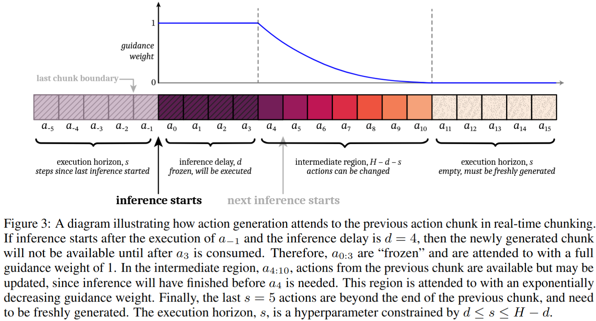

# [Real-Time Execution of Action Chunking Flow Policies](https://arxiv.org/abs/2506.07339)

## Convenient Links

* [Paper (arXiv)](https://arxiv.org/abs/2506.07339)
* [Project Page / Videos](https://pi.website/research/real_time_chunking)
* [Simulation Code](https://github.com/Physical-Intelligence/real-time-chunking-kinetix)
* [pi0 note in this repo](./Pi_0.md)
* [Diffusion Policy note in this repo](./Diffusion_Policy.md)
* [ACT / ALOHA note in this repo](./ACT.md)
* [SmolVLA note in this repo](./SmolVLA.md)

## 1. One-Sentence Summary

Real-Time Chunking (RTC) is an **inference-time algorithm** for diffusion- or flow-based action-chunking policies that runs action generation asynchronously while the robot is executing the current chunk, freezes actions that are already guaranteed to execute, and inpaints the rest of the next chunk to preserve cross-chunk continuity without retraining the policy.

## 2. Why RTC Matters

Action chunking is now common in robot policies:

```text
observation
-> policy
-> future action chunk
-> execute several actions
-> replan
```

It improves temporal consistency, but it does not remove inference latency.

For large VLAs, inference may take longer than the robot controller period. The paper gives two examples:

* pi0 spends `46 ms` on KV-cache prefill alone on an RTX 4090, before denoising
* optimized OpenVLA still reports about `321 ms` latency on an A100

For a `50 Hz` robot controller:

$$
\Delta t = 20 \text{ ms}
$$

So a policy taking `80-300 ms` cannot synchronously respond at every control tick.

Naive options are bad:

* **synchronous inference** pauses between chunks
* **naive async inference** switches to the new chunk when ready, causing discontinuities
* **temporal ensembling** averages actions from different modes, which can create invalid actions

RTC's core idea is:

> Generate the next chunk while executing the current one, but force the new chunk to be compatible with the old chunk through flow-based inpainting.

## 3. Problem Setup

An action-chunking policy is written as:

$$
\pi(A_t \mid o_t)
$$

where:

$$
A_t =
\left[
a_t,\,
a_{t+1},\,
\dots,\,
a_{t+H-1}
\right]
$$

Here:

* $H$ is the prediction horizon
* $o_t$ is the observation at controller timestep `t`
* $a_t$ is a low-level robot action

The policy predicts `H` future actions, but execution usually consumes only:

$$
s \le H
$$

actions before replanning. The paper calls `s` the **execution horizon**.

The basic chunking tradeoff is:

| Execution horizon | Behavior |
| :---------------- | :------- |
| large `s` | smoother open-loop execution, less reactive |
| small `s` | more reactive, but more likely to jump between modes |

RTC is designed to keep the reactivity of shorter horizons while avoiding cross-chunk jumps.

## 4. Flow Policy Background

RTC is described for conditional flow-matching action policies, though the paper notes that diffusion policies can be converted to flow policies at inference time.

Start from random noise:

$$
A_t^0 \sim \mathcal{N}(0, I)
$$

Then integrate the learned velocity field:

$$
A_t^{\tau + \frac{1}{n}}
=
A_t^\tau
+
\frac{1}{n}
v_\pi(A_t^\tau, o_t, \tau)
$$

where:

* $\tau \in [0, 1)$ is the flow timestep
* $n$ is the number of denoising / integration steps
* $v_\pi$ is the learned policy velocity field

After `n` steps, the model obtains a clean action chunk:

$$
A_t^1
$$

The real-time problem is not how to train this policy. RTC assumes the policy already exists.

The problem is how to execute it when:

$$
\delta > \Delta t
$$

where $\delta$ is policy inference time and $\Delta t$ is the controller period.

## 5. Inference Delay

The paper defines the inference delay:

$$
d
:=
\left\lfloor
\frac{\delta}{\Delta t}
\right\rfloor
$$

This is the number of controller timesteps that pass between observing $o_t$ and receiving the generated chunk $A_t$.

For example, if:

$$
\Delta t = 20\text{ ms},
\qquad
\delta = 97\text{ ms}
$$

then:

$$
d \approx 4
$$

In the real-robot experiments, remote inference and network latency make the effective delay larger, around:

| Setting | Approximate delay |
| :------ | ----------------: |
| base LAN setup | $d \approx 6$ |
| `+100 ms` injected latency | $d \approx 11$ |
| `+200 ms` injected latency | $d \approx 16$ |

## 6. Why Naive Async Fails

Suppose the old chunk is:

$$
A_0 =
\left[
a_{0|0},\,
a_{1|0},\,
\dots
\right]
$$

and a new chunk generated from observation at time $s-d$ is:

$$
A_{s-d}
$$

The action:

$$
a_{s|s-d}
$$

may be a valid action under the new chunk's strategy, but not continuous with:

$$
a_{s-1|0}
$$

This is especially bad when the policy distribution is multimodal.

Example:

```text
old chunk plans to go above an obstacle
new chunk plans to go below it
naive async switches halfway
-> huge out-of-distribution acceleration
```

Temporal ensembling smooths the discontinuity numerically, but averaging two valid modes can produce an invalid middle action.

## 7. RTC as Inpainting

RTC treats the next chunk as an inpainting problem.

The current chunk contains actions that overlap in time with the new chunk. Some of those actions are already guaranteed to execute because the new chunk will arrive too late to replace them.



RTC therefore:

```text
freeze the already-guaranteed actions
guide the new chunk to match overlapping actions
generate / inpaint the remaining future actions
```

This is analogous to image inpainting:

```text
known pixels -> must match
unknown pixels -> generate consistently
```

For robot actions:

```text
known old actions -> must stay compatible
unknown future actions -> generated from the latest observation
```

## 8. Guidance-Based Inpainting

RTC builds on PiGDM-style guidance for flow models.

Let:

* $Y$ be the target corrupted action chunk, constructed from the previous chunk
* $W$ be a mask or soft-mask over action positions
* $A_t^\tau$ be the current noisy action chunk

The model first estimates the final denoised chunk:

$$
\widehat{A_t^1}
=
A_t^\tau
+
(1-\tau)v(A_t^\tau, o_t, \tau)
$$

The guidance-corrected velocity is:

$$
v_{\Pi\mathrm{GDM}}(A_t^\tau,o_t,\tau)
=
v(A_t^\tau,o_t,\tau)
+
\lambda_\tau
\left(
Y - \widehat{A_t^1}
\right)^\top
\operatorname{diag}(W)
\frac{\partial \widehat{A_t^1}}{\partial A_t^\tau}
$$

where:

$$
\lambda_\tau
=
\min
\left(
\beta,\,
\frac{1-\tau}{\tau r_\tau^2}
\right)
$$

and:

$$
r_\tau^2
=
\frac{(1-\tau)^2}
{\tau^2 + (1-\tau)^2}
$$

The second term is a vector-Jacobian product. It nudges the denoising trajectory so the final chunk matches the known overlapping actions.

The clipping constant:

$$
\beta
$$

is important. Without clipping, the guidance weight can become unstable when using the small number of denoising steps typical in robot control.

In the paper's experiments:

$$
\beta = 5
$$

## 9. Soft Masking

Hard masking only constrains the first `d` actions. The paper finds this is often too weak because a small frozen prefix may not prevent the new chunk from switching modes.

RTC instead uses **soft masking** over the full overlap between the old and new chunks.

The mask weight for action index `i` is:

$$
W_i =
\begin{cases}
1,
& i < d
\\
c_i \frac{e^{c_i} - 1}{e - 1},
& d \le i < H - s
\\
0,
& i \ge H - s
\end{cases}
$$

where:

$$
c_i
=
\frac{H - s - i}
{H - s - d + 1},
\qquad
i \in \{0,\dots,H-1\}
$$

Interpretation:

| Region | Weight | Meaning |
| :----- | :----- | :------ |
| $i < d$ | `1` | actions already guaranteed to execute; match exactly |
| $d \le i < H-s$ | decays from `1` toward `0` | overlapping future actions; encourage continuity |
| $i \ge H-s$ | `0` | non-overlapping future; generate freely |

This is the key method detail. RTC does not merely freeze a prefix; it uses all overlapping actions as a soft prior.

## 10. Full RTC Runtime Loop

RTC has two loops:

```text
controller loop:
  every Delta t:
    consume next action from current chunk
    provide latest observation

background inference loop:
  wait until enough actions have been executed
  estimate inference delay d
  run guided flow inference with soft masking
  swap in the new chunk when ready
```

The background loop keeps a buffer of recent delays and conservatively estimates the next delay.

The execution horizon can vary:

$$
s = \max(d, s_{\min})
$$

where $s_{\min}$ is the user's minimum desired execution horizon.

For real-time safety, the method needs:

$$
d \le s \le H - d
$$

The first inequality means inference starts early enough. The second means there is still enough overlap to guide the next chunk.

## 11. Guided Inference Step

A simplified RTC denoising step is:

```text
estimate final chunk A_hat^1
compute weighted error against previous chunk
backprop vector-Jacobian product
add clipped guidance to velocity
take one flow integration step
```

Mathematically, define:

$$
f_{\widehat{A^1}}(A')
=
A'
+
(1-\tau)v_\pi(A', o, \tau)
$$

The weighted error is:

$$
e
=
\left(
A_{\text{prev}}
-
f_{\widehat{A^1}}(A^\tau)
\right)^\top
\operatorname{diag}(W)
$$

The guidance vector is:

$$
g
=
e
\cdot
\left.
\frac{\partial f_{\widehat{A^1}}}{\partial A'}
\right|_{A' = A^\tau}
$$

Then:

$$
A^{\tau + \frac{1}{n}}
=
A^\tau
+
\frac{1}{n}
\left[
v_\pi(A^\tau,o,\tau)
+
\lambda_\tau g
\right]
$$

This requires backpropagation through each denoising step, which is why RTC has higher per-inference latency than vanilla sampling.

## 12. Method Summary

RTC can be summarized as:

```text
given old chunk A_prev and new observation o
estimate inference delay d
build soft mask W over overlap
sample A^0 ~ N(0, I)
for each flow step:
    predict denoised chunk estimate
    guide it toward overlapping old actions
    integrate guided velocity
return new action chunk
swap it into the controller
```

Important properties:

* no retraining
* no change to the base policy
* works with flow policies
* can be applied to diffusion policies through flow conversion
* explicitly handles inference delay
* uses old chunks as constraints, not just as averaged actions

## 13. Simulation Benchmark

The paper introduces a benchmark of `12` dynamic Kinetix tasks.

Unlike quasi-static robot benchmarks, these environments require real-time corrections because:

* dynamics are force-based
* actions have injected Gaussian noise
* tasks involve throwing, catching, balancing, landing, or locomotion
* there is no "hold position while thinking" shortcut

Setup:

| Item | Setting |
| :--- | :------ |
| Environments | `12` Kinetix tasks |
| Expert policies | `6` RPO experts per environment |
| Dataset | `1M` transitions per environment |
| Learned policy | action-chunking flow policy |
| Prediction horizon | `H = 8` |
| Architecture | 4-layer MLP-Mixer |
| Training | `32` epochs |
| Evaluation | `2048` rollouts per data point |
| Simulated delay | `d = 0` to `4` |

Baselines:

| Baseline | Description |
| :------- | :---------- |
| Naive async | switches chunks as soon as the new one is ready |
| BID | rejection-sampling-based continuity method |
| Temporal ensembling | averages overlapping action predictions |
| Hard-mask RTC | RTC variant without soft overlap weights |

## 14. Simulation Results

The main simulation findings are:

* RTC is most robust as inference delay increases
* RTC outperforms BID, and the gap widens with larger delay
* BID uses much more compute by sampling many action chunks
* temporal ensembling performs poorly even at `d = 0`
* hard masking underperforms soft masking, especially at smaller delays
* RTC benefits from shorter execution horizons because it can exploit closed-loop corrections without creating chunk-boundary discontinuities

The most important qualitative result:

> In a multimodal action distribution, averaging valid chunks is not the same as producing a valid chunk.

RTC avoids this by guided sampling from the policy distribution rather than arithmetic averaging.

## 15. Real-World Evaluation

The real-world experiments use **pi0.5** as the base policy on a bimanual robot with two 6-DoF arms and parallel-jaw grippers.

Runtime setup:

| Setting | Value |
| :------ | :---- |
| Prediction horizon | `H = 50` |
| Controller period | `20 ms` |
| Control frequency | `50 Hz` |
| Denoising steps | `n = 5` |
| Vanilla model latency | `76 ms` |
| RTC model latency | `97 ms` |
| Remote inference overhead | `10-20 ms` over LAN |
| Base RTC delay | $d \approx 6$ |
| Injected latency settings | `+100 ms`, `+200 ms` |
| Injected-delay equivalents | $d \approx 11$, $d \approx 16$ |

RTC is slower per inference than vanilla pi0.5 because it backpropagates through each denoising step. But it hides this latency by running in the background while actions execute.

## 16. Real-World Tasks

The paper evaluates `6` bimanual manipulation tasks:

| Task | Steps | Cutoff | Description |
| :--- | ----: | -----: | :---------- |
| Light candle | `5` | `40s` | pick match and matchbox, strike match, light candle, drop match |
| Plug ethernet | `6` | `120s` | plug both ends of an ethernet cable into a server rack |
| Make bed, mobile | `3` | `200s` | move blanket corner and two pillows |
| Shirt folding | `1` | `300s` | fold a flattened shirt |
| Batch folding | `4` | `300s` | pick crumpled clothing, flatten, fold, stack |
| Dishes in sink, mobile | `8` | `300s` | move four varied items from a counter into a sink |

Evaluation scale:

| Item | Count |
| :--- | ----: |
| Methods / delay conditions | multiple |
| Trials per task and method | `10` |
| Total episodes | `480` |
| Pure robot execution time | `28` hours |

Each episode is scored by how many substeps are completed, and timestamps are annotated for when each substep is achieved.

## 17. Real-World Baselines

The real-world baselines are:

| Method | Behavior |
| :----- | :------- |
| Synchronous | execute `s = 25` actions, then pause while generating the next chunk |
| TE sparse | async chunking with sparse overlap plus temporal ensembling |
| TE dense | run inference as often as possible and ensemble multiple overlapping chunks |
| RTC | async guided inpainting with soft masking |

The paper does not run BID on the real robot because simulation shows it underperforms RTC and uses much more compute. Applied to pi0.5 with batch size 16, BID has about `2.3x` the latency of RTC.

## 18. Real-World Results

The main performance metric is **average throughput**:

$$
\text{throughput}
=
\frac{\text{proportion of task completed}}
{\text{episode duration}}
$$

This combines speed and task progress.

The reported findings:

* RTC has the best average throughput at all tested inference delays
* the advantage is statistically significant at `+100 ms` and `+200 ms`
* RTC shows no degradation under injected latency
* synchronous inference degrades roughly linearly as latency increases
* both temporal-ensembling variants fail at `+100 ms` and `+200 ms` because oscillations trigger robot protective stops
* RTC completes tasks faster than synchronous inference even after removing inference pauses
* RTC gives a large final-score advantage on the precision-sensitive light-candle task
* RTC also helps strongly on bed making, the hardest evaluated task

The teaser result is especially intuitive:

> RTC can light a match even with inference delays above `300 ms`, corresponding to more than `30%` of the prediction horizon.

The paper also reports that RTC performs the same match-lighting motion about `20%` faster than synchronous inference and smoother than temporal ensembling.

## 19. Latency Breakdown

The paper reports the following pi0.5 latency breakdown on an RTX 4090:

| Component | No RTC | With RTC |
| :-------- | -----: | -------: |
| Image encoders (SigLIP) | `18 ms` | `18 ms` |
| LLM prefill (Gemma 2B) | `44 ms` | `44 ms` |
| Denoising step x5 | `14 ms` | `35 ms` |
| Total | `76 ms` | `97 ms` |

The extra cost is concentrated in the denoising phase because RTC computes vector-Jacobian products for guidance.

So RTC is not a raw inference-speed trick.

It is a runtime scheduling and guided-generation trick:

```text
slightly slower chunk generation
but no robot waiting
and much smoother chunk transitions
```

## 20. Hyperparameters

The paper's RTC hyperparameters are:

| Hyperparameter | Meaning | Simulation | Real world |
| :------------- | :------ | :--------- | :--------- |
| `n` | denoising steps | `5` | `5` |
| `H` | prediction horizon | `8` | `50` |
| `s_min` | minimum execution horizon | - | `25` |
| `beta` | guidance weight clipping | `5` | `5` |
| `b` | delay buffer size | - | `10` |

The appendix reports that exponential decay in the soft mask performs best overall, with linear decay close behind. A Diffuser-style inpainting baseline helps but underperforms the guidance-based RTC method.

## 21. Comparison to Nearby Methods

| Method | Main idea | Limitation |
| :----- | :-------- | :--------- |
| Synchronous chunking | execute a chunk, then wait for next inference | pauses when inference is slow |
| Naive async | infer in background and swap chunks when ready | discontinuous strategy jumps |
| Temporal ensembling | average overlapping chunks | invalid averages under multimodal actions |
| BID | rejection sample chunks for continuity | more compute, weaker than RTC in simulation |
| Consistency / streaming policies | train or distill faster policies | requires training changes |
| RTC | inference-time inpainting against old chunk | extra VJP compute; only diffusion / flow policies |

RTC's niche is specific:

> It makes existing flow/diffusion action-chunk policies run smoothly in real time without retraining.

## 22. Limitations

The paper's main limitations are:

* RTC adds compute compared with direct sampling
* it applies only to diffusion- or flow-based policies
* it requires backpropagation during inference
* the real-world evaluation covers manipulation, not legged locomotion
* the method depends on enough chunk overlap to guide continuity
* it handles latency but does not make the underlying model faster

The paper suggests more dynamic real-world domains, such as locomotion, may benefit even more from real-time execution, but they are not tested in the real-world experiments.

## 23. Practical Takeaways

The main engineering lessons are:

1. **Action chunking alone is not enough**
   * chunks reduce inference frequency, but slow VLAs still create pauses or discontinuities

2. **Asynchronous execution needs continuity constraints**
   * simply swapping chunks when ready can create unsafe accelerations

3. **Do not average multimodal actions blindly**
   * temporal ensembling can average two valid modes into one invalid action

4. **Use overlap as an inpainting condition**
   * the previous chunk contains useful constraints for the next chunk

5. **Soft masks matter**
   * future overlapping actions should influence the new chunk less than already-guaranteed actions

6. **RTC improves throughput, not raw model latency**
   * it hides latency and improves motion continuity while adding some inference compute

## 24. Mental Model

The shortest way to remember RTC is:

```text
While the robot executes the old chunk,
generate the next chunk in the background.
Freeze actions that will already have happened.
Softly condition on the overlapping future.
Inpaint the remaining actions with the flow policy.
Swap chunks without a pause or jerk.
```

RTC is best understood as **guided asynchronous receding-horizon control for action-chunking flow policies**.
